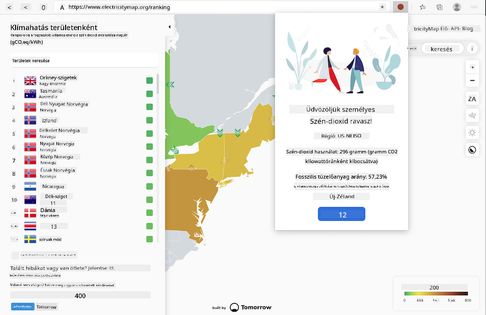

<!--
CO_OP_TRANSLATOR_METADATA:
{
  "original_hash": "b121a279a6ab39878491f3e572673515",
  "translation_date": "2025-08-28T03:38:42+00:00",
  "source_file": "5-browser-extension/README.md",
  "language_code": "hu"
}
-->
# Böngészőbővítmény készítése

A böngészőbővítmények készítése szórakoztató és érdekes módja annak, hogy más szemszögből gondolkodjunk az alkalmazásaink teljesítményéről, miközben egy eltérő típusú webes eszközt hozunk létre. Ez a modul olyan leckéket tartalmaz, amelyek bemutatják, hogyan működnek a böngészők, hogyan lehet böngészőbővítményt telepíteni, űrlapot készíteni, API-t hívni, helyi tárolót használni, valamint hogyan lehet felmérni és javítani a weboldalad teljesítményét.

Egy olyan böngészőbővítményt fogsz készíteni, amely működik Edge, Chrome és Firefox böngészőkben. Ez a bővítmény, amely egy adott feladatra szabott mini weboldalhoz hasonlít, a [C02 Signal API](https://www.co2signal.com) segítségével ellenőrzi egy adott régió villamosenergia-felhasználását és szén-dioxid-intenzitását, majd visszaadja a régió szénlábnyomának értékelését.

Ez a bővítmény ad hoc módon hívható meg a felhasználó által, miután egy API-kulcsot és régiókódot adott meg egy űrlapon. Ezáltal meghatározható a helyi villamosenergia-felhasználás, és olyan adatokat nyújt, amelyek befolyásolhatják a felhasználó villamosenergia-használati döntéseit. Például előnyösebb lehet elhalasztani egy ruhaszárító (egy szén-dioxid-intenzív tevékenység) használatát a régióban tapasztalható magas villamosenergia-felhasználás idején.

### Témakörök

1. [A böngészőről](1-about-browsers/README.md)
2. [Űrlapok és helyi tároló](2-forms-browsers-local-storage/README.md)
3. [Háttérfeladatok és teljesítmény](3-background-tasks-and-performance/README.md)

### Köszönetnyilvánítás

## Köszönetnyilvánítás

A webes szén-dioxid-figyelő ötletét Asim Hussain, a Microsoft Zöld Felhő Advocacy csapatának vezetője és a [Green Principles](https://principles.green/) szerzője ajánlotta. Eredetileg egy [weboldal projektként](https://github.com/jlooper/green) indult.

A böngészőbővítmény struktúráját [Adebola Adeniran COVID bővítménye](https://github.com/onedebos/covtension) inspirálta.

A „pont” ikonrendszer koncepcióját a [Energy Lollipop](https://energylollipop.com/) böngészőbővítmény ikonstruktúrája ihlette, amely a kaliforniai kibocsátásokat követi.

Ezeket a leckéket ♥️-val írta [Jen Looper](https://www.twitter.com/jenlooper).

---

**Felelősség kizárása**:  
Ez a dokumentum az AI fordítási szolgáltatás [Co-op Translator](https://github.com/Azure/co-op-translator) segítségével lett lefordítva. Bár törekszünk a pontosságra, kérjük, vegye figyelembe, hogy az automatikus fordítások hibákat vagy pontatlanságokat tartalmazhatnak. Az eredeti dokumentum az eredeti nyelvén tekintendő hiteles forrásnak. Kritikus információk esetén javasolt professzionális emberi fordítást igénybe venni. Nem vállalunk felelősséget semmilyen félreértésért vagy téves értelmezésért, amely a fordítás használatából eredhet.