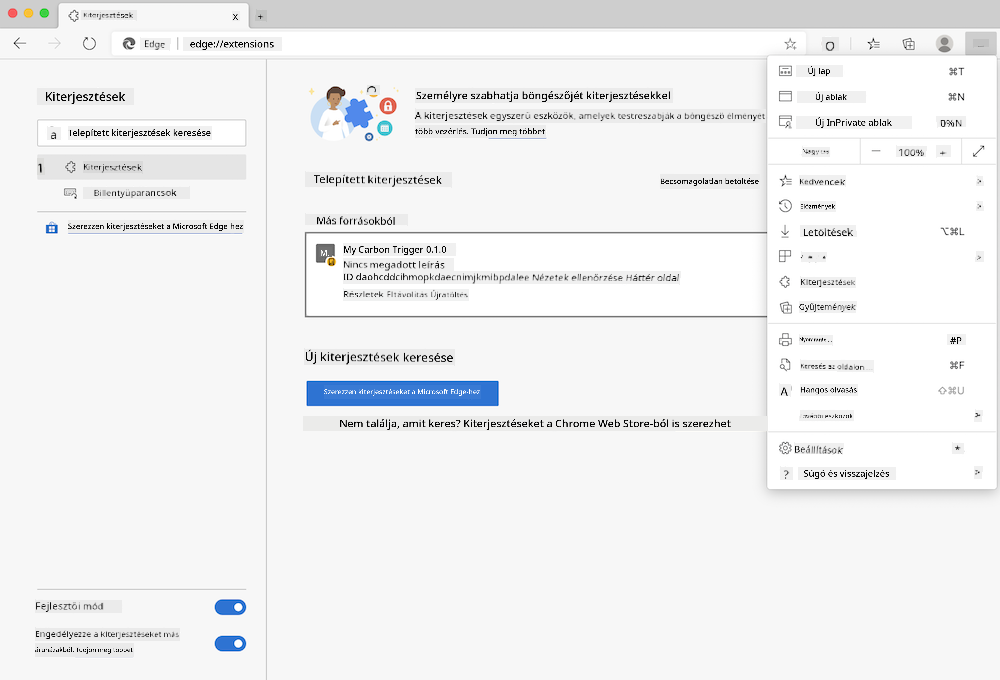

<!--
CO_OP_TRANSLATOR_METADATA:
{
  "original_hash": "dd58ae1b7707034f055718c1b68bc8de",
  "translation_date": "2025-08-28T03:46:08+00:00",
  "source_file": "5-browser-extension/solution/translation/README.hi.md",
  "language_code": "hu"
}
-->
# Carbon Trigger böngészőbővítmény: Teljes kód

A tmrow CO2 Signal API-ját használva az áramfogyasztás nyomon követésére, egy böngészőbővítményt hozunk létre, amely emlékeztetőt ad arról, hogy az Ön régiójában mennyire terhelt az áramhasználat. Ennek a bővítménynek az alkalmi használata segíthet abban, hogy ezen információk alapján döntsön a tevékenységeiről.


## Kezdés

Először telepítse az [npm](https://npmjs.com) csomagot. Töltse le a kód egy példányát a számítógépére egy mappába.

Telepítse az összes szükséges csomagot:

```
npm install
```

Hozza létre a bővítményt a Webpack segítségével:

```
npm run build
```

Az Edge böngészőben való telepítéshez használja a böngésző jobb felső sarkában található 'három pont' menüt az Extension Panel megkereséséhez. Ott válassza a 'Load unpacked' opciót egy új bővítmény betöltéséhez. A megjelenő ablakban nyissa meg a 'dist' mappát, és a bővítmény betöltődik. A használathoz szüksége lesz egy CO2 Signal API kulcsra ([e-mailben itt szerezhető be](https://www.co2snal.com/) - adja meg e-mail címét az oldalon található mezőben), valamint [az Ön régiójának kódjára](http://api.electricitymap.org/v3/zones) az [Electricity Map](https://www.electricitymap.org/map) oldalról (például Boston esetében én az 'US-NEISO' kódot használom).



Miután az API kulcsot és a régiót megadta a bővítmény felületén, a böngésző bővítménysávjában megjelenő színes pontnak tükröznie kell az Ön régiójának energiahasználatát, és jeleznie kell, hogy az energiaigényes tevékenységek mennyire megfelelőek az adott időpontban. Ennek a 'pont' rendszernek a koncepcióját a kaliforniai kibocsátásokhoz készült [Energy Lollipop bővítmény](https://energylollipop.com/) inspirálta.

---

**Felelősség kizárása**:  
Ez a dokumentum az AI fordítási szolgáltatás, a [Co-op Translator](https://github.com/Azure/co-op-translator) segítségével lett lefordítva. Bár törekszünk a pontosságra, kérjük, vegye figyelembe, hogy az automatikus fordítások hibákat vagy pontatlanságokat tartalmazhatnak. Az eredeti dokumentum az eredeti nyelvén tekintendő hiteles forrásnak. Fontos információk esetén javasolt professzionális, emberi fordítást igénybe venni. Nem vállalunk felelősséget semmilyen félreértésért vagy téves értelmezésért, amely a fordítás használatából eredhet.