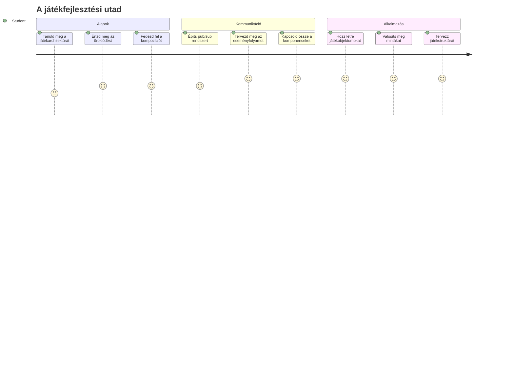
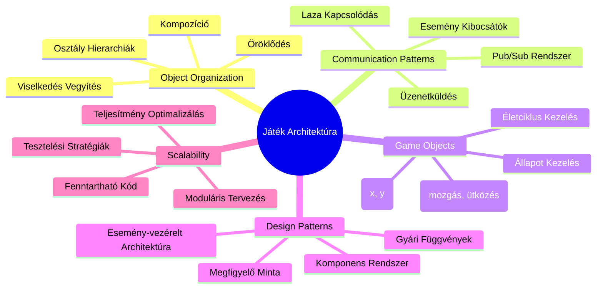
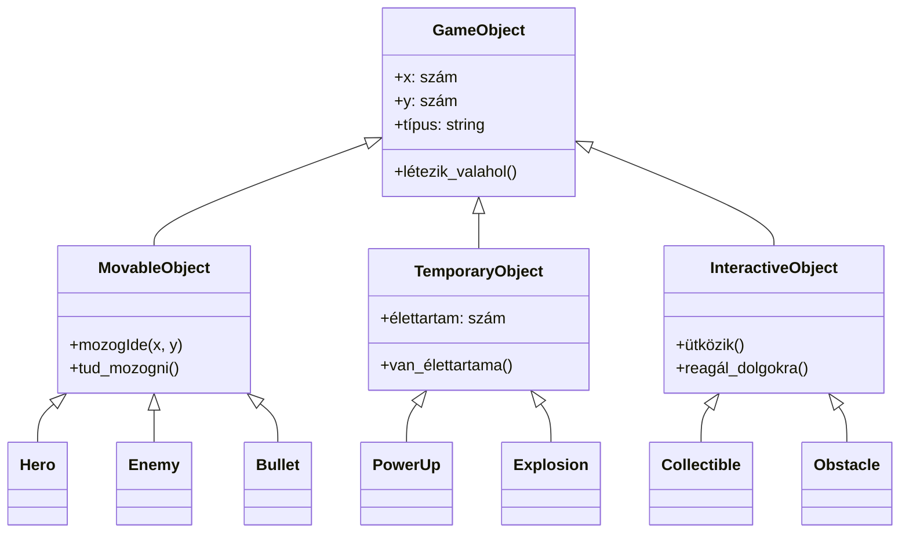
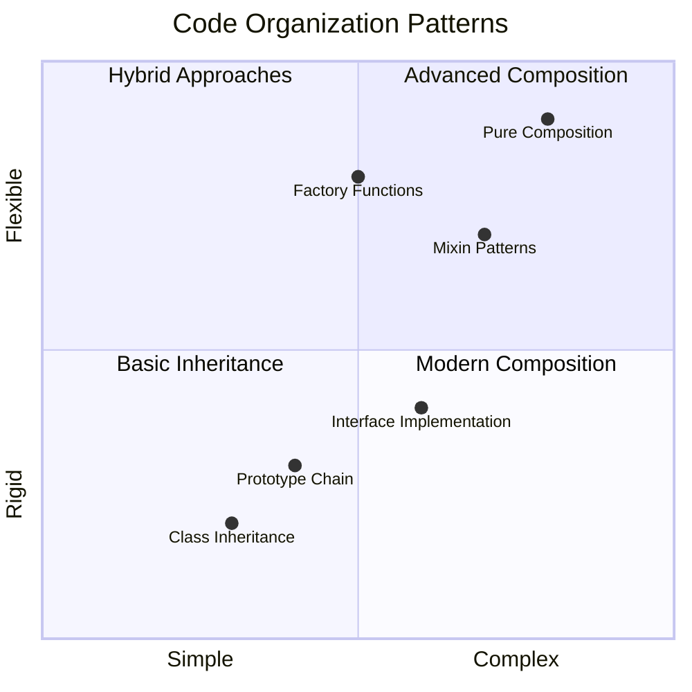
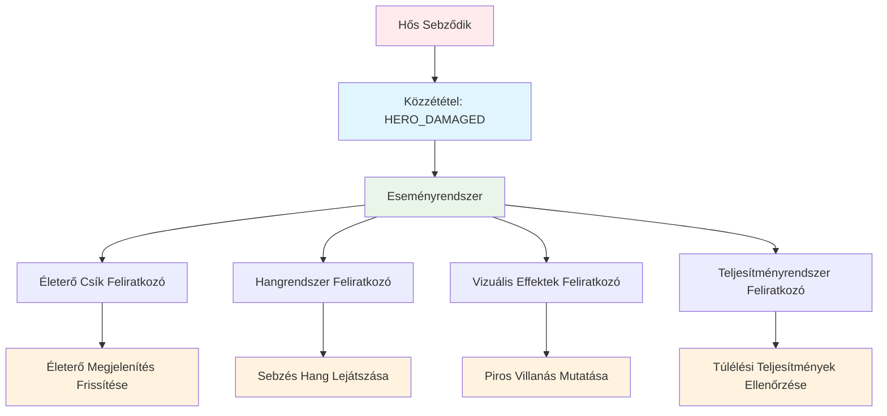
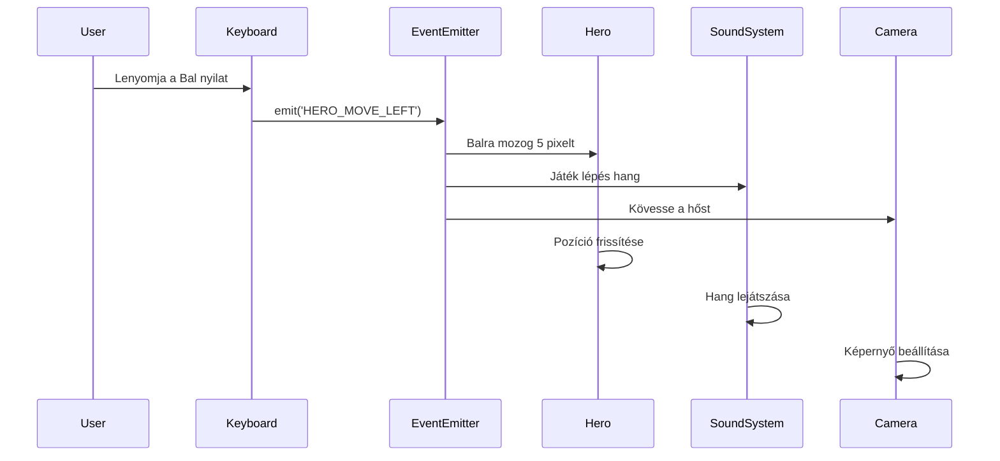
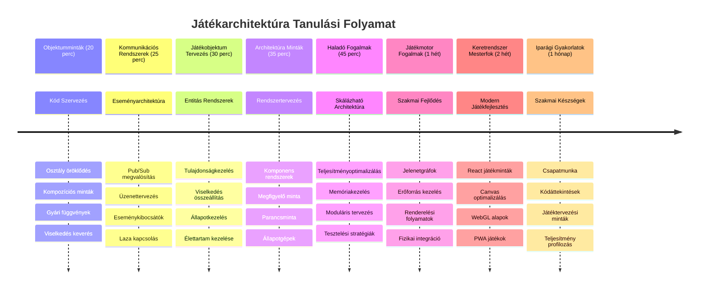

# Űrjáték készítése 1. rész: Bevezetés




Ahogy a NASA küldetésirányítója több rendszert koordinál az űrlövöldözés során, úgy mi is építünk egy űrjátékot, amely bemutatja, hogyan működhetnek együtt zökkenőmentesen egy program különböző részei. Miközben valami játszhatót hozol létre, megtanulod az alapvető programozási fogalmakat, amelyek bármely szoftverprojektre alkalmazhatók.

Két alapvető kódszervezési megközelítést vizsgálunk meg: öröklődés és komponálás. Ezek nem csupán elméleti fogalmak – ugyanazok a minták működtetik a videojátékoktól a bankszámlákig mindent. Bevezetjük továbbá a pub/sub kommunikációs rendszert, amely a űrhajók kommunikációs hálózataihoz hasonlóan működik, lehetővé téve, hogy a különböző komponensek információt osszanak meg egymással anélkül, hogy függőségek jönnének létre.

A sorozat végére megérted, hogyan építhetsz olyan alkalmazásokat, amelyek skálázhatók és fejlődhetnek – akár játékokról, webalkalmazásokról vagy bármilyen más szoftverrendszerről van szó.


## Előadás előtti kvíz

[Előadás előtti kvíz](https://ff-quizzes.netlify.app/web/quiz/29)

## Öröklődés és komponálás játékfejlesztésben

Ahogy a projektek egyre összetettebbé válnak, a kód szervezése kritikus lesz. Ami egyszerű szkriptként indul, anélkül, hogy megfelelő struktúrát kapna, nehezen karbantarthatóvá válhat – ugyanúgy, ahogy az Apollo küldetések is gondos koordinációt igényeltek több ezer komponens között.

Két alapvető megközelítést vizsgálunk meg a kód szervezésére: öröklődés és komponálás. Mindkettőnek megvannak a maga előnyei, és mindkettő megértése segít kiválasztani a helyes módszert különböző szituációkban. Ezeket a fogalmakat űrjátékunkon keresztül mutatjuk be, ahol hősök, ellenségek, felszerelések és más objektumok hatékonyan kell, hogy együttműködjenek.

✅ Az egyik legismertebb programozási könyv kapcsolatban áll a [tervezési mintákkal](https://en.wikipedia.org/wiki/Design_Patterns).

Bármilyen játékban léteznek `játékobjektumok` – azok az interaktív elemek, amelyekkel a játék világát megtöltjük. Hősök, ellenségek, felszerelések és vizuális effektek mind játékobjektumok. Mindegyik egy adott képernyőkoordinátán létezik `x` és `y` értékekkel, hasonlóan a koordinátarendszeren való pontrajzoláshoz.

Vizualitásuk eltér, de ezek az objektumok gyakran megosztanak alapvető viselkedéseket:

- **Valahol léteznek** – minden objektumnak van x és y koordinátája, hogy a játék tudja, hol rajzolja ki őket
- **Sokan mozognak is** – hősök futnak, ellenségek üldöznek, lövedékek repülnek
- **Élettartamuk van** – néhány örökre ott marad, mások (mint például robbanások) rövid ideig jelennek meg és eltűnnek
- **Reagálnak dolgokra** – ha ütköznek, felszereléseket gyűjtenek össze, frissítik az életerő sávot

✅ Gondolj egy játékra, például a Pac-Man-re. Meg tudod nevezni a fent felsorolt négy objektumtípust ebben a játékban?


### Viselkedés kifejezése kóddal

Most, hogy érted azokat az általános viselkedéseket, amelyeket a játékobjektumok megosztanak, nézzük meg, hogyan lehet ezeket megvalósítani JavaScript-ben. Objektumviselkedést kifejezhetsz osztályokhoz vagy egyedi objektumokhoz kötött metódusokon keresztül, és több megközelítés közül választhatsz.

**Osztály alapú megközelítés**

Az osztályok és az öröklődés strukturált módot adnak a játékobjektumok rendszerezésére. Hasonlóan Carl Linnaeus taxonómiai besorolási rendszeréhez: egy alap osztállyal kezdünk, amely tartalmazza az alapvető tulajdonságokat, majd specializált osztályokat hozunk létre, amelyek öröklik ezeket az alapokat, miközben további specifikus képességeket adnak hozzá.

✅ Az öröklődés fontos fogalom, amit érdemes megérteni. Tudj meg többet a [MDN öröklődéssel foglalkozó cikkéből](https://developer.mozilla.org/docs/Web/JavaScript/Inheritance_and_the_prototype_chain).

Így valósíthatod meg a játékobjektumokat osztályok és öröklődés segítségével:

```javascript
// 1. lépés: Hozd létre az alap GameObject osztályt
class GameObject {
  constructor(x, y, type) {
    this.x = x;
    this.y = y;
    this.type = type;
  }
}
```

**Nézzük meg lépésről lépésre:**
- Létrehozunk egy alap sablont, amit minden játékobjektum használhat
- A konstruktor eltárolja, hogy hol van az objektum (`x`, `y`) és milyen típusú
- Ez szolgál majd alapul minden játékobjektumod építéséhez

```javascript
// 2. lépés: Mozgásképesség hozzáadása örökléssel
class Movable extends GameObject {
  constructor(x, y, type) {
    super(x, y, type); // Szülő konstruktorának meghívása
  }

  // Mozgási képesség hozzáadása egy új pozícióra
  moveTo(x, y) {
    this.x = x;
    this.y = y;
  }
}
```

**A fenti kódban:**
- **Kiterjesztettük** a GameObject osztályt, hogy mozgási funkciót adjunk hozzá
- **Meghívtuk** a szülő konstruktorát a `super()` használatával az örökölt tulajdonságok inicializálásához
- **Hozzáadtunk** egy `moveTo()` metódust, amely frissíti az objektum helyzetét

```javascript
// 3. lépés: Hozz létre specifikus játéktípusokat
class Hero extends Movable {
  constructor(x, y) {
    super(x, y, 'Hero'); // Állítsd be a típust automatikusan
  }
}

class Tree extends GameObject {
  constructor(x, y) {
    super(x, y, 'Tree'); // A fák nem mozognak
  }
}

// 4. lépés: Használd a játéktárgyaidat
const hero = new Hero(0, 0);
hero.moveTo(5, 5); // A hős tud mozogni!

const tree = new Tree(10, 15);
// tree.moveTo() hibát okozna – a fák nem tudnak mozogni
```

**E fogalmak megértése:**
- **Létrehoz** specializált objektumtípusokat, amelyek öröklik a megfelelő viselkedéseket
- **Bemutatja**, hogy az öröklődés hogyan teszi lehetővé a szelektív funkciók beépítését
- **Megmutatja**, hogy a hősök mozoghatnak, miközben a fák mozdulatlanok maradnak
- **Ilusztrálja**, hogy az osztályhierarchia megakadályozza a nem megfelelő műveleteket

✅ Szánj néhány percet arra, hogy újragondolj egy Pac-Man hőst (például Inky, Pinky vagy Blinky) és hogy hogyan írnád le JavaScript-ben.

**Komponálás alapú megközelítés**

A komponálás moduláris tervezési filozófiát követ, hasonlóan ahhoz, ahogy a mérnökök űrhajókat terveznek, cserélhető komponensekből. Ahelyett, hogy egy szülőosztályból örökölnél, kombinálod az egyes viselkedéseket, hogy olyan objektumot hozz létre, amely pontosan a szükséges funkciókkal rendelkezik. Ez a megközelítés rugalmasságot kínál merev hierarchikus korlátok nélkül.

```javascript
// 1. lépés: Hozza létre az alap viselkedési objektumokat
const gameObject = {
  x: 0,
  y: 0,
  type: ''
};

const movable = {
  moveTo(x, y) {
    this.x = x;
    this.y = y;
  }
};
```

**Ez a kód a következőket teszi:**
- **Definiál** egy alap `gameObject`-et pozícióval és típus tulajdonságokkal
- **Létrehoz** egy külön `movable` viselkedésobjektumot, amely mozgási funkcióval bír
- **Elkülöníti** a pozíció adatait a mozgási logikától, így függetlenek

```javascript
// 2. lépés: Objektumok összeállítása viselkedések kombinálásával
const movableObject = { ...gameObject, ...movable };

// 3. lépés: Gyártófüggvények létrehozása különböző objektumtípusokhoz
function createHero(x, y) {
  return {
    ...movableObject,
    x,
    y,
    type: 'Hero'
  };
}

function createStatic(x, y, type) {
  return {
    ...gameObject,
    x,
    y,
    type
  };
}
```

**A fenti kódban:**
- **Összekapcsoltuk** az alapobjektum tulajdonságait a mozgási viselkedéssel a spread szintaxissal
- **Gyártó függvényeket** hoztunk létre, amelyek testreszabott objektumokat adnak vissza
- **Lehetővé tettük** a rugalmas objektumlétrehozást merev osztályhierarchiák nélkül
- **Engedélyeztük** az objektumoknak, hogy pontosan a szükséges viselkedésekkel rendelkezzenek

```javascript
// 4. lépés: Hozd létre és használd az összetett objektumaidat
const hero = createHero(10, 10);
hero.moveTo(5, 5); // Tökéletesen működik!

const tree = createStatic(0, 0, 'Tree');
// tree.moveTo() nincs definiálva - nem készült mozgás viselkedés
```

**Fontos szempontok:**
- **Objektumokat épít össze** viselkedések keverésével öröklés helyett
- **Több rugalmasságot biztosít**, mint a merev öröklési hierarchiák
- **Lehetővé teszi**, hogy az objektumok pontosan a szükséges jellemzőkkel bírjanak
- **Modern JavaScript spread szintaxist használ** tiszta objektum összekapcsolásra

```

**Which Pattern Should You Choose?**

**Which Pattern Should You Choose?**



> 💡 **Hasznos tipp**: Mindkét minta helye van a modern JavaScript fejlesztésben. Az osztályok jól működnek jól definiált hierarchiákhoz, míg a komponálás akkor ragyog, ha maximális rugalmasságra van szükség.
> 
**Mikor melyiket válaszd:**
- **Öröklődést válassz**, ha egyértelmű "egy-más" kapcsolat van (egy Hős *egy* Mozgatható objektum)
- **Komponálást válassz**, ha "van valami" kapcsolat van (egy Hős *rendelkezik* mozgásképességgel)
- **Vedd figyelembe** a csapatod preferenciáit és a projekt kívánalmait
- **Emlékezz**, hogy a két megközelítés vegyíthető ugyanabban az alkalmazásban

### 🔄 **Pedagógiai ellenőrzés**
**Objektumszervezési megértés**: Mielőtt a kommunikációs mintákra térnél, győződj meg róla, hogy képes vagy:
- ✅ Megmagyarázni az öröklődés és a komponálás közötti különbséget
- ✅ Azonosítani, mikor érdemes osztályokat, és mikor gyártó függvényeket használni
- ✅ Megérteni, hogyan működik a `super()` kulcsszó az öröklődésben
- ✅ Felismerni az egyes megközelítések előnyeit a játékfejlesztésben

**Gyors önellenőrzés**: Hogyan hoznál létre egy Repülő Ellenséget, amely mozogni és repülni is tud?
- **Öröklődés**: `class FlyingEnemy extends Movable`
- **Komponálás**: `{ ...movable, ...flyable, ...gameObject }`

**Valós kapcsolódás**: Ezek a minták mindenhol jelen vannak:
- **React komponensek**: Props (komponálás) vs osztály öröklés
- **Játék motorok**: Enitity-component rendszerek komponálást használnak
- **Mobil alkalmazások**: UI keretrendszerek gyakran öröklési hierarchiákat alkalmaznak

## Kommunikációs minták: a Pub/Sub rendszer

Ahogy az alkalmazások egyre összetettebbé válnak, a komponensek közti kommunikáció kezelése egyre kihívásosabb lesz. A fel-/lefizetési minta (publish-subscribe, pub/sub) megoldást kínál erre a problémára olyan elvekkel, amelyek hasonlítanak a rádiós sugárzásra – egy adó több vevőt is elér anélkül, hogy tudná, kik figyelnek.

Gondolj arra, mi történik, amikor egy hős sérülést szenved: az életerő sáv frissül, hanghatások szólnak, vizuális visszajelzés jelenik meg. Ahelyett, hogy a hős objektum közvetlenül kötődne ezekhez a rendszerekhez, a pub/sub lehetővé teszi, hogy a hős egy „sebzés érte” üzenetet sugározzon. Bárki, aki reagálni akar erre az eseménytípusra, feliratkozhat rá és kezelheti.

✅ A Pub/Sub a 'publish-subscribe' rövidítése


### A Pub/Sub architektúra megértése

A pub/sub minta lehetővé teszi, hogy az alkalmazás különböző részei lazán kapcsolódjanak össze, ami azt jelenti, hogy együtt dolgozhatnak anélkül, hogy közvetlenül függenének egymástól. Ez a szétválasztás fenntarthatóbbá, tesztelhetőbbé és változásra rugalmasabbá teszi a kódot.

**A publikus-feliratkozás kulcsszereplői:**
- **Üzenetek** – Egyszerű szöveges címkék, mint `'PLAYER_SCORED'`, amelyek leírják, mi történt (plusz további adatok)
- **Kiadók** – Az objektumok, amelyek kiáltják: "Valami történt!" bárkinek, aki hallgat
- **Feliratkozók** – Az objektumok, amelyek azt mondják: "Érdekel ez az esemény", és reagálnak, amikor megtörténik
- **Eseményrendszer** – A közvetítő, amely biztosítja, hogy az üzenetek eljussanak a megfelelő hallgatókhoz

### Eseményrendszer létrehozása

Készítsünk egy egyszerű, ám hatékony eseményrendszert, amely bemutatja ezeket az elveket:

```javascript
// 1. lépés: Hozd létre az EventEmitter osztályt
class EventEmitter {
  constructor() {
    this.listeners = {}; // Tárold az összes eseményfigyelőt
  }
  
  // Regisztrálj egy figyelőt egy adott üzenettípusra
  on(message, listener) {
    if (!this.listeners[message]) {
      this.listeners[message] = [];
    }
    this.listeners[message].push(listener);
  }
  
  // Küldj egy üzenetet az összes regisztrált figyelőnek
  emit(message, payload = null) {
    if (this.listeners[message]) {
      this.listeners[message].forEach(listener => {
        listener(message, payload);
      });
    }
  }
}
```

**Mit csinál a kód itt:**
- **Létrehoz** egy központi eseménykezelő rendszert egyszerű osztállyal
- **Tárolja** a hallgatókat egy üzenettípus által szervezett objektumban
- **Regisztrál** új hallgatókat az `on()` metódussal
- **Sugároz** üzeneteket az összes érdeklődő hallgatónak az `emit()` segítségével
- **Támogat** opcionális adatok küldését az információátadáshoz

### Mindezt egybe foglalva: egy gyakorlati példa

Lássuk működés közben! Készítünk egy egyszerű mozgásrendszert, amely megmutatja, milyen tiszta és rugalmas lehet a pub/sub:

```javascript
// 1. lépés: Határozd meg az üzenettípusaidat
const Messages = {
  HERO_MOVE_LEFT: 'HERO_MOVE_LEFT',
  HERO_MOVE_RIGHT: 'HERO_MOVE_RIGHT',
  ENEMY_SPOTTED: 'ENEMY_SPOTTED'
};

// 2. lépés: Hozd létre az eseményrendszered és a játékelemeket
const eventEmitter = new EventEmitter();
const hero = createHero(0, 0);
```

**A kód a következőket teszi:**
- **Definiál** egy konstans objektumot, hogy elkerülje az üzenetnevek elírását
- **Létrehoz** egy eseménykibocsátó példányt az összes kommunikáció kezelésére
- **Inicializál** egy hős objektumot a kezdő pozícióban

```javascript
// 3. lépés: Állítsd be az eseményfigyelőket (feliratkozókat)
eventEmitter.on(Messages.HERO_MOVE_LEFT, () => {
  hero.moveTo(hero.x - 5, hero.y);
  console.log(`Hero moved to position: ${hero.x}, ${hero.y}`);
});

eventEmitter.on(Messages.HERO_MOVE_RIGHT, () => {
  hero.moveTo(hero.x + 5, hero.y);
  console.log(`Hero moved to position: ${hero.x}, ${hero.y}`);
});
```

**A fenti kódban:**
- **Regisztrált** eseményhallgatókat, amelyek reagálnak a mozgás üzenetekre
- **Frissítette** a hős pozícióját a mozgásirány alapján
- **Hozzáadott** konzol logolást a hős pozíciójának követésére
- **Elválasztotta** a mozgás logikáját a bemeneti kezelésről

```javascript
// 4. lépés: Csatlakoztassa a billentyűzet bemenetet az eseményekhez (közzétevőkhöz)
window.addEventListener('keydown', (event) => {
  switch(event.key) {
    case 'ArrowLeft':
      eventEmitter.emit(Messages.HERO_MOVE_LEFT);
      break;
    case 'ArrowRight':
      eventEmitter.emit(Messages.HERO_MOVE_RIGHT);
      break;
  }
});
```

**Mit tanulsz a példából:**
- **Kapcsolja össze** a billentyűzet bemenetet a játék eseményeivel lazán kapcsolódva
- **Lehetővé teszi** a bemeneti rendszernek, hogy közvetetten kommunikáljon a játékobjektumokkal
- **Engedi**, hogy több rendszer reagáljon ugyanarra a billentyűleütésre
- **Megkönnyíti** a gombkiosztás módosítását vagy új bemeneti módszerek hozzáadását


> 💡 **Hasznos tipp**: Ennek a mintának az egyik szépsége a rugalmasság! Egyszerűen hozzáadhatsz hanghatásokat, képernyőrezgést vagy részecskeeffekteket többleteseményhallgatók hozzáadásával – nem kell módosítanod a meglévő billentyűzet vagy mozgás kódot.
> 
**Miért fogod szeretni ezt a megközelítést:**
- Az új funkciók hozzáadása nagyon egyszerűvé válik – csak hallgass az érdekes eseményekre
- Több dolog is reagálhat ugyanarra az eseményre anélkül, hogy összeakadnának
- A tesztelés sokkal könnyebb, mert az egyes részek függetlenül működnek
- Ha valami elromlik, pontosan tudod, hol keress

### Miért skálázódik jól a Pub/Sub

A pub/sub minta fenntartja az egyszerűséget, miközben az alkalmazások egyre összetettebbé válnak. Legyen szó több tucat ellenségről, dinamikus UI frissítésekről vagy hangrendszerekről, a minta kezeli a növekedést anélkül, hogy az architektúrát meg kellene változtatni. Az új funkciók zökkenőmentesen illeszkednek a meglévő eseményrendszerbe anélkül, hogy befolyásolnák az eddigi működést.

> ⚠️ **Gyakori hiba**: Ne hozz létre túl sok specifikus üzenettípust túl korán. Kezdj széles kategóriákkal, és finomítsd őket, ahogy a játék igényei tisztulnak.
> 
**Ajánlott gyakorlatok:**
- **Csoportosítsd** az üzeneteket logikus kategóriákba
- **Használj** egyértelmű neveket, amelyek leírják, mi történt
- **Tartsd** egyszerűen és fókuszáltan az üzenet adatait
- **Dokumentáld** az üzenettípusokat a csapatmunka érdekében

### 🔄 **Pedagógiai ellenőrzés**
**Eseményvezérelt architektúra megértése**: Ellenőrizd a rendszerről szerzett tudásod:
- ✅ Hogyan akadályozza meg a pub/sub minta a szoros összekapcsolódást a komponensek között?
- ✅ Miért könnyebb új funkciókat hozzáadni eseményvezérelt architektúrával?
- ✅ Mi a szerepe az EventEmitternek a kommunikációban?
- ✅ Hogyan segítenek az üzenetkonstansok a hibák elkerülésében és a fenntarthatóságban?

**Tervezési kihívás**: Hogyan kezelnéd a következő játékhelyzeteket pub/sub segítségével?
1. **Az ellenség meghal**: Pontszám frissítés, hang lejátszás, power-up megjelenítés, eltávolítás a képernyőről
2. **Szint teljesítve**: Zene leállítása, felület megjelenítése, előrehaladás mentése, következő szint betöltése
3. **Power-up begyűjtve**: Képességek fejlesztése, UI frissítés, effekt lejátszás, időzítő indítása

**Szakmai kapcsolat**: Ez a minta megjelenik:
- **Frontend keretrendszerekben**: React/Vue eseményrendszerek
- **Backend szolgáltatásokban**: Mikroservice kommunikáció
- **Játék motorokban**: Unity eseményrendszer
- **Mobilfejlesztésben**: iOS/Android értesítési rendszerek

---

## GitHub Copilot Agent kihívás 🚀

Használd az Agent módot a következő kihívás megoldásához:

**Leírás:** Készíts egy egyszerű játékobjektum rendszert mind öröklődéssel, mind pub/sub mintával. Valósíts meg egy alapvető játékot, ahol a különböző objektumok eseményeken keresztül kommunikálnak egymással anélkül, hogy közvetlenül tudnának egymásról.

**Feladat:** Hozz létre egy JavaScript játék rendszert a következő követelményekkel: 1) Készíts egy alap GameObject osztályt x, y koordinátákkal és típus tulajdonsággal. 2) Készíts egy Hero osztályt, amely kiterjeszti a GameObject-et és tud mozogni. 3) Készíts egy Enemy osztályt, amely szintén kiterjeszti a GameObject-et és tudja üldözni a hőst. 4) Valósíts meg egy EventEmitter osztályt a pub/sub mintához. 5) Állíts be eseményhallgatókat úgy, hogy mikor a hős mozog, a közeli ellenségek 'HERO_MOVED' eseményt kapjanak és frissítsék pozíciójukat, hogy a hős felé mozogjanak. Konzol.log segítségével mutasd be az objektumok közti kommunikációt.

Tudj meg többet az [agent módról](https://code.visualstudio.com/blogs/2025/02/24/introducing-copilot-agent-mode).

## 🚀 Kihívás
Gondold át, hogyan javíthatja a pub-sub minta a játék architektúráját. Határozd meg, mely összetevőknek kell eseményeket kibocsátaniuk, és hogyan kell a rendszernek reagálnia. Tervezd meg egy játék koncepcióját, és térképezd fel az összetevők közötti kommunikációs mintákat.

## Előadás utáni kvíz

[Előadás utáni kvíz](https://ff-quizzes.netlify.app/web/quiz/30)

## Áttekintés & Önálló tanulás

Tanulj többet a Pub/Sub-ról a [róluk szóló olvasmányban](https://docs.microsoft.com/azure/architecture/patterns/publisher-subscriber/?WT.mc_id=academic-77807-sagibbon).

### ⚡ **Mit tehetsz a következő 5 percben**
- [ ] Nyiss meg bármilyen HTML5 játékot online, és vizsgáld meg a kódját a DevTools segítségével
- [ ] Hozz létre egy egyszerű HTML5 Canvas elemet, és rajzolj egy alapvető formát
- [ ] Próbáld ki a `setInterval` használatát egy egyszerű animációs ciklus létrehozásához
- [ ] Fedezd fel a Canvas API dokumentációját, és próbálj ki egy rajzoló metódust

### 🎯 **Mit érhetsz el ezen az órán**
- [ ] Töltsd ki a tanóra utáni kvízt, és értsd meg a játékfejlesztés fogalmait
- [ ] Állítsd be a játékprojekted struktúráját HTML, CSS és JavaScript fájlokkal
- [ ] Készíts egy egyszerű játékhurokot, amely folyamatosan frissít és renderel
- [ ] Rajzold meg az első játék sprite-jaidat a vásznon
- [ ] Valósítsd meg az alapvető eszközbetöltést képekhez és hangokhoz

### 📅 **Heti játék készítésed**
- [ ] Fejezd be a teljes űrjátékot az összes tervezett funkcióval
- [ ] Adj hozzá kifinomult grafikákat, hangeffekteket és sima animációkat
- [ ] Valósíts meg játékállapotokat (kezdőképernyő, játék, játék vége)
- [ ] Készíts pontozórendszert és játékos előrehaladás követést
- [ ] Tedd játékodat reszponzívvá és elérhetővé különböző eszközökön
- [ ] Oszd meg a játékodat online, és gyűjts visszajelzést a játékosoktól

### 🌟 **Havi játékfejlesztésed**
- [ ] Építs több játékot különböző műfajokat és mechanikákat felfedezve
- [ ] Tanulj meg egy játékfejlesztő keretrendszert, például Phaser-t vagy Three.js-t
- [ ] Vegyél részt nyílt forráskódú játékfejlesztési projektekben
- [ ] Sajátítsd el a haladó játékprogramozási mintákat és optimalizációkat
- [ ] Készíts portfóliót, amely bemutatja játékfejlesztési képességeidet
- [ ] Mentorálj másokat, akik érdeklődnek a játékfejlesztés és interaktív média iránt

## 🎯 Játékfejlesztési mesteri ütemterved


### 🛠️ Játékarchitektúra szerszámosládád összefoglalója

A leckét befejezve most már rendelkezel:
- **Tervezési minták ismerete**: Az öröklődés és kompozíció kompromisszumainak megértése
- **Eseményvezérelt architektúra**: Pub/sub megvalósítás skálázható kommunikációhoz
- **Objektumorientált tervezés**: Osztályhierarchiák és viselkedés kompozíciója
- **Modern JavaScript**: Gyári függvények, spread szintaxis és ES6+ minták
- **Skálázható architektúra**: Laza kapcsolódás és moduláris tervezési elvek
- **Játékfejlesztés alapjai**: Entitás rendszerek és komponens minták
- **Professzionális minták**: Iparág-szintű kódszervezési megközelítések

**Valós alkalmazások**: Ezek a minták közvetlenül alkalmazhatók:
- **Frontend keretrendszerek**: React/Vue komponens architektúra és állapotkezelés
- **Backend szolgáltatások**: Mikroszolgáltatás kommunikáció és eseményvezérelt rendszerek
- **Mobil fejlesztés**: iOS/Android alkalmazás architektúra és értesítési rendszerek
- **Játék motorok**: Unity, Unreal és web alapú játékfejlesztés
- **Vállalati szoftverek**: Eseményforrás-kezelés és elosztott rendszertervezés
- **API tervezés**: RESTful szolgáltatások és valós idejű kommunikáció

**Professzionális készségek**: Most már képes vagy:
- **Tervezni** skálázható szoftverarchitektúrákat bevált minták alapján
- **Megvalósítani** eseményvezérelt rendszereket bonyolult interakciók kezelésére
- **Választani** megfelelő kódszervezési stratégiákat különböző helyzetekben
- **Hibakeresni** és karbantartani lazán kötött rendszereket hatékonyan
- **Kommunikálni** technikai döntéseket iparági szabványos terminológiával

**Következő szint**: Készen állsz arra, hogy ezeket a mintákat valós játékban használd, fedezd fel a haladó játékfejlesztési témákat, vagy alkalmazd ezeket az architekturális elveket webalkalmazásokban!

🌟 **Elért eredmény**: Elsajátítottad az alapvető szoftverarchitektúra mintákat, amelyek működtetik az egyszerű játékoktól a komplex vállalati rendszerekig mindent!

## Feladat

[Játékvázlat készítése](assignment.md)

---

<!-- CO-OP TRANSLATOR DISCLAIMER START -->
**Jogi nyilatkozat**:
Ez a dokumentum az AI fordító szolgáltatás [Co-op Translator](https://github.com/Azure/co-op-translator) segítségével készült. Bár a pontosságra törekszünk, kérjük, vegye figyelembe, hogy az automatikus fordítások hibákat vagy pontatlanságokat tartalmazhatnak. Az eredeti dokumentum az anyanyelvén tekintendő hiteles forrásnak. Fontos információk esetén professzionális emberi fordítást javaslunk. Nem vállalunk felelősséget a fordítás használatából eredő félreértésekért vagy félreértelmezésekért.
<!-- CO-OP TRANSLATOR DISCLAIMER END -->