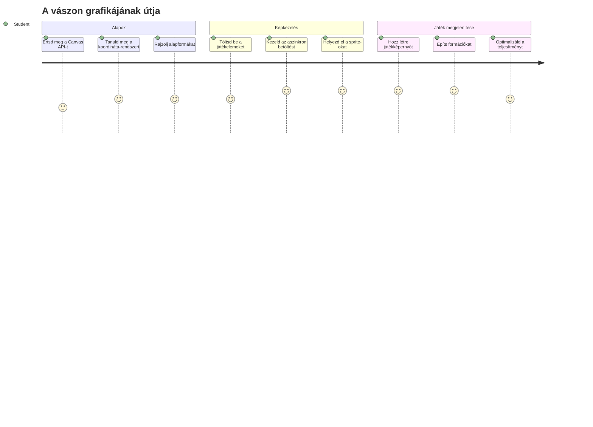
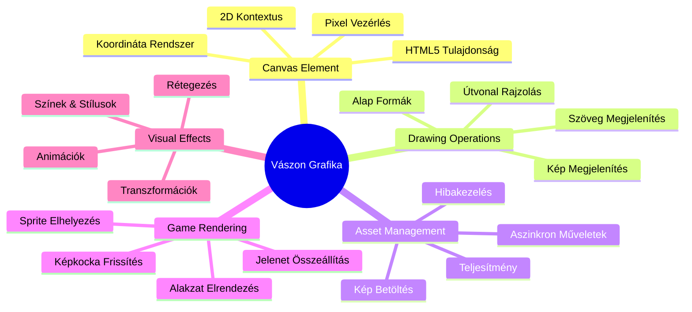
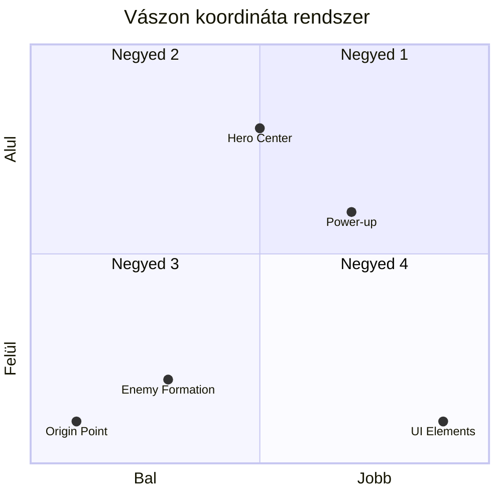
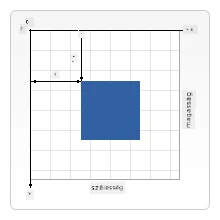
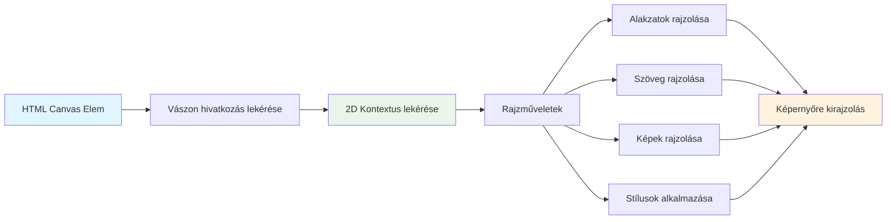
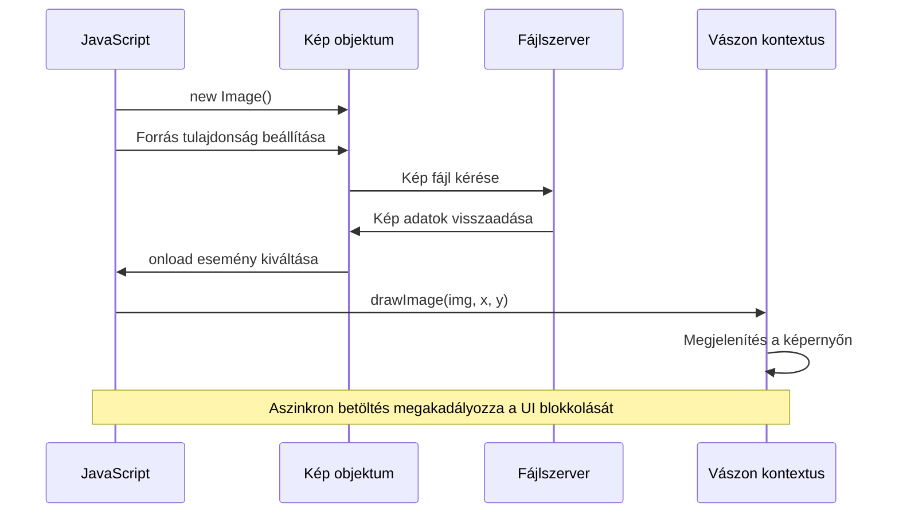
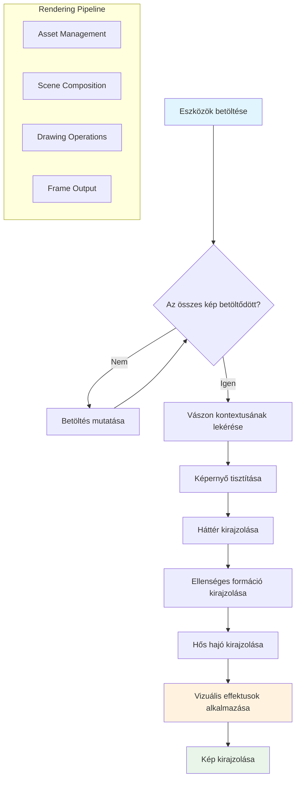
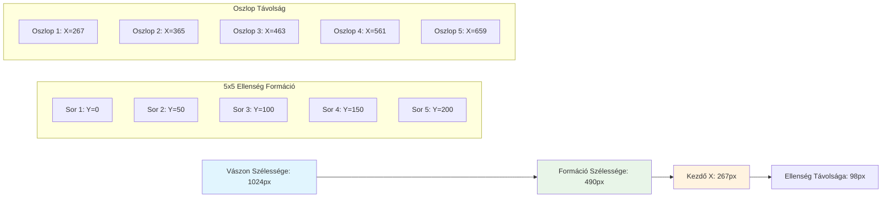
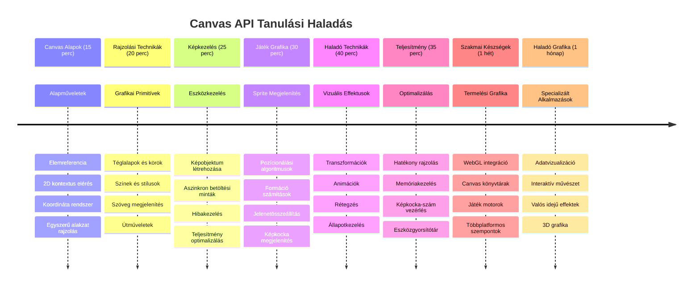

<!--
CO_OP_TRANSLATOR_METADATA:
{
  "original_hash": "7994743c5b21fdcceb36307916ef249a",
  "translation_date": "2026-01-07T02:39:53+00:00",
  "source_file": "6-space-game/2-drawing-to-canvas/README.md",
  "language_code": "hu"
}
-->
# Űrjáték készítése, 2. rész: Rajzold a hőst és a szörnyeket a vászonra


A Canvas API a webfejlesztés egyik legerősebb eszköze dinamikus, interaktív grafikák létrehozására közvetlenül a böngésződben. Ebben a leckében átalakítjuk azt a üres HTML `<canvas>` elemet egy játékvilággá, tele hősökkel és szörnyekkel. Gondolj a canvasra úgy, mint a digitális rajztábládra, ahol a kód vizuálissá válik.

Az előző leckében tanultakra építünk, és most a vizuális aspektusokba mélyedünk el. Megtanulod, hogyan tölts be és jeleníts meg játék sprite-okat, hogyan helyezd el pontosan az elemeket, és hogyan építsd fel az űrjáték vizuális alapjait. Ez áthidalja a statikus weboldalak és a dinamikus, interaktív élmények közti részt.

A lecke végére egy teljes játéktöbb jelenettel rendelkezel majd, ahol a hős űrhajó megfelelő helyen áll, és az ellenséges alakzatok készen állnak a harcra. Megérted, hogyan jelenítik meg a modern játékok a grafikát a böngészőkben, és elsajátítod az interaktív vizuális élmények létrehozásának készségeit. Fedezzük fel a canvas grafikákat és keltsük életre az űrjátékodat!


## Előadás előtti kvíz

[Előadás előtti kvíz](https://ff-quizzes.netlify.app/web/quiz/31)

## A Canvas

Mi is pontosan az a `<canvas>` elem? Ez az HTML5 megoldása arra, hogy dinamikus grafikákat és animációkat hozz létre webes böngészőkben. Ellentétben a hagyományos képekkel vagy videókkal, amelyek statikusak, a canvas pixel-szintű vezérlést ad minden, a képernyőn megjelenő elem felett. Ez tökéletessé teszi játékokhoz, adatvizualizációhoz és interaktív művészethez. Gondolj rá úgy, mint egy programozható rajzfelületre, ahol a JavaScript a festőecset.

Alapértelmezetten a canvas elem egy üres, átlátszó téglalapnak tűnik az oldaladon. De itt rejlik a potenciálja! Az igazi ereje akkor mutatkozik meg, amikor JavaScripttel rajzolsz alakzatokat, töltesz be képeket, hozol létre animációkat, és reagáltatsz a felhasználói interakciókra. Hasonlóan ahhoz, ahogy az 1960-as évek Bell Labs korai számítógépes grafikák úttörői minden pixelt programoztak az első digitális animációk létrehozásához.

✅ Olvass tovább a [Canvas API-ról](https://developer.mozilla.org/docs/Web/API/Canvas_API) az MDN-en.

Így szokás jelezni a canvas elemet, az oldal body részében:

```html
<canvas id="myCanvas" width="200" height="100"></canvas>
```
  
**Ez a kód mire jó:**  
- **Beállítja** az `id` attribútumot, hogy JavaScriptben hivatkozni tudj erre a konkrét canvas elemre  
- **Meghatározza** a `width`-ot pixelben, hogy szabályozd a canvas vízszintes méretét  
- **Megadja** a `height`-ot pixelben, hogy eldöntsd a canvas függőleges méretét  

## Egyszerű geometria rajzolása

Most, hogy tudod, mi az a canvas elem, nézzük meg, hogyan rajzoljunk rá ténylegesen! A canvas egy koordináta-rendszert használ, amely talán ismerős a matekórákról, de van egy fontos csavar a számítógépes grafikára jellemzően.

A canvas Descartes-féle koordináta-rendszert használ, ahol az x tengely vízszintes, az y pedig függőleges irányban helyezi el az összes rajzolt elemet. De itt a lényeg: a matekórán tanult koordináta-rendszertől eltérően az origó pont `(0,0)` a bal felső sarokban van, az x értékek jobbra nőnek, az y értékek pedig lefelé. Ez az elrendezés az első számítógépes kijelzőkre nyúlik vissza, ahol az elektronágyúk fentről lefelé pásztáztak, így a bal felső sarok volt a természetes kiindulópont.


  
> Kép az [MDN-ről](https://developer.mozilla.org/docs/Web/API/Canvas_API/Tutorial/Drawing_shapes)

A canvas elemre való rajzolás egy háromlépéses folyamatot követ, amely az összes canvas grafika alapját képezi. Ha párszor elvégzed, természetes lesz:


1. **Hivatkozz** a Canvas elemre a DOM-ból (pont úgy, mint bármely más HTML elemre)  
2. **Szerezd meg a 2D rajzolási kontextust** – ez tartalmaz minden rajzoláshoz szükséges metódust  
3. **Kezdj el rajzolni!** Használd a kontextus beépített metódusait a grafikák létrehozásához  

Így néz ki ez kódban:

```javascript
// 1. lépés: Szerezd meg a vászon elemet
const canvas = document.getElementById("myCanvas");

// 2. lépés: Szerezd meg a 2D-s kirajzolási kontextust
const ctx = canvas.getContext("2d");

// 3. lépés: Állítsd be a kitöltő színt és rajzolj egy téglalapot
ctx.fillStyle = 'red';
ctx.fillRect(0, 0, 200, 200); // x, y, szélesség, magasság
```
  
**Nézzük lépésről lépésre:**  
- Kézhez vesszük a canvas elemet az ID alapján, és eltároljuk egy változóban  
- Megkapjuk a 2D rajzolási kontextust – ez a rajzeszköztárunk  
- Megmondjuk a canvasnak a `fillStyle` tulajdonsággal, hogy pirossal töltsön ki  
- Rajzolunk egy (0,0) bal felső saroktól induló 200 pixeles széles és magas téglalapot  

✅ A Canvas API főként 2D alakzatokra fókuszál, de 3D elemeket is meg lehet rajzolni weboldalakon; ehhez a [WebGL API-t](https://developer.mozilla.org/docs/Web/API/WebGL_API) használhatod.

A Canvas API-val sok mindent rajzolhatsz, például:

- **Geometriai alakzatokat**, már láttad, hogyan kell téglalapot rajzolni, de sokkal több mindent lehet megjeleníteni.  
- **Szöveget**, bármilyen betűtípussal és színnel tudsz szöveget rajzolni.  
- **Képeket**, egy képet is tudsz rajzolni, például .jpg vagy .png kép állomány alapján.

✅ Próbáld ki! Tudsz téglalapot rajzolni, de tudsz kör alakot is megjeleníteni egy oldalon? Nézz meg pár érdekes Canvas rajzot a CodePenen. Itt egy [különösen lenyűgöző példa](https://codepen.io/dissimulate/pen/KrAwx).

### 🔄 **Pedagógiai állapotfelmérés**  
**Canvas alapok megértése**: Mielőtt továbbmennénk a képek betöltésére, bizonyosodj meg, hogy:  
- ✅ El tudod magyarázni, hogyan tér el a canvas koordináta-rendszere a matematikai koordinátáktól  
- ✅ Érted a háromlépéses rajzolási folyamatot  
- ✅ Fel tudod sorolni, mit biztosít a 2D rajzolási kontextus  
- ✅ El tudod magyarázni, hogyan működik együtt a fillStyle és a fillRect  

**Gyors kérdés**: Hogyan rajzolnál egy kék kört a (100, 50) pozícióban, 25-ös sugárral?  
```javascript
ctx.fillStyle = 'blue';
ctx.beginPath();
ctx.arc(100, 50, 25, 0, 2 * Math.PI);
ctx.fill();
```
  
**Az eddig ismert Canvas rajzolási metódusok:**  
- **fillRect()**: Kitöltött téglalapokat rajzol  
- **fillStyle**: Színek és minták beállítása  
- **beginPath()**: Új rajzolási utak indítása  
- **arc()**: Körök és görbék létrehozása  

## Kép betöltése és megjelenítése

Az alapvető alakzatok rajzolása hasznos, de a legtöbb játéknak valódi képekre van szüksége! A sprite-ok, háttérképek és textúrák adják a játék vizuális vonzerejét. A képek betöltése és megjelenítése a canvason másképp működik, mint az alakzatok rajzolása, de egyszerű, ha megérted a folyamatot.

Létre kell hoznunk egy `Image` objektumot, be kell töltenünk a képfájlt (ez aszinkron, vagyis "háttérben" történik), majd miután készen áll, rá kell rajzolnunk a canvason. Ez garantálja, hogy a képek helyesen jelennek meg anélkül, hogy blokkolnák az alkalmazás működését a betöltés ideje alatt.


### Alap képtöltés

```javascript
const img = new Image();
img.src = 'path/to/my/image.png';
img.onload = () => {
  // Kép betöltve és használatra kész
  console.log('Image loaded successfully!');
};
```
  
**Ez történik ebben a kódban:**  
- Létrehozunk egy új Image objektumot, ami magában foglalja a sprite-ot vagy textúrát  
- Megadjuk neki, melyik képfájlt töltse be az elérési út beállításával  
- Figyelünk a betöltési eseményre, hogy pontosan tudjuk, mikor áll készen a kép  

### Egy jobb módszer képek betöltésére

Itt egy robosztusabb módszer a képek betöltésére, amit a profi fejlesztők gyakran használnak. A képtöltést egy Promise-alapú függvénybe csomagoljuk – ezt a megközelítést az ES6-ban bevezetett JavaScript Promisek tették népszerűvé, és ez átláthatóbbá, hibakezelés szempontjából pedig rugalmasabbá teszi a kódot:  

```javascript
function loadAsset(path) {
  return new Promise((resolve, reject) => {
    const img = new Image();
    img.src = path;
    img.onload = () => {
      resolve(img);
    };
    img.onerror = () => {
      reject(new Error(`Failed to load image: ${path}`));
    };
  });
}

// Modern használat async/await-tel
async function initializeGame() {
  try {
    const heroImg = await loadAsset('hero.png');
    const monsterImg = await loadAsset('monster.png');
    // A képek most már készen állnak a használatra
  } catch (error) {
    console.error('Failed to load game assets:', error);
  }
}
```
  
**Mit csináltunk itt:**  
- Egy Promise-ba foglaltuk a képtöltés logikáját, hogy jobban kezelhessük azt  
- Beépítettünk hibakezelést az esetleges problémákhoz  
- Modern async/await szintaxist használtunk, hogy a kód olvashatóbb legyen  
- Try/catch blokkot alkalmaztunk a hibák szépen történő kezelésére  

Ha a képek betöltődtek, nagyon egyszerű őket megrajzolni a canvason:  

```javascript
async function renderGameScreen() {
  try {
    // Játékeszközök betöltése
    const heroImg = await loadAsset('hero.png');
    const monsterImg = await loadAsset('monster.png');

    // Vászon és kontextus lekérése
    const canvas = document.getElementById("myCanvas");
    const ctx = canvas.getContext("2d");

    // Képek rajzolása meghatározott pozíciókra
    ctx.drawImage(heroImg, canvas.width / 2, canvas.height / 2);
    ctx.drawImage(monsterImg, 0, 0);
  } catch (error) {
    console.error('Failed to render game screen:', error);
  }
}
```
  
**Lépjünk végig a kódon:**  
- Aszinkron módon betöltjük a hős és a szörny képeit  
- Megkapjuk a canvas elemet és a szükséges 2D rajzolási kontextust  
- A hős képet középre pozícionáljuk némi koordináta-matek segítségével  
- A szörny képet a bal felső sarokba helyezzük az ellenséges alakzat kezdőpontjaként  
- Kezeljük az esetleges hibákat betöltés vagy rajzolás közben  


## Most kezdődik a játék építése

Most mindent összerakunk, hogy megteremtsük az űrjáték vizuális alapjait. Alaposan érted a canvas alapokat és a képek betöltési technikáit, így ez a gyakorlati rész végigvezet egy teljes játékképernyő létrehozásán, ahol a sprite-ok megfelelő helyen vannak.

### Mit kell építeni

Egy weboldalt fogsz építeni egy Canvas elemmel, ami egy 1024*768-as fekete képernyőt jelenít meg. Két képet kaptál a feladathoz:

- Hős űrhajó

   

- 5x5-ös szörnyraj

   

### Fejlesztési lépések ajánlása

Keresd meg az előkészítő fájlokat a `your-work` almappában. A projektstruktúrának tartalmaznia kell:

```bash
your-work/
├── assets/
│   ├── enemyShip.png
│   └── player.png
├── index.html
├── app.js
└── package.json
```
  
**Ezekkel dolgozol:**  
- A játéksprite-ok az `assets/` mappában vannak, hogy minden rendszerezett legyen  
- A fő HTML fájl beállítja a canvas elemet és előkészíti a környezetet  
- Egy JavaScript fájl, amiben minden játék renderelési varázslatot megírsz  
- Egy package.json, ami egy fejlesztői szervert állít fel a helyi teszteléshez  

Nyisd meg ezt a mappát a Visual Studio Code-ban a fejlesztés megkezdéséhez. Szükséged lesz egy helyi fejlesztői környezetre, amely tartalmazza a Visual Studio Code-ot, az NPM-et és a Node.js-t. Ha még nincs `npm` a gépeden, [itt megtalálod a telepítési útmutatót](https://www.npmjs.com/get-npm).

Indítsd el a fejlesztői szervert úgy, hogy a `your-work` mappába navigálsz:

```bash
cd your-work
npm start
```
  
**Ez a parancs több menő dolgot csinál:**  
- Indít egy helyi szervert a `http://localhost:5000` címen, hogy tesztelhesd a játékot  
- Megszolgál minden fájlodat úgy, hogy a böngésző helyesen töltse be azokat  
- Figyeli a fájlokat változásokra, hogy gördülékenyen fejleszthess  
- Professzionális fejlesztői környezetet biztosít a teszteléshez  

> 💡 **Megjegyzés**: Kezdetben egy üres oldalt látsz majd – ez normális! Ahogy kódot adsz hozzá, frissítsd a böngésződet, hogy lásd a változtatásokat. Ez az iteratív fejlesztési megközelítés hasonló ahhoz, ahogy a NASA építette az Apollo irányítógépet – minden részt külön-külön teszteltek, mielőtt az egészet összerakták.

### Adj hozzá kódot

Add hozzá az szükséges kódot a `your-work/app.js` fájlba a következő feladatok elvégzéséhez:

1. **Rajzolj fekete hátterű canvast**  
   > 💡 **Így:** Keresd meg a TODO-t az `/app.js`-ben és adj hozzá csak két sort. Állítsd be a `ctx.fillStyle`-t feketére, majd használd a `ctx.fillRect()`-et (0,0)-tól a canvas méreteivel. Egyszerű!

2. **Töltsd be a játéktextúrákat**  
   > 💡 **Így:** Használd az `await loadAsset()`-et a játékos és ellenség képek betöltésére. Tárold el őket változókban, hogy később használd őket! Ne feledd – csak ha megrajzolod őket, fognak megjelenni!

3. **Rajzold meg a hős űrhajót középen, alul**  
   > 💡 **Így:** Használd a `ctx.drawImage()`-et a hős pozicionálásához. Az x koordinátánál próbáld `canvas.width / 2 - 45`-öt, hogy középre kerüljön, az y koordinátánál pedig `canvas.height - canvas.height / 4`-et az alsó részhez.

4. **Rajzolj egy 5×5 méretű ellenség formációt**  
   > 💡 **Így:** Keresd meg a `createEnemies` függvényt és állíts be egy egymásba ágyazott ciklust. Kell egy kis matek a távolság és helyzet kiszámításához, de ne aggódj – pontosan megmutatom!

Először rögzítsd a konstansokat a megfelelő ellenség formáció elrendezéshez:

```javascript
const ENEMY_TOTAL = 5;
const ENEMY_SPACING = 98;
const FORMATION_WIDTH = ENEMY_TOTAL * ENEMY_SPACING;
const START_X = (canvas.width - FORMATION_WIDTH) / 2;
const STOP_X = START_X + FORMATION_WIDTH;
```
  
**Mit csinálnak ezek a konstansok:**  
- Beállítjuk az 5 ellenséget soronként és oszloponként (egy elegáns 5×5-ös rácsot)  
- Megadjuk, mennyi hely legyen az ellenségek között, hogy ne legyenek túl szorosan  
- Kiszámoljuk, milyen széles lesz az egész formáció  
- Megállapítjuk, hol kezdődjön és hol érjen véget, hogy középre legyen igazítva  


Ezután készíts egymásba ágyazott ciklusokat az ellenség formáció kirajzolásához:

```javascript
for (let x = START_X; x < STOP_X; x += ENEMY_SPACING) {
  for (let y = 0; y < 50 * 5; y += 50) {
    ctx.drawImage(enemyImg, x, y);
  }
}
```
  
**Mit csinál ez az egymásba ágyazott ciklus:**  
- A külső ciklus balról jobbra halad a formáción  
- A belső ciklus felülről lefelé megy, hogy szépen rendezett sorokat hozzon létre  
- Minden ellenséget a kiszámolt pontos x,y koordinátára rajzolunk  
- Minden egyenletesen helyezkedik el, hogy profi és rendezett legyen az összhatás  

### 🔄 **Pedagógiai állapotfelmérés**  
**Játék renderelési mesterfogások**: Ellenőrizd a teljes renderelési rendszer megértését:  
- ✅ Hogyan segít az aszinkron képtöltés abban, hogy ne akadjon meg a felhasználói felület a játék indításakor?  
- ✅ Miért számoljuk ki az ellenség formáció pozícióit konstansok használatával ahelyett, hogy fix értékeket írnánk be?  
- ✅ Milyen szerepet tölt be a 2D rajzolási kontextus a rajzolási folyamatokban?  
- ✅ Hogyan hoznak létre az egymásba ágyazott ciklusok szervezett sprite alakzatokat?  

**Teljesítmény szempontjai**: A játék most bemutatja:  
- **Hatékony eszközbetöltést**: Promise-alapú képgazdálkodást  
- **Rendezett megjelenítést**: Strukturált rajzolási folyamatokat  
- **Matematikailag kiszámolt pozícionálást**: Sprite-ok tervezett elhelyezését  
- **Hibakezelést**: Szépen kezeljük a betöltési és megjelenítési hibákat  

**Vizuális programozási fogalmak**: Megtanultad:
- **Koordináta-rendszerek**: Matematikából képernyő pozíciókba fordítás
- **Sprite-kezelés**: Játék grafikák betöltése és megjelenítése
- **Forma algoritmusok**: Matematikai minták a szervezett elrendezéshez
- **Aszinkron műveletek**: Modern JavaScript a zökkenőmentes felhasználói élményért

## Eredmény

A kész eredmény így nézzen ki:


## Megoldás

Először próbáld meg magad megoldani, de ha elakadsz, nézd meg ezt a [megoldást](../../../../6-space-game/2-drawing-to-canvas/solution/app.js)

---

## GitHub Copilot Agent kihívás 🚀

Használd az Agent módot a következő kihívás teljesítéséhez:

**Leírás:** Fejleszd tovább az űrjátékod vásznát vizuális effektekkel és interaktív elemekkel a tanult Canvas API technikák segítségével.

**Feladat:** Hozz létre egy új fájlt `enhanced-canvas.html` néven, amely tartalmaz egy vásznat animált csillagokkal a háttérben, egy pulzáló életcsíkot a hős űrhajó számára, és ellenséges hajókat, amelyek lassan lefelé mozognak. Írj JavaScript kódot, amely véletlenszerű pozíciókat és átlátszóságot használó csillogó csillagokat rajzol, megvalósítja az életcsíkot, amely a százalékos élet alapján (zöld > sárga > piros) változtatja a színét, valamint animálja az ellenséges hajókat különböző sebességgel lefelé mozgásra.

Tudj meg többet az [agent módról](https://code.visualstudio.com/blogs/2025/02/24/introducing-copilot-agent-mode).

## 🚀 Kihívás

Megtanultad a Canvas API 2D rajzolási képességeit; nézd meg a [WebGL API-t](https://developer.mozilla.org/docs/Web/API/WebGL_API), és próbálj meg egy 3D objektumot rajzolni.

## Előadás utáni kvíz

[Előadás utáni kvíz](https://ff-quizzes.netlify.app/web/quiz/32)

## Áttekintés & önképzés

Ismerd meg mélyebben a Canvas API-t, ha [erről olvasol](https://developer.mozilla.org/docs/Web/API/Canvas_API).

### ⚡ **Mit tehetsz meg a következő 5 percben**
- [ ] Nyisd meg a böngésző konzolt, és hozz létre egy vászon elemet a `document.createElement('canvas')` segítségével
- [ ] Próbálj meg egy téglalapot rajzolni a `fillRect()` használatával egy vászon kontextusán
- [ ] Kísérletezz különböző színekkel a `fillStyle` tulajdonság segítségével
- [ ] Rajzolj egy egyszerű kört az `arc()` metódussal

### 🎯 **Mit érhetsz el ezen az órán**
- [ ] Teljesítsd az óra utáni kvízt és értsd meg a vászon alapjait
- [ ] Készíts egy vászon rajzoló alkalmazást több formával és színnel
- [ ] Valósíts meg képek betöltését és sprite megjelenítést a játékodhoz
- [ ] Készíts egy egyszerű animációt, amely objektumokat mozgat a vásznon
- [ ] Gyakorold a vászon transzformációkat, mint a méretezés, forgatás és eltolás

### 📅 **Heti vászon útmutatód**
- [ ] Fejezd be az űrjátékot polírozott grafikákkal és sprite animációkkal
- [ ] Sajátítsd el az előrehaladott vászon technikákat, például a gradienseket, mintákat és rétegzést
- [ ] Készíts interaktív vizualizációkat, amelyeket vászon segítségével ábrázolsz adatokon
- [ ] Ismerd meg a vászon optimalizálási technikákat a zökkenőmentes teljesítményért
- [ ] Építs rajz- vagy festőalkalmazást különféle eszközökkel
- [ ] Fedezd fel a kreatív kódolási mintákat és generatív művészetet vászonnal

### 🌟 **Havi grafikai jártasságod**
- [ ] Készíts összetett vizuális alkalmazásokat a Canvas 2D-vel és WebGL-lel
- [ ] Tanulj meg grafikai programozási alapokat és shader technikákat
- [ ] Tégy hozzájárulást nyílt forráskódú grafikai könyvtárakhoz és vizualizációs eszközökhöz
- [ ] Sajátítsd el a teljesítmény optimalizálást grafikailag igényes alkalmazásokhoz
- [ ] Készíts oktatási tartalmakat a vászon programozásról és számítógépes grafikáról
- [ ] Válj grafikai programozási szakértővé, aki segít másoknak vizuális élményeket alkotni

## 🎯 Vászon grafikai jártasság idővonala


### 🛠️ Vászon grafikai eszköztár összefoglaló

A leckét elvégezve most már rendelkezel:
- **Canvas API jártassággal**: Teljes körű 2D grafikai programozási ismeretek
- **Koordináta matematika**: Precíz pozicionálási és elrendezési algoritmusok
- **Eszközkezelés**: Profi képbetteleltetés és hibakezelés
- **Renderelési folyamat**: Strukturált megközelítés a jelenet összeállításához
- **Játék grafikák**: Sprite pozicionálás és formációszámítás
- **Aszinkron programozás**: Modern JavaScript minták a gördülékeny működéshez
- **Vizuális programozás**: Matematikai fogalmak képernyő grafikává alakítása

**Valódi alkalmazások**: Vászon tudásod közvetlenül alkalmazható:
- **Adatvizualizáció**: Grafikonok, diagramok és interaktív műszerfalak
- **Játékfejlesztés**: 2D játékok, szimulációk, interaktív élmények
- **Digitális művészet**: Kreatív kódolás és generatív művészeti projektek
- **Felhasználói felület tervezés**: Egyedi grafika és interaktív elemek
- **Oktatási szoftverek**: Vizuális tanulási eszközök és szimulációk
- **Webalkalmazások**: Dinamikus grafika és valós idejű vizualizációk

**Szakmai készségek, amelyeket elsajátítottál**:
- **Építhetsz** egyedi grafikai megoldásokat külső könyvtárak nélkül
- **Optimalizálhatod** a megjelenítést a zökkenőmentes felhasználói élményért
- **Hibakereshetsz** bonyolult vizuális problémákat böngésző fejlesztői eszközökkel
- **Tervezhetsz** skálázható grafikai rendszereket matematikai alapelvek alapján
- **Integrálhatod** a Vászon grafikát modern webalkalmazás keretrendszerekkel

**Elsajátított Canvas API metódusok**:
- **Elemkezelés**: getElementById, getContext
- **Rajzolási műveletek**: fillRect, drawImage, fillStyle
- **Erőforrás betöltés**: Kép objektumok, Promise minták
- **Matematikai pozicionálás**: Koordináta számítások, formáció algoritmusok

**Következő szint**: Készen állsz animáció, felhasználói interakció, ütközésészlelés hozzáadására vagy WebGL felfedezésére 3D grafikához!

🌟 **Elért eredmény**: Teljes körű játék megjelenítő rendszert építettél alapvető Canvas API technikákkal!

## Feladat

[Játssz a Canvas API-val](assignment.md)

---

<!-- CO-OP TRANSLATOR DISCLAIMER START -->
**Jogi nyilatkozat**:
Ez a dokumentum az AI fordítószolgáltatás, a [Co-op Translator](https://github.com/Azure/co-op-translator) segítségével készült. Bár törekszünk a pontosságra, kérjük, vegye figyelembe, hogy az automatikus fordítások hibákat vagy pontatlanságokat tartalmazhatnak. Az eredeti dokumentum az anyanyelvén tekintendő hiteles forrásnak. Fontos információk esetén szakmai, emberi fordítást javaslunk. Nem vállalunk felelősséget az ebből a fordításból eredő félreértésekért vagy helytelen értelmezésekért.
<!-- CO-OP TRANSLATOR DISCLAIMER END -->