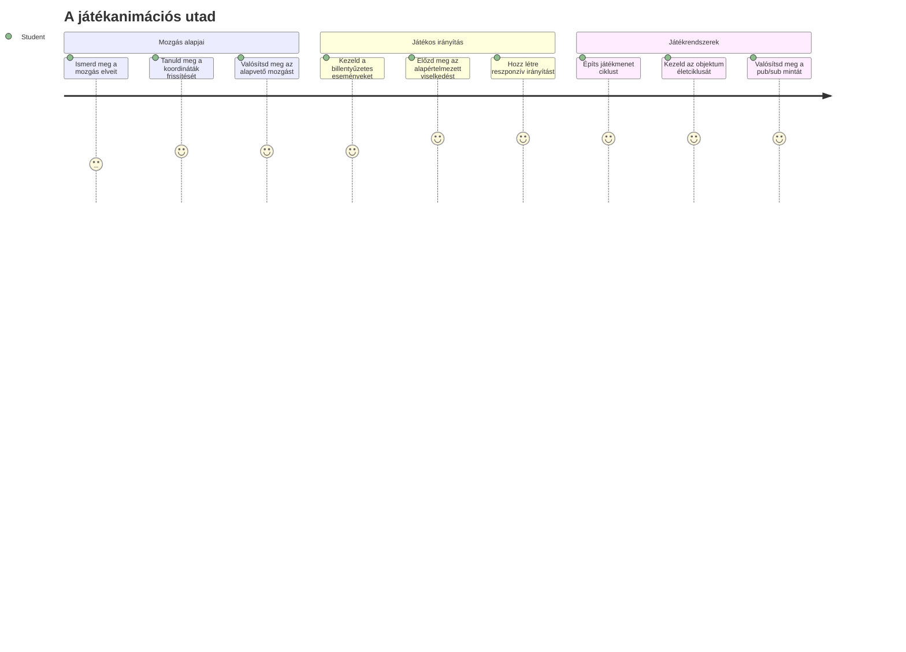
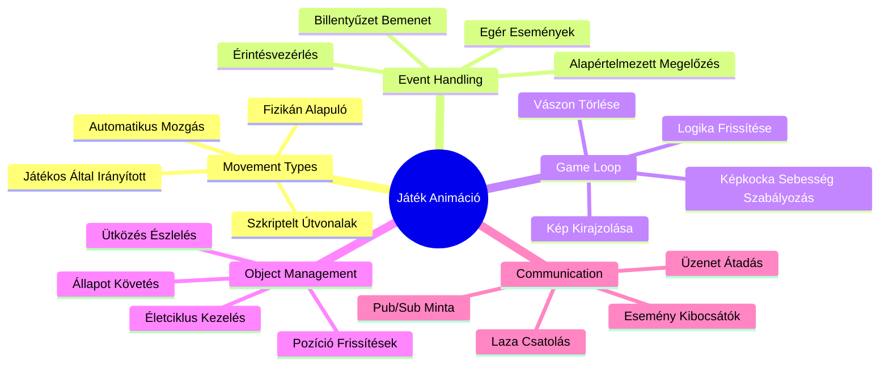
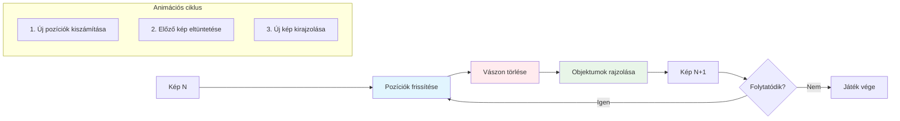
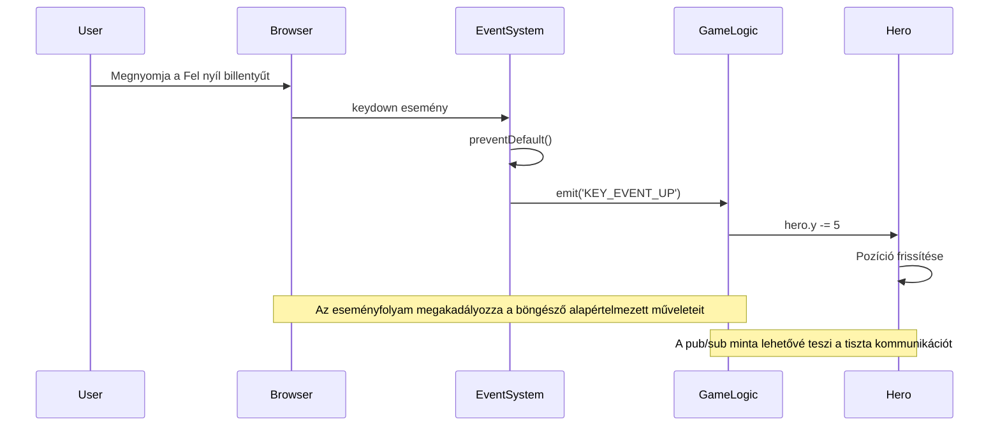
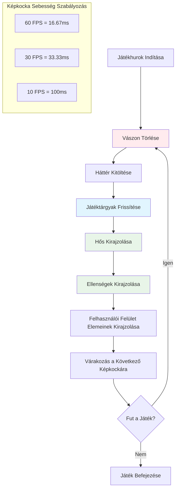
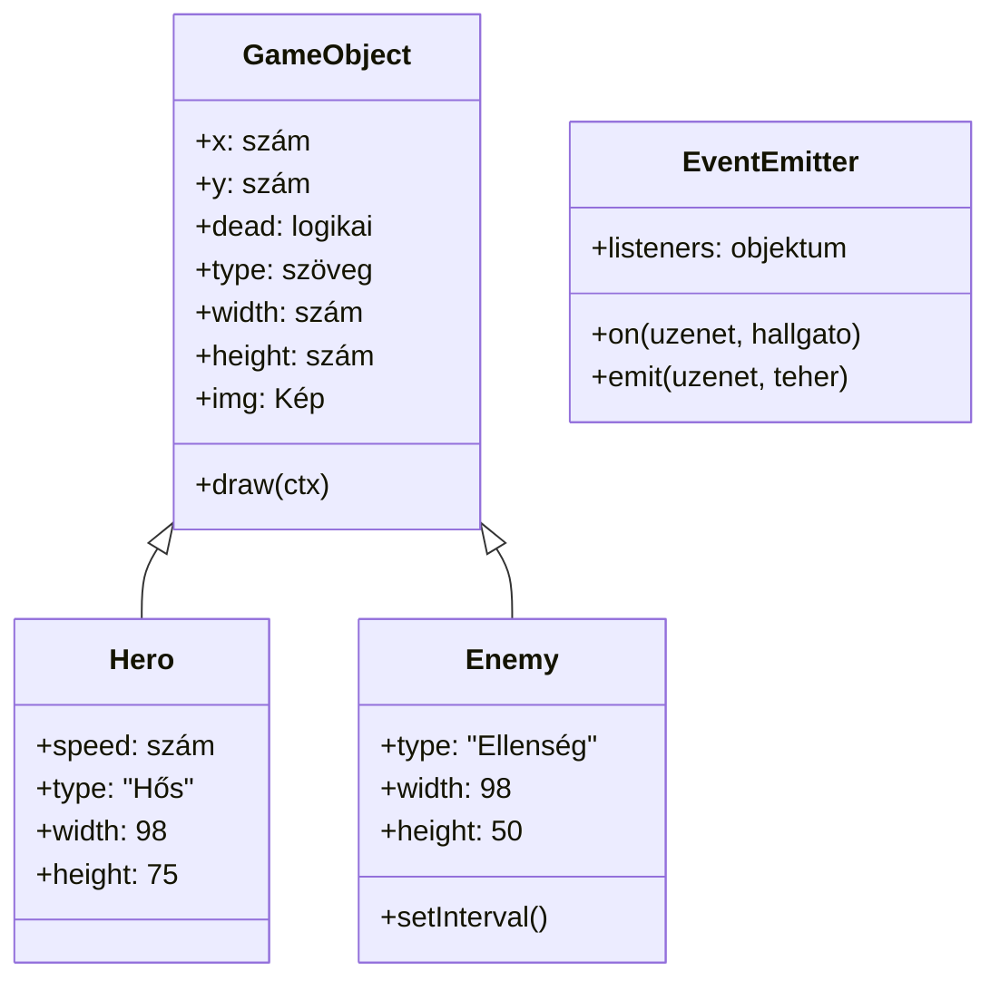
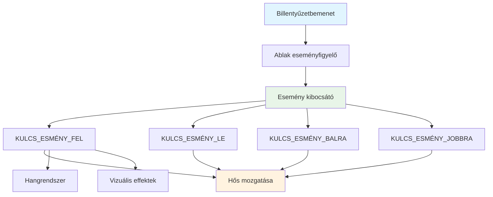
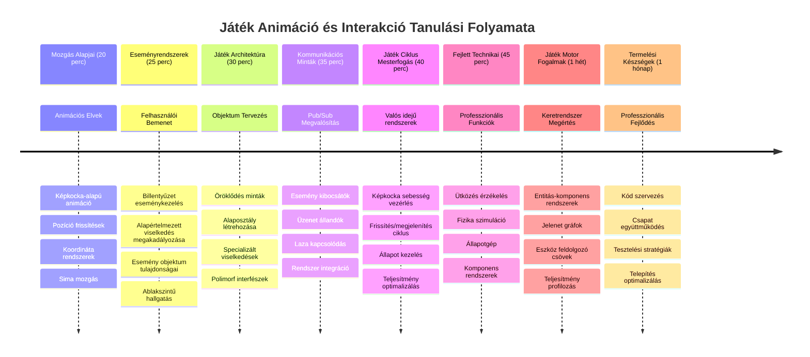

<!--
CO_OP_TRANSLATOR_METADATA:
{
  "original_hash": "8c55a2bd4bc0ebe4c88198fd563a9e09",
  "translation_date": "2026-01-07T02:46:12+00:00",
  "source_file": "6-space-game/3-moving-elements-around/README.md",
  "language_code": "hu"
}
-->
# Űrjáték készítése 3. rész: Mozgás hozzáadása


Gondolj a kedvenc játékodra – ami lenyűgözővé teszi, az nem csupán a szép grafikák, hanem az, ahogyan minden mozog és reagál a műveleteidre. Jelenleg az űrjátékod olyan, mint egy gyönyörű festmény, de most hozzáadunk egy mozgást, ami életre kelti.

Amikor a NASA mérnökei programozták az Apollo küldetések irányító számítógépét, hasonló kihívással szembesültek: hogyan lehet úgy reagáltatni az űrhajót a pilóta parancsaira, hogy közben automatikusan javítsa az útvonalat? A mai leckében tanult elvek visszhangozzák ezeket a koncepciókat – a játékos által vezérelt mozgás kezelése az automatikus rendszer viselkedéssel együtt.

Ebben a leckében megtanulod, hogyan csússzanak az űrhajók a képernyőn, hogyan reagáljanak a játékos parancsaira, és hogyan hozz létre sima mozgásmintákat. Mindezt kezelhető fogalmakra bontjuk, amelyek természetes módon épülnek egymásra.

A végére a játékosok a hős hajóval repülnek a képernyőn, miközben ellenséges hajók járőröznek felette. Ami még fontosabb: megérted a játékmozgás rendszerek alapelveit.


## Előadás előtti kvíz

[Előadás előtti kvíz](https://ff-quizzes.netlify.app/web/quiz/33)

## A játékmozgás megértése

A játékok akkor kelnek életre, amikor a dolgok mozogni kezdenek, és alapvetően két módon történik ez:

- **Játékos által vezérelt mozgás**: Amikor lenyomsz egy gombot vagy kattintasz az egérrel, valami mozog. Ez a közvetlen kapcsolat közted és a játékvilág között.
- **Automatikus mozgás**: Amikor maga a játék dönt a mozgásról – például azok az ellenséges hajók, amelyek járőröznek a képernyőn akkor is, ha semmit nem csinálsz.

Az objektumok mozgatása a képernyőn egyszerűbb, mint gondolnád. Emlékszel arra az x és y koordinátára matekóráról? Pontosan azzal dolgozunk itt. Amikor Galileo 1610-ben a Jupiter holdjait figyelte, valójában ugyanezt tette – időbeli pozíciókat rajzolt, hogy megértse a mozgásmintákat.

Dolgozni a képernyőn mozgó dolgokkal olyan, mint egy flipbook animációt készíteni – három egyszerű lépést kell követni:


1. **Pozíció frissítése** – Változtasd meg, hol legyen az objektum (például mozgasd 5 pixellel jobbra)
2. **Régi képkocka eltüntetése** – Töröld a képernyőt, hogy ne láss szellemszerű nyomokat
3. **Új képkocka kirajzolása** – Tegyél az objektumot az új helyére

Ha ezt elég gyorsan csinálod, hopp, kész is a sima mozgás, amely természetes érzést ad a játékosoknak.

Így nézhet ez ki kódban:

```javascript
// Állítsd be a hős helyét
hero.x += 5;
// Tisztítsd meg a téglalapot, amely a hőst tartalmazza
ctx.clearRect(0, 0, canvas.width, canvas.height);
// Rajzold újra a játék hátterét és a hőst
ctx.fillRect(0, 0, canvas.width, canvas.height);
ctx.fillStyle = "black";
ctx.drawImage(heroImg, hero.x, hero.y);
```

**Mit csinál ez a kód:**
- **Frissíti** a hős x-koordinátáját 5 pixellel, hogy vízszintesen mozogjon
- **Kitörli** a teljes vászon területét, hogy eltávolítsa az előző képkockát
- **Kitölti** a vásznat fekete háttérrel
- **Újrarajzolja** a hős képet az új pozícióban

✅ Tudsz mondani egy okot, hogy miért okozhat a hős sok képkocka per másodperc alatti újrarajzolása teljesítménybeli problémákat? Olvass erről az [alternatívákról](https://developer.mozilla.org/en-US/docs/Web/API/Canvas_API/Tutorial/Optimizing_canvas).

## Billentyűzet események kezelése

Itt kapcsoljuk össze a játékos bemenetét a játék eseményeivel. Amikor valaki megnyomja a szóköz billentyűt lézer lövéséhez, vagy lenyom egy nyílbillentyűt, hogy kikerüljön egy aszteroidát, a játékodnak érzékelnie kell és reagálnia kell erre a bemenetre.

A billentyűzet események az ablak szintjén történnek, ami azt jelenti, hogy a böngésző teljes ablaka figyel a billentyűleütésekre. Az egérkattintások ezzel szemben konkrét elemekhez köthetők (például gombokra kattintás). A mi űrjátékunkban a billentyűzet vezérlésre koncentrálunk, mert ez adja a játékosoknak az igazi arcade érzést.

Ez emlékeztet arra, ahogy a 1800-as évek távírókezelői a Morse kódot értelmes üzenetekké kellett átalakítsák – mi is valami hasonlót csinálunk, a billentyűleütéseket játék parancsokká fordítjuk.

Egy esemény kezeléséhez használd az ablak `addEventListener()` metódusát, és add meg neki a két bemeneti paramétert. Az első paraméter az esemény neve, például `keyup`. A második a funkció, amelyet az esemény bekövetkeztekor kell végrehajtani.

Íme egy példa:

```javascript
window.addEventListener('keyup', (evt) => {
  // evt.key = a billentyű sztring reprezentációja
  if (evt.key === 'ArrowUp') {
    // csinálj valamit
  }
});
```

**Mit csinál itt a kód:**
- **Figyel** a billentyűzet eseményekre az egész ablakon
- **Elkapja** az esemény objektumot, amely tudatja, hogy melyik gombot nyomták meg
- **Ellenőrzi**, hogy a megnyomott gomb egyezik-e egy specifikus billentyűvel (ebben az esetben a fel nyíl)
- **Futtat** kódot, ha a feltétel teljesül

A billentyű eseményeknél két tulajdonságot használhatsz, hogy kiderítsd, melyik gomb lett lenyomva:

- `key` – ez a gomb sztring reprezentációja, például `'ArrowUp'`
- `keyCode` – ez egy numerikus reprezentáció, például `37`, ami az `ArrowLeft`-hez tartozik

✅ A billentyű események kezelése hasznos a játékfejlesztésen kívül is. Milyen más felhasználási módját tudod elképzelni ennek a technikának?


### Különleges gombok: egy figyelmeztetés!

Néhány billentyűnek beépített böngésző viselkedése van, ami zavarhatja a játékod. A nyílbillentyűk görgetik az oldalt, a szóköz pedig legörget lefelé – ezek a viselkedések nem kellenek, mikor valaki az űrhajóját irányítja.

Megakadályozhatjuk ezeket az alapértelmezett működéseket, és inkább a játék kezelje a bemenetet. Ez hasonló ahhoz, ahogy a korai programozók felülírták a rendszer megszakításokat, hogy egyedi viselkedést hozzanak létre – mi ezt böngésző szinten tesszük. Így:

```javascript
const onKeyDown = function (e) {
  console.log(e.keyCode);
  switch (e.keyCode) {
    case 37:
    case 39:
    case 38:
    case 40: // Nyíl billentyűk
    case 32:
      e.preventDefault();
      break; // Szóköz
    default:
      break; // ne blokkolja a többi billentyűt
  }
};

window.addEventListener('keydown', onKeyDown);
```

**Mit csinál ez a tiltó kód:**
- **Ellenőrzi** a specifikus billentyű kódokat, amelyek nem kívánt böngésző viselkedést okozhatnak
- **Megakadályozza** az alapértelmezett böngésző műveleteket a nyílbillentyűkre és a szóközre
- **Engedi** más gombok normál működését
- **Használja** az `e.preventDefault()`-ot a böngésző beépített viselkedésének megállítására

### 🔄 **Pedagógiai ellenőrzés**
**Eseménykezelés megértése**: Mielőtt az automatikus mozgásra lépnénk, győződj meg róla, hogy tudsz:
- ✅ Magyarázatot adni a `keydown` és `keyup` események közti különbségre
- ✅ Megérteni, miért akadályozzuk meg az alapértelmezett böngésző viselkedést
- ✅ Leírni, hogyan kapcsolódnak az eseményfigyelők a felhasználói bemenethez és a játéklogikához
- ✅ Meghatározni, mely gombok zavarhatják a játék vezérlést

**Gyors önteszt**: Mi történne, ha nem akadályoznád meg az alapértelmezett működést a nyílbillentyűknél?
*Válasz: A böngésző legörgetné az oldalt, ami zavarja a játék mozgását*

**Eseményrendszer architektúra**: Most már érted:
- **Ablak-szintű figyelés**: események elkapása böngésző szinten
- **Esemény objektum tulajdonságok**: `key` sztringek és `keyCode` számok
- **Alapértelmezett megakadályozás**: nem kívánt böngésző viselkedések leállítása
- **Feltételes logika**: reakció adott billentyűkombinációkra

## Játék által vezérelt mozgás

Most beszéljünk azokról az objektumokról, amelyek a játékos bemenete nélkül mozognak. Gondolj az ellenséges hajókra, amelyek a képernyőn átperegnek, a repülő golyókra, vagy a háttérben sodródó felhőkre. Ez az autonóm mozgás élettel tölti meg a játékvilágot akkor is, amikor senki nem vezérel.

JavaScript beépített időzítőit használjuk, hogy rendszeresen frissítsük a pozíciókat. Ez hasonló ahhoz, ahogy a ingaórák működnek – egy rendszeres mechanizmus, amely állandó, időzített műveleteket vált ki. Íme, milyen egyszerű lehet:

```javascript
const id = setInterval(() => {
  // Mozgasd az ellenséget az y tengely mentén
  enemy.y += 10;
}, 100);
```

**Mit csinál ez a mozgás kód:**
- **Létrehoz** egy időzítőt, amely 100 milliszekundumonként fut
- **Frissíti** az ellenség y-koordinátáját minden alkalommal 10 pixellel
- **Tárolja** az intervallum azonosítót, hogy később szükség esetén megállíthassuk
- **Mozgatja** az ellenséget automatikusan lefelé a képernyőn

## A játék ciklus

Ez az a koncepció, ami mindent összeköt – a játék ciklus. Ha a játék egy film lenne, akkor a játék ciklus lenne a filmvetítő, amely képkockánként gyorsan vetít, így minden simán mozog.

Minden játéknak van egy ilyen ciklusa a háttérben. Ez egy olyan függvény, amely frissíti az összes játékelem állapotát, újrarajzolja a képernyőt, és folyton ismétli ezt a folyamatot. Ez tartja nyilván a hőst, az összes ellenséget, a lézerek repülését – az egész játék állapotát.

Ez a koncepció emlékeztet arra, ahogyan a korai film animátorok, mint Walt Disney, képkockánként rajzolták újra a karaktereket, hogy mozgás illúzióját keltsék. Mi ugyanezt tesszük, csak kód formájában, nem ceruzával.

Így nézhet ki egy tipikus játék ciklus kód:


```javascript
const gameLoopId = setInterval(() => {
  function gameLoop() {
    ctx.clearRect(0, 0, canvas.width, canvas.height);
    ctx.fillStyle = "black";
    ctx.fillRect(0, 0, canvas.width, canvas.height);
    drawHero();
    drawEnemies();
    drawStaticObjects();
  }
  gameLoop();
}, 200);
```

**A játék ciklus szerkezetének megértése:**
- **Kitörli** a teljes vásznat a korábbi képkocka eltávolításához
- **Kitölti** a hátteret egyszínű színnel
- **Kirajzolja** az összes játékobjektumot a jelenlegi helyükön
- **Ismétli** ezt a folyamatot 200 milliszekundumonként, hogy sima animációt hozzon létre
- **Kezeli** a képkocka sebességet az időzítővel

## Az Űrjáték folytatása

Most mozgást adunk a korábban létrehozott statikus jelenethez. Átalakítjuk képernyőképből interaktív élményt. Lépésről lépésre haladunk, hogy minden elem természetesen épüljön a másikra.

Vedd elő a kódot a korábbi leckéből (vagy kezd az elejéről a [Part II- starter](../../../../6-space-game/3-moving-elements-around/your-work) mappában, ha friss kezdésre van szükséged).

**Amit ma építünk:**
- **Hős vezérlés**: Nyilakkal irányítod az űrhajódat a képernyőn
- **Ellenséges mozgás**: Az idegen hajók megkezdik támadásukat

Kezdjük el megvalósítani ezeket a funkciókat.

## Ajánlott lépések

Keresd meg a fájlokat, amelyeket a `your-work` alkönyvtárban létrehoztak. Ezek a következők:

```bash
-| assets
  -| enemyShip.png
  -| player.png
-| index.html
-| app.js
-| package.json
```

A projektedet a `your-work` könyvtárban indítod ezzel a parancssal:

```bash
cd your-work
npm start
```

**Mit csinál ez a parancs:**
- **Átlép** a projekt könyvtáradba
- **Elindít** egy HTTP szervert az `http://localhost:5000` címen
- **Kiszolgálja** a játék fájlokat, hogy böngészőben tesztelhesd őket

Ezzel egy HTTP szervert indítasz az `http://localhost:5000` címen. Nyisd meg a böngészőt és írd be ezt a címet, most a hős és az összes ellenség látszik majd, de még semmi sem mozog - még!

### Kód hozzáadása

1. **Adj hozzá dedikált objektumokat** a `hero`-hoz, a `enemy`-hez és a `game object`-hez, melyeknek legyen `x` és `y` tulajdonsága. (Emlékezz az [öröklődés vagy összetétel](../README.md) részre.)

   *TIP* A `game object` legyen az, amely rendelkezik `x` és `y` tulajdonsággal, és képes magát megrajzolni a vászonra.

   > **Tipp**: Először adj hozzá egy új `GameObject` osztályt az alábbi konstruktorral, majd rajzold ki a vászonra:

    ```javascript
    class GameObject {
      constructor(x, y) {
        this.x = x;
        this.y = y;
        this.dead = false;
        this.type = "";
        this.width = 0;
        this.height = 0;
        this.img = undefined;
      }
    
      draw(ctx) {
        ctx.drawImage(this.img, this.x, this.y, this.width, this.height);
      }
    }
    ```

    **Mit tesz ez az alap osztály:**
    - **Definiál** közös tulajdonságokat, amelyeket az összes játékobjektum megoszt (pozíció, méret, kép)
    - **Tartalmaz** egy `dead` jelzőt, amivel követni lehet, hogy az objektumot el kell-e távolítani
    - **Biztosít** egy `draw()` metódust, amely kirajzolja az objektumot a vászonra
    - **Beállít** alapértelmezett értékeket minden tulajdonságra, amelyeket a leszármazott osztályok felülírhatnak


    Most bővítsd ezt a `GameObject`-et a `Hero` és `Enemy` osztályok létrehozásával:
    
    ```javascript
    class Hero extends GameObject {
      constructor(x, y) {
        super(x, y);
        this.width = 98;
        this.height = 75;
        this.type = "Hero";
        this.speed = 5;
      }
    }
    ```

    ```javascript
    class Enemy extends GameObject {
      constructor(x, y) {
        super(x, y);
        this.width = 98;
        this.height = 50;
        this.type = "Enemy";
        const id = setInterval(() => {
          if (this.y < canvas.height - this.height) {
            this.y += 5;
          } else {
            console.log('Stopped at', this.y);
            clearInterval(id);
          }
        }, 300);
      }
    }
    ```

    **Fontos fogalmak ezekben az osztályokban:**
    - **Örököl** a `GameObject`-ből az `extends` kulcsszóval
    - **Meghívja** a szülő konstruktorát a `super(x, y)` hívással
    - **Beállít** specifikus méreteket és tulajdonságokat minden objektumtípushoz
    - **Megvalósítja** az ellenségek automatikus mozgását `setInterval()` használatával

2. **Adj hozzá billentyű eseménykezelőket** az irányításhoz (mozgasd a hőst fel/le, balra/jobbra)

   *EMLÉKEZZ* ez egy Descartes-i rendszer, a bal felső sarok a `0,0`. Ne felejtsd el letiltani az *alapértelmezett viselkedést*!

   > **Tipp**: Hozd létre az `onKeyDown` függvényt, és csatold az ablakhoz:

   ```javascript
   const onKeyDown = function (e) {
     console.log(e.keyCode);
     // Add hozzá a fenti leckében szereplő kódot az alapértelmezett viselkedés megállításához
     switch (e.keyCode) {
       case 37:
       case 39:
       case 38:
       case 40: // Nyílbillentyűk
       case 32:
         e.preventDefault();
         break; // Szóköz
       default:
         break; // ne blokkolja más billentyűket
     }
   };

   window.addEventListener("keydown", onKeyDown);
   ```
    
   **Mit csinál ez az eseménykezelő:**
   - **Figyel** a `keydown` eseményekre az egész ablakon
   - **Naplózza** a billentyű kódját, hogy segítsen hibakereséskor, mely gombokat nyomják meg
   - **Megakadályozza** az alapértelmezett böngésző viselkedést a nyíl billentyűknél és a szóköznél
   - **Engedi** más gombok normál működését

   Nézd meg a böngésződ konzolját ebben a pontban, és figyeld a naplózott billentyűleütéseket.

3. **Valósítsd meg** a [Pub sub mintát](../README.md), ez tisztán tartja a kódodat, miközben haladsz tovább.

   A Publish-Subscribe minta segít szervezni a kódot az események és azok kezelésének szétválasztásával. Ezáltal modulárisabb és könnyebben karbantartható lesz a kód.

   Ehhez az utolsó lépéshez megteheted:

   1. **Adj hozzá egy eseményfigyelőt** az ablakhoz:

       ```javascript
       window.addEventListener("keyup", (evt) => {
         if (evt.key === "ArrowUp") {
           eventEmitter.emit(Messages.KEY_EVENT_UP);
         } else if (evt.key === "ArrowDown") {
           eventEmitter.emit(Messages.KEY_EVENT_DOWN);
         } else if (evt.key === "ArrowLeft") {
           eventEmitter.emit(Messages.KEY_EVENT_LEFT);
         } else if (evt.key === "ArrowRight") {
           eventEmitter.emit(Messages.KEY_EVENT_RIGHT);
         }
       });
       ```

   **Mit csinál ez az eseményrendszer:**
   - **Érzékeli** a billentyűzet bemenetet, és átalakítja egyedi játék eseményekké
   - **Elválasztja** a bemeneti érzékelést a játék logikától
   - **Könnyíti** a vezérlések módosítását anélkül, hogy a játék kódját meg kéne változtatni
   - **Engedi**, hogy több rendszer is reagáljon ugyanarra a bemenetre


   2. **Hozd létre az EventEmitter osztályt** az üzenetek közzétételéhez és feliratkozásához:

       ```javascript
       class EventEmitter {
         constructor() {
           this.listeners = {};
         }
       
         on(message, listener) {
           if (!this.listeners[message]) {
             this.listeners[message] = [];
           }
           this.listeners[message].push(listener);
         }
       
   3. **Adj hozzá konstansokat**, és állítsd be az EventEmitter-t:

       ```javascript
       const Messages = {
         KEY_EVENT_UP: "KEY_EVENT_UP",
         KEY_EVENT_DOWN: "KEY_EVENT_DOWN",
         KEY_EVENT_LEFT: "KEY_EVENT_LEFT",
         KEY_EVENT_RIGHT: "KEY_EVENT_RIGHT",
       };
       
       let heroImg, 
           enemyImg, 
           laserImg,
           canvas, ctx, 
           gameObjects = [], 
           hero, 
           eventEmitter = new EventEmitter();
       ```

   **A beállítás megértése:**
   - **Definiál** üzenet konstansokat, hogy elkerüld az elírásokat és megkönnyítsd az átrendezést
   - **Deklarál** változókat képek, vászon kontextus és játék állapotához
   - **Létrehoz** egy globális esemény emittert a pub-sub rendszerhez
   - **Inicializál** egy tömböt az összes játéktárgy tárolására

   4. **Inicializáld a játékot**

       ```javascript
       function initGame() {
         gameObjects = [];
         createEnemies();
         createHero();
       
         eventEmitter.on(Messages.KEY_EVENT_UP, () => {
           hero.y -= 5;
         });
       
         eventEmitter.on(Messages.KEY_EVENT_DOWN, () => {
           hero.y += 5;
         });
       
         eventEmitter.on(Messages.KEY_EVENT_LEFT, () => {
           hero.x -= 5;
         });
       
4. **Állítsd be a játékhurokot**

   Refaktoráld a `window.onload` függvényt, hogy inicializálja a játékot, és állítson be egy megfelelő időközönként futó játékhurokot. Ezután hozzáadsz egy lézersugarat:

    ```javascript
    window.onload = async () => {
      canvas = document.getElementById("canvas");
      ctx = canvas.getContext("2d");
      heroImg = await loadTexture("assets/player.png");
      enemyImg = await loadTexture("assets/enemyShip.png");
      laserImg = await loadTexture("assets/laserRed.png");
    
      initGame();
      const gameLoopId = setInterval(() => {
        ctx.clearRect(0, 0, canvas.width, canvas.height);
        ctx.fillStyle = "black";
        ctx.fillRect(0, 0, canvas.width, canvas.height);
        drawGameObjects(ctx);
      }, 100);
    };
    ```

   **A játék beállításának megértése:**
   - **Megvárja**, hogy az oldal teljesen betöltődjön, mielőtt elindulna
   - **Lekéri** a vászon elemet és annak 2D megjelenítő kontextusát
   - **Aszinkron módon betölti** az összes képi erőforrást `await` használatával
   - **Elindítja** a játékhurok futását 100 ms-os időközönként (10 FPS)
   - **Kitörli** és újrarajzolja a teljes képernyőt minden frame-ben

5. **Adj hozzá kódot** az ellenségek mozgatásához egy bizonyos időközönként

    Refaktoráld a `createEnemies()` függvényt, hogy létrehozza az ellenségeket és betolja őket az új gameObjects osztályba:

    ```javascript
    function createEnemies() {
      const MONSTER_TOTAL = 5;
      const MONSTER_WIDTH = MONSTER_TOTAL * 98;
      const START_X = (canvas.width - MONSTER_WIDTH) / 2;
      const STOP_X = START_X + MONSTER_WIDTH;
    
      for (let x = START_X; x < STOP_X; x += 98) {
        for (let y = 0; y < 50 * 5; y += 50) {
          const enemy = new Enemy(x, y);
          enemy.img = enemyImg;
          gameObjects.push(enemy);
        }
      }
    }
    ```

    **Az ellenség létrehozásának működése:**
    - **Számolja ki** az ellenségek pozícióját a képernyő közepére igazítva
    - **Létrehoz** egy ellenség rácsot beágyazott ciklusokkal
    - **Hozzárendeli** az ellenség képet minden egyes ellenség objektumhoz
    - **Hozzáadja** az összes ellenséget a globális játéktárgy tömbhöz
    
    és adj hozzá egy `createHero()` függvényt, ami hasonló folyamatot végez a hős számára.
    
    ```javascript
    function createHero() {
      hero = new Hero(
        canvas.width / 2 - 45,
        canvas.height - canvas.height / 4
      );
      hero.img = heroImg;
      gameObjects.push(hero);
    }
    ```

    **A hős létrehozásának működése:**
    - **Pozicionálja** a hőst a képernyő alsó közepén
    - **Hozzárendeli** a hős képét a hős objektumhoz
    - **Hozzáadja** a hőst a játéktárgy tömbhöz megjelenítéshez

    végül adj hozzá egy `drawGameObjects()` függvényt a rajzolás elindításához:

    ```javascript
    function drawGameObjects(ctx) {
      gameObjects.forEach(go => go.draw(ctx));
    }
    ```

    **A rajzoló függvény megértése:**
    - **Bejárja** az összes játéktárgyat a tömbben
    - **Meghívja** mindegyik objektum `draw()` metódusát
    - **Átadja** a vászon kontextust, hogy az objektumok meg tudják jeleníteni magukat

    ### 🔄 **Didaktikai állapotfelmérés**
    **A teljes játékrendszer megértése**: Ellenőrizd a teljes architektúra elsajátítását:
    - ✅ Hogyan teszi lehetővé az öröklődés, hogy a Hero és az Enemy közös GameObject tulajdonságokat osszanak meg?
    - ✅ Miért teszi a pub/sub mintázat fenntarthatóbbá a kódodat?
    - ✅ Milyen szerepet játszik a játékhurok a folyamatos animáció létrehozásában?
    - ✅ Hogyan kapcsolja össze a felhasználói bemenetet az eseményfigyelők a játéktárgy viselkedésével?

    **Rendszerintegráció**: A játékod most bemutatja:
    - **Objektumorientált tervezés**: Alaposztályok specializált öröklődéssel
    - **Eseményvezérelt architektúra**: Pub/sub minta laza csatoláshoz
    - **Animációs keretrendszer**: Játékhurok következetes frame frissítésekkel
    - **Bemenetkezelés**: Billentyűzet események alapértelmezett megakadályozással
    - **Erőforrás kezelés**: Kép betöltés és sprite megjelenítés

    **Professzionális minták**: Megvalósítottad:
    - **Felelősségek elkülönítése**: Bemenet, logika és megjelenítés szétválasztása
    - **Polimorfizmus**: Az összes játéktárgynak közös rajzoló interfésze van
    - **Üzenetküldés**: Tiszta kommunikáció komponensek között
    - **Erőforrás menedzsment**: Hatékony sprite és animáció kezelés

    Az ellenségeidnek már el kell kezdeniük haladni a hős űrhajód felé!
      }
    }
    ```
    
    and add a `createHero()` function to do a similar process for the hero.
    
    ```javascript
    function createHero() {
      hero = new Hero(
        canvas.width / 2 - 45,
        canvas.height - canvas.height / 4
      );
      hero.img = heroImg;
      gameObjects.push(hero);
    }
    ```

    végül adj hozzá egy `drawGameObjects()` függvényt a rajzolás elindításához:

    ```javascript
    function drawGameObjects(ctx) {
      gameObjects.forEach(go => go.draw(ctx));
    }
    ```

    Az ellenségeidnek már el kell kezdeniük haladni a hős űrhajód felé!

---

## GitHub Copilot Agent Kihívás 🚀

Itt egy kihívás, ami tovább csiszolja a játékodat: határok és sima irányítások hozzáadása. Jelenleg a hősöd elrepülhet a képernyőről, és a mozgás rendetlen érzésű lehet.

**A küldetésed:** Tegye a űrhajódat valósághűbbé a képernyőhatárok és a folyékony mozgás megvalósításával. Ez hasonló ahhoz, ahogy a NASA repülésirányító rendszerei megakadályozzák az űrhajók biztonságos működési paraméterek túllépését.

**Amit meg kell alkotni:** Készíts egy rendszert, ami a hős űrhajót a képernyőn tartja, és tegye az irányítást folyamatosabbá. Amikor a játékos lenyomja egy nyíl billentyűt, a hajó folyamatosan csúszkáljon, ne ugráljon darabokban. Fontold meg, hogy vizuális visszajelzést is adj, amikor a hajó a képernyőhatárhoz ér – talán egy finom effektust, ami jelzi a játéktér szélét.

Tudj meg többet az [ügynök módjáról](https://code.visualstudio.com/blogs/2025/02/24/introducing-copilot-agent-mode).

## 🚀 Kihívás

A kód szervezése egyre fontosabb, ahogy a projektek nőnek. Észrevehetted, hogy a fájl kezd zsúfolttá válni a funkciókból, változókból és osztályokból összekeverve. Ez arra emlékeztet, ahogy az Apollo küldetés mérnökei tiszta, fenntartható rendszereket hoztak létre, amelyeken több csapat is hatékonyan dolgozhat egyszerre.

**A küldetésed:**
Gondolkodj szoftverarchitektként. Hogyan szerveznéd a kódot, hogy hat hónap múlva te (vagy egy csapattársad) is könnyen megértsd? Még ha minden egy fájlban is marad most, jobb szervezettséget kialakíthatsz:

- **Kapcsolódó funkciók csoportosítása** egyértelmű komment fejléc alatt
- **Felelősségek szétválasztása** – különítsd el a játékmenet logikáját a megjelenítéstől
- **Következetes névhasználat** változók és függvények számára
- **Modulok vagy névterek létrehozása** a játék különböző aspektusainak rendezéséhez
- **Dokumentáció hozzáadása** amely megmagyarázza az egyes fő szakaszok célját

**Reflexiós kérdések:**
- A kódod mely részei a legnehezebben érthetőek, amikor később visszatérsz hozzájuk?
- Hogyan szerveznéd meg, hogy mások könnyebben tudjanak hozzájárulni?
- Mi történne, ha új funkciókat, például power-upokat vagy különböző ellenségtípusokat szeretnél hozzáadni?

## Előadás utáni kvíz

[Előadás utáni kvíz](https://ff-quizzes.netlify.app/web/quiz/34)

## Áttekintés és önálló tanulás

Mindent a nulláról építettünk fel, ami nagyszerű a tanuláshoz, de itt egy kis titok – számos csodálatos JavaScript keretrendszer létezik, amelyek sok nehézséget levesznek a válladról. Ha már kényelmesen használod az eddig tanult alapokat, érdemes [felfedezni, mi érhető el](https://github.com/collections/javascript-game-engines).

Gondolj a keretrendszerekre úgy, mint egy jól felszerelt szerszámosládára ahelyett, hogy minden szerszámot kézzel készítenél el. Sok olyan kód-szervezési problémát megoldanak, amiket említettünk, és olyan funkciókat is adnak, amik hetekbe telnének saját maga megalkotni.

**Érdemes felfedezni:**
- Hogyan szervezik a játékmotorok a kódot – csodálkozni fogsz az okos mintázatokon
- Teljesítmény-optimalizálási trükkök a vászon alapú játékok zökkenőmentes futtatásához  
- Modern JavaScript funkciók, melyek tisztább és fenntarthatóbb kódot eredményeznek
- Különböző megközelítések a játéktárgyak és kapcsolataik kezelésére

## 🎯 A játék animáció mesteri idővonala


### 🛠️ Játékfejlesztési eszköztár összefoglaló

A leckét teljesítve most már mestere vagy:
- **Animációs alapelvek**: Frame-alapú mozgás és sima átmenetek
- **Eseményvezérelt programozás**: Billentyűzet bemenet kezelése megfelelő eseménykezeléssel
- **Objektumorientált tervezés**: Öröklődési hierarchiák és polimorfikus interfészek
- **Kommunikációs minták**: Pub/sub architektúra a fenntartható kódhoz
- **Játékhurok architektúra**: Valós idejű frissítési és megjelenítési ciklusok
- **Bemeneti rendszerek**: Felhasználói vezérlés leképezése alapértelmezett viselkedés megakadályozásával
- **Erőforrás kezelés**: Sprite-k betöltése és hatékony megjelenítés

### ⚡ **Mit tehetsz a következő 5 percben**
- [ ] Nyisd meg a böngésző konzolt és próbáld ki az `addEventListener('keydown', console.log)` eseményt a billentyűzet események megfigyelésére
- [ ] Hozz létre egy egyszerű div elemet és mozgasd nyíl billentyűkkel
- [ ] Kísérletezz `setInterval`-lel a folyamatos mozgás létrehozásához
- [ ] Próbáld ki az alapértelmezett viselkedés megakadályozását `event.preventDefault()`-tal

### 🎯 **Mit érhetsz el ezen az órán**
- [ ] Teljesítsd az előadás utáni kvízt és értsd meg az eseményvezérelt programozást
- [ ] Építsd meg a mozgó hős űrhajót teljes billentyűzetes vezérléssel
- [ ] Valósítsd meg az ellenség mozgásának sima mintáit
- [ ] Adj hozzá határokat, hogy a játéktárgyak ne lépjék túl a képernyőt
- [ ] Készíts alapvető ütközés-detektálást a játéktárgyak között

### 📅 **Heti animációs utazás**
- [ ] Készítsd el a teljes űrjátékot csiszolt mozgással és interakciókkal
- [ ] Adj hozzá fejlett mozgásmintákat, például íveket, gyorsulást és fizikát
- [ ] Valósíts meg sima átmeneteket és könnyítő függvényeket
- [ ] Készíts részecske effektusokat és vizuális visszajelző rendszereket
- [ ] Optimalizáld a játék teljesítményét a zökkenőmentes 60fps eléréséhez
- [ ] Adj hozzá mobil érintésvezérlést és reszponzív dizájnt

### 🌟 **Havi interaktív fejlesztés**
- [ ] Építs összetett interaktív alkalmazásokat fejlett animációs rendszerekkel
- [ ] Tanulj animációs könyvtárakat, mint a GSAP, vagy készíts saját animációs motort
- [ ] Vegyél részt nyílt forráskódú játékfejlesztési és animációs projektekben
- [ ] Sajátítsd el a grafika-intenzív alkalmazások teljesítményoptimalizálását
- [ ] Készíts oktató anyagokat a játékfejlesztés és animáció témájában
- [ ] Építs portfóliót fejlett interaktív programozási készségekkel

**Valós alkalmazások**: A játék animációs tudásod közvetlenül alkalmazható:
- **Interaktív webalkalmazásokban**: Dinamikus műszerfalak és valós idejű felületek
- **Adatvizualizációban**: Animált grafikonok és interaktív képek
- **Oktató szoftverekben**: Interaktív szimulációk és tanuló eszközök
- **Mobil fejlesztésben**: Érintésalapú játékok és gesztuskezelés
- **Asztali alkalmazásokban**: Electron alkalmazások sima animációkkal
- **Web animációkban**: CSS és JavaScript animációs könyvtárak

**Professzionális készségek**: Most már tudsz:
- **Tervezni** eseményvezérelt rendszereket, amik skálázódnak a komplexitással
- **Megvalósítani** sima animációkat matematikai elvekkel
- **Hibakeresni** összetett interakciós rendszereket a böngésző fejlesztői eszközökkel
- **Optimalizálni** a játék teljesítményét különböző eszközökön és böngészőkben
- **Tervezni** fenntartható kódszerkezeteket bevált minták alapján

**Játékfejlesztési fogalmak elsajátítva**:
- **Képkocka sebesség kezelés**: FPS és időzítés megértése
- **Bemenetkezelés**: Platformok közötti billentyűzet és esemény rendszerek
- **Objektum életciklus**: Létrehozás, frissítés és megsemmisítési minták
- **Állapot szinkronizáció**: Játék állapotának következetes megtartása frame-ek között
- **Esemény architektúra**: Laza csatolású kommunikáció játékrendszerek között

**Következő szint**: Készen állsz ütközés detektálás, pontozórendszerek, hanghatások hozzáadására, vagy modern játékmotorok, mint a Phaser vagy a Three.js felfedezésére!

🌟 **Teljesítmény elérve**: Felépítettél egy komplett interaktív játékrendszert professzionális architektúra mintákkal!

## Házi feladat

[Kódod kommentálása](assignment.md)

---

<!-- CO-OP TRANSLATOR DISCLAIMER START -->
**Jogi nyilatkozat**:  
Ez a dokumentum az AI fordítási szolgáltatás, a [Co-op Translator](https://github.com/Azure/co-op-translator) segítségével készült. Bár igyekszünk a pontosságra, kérjük, vegye figyelembe, hogy az automatikus fordítások tartalmazhatnak hibákat vagy pontatlanságokat. Az eredeti dokumentum a saját nyelvén a hiteles forrásnak tekintendő. Fontos információk esetén szakmai, emberi fordítást javaslunk. Nem vállalunk felelősséget a fordítás használatából eredő félreértésekért vagy téves értelmezésekért.
<!-- CO-OP TRANSLATOR DISCLAIMER END -->