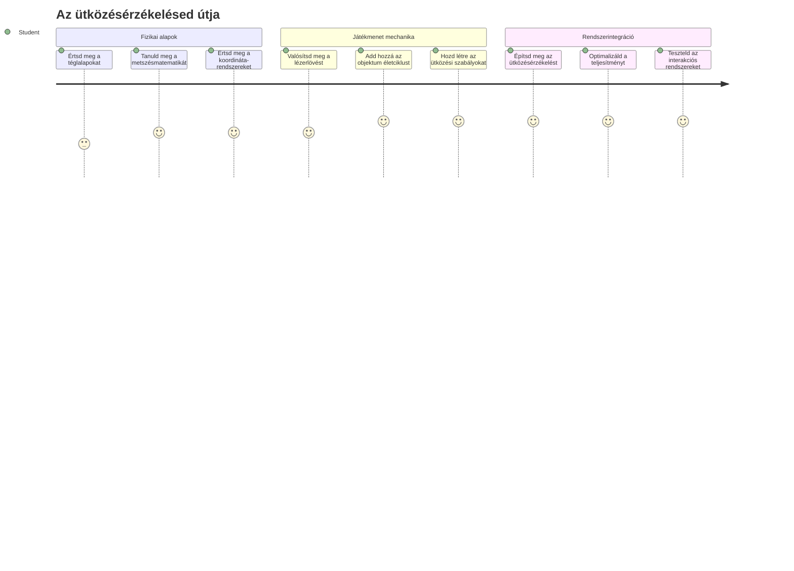
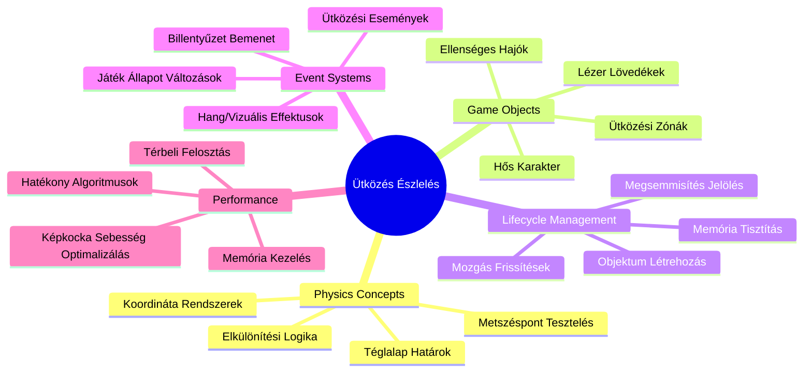
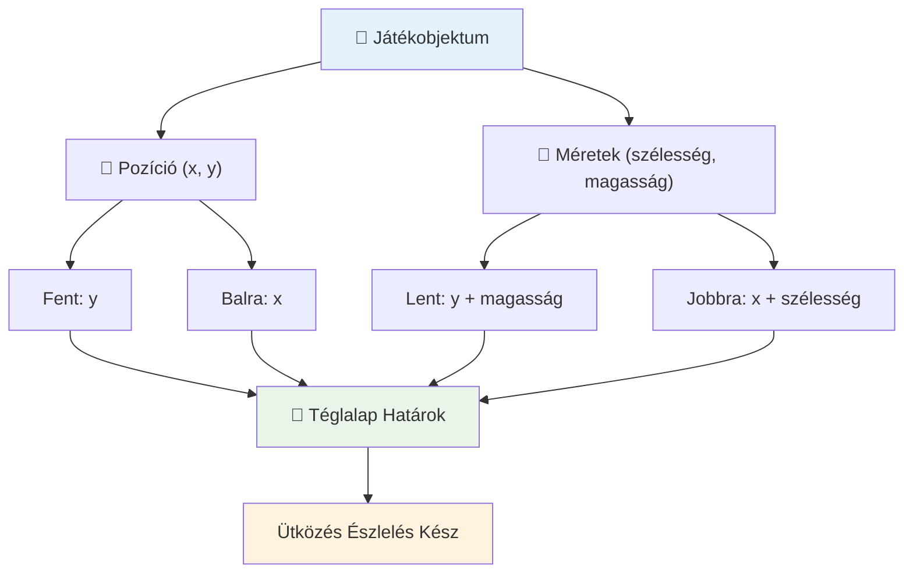
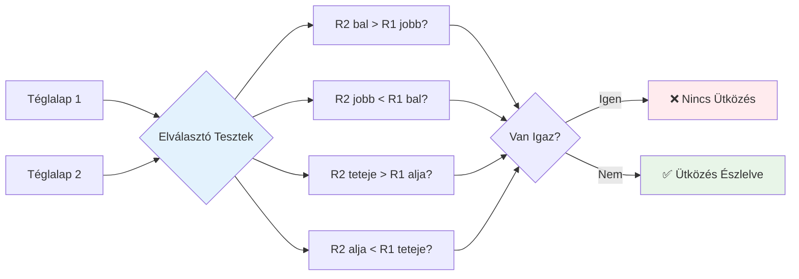
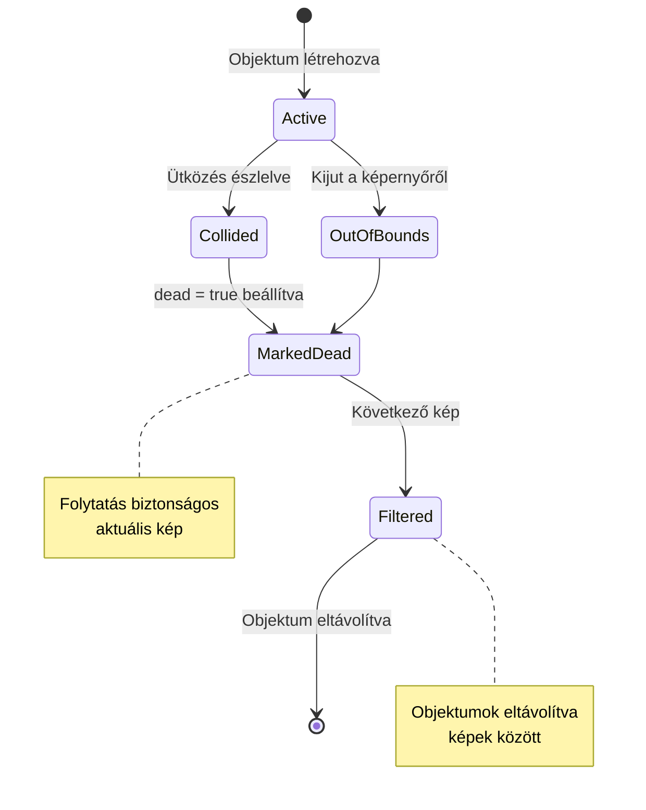
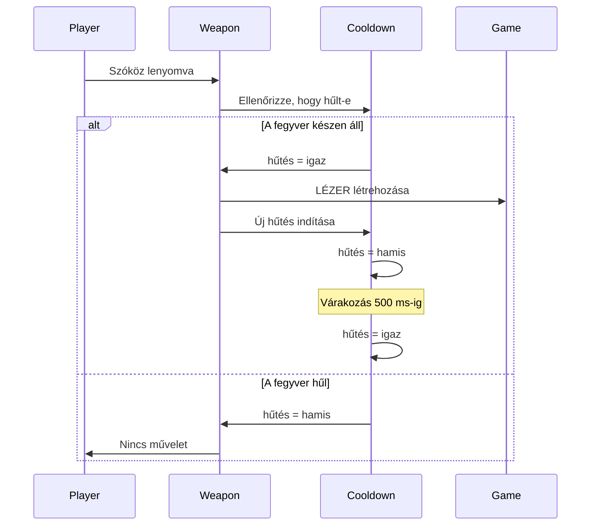
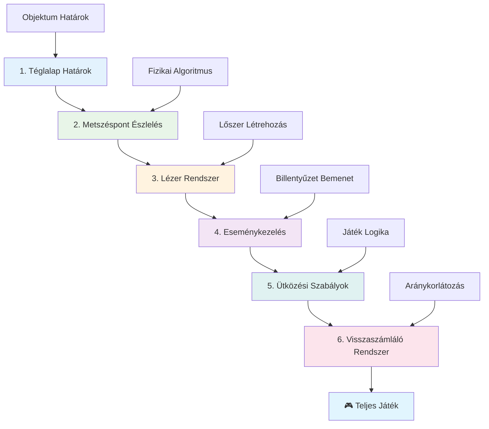
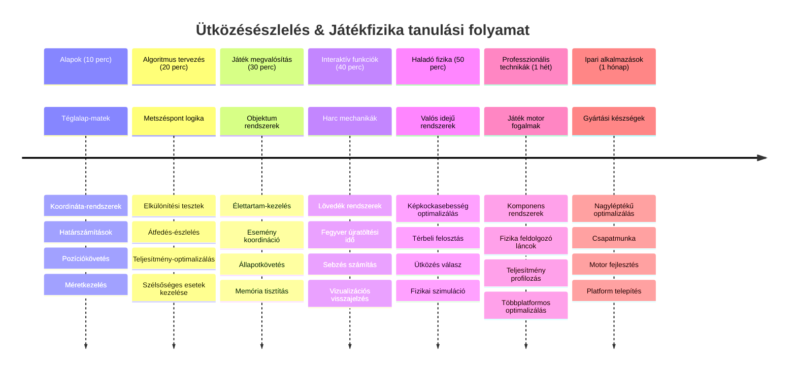

<!--
CO_OP_TRANSLATOR_METADATA:
{
  "original_hash": "039b4d8ce65f5edd82cf48d9c3e6728c",
  "translation_date": "2026-01-07T02:38:19+00:00",
  "source_file": "6-space-game/4-collision-detection/README.md",
  "language_code": "hu"
}
-->
# Űrjáték készítése 4. rész: Lézer hozzáadása és Ütközésérzékelés


## Előadás előtti kvíz

[Előadás előtti kvíz](https://ff-quizzes.netlify.app/web/quiz/35)

Gondolj arra a pillanatra a Star Wars-ból, amikor Luke proton torpedói eltalálják a Halálcsillag kipufogónyílását. Ez a pontos ütközésérzékelés változtatta meg a galaxis sorsát! A játékokban az ütközésérzékelés ugyanígy működik – meghatározza, mikor lépnek kölcsönhatásba az objektumok és mi történik utána.

Ebben az órában lézerfegyvereket adsz hozzá az űrjátékodhoz, és megvalósítod az ütközésérzékelést. Ahogy a NASA küldetéstervezői számítják ki az űrhajók pályáit, hogy elkerüljék a törmelékeket, úgy te is megtanulod érzékelni, mikor metszenek egymást játéktárgyak. Ezt kezelhető lépésekre bontjuk, amelyek egymásra épülnek.

A végére egy működő harci rendszert fogsz létrehozni, ahol a lézerek elpusztítják az ellenségeket, és az ütközések játékelemeket váltanak ki. Ugyanezek az ütközéselvűdés elvei találhatók mindenben, a fizikai szimulációktól az interaktív webes felületekig.


✅ Végez külön kutatást az első valaha írt számítógépes játékról. Mi volt a funkciója?

## Ütközésészlelés

Az ütközésészlelés úgy működik, mint az Apollo holdkomp közelségérzékelői - folyamatosan méri a távolságokat és riasztást vált ki, amikor az objektumok túl közel kerülnek egymáshoz. A játékokban ez a rendszer határozza meg, mikor lépnek kapcsolatba az objektumok és mi történjen ezután.

Az általunk használni kívánt megközelítés minden játéktárgyat téglalapként kezel, hasonlóan ahhoz, ahogy a légi irányítás egyszerűsített geometriai alakzatokkal követi a repülőgépeket. Ez a téglalap-módszer talán egyszerűnek tűnik, de számítási szempontból hatékony és jól működik a legtöbb játékszituációban.

### Téglalap reprezentáció

Minden játéktárgynak szüksége van koordinátahatárokra, hasonlóan ahhoz, ahogy a Mars Pathfinder rover feltérképezte helyzetét a Mars felszínén. Így definiáljuk a határkoordinátákat:


```javascript
rectFromGameObject() {
  return {
    top: this.y,
    left: this.x,
    bottom: this.y + this.height,
    right: this.x + this.width
  }
}
```

**Nézzük meg részletesebben:**
- **Felső él**: Ez csak az objektumod függőleges kezdőpontja (az y pozíciója)
- **Bal él**: Hol kezdődik vízszintesen (az x pozíciója)
- **Alsó él**: Az y pozícióhoz hozzáadjuk a magasságot - így tudjuk, hol ér véget!
- **Jobb él**: Az x pozícióhoz hozzáadjuk a szélességet - és megvan a teljes határ!

### Metszési algoritmus

A téglalapok metszésének észlelése hasonló logikát használ, mint ahogy a Hubble Űrteleszkóp meghatározza, hogy az égi objektumok átfedik-e egymást a látóterében. Az algoritmus a szétválasztást ellenőrzi:


```javascript
function intersectRect(r1, r2) {
  return !(r2.left > r1.right ||
    r2.right < r1.left ||
    r2.top > r1.bottom ||
    r2.bottom < r1.top);
}
```

**A szétválasztási teszt úgy működik, mint a radar rendszerek:**
- A 2. téglalap teljesen a 1. téglalap jobb oldalán van?
- A 2. téglalap teljesen a 1. téglalap bal oldalán van?
- A 2. téglalap teljesen a 1. téglalap alatt van?
- A 2. téglalap teljesen a 1. téglalap felett van?

Ha egyik feltétel sem igaz, akkor a téglalapok átfedik egymást. Ez a megközelítés tükrözi, hogyan állapítják meg a radar operátorok, hogy két repülőgép biztonságos távolságban van-e egymástól.

## Objektum élettartamának kezelése

Amikor a lézer eltalál egy ellenséget, mindkét objektumot el kell távolítani a játékból. Azonban az objektumok törlése a ciklus közepén összeomlást okozhat - ezt a leckét korán megtanulta az Apollo Irányítási Számítógép rendszere. Ehelyett egy „törlésre jelölés” megközelítést használunk, amely biztonságosan távolítja el az objektumokat a képkockák között.


Így jelölünk meg valamit eltávolításra:

```javascript
// Objektum eltávolításra jelölve
enemy.dead = true;
```

**Miért működik ez a megközelítés:**
- Megjelöljük az objektumot „halottnak”, de nem töröljük azonnal
- Ez lehetővé teszi a jelenlegi játékkép biztonságos befejezését
- Nem lesz összeomlás, mert nem használunk már eltávolított dolgot!

Ezután szűrjük ki a jelölt objektumokat a következő renderelési ciklus előtt:

```javascript
gameObjects = gameObjects.filter(go => !go.dead);
```

**Ez a szűrés így működik:**
- Egy friss listát hoz létre csak az „élő” objektumokkal
- Eldobja az összes, halottnak jelölt objektumot
- Fenntartja a játék zökkenőmentes futását
- Megakadályozza a memóriafelfúvódást a megsemmisült objektumok felgyülemlése miatt

## Lézerrendszer megvalósítása

A lézerlövedékek a játékokban hasonló elv alapján működnek, mint a Star Trek foton torpedói – különálló objektumok, melyek egyenes vonalban haladnak, amíg el nem találnak valamit. Minden szóköz lenyomásával egy új lézer objektum keletkezik, amely áthalad a képernyőn.

Az működéshez több különböző részletet kell összhangba hozni:

**Kulcselemek megvalósítása:**
- **Létrehozás**: lézer objektumok a hős pozíciójából származtatva
- **Beviteli kezelés**: billentyűzetfigyelés a lézer létrehozásához
- **Mozgás**: lézer mozgásának és élettartamának kezelése
- **Megjelenítés**: lézer lövedékek vizuális ábrázolása

## Tűzgyorsaság vezérlés megvalósítása

A korlátlan tüzelési sebesség túlterhelné a játék motort, és túl könnyűvé tenné a játékot. Az igazi fegyverrendszerekhez hasonlóan - még az USS Enterprise fáziságyúinak is időre van szüksége a töltésre a lövések között.

Létrehozunk egy lehűlési (cooldown) rendszert, amely megakadályozza a gyors ismétlésű tüzelést, miközben megtartja a reagáló vezérlést:


```javascript
class Cooldown {
  constructor(time) {
    this.cool = false;
    setTimeout(() => {
      this.cool = true;
    }, time);
  }
}

class Weapon {
  constructor() {
    this.cooldown = null;
  }
  
  fire() {
    if (!this.cooldown || this.cooldown.cool) {
      // Lézer lövedék létrehozása
      this.cooldown = new Cooldown(500);
    } else {
      // A fegyver még hűl
    }
  }
}
```

**A lehűlési mechanizmus így működik:**
- Létrehozáskor a fegyver „forró” állapotban van (még nem lehet lőni)
- A hátralévő idő letelte után „lehűl” (készen áll a tüzelésre)
- Lövés előtt ellenőrizzük: „Hideg-e a fegyver?”
- Ez megakadályozza a spamelést, de a vezérlés továbbra is reagál

✅ Tekintsd át az űrjáték sorozat 1. leckéjét, hogy emlékezz a lehűlési mechanizmusra.

## Ütközésérzékelő rendszer építése

Kiterjeszted a meglévő űrjáték kódodat, hogy létrehozz egy ütközésészlelő rendszert. Ahogy a Nemzetközi Űrállomás automatikus ütközéselkerülő rendszere folyamatosan figyeli az objektumok helyzetét, úgy a te játékod is folyamatosan ellenőrzi az átfedéseket, és reagál rájuk.

A korábbi leckéd kódjára építve hozzáadod az ütközésészlelést olyan szabályokkal, amelyek szabályozzák az objektumok kölcsönhatását.

> 💡 **Pro Tipp**: A lézer sprite már szerepel az asset mappádban és hivatkozik rá a kódodban, készen az implementálásra.

### Megvalósítandó ütközési szabályok

**Hozzáadandó játékmechanikák:**
1. **Lézer eltalálja az ellenséget**: az ellenség objektum megsemmisül a lézerlövés találatakor
2. **Lézer eléri a képernyő szélét**: a lézer eltávolításra kerül, amikor eléri a képernyő felső szélét
3. **Ellenség és főhős ütközése**: mindkét objektum megsemmisül átfedéskor
4. **Ellenség eléri alul a képernyőt**: játékvégi állapot, amikor az ellenség eléri a képernyő alsó részét

### 🔄 **Pedagógiai ellenőrzés**
**Ütközésészlelés alapjai**: mielőtt megvalósítod, ellenőrizd, hogy érted:
- ✅ Hogyan határozzák meg a téglalap határok az ütközési zónákat
- ✅ Miért hatékonyabb a szétválasztási teszt, mint a metszési számítás
- ✅ Az objektum élettartamának kezelése a játékkörben miért kritikus
- ✅ Hogyan koordinálják az eseményvezérelt rendszerek az ütközésválaszokat

**Gyors önteszt**: Mi történne, ha azonnal törölnéd az objektumokat a jelölés helyett?
*Válasz: A ciklus közbeni törlés összeomlást okozhat vagy kihagyhat objektumokat az iterációban*

**Fizikai ismeretek**: Most érted:
- **Koordináta-rendszerek**: Hogyan hozzák létre a pozíció és méret alapján a határokat
- **Metszés logika**: Az ütközésészlelés matematikai alapjai
- **Teljesítmény-optimalizáció**: Miért fontosak a hatékony algoritmusok valós idejű rendszerekben
- **Memóriakezelés**: Biztonságos objektum-élettartam minták a stabil működéshez

## Fejlesztői környezet beállítása

Jó hír - már előkészítettük a legtöbb alapot neked! Minden játékelem és alapstruktúra ott vár a `your-work` almappában, készen arra, hogy hozzáadd a menő ütközési funkciókat.

### Projekt struktúra

```bash
-| assets
  -| enemyShip.png
  -| player.png
  -| laserRed.png
-| index.html
-| app.js
-| package.json
```

**Ismerd meg a fájlstruktúrát:**
- **Tartalmazza** az összes sprite képet, ami kell a játéktárgyakhoz
- **Mellékelve van** a fő HTML dokumentum és a JavaScript alkalmazás fájl
- **Tartalmaz** csomagkonfigurációkat helyi fejlesztői szerverhez

### Fejlesztői szerver indítása

Navigálj a projektmappádba és indítsd el a helyi szervert:

```bash
cd your-work
npm start
```

**Ez a parancssorozat:**
- **Átvált** a munka projekted könyvtárába
- **Elindít** egy helyi HTTP szervert a `http://localhost:5000` címen
- **Kiszolgálja** a játékfájlokat teszteléshez és fejlesztéshez
- **Lehetővé teszi** az élő fejlesztést automatikus újratöltéssel

Nyisd meg a böngésződ és navigálj a `http://localhost:5000` oldalra, hogy lásd az aktuális játékállapotot a hőssel és ellenségekkel a képernyőn megjelenítve.

### Lépésről lépésre megvalósítás

Ahogyan a NASA rendszeresen és módszeresen programozta a Voyager űrhajót, úgy mi is rendszeresen, lépcsőnként építjük fel az ütközésészlelés elemeit.


#### 1. Téglalap ütközési határok hozzáadása

Először tanítsuk meg a játéktárgyainknak, hogyan írják le a határaikat. Add hozzá ezt a metódust a `GameObject` osztályodhoz:

```javascript
rectFromGameObject() {
    return {
      top: this.y,
      left: this.x,
      bottom: this.y + this.height,
      right: this.x + this.width,
    };
  }
```

**Ez a metódus biztosítja:**
- **Létrehoz** egy téglalap objektumot pontos határkoordinátákkal
- **Kiszámolja** az alsó és jobb éleket a pozíció és méretek összeadásával
- **Visszaad** egy objektumot az ütközési algoritmusoknak
- **Szabványos interfészt** biztosít minden játéktárgynak

#### 2. Metszés érzékelés megvalósítása

Most hozzuk létre az ütközésfigyelőt - egy függvényt, amely megmondja, mikor fedik át egymást két téglalap:

```javascript
function intersectRect(r1, r2) {
  return !(
    r2.left > r1.right ||
    r2.right < r1.left ||
    r2.top > r1.bottom ||
    r2.bottom < r1.top
  );
}
```

**Ez az algoritmus így működik:**
- **Négy szétválasztási állapotot tesztel** a téglalapok között
- Ha bármely szétválasztási feltétel igaz, `false`-t ad vissza
- Ütközést jelez, ha nincs szétválasztás
- Hatékony vizsgálatot használ negációs logikával

#### 3. Lézerlövések kezelése

Most jön az izgalom! Állítsuk be a lézer lövési rendszert.

##### Üzenetkonstansok

Először határozzuk meg az üzenettípusokat, hogy a játék különböző részei egymással kommunikálni tudjanak:

```javascript
KEY_EVENT_SPACE: "KEY_EVENT_SPACE",
COLLISION_ENEMY_LASER: "COLLISION_ENEMY_LASER",
COLLISION_ENEMY_HERO: "COLLISION_ENEMY_HERO",
```

**Ezek a konstansok biztosítják:**
- Az események egységes elnevezését az alkalmazásban
- Megkönnyítik a rendszerek közötti következetes kommunikációt
- Megelőzik az elírásokat az eseménykezelő regisztráció során

##### Billentyűzet kezelés

Adj hozzá a kulcselemfigyelődhöz szóköz (space) billentyű érzékelést:

```javascript
} else if(evt.keyCode === 32) {
  eventEmitter.emit(Messages.KEY_EVENT_SPACE);
}
```

**Ez a bemeneti kezelő:**
- A 32-es keyCode-dal érzékeli a space billentyű lenyomást
- Kiad egy szabványosított eseményüzenetet
- Lehetővé teszi a tűzlogika leválasztását

##### Eseményfigyelő beállítása

Regisztráld a tüzelési viselkedést az `initGame()` függvényben:

```javascript
eventEmitter.on(Messages.KEY_EVENT_SPACE, () => {
 if (hero.canFire()) {
   hero.fire();
 }
});
```

**Ez az eseményfigyelő:**
- Reagál a space billentyű eseményekre
- Ellenőrzi a tüzelési lehűlési időt
- Elindítja a lézer létrehozását, ha engedélyezett

Adj hozzá ütközéskezelést lézer-ellenség interakcióra:

```javascript
eventEmitter.on(Messages.COLLISION_ENEMY_LASER, (_, { first, second }) => {
  first.dead = true;
  second.dead = true;
});
```

**Ez az ütközéskezelő:**
- Megkapja az ütközési esemény adatait mindkét objektummal
- Jelöli mindkét objektumot törlésre
- Biztosítja a megfelelő takarítást az ütközés után

#### 4. A Laser osztály létrehozása

Valósíts meg egy lézerlövedéket, amely felfelé mozog, és kezeli az élettartamát:

```javascript
class Laser extends GameObject {
  constructor(x, y) {
    super(x, y);
    this.width = 9;
    this.height = 33;
    this.type = 'Laser';
    this.img = laserImg;
    
    let id = setInterval(() => {
      if (this.y > 0) {
        this.y -= 15;
      } else {
        this.dead = true;
        clearInterval(id);
      }
    }, 100);
  }
}
```

**Ez az osztály megvalósítása:**
- Kiterjeszti a GameObjectet, örökölve az alapfunkciókat
- Meghatározza a lézer sprite megfelelő méreteit
- Automatikus felfelé mozgást hoz létre `setInterval()`-lal
- Önjáró megsemmisítést kezeli, amikor eléri a képernyő tetejét
- Kezeli saját animációs időzítését és takarítását

#### 5. Ütközésészlelési rendszer megvalósítása

Készíts átfogó ütközésészlelő függvényt:

```javascript
function updateGameObjects() {
  const enemies = gameObjects.filter(go => go.type === 'Enemy');
  const lasers = gameObjects.filter(go => go.type === "Laser");
  
  // Lézer-ellenség ütközések tesztelése
  lasers.forEach((laser) => {
    enemies.forEach((enemy) => {
      if (intersectRect(laser.rectFromGameObject(), enemy.rectFromGameObject())) {
        eventEmitter.emit(Messages.COLLISION_ENEMY_LASER, {
          first: laser,
          second: enemy,
        });
      }
    });
  });

  // Megsemmisített objektumok eltávolítása
  gameObjects = gameObjects.filter(go => !go.dead);
}
```

**Ez az ütközésrendszer:**
- Szűri az objektumokat típus szerint hatékony vizsgálathoz
- Tesztel minden lézert minden ellenséggel metszés szempontjából
- Eseményeket küld, amikor ütközés történik
- Takarítja a megsemmisült objektumokat az ütközésfeldolgozás után

> ⚠️ **Fontos**: Add hozzá az `updateGameObjects()` hívást a fő játékhurokodba a `window.onload`-ban az ütközésészlelés engedélyezéséhez.

#### 6. Hűtési (cooldown) rendszer hozzáadása a Hero osztályhoz

Fejleszd a Hero osztályt tűzelési mechanikával és tüzelési sebesség korlátozással:

```javascript
class Hero extends GameObject {
  constructor(x, y) {
    super(x, y);
    this.width = 99;
    this.height = 75;
    this.type = "Hero";
    this.speed = { x: 0, y: 0 };
    this.cooldown = 0;
  }
  
  fire() {
    gameObjects.push(new Laser(this.x + 45, this.y - 10));
    this.cooldown = 500;

    let id = setInterval(() => {
      if (this.cooldown > 0) {
        this.cooldown -= 100;
      } else {
        clearInterval(id);
      }
    }, 200);
  }
  
  canFire() {
    return this.cooldown === 0;
  }
}
```

**A továbbfejlesztett Hero osztály tudása:**
- Inicializálja a lehűlési időzítőt nullára (készen a tüzelésre)
- Létrehozza a lézer objektumokat a hős hajó felett pozícionálva
- Beállítja a lehűlési periódust, hogy megakadályozza a gyors tüzelést
- Az időzített frissítés segítségével csökkenti a lehűlési időt
- `canFire()` metódussal lekérdezhető a tüzelés állapota

### 🔄 **Pedagógiai ellenőrzés**
**Teljes rendszerértés**: Győződj meg a rendszered ismeretéről:
- ✅ Hogyan teszi lehetővé a téglalap határ az hatékony ütközésészlelést?
- ✅ Miért kritikus az objektum élettartam kezelése a játék stabilitásához?
- ✅ Hogyan akadályozza meg a cooldown rendszer a teljesítmény problémákat?
- ✅ Milyen szerepet játszik az eseményvezérelt felépítés az ütközések kezelésében?

**Rendszerintegráció**: Az ütközésészlelésed mutatja:
- **Matematikai pontosság**: Téglalap metszési algoritmusok
- **Teljesítmény-optimalizálás**: Hatékony ütközési vizsgálati minták
- **Memóriakezelés**: Biztonságos objektum létrehozás és megsemmisítés
- **Esemény koordináció**: Leválasztott rendszerkommunikáció
- **Valós idejű feldolgozás**: Képkocka alapú frissítési ciklusok

**Szakmai minták**: Megvalósítottad:
- **Feladatok szétválasztása**: Fizika, megjelenítés és bevitel különválasztva
- **Objektum-orientált tervezés**: Öröklődés és polimorfizmus
- **Állapotkezelés**: Objektum élettartam és játékállapot nyomonkövetés
- **Teljesítmény-optimalizálás**: Hatékony algoritmusok valós idejű használatra

### Megvalósítás tesztelése

Az űrjátékod most teljes ütközésészlelést és harci mechanikákat tartalmaz. 🚀 Teszteld az új képességeket:
- **Mozogj** a nyilakkal, hogy ellenőrizd a mozgásvezérlést
- **Lőj lézereket** a szóközzel – figyeld, hogyan akadályozza meg a cooldown a spamelést
- **Figyeld meg az ütközéseket**, amikor a lézerek eltalálják az ellenségeket, és azok eltűnnek
- **Győződj meg a takarításról**, hogy a megsemmisült objektumok eltűnnek a játékból

Sikeresen megvalósítottál egy ütközésészlelő rendszert, ugyanazokat a matematikai elveket használva, amelyeket az űrhajó navigáció és robotika irányításában is alkalmaznak.

### ⚡ **Mit csinálhatsz az elkövetkező 5 percben?**
- [ ] Nyisd meg a böngésző fejlesztői eszközeit és állíts megállító pontokat az ütközésészlelő függvényben
- [ ] Próbáld meg módosítani a lézer sebességét vagy az ellenség mozgását, hogy láss ütközési hatásokat
- [ ] Kísérletezz különböző cooldown értékekkel a tüzelési sebesség teszteléséhez
- [ ] Adj hozzá `console.log` utasításokat az ütközési események valós idejű nyomon követéséhez

### 🎯 **Mit érhetsz el ebben az órában**
- [ ] Töltsd ki az óra utáni kvízt, és értsd meg az ütközésérzékelési algoritmusokat
- [ ] Adj hozzá vizuális effekteket, például robbanásokat, amikor ütközések történnek
- [ ] Valósíts meg különböző típusú lövedékeket eltérő tulajdonságokkal
- [ ] Hozz létre ideiglenesen a játékos képességeit növelő power-upokat
- [ ] Adj hozzá hanghatásokat, hogy az ütközések élvezetesebbek legyenek

### 📅 **Heti programozási feladataid fizikával**
- [ ] Fejezd be a teljes űrjátékot lefinomított ütközési rendszerekkel
- [ ] Valósíts meg fejlett ütközési formákat a téglalapokon túl (körök, sokszögek)
- [ ] Adj hozzá részecskerendszereket valósághű robbanáshatásokhoz
- [ ] Hozz létre összetett ellenség viselkedést ütközéselkerüléssel
- [ ] Optimalizáld az ütközésérzékelést sok objektum esetén jobb teljesítményért
- [ ] Adj hozzá fizikai szimulációt, mint lendület és valósághű mozgás

### 🌟 **Havi játékkészítési fizikai mesterfok**
- [ ] Építs fejlett fizikai motorokat és valósághű szimulációkat alkalmazó játékokat
- [ ] Tanulj meg 3D ütközésérzékelést és térbeli partícionáló algoritmusokat
- [ ] Adj közre nyílt forráskódú fizikai könyvtárakban és játékmotorokban
- [ ] Sajátítsd el a grafika-intenzív alkalmazások teljesítményoptimalizálását
- [ ] Hozz létre oktatási tartalmakat játékfizikáról és ütközésérzékelésről
- [ ] Építs portfóliót fejlett fizikai programozási képességeidről

## 🎯 Az ütközésérzékelési tudásod idővonala


### 🛠️ Játékfizika eszköztár összefoglaló

Ennek az órának az elvégzése után elsajátítottad:
- **Ütközés matematika**: Téglalap metszéshalmaz algoritmusok és koordináta rendszerek
- **Teljesítmény optimalizálás**: Hatékony valós idejű ütközésérzékelés
- **Objektum életciklus-kezelés**: Biztonságos létrehozási, frissítési és törlési minták
- **Eseményvezérelt architektúra**: Leválasztott rendszerek ütközéskezeléshez
- **Játékciklus integráció**: Képkockánkénti fizikai frissítések és renderelés koordinációja
- **Bemeneti rendszerek**: Reagáló vezérlés ráta korlátozással és visszacsatolással
- **Memóriakezelés**: Hatékony objektumpoolozás és takarítás

**Valós alkalmazások**: Ütközésérzékelési képességeid közvetlenül hasznosíthatók:
- **Interaktív szimulációk**: Tudományos modellezés és oktató eszközök
- **Felhasználói felület tervezés**: Drag-and-drop interakciók és érintés érzékelés
- **Adatvizualizáció**: Interaktív diagramok és kattintható elemek
- **Mobil fejlesztés**: Érintési gesztus felismerés és ütközéskezelés
- **Robotika programozás**: Útvonaltervezés és akadálykerülés
- **Számítógépes grafika**: Sugárkövetés és térbeli algoritmusok

**Szakmai készségek**: Most már képes vagy:
- **Tervezni** hatékony algoritmusokat valós idejű ütközésérzékeléshez
- **Megvalósítani** fizikát objektumkomplexitásra skálázva
- **Hibakeresni** összetett interakciós rendszereket matematikai elvek alapján
- **Optimalizálni** teljesítményt különböző hardvereken és böngészőkben
- **Architektúrát építeni** fenntartható játék rendszereket bevált tervezési mintákkal

**Elsajátított játékkészítési koncepciók**:
- **Fizikai szimuláció**: Valós idejű ütközés és válaszreakció
- **Teljesítménymérnökség**: Optimalizált algoritmusok interaktív alkalmazásokhoz
- **Esemény rendszerek**: Leválasztott kommunikáció a játék komponensek között
- **Objektumkezelés**: Hatékony életciklus minták dinamikus tartalomhoz
- **Bemenetkezelés**: Reagáló vezérlés megfelelő visszacsatolással

**Következő szint**: Készen állsz fejlett fizikmotorok, mint a Matter.js felfedezésére, 3D ütközésérzékelés megvalósítására vagy összetett részecskerendszerek építésére!

🌟 **Elért eredmény**: Teljes fizikalapú interakciós rendszert építettél profi szintű ütközésérzékeléssel!

## GitHub Copilot Agent kihívás 🚀

Használd az Agent módot a következő feladat megoldásához:

**Leírás:** Fejleszd az ütközésérzékelő rendszert úgy, hogy power-upokat valósíts meg, melyek véletlenszerűen jelennek meg és ideiglenes képességeket adnak a hős hajónak, ha bekerülnek.

**Feladat:** Hozz létre egy PowerUp osztályt, mely örököl a GameObject-ből, és valósítsd meg a kollízió érzékelést a hős és a power-upok között. Adj hozzá legalább két típusú power-upot: egy olyat, amely növeli a tüzelési sebességet (rövidíti a hűtési időt), és egy olyat, amely ideiglenes pajzsot hoz létre. Valósítsd meg véletlenszerű megjelenési logikát, amely power-upokat hoz létre időközönként és különböző helyeken.

---


## 🚀 Kihívás

Adj hozzá robbanást! Nézd meg a játékhoz tartozó eszközöket a [Space Art repo-ban](../../../../6-space-game/solution/spaceArt/readme.txt), és próbálj hozzáadni egy robbanást, amikor a lézer eltalál egy idegent

## Óra utáni kvíz

[Óra utáni kvíz](https://ff-quizzes.netlify.app/web/quiz/36)

## Áttekintés és önálló tanulás

Kísérletezz a játékodban eddig használt időzítésekkel. Mi történik, ha megváltoztatod őket? Olvass többet a [JavaScript időzítő eseményeiről](https://www.freecodecamp.org/news/javascript-timing-events-settimeout-and-setinterval/).

## Feladat

[Ütközések felfedezése](assignment.md)

---

<!-- CO-OP TRANSLATOR DISCLAIMER START -->
**Jogi nyilatkozat**:
Ezt a dokumentumot az AI fordító szolgáltatás, a [Co-op Translator](https://github.com/Azure/co-op-translator) segítségével fordítottuk. Bár igyekszünk a pontosságra, kérjük, vegye figyelembe, hogy az automatikus fordítások tartalmazhatnak hibákat vagy pontatlanságokat. Az eredeti dokumentum az anyanyelvén tekinthető hiteles forrásnak. Fontos információk esetén professzionális, emberi fordítást javaslunk. Nem vállalunk felelősséget a fordítás használatából eredő félreértésekért vagy értelmezési hibákért.
<!-- CO-OP TRANSLATOR DISCLAIMER END -->