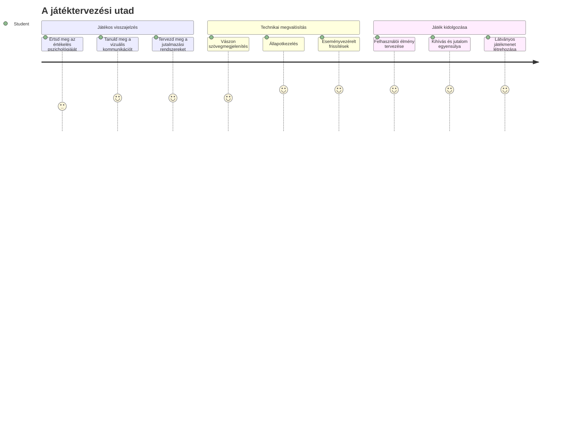
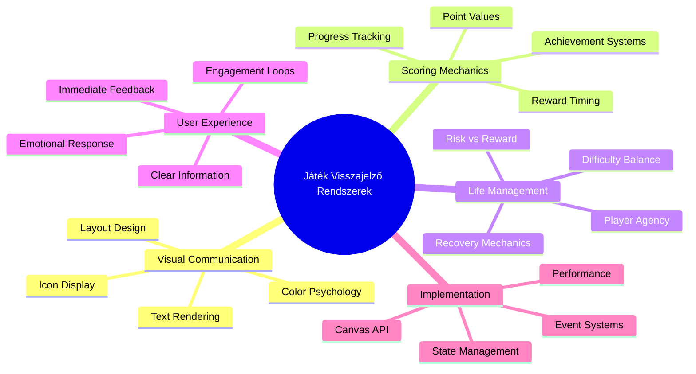
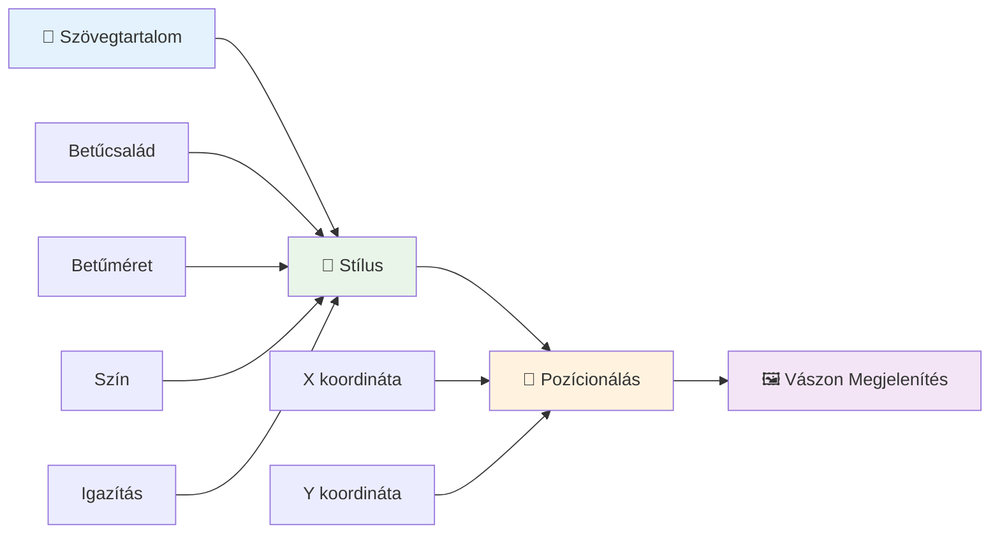
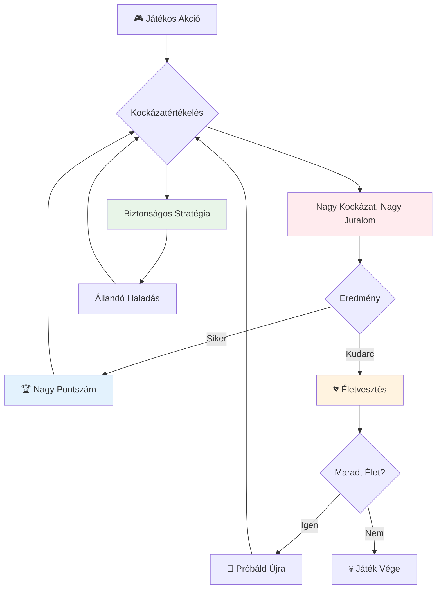
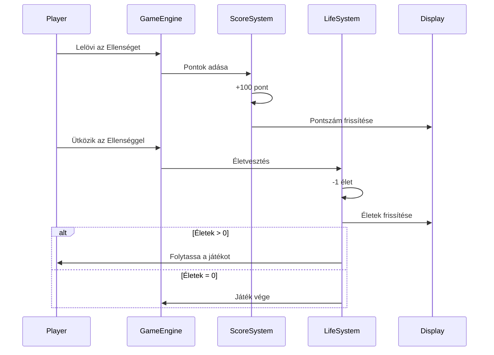
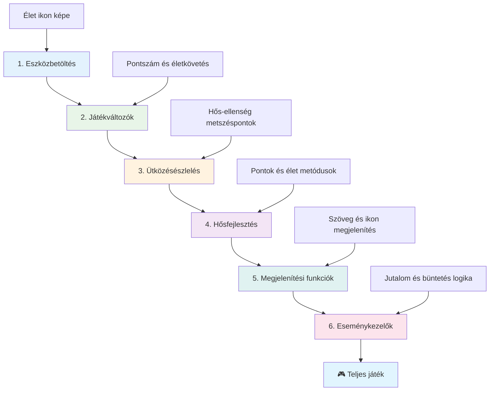
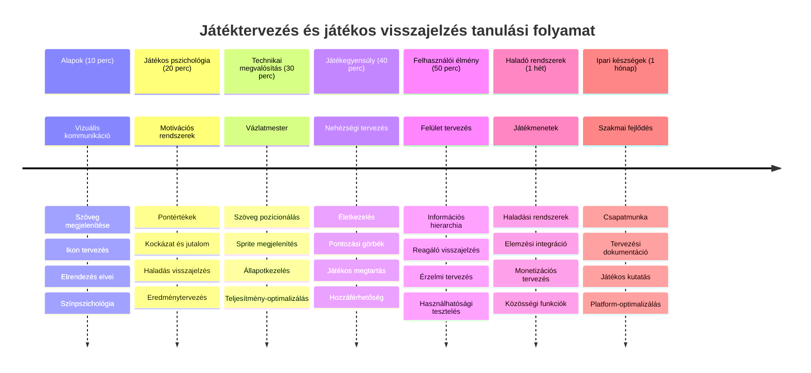

<!--
CO_OP_TRANSLATOR_METADATA:
{
  "original_hash": "2ed9145a16cf576faa2a973dff84d099",
  "translation_date": "2026-01-07T02:43:20+00:00",
  "source_file": "6-space-game/5-keeping-score/README.md",
  "language_code": "hu"
}
-->
# 5. rész: Űrjáték készítése – Pontozás és Életek


## Óra előtti kvíz

[Óra előtti kvíz](https://ff-quizzes.netlify.app/web/quiz/37)

Készen állsz arra, hogy az űrjátékodat valódi játéknak éreztesd? Adjunk hozzá pontozást és életek kezelését – a kulcsmechanikákat, amelyek az olyan korai arcade játékokat, mint a Space Invaders, egyszerű demókból függőséget okozó szórakozássá változtatták. Itt válik igazán játhatóvá a játékod.


## Szöveg megjelenítése a képernyőn – a játékod hangja

A pontszámod megjelenítéséhez meg kell tanulnunk, hogyan jelenítsünk meg szöveget a canvas-on. A `fillText()` metódus a fő eszközöd erre – ugyanez a technika volt használatban a klasszikus arcade játékokban, hogy megjelenítsék a pontszámokat és az állapotinformációkat.


Teljes mértékben kontrollálhatod a szöveg megjelenését:

```javascript
ctx.font = "30px Arial";
ctx.fillStyle = "red";
ctx.textAlign = "right";
ctx.fillText("show this on the screen", 0, 0);
```

✅ Mélyedj el jobban a [szöveg canvas-re történő hozzáadásában](https://developer.mozilla.org/docs/Web/API/Canvas_API/Tutorial/Drawing_text) – meglepődhetsz, milyen kreatív lehetsz betűtípusok és stílusok terén!

## Életek – Több, mint egyszerű szám

A játéktervezésben az „élet” a játékos hibázási lehetőségét jelenti. Ez a koncepció egészen a flippergépekig vezethető vissza, ahol több golyóval játszhattál. Az olyan korai videojátékokban, mint az Asteroids, az életek lehetőséget adtak a játékosoknak, hogy kockáztassanak és tanuljanak a hibákból.


A vizuális megjelenítés nagyon fontos – a hajó ikonok megjelenítése ahelyett, hogy csak „Életek: 3” szöveg lenne, azonnali vizuális felismerést ad, hasonlóan ahhoz, ahogy a korai arcade kabinetek ikonográfiát használtak, hogy nyelvi akadályokon átnyúlva kommunikáljanak.

## Játékod jutalmazási rendszerének felépítése

Most megvalósítjuk azokat az alapvető visszacsatolási rendszereket, amelyek fenntartják a játékosok elkötelezettségét:


- **Pontozási rendszer**: Minden legyőzött ellenséges hajó 100 pontot ér (a kerek számok a játékosoknak könnyebben fejben számolhatók). A pontszám a bal alsó sarokban jelenik meg.
- **Élet számláló**: A hősöd három élettel indul – ez egy korai arcade játékok által lefektetett standard, hogy egyensúlyban tartsa a kihívást és a játszhatóságot. Minden találkozás az ellenséggel egy életet elvesz. A megmaradt életeket jobb alsó sarokban hajó ikonokkal fogjuk megjeleníteni .

## Kezdjük az építkezést!

Először állítsd be a munkakörnyezetedet. Navigálj a `your-work` almappádban található fájlokhoz. Ezeket kell látnod:

```bash
-| assets
  -| enemyShip.png
  -| player.png
  -| laserRed.png
-| index.html
-| app.js
-| package.json
```

A játék teszteléséhez indítsd el a fejlesztői szervert a `your_work` mappából:

```bash
cd your-work
npm start
```

Ezzel egy helyi szerver fut a `http://localhost:5000` címen. Nyisd meg ezt a címet a böngésződben, hogy lásd a játékot. Próbáld ki az irányítást a nyilakkal, és próbálj meg ellenségeket lőni, hogy meggyőződj, minden működik.


### Ideje kódolni!

1. **Szerezd be a szükséges vizuális erőforrásokat**. Másold át a `life.png` erőforrást a `solution/assets/` mappából a `your-work` mappádba. Ezután add hozzá a lifeImg-et a window.onload függvényedhez:

    ```javascript
    lifeImg = await loadTexture("assets/life.png");
    ```

1. Ne felejtsd el hozzáadni a `lifeImg`-et az erőforrás-listádhoz:

    ```javascript
    let heroImg,
    ...
    lifeImg,
    ...
    eventEmitter = new EventEmitter();
    ```
  
2. **Állítsd be a játék változókat**. Adj hozzá kódot a teljes pontszám (kezdetben 0) és a megmaradt életek (kezdetben 3) követésére. Ezeket meg fogjuk jeleníteni a képernyőn, hogy a játékosok mindig tudják, hol állnak.

3. **Valósítsd meg az ütközés érzékelést**. Bővítsd az `updateGameObjects()` függvényed, hogy érzékelje, amikor az ellenségek összeütköznek a hőssel:

    ```javascript
    enemies.forEach(enemy => {
        const heroRect = hero.rectFromGameObject();
        if (intersectRect(heroRect, enemy.rectFromGameObject())) {
          eventEmitter.emit(Messages.COLLISION_ENEMY_HERO, { enemy });
        }
      })
    ```

4. **Adj élet- és pontkövetést a Hősödnek**. 
   1. **Inicializáld a számlálókat**. A `this.cooldown = 0` alatt a `Hero` osztályban állítsd be az élet- és pontszámokat:

        ```javascript
        this.life = 3;
        this.points = 0;
        ```

   1. **Mutasd meg ezeket az értékeket a játékosnak**. Készíts függvényeket arra, hogy ezeket az értékeket a képernyőre rajzold:

        ```javascript
        function drawLife() {
          // TODO, 35, 27
          const START_POS = canvas.width - 180;
          for(let i=0; i < hero.life; i++ ) {
            ctx.drawImage(
              lifeImg, 
              START_POS + (45 * (i+1) ), 
              canvas.height - 37);
          }
        }
        
        function drawPoints() {
          ctx.font = "30px Arial";
          ctx.fillStyle = "red";
          ctx.textAlign = "left";
          drawText("Points: " + hero.points, 10, canvas.height-20);
        }
        
        function drawText(message, x, y) {
          ctx.fillText(message, x, y);
        }

        ```

   1. **Kapcsold be mindezt a játék ciklusába**. Add hozzá ezeket a függvényeket a window.onload függvényedhez közvetlenül az `updateGameObjects()` után:

        ```javascript
        drawPoints();
        drawLife();
        ```

### 🔄 **Pedagógiai ellenőrzés**
**Játéktervezési megértés**: Mielőtt bevezetnéd a következményeket, bizonyosodj meg róla, hogy érted:
- ✅ Hogyan kommunikál a vizuális visszacsatolás a játék állapotáról a játékosok felé
- ✅ Miért javítja a használhatóságot a felhasználói felület elemeinek következetes elhelyezése
- ✅ A pontértékek és az életkezelés pszichológiája
- ✅ Hogyan különbözik a canvas szövegmegjelenítés az HTML szövegtől

**Gyors önellenőrzés**: Miért használnak a játékterem játékok általában kerek számokat pontértéknek?
*Válasz: A kerek számokat a játékosok könnyebben számolják fejben, és kielégítő pszichológiai jutalmat adnak*

**Felhasználói élmény alapelvei**: Most alkalmazod:
- **Vizuális hierarchia**: Fontos információk kiemelt elhelyezése
- **Azonnali visszacsatolás**: Valós idejű frissítések a játékos műveleteire
- **Kognitív terhelés**: Egyszerű, tiszta információközlés
- **Érzelmi tervezés**: Ikonok és színek, melyek játékosi kötődést teremtenek

1. **Valósítsd meg a játék következményeit és jutalmait**. Most bevezetjük azokat a visszacsatolási rendszereket, amelyek értelmessé teszik a játékos cselekedeteit:

   1. **Ütközések életvesztéssel járnak**. Minden alkalommal, amikor a hősöd ellenséggel ütközik, veszíts egy életet.
   
      Add hozzá ezt a metódust a `Hero` osztályodhoz:

        ```javascript
        decrementLife() {
          this.life--;
          if (this.life === 0) {
            this.dead = true;
          }
        }
        ```

   2. **Az ellenségek lelövése pontokat ér**. Minden sikeres találat 100 pontot ad, azonnali pozitív visszajelzést nyújtva a pontos lövésért.

      Bővítsd a Hero osztályt ezzel a pontnövelő metódussal:
    
        ```javascript
          incrementPoints() {
            this.points += 100;
          }
        ```

        Most kösd össze ezeket a függvényeket az ütközési eseményekkel:

        ```javascript
        eventEmitter.on(Messages.COLLISION_ENEMY_LASER, (_, { first, second }) => {
           first.dead = true;
           second.dead = true;
           hero.incrementPoints();
        })

        eventEmitter.on(Messages.COLLISION_ENEMY_HERO, (_, { enemy }) => {
           enemy.dead = true;
           hero.decrementLife();
        });
        ```

✅ Kíváncsi vagy más JavaScript és Canvas alapú játékokra? Fedezd fel őket – lehet, hogy meg fogsz lepődni, mi minden lehetséges!

Miután bevezetted ezeket a funkciókat, teszteld a játékot, hogy láss teljes visszacsatolási rendszert működés közben. Látnod kell az élet ikonokat a jobb alsó sarokban, a pontszámot a bal alsó sarokban, és azt, hogy az ütközések csökkentik az életeket, míg a sikeres lövések növelik a pontszámot.

A játékod most már tartalmazza azokat az alapvető mechanikákat, amelyek a korai arcade játékokat olyan vonzóvá tették – tiszta célok, azonnali visszacsatolás és értelmes következmények a játékos cselekedeteiért.

### 🔄 **Pedagógiai ellenőrzés**
**Teljes játéktervezési rendszer**: Ellenőrizd a játékos visszacsatolási rendszerekben szerzett jártasságodat:
- ✅ Hogyan motiválják és kötik le a játékosokat a pontozási mechanizmusok?
- ✅ Miért fontos a vizuális következetesség a felhasználói felület tervezésében?
- ✅ Hogyan egyensúlyozza az élet rendszer a kihívást és a játékos megtartását?
- ✅ Milyen szerepe van az azonnali visszacsatolásnak a kielégítő játékmenet létrehozásában?

**Rendszerintegráció**: A visszacsatolási rendszered megmutatja:
- **Felhasználói élmény tervezés**: Tiszta vizuális kommunikáció és információs hierarchia
- **Esemény-vezérelt architektúra**: Játékos cselekedetekre való válaszkész frissítések
- **Állapotkezelés**: A dinamikus játékadatok követése és megjelenítése
- **Canvas mesterség**: Szövegmegjelenítés és sprite pozícionálás
- **Játékpszichológia**: A játékosi motiváció és elköteleződés megértése

**Szakmai minták**: Megvalósítottad:
- **MVC architektúra**: Játékklogika, adat és megjelenítés szétválasztása
- **Observer minta**: Esemény-vezérelt frissítések a játékmenet állapotváltozásaira
- **Komponens tervezés**: Újrahasznosítható függvények megjelenítéshez és logikához
- **Teljesítmény-optimalizálás**: Hatékony megjelenítés a játékhurokban

### ⚡ **Mit csinálhatsz a következő 5 percben**
- [ ] Kísérletezz a különböző betűméretekkel és színekkel a pontszám megjelenítésében
- [ ] Próbáld meg változtatni a pontértékeket, és figyeld meg, hogyan befolyásolja a játékmenetet
- [ ] Adj hozzá console.log állításokat, hogy kövesd a pontok és életek változását
- [ ] Teszteld a szélsőséges eseteket, mint az életek elfogyása vagy magas pontszám elérése

### 🎯 **Mit érhetsz el ezen az órán**
- [ ] Teljesítsd a lecke utáni kvízt, és értsd meg a játéktervezési pszichológiát
- [ ] Adj hanghatásokat a pontszerzéshez és életvesztéshez
- [ ] Valósíts meg egy magas pontszám rendszert localStorage használatával
- [ ] Készíts különböző pontértékeket az ellenség típusokhoz
- [ ] Adj vizuális effektusokat, mint például képernyőremegés az életvesztéskor

### 📅 **Többnapos játéktervezési utad**
- [ ] Fejezd be az egész űrjátékot polírozott visszacsatolási rendszerekkel
- [ ] Valósíts meg haladó pontozási mechanikákat, például kombó szorzókat
- [ ] Adj hozzá eredményeket és feloldható tartalmakat
- [ ] Készíts nehézségi görbéket és balanszírozási rendszereket
- [ ] Tervezd meg a menük és játék vége képernyők felhasználói felületét
- [ ] Tanulmányozz más játékokat, hogy megértsd az elköteleződés mechanizmusait

### 🌟 **Hónapos játékfejlesztési mesterséged**
- [ ] Építs teljes játékokat kifinomult előrehaladási rendszerekkel
- [ ] Tanulj játékanalitikát és a játékos viselkedés mérését
- [ ] Vegyél részt open source játékfejlesztési projektekben
- [ ] Sajátítsd el a haladó játéktervezési mintákat és a monetizációt
- [ ] Készíts oktatási tartalmat játéktervezésről és felhasználói élményről
- [ ] Építs portfóliót, amely bemutatja játéktervezési és fejlesztési készségeidet

## 🎯 Játéktervezési mesterkurzus idővonala


### 🛠️ Játéktervezési eszköztár összefoglaló

A lecke elvégzése után mostanra elsajátítottad:
- **Játékos pszichológia**: A motiváció, kockázat/jutalom és elkötelezettségi hurkok megértése
- **Vizuális kommunikáció**: Hatékony UI tervezés szöveggel, ikonokkal és elrendezéssel
- **Visszacsatolási rendszerek**: Valós idejű reakció a játékos műveletekre és játékeseményekre
- **Állapotkezelés**: A dinamikus játékadatok hatékony nyomon követése és megjelenítése
- **Canvas szövegmegjelenítés**: Professzionális szövegmegjelenítés stílusokkal és pozícionálással
- **Esemény integráció**: Felhasználói műveletek összekapcsolása értelmes játék következményekkel
- **Játék egyensúly**: Nehézségi görbék és játékos előrehaladási rendszerek tervezése

**Valós alkalmazások**: Játéktervezési képességeid közvetlenül alkalmazhatók:
- **Felhasználói felület tervezés**: Elkötelező és intuitív felületek készítése
- **Termékfejlesztés**: Felhasználói motiváció és visszacsatolási hurkok megértése
- **Oktatási technológia**: Gamifikáció és tanulói elköteleződés rendszerek
- **Adatvizualizáció**: Komplex információk hozzáférhetővé és élvezetessé tétele
- **Mobilalkalmazás fejlesztés**: Megtartó mechanizmusok és felhasználói élmény tervezése
- **Marketing technológia**: Felhasználói viselkedés és konverzió optimalizálás megértése

**Szakmai készségek, amiket szereztél**: Most már képes vagy:
- **Tervezni** olyan felhasználói élményeket, amelyek motiválják és lekötik a felhasználókat
- **Megvalósítani** visszacsatolási rendszereket, amelyek hatékonyan irányítják a felhasználói viselkedést
- **Kiegyensúlyozni** a kihívást és a hozzáférhetőséget interaktív rendszerekben
- **Készíteni** vizuális kommunikációt, ami működik különböző felhasználói csoportok számára
- **Elemezni** a felhasználói viselkedést és iterálni a tervezési fejlesztéseket

**Játékfejlesztési fogalmak elsajátítása**:
- **Játékosi motiváció**: Megérteni, mi hajtja az elkötelezettséget és megtartást
- **Vizuális tervezés**: Tiszta, vonzó és funkcionális felületek létrehozása
- **Rendszerintegráció**: Több játékrendszer összekapcsolása egységes élményért
- **Teljesítmény optimalizálás**: Hatékony megjelenítés és állapotkezelés
- **Akadálymentesség**: Különböző készségi szintek és játékosi igények figyelembevétele

**Következő lépés**: Készen állsz arra, hogy felfedezd a haladó játéktervezési mintákat, megvalósíts analitikai rendszereket, vagy tanulmányozd a játék monetizációját és játékos megtartási stratégiákat!

🌟 **Teljesítmény kitűzve**: Felépítettél egy teljes körű játékosi visszacsatolási rendszert professzionális játéktervezési elvekkel!

---

## GitHub Copilot ügynök kihívás 🚀

Használd az Agent módot az alábbi kihívás teljesítéséhez:

**Leírás:** Fejleszd az űrjáték pontozási rendszerét egy magas pontszám funkcióval, amely tartós tárolást biztosít és bónusz pontokat ad egymás utáni ellenség leölésekért (kombó rendszer), valamint különböző pontokat különböző ellenségtípusokhoz. Tartalmazzon vizuális jelzést, amikor a játékos új rekordot ér el, és jelenítse meg a jelenlegi rekordot a játék képernyőjén.

**Prompt:** Készíts egy magas pontszám rendszert, amely menti a játékos legjobb pontszámát a localStorage-ba. Adj bónusz pontokat egymás utáni ellenség leölésekért (kombó rendszer), és valósíts meg különböző pontértékeket különböző ellenségtípusokhoz. Tartalmazzon vizuális jelzést, amikor új rekordot ér el a játékos, és jelenítse meg a jelenlegi rekordot a képernyőn.

## 🚀 Kihívás

Most már van működő játékod pontozással és életekkel. Gondolkodj el, milyen további funkciók tehetnék még élvezetesebbé a játékos élményt.

## Óra utáni kvíz

[Óra utáni kvíz](https://ff-quizzes.netlify.app/web/quiz/38)

## Áttekintés & Önálló tanulás

Szeretnél többet felfedezni? Kutass különböző megközelítéseket a játék pontozási és élet rendszerekhez. Vannak izgalmas játékmotorok, mint például a [PlayFab](https://playfab.com) amelyek kezelik a pontozást, toplistákat és a játékos előrehaladást. Hogyan emelhetné játéka szintjét egy ilyen integráció?

## Feladat

[Építs pontozós játékot](assignment.md)

---

<!-- CO-OP TRANSLATOR DISCLAIMER START -->
**Kizáró nyilatkozat**:  
Ezt a dokumentumot az AI fordító szolgáltatás, a [Co-op Translator](https://github.com/Azure/co-op-translator) használatával fordítottuk. Bár a pontosságra törekszünk, kérjük, vegye figyelembe, hogy az automatikus fordítások tartalmazhatnak hibákat vagy pontatlanságokat. Az eredeti dokumentum az anyanyelvén tekintendő hivatalos forrásnak. Fontos információk esetén professzionális emberi fordítást javaslunk. Nem vállalunk felelősséget a fordítás használatából eredő félreértésekért vagy helytelen értelmezésekért.
<!-- CO-OP TRANSLATOR DISCLAIMER END -->