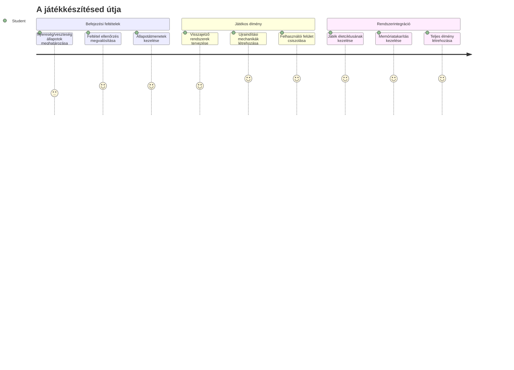
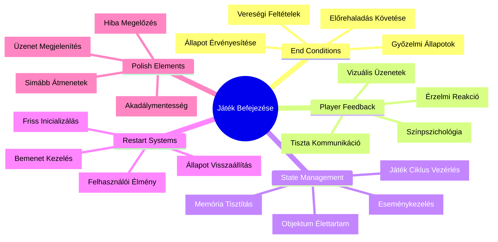
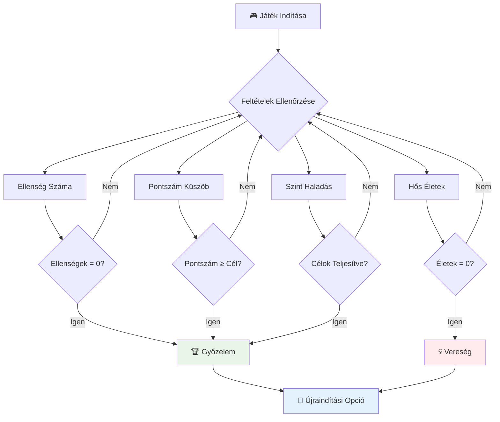
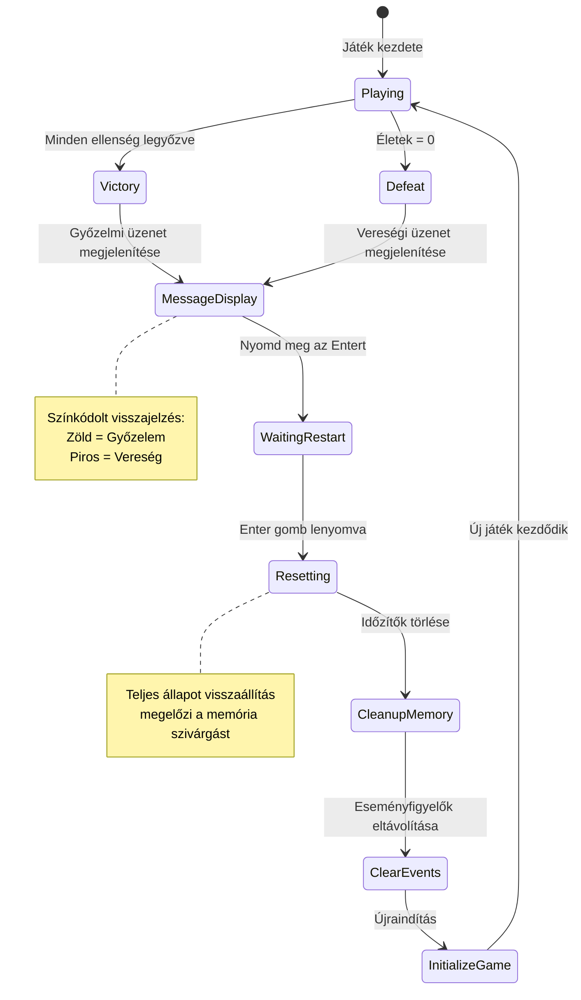
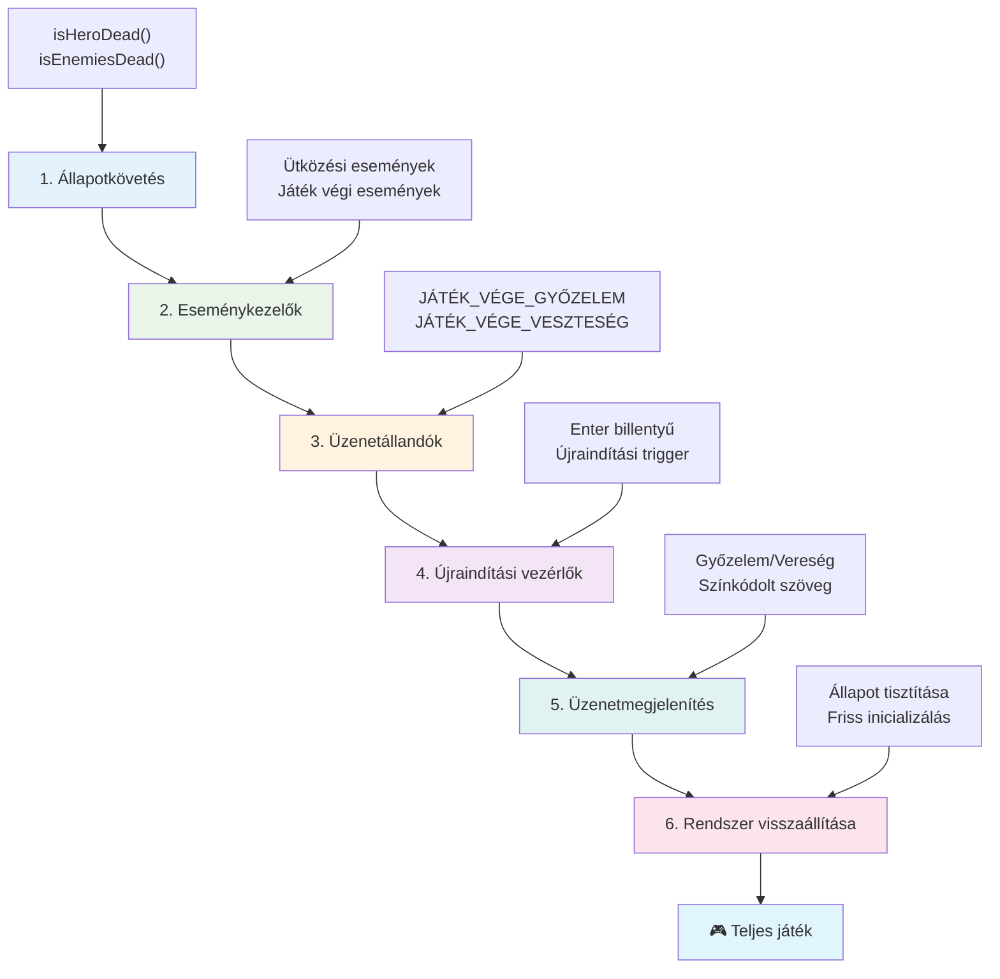
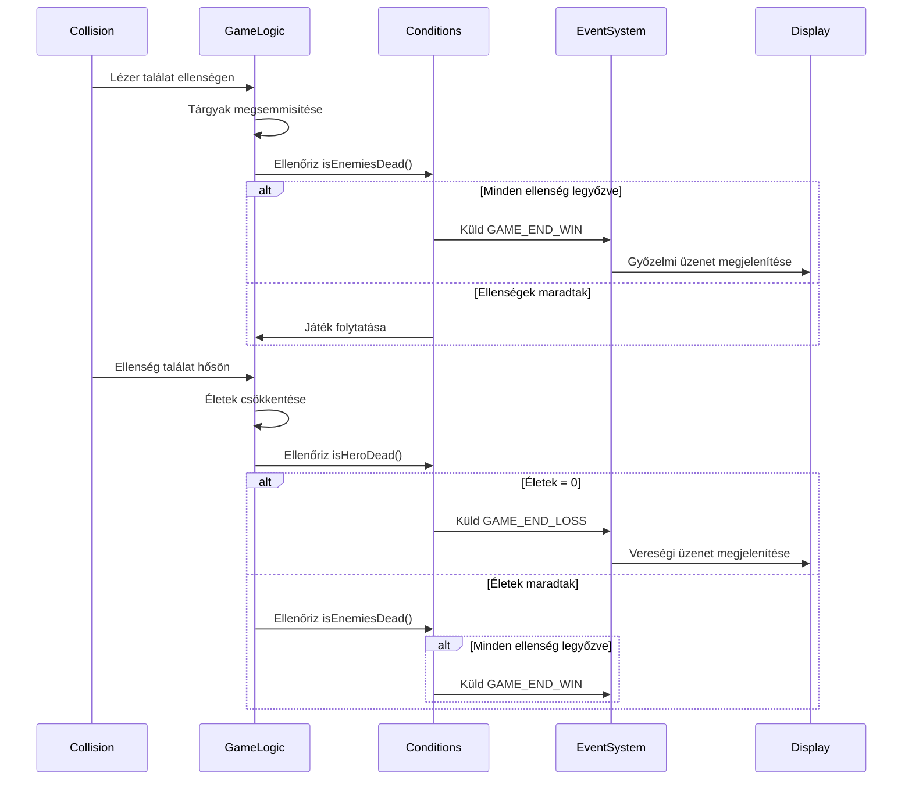
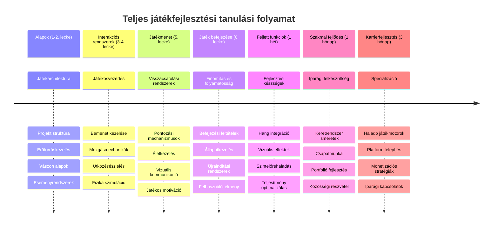

<!--
CO_OP_TRANSLATOR_METADATA:
{
  "original_hash": "a4b78043f4d64bf3ee24e0689b8b391d",
  "translation_date": "2026-01-07T02:41:33+00:00",
  "source_file": "6-space-game/6-end-condition/README.md",
  "language_code": "hu"
}
-->
# Build a Space Game Part 6: End and Restart


Minden nagyszerű játéknak szüksége van egyértelmű befejezési feltételekre és gördülékeny újraindítási mechanizmusra. Már építettél egy lenyűgöző űrhajós játékot mozgással, harccal és pontszámokkal – most itt az ideje hozzáadni az utolsó darabokat, amelyek teljessé teszik az élményt.

A játékod jelenleg végtelenül fut, mint a Voyager űrszondák, amelyeket a NASA 1977-ben indított útnak – évtizedekkel később is az űrben utaznak. Míg ez megfelelő az űrkutatáshoz, a játékoknak meghatározott végpontokra van szükségük, hogy kielégítő élményt nyújtsanak.

Ma megvalósítjuk a megfelelő győzelmi/vereségi feltételeket és egy újraindítási rendszert. A lecke végére egy kifinomult játékod lesz, amelyet a játékosok befejezhetnek és újrajátszhatnak, akárcsak a klasszikus arcade játékok, amelyek meghatározták a műfajt.


## Előadás előtti kvíz

[Előadás előtti kvíz](https://ff-quizzes.netlify.app/web/quiz/39)

## A játék befejező feltételeinek megértése

Mikor érjen véget a játékod? Ez az alapvető kérdés formálja a játékmenet-tervezést az arcade korszak korai időszaka óta. A Pac-Man akkor ér véget, amikor a szellemek elkapnak, vagy az összes pontot felszedi, míg a Space Invaders akkor ér véget, amikor az idegenek elérik az alsó sorokat, vagy az összeset megsemmisíted.

A játék készítőjeként neked kell meghatároznod a győzelmi és vereségi feltételeket. Az űrhajós játékunkhoz itt vannak bevált megközelítések, amelyek lebilincselő játékmenetet hoznak létre:


- **`N` ellenséges hajó megsemmisítve**: Ha a játék több szintre van osztva, gyakori, hogy egy szint teljesítéséhez `N` ellenséges hajót kell megsemmisíteni.
- **A hajód megsemmisült**: Vannak játékok, ahol a hajód megsemmisülése esetén veszítesz. Egy másik gyakori megközelítés az életfogalom használata: minden hajóvesztés levon egy életet. Amikor az összes élet elfogyott, a játék véget ér.
- **`N` pontot gyűjtöttél össze**: Egy másik gyakori befejezési feltétel, hogy bizonyos pontszámot gyűjts össze. A pontokat különböző tevékenységekhez rendelheted, például ellenséges hajók megsemmisítéséhez vagy elemek gyűjtéséhez, amelyeket a megsemmisített ellenségek dobnak.
- **Szint teljesítése**: Ez több feltételt is tartalmazhat, mint például `X` ellenséges hajó megsemmisítése, `Y` pont gyűjtése vagy egy adott tárgy össze szedése.

## Játék újraindítás funkció megvalósítása

A jó játékok újrajátszhatóságot ösztönöznek gördülékeny újraindítási mechanizmusokkal. Amikor a játékosok befejezik a játékot (vagy vereséget szenvednek), gyakran azonnal újra akarnak kezdeni – akár hogy megdöntsék a pontszámukat, akár hogy javítsanak a teljesítményükön.


A Tetris ezt tökéletesen példázza: amikor a blokkok elérik a képernyő tetejét, azonnal kezdhetsz egy új játékot, anélkül, hogy bonyolult menükben kellene navigálnod. Egy hasonló újraindítási rendszert építünk, amely tisztán visszaállítja a játék állapotát és gyorsan visszavarázsolja a játékosokat a cselekvésbe.

✅ **Elmélkedés**: Gondold át a játékokat, amiket játszottál. Milyen feltételek mellett érnek véget, és hogyan kérnek fel az újrakezdésre? Mi teszi az újraindítás élményét gördülékennyé vagy éppen frusztrálóvá?

## Amit építeni fogsz

Megvalósítod azokat a végső funkciókat, amelyek játékod teljes élménnyé alakítják. Ezek az elemek választják el a kész játékokat a kezdetleges prototípusoktól.

**Ma ezt adjuk hozzá:**

1. **Győzelmi feltétel**: Semmisíts meg minden ellenséget, és tarts igazi ünneplést (megdolgoztál érte!)
2. **Vereségi feltétel**: Élet elfogyott, nézz szembe a vereség képernyővel
3. **Újraindítási mechanizmus**: Nyomd meg az Entert, hogy azonnal újrakezd - mert egy játék sosem elég
4. **Állapotkezelés**: Minden alkalommal tiszta lap – nincs maradék ellenség vagy furcsa hibák az előző játékból

## Kezdjük el

Készítsd elő a fejlesztői környezeted. Előző leckékből már meg kell lennie az űrhajós játék fájljainak.

**A projekted valami ilyesmit kell, hogy mutasson:**

```bash
-| assets
  -| enemyShip.png
  -| player.png
  -| laserRed.png
  -| life.png
-| index.html
-| app.js
-| package.json
```

**Indítsd el a fejlesztői szervert:**

```bash
cd your-work
npm start
```

**Ez a parancs:**
- Egy helyi szervert futtat a `http://localhost:5000` címen
- Megfelelően szolgálja ki a fájlokat
- Automatikusan frissít, amikor változtatásokat végzel

Nyisd meg a `http://localhost:5000` címet a böngésződben és ellenőrizd, hogy a játékod fut. Tudnod kell mozogni, lőni és interakcióba lépni az ellenségekkel. Miután meggyőződtél erről, folytathatjuk a megvalósítást.

> 💡 **Pro Tipp**: A figyelmeztetések elkerülésére a Visual Studio Code-ban deklaráld a `gameLoopId` változót a fájl tetején `let gameLoopId;` formában ahelyett, hogy az `window.onload` függvényben hoznád létre. Ez követi a modern JavaScript változó deklarációs jó gyakorlatokat.


## Megvalósítási lépések

### 1. lépés: Vége feltétel nyomonkövető függvények létrehozása

Olyan függvényekre van szükségünk, amelyek figyelik, mikor kell véget érnie a játéknak. Mint az Nemzetközi Űrállomás szenzorai, amelyek folyamatosan ellenőrzik a kritikus rendszereket, ezek a függvények állandóan vizsgálni fogják a játék állapotát.

```javascript
function isHeroDead() {
  return hero.life <= 0;
}

function isEnemiesDead() {
  const enemies = gameObjects.filter((go) => go.type === "Enemy" && !go.dead);
  return enemies.length === 0;
}
```

**Itt történik az a motorháztető alatt:**
- **Ellenőrzi**, hogy a hősödnek elfogytak-e az életei (au!)
- **Számolja**, hány ellenség él még és "ütközhet" veled
- **Igaz értéket ad vissza**, amikor a harctér megtisztult az ellenségektől
- **Egyszerű igaz/hamis logikát használ**, hogy könnyű legyen követni
- **Válogat** az összes játékobjektum között, hogy megtalálja a túlélőket

### 2. lépés: Eseménykezelők frissítése a befejező feltételekhez

Most összekapcsoljuk ezeket az ellenőrzéseket a játék eseményrendszerével. Minden ütközéskor a játék értékeli majd, hogy beindul-e egy befejező feltétel. Ez azonnali visszacsatolást teremt a kritikus játékeseményekhez.


```javascript
eventEmitter.on(Messages.COLLISION_ENEMY_LASER, (_, { first, second }) => {
    first.dead = true;
    second.dead = true;
    hero.incrementPoints();

    if (isEnemiesDead()) {
      eventEmitter.emit(Messages.GAME_END_WIN);
    }
});

eventEmitter.on(Messages.COLLISION_ENEMY_HERO, (_, { enemy }) => {
    enemy.dead = true;
    hero.decrementLife();
    if (isHeroDead())  {
      eventEmitter.emit(Messages.GAME_END_LOSS);
      return; // veszteség a győzelem előtt
    }
    if (isEnemiesDead()) {
      eventEmitter.emit(Messages.GAME_END_WIN);
    }
});

eventEmitter.on(Messages.GAME_END_WIN, () => {
    endGame(true);
});
  
eventEmitter.on(Messages.GAME_END_LOSS, () => {
  endGame(false);
});
```

**Ez történik itt:**
- **A lézer eltalálja az ellenséget**: Mindkettő eltűnik, pontokat kapsz, és ellenőrizzük, hogy nyertél-e
- **Az ellenség eltalál téged**: Életet veszítesz, és ellenőrizzük, hogy még élsz-e
- **Okos sorrend**: Először a vereséget ellenőrizzük (senki sem akar egyszerre nyerni és veszíteni!)
- **Azonnali reakciók**: Amint valami fontos történik, a játék azonnal tudomást szerez róla

### 3. lépés: Új üzenet konstansok hozzáadása

Új üzenet típusokat kell hozzáadnod a `Messages` konstans objektumhoz. Ezek a konstansok segítenek fenntartani a konzisztenciát és megelőzni az elírásokat az eseménykezelő rendszeredben.

```javascript
GAME_END_LOSS: "GAME_END_LOSS",
GAME_END_WIN: "GAME_END_WIN",
```

**A fentiekben:**
- **Hozzáadtunk** játék vége eseményekhez konstansokat a konzisztencia érdekében
- **Leíró neveket** használtunk, amelyek egyértelműen jelzik az esemény célját
- **Követjük** a meglévő elnevezési konvenciót az üzenettípusoknál

### 4. lépés: Újraindítás vezérlők megvalósítása

Most hozzáadod a billentyűzetvezérlést, amely lehetővé teszi a játékosok számára, hogy újrakezdjék a játékot. Az Enter billentyű természetes választás, mivel ez gyakran társul az akciók megerősítésével és új játék indításával.

**Adj Enter billentyű érzékelést a meglévő keydown eseményfigyelődbe:**

```javascript
else if(evt.key === "Enter") {
   eventEmitter.emit(Messages.KEY_EVENT_ENTER);
}
```

**Add hozzá az új üzenet-konstansot is:**

```javascript
KEY_EVENT_ENTER: "KEY_EVENT_ENTER",
```

**Amit tudni kell:**
- **Kiterjeszti** a már meglévő billentyűzet eseménykezelési rendszert
- **Az Enter billentyűt használja** az újrakezdés indítására, hogy intuitív legyen
- **Egyedi eseményt bocsát ki**, amelyet a játék más részei is hallgathatnak
- **Ugyanazt a mintát követi**, mint a többi billentyűvezérlésed

### 5. lépés: Üzenet megjelenítő rendszer létrehozása

A játékodnak egyértelműen kell kommunikálnia az eredményeket a játékosokkal. Egy üzenet rendszert fogunk készíteni, amely megjeleníti a győzelmi és vereségi állapotokat színkódolt szöveggel, hasonlóan a korai számítógépes terminálokhoz, ahol a zöld jelzett siker, a piros pedig hibát.

**Készítsd el a `displayMessage()` függvényt:**

```javascript
function displayMessage(message, color = "red") {
  ctx.font = "30px Arial";
  ctx.fillStyle = color;
  ctx.textAlign = "center";
  ctx.fillText(message, canvas.width / 2, canvas.height / 2);
}
```

**Lépésről lépésre:**
- **Beállítja** a betűméretet és -családot a tiszta, olvasható szöveghez
- **Alkalmaz egy szín paramétert**, alapértelmezettként pirossal a figyelmeztetésekhez
- **Középre igazítja** a szöveget vízszintesen és függőlegesen a vásznon
- **Modern JavaScript alapértelmezett paramétereket használ** a rugalmas színválasztáshoz
- **Használja** a vászon 2D kontextusát közvetlen szövegmegjelenítéshez

**Készítsd el az `endGame()` függvényt:**

```javascript
function endGame(win) {
  clearInterval(gameLoopId);

  // Állítson be egy késleltetést annak biztosítására, hogy az esetleges függőben lévő renderelések befejeződjenek
  setTimeout(() => {
    ctx.clearRect(0, 0, canvas.width, canvas.height);
    ctx.fillStyle = "black";
    ctx.fillRect(0, 0, canvas.width, canvas.height);
    if (win) {
      displayMessage(
        "Victory!!! Pew Pew... - Press [Enter] to start a new game Captain Pew Pew",
        "green"
      );
    } else {
      displayMessage(
        "You died !!! Press [Enter] to start a new game Captain Pew Pew"
      );
    }
  }, 200)  
}
```

**Ez a függvény csinálja:**
- **Megállít mindent –** nincs több mozgó hajó vagy lézer
- **Kis szünetet tart (200ms),** hogy az utolsó képkocka befejeződjön
- **Tisztítja a képernyőt,** és feketére festi a drámai hatásért
- **Különböző üzeneteket mutat győzteseknek és veszteseknek**
- **Színkódolja a híreket – zöld a jó, piros a... nem annyira jó**
- **Megmondja a játékosoknak, hogyan ugorjanak vissza**

### 🔄 **Pedagógiai visszacsatolás**
**Állapotkezelés**: Mielőtt megvalósítanád az újraindítást, győződj meg róla, hogy érted:
- ✅ Hogyan alakítanak ki a befejezési feltételek világos játékmenet célokat
- ✅ Miért fontos a vizuális visszajelzés a játékos megértése szempontjából
- ✅ A megfelelő takarítás fontossága a memória szivárgás megelőzésében
- ✅ Hogyan segíti az eseményvezérelt architektúra a tiszta állapotváltásokat

**Gyors önellenőrzés**: Mi történne, ha nem távolítanád el az eseményfigyelőket a reset során?
*Válasz: Memóriaszivárgás és többszörös eseménykezelők okoznának kiszámíthatatlan viselkedést*

**Játékmenet tervezési elvek**: Most éppen ezeket valósítod meg:
- **Világos célok**: A játékos pontosan tudja, mi a siker és a kudarc
- **Azonnali visszacsatolás**: A játék állapotváltozásai azonnal kommunikálódnak
- **Felhasználói vezérlés**: A játékos újraindíthat, amikor szeretne
- **Rendszer megbízhatóság**: A megfelelő takarítás megelőzi a hibákat és teljesítménycsökkenést

### 6. lépés: Játék újraindítás funkció megvalósítása

Az újraindítási rendszernek teljesen el kell takarítania a jelenlegi játékmenet állapotat és el kell indítania egy új játékot. Ez biztosítja, hogy a játékosok tiszta lappal kezdjenek, anélkül, hogy maradék adatok befolyásolnák az új játékot.

**Készítsd el a `resetGame()` függvényt:**

```javascript
function resetGame() {
  if (gameLoopId) {
    clearInterval(gameLoopId);
    eventEmitter.clear();
    initGame();
    gameLoopId = setInterval(() => {
      ctx.clearRect(0, 0, canvas.width, canvas.height);
      ctx.fillStyle = "black";
      ctx.fillRect(0, 0, canvas.width, canvas.height);
      drawPoints();
      drawLife();
      updateGameObjects();
      drawGameObjects(ctx);
    }, 100);
  }
}
```

**Értelmezzük a részeket:**
- **Ellenőrzi**, hogy fut-e már játékciklus, mielőtt újraindítana
- **Megszünteti** a meglévő játékciklust, minden jelenlegi tevékenységgel együtt
- **Eltávolítja** az összes eseményfigyelőt, hogy megelőzze a memóriaszivárgást
- **Újra inicializálja** a játék állapotát friss objektumokkal és változókkal
- **Elindítja** az új játékciklust az összes szükséges funkcióval
- **Fenntartja** a 100ms-os intervallumot a következetes teljesítmény érdekében

**Add hozzá az Enter billentyű eseménykezelőt az `initGame()` funkcióhoz:**

```javascript
eventEmitter.on(Messages.KEY_EVENT_ENTER, () => {
  resetGame();
});
```

**Add hozzá a `clear()` metódust az EventEmitter osztályhoz:**

```javascript
clear() {
  this.listeners = {};
}
```

**Fontos szempontok:**
- **Összekapcsolja** az Enter billentyű lenyomását az újraindítási funkcióval
- **Regisztrálja** ezt az eseményfigyelőt a játék inicializálása során
- **Tisztán eltávolítja** az összes eseményfigyelőt újraindításkor
- **Megakadályozza** a memóriaszivárgást az eseménykezelők törlésével
- **Üres állapotra állítja vissza** a hallgatók objektumát az új inicializáláshoz

## Gratulálunk! 🎉

👽 💥 🚀 Sikeresen megépítettél egy teljes játékot a semmiből. Akárcsak azok a programozók, akik az 1970-es években az első videojátékokat készítették, te is sorokat kódot alakítottál interaktív élménnyé megfelelő játékmenet-menedzsmenttel és felhasználói visszajelzéssel. 🚀 💥 👽

**Elértél:**
- **Teljes győzelmi és vereségi feltételek megvalósítása visszajelzéssel**
- **Zökkenőmentes újraindítási rendszer létrehozása megszakítás nélküli játékmenethez**
- **Világos vizuális kommunikáció tervezése a játék állapotairól**
- **Komplex játékmenet állapotkezelés és takarítás megvalósítása**
- **Az összes komponens összeszerelése egy összefüggő, játszható játékba**

### 🔄 **Pedagógiai visszacsatolás**
**Teljes játékkészítési rendszer**: Ünnepeld a játékkészítés teljes folyamatának elsajátítását:
- ✅ Hogyan alkotnak a befejezési feltételek kielégítő élményt?
- ✅ Miért kritikus a megfelelő állapotkezelés a játék stabilitásához?
- ✅ Hogyan fokozza a vizuális visszajelzés a játékos megértését?
- ✅ Milyen szerepet játszik az újraindítási rendszer a játékos megtartásában?

**Rendszer ismeretek**: A teljes játékod demonstrálja:
- **Full-Stack játékfejlesztés**: Grafika, input és állapotkezelés integrációja
- **Professzionális architektúra**: Eseményvezérelt rendszerek, megfelelő takarítással
- **Felhasználói élmény tervezés**: Egyértelmű visszajelzés és intuitív vezérlés
- **Teljesítmény-optimalizálás**: Hatékony renderelés és memória kezelése
- **Finomítás és teljesség**: Minden apró részlet, ami kész érzést ad a játéknak

**Iparági készségek**: Megvalósítottad:
- **Játékciklus architektúra**: Valós idejű rendszerek következetes teljesítménnyel
- **Eseményvezérelt programozás**: Elkülönült, jól skálázható rendszerek
- **Állapotkezelés**: Összetett adatok és életciklus kezelés
- **Felhasználói felület tervezés**: Világos kommunikáció és gyors válaszreakciók
- **Tesztelés és hibakeresés**: Iteratív fejlesztés és problémamegoldás

### ⚡ **Mit tehetsz a következő 5 percben**
- [ ] Játszd végig a teljes játékod, teszteld a győzelmi és vereségi feltételeket
- [ ] Kísérletezz különböző befejezési feltétel paraméterekkel
- [ ] Próbálj konzol.log állításokat hozzáadni a játékállapot változások követésére
- [ ] Oszd meg a játékot barátaiddal és gyűjts visszajelzéseket

### 🎯 **Mit érhetsz el ezen az órán**
- [ ] Fejezd be az utóleckes kvízt és gondolkodj el a játékfejlesztési utadon
- [ ] Adj hozzá hanghatásokat a győzelmi és vereségi állapotokhoz
- [ ] Valósíts meg további befejezési feltételeket, pl. időkorlát vagy bónusz célok
- [ ] Készíts különböző nehézségi szinteket eltérő ellenségszámokkal
- [ ] Finomítsd a vizuális megjelenést jobb betűtípusokkal és színekkel

### 📅 **Hétköznapi játékfejlesztési mesterkurzusod**
- [ ] Fejezd be a fejlesztett űrhajós játékot több szinttel és fejlődéssel
- [ ] Adj hozzá fejlett funkciókat, mint erősítések, különböző ellenségtípusok és speciális fegyverek
- [ ] Készíts magas pontszám rendszert tartós tárolással
- [ ] Tervezd meg a felhasználói felületeket menükhöz, beállításokhoz és játék opciókhoz
- [ ] Optimalizáld a teljesítményt különböző eszközökön és böngészőkben
- [ ] Telepítsd az online játékodat és oszd meg a közösséggel
### 🌟 **Hónapokig Tartó Játékkészítő Karriered**
- [ ] Építs több teljes játékot különböző műfajokban és mechanikákkal
- [ ] Tanulj meg fejlett játékkészítő keretrendszereket, mint a Phaser vagy a Three.js
- [ ] Vegyél részt nyílt forráskódú játékkészítő projektekben
- [ ] Tanulmányozd a játékmenet-tervezés elveit és a játékos pszichológiáját
- [ ] Készíts portfóliót, ami bemutatja a játékkészítő képességeidet
- [ ] Kapcsolódj be a játékkészítő közösségbe és folytasd a tanulást

## 🎯 Teljes Játékkészítő Mesterséged Ütemterve


### 🛠️ Teljes Játékkészítő Eszköztár Összefoglalód

Miután befejezted az egész űrjáték-sorozatot, most már elsajátítottad:
- **Játékarchitektúra**: Eseményvezérelt rendszerek, játékhurok, és állapotkezelés
- **Grafikai programozás**: Canvas API, sprite megjelenítés, és vizuális effektek
- **Bemeneti rendszerek**: Billentyűzetkezelés, ütközésdetektálás, és érzékeny irányítás
- **Játékmenettervezés**: Játékos visszacsatolás, előrehaladási rendszerek, és elköteleződés-menedzsment
- **Teljesítményoptimalizálás**: Hatékony megjelenítés, memóriakezelés, és képfrissítési sebesség szabályozás
- **Felhasználói élmény**: Világos kommunikáció, intuitív vezérlés, és részletek kidolgozása
- **Professzionális minták**: Tiszta kód, hibakeresési technikák, és projekt-szervezés

**Valós alkalmazások**: A játékkészítő képességeid közvetlenül alkalmazhatók:
- **Interaktív webes alkalmazások**: Dinamikus felületek és valós idejű rendszerek
- **Adatvizualizáció**: Animált diagramok és interaktív grafika
- **Oktatástechnológia**: Gamifikáció és lebilincselő tanulási élmények
- **Mobilfejlesztés**: Érintés alapú interakciók és teljesítményoptimalizálás
- **Szimulációs szoftverek**: Fizikai motorok és valós idejű modellezés
- **Kreatív ipar**: Interaktív művészet, szórakoztatás és digitális élmények

**Megszerezett szakmai készségek**: Most már képes vagy:
- **Megalapozni** összetett interaktív rendszereket a nulláról
- **Hibakeresni** valós idejű alkalmazásokat szisztematikus módon
- **Optimalizálni** a teljesítményt sima felhasználói élményért
- **Megtervezni** lebilincselő felhasználói felületeket és interakciós mintákat
- **Hatékonyan együttműködni** technikai projekteken helyes kódszervezéssel

**Elsajátított játékkészítő fogalmak**:
- **Valós idejű rendszerek**: Játékhurok, képfrissítési sebesség szabályozás, és teljesítmény
- **Eseményvezérelt architektúra**: Laza kapcsolt rendszerek és üzenetküldés
- **Állapotkezelés**: Összetett adatkezelés és életciklus-menedzsment
- **Felhasználói felület programozás**: Canvas grafika és reszponzív dizájn
- **Játékmenet elmélet**: Játékos pszichológia és elköteleződés-menedzsment

**Következő szint**: Készen állsz fejlett játékkészítő keretrendszerek, 3D grafika, többszereplős rendszerek felfedezésére vagy professzionális játékkészítő szerepkörökre váltani!

🌟 **Kibocsátott eredmény**: Teljes játékkészítő utat jártál be, és profi minőségű interaktív élményt építettél a nulláról!

**Üdvözöl a játékkészítő közösség!** 🎮✨

## GitHub Copilot Agent kihívás 🚀

Használd az Agent módot az alábbi kihívás teljesítéséhez:

**Leírás:** Fejleszd tovább az űrjátékot egy szintlépési rendszerrel, amely növekvő nehézséget és bónusz funkciókat tartalmaz.

**Kihívás:** Hozz létre egy több szintből álló űrjáték rendszert, ahol minden szint több ellenséges hajót tartalmaz, amelyek nagyobb sebességgel és életerővel rendelkeznek. Adj hozzá pontszorzót, ami minden szinttel nő, és valósíts meg power-upokat (például gyors tüzelés vagy pajzs), amelyek véletlenszerűen jelennek meg, amikor ellenségeket elpusztítanak. Adj hozzá szintteljesítési bónuszt, és jelenítsd meg a képernyőn az aktuális szintet a meglévő pontszám és életek mellett.

További információ az [agent mód használatáról](https://code.visualstudio.com/blogs/2025/02/24/introducing-copilot-agent-mode).

## 🚀 Opcionális Fejlesztési Kihívás

**Adj Hangot a Játékodhoz**: Fokozd a játékmenet élményét hanghatások megvalósításával! Gondolj az alábbi hangokra:

- **Lézerlövések** a játékos tüzelésekor
- **Ellenség megsemmisítése** amikor hajókat eltalálnak
- **Hős sérülése** amikor a játékos találatot kap
- **Győzelmi zene** amikor a játék megnyerhető
- **Vereségi hang** amikor a játék elveszített

**Hang megvalósítási példa:**

```javascript
// Hangobjektumok létrehozása
const laserSound = new Audio('assets/laser.wav');
const explosionSound = new Audio('assets/explosion.wav');

// Hangok lejátszása játékmenet események alatt
function playLaserSound() {
  laserSound.currentTime = 0; // Visszaállítás az elejére
  laserSound.play();
}
```

**Mit kell tudnod:**
- **Létrehozza** az Audio objektumokat különféle hanghatásokhoz
- **Alaphelyzetbe állítja** a `currentTime`-ot, hogy gyors egymásutánban lehessenek a hanghatások
- **Kezeli** a böngészők automatikus lejátszási szabályait, felhasználói interakcióból indítva a hangokat
- **Kezeli** a hangszintet és az időzítést a jobb játékélmény érdekében

> 💡 **Tanulási forrás**: Nézd meg ezt az [audio sandbox-ot](https://www.w3schools.com/jsref/tryit.asp?filename=tryjsref_audio_play), hogy többet megtudj a hang megvalósításáról JavaScript játékokban.

## Előadás utáni kvíz

[Előadás utáni kvíz](https://ff-quizzes.netlify.app/web/quiz/40)

## Áttekintés & Önálló tanulás

A feladatod készíts egy új mintajátékot, ezért nézz körül néhány érdekes játék között, hogy ötletet szerezz, milyen játékot szeretnél készíteni.

## Feladat

[Készíts minta játékot](assignment.md)

---

<!-- CO-OP TRANSLATOR DISCLAIMER START -->
**Nyilatkozat**:  
Ezt a dokumentumot az AI fordító szolgáltatás [Co-op Translator](https://github.com/Azure/co-op-translator) használatával fordítottuk. Bár a pontosságra törekszünk, kérjük, vegye figyelembe, hogy a gépi fordítások hibákat vagy pontatlanságokat tartalmazhatnak. Az eredeti dokumentum az anyanyelvén tekintendő hiteles forrásnak. Kritikus információk esetén professzionális emberi fordítást javaslunk. Nem vállalunk felelősséget az ebből eredő félreértésekért vagy téves értelmezésekért.
<!-- CO-OP TRANSLATOR DISCLAIMER END -->