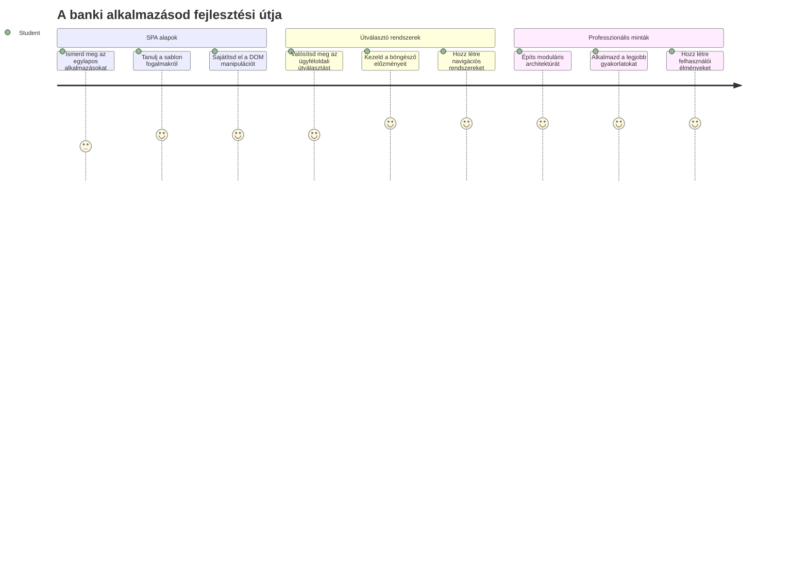
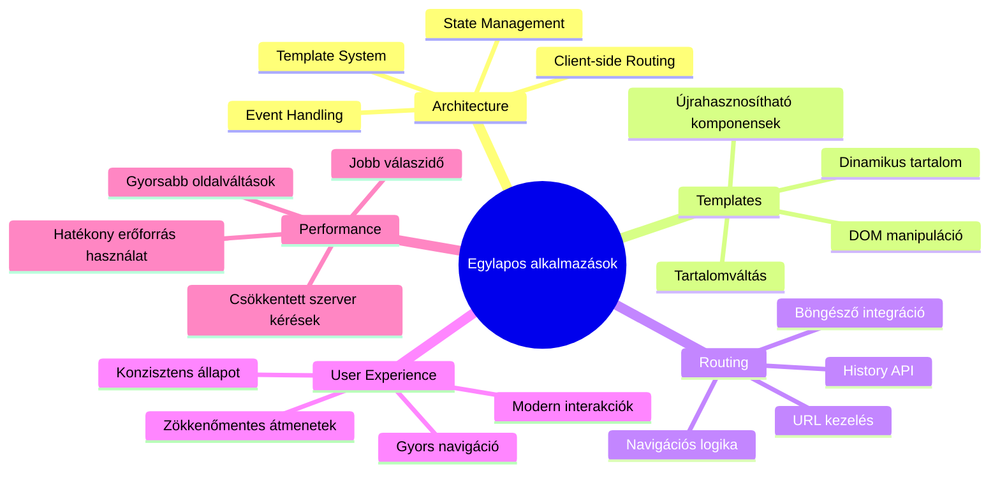
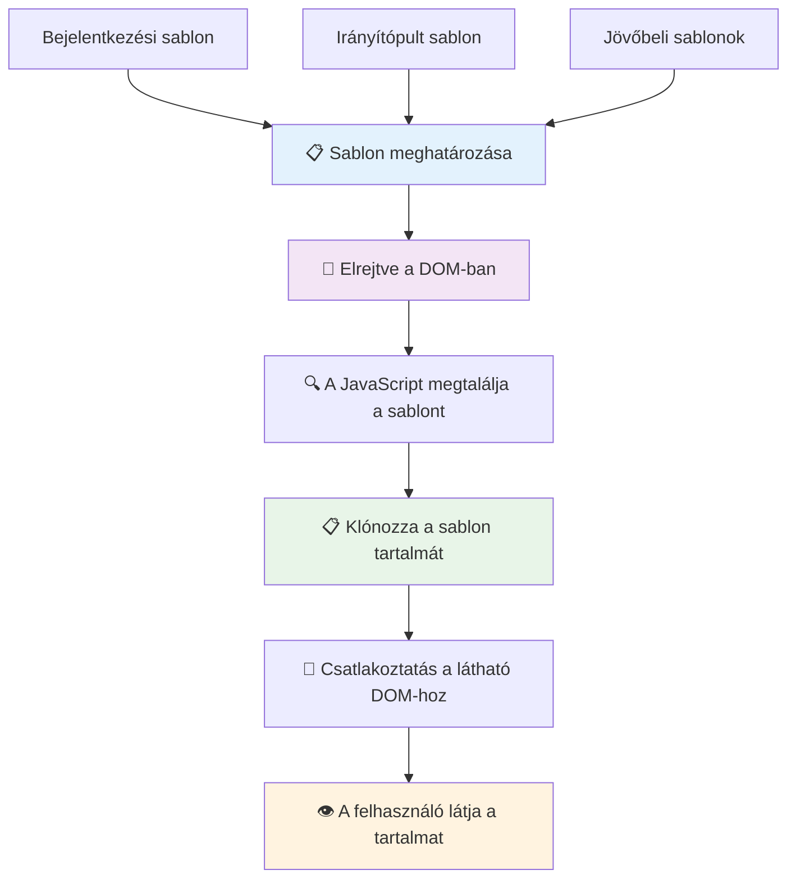
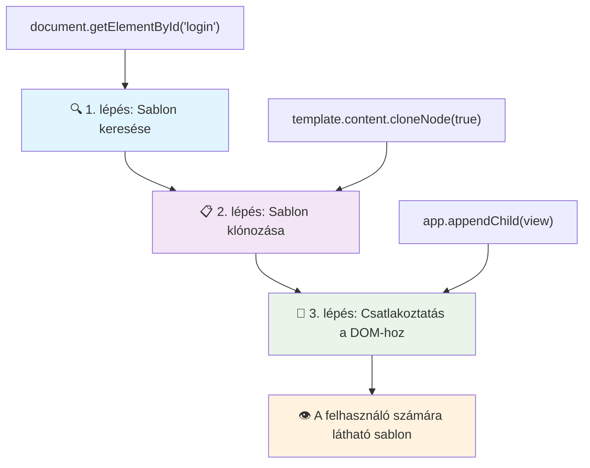
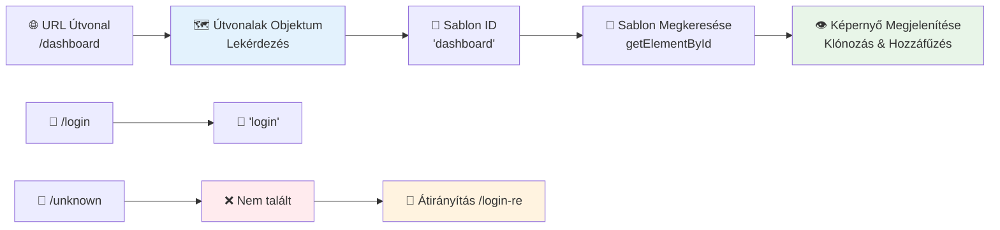
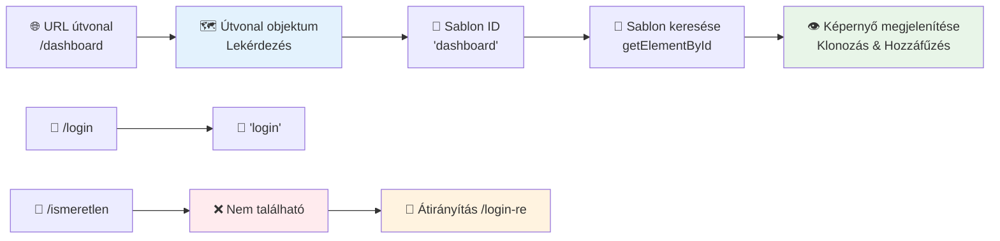
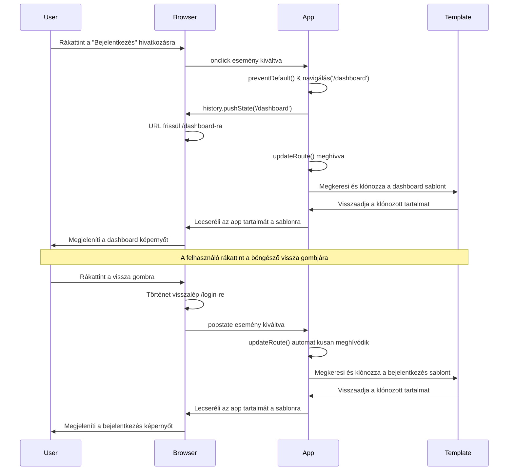
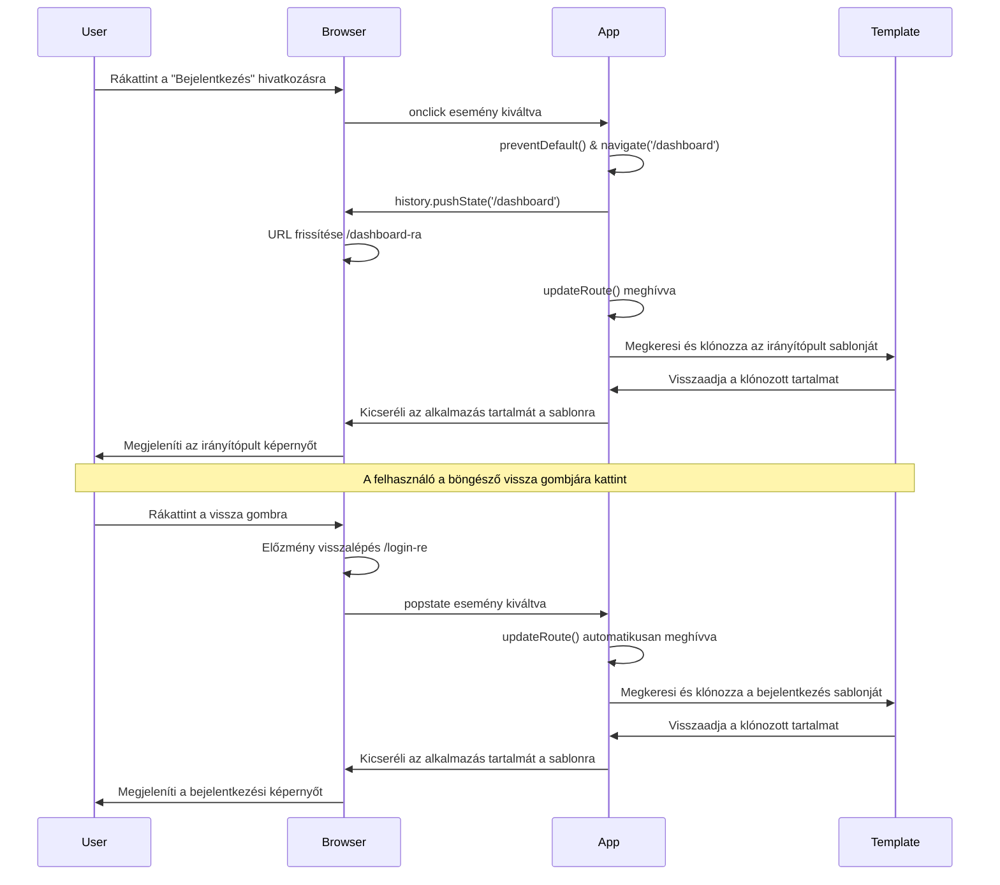
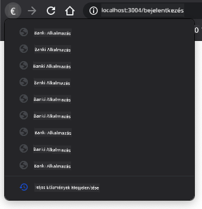
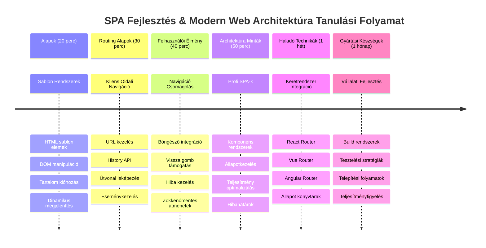

<!--
CO_OP_TRANSLATOR_METADATA:
{
  "original_hash": "351678bece18f07d9daa987a881fb062",
  "translation_date": "2026-01-07T02:56:04+00:00",
  "source_file": "7-bank-project/1-template-route/README.md",
  "language_code": "hu"
}
-->
# Banking alkalmazás építése 1. rész: HTML sablonok és útvonalak egy webalkalmazásban


Amikor az Apollo 11 navigációs számítógépe 1969-ben a Holdra irányított, képesnek kellett lennie különböző programok közötti váltásra anélkül, hogy az egész rendszert újraindította volna. A modern webalkalmazások hasonlóan működnek – megváltoztatják, amit látsz, anélkül, hogy mindent újratöltenének az elejétől. Ez teremti meg a mai, sima, reszponzív élményt, amit a felhasználók elvárnak.

A hagyományos weboldalakkal ellentétben, amelyek minden interakciónál az egész oldalt újratöltik, a modern webalkalmazások csak azokat a részeket frissítik, amelyekre szükség van. Ez a megközelítés, hasonlóan ahhoz, ahogy az irányítóközpont különböző kijelzők között vált, miközben folyamatos kommunikációt tart fenn, létrehozza azt a zökkenőmentes élményt, amit megszoktunk.

Ez teszi a különbséget annyira látványossá:

| Hagyományos többoldalas alkalmazások | Modern egylapos alkalmazások |
|----------------------------|-------------------------|
| **Navigáció** | Teljes oldal újratöltése minden képernyőnél | Azonnali tartalomváltás |
| **Teljesítmény** | Lassabb a teljes HTML letöltés miatt | Gyorsabb részleges frissítésekkel |
| **Felhasználói élmény** | Zavaró oldalvillanások | Simább, alkalmazás-szerű átmenetek |
| **Adatmegosztás** | Nehézkes oldalakon keresztül | Könnyű állapotkezelés |
| **Fejlesztés** | Több HTML fájl karbantartása | Egyetlen HTML dinamikus sablonokkal |

**Az evolúció megértése:**
- **Hagyományos alkalmazások** minden navigációs lépésnél szerverlekérést igényelnek
- **Modern SPA-k** egyszer betöltődnek és dinamikusan, JavaScript segítségével frissítik a tartalmat
- **A felhasználói elvárások** azonnali, zökkenőmentes interakciókat preferálnak
- **Teljesítményelőnyök** csökkentett sávszélesség és gyorsabb válaszidő

Ebben az órában egy banki alkalmazást építünk több, zökkenőmentesen váltakozó képernyővel. Ahogy a tudósok moduláris, újrakonfigurálható eszközöket használnak különböző kísérletekhez, úgy mi is HTML sablonokat használunk újrahasznosítható komponensként, amelyek szükség szerint megjeleníthetők.

HTML sablonokkal dolgozol majd (újrahasznosítható tervek különböző képernyőkhöz), JavaScript útvonalkezeléssel (a rendszer, ami a képernyők között vált), és a böngésző történetkezelő API-jával (ami biztosítja a vissza gomb működését). Ezek az alapvető technikák használatosak olyan keretrendszerekben, mint a React, Vue és Angular.

A végére egy működő banki alkalmazásod lesz, ami bemutatja a professzionális egylapos alkalmazás elveit.


## Bevezető Kvíz

[Bevezető kvíz](https://ff-quizzes.netlify.app/web/quiz/41)

### Amire Szükséged Lesz

Szükségünk lesz egy helyi webszerverre, hogy kipróbáljuk banki alkalmazásunkat – ne aggódj, ez könnyebb, mint hangzik! Ha még nincs beállítva, csak telepítsd a [Node.js](https://nodejs.org)-t, majd a projekted mappájában futtasd az `npx lite-server` parancsot. Ez a hasznos parancs elindítja a helyi szervert és automatikusan megnyitja az alkalmazást a böngészőben.

### Előkészületek

A számítógépeden készíts egy `bank` nevű mappát, amiben legyen egy `index.html` nevű fájl. Innen indulunk ebben a HTML [alapsablonból](https://en.wikipedia.org/wiki/Boilerplate_code):

```html
<!DOCTYPE html>
<html lang="en">
  <head>
    <meta charset="UTF-8">
    <meta name="viewport" content="width=device-width, initial-scale=1.0">
    <title>Bank App</title>
  </head>
  <body>
    <!-- This is where you'll work -->
  </body>
</html>
```

**Ez az alapsablon a következőket tartalmazza:**
- **Létrehozza** az HTML5 dokumentumszerkezetét a megfelelő DOCTYPE deklarációval
- **Beállítja** a karakterkódolást UTF-8-ra a nemzetközi szövegtámogatáshoz
- **Engedélyezi** a reszponzív tervezést a viewport meta tag segítségével a mobilkompatibilitáshoz
- **Megad egy** leíró címet, amely megjelenik a böngészőfülön
- **Létrehoz** egy tiszta body részt, ahol az alkalmazásunkat építjük

> 📁 **Projekt struktúra előnézet**
> 
> **A tanóra végére a projekted a következőket tartalmazza:**
> ```
> bank/
> ├── index.html      <!-- Main HTML with templates -->
> ├── app.js          <!-- Routing and navigation logic -->
> └── style.css       <!-- (Optional for future lessons) -->
> ```
> 
> **Fájlok felelőssége:**
> - **index.html**: Tartalmazza az összes sablont és biztosítja az alkalmazás szerkezetét
> - **app.js**: Kezeli az útvonalakat, navigációt és a sablonokat
> - **Sablonok**: Meghatározzák a bejelentkező képernyő, műszerfal és más oldal kinézetét

---

## HTML Sablonok

A sablonok megoldják az egyik alapvető problémát a webfejlesztésben. Amikor Gutenberg az 1440-es években feltalálta a mozgatható betűs nyomtatást, rájött, hogy ahelyett, hogy egész oldalakat faragna, újrahasznosítható betűblokkokat készíthet és azokat szükség szerint rendezheti. Az HTML sablonok ugyanazon az elven alapulnak – ahelyett, hogy minden képernyőhöz külön HTML fájlt hoznál létre, újrahasznosítható szerkezeteket definiálsz, amelyeket szükség esetén megjeleníthetsz.


Gondolj a sablonokra, mint az alkalmazás különböző részeinek tervrajzaira. Ahogy egy építész egy tervrajzot készít, és azt többször használja újra ahelyett, hogy azonos szobákat újradolgozna, mi egyszer megalkotjuk a sablonokat és szükség szerint megjelenítjük őket. A böngésző ezeket a sablonokat rejtve tartja, amíg a JavaScript aktiválja őket.

Ha több képernyőt akarsz létrehozni egy weboldalon, egy megoldás lehet, hogy minden képernyőhöz külön HTML fájlt készítesz. Ennek azonban van néhány kényelmetlensége:

- A képernyőváltáskor az egész HTML-t újra le kell tölteni, ami lassú lehet.
- Nehéz adatokat megosztani a különböző képernyők között.

Egy másik megközelítés, hogy csak egyetlen HTML fájl van, és több [HTML sablont](https://developer.mozilla.org/docs/Web/HTML/Element/template) definiálsz a `<template>` elem segítségével. A sablon egy újrahasznosítható HTML blokk, amelyet a böngésző nem jelenít meg, és futásidőben JavaScript használatával kell példányosítani.

### Építsük Meg

Egy banki alkalmazást fogunk létrehozni két fő képernyővel: egy bejelentkező oldallal és egy műszerfallal. Először tegyünk a HTML body-ba egy helyfoglaló elemet – ide fognak megjelenni a különböző képernyők:

```html
<div id="app">Loading...</div>
```

**A helyfoglaló megértése:**
- **Létrehoz egy** "app" azonosítójú konténert, ahol megjelennek a képernyők
- **Megjelenít egy** betöltési üzenetet, amíg a JavaScript el nem indítja az első képernyőt
- **Biztosít egy** egyetlen rögzítési pontot a dinamikus tartalomnak
- **Lehetővé teszi** a könnyű elérést JavaScriptből a `document.getElementById()` segítségével

> 💡 **Pró tipp**: Mivel ennek az elemnek a tartalma cserélődni fog, tehetünk bele betöltési üzenetet vagy indikátort, amit az alkalmazás betöltése közben mutatunk.

Ezután tegyük be a HTML sablont a bejelentkező oldal számára a következő részbe. Egyelőre csak egy címet és egy navigációs linket helyezünk el, amelyet majd a navigációhoz fogunk használni.

```html
<template id="login">
  <h1>Bank App</h1>
  <section>
    <a href="/dashboard">Login</a>
  </section>
</template>
```

**A bejelentkező sablon felbontása:**
- **Definiál egy** "login" azonosítójú sablont a JavaScript eléréshez
- **Tartalmaz** egy főcímet, amely meghatározza az alkalmazás arculatát
- **Belefoglal** egy szemantikus `<section>` elemet a kapcsolódó tartalom csoportosítására
- **Biztosít** egy navigációs linket, amely a műszerfalra vezet

Ezután hozzáadunk egy másik HTML sablont a műszerfal oldalnak. Ez az oldal különböző részeket tartalmaz:

- Egy fejlécet címmel és kijelentkezési linkkel
- A bankszámla aktuális egyenlegét
- Egy tranzakciós listát, táblázatban megjelenítve

```html
<template id="dashboard">
  <header>
    <h1>Bank App</h1>
    <a href="/login">Logout</a>
  </header>
  <section>
    Balance: 100$
  </section>
  <section>
    <h2>Transactions</h2>
    <table>
      <thead>
        <tr>
          <th>Date</th>
          <th>Object</th>
          <th>Amount</th>
        </tr>
      </thead>
      <tbody></tbody>
    </table>
  </section>
</template>
```

**Értsük meg a műszerfal egyes részeit:**
- **Felépíti** az oldalt egy szemantikus `<header>` elemmel, amely navigációt tartalmaz
- **Megjeleníti** az alkalmazás címét következetesen az összes képernyőn az arculatért
- **Biztosít** egy kijelentkezési linket, ami visszavisz a bejelentkező képernyőre
- **Mutatja** az aktuális egyenleget egy dedikált szekcióban
- **Rendezi** a tranzakció adatokat egy megfelelően strukturált HTML táblázatban
- **Definiálja** a táblázat fejléceit: Dátum, Tárgy, és Összeg oszlopokban
- **Üresen hagyja** a táblázat törzsét a dinamikus tartalom későbbi beillesztéséhez

> 💡 **Pró tipp**: HTML sablon létrehozásakor, ha látni akarod, milyen lesz az eredmény, kikommentelheted a `<template>` és `</template>` sorokat `<!-- -->` közé zárva.

### 🔄 **Pedagógiai ellenőrzés**
**Sablonrendszer megértése**: Mielőtt hozzákezdenél JavaScripttel, győződj meg róla, hogy érted:
- ✅ Miben különböznek a sablonok a normál HTML elemekről
- ✅ Miért maradnak a sablonok rejtve, amíg a JavaScript aktiválja őket
- ✅ A szemantikus HTML szerkezet fontossága a sablonokban
- ✅ Hogyan teszik lehetővé a sablonok az újrahasznosítható UI komponenseket

**Gyors önellenőrzés**: Mi történik, ha eltávolítod a `<template>` tageket az HTML körül?
*Válasz: A tartalom azonnal láthatóvá válik, és elveszíti a sablonfunkcionalitást*

**Az architektúra előnyei**: A sablonok biztosítják:
- **Újrahasznosíthatóság**: Egy definíció, több példány
- **Teljesítmény**: Nincs fölösleges HTML elemzés
- **Karbantarthatóság**: Központosított UI struktúra
- **Rugalmasság**: Dinamikus tartalomváltás

✅ Miért gondolod, hogy az `id` attribútumokat használjuk a sablonokon? Használhatnánk helyette valami mást, például osztályokat?

## A sablonok életre keltése JavaScript-tel

Most funkcionálissá kell tennünk a sablonokat. Ahogy egy 3D nyomtató digitális tervrajzból fizikai tárgyat hoz létre, úgy a JavaScript a rejtett sablonjainkból látható, interaktív elemeket készít, amelyeket a felhasználók láthatnak és használhatnak.

A folyamat három egységes lépést követ, amelyek a modern webfejlesztés alapját képezik. Ha ezt a mintázatot megérted, sok keretrendszerben és könyvtárban felismered majd.

Ha a jelenlegi HTML fájlodat kipróbálod egy böngészőben, azt fogod látni, hogy csak a `Loading...` üzenet jelenik meg. Ez azért van, mert még hozzá kell adnunk némi JavaScript kódot a HTML sablonok példányosításához és megjelenítéséhez.

Egy sablon példányosítása általában három lépésből áll:

1. Lekérjük a sablon elemet a DOM-ból, például a [`document.getElementById`](https://developer.mozilla.org/docs/Web/API/Document/getElementById) segítségével.
2. Klónozzuk a sablon elemet a [`cloneNode`](https://developer.mozilla.org/docs/Web/API/Node/cloneNode) metódussal.
3. Hozzácsatoljuk a klónt a DOM-hoz egy látható elem alá, például az [`appendChild`](https://developer.mozilla.org/docs/Web/API/Node/appendChild) használatával.


**A folyamat vizuális bontása:**
- **1. lépés** megtalálja a rejtett sablont a DOM szerkezetben
- **2. lépés** létrehoz egy működő másolatot, amit biztonságosan módosíthatunk
- **3. lépés** beilleszti a másolatot a látható oldal területére
- **Eredmény** egy funkcionális képernyő, amivel a felhasználók interakcióba léphetnek

✅ Miért van szükségünk a sablon klónozására, mielőtt azt a DOM-hoz csatoljuk? Mi történhet, ha ezt a lépést kihagyjuk?

### Feladat

Hozz létre egy új fájlt `app.js` néven a projekted mappájában, és importáld be ezt a fájlt a HTML `<head>` szakaszába:

```html
<script src="app.js" defer></script>
```

**Egy script importálásának megértése:**
- **Összekapcsolja** a JavaScript fájlt az HTML dokumentummal
- **Használja** a `defer` attribútumot, hogy a script csak a HTML feldolgozása után fusson le
- **Lehetővé teszi** a DOM elemek elérését, mivel a script futása csak a dokumentum betöltése után kezdődik
- **Követi** a modern legjobb gyakorlatokat a script betöltés és teljesítmény tekintetében

Most az `app.js`-ben hozz létre egy új `updateRoute` nevű függvényt:

```js
function updateRoute(templateId) {
  const template = document.getElementById(templateId);
  const view = template.content.cloneNode(true);
  const app = document.getElementById('app');
  app.innerHTML = '';
  app.appendChild(view);
}
```

**Lépésről lépésre, mi történik itt:**
- **Megkeresi** a sablon elemet az egyedi azonosítója alapján
- **Készít** egy mélymásolatot a sablon tartalmáról a `cloneNode(true)` segítségével
- **Megkeresi** az app konténert, ahol a tartalom megjelenik
- **Kitörli** a konténer jelenlegi tartalmát
- **Beszúrja** a klónozott sablon tartalmát a látható DOM-ba

Most hívd meg ezt a függvényt az egyik sablon ID-jával és nézd meg az eredményt.

```js
updateRoute('login');
```

**Ennek a függvényhívásnak a hatása:**
- **Aktiválja** a bejelentkező sablont az ID átadásával paraméterként
- **Bemutatja**, hogyan válthatunk programozottan az alkalmazás különböző képernyői között
- **Megjeleníti** a bejelentkező képernyőt az „Loading...” üzenet helyett

✅ Mi a célja ennek a kódnak: `app.innerHTML = '';`? Mi történik nélküle?

## Útvonalak létrehozása

Az útvonalkezelés alapvetően arról szól, hogy a URL-eket a megfelelő tartalomhoz kössük. Gondolj arra, ahogy a korai telefonközpontosok kapcsolótáblákkal kötöttek össze hívásokat – megérkezett egy kérés, és azt a megfelelő célállomásra irányították. A webes útvonalkezelés hasonlóan működik, egy URL-kérést fogad és eldönti, melyik tartalmat jelenítse meg.


Hagyományosan a webszerverek különböző HTML fájlokat szolgáltattak különböző URL-ekhez. Mivel mi egy egylapos alkalmazást építünk, ezt az útvonalkezelést nekünk kell JavaScripttel megoldani. Ez a megközelítés nagyobb irányítást ad a felhasználói élmény és a teljesítmény felett.


**Az útvonalkezelés menete:**
- **Az URL változás** kivált egy keresést az útvonalakon
- **Érvényes útvonalak** bizonyos sablonazonosítókhoz vannak rendelve a megjelenítéshez
- **Érvénytelen útvonalak** visszafallaback viselkedést váltanak ki, hogy elkerüljék a hibás állapotot
- **A sablon megjelenítése** a korábbi három lépésből álló folyamat szerint történik

A webalkalmazás esetén *útvonalkezelésnek* hívjuk annak a szándékát, hogy **URL-eket** rendelünk hozzá olyan képernyőkhöz, amelyeket meg kell jeleníteni. Egy többlapos weboldalon ez automatikusan történik, mivel a fájl elérési útjai megjelennek az URL-ben. Például, ha ezek a fájlok vannak a projekted mappájában:

```
mywebsite/index.html
mywebsite/login.html
mywebsite/admin/index.html
```

Ha egy webszervert hozol létre `mywebsite` gyökérrel, az URL leképezése így nézne ki:

```
https://site.com            --> mywebsite/index.html
https://site.com/login.html --> mywebsite/login.html
https://site.com/admin/     --> mywebsite/admin/index.html
```

Azonban mivel mi egyetlen HTML fájlt használunk, amely az összes képernyőt tartalmazza, ez az alapértelmezett viselkedés nem segít nekünk. Kézzel kell létrehoznunk ezt a leképezést és JavaScripttel frissítenünk a megjelenített sablont.

### Feladat

Egy egyszerű objektumot használunk [leképezés](https://en.wikipedia.org/wiki/Associative_array) implementálására az URL útvonalak és a sablonjaink között. Add hozzá ezt az objektumot az `app.js` fájlod tetejére.

```js
const routes = {
  '/login': { templateId: 'login' },
  '/dashboard': { templateId: 'dashboard' },
};
```

**Az útvonal konfiguráció megértése:**
- **Leképezi** az URL útvonalakat a sablonazonosítókra
- **Használja** az objektum szintaxisát, ahol a kulcsok útvonalak, az értékek a sablon információk
- **Lehetővé teszi** az egyszerű keresést, hogy adott URL-hez melyik sablont jelenítsük meg
- **Skálázható struktúrát** biztosít új útvonalak könnyű hozzáadásához a jövőben
Most módosítsuk egy kicsit az `updateRoute` függvényt. Ahelyett, hogy közvetlenül átadnánk a `templateId`-t argumentumként, szeretnénk azt úgy lekérni, hogy először megnézzük az aktuális URL-t, majd a térképünket használva megszerezzük a hozzá tartozó sablonazonosító értéket. Használhatjuk a [`window.location.pathname`](https://developer.mozilla.org/docs/Web/API/Location/pathname) metódust az URL-ből csak az útvonal lekérésére.

```js
function updateRoute() {
  const path = window.location.pathname;
  const route = routes[path];

  const template = document.getElementById(route.templateId);
  const view = template.content.cloneNode(true);
  const app = document.getElementById('app');
  app.innerHTML = '';
  app.appendChild(view);
}
```

**Részletezve, mi történik itt:**
- **Kinyeri** a böngésző URL-jéből az aktuális útvonalat a `window.location.pathname` használatával
- **Megkeresi** a hozzá tartozó útvonal konfigurációt az útvonalak objektumunkban
- **Lekéri** a sablonazonosítót az útvonal-konfigurációból
- **Követi** ugyanazt a sablon megjelenítési folyamatot, mint korábban
- **Létrehoz** egy dinamikus rendszert, amely reagál az URL változásaira

Itt összekapcsoltuk a deklarált útvonalakat a hozzájuk tartozó sablonokkal. Kipróbálhatod, hogy helyesen működik-e, ha kézzel módosítod az URL-t a böngésződben.

✅ Mi történik, ha ismeretlen útvonalat írsz be az URL-be? Hogyan tudnánk ezt megoldani?

## Navigáció hozzáadása

A routing beállítása után a felhasználóknak szükségük van egy módra az alkalmazáson belüli navigációra. A hagyományos weboldalak egész oldalakat töltenek újra linkekre kattintáskor, de mi azt szeretnénk, hogy egyszerre frissüljön az URL és a tartalom, anélkül, hogy az oldal újratöltődne. Ez simább élményt teremt, hasonlóan ahhoz, ahogyan az asztali alkalmazások váltanak különböző nézetek között.

Két dolgot kell összehangolnunk: frissíteni a böngésző URL-jét, hogy a felhasználók könyvjelzőket készíthessenek és linkeket megoszthassanak, valamint megjeleníteni a megfelelő tartalmat. Ha ezt helyesen valósítjuk meg, az a gördülékeny navigációt biztosítja, amit a modern alkalmazásoktól elvárnak a felhasználók.


### 🔄 **Pedagógiai ellenőrzés**
**Egylapos alkalmazás architektúrája**: Ellenőrizd a rendszer teljes megértését:
- ✅ Miben különbözik a kliensoldali routing a hagyományos szerveroldali routingtól?
- ✅ Miért elengedhetetlen a History API az SPA helyes navigációjához?
- ✅ Hogyan teszik lehetővé a sablonok a dinamikus tartalmat oldalfrissítés nélkül?
- ✅ Milyen szerepe van az eseménykezelésnek a navigáció elfogásában?

**Rendszerintegráció**: Az SPA-d bemutatja:
- **Sablonkezelés**: Újrafelhasználható UI komponensek dinamikus tartalommal
- **Kliensoldali routing**: URL-kezelés szerverlekérések nélkül
- **Eseményvezérelt architektúra**: Reagáló navigáció és felhasználói interakciók
- **Böngésző integráció**: History és vissza/előre gombok megfelelő támogatása
- **Teljesítmény optimalizálás**: Gyors váltások és csökkentett szerverterhelés

**Professzionális minták**: Megvalósítottad:
- **Modell-Nézet szétválasztás**: Sablonok elkülönítve az alkalmazás logikától
- **Állapotkezelés**: URL állapot szinkronban a megjelenített tartalommal
- **Progresszív fejlesztés**: JavaScript kiegészíti az alap HTML funkcionalitást
- **Felhasználói élmény**: Simább, alkalmazásszerű navigáció oldalfrissítés nélkül

> � **Architektúra betekintés**: Navigációs rendszer összetevői
>
> **Amit építesz:**
> - **🔄 URL kezelése**: A böngésző címsorának frissítése oldalfrissítés nélkül
> - **📋 Sablonrendszer**: Tartalom dinamikus cseréje az aktuális útvonal alapján  
> - **📚 Történetkezelés**: Böngésző vissza/előre gomb támogatás fenntartása
> - **🛡️ Hibakezelés**: Elegáns visszaesés érvénytelen vagy hiányzó útvonal esetén
>
> **Hogyan működnek együtt a komponensek:**
> - **Figyeli** a navigációs eseményeket (kattintások, történetváltozások)
> - **Frissíti** az URL-t a History API segítségével
> - **Megjeleníti** a megfelelő sablont az új útvonalhoz
> - **Fenntartja** a gördülékeny felhasználói élményt egész idő alatt

A következő lépés az alkalmazásunkban, hogy lehetővé tegyük a navigációt az oldalak között anélkül, hogy kézzel kellene az URL-t változtatni. Ez két dolgot jelent:

  1. Az aktuális URL frissítése
  2. A megjelenített sablon frissítése az új URL alapján

A második rész már megvan az `updateRoute` függvény által, így azt kell kitalálnunk, hogyan frissítsük az aktuális URL-t.

JavaScriptet kell használnunk, pontosabban a [`history.pushState`](https://developer.mozilla.org/docs/Web/API/History/pushState) metódust, amely lehetővé teszi az URL frissítését és új bejegyzés létrehozását a böngésző előzménytárában, anélkül, hogy újratöltenénk a HTML-t.

> ⚠️ **Fontos megjegyzés**: Bár a HTML horgonyelem [`<a href>`](https://developer.mozilla.org/docs/Web/HTML/Element/a) önmagában is használható linkek létrehozására különböző URL-ekre, alapértelmezésben a böngésző újratölti az oldalt. Ezt a viselkedést meg kell akadályozni saját JavaScript routing kezeléskor, a preventDefault() függvény használatával a kattintási eseményen.

### Feladat

Készítsünk egy új függvényt, amelyet navigációra használhatunk az alkalmazásunkban:

```js
function navigate(path) {
  window.history.pushState({}, path, path);
  updateRoute();
}
```

**Ennek a navigációs függvénynek az értelmezése:**
- **Frissíti** a böngésző URL-jét az új útvonalnak megfelelően a `history.pushState` segítségével
- **Új bejegyzést ad** a böngésző előzménytárához, hogy a vissza/előre gombok megfelelően működjenek
- **Meghívja** az `updateRoute()` függvényt, hogy megjelenítse a megfelelő sablont
- **Fenntartja** az egylapos alkalmazás élményt oldalfrissítés nélkül

Ez a módszer először frissíti a jelenlegi URL-t az adott útvonal alapján, majd frissíti a megjelenített sablont. A `window.location.origin` tulajdonság a webhely gyökér URL-jét adja vissza, így adott útvonalból újra össze tudjuk állítani a teljes URL-t.

Most, hogy megvan ez a függvény, foglalkozzunk azzal a problémával, hogy mi történik, ha egy útvonal nem egyezik meg egyetlen definiált útvonallal sem. Az `updateRoute` függvényt módosítjuk úgy, hogy adunk egy visszaesési megoldást egy létező útvonalra, ha nem találunk egyezést.

```js
function updateRoute() {
  const path = window.location.pathname;
  const route = routes[path];

  if (!route) {
    return navigate('/login');
  }

  const template = document.getElementById(route.templateId);
  const view = template.content.cloneNode(true);
  const app = document.getElementById('app');
  app.innerHTML = '';
  app.appendChild(view);
}
```

**Fontos pontok:**
- **Ellenőrzi**, hogy létezik-e útvonal az aktuális útvonalhoz
- **Átirányít** a bejelentkezési oldalra, ha érvénytelen útvonalat érünk el
- **Biztosít** egy visszazuhanó mechanizmust, hogy megakadályozza a törött navigációt
- **Garantálja**, hogy a felhasználók mindig érvényes képernyőt lássanak, még helytelen URL esetén is

Ha nem találunk útvonalat, mostantól átirányítjuk a `login` oldalra.

Most hozzunk létre egy függvényt, amely a kattintáskor lekéri az URL-t, és megakadályozza a böngésző alapértelmezett link viselkedését:

```js
function onLinkClick(event) {
  event.preventDefault();
  navigate(event.target.href);
}
```

**Ez a kattintáskezelő lépésenként:**
- **Megakadályozza** a böngésző alapértelmezett link viselkedését a `preventDefault()` használatával
- **Kinyeri** a cél URL-t a kattintott horgony elemből
- **Kihívja** a saját navigációs függvényünket oldal újratöltése helyett
- **Fenntartja** a gördülékeny egylapú alkalmazás élményt

```html
<a href="/dashboard" onclick="onLinkClick(event)">Login</a>
...
<a href="/login" onclick="onLinkClick(event)">Logout</a>
```

**Mit tesz ez az onclick kötés:**
- **Összekapcsolja** az egyes linkeket a saját navigációs rendszerünkkel
- **Átadja** a kattintás eseményt az `onLinkClick` függvényünknek feldolgozásra
- **Lehetővé teszi** a gördülékeny navigációt oldalfrissítés nélkül
- **Fenntartja** az URL helyes szerkezetét, amelyet a felhasználók könyvjelzőzhetnek vagy megoszthatnak

Az [`onclick`](https://developer.mozilla.org/docs/Web/API/GlobalEventHandlers/onclick) attribútum a `click` eseményt köti JavaScript kódra, itt a `navigate()` függvény hívására.

Próbáld meg rákattintani ezekre a linkekre, most már képesnek kell lenned navigálni az alkalmazásod különböző képernyői között.

✅ A `history.pushState` metódus az HTML5 szabvány része, és [minden modern böngésző támogatja](https://caniuse.com/?search=pushState). Ha régebbi böngészőkre építesz webalkalmazást, van egy trükk, amit használhatsz helyette: egy [hash (`#`)](https://en.wikipedia.org/wiki/URI_fragment) használatával az útvonal előtt megvalósítható olyan routing, amely hagyományos horgonylap navigációként működik, és nem tölti újra az oldalt, hiszen arra tervezték, hogy belső linkeket hozzon létre egy adott oldalon belül.

## A Vissza és Előre gombok működésbe hozatala

A vissza és előre gombok alapvetőek a webes böngészésben, ahogy a NASA küldetésvezérlői is képesek visszanézni korábbi rendszerállapotokat az űrmissziók során. A felhasználók elvárják, hogy ezek a gombok működjenek, és ha nem így van, akkor megszakad a várt böngészési élmény.

Az egylapos alkalmazásunknak további konfigurációra van szüksége ennek támogatásához. A böngésző fenntart egy előzménytárat (amelyhez mi a `history.pushState` használatával adtunk elem(eke)t), de amikor a felhasználók előzmények között navigálnak, az alkalmazásnak reagálnia kell azzal, hogy frissíti a megjelenített tartalmat.


**Fontos interakciós pontok:**
- **Felhasználói műveletek** navigációt indítanak kattintással vagy böngésző gombokkal
- **Az alkalmazás elfogja** a linkkattintásokat, hogy megakadályozza az oldal újratöltődését
- **History API** kezeli az URL-változásokat és a böngésző előzménytárat
- **Sablonok** biztosítják az egyes képernyők tartalmi szerkezetét
- **Eseményfigyelők** garantálják, hogy az alkalmazás minden navigációs típust kezel

A `history.pushState` új bejegyzéseket hoz létre a böngésző navigációs előzményeiben. Ezt ellenőrizheted úgy, hogy lenyomod a böngésződ *vissza gombját*, ilyesmit fogsz látni:



Ha néhányszor megnyomod a vissza gombot, látni fogod, hogy a jelenlegi URL változik és az előzmények frissülnek, de ugyanaz a sablon jelenik meg továbbra is.

Ez azért van, mert az alkalmazás nem tudja, hogy a `updateRoute()`-ot meg kell hívni minden alkalommal, amikor az előzmény megváltozik. Ha megnézed a [`history.pushState` dokumentációját](https://developer.mozilla.org/docs/Web/API/History/pushState), láthatod, hogy az állapot változásakor – azt jelenti, hogy más URL-re léptünk –, a [`popstate`](https://developer.mozilla.org/docs/Web/API/Window/popstate_event) esemény aktiválódik. Ezt fogjuk használni a probléma megoldására.

### Feladat

Annak érdekében, hogy a megjelenített sablon frissüljön, amikor a böngésző előzményai változnak, kapcsoljunk egy új függvényt, amely meghívja az `updateRoute()`-ot. Ezt az `app.js` fájl alján tegyük meg:

```js
window.onpopstate = () => updateRoute();
updateRoute();
```

**Ennek a történetkezelő integrációnak a megértése:**
- **Figyel** a `popstate` eseményekre, amelyek akkor lépnek fel, amikor a felhasználók a böngésző gombjaival navigálnak
- **Használ** egy nyílfüggvényt a tömör eseménykezelő szintaxisért
- **Automatikusan meghívja** az `updateRoute()`-ot, amikor az állapotváltozás megtörténik
- **Inicializálja** az alkalmazást az `updateRoute()` hívásával az oldal betöltődésekor
- **Biztosítja**, hogy a helyes sablon legyen megjelenítve, függetlenül attól, hogyan navigálnak a felhasználók

> 💡 **Pro Tipp**: Itt egy [nyílfüggvényt](https://developer.mozilla.org/docs/Web/JavaScript/Reference/Functions/Arrow_functions) használtunk a `popstate` eseménykezelő deklarálására a tömörség kedvéért, de egy hagyományos függvény is ugyanolyan jól működne.

Itt egy frissítő videó a nyílfüggvényekről:

[](https://youtube.com/watch?v=OP6eEbOj2sc "Arrow Functions")

> 🎥 Kattints a fenti képre egy videó megtekintéséhez a nyílfüggvényekről.

Most próbáld ki a böngésződ vissza és előre gombjait, és ellenőrizd, hogy a megjelenített útvonal most helyesen frissül-e.

### ⚡ **Mit tehetsz a következő 5 percben**
- [ ] Teszteld a banki alkalmazásod navigációját a böngésző vissza/előre gombjaival
- [ ] Próbálj meg kézzel beírni különböző URL-eket a címsorba az útvonal teszteléséhez
- [ ] Nyisd meg a böngésző fejlesztői eszközeit, és nézd meg, hogyan klónozódnak a sablonok a DOM-ba
- [ ] Kísérletezz console.log állítások hozzáadásával az útvonal követésére

### 🎯 **Mit érhetsz el ezen az órán**
- [ ] Teljesítsd az óra végén a kvízt, és értsd meg az SPA architektúra fogalmait
- [ ] Adj hozzá CSS stílusokat, hogy a banki alkalmazásod sablonjai professzionálisak legyenek
- [ ] Valósítsd meg a 404-es hibaoldal kihívást megfelelő hibakezeléssel
- [ ] Készítsd el a köszönet oldal kihívást további routing funkciókkal
- [ ] Adj hozzá betöltő állapotokat és átmeneteket a sablonváltások között

### 📅 **Hét napos SPA fejlesztési utad**
- [ ] Készítsd el a teljes banki appot űrlapokkal, adatkezeléssel és tartósítással
- [ ] Adj hozzá fejlett routing funkciókat, mint útvonal paraméterek és beágyazott útvonalak
- [ ] Valósíts meg navigációs őröket és hitelesítés alapú routingot
- [ ] Készíts újrafelhasználható sablon komponenseket és egy komponens könyvtárat
- [ ] Adj hozzá animációkat és átmeneteket a simább felhasználói élményért
- [ ] Telepítsd az SPA-t egy hosztplatformra és konfiguráld helyesen az útvonalakat

### 🌟 **Hónapos frontend architektúra mesterkurzusod**
- [ ] Építs komplex SPA-kat modern keretrendszerekkel, mint React, Vue vagy Angular
- [ ] Tanulj meg fejlett állapotkezelési mintákat és könyvtárakat
- [ ] Sajátítsd el az építő eszközöket és fejlesztési munkafolyamatokat SPA fejlesztéshez
- [ ] Valósítsd meg a progresszív webalkalmazás funkciókat és offline működést
- [ ] Tanulmányozd a teljesítmény-optimalizálási technikákat nagy méretű SPA-k esetén
- [ ] Vegyél részt nyílt forráskódú SPA projektek fejlesztésében és oszd meg ismereteidet

## 🎯 Egylapos alkalmazás mesterkurzusod idővonala


### 🛠️ SPA fejlesztési eszköztárad összefoglalója

A lecke elvégzése után most már magabiztos vagy:
- **Sablon architektúrában**: Újrafelhasználható HTML komponensek dinamikus tartalom megjelenítéssel
- **Kliensoldali routingban**: URL-kezelés és navigáció oldalfrissítés nélkül
- **Böngésző integrációban**: History API használata és vissza/előre gomb támogatás
- **Eseményvezérelt rendszerekben**: Navigációs kezelés és felhasználói interakciók menedzselése
- **DOM manipulációban**: Sablon klónozás, tartalomváltás és elem kezelés
- **Hibakezelésben**: Elegáns visszaesés hibás útvonal vagy hiányzó tartalom esetén
- **Teljesítménymintákban**: Hatékony tartalom betöltés és megjelenítési stratégiák

**Valós alkalmazásokban**: Az SPA fejlesztési tudásod közvetlenül alkalmazható:
- **Modern webalkalmazásokban**: React, Vue, Angular, és egyéb keretrendszer fejlesztés
- **Progresszív webalkalmazásokban**: Offline-képes appok alkalmazásszerű élménnyel
- **Vállalati irányítópultokban**: Összetett üzleti alkalmazások több nézettel
- **E-kereskedelmi platformokon**: Termékkatalógusok, kosár és pénztár folyamatok
- **Tartalomkezelésben**: Dinamikus tartalomkészítő és szerkesztő felületek
- **Mobil fejlesztésben**: Hibridek alkalmazások webes technológiával

**Megszerezhető szakmai készségek**: Most már képes vagy:
- **Tervezze meg** az egylapos alkalmazásokat a megfelelő felelősségszétválasztással
- **Valósítson meg** kliensoldali útválasztó rendszereket, amelyek skálázódnak az alkalmazás összetettségével
- **Hibakeresés** bonyolult navigációs folyamatok böngészőfejlesztői eszközökkel
- **Optimalizálja** az alkalmazás teljesítményét hatékony sablonkezeléssel
- **Tervezzen** natív és reszponzív felhasználói élményeket

**Elsajátított frontend fejlesztési koncepciók**:
- **Komponens architektúra**: Újrahasználható UI minták és sablonrendszerek
- **Állapotszinkronizáció**: URL állapotkezelés és böngészőtörténet
- **Eseményvezérelt programozás**: Felhasználói interakciókezelés és navigáció
- **Teljesítményoptimalizálás**: Hatékony DOM manipuláció és tartalombetöltés
- **Felhasználói élmény tervezés**: Zökkenőmentes átmenetek és intuitív navigáció

**Következő szint**: Készen állsz, hogy felfedezd a modern frontend keretrendszereket, fejlett állapotkezelést, vagy összetett vállalati alkalmazásokat építs!

🌟 **Eredmény elérve**: Felépítettél egy professzionális egylapos alkalmazás alapot modern webes architektúra mintákkal!

---

## GitHub Copilot Agent kihívás 🚀

Használd az Agent módot a következő kihívás teljesítéséhez:

**Leírás:** Fejleszd a banki alkalmazást hibakezelés és egy 404-es oldal sablon bevezetésével érvénytelen útvonalak esetén, javítva a felhasználói élményt, ha nem létező oldalra navigálnak.

**Kérés:** Hozz létre egy új HTML sablont "not-found" azonosítóval, amely felhasználóbarát 404-es hibát mutat stílusos megjelenéssel. Ezután módosítsd a JavaScript útválasztó logikáját, hogy ezt a sablont jelenítse meg, amikor a felhasználók érvénytelen URL-re navigálnak, és adj hozzá egy "Vissza a főoldalra" gombot, amely a bejelentkezési oldalra visz vissza.

További információ az [agent módról](https://code.visualstudio.com/blogs/2025/02/24/introducing-copilot-agent-mode).

## 🚀 Kihívás

Adj hozzá egy új sablont és útvonalat egy harmadik oldalhoz, amely az alkalmazás készítőihez kapcsolódó kredit információkat mutatja.

**A kihívás céljai:**
- **Hozz létre** egy új HTML sablont megfelelő tartalmi felépítéssel
- **Add hozzá** az új útvonalat az útvonal konfigurációs objektumodhoz
- **Tartsd fenn** a navigációs linkeket az kredit oldalra és vissza
- **Teszteld**, hogy az összes navigáció helyesen működik a böngészőtörténettel

## Óra utáni kvíz

[Óra utáni kvíz](https://ff-quizzes.netlify.app/web/quiz/42)

## Áttekintés és önálló tanulás

Az útválasztás meglepően bonyolult része a webfejlesztésnek, különösen ahogy a web a lapfrissítéses viselkedéstől az egylapos alkalmazásos lapfrissítések felé mozdul el. Olvass egy kicsit arról, hogyan kezeli az [Azure Static Web App szolgáltatás](https://docs.microsoft.com/azure/static-web-apps/routes/?WT.mc_id=academic-77807-sagibbon) az útválasztást. Ki tudnád fejteni, hogy miért szükségesek a dokumentumban leírt döntések?

**További tanulási források:**
- **Fedezd fel**, hogyan valósítják meg a népszerű keretrendszerek, mint a React Router és Vue Router a kliensoldali útválasztást
- **Kutatd meg** a hash-alapú és a history API-alapú útválasztás közötti különbségeket
- **Tanulj** a szerveroldali renderelésről (SSR) és arról, hogyan befolyásolja az útválasztási stratégiákat
- **Vizsgáld meg**, hogyan kezelik a Progresszív Webalkalmazások (PWA-k) az útválasztást és navigációt

## Feladat

[Fejleszd az útválasztást](assignment.md)

---

<!-- CO-OP TRANSLATOR DISCLAIMER START -->
**Felelősség kizárása**:  
Ez a dokumentum az AI fordító szolgáltatás, a [Co-op Translator](https://github.com/Azure/co-op-translator) segítségével készült. Bár pontosságra törekszünk, kérjük, vegye figyelembe, hogy az automatikus fordítások hibákat vagy pontatlanságokat tartalmazhatnak. Az eredeti nyelvű dokumentum tekintendő hiteles forrásnak. Fontos információk esetén javasolt szakképzett emberi fordító igénybevétele. Nem vállalunk felelősséget a fordítás használatából eredő félreértésekért vagy félreértelmezésekért.
<!-- CO-OP TRANSLATOR DISCLAIMER END -->