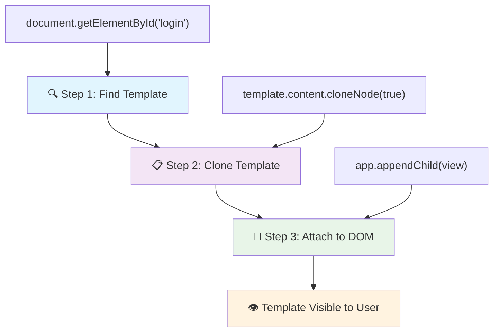
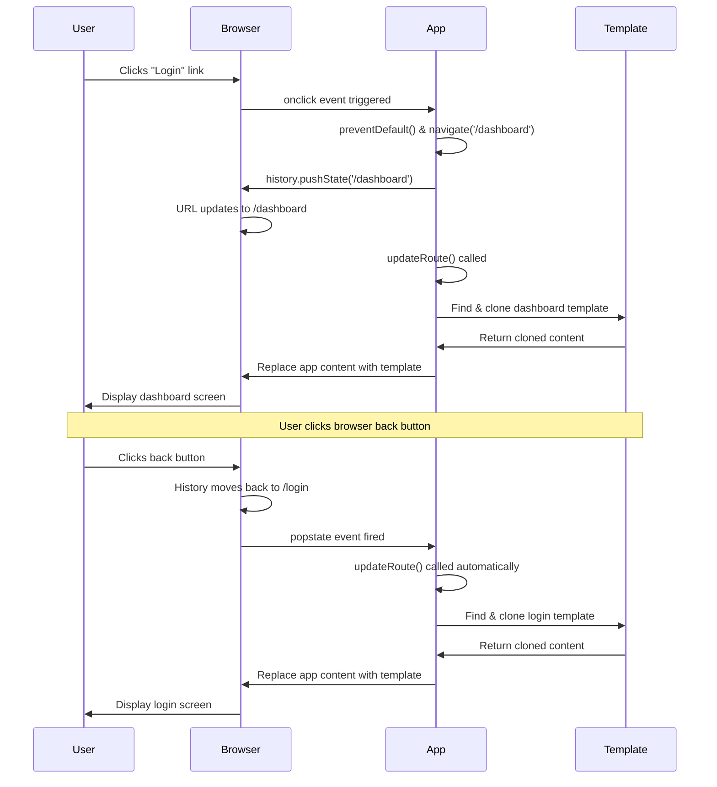

<!--
CO_OP_TRANSLATOR_METADATA:
{
  "original_hash": "5d259f6962464ad91e671083aa0398f4",
  "translation_date": "2025-10-24T20:23:02+00:00",
  "source_file": "7-bank-project/1-template-route/README.md",
  "language_code": "hu"
}
-->
# Banki alkalmazás készítése 1. rész: HTML sablonok és útvonalak egy webalkalmazásban

Amikor az Apollo 11 navigációs számítógépe 1969-ben a Holdra repült, különböző programok között kellett váltania anélkül, hogy az egész rendszert újraindította volna. A modern webalkalmazások hasonlóan működnek – megváltoztatják, amit látsz, anélkül, hogy mindent újratöltenének. Ez teremti meg azt a gördülékeny, gyors élményt, amit a felhasználók ma elvárnak.

A hagyományos weboldalakkal ellentétben, amelyek minden interakcióhoz teljes oldalakat töltenek újra, a modern webalkalmazások csak azokat a részeket frissítik, amelyek változtatásra szorulnak. Ez a megközelítés, hasonlóan ahhoz, ahogy az irányítóközpont különböző kijelzők között vált, miközben folyamatos kommunikációt tart fenn, megteremti azt a folyékony élményt, amit ma már megszoktunk.

Ez az, amiért a különbség olyan drámai:

| Hagyományos többoldalas alkalmazások | Modern egyoldalas alkalmazások |
|-------------------------------------|--------------------------------|
| **Navigáció** | Teljes oldal újratöltése minden képernyőnél | Azonnali tartalomváltás |
| **Teljesítmény** | Lassabb a teljes HTML letöltése miatt | Gyorsabb részleges frissítésekkel |
| **Felhasználói élmény** | Zavaró oldalvillanások | Gördülékeny, alkalmazásszerű átmenetek |
| **Adatmegosztás** | Nehézkes az oldalak között | Könnyű állapotkezelés |
| **Fejlesztés** | Több HTML fájl karbantartása szükséges | Egyetlen HTML dinamikus sablonokkal |

**Az evolúció megértése:**
- **Hagyományos alkalmazások** minden navigációs művelethez szerver kéréseket igényelnek
- **Modern SPAs** egyszer töltődnek be, és dinamikusan frissítik a tartalmat JavaScript segítségével
- **Felhasználói elvárások** most az azonnali, zökkenőmentes interakciókat részesítik előnyben
- **Teljesítmény előnyök** közé tartozik a csökkentett sávszélesség és gyorsabb válaszidők

Ebben a leckében egy banki alkalmazást fogunk építeni, amely több képernyőt tartalmaz, amelyek zökkenőmentesen kapcsolódnak egymáshoz. Ahogy a tudósok moduláris eszközöket használnak, amelyeket különböző kísérletekhez lehet átkonfigurálni, mi HTML sablonokat fogunk használni, mint újrafelhasználható komponenseket, amelyeket szükség szerint megjeleníthetünk.

HTML sablonokkal (különböző képernyők újrafelhasználható tervrajzai), JavaScript útvonalvezetéssel (a rendszer, amely a képernyők között vált), és a böngésző történeti API-jával (amely biztosítja, hogy a vissza gomb megfelelően működjön) fogunk dolgozni. Ezek ugyanazok az alapvető technikák, amelyeket olyan keretrendszerek használnak, mint a React, Vue és Angular.

A végére egy működő banki alkalmazásod lesz, amely bemutatja a professzionális egyoldalas alkalmazás elveit.

## Előadás előtti kvíz

[Előadás előtti kvíz](https://ff-quizzes.netlify.app/web/quiz/41)

### Amire szükséged lesz

Egy helyi webszerverre lesz szükségünk, hogy teszteljük a banki alkalmazásunkat – ne aggódj, ez könnyebb, mint amilyennek hangzik! Ha még nincs beállítva, egyszerűen telepítsd a [Node.js](https://nodejs.org) programot, és futtasd a `npx lite-server` parancsot a projekt mappádból. Ez a praktikus parancs elindít egy helyi szervert, és automatikusan megnyitja az alkalmazásodat a böngészőben.

### Előkészületek

A számítógépeden hozz létre egy `bank` nevű mappát, benne egy `index.html` nevű fájllal. Ebből az HTML [sablonból](https://en.wikipedia.org/wiki/Boilerplate_code) fogunk kiindulni:

```html
<!DOCTYPE html>
<html lang="en">
  <head>
    <meta charset="UTF-8">
    <meta name="viewport" content="width=device-width, initial-scale=1.0">
    <title>Bank App</title>
  </head>
  <body>
    <!-- This is where you'll work -->
  </body>
</html>
```

**Ez a sablon a következőket biztosítja:**
- **Létrehozza** az HTML5 dokumentum struktúráját megfelelő DOCTYPE deklarációval
- **Beállítja** a karakterkódolást UTF-8-ra a nemzetközi szövegtámogatás érdekében
- **Engedélyezi** a reszponzív dizájnt a viewport meta tag segítségével a mobil kompatibilitás érdekében
- **Beállít egy** leíró címet, amely megjelenik a böngésző fülén
- **Létrehoz egy** tiszta body szekciót, ahol az alkalmazásunkat felépítjük

> 📁 **Projektstruktúra előnézet**
> 
> **A lecke végére a projekted a következőket fogja tartalmazni:**
> ```
> bank/
> ├── index.html      <!-- Main HTML with templates -->
> ├── app.js          <!-- Routing and navigation logic -->
> └── style.css       <!-- (Optional for future lessons) -->
> ```
> 
> **Fájlok feladatai:**
> - **index.html**: Tartalmazza az összes sablont és biztosítja az alkalmazás struktúráját
> - **app.js**: Kezeli az útvonalvezérlést, navigációt és sablonkezelést
> - **Sablonok**: Meghatározzák a felhasználói felületet a bejelentkezéshez, a vezérlőpulthoz és más képernyőkhöz

---

## HTML sablonok

A sablonok megoldanak egy alapvető problémát a webfejlesztésben. Amikor Gutenberg az 1440-es években feltalálta a mozgatható betűnyomtatást, rájött, hogy ahelyett, hogy teljes oldalakat faragna, újrafelhasználható betűblokkokat hozhat létre, és szükség szerint elrendezheti őket. Az HTML sablonok ugyanilyen elven működnek – ahelyett, hogy külön HTML fájlokat hoznánk létre minden képernyőhöz, újrafelhasználható struktúrákat definiálunk, amelyeket szükség esetén megjeleníthetünk.

Gondolj a sablonokra úgy, mint az alkalmazásod különböző részeinek tervrajzaira. Ahogy egy építész egy tervrajzot készít, és többször használja, ahelyett, hogy azonos szobákat újrarajzolna, mi egyszer készítünk sablonokat, és szükség szerint példányosítjuk őket. A böngésző ezeket a sablonokat rejtve tartja, amíg a JavaScript aktiválja őket.

Ha több képernyőt szeretnél létrehozni egy weboldalhoz, az egyik megoldás az lenne, hogy minden megjeleníteni kívánt képernyőhöz egy HTML fájlt hozol létre. Ez azonban némi kényelmetlenséggel jár:

- Az egész HTML-t újra kell tölteni képernyőváltáskor, ami lassú lehet.
- Nehéz adatokat megosztani a különböző képernyők között.

Egy másik megközelítés az, hogy csak egy HTML fájl van, és több [HTML sablont](https://developer.mozilla.org/docs/Web/HTML/Element/template) definiálunk a `<template>` elem használatával. A sablon egy újrafelhasználható HTML blokk, amelyet a böngésző nem jelenít meg, és futásidőben JavaScript segítségével kell példányosítani.

### Építsük meg!

Egy banki alkalmazást fogunk létrehozni két fő képernyővel: egy bejelentkezési oldallal és egy vezérlőpulttal. Először adjunk hozzá egy helyőrző elemet az HTML body-hoz – itt jelennek meg az összes különböző képernyőnk:

```html
<div id="app">Loading...</div>
```

**Ennek a helyőrzőnek a megértése:**
- **Létrehoz egy** konténert az "app" ID-val, ahol az összes képernyő megjelenik
- **Megjelenít egy** betöltési üzenetet, amíg a JavaScript inicializálja az első képernyőt
- **Biztosít egy** egyetlen rögzítési pontot a dinamikus tartalomhoz
- **Lehetővé teszi** a JavaScript számára, hogy könnyen célozza meg a `document.getElementById()` segítségével

> 💡 **Profi tipp**: Mivel ennek az elemnek a tartalma cserélve lesz, tehetünk bele egy betöltési üzenetet vagy indikátort, amely az alkalmazás betöltése közben látható.

Ezután adjuk hozzá az HTML sablont a bejelentkezési oldalhoz. Egyelőre csak egy címet és egy szekciót helyezünk el benne, amely egy linket tartalmaz, amit navigációra fogunk használni.

```html
<template id="login">
  <h1>Bank App</h1>
  <section>
    <a href="/dashboard">Login</a>
  </section>
</template>
```

**Ennek a bejelentkezési sablonnak a részletezése:**
- **Meghatároz egy** sablont az egyedi "login" azonosítóval JavaScript célzásra
- **Tartalmaz egy** fő címsort, amely az alkalmazás márkáját képviseli
- **Tartalmaz egy** szemantikus `<section>` elemet, amely kapcsolódó tartalmat csoportosít
- **Biztosít egy** navigációs linket, amely a felhasználókat a vezérlőpultra irányítja

Ezután adjunk hozzá egy másik HTML sablont a vezérlőpult oldalhoz. Ez az oldal különböző szekciókat fog tartalmazni:

- Egy fejlécet címmel és kijelentkezési linkkel
- A bankszámla aktuális egyenlegét
- Egy tranzakciós listát, amely egy táblázatban jelenik meg

```html
<template id="dashboard">
  <header>
    <h1>Bank App</h1>
    <a href="/login">Logout</a>
  </header>
  <section>
    Balance: 100$
  </section>
  <section>
    <h2>Transactions</h2>
    <table>
      <thead>
        <tr>
          <th>Date</th>
          <th>Object</th>
          <th>Amount</th>
        </tr>
      </thead>
      <tbody></tbody>
    </table>
  </section>
</template>
```

**Értsük meg a vezérlőpult minden részét:**
- **Strukturálja** az oldalt egy szemantikus `<header>` elemmel, amely navigációt tartalmaz
- **Megjeleníti** az alkalmazás címét következetesen a képernyőkön a márkaépítés érdekében
- **Biztosít egy** kijelentkezési linket, amely visszairányít a bejelentkezési képernyőre
- **Megjeleníti** az aktuális számlaegyenleget egy dedikált szekcióban
- **Szervezi** a tranzakciós adatokat egy megfelelően strukturált HTML táblázatban
- **Meghatározza** a táblázat fejlécét a Dátum, Tárgy és Összeg oszlopokhoz
- **Üresen hagyja** a táblázat testét a későbbi dinamikus tartalom injektálásához

> 💡 **Profi tipp**: HTML sablonok létrehozásakor, ha látni szeretnéd, hogyan fog kinézni, kommentáld ki a `<template>` és `</template>` sorokat `<!-- -->` közé zárva.

✅ Miért használunk `id` attribútumokat a sablonokon? Használhatnánk valami mást, például osztályokat?

## Sablonok életre keltése JavaScript segítségével

Most működőképessé kell tennünk a sablonjainkat. Ahogy egy 3D nyomtató egy digitális tervrajzból fizikai tárgyat hoz létre, a JavaScript a rejtett sablonjainkat látható, interaktív elemekké alakítja, amelyeket a felhasználók láthatnak és használhatnak.

A folyamat három következetes lépést követ, amelyek a modern webfejlesztés alapját képezik. Ha megérted ezt a mintát, felismered majd sok keretrendszerben és könyvtárban.

Ha megpróbálod a jelenlegi HTML fájlt egy böngészőben, azt fogod látni, hogy a `Loading...` üzenetnél ragad. Ez azért van, mert hozzá kell adnunk némi JavaScript kódot, hogy példányosítsuk és megjelenítsük az HTML sablonokat.

Egy sablon példányosítása általában 3 lépésben történik:

1. Keresd meg a sablonelemet a DOM-ban, például a [`document.getElementById`](https://developer.mozilla.org/docs/Web/API/Document/getElementById) használatával.
2. Másold le a sablonelemet a [`cloneNode`](https://developer.mozilla.org/docs/Web/API/Node/cloneNode) használatával.
3. Csatold a DOM-hoz egy látható elem alá, például a [`appendChild`](https://developer.mozilla.org/docs/Web/API/Node/appendChild) használatával.



**A folyamat vizuális bontása:**
- **1. lépés**: Megkeresi a rejtett sablont a DOM struktúrában
- **2. lépés**: Létrehoz egy működő másolatot, amely biztonságosan módosítható
- **3. lépés**: Beilleszti a másolatot a látható oldal területére
- **Eredmény**: Egy működőképes képernyő, amelyet a felhasználók láthatnak és használhatnak

✅ Miért kell lemásolni a sablont, mielőtt csatolnánk a DOM-hoz? Mi történne, ha kihagynánk ezt a lépést?

### Feladat

Hozz létre egy új `app.js` nevű fájlt a projekt mappádban, és importáld ezt a fájlt az HTML `<head>` szekciójába:

```html
<script src="app.js" defer></script>
```

**Ennek a szkript importálásának megértése:**
- **Kapcsolja össze** a JavaScript fájlt az HTML dokumentummal
- **Használja** a `defer` attribútumot, hogy biztosítsa, hogy a szkript az HTML elemzés befejezése után fusson
- **Lehetővé teszi** az összes DOM elem elérését, mivel azok teljesen betöltődnek a szkript futtatása előtt
- **Követi** a modern legjobb gyakorlatokat a szkript betöltésére és teljesítményére vonatkozóan

Most a `app.js` fájlban hozzunk létre egy új `updateRoute` nevű függvényt:

```js
function updateRoute(templateId) {
  const template = document.getElementById(templateId);
  const view = template.content.cloneNode(true);
  const app = document.getElementById('app');
  app.innerHTML = '';
  app.appendChild(view);
}
```

**Lépésről lépésre, itt történik:**
- **Megkeresi** a sablonelemet az egyedi ID-jával
- **Létrehoz egy** mély másolatot a sablon tartalmáról a `cloneNode(true)` használatával
- **Megkeresi** az alkalmazás konténert, ahol a tartalom megjelenik
- **Törli** az alkalmazás konténer meglévő tartalmát
- **Beilleszti** a lemásolt sablon tartalmát a látható DOM-ba

Most hívd meg ezt a függvényt az egyik sablonnal, és nézd meg az eredményt.

```js
updateRoute('login');
```

**Mit ér el ez a függvényhívás:**
- **Aktiválja** a bejelentkezési sablont az ID paraméterként való átadásával
- **Bemutatja**, hogyan lehet programozottan váltani az alkalmazás különböző képernyői között
- **Megjeleníti** a bejelentkezési képernyőt a "Loading..." üzenet helyett

✅ Mi a célja ennek a kódnak: `app.innerHTML = '';`? Mi történik nélküle?

## Útvonalak létrehozása

Az útvonalvezérlés lényegében arról szól, hogy az URL-eket a megfelelő tartalomhoz kapcsoljuk. Gondolj arra, hogyan használták a korai telefonkezelők a kapcsolótáblákat a hívások összekapcsolására – bejövő kéréseket fogadtak, és a megfelelő célhoz irányították őket. A webes útvonalvezérlés hasonlóan működik, az URL kéréseket fogadja, és meghatározza, hogy melyik tartalmat kell megjeleníteni.

Hagyományosan a webszerverek ezt úgy kezelték, hogy különböző HTML fájlokat szolgáltattak különböző URL-ekhez. Mivel egy egyoldalas alkalmazást építünk, nekünk magunknak kell kezelni ezt az útvonalvezérlést JavaScript segítségével. Ez a megközelítés nagyobb kontrollt biztosít a felhasználói élmény és a
✅ Mi történik, ha egy ismeretlen útvonalat adsz meg az URL-ben? Hogyan oldhatnánk meg ezt?

## Navigáció hozzáadása

A routing beállítása után a felhasználóknak szükségük van egy módra, hogy navigáljanak az alkalmazásban. A hagyományos weboldalak teljes oldalakat töltenek újra, amikor a linkekre kattintanak, de mi azt szeretnénk, hogy az URL és a tartalom frissüljön anélkül, hogy az oldal újratöltődne. Ez egy gördülékenyebb élményt nyújt, hasonlóan ahhoz, ahogy az asztali alkalmazások váltanak a különböző nézetek között.

Két dolgot kell összehangolnunk: frissíteni a böngésző URL-jét, hogy a felhasználók könyvjelzőket hozhassanak létre és megoszthassák a linkeket, valamint megjeleníteni a megfelelő tartalmat. Ha ezt helyesen valósítjuk meg, az a zökkenőmentes navigációt eredményezi, amit a modern alkalmazásoktól elvárnak a felhasználók.

> 🏗️ **Architektúra betekintés**: Navigációs rendszer komponensei
>
> **Amit építesz:**
> - **🔄 URL-kezelés**: Frissíti a böngésző címsorát oldal újratöltése nélkül
> - **📋 Sablonrendszer**: Dinamikusan cseréli a tartalmat az aktuális útvonal alapján  
> - **📚 Történet integráció**: Fenntartja a böngésző vissza/előre gombjainak működését
> - **🛡️ Hibakezelés**: Elegáns megoldások érvénytelen vagy hiányzó útvonalak esetén
>
> **Hogyan működnek együtt a komponensek:**
> - **Figyeli** a navigációs eseményeket (kattintások, történetváltozások)
> - **Frissíti** az URL-t a History API segítségével
> - **Rendereli** az új útvonalhoz tartozó sablont
> - **Fenntartja** a zökkenőmentes felhasználói élményt

Az alkalmazásunk következő lépése, hogy lehetővé tegyük az oldalak közötti navigációt anélkül, hogy manuálisan kellene megváltoztatni az URL-t. Ez két dolgot jelent:

  1. Az aktuális URL frissítése
  2. A megjelenített sablon frissítése az új URL alapján

A második részről már gondoskodtunk az `updateRoute` függvénnyel, így ki kell találnunk, hogyan frissítsük az aktuális URL-t.

Ehhez JavaScriptet kell használnunk, pontosabban a [`history.pushState`](https://developer.mozilla.org/docs/Web/API/History/pushState) metódust, amely lehetővé teszi az URL frissítését és új bejegyzés létrehozását a böngészési előzményekben, anélkül, hogy újratöltenénk a HTML-t.

> ⚠️ **Fontos megjegyzés**: Bár a HTML horgony elem [`<a href>`](https://developer.mozilla.org/docs/Web/HTML/Element/a) önmagában is használható hiperhivatkozások létrehozására különböző URL-ekhez, alapértelmezés szerint újratölti a HTML-t. Ezt a viselkedést meg kell akadályozni, amikor egyedi JavaScript routingot kezelünk, a preventDefault() függvény használatával a kattintási eseményen.

### Feladat

Hozzunk létre egy új függvényt, amelyet az alkalmazásunkban navigációra használhatunk:

```js
function navigate(path) {
  window.history.pushState({}, path, path);
  updateRoute();
}
```

**A navigációs függvény megértése:**
- **Frissíti** a böngésző URL-jét az új útvonalra a `history.pushState` használatával
- **Hozzáad** egy új bejegyzést a böngésző előzményvereméhez a vissza/előre gomb megfelelő támogatásához
- **Elindítja** az `updateRoute()` függvényt, hogy megjelenítse a megfelelő sablont
- **Fenntartja** az egyoldalas alkalmazás élményt oldal újratöltése nélkül

Ez a módszer először frissíti az aktuális URL-t az adott útvonal alapján, majd frissíti a sablont. A `window.location.origin` tulajdonság visszaadja az URL gyökerét, lehetővé téve, hogy egy adott útvonalból teljes URL-t állítsunk össze.

Most, hogy megvan ez a függvény, foglalkozhatunk azzal a problémával, amely akkor merül fel, ha egy útvonal nem egyezik meg egyetlen meghatározott útvonallal sem. Módosítjuk az `updateRoute` függvényt úgy, hogy egy meglévő útvonalra essen vissza, ha nem találunk egyezést.

```js
function updateRoute() {
  const path = window.location.pathname;
  const route = routes[path];

  if (!route) {
    return navigate('/login');
  }

  const template = document.getElementById(route.templateId);
  const view = template.content.cloneNode(true);
  const app = document.getElementById('app');
  app.innerHTML = '';
  app.appendChild(view);
}
```

**Fontos pontok, amelyeket meg kell jegyezni:**
- **Ellenőrzi**, hogy létezik-e útvonal az aktuális útvonalhoz
- **Átirányít** a bejelentkezési oldalra, ha érvénytelen útvonalat érünk el
- **Biztosít** egy visszaesési mechanizmust, amely megakadályozza a hibás navigációt
- **Garantálja**, hogy a felhasználók mindig érvényes képernyőt lássanak, még helytelen URL-ek esetén is

Ha nem található útvonal, mostantól a `login` oldalra irányítunk át.

Most hozzunk létre egy függvényt, amely megkapja az URL-t, amikor egy linkre kattintanak, és megakadályozza a böngésző alapértelmezett link viselkedését:

```js
function onLinkClick(event) {
  event.preventDefault();
  navigate(event.target.href);
}
```

**A kattintáskezelő elemzése:**
- **Megakadályozza** a böngésző alapértelmezett link viselkedését a `preventDefault()` használatával
- **Kinyeri** a cél URL-t a kattintott link elemből
- **Meghívja** az egyedi navigációs függvényünket az oldal újratöltése helyett
- **Fenntartja** a zökkenőmentes egyoldalas alkalmazás élményt

```html
<a href="/dashboard" onclick="onLinkClick(event)">Login</a>
...
<a href="/login" onclick="onLinkClick(event)">Logout</a>
```

**Mit ér el ez az onclick kötés:**
- **Összekapcsolja** az egyes linkeket az egyedi navigációs rendszerünkkel
- **Átadja** a kattintási eseményt az `onLinkClick` függvényünknek feldolgozásra
- **Lehetővé teszi** a zökkenőmentes navigációt oldal újratöltése nélkül
- **Fenntartja** a megfelelő URL-struktúrát, amelyet a felhasználók könyvjelzőzhetnek vagy megoszthatnak

Az [`onclick`](https://developer.mozilla.org/docs/Web/API/GlobalEventHandlers/onclick) attribútum a `click` eseményt JavaScript kódhoz köti, itt a `navigate()` függvény hívásához.

Próbálj meg kattintani ezekre a linkekre, most már navigálhatsz az alkalmazás különböző képernyői között.

✅ A `history.pushState` metódus az HTML5 szabvány része, és [minden modern böngészőben](https://caniuse.com/?search=pushState) implementálva van. Ha régebbi böngészőkhöz építesz webalkalmazást, van egy trükk, amit használhatsz ennek az API-nak a helyett: a [hash (`#`)](https://en.wikipedia.org/wiki/URI_fragment) használatával az útvonalkezelés megvalósítható, amely működik a hagyományos horgonynavigációval, és nem tölti újra az oldalt, mivel eredetileg belső linkek létrehozására szolgált egy oldalon belül.

## A vissza és előre gombok működésének biztosítása

A vissza és előre gombok alapvetőek a webes böngészésben, hasonlóan ahhoz, ahogy a NASA küldetésirányítói áttekinthetik a korábbi rendszerállapotokat az űrmissziók során. A felhasználók elvárják, hogy ezek a gombok működjenek, és ha nem, az megszakítja a várt böngészési élményt.

Az egyoldalas alkalmazásunknak további konfigurációra van szüksége, hogy támogassa ezt. A böngésző fenntart egy előzményvermet (amit a `history.pushState`-tel bővítettünk), de amikor a felhasználók navigálnak ezen az előzményen, az alkalmazásunknak reagálnia kell azzal, hogy megfelelően frissíti a megjelenített tartalmat.



**Kulcsfontosságú interakciós pontok:**
- **Felhasználói műveletek** navigációt indítanak kattintásokkal vagy böngésző gombokkal
- **Az alkalmazás elfogja** a linkkattintásokat, hogy megakadályozza az oldal újratöltését
- **A History API** kezeli az URL-változásokat és a böngésző előzményvermet
- **Sablonok** biztosítják az egyes képernyők tartalmi struktúráját
- **Eseményfigyelők** biztosítják, hogy az alkalmazás minden navigációs típusra reagáljon

A `history.pushState` használata új bejegyzéseket hoz létre a böngésző navigációs előzményében. Ezt ellenőrizheted, ha lenyomva tartod a böngésződ *vissza gombját*, valami ilyesmit kell látnod:


Ha néhányszor megpróbálsz rákattintani a vissza gombra, látni fogod, hogy az aktuális URL változik, és az előzmények frissülnek, de ugyanaz a sablon jelenik meg.

Ez azért van, mert az alkalmazás nem tudja, hogy minden alkalommal, amikor az előzmények változnak, meg kell hívnunk az `updateRoute()`-t. Ha megnézed a [`history.pushState`](https://developer.mozilla.org/docs/Web/API/History/pushState) dokumentációját, láthatod, hogy ha az állapot változik - azaz egy másik URL-re léptünk -, a [`popstate`](https://developer.mozilla.org/docs/Web/API/Window/popstate_event) esemény aktiválódik. Ezt fogjuk használni a probléma megoldására.

### Feladat

Annak biztosítása érdekében, hogy a megjelenített sablon frissüljön, amikor a böngésző előzményei változnak, egy új függvényt fogunk csatolni, amely meghívja az `updateRoute()`-t. Ezt az `app.js` fájlunk alján fogjuk megtenni:

```js
window.onpopstate = () => updateRoute();
updateRoute();
```

**A történet integráció megértése:**
- **Figyeli** a `popstate` eseményeket, amelyek akkor fordulnak elő, amikor a felhasználók a böngésző gombjaival navigálnak
- **Használ** egy nyílfüggvényt a tömör eseménykezelő szintaxis érdekében
- **Automatikusan meghívja** az `updateRoute()`-t, amikor az előzményállapot változik
- **Inicializálja** az alkalmazást az `updateRoute()` meghívásával, amikor az oldal először betöltődik
- **Biztosítja**, hogy a megfelelő sablon jelenjen meg, függetlenül attól, hogyan navigálnak a felhasználók

> 💡 **Profi tipp**: Itt egy [nyílfüggvényt](https://developer.mozilla.org/docs/Web/JavaScript/Reference/Functions/Arrow_functions) használtunk a `popstate` eseménykezelő deklarálásához tömörség érdekében, de egy hagyományos függvény is ugyanúgy működne.

Itt egy frissítő videó a nyílfüggvényekről:

[](https://youtube.com/watch?v=OP6eEbOj2sc "Nyílfüggvények")

> 🎥 Kattints a fenti képre egy videóért a nyílfüggvényekről.

Most próbáld meg használni a böngésződ vissza és előre gombjait, és ellenőrizd, hogy a megjelenített útvonal ezúttal helyesen frissül-e.

---

## GitHub Copilot Agent Kihívás 🚀

Használd az Agent módot a következő kihívás teljesítéséhez:

**Leírás:** Fejleszd a banki alkalmazást úgy, hogy hibakezelést és egy 404-es oldal sablont valósítasz meg érvénytelen útvonalak esetén, javítva a felhasználói élményt, amikor nem létező oldalakra navigálnak.

**Prompt:** Hozz létre egy új HTML sablont "not-found" azonosítóval, amely egy felhasználóbarát 404-es hibaoldalt jelenít meg stílusokkal. Ezután módosítsd a JavaScript routing logikát úgy, hogy ezt a sablont jelenítse meg, amikor a felhasználók érvénytelen URL-ekre navigálnak, és adj hozzá egy "Menj haza" gombot, amely visszanavigál a bejelentkezési oldalra.

További információ az [agent módról](https://code.visualstudio.com/blogs/2025/02/24/introducing-copilot-agent-mode) itt.

## 🚀 Kihívás

Adj hozzá egy új sablont és útvonalat egy harmadik oldalhoz, amely az alkalmazás készítőit mutatja be.

**Kihívás céljai:**
- **Hozz létre** egy új HTML sablont megfelelő tartalmi struktúrával
- **Add hozzá** az új útvonalat az útvonal-konfigurációs objektumhoz
- **Tartalmazzon** navigációs linkeket az új oldalhoz és vissza
- **Teszteld**, hogy minden navigáció helyesen működik a böngésző előzményeivel

## Utóelőadás kvíz

[Utóelőadás kvíz](https://ff-quizzes.netlify.app/web/quiz/42)

## Áttekintés és önálló tanulás

A routing a webfejlesztés egyik meglepően bonyolult része, különösen ahogy a web az oldalfrissítési viselkedésektől az egyoldalas alkalmazások oldalfrissítései felé mozdul el. Olvass egy kicsit arról, [hogyan kezeli az Azure Static Web App szolgáltatás](https://docs.microsoft.com/azure/static-web-apps/routes/?WT.mc_id=academic-77807-sagibbon) a routingot. Meg tudod magyarázni, miért szükségesek az ott leírt döntések?

**További tanulási források:**
- **Fedezd fel**, hogyan valósítják meg az ügyféloldali routingot népszerű keretrendszerek, mint a React Router és a Vue Router
- **Kutatás**, hogy mi a különbség a hash-alapú routing és a History API routing között
- **Tanulj** a szerveroldali renderelésről (SSR) és arról, hogyan befolyásolja a routing stratégiákat
- **Vizsgáld meg**, hogyan kezelik a Progresszív Webalkalmazások (PWAs) a routingot és a navigációt

## Feladat

[Fejleszd a routingot](assignment.md)

---

**Felelősség kizárása**:  
Ez a dokumentum az [Co-op Translator](https://github.com/Azure/co-op-translator) AI fordítási szolgáltatás segítségével lett lefordítva. Bár törekszünk a pontosságra, kérjük, vegye figyelembe, hogy az automatikus fordítások hibákat vagy pontatlanságokat tartalmazhatnak. Az eredeti dokumentum az eredeti nyelvén tekintendő hiteles forrásnak. Kritikus információk esetén javasolt professzionális emberi fordítást igénybe venni. Nem vállalunk felelősséget semmilyen félreértésért vagy téves értelmezésért, amely a fordítás használatából eredhet.