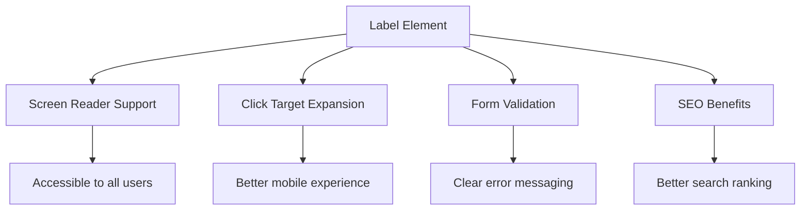
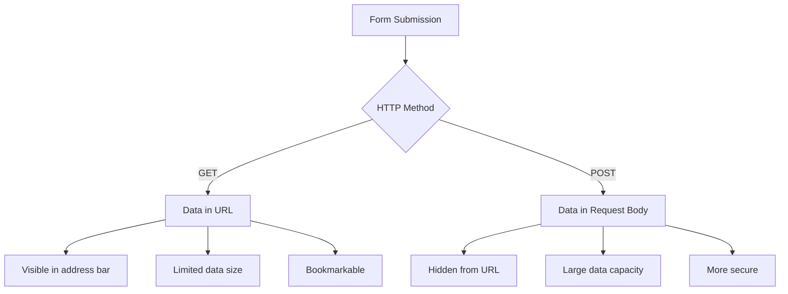
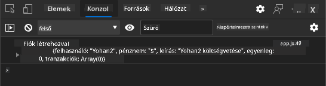
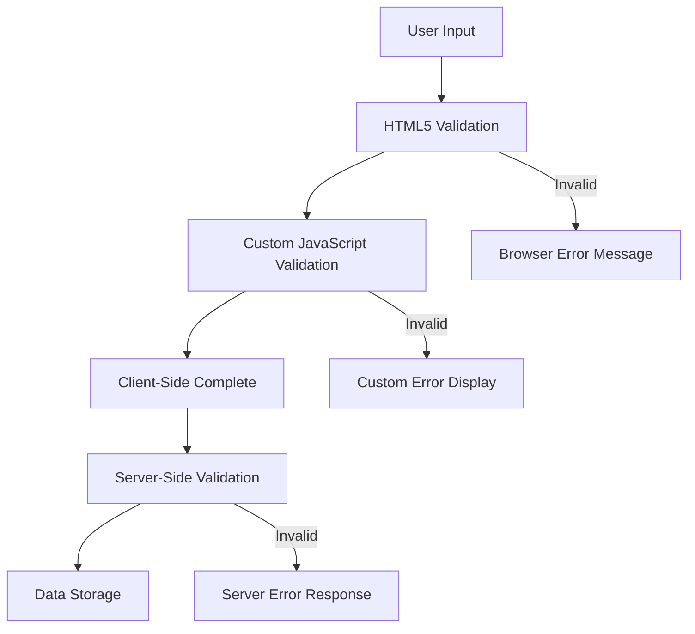
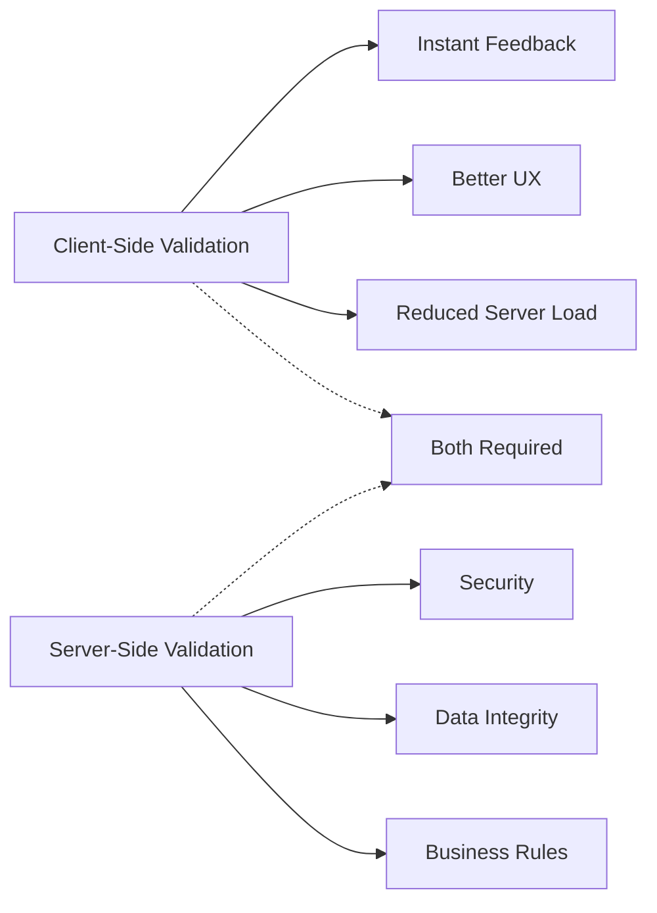

<!--
CO_OP_TRANSLATOR_METADATA:
{
  "original_hash": "b24f28fc46dd473aa9080f174182adde",
  "translation_date": "2025-10-24T20:25:07+00:00",
  "source_file": "7-bank-project/2-forms/README.md",
  "language_code": "hu"
}
-->
# Banki Alkalmazás Készítése 2. rész: Bejelentkezési és Regisztrációs Űrlap Készítése

## Előzetes Kvíz

[Előzetes kvíz](https://ff-quizzes.netlify.app/web/quiz/43)

Töltöttél már ki online űrlapot, amely elutasította az e-mail formátumodat? Vagy elvesztetted az összes adatodat, miután a "Küldés" gombra kattintottál? Mindannyian találkoztunk már ezekkel a bosszantó helyzetekkel.

Az űrlapok jelentik a hidat a felhasználók és az alkalmazásod funkcionalitása között. Ahogyan a légi irányítók gondosan követik a protokollokat, hogy a repülőgépeket biztonságosan célba juttassák, a jól megtervezett űrlapok is egyértelmű visszajelzést adnak és megelőzik a költséges hibákat. A rosszul megtervezett űrlapok viszont gyorsan elriaszthatják a felhasználókat, mint egy félreértés egy forgalmas repülőtéren.

Ebben a leckében az állóképes banki alkalmazásodat interaktív alkalmazássá alakítjuk. Megtanulod, hogyan készíts olyan űrlapokat, amelyek érvényesítik a felhasználói adatokat, kommunikálnak a szerverekkel, és hasznos visszajelzéseket adnak. Gondolj erre úgy, mint egy vezérlőfelület megépítésére, amely lehetővé teszi a felhasználók számára, hogy eligazodjanak az alkalmazás funkciói között.

A végére egy teljes bejelentkezési és regisztrációs rendszert fogsz létrehozni, amely érvényesítéssel segíti a felhasználókat a sikeres használatban, a frusztráció helyett.

## Előfeltételek

Mielőtt elkezdenénk az űrlapok készítését, győződjünk meg róla, hogy minden megfelelően be van állítva. Ez a lecke ott folytatódik, ahol az előző véget ért, így ha előreugrottál, érdemes visszatérni és először az alapokat működésbe hozni.

### Szükséges beállítások

| Komponens | Állapot | Leírás |
|-----------|---------|--------|
| [HTML sablonok](../1-template-route/README.md) | ✅ Szükséges | Az alap banki alkalmazás szerkezete |
| [Node.js](https://nodejs.org) | ✅ Szükséges | JavaScript futtatókörnyezet a szerverhez |
| [Bank API szerver](../api/README.md) | ✅ Szükséges | Háttérszolgáltatás az adatok tárolásához |

> 💡 **Fejlesztési tipp**: Két különálló szervert fogsz egyszerre futtatni – egyet a front-end banki alkalmazásodhoz, és egy másikat a háttér API-hoz. Ez a beállítás tükrözi a valós fejlesztési környezetet, ahol a front-end és a back-end szolgáltatások egymástól függetlenül működnek.

### Szerver Konfiguráció

**A fejlesztési környezeted tartalmazni fogja:**
- **Front-end szerver**: A banki alkalmazás kiszolgálására (általában `3000` porton)
- **Háttér API szerver**: Az adatok tárolására és lekérésére (port `5000`)
- **Mindkét szerver** egyszerre futhat ütközés nélkül

**API kapcsolat tesztelése:**
```bash
curl http://localhost:5000/api
# Expected response: "Bank API v1.0.0"
```

**Ha látod az API verzió válaszát, készen állsz a folytatásra!**

---

## HTML Űrlapok és Vezérlők Megértése

A HTML űrlapok segítségével kommunikálnak a felhasználók a webalkalmazásoddal. Gondolj rájuk úgy, mint a 19. századi távíró rendszerre, amely távoli helyeket kötött össze – ezek jelentik a kommunikációs protokollt a felhasználói szándék és az alkalmazás válasza között. Ha átgondoltan tervezzük meg őket, képesek hibákat elkapni, irányítani az adatbevitel formátumát, és hasznos javaslatokat adni.

A modern űrlapok sokkal kifinomultabbak, mint az alapvető szövegbeviteli mezők. A HTML5 speciális bemeneti típusokat vezetett be, amelyek automatikusan kezelik az e-mail érvényesítést, a számformázást és a dátumválasztást. Ezek a fejlesztések mind a hozzáférhetőséget, mind a mobil felhasználói élményt javítják.

### Alapvető Űrlapelemek

**Az űrlapok alapvető építőelemei:**

```html
<!-- Basic form structure -->
<form id="userForm" method="POST">
  <label for="username">Username</label>
  <input id="username" name="username" type="text" required>
  
  <button type="submit">Submit</button>
</form>
```

**Ez a kód a következőket teszi:**
- **Létrehoz** egy egyedi azonosítóval ellátott űrlaptartót
- **Meghatározza** az adatok beküldéséhez használt HTTP metódust
- **Hozzárendeli** a címkéket a bemenetekhez a hozzáférhetőség érdekében
- **Meghatároz** egy küldés gombot az űrlap feldolgozásához

### Modern Bemeneti Típusok és Attribútumok

| Bemeneti típus | Cél | Példa használat |
|----------------|-----|-----------------|
| `text` | Általános szövegbevitel | `<input type="text" name="username">` |
| `email` | E-mail érvényesítés | `<input type="email" name="email">` |
| `password` | Rejtett szövegbevitel | `<input type="password" name="password">` |
| `number` | Számbevitel | `<input type="number" name="balance" min="0">` |
| `tel` | Telefonszámok | `<input type="tel" name="phone">` |

> 💡 **Modern HTML5 Előny**: A specifikus bemeneti típusok használata automatikus érvényesítést, megfelelő mobil billentyűzeteket és jobb hozzáférhetőségi támogatást biztosít további JavaScript nélkül!

### Gombtípusok és Viselkedésük

```html
<!-- Different button behaviors -->
<button type="submit">Save Data</button>     <!-- Submits the form -->
<button type="reset">Clear Form</button>    <!-- Resets all fields -->
<button type="button">Custom Action</button> <!-- No default behavior -->
```

**Mit csinál minden gombtípus:**
- **Küldés gombok**: Elindítják az űrlap beküldését, és elküldik az adatokat a megadott végpontra
- **Visszaállítás gombok**: Visszaállítják az összes űrlapmezőt az eredeti állapotukba
- **Általános gombok**: Nem rendelkeznek alapértelmezett viselkedéssel, egyedi JavaScript szükséges a funkcionalitáshoz

> ⚠️ **Fontos Megjegyzés**: Az `<input>` elem önzáró, és nem igényel záró tagot. A modern legjobb gyakorlat az, hogy `<input>`-ot írunk záró perjel nélkül.

### Bejelentkezési Űrlap Készítése

Most készítsünk egy gyakorlati bejelentkezési űrlapot, amely bemutatja a modern HTML űrlapgyakorlatokat. Kezdjük egy alapvető szerkezettel, és fokozatosan bővítsük ki hozzáférhetőségi funkciókkal és érvényesítéssel.

```html
<template id="login">
  <h1>Bank App</h1>
  <section>
    <h2>Login</h2>
    <form id="loginForm" novalidate>
      <div class="form-group">
        <label for="username">Username</label>
        <input id="username" name="user" type="text" required 
               autocomplete="username" placeholder="Enter your username">
      </div>
      <button type="submit">Login</button>
    </form>
  </section>
</template>
```

**Ami itt történik:**
- **Strukturálja** az űrlapot szemantikus HTML5 elemekkel
- **Csoportosítja** a kapcsolódó elemeket jelentőségteljes osztályokkal ellátott `div` konténerekben
- **Hozzárendeli** a címkéket a bemenetekhez a `for` és `id` attribútumok használatával
- **Tartalmazza** a modern attribútumokat, mint az `autocomplete` és a `placeholder` a jobb felhasználói élmény érdekében
- **Hozzáadja** a `novalidate` attribútumot, hogy az érvényesítést JavaScript kezelje a böngésző alapértelmezett helyett

### A Megfelelő Címkék Fontossága

**Miért fontosak a címkék a modern webfejlesztésben:**



**Mit érnek el a megfelelő címkék:**
- **Lehetővé teszik**, hogy a képernyőolvasók egyértelműen bejelentsék az űrlapmezőket
- **Kibővítik** a kattintható területet (a címkére kattintva a bemeneti mezőre fókuszál)
- **Javítják** a mobil használhatóságot nagyobb érintési célterületekkel
- **Támogatják** az űrlap érvényesítést értelmes hibaüzenetekkel
- **Növelik** a SEO-t az űrlapelemek szemantikai jelentésének biztosításával

> 🎯 **Hozzáférhetőségi Cél**: Minden űrlapmezőhöz tartoznia kell egy címkének. Ez az egyszerű gyakorlat mindenki számára használhatóvá teszi az űrlapokat, beleértve a fogyatékkal élő felhasználókat is, és javítja az élményt mindenki számára.

### Regisztrációs Űrlap Létrehozása

A regisztrációs űrlap részletesebb információkat igényel egy teljes felhasználói fiók létrehozásához. Készítsük el modern HTML5 funkciókkal és továbbfejlesztett hozzáférhetőséggel.

```html
<hr/>
<h2>Register</h2>
<form id="registerForm" novalidate>
  <div class="form-group">
    <label for="user">Username</label>
    <input id="user" name="user" type="text" required 
           autocomplete="username" placeholder="Choose a username">
  </div>
  
  <div class="form-group">
    <label for="currency">Currency</label>
    <input id="currency" name="currency" type="text" value="$" 
           required maxlength="3" placeholder="USD, EUR, etc.">
  </div>
  
  <div class="form-group">
    <label for="description">Account Description</label>
    <input id="description" name="description" type="text" 
           maxlength="100" placeholder="Personal savings, checking, etc.">
  </div>
  
  <div class="form-group">
    <label for="balance">Starting Balance</label>
    <input id="balance" name="balance" type="number" value="0" 
           min="0" step="0.01" placeholder="0.00">
  </div>
  
  <button type="submit">Create Account</button>
</form>
```

**A fentiekben:**
- **Rendszereztük** az egyes mezőket konténer div-ekbe a jobb stílus és elrendezés érdekében
- **Hozzáadtuk** a megfelelő `autocomplete` attribútumokat a böngésző automatikus kitöltési támogatásához
- **Beépítettük** a hasznos helykitöltő szöveget az adatbevitel irányításához
- **Beállítottuk** az ésszerű alapértelmezéseket a `value` attribútum használatával
- **Alkalmaztuk** az érvényesítési attribútumokat, mint a `required`, `maxlength` és `min`
- **Használtuk** a `type="number"` mezőt a balance mezőhöz, amely támogatja a tizedesjegyeket

### Bemeneti Típusok és Viselkedésük Felfedezése

**A modern bemeneti típusok fejlettebb funkcionalitást biztosítanak:**

| Funkció | Előny | Példa |
|---------|-------|-------|
| `type="number"` | Számgombok mobilon | Egyszerűbb egyenlegbevitel |
| `step="0.01"` | Tizedes pontosság szabályozása | Lehetővé teszi a centek megadását |
| `autocomplete` | Böngésző automatikus kitöltés | Gyorsabb űrlapkitöltés |
| `placeholder` | Kontextuális útmutatók | Segíti a felhasználói elvárásokat |

> 🎯 **Hozzáférhetőségi Kihívás**: Próbáld meg csak a billentyűzeted segítségével navigálni az űrlapokon! Használd a `Tab`-ot a mezők közötti mozgáshoz, a `Space`-t a jelölőnégyzetek bejelöléséhez, és az `Enter`-t az űrlap beküldéséhez. Ez az élmény segít megérteni, hogyan használják a képernyőolvasót használó felhasználók az űrlapjaidat.

## Az Űrlapbeküldési Módszerek Megértése

Amikor valaki kitölti az űrlapodat és a küldés gombra kattint, az adatoknak valahová el kell jutniuk – általában egy szerverre, amely elmenti azokat. Ennek többféle módja van, és ha tudod, melyiket használd, elkerülheted a későbbi fejfájást.

Nézzük meg, mi történik valójában, amikor valaki rákattint a küldés gombra.

### Az Űrlap Alapértelmezett Viselkedése

Először is, figyeljük meg, mi történik az alapvető űrlapbeküldés során:

**Teszteld a jelenlegi űrlapjaidat:**
1. Kattints a *Regisztráció* gombra az űrlapodon
2. Figyeld meg a böngésződ címsorában bekövetkező változásokat
3. Vedd észre, hogy az oldal újratöltődik, és az adatok megjelennek az URL-ben


### HTTP Metódusok Összehasonlítása



**A különbségek megértése:**

| Metódus | Használati eset | Adatok helye | Biztonsági szint | Méretkorlát |
|---------|----------------|--------------|------------------|-------------|
| `GET` | Keresési lekérdezések, szűrők | URL paraméterek | Alacsony (látható) | ~2000 karakter |
| `POST` | Felhasználói fiókok, érzékeny adatok | Kérés törzse | Magasabb (rejtett) | Gyakorlatilag nincs korlát |

**Az alapvető különbségek megértése:**
- **GET**: Az űrlap adatait URL paraméterként csatolja (keresési műveletekhez megfelelő)
- **POST**: Az adatokat a kérés törzsébe helyezi (érzékeny információkhoz elengedhetetlen)
- **GET korlátai**: Méretkorlátok, látható adatok, böngésző történetében megmarad
- **POST előnyei**: Nagy adatmennyiség, adatvédelem, fájlfeltöltés támogatása

> 💡 **Legjobb Gyakorlat**: Használj `GET` metódust keresési űrlapokhoz és szűrőkhöz (adatlekérés), és `POST` metódust felhasználói regisztrációhoz, bejelentkezéshez és adat létrehozásához.

### Az Űrlapbeküldés Konfigurálása

Konfiguráljuk a regisztrációs űrlapodat, hogy megfelelően kommunikáljon a háttér API-val a POST metódus használatával:

```html
<form id="registerForm" action="//localhost:5000/api/accounts" 
      method="POST" novalidate>
```

**Ez a konfiguráció a következőket teszi:**
- **Irányítja** az űrlap beküldését az API végpontra
- **POST metódust használ** az adatok biztonságos továbbításához
- **Tartalmazza** a `novalidate` attribútumot, hogy az érvényesítést JavaScript kezelje

### Az Űrlapbeküldés Tesztelése

**Kövesd ezeket a lépéseket az űrlap teszteléséhez:**
1. **Töltsd ki** a regisztrációs űrlapot az adataiddal
2. **Kattints** a "Fiók létrehozása" gombra
3. **Figyeld meg** a szerver válaszát a böngésződben


**Amit látnod kell:**
- **A böngésző átirányít** az API végpont URL-jére
- **JSON válasz**, amely tartalmazza az újonnan létrehozott fiók adatait
- **Szerver megerősítése**, hogy a fiók sikeresen létrejött

> 🧪 **Kísérleti Idő**: Próbálj meg újra regisztrálni ugyanazzal a felhasználónévvel. Milyen választ kapsz? Ez segít megérteni, hogyan kezeli a szerver a duplikált adatokat és a hibás feltételeket.

### JSON Válaszok Megértése

**Amikor a szerver sikeresen feldolgozza az űrlapodat:**
```json
{
  "user": "john_doe",
  "currency": "$",
  "description": "Personal savings",
  "balance": 100,
  "id": "unique_account_id"
}
```

**Ez a válasz megerősíti:**
- **Létrehoz** egy új fiókot az általad megadott adatokkal
-
- **Részletes** hibaüzeneteket biztosít a hibakereséshez
- **Egységes** adatstruktúrát ad vissza sikeres és hibás esetekben

### A Modern Fetch API ereje

**Fetch API előnyei a régebbi módszerekkel szemben:**

| Funkció | Előny | Megvalósítás |
|---------|-------|--------------|
| Ígéret-alapú | Tiszta aszinkron kód | `await fetch()` |
| Kérés testreszabása | Teljes HTTP vezérlés | Fejlécek, metódusok, törzs |
| Válaszkezelés | Rugalmas adatfeldolgozás | `.json()`, `.text()`, `.blob()` |
| Hibakezelés | Átfogó hibakezelés | Try/catch blokkok |

> 🎥 **Tudj meg többet**: [Async/Await oktatóanyag](https://youtube.com/watch?v=YwmlRkrxvkk) - Az aszinkron JavaScript minták megértése a modern webfejlesztéshez.

**Kulcsfogalmak a szerverrel való kommunikációhoz:**
- **Aszinkron függvények** lehetővé teszik a végrehajtás szüneteltetését a szerver válaszára várva
- **Await kulcsszó** az aszinkron kódot szinkron kódhoz hasonlóvá teszi
- **Fetch API** modern, ígéret-alapú HTTP kéréseket biztosít
- **Hibakezelés** garantálja, hogy az alkalmazás hálózati problémák esetén is megfelelően reagáljon

### A regisztrációs funkció befejezése

Hozzuk össze mindent egy teljes, éles környezetre kész regisztrációs funkcióval:

```javascript
async function register() {
  const registerForm = document.getElementById('registerForm');
  const submitButton = registerForm.querySelector('button[type="submit"]');
  
  try {
    // Show loading state
    submitButton.disabled = true;
    submitButton.textContent = 'Creating Account...';
    
    // Process form data
    const formData = new FormData(registerForm);
    const jsonData = JSON.stringify(Object.fromEntries(formData));
    
    // Send to server
    const result = await createAccount(jsonData);
    
    if (result.error) {
      console.error('Registration failed:', result.error);
      alert(`Registration failed: ${result.error}`);
      return;
    }
    
    console.log('Account created successfully!', result);
    alert(`Welcome, ${result.user}! Your account has been created.`);
    
    // Reset form after successful registration
    registerForm.reset();
    
  } catch (error) {
    console.error('Unexpected error:', error);
    alert('An unexpected error occurred. Please try again.');
  } finally {
    // Restore button state
    submitButton.disabled = false;
    submitButton.textContent = 'Create Account';
  }
}
```

**Ez a továbbfejlesztett megvalósítás tartalmazza:**
- **Vizualizált** visszajelzést biztosít az űrlap beküldése közben
- **Letiltja** a beküldés gombot a duplikált beküldések elkerülése érdekében
- **Kezeli** az előre látható és váratlan hibákat egyaránt
- **Felhasználóbarát** siker- és hibaüzeneteket jelenít meg
- **Visszaállítja** az űrlapot sikeres regisztráció után
- **Helyreállítja** a felhasználói felület állapotát az eredménytől függetlenül

### Az implementáció tesztelése

**Nyisd meg a böngésző fejlesztői eszközeit és teszteld a regisztrációt:**

1. **Nyisd meg** a böngésző konzolt (F12 → Console fül)
2. **Töltsd ki** a regisztrációs űrlapot
3. **Kattints** a "Fiók létrehozása" gombra
4. **Figyeld meg** a konzol üzeneteket és a felhasználói visszajelzést



**Amit látnod kell:**
- **Betöltési állapot** jelenik meg a beküldés gombon
- **Konzol naplók** részletes információt adnak a folyamatról
- **Sikerüzenet** jelenik meg, ha a fiók létrehozása sikeres
- **Az űrlap automatikusan** visszaáll sikeres beküldés után

> 🔒 **Biztonsági megfontolás**: Jelenleg az adatok HTTP-n keresztül utaznak, ami nem biztonságos éles környezetben. Valódi alkalmazásokban mindig használj HTTPS-t az adatátvitel titkosításához. Tudj meg többet a [HTTPS biztonságról](https://en.wikipedia.org/wiki/HTTPS) és arról, miért elengedhetetlen a felhasználói adatok védelméhez.

## Átfogó űrlapellenőrzés

Az űrlapellenőrzés megakadályozza azt a frusztráló élményt, amikor a hibák csak beküldés után derülnek ki. Akárcsak a Nemzetközi Űrállomás többszörös biztonsági rendszerei, a hatékony ellenőrzés több rétegű biztonsági ellenőrzést alkalmaz.

Az optimális megközelítés ötvözi a böngésző szintű ellenőrzést az azonnali visszajelzés érdekében, a JavaScript ellenőrzést a jobb felhasználói élményért, és a szerveroldali ellenőrzést a biztonság és adatintegritás érdekében. Ez a redundancia biztosítja a felhasználói elégedettséget és a rendszer védelmét.

### Az ellenőrzési rétegek megértése



**Többrétegű ellenőrzési stratégia:**
- **HTML5 ellenőrzés**: Azonnali böngésző-alapú ellenőrzések
- **JavaScript ellenőrzés**: Egyedi logika és felhasználói élmény
- **Szerveroldali ellenőrzés**: Végső biztonsági és adatintegritási ellenőrzések
- **Progresszív fejlesztés**: Akkor is működik, ha a JavaScript le van tiltva

### HTML5 ellenőrzési attribútumok

**Modern ellenőrzési eszközök a rendelkezésedre:**

| Attribútum | Cél | Példa | Böngésző viselkedése |
|------------|-----|-------|----------------------|
| `required` | Kötelező mezők | `<input required>` | Megakadályozza az üres beküldést |
| `minlength`/`maxlength` | Szöveghossz korlátok | `<input maxlength="20">` | Karakterkorlátokat érvényesít |
| `min`/`max` | Számértékek határai | `<input min="0" max="1000">` | Számhatárokat ellenőriz |
| `pattern` | Egyedi regex szabályok | `<input pattern="[A-Za-z]+">` | Meghatározott formátumokat ellenőriz |
| `type` | Adattípus ellenőrzés | `<input type="email">` | Formátum-specifikus ellenőrzés |

### CSS ellenőrzési stílusok

**Hozz létre vizuális visszajelzést az ellenőrzési állapotokhoz:**

```css
/* Valid input styling */
input:valid {
  border-color: #28a745;
  background-color: #f8fff9;
}

/* Invalid input styling */
input:invalid {
  border-color: #dc3545;
  background-color: #fff5f5;
}

/* Focus states for better accessibility */
input:focus:valid {
  box-shadow: 0 0 0 0.2rem rgba(40, 167, 69, 0.25);
}

input:focus:invalid {
  box-shadow: 0 0 0 0.2rem rgba(220, 53, 69, 0.25);
}
```

**Amit ezek a vizuális jelek elérnek:**
- **Zöld keretek**: Sikeres ellenőrzést jeleznek, mint a zöld lámpák az irányító központban
- **Piros keretek**: Hibákat jeleznek, amelyek figyelmet igényelnek
- **Fókusz kiemelések**: Egyértelmű vizuális kontextust biztosítanak az aktuális bemeneti helyhez
- **Konzisztens stílus**: Megtanulható, kiszámítható felhasználói felület mintákat hoz létre

> 💡 **Profi tipp**: Használd a `:valid` és `:invalid` CSS pszeudo-osztályokat, hogy azonnali vizuális visszajelzést adj a felhasználóknak gépelés közben, ezzel egy reszponzív és segítőkész felületet hozva létre.

### Átfogó ellenőrzés megvalósítása

Fejlesszük tovább a regisztrációs űrlapot robusztus ellenőrzéssel, amely kiváló felhasználói élményt és adatminőséget biztosít:

```html
<form id="registerForm" method="POST" novalidate>
  <div class="form-group">
    <label for="user">Username <span class="required">*</span></label>
    <input id="user" name="user" type="text" required 
           minlength="3" maxlength="20" 
           pattern="[a-zA-Z0-9_]+" 
           autocomplete="username"
           title="Username must be 3-20 characters, letters, numbers, and underscores only">
    <small class="form-text">Choose a unique username (3-20 characters)</small>
  </div>
  
  <div class="form-group">
    <label for="currency">Currency <span class="required">*</span></label>
    <input id="currency" name="currency" type="text" required 
           value="$" maxlength="3" 
           pattern="[A-Z$€£¥₹]+" 
           title="Enter a valid currency symbol or code">
    <small class="form-text">Currency symbol (e.g., $, €, £)</small>
  </div>
  
  <div class="form-group">
    <label for="description">Account Description</label>
    <input id="description" name="description" type="text" 
           maxlength="100" 
           placeholder="Personal savings, checking, etc.">
    <small class="form-text">Optional description (up to 100 characters)</small>
  </div>
  
  <div class="form-group">
    <label for="balance">Starting Balance</label>
    <input id="balance" name="balance" type="number" 
           value="0" min="0" step="0.01" 
           title="Enter a positive number for your starting balance">
    <small class="form-text">Initial account balance (minimum $0.00)</small>
  </div>
  
  <button type="submit">Create Account</button>
</form>
```

**A továbbfejlesztett ellenőrzés megértése:**
- **Kombinálja** a kötelező mezők jelölését hasznos leírásokkal
- **Tartalmazza** a `pattern` attribútumokat a formátum ellenőrzéséhez
- **Biztosítja** a `title` attribútumokat az akadálymentesség és a súgók számára
- **Segítő szöveget ad** a felhasználói bemenet irányításához
- **Használja** a szemantikus HTML struktúrát a jobb akadálymentesség érdekében

### Haladó ellenőrzési szabályok

**Mit érnek el az egyes ellenőrzési szabályok:**

| Mező | Ellenőrzési szabályok | Felhasználói előny |
|------|-----------------------|--------------------|
| Felhasználónév | `required`, `minlength="3"`, `maxlength="20"`, `pattern="[a-zA-Z0-9_]+"` | Érvényes, egyedi azonosítókat biztosít |
| Pénznem | `required`, `maxlength="3"`, `pattern="[A-Z$€£¥₹]+"` | Elfogadja a gyakori pénznem szimbólumokat |
| Egyenleg | `min="0"`, `step="0.01"`, `type="number"` | Megakadályozza a negatív egyenlegeket |
| Leírás | `maxlength="100"` | Ésszerű hosszúsági korlátokat biztosít |

### Az ellenőrzési viselkedés tesztelése

**Próbáld ki ezeket az ellenőrzési forgatókönyveket:**
1. **Küldd be** az űrlapot üres kötelező mezőkkel
2. **Adj meg** egy 3 karakternél rövidebb felhasználónevet
3. **Próbálj ki** speciális karaktereket a felhasználónév mezőben
4. **Írj be** negatív egyenleg összeget


**Amit tapasztalni fogsz:**
- **A böngésző megjeleníti** a natív ellenőrzési üzeneteket
- **A stílus változik** a `:valid` és `:invalid` állapotok alapján
- **Az űrlap beküldése** addig nem lehetséges, amíg minden ellenőrzés nem sikeres
- **A fókusz automatikusan** az első érvénytelen mezőre ugrik

### Ügyféloldali vs Szerveroldali ellenőrzés



**Miért van szükség mindkét rétegre:**
- **Ügyféloldali ellenőrzés**: Azonnali visszajelzést ad és javítja a felhasználói élményt
- **Szerveroldali ellenőrzés**: Biztonságot nyújt és kezeli az összetett üzleti szabályokat
- **Kombinált megközelítés**: Robusztus, felhasználóbarát és biztonságos alkalmazásokat hoz létre
- **Progresszív fejlesztés**: Akkor is működik, ha a JavaScript le van tiltva

> 🛡️ **Biztonsági emlékeztető**: Soha ne bízz kizárólag az ügyféloldali ellenőrzésben! Rosszindulatú felhasználók megkerülhetik az ügyféloldali ellenőrzéseket, ezért a szerveroldali ellenőrzés elengedhetetlen a biztonság és az adatintegritás érdekében.

---


---

## GitHub Copilot Agent kihívás 🚀

Használd az Agent módot a következő kihívás teljesítéséhez:

**Leírás:** Fejleszd tovább a regisztrációs űrlapot átfogó ügyféloldali ellenőrzéssel és felhasználói visszajelzéssel. Ez a kihívás segít gyakorolni az űrlapellenőrzést, hibakezelést és a felhasználói élmény javítását interaktív visszajelzésekkel.

**Feladat:** Hozz létre egy teljes űrlapellenőrzési rendszert a regisztrációs űrlaphoz, amely tartalmazza: 1) Valós idejű ellenőrzési visszajelzést minden mezőhöz, ahogy a felhasználó gépel, 2) Egyedi ellenőrzési üzeneteket, amelyek minden bemeneti mező alatt megjelennek, 3) Egy jelszó megerősítő mezőt, amely ellenőrzi az egyezést, 4) Vizuális jelzéseket (például zöld pipák az érvényes mezőkhöz és piros figyelmeztetések az érvénytelenekhez), 5) Egy beküldés gombot, amely csak akkor válik aktívvá, ha minden ellenőrzés sikeres. Használj HTML5 ellenőrzési attribútumokat, CSS-t az ellenőrzési állapotok stílusához, és JavaScriptet az interaktív viselkedéshez.

Tudj meg többet az [agent mode](https://code.visualstudio.com/blogs/2025/02/24/introducing-copilot-agent-mode) funkcióról itt.

## 🚀 Kihívás

Mutass egy hibaüzenetet a HTML-ben, ha a felhasználó már létezik.

Íme egy példa arra, hogyan nézhet ki a végleges bejelentkezési oldal némi stílus hozzáadása után:


## Előadás utáni kvíz

[Előadás utáni kvíz](https://ff-quizzes.netlify.app/web/quiz/44)

## Áttekintés és önálló tanulás

A fejlesztők nagyon kreatívak lettek az űrlapkészítési erőfeszítéseik során, különösen az ellenőrzési stratégiák tekintetében. Ismerd meg a különböző űrlapfolyamatokat, ha átnézed a [CodePen](https://codepen.com) oldalát; találsz-e érdekes és inspiráló űrlapokat?

## Feladat

[Stilizáld a banki alkalmazásodat](assignment.md)

---

**Felelősség kizárása**:  
Ez a dokumentum az [Co-op Translator](https://github.com/Azure/co-op-translator) AI fordítási szolgáltatás segítségével lett lefordítva. Bár törekszünk a pontosságra, kérjük, vegye figyelembe, hogy az automatikus fordítások hibákat vagy pontatlanságokat tartalmazhatnak. Az eredeti dokumentum az eredeti nyelvén tekintendő hiteles forrásnak. Fontos információk esetén javasolt professzionális emberi fordítást igénybe venni. Nem vállalunk felelősséget semmilyen félreértésért vagy téves értelmezésért, amely a fordítás használatából eredhet.