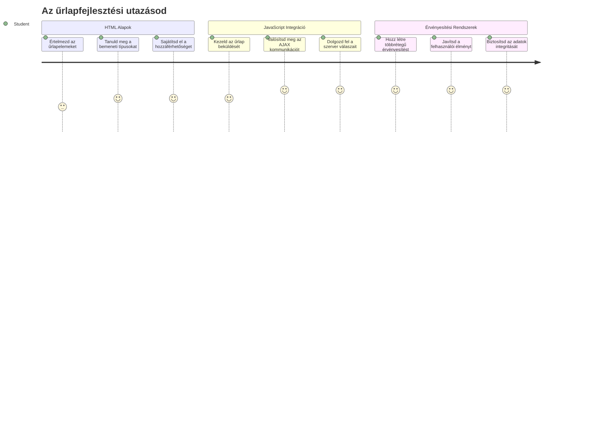
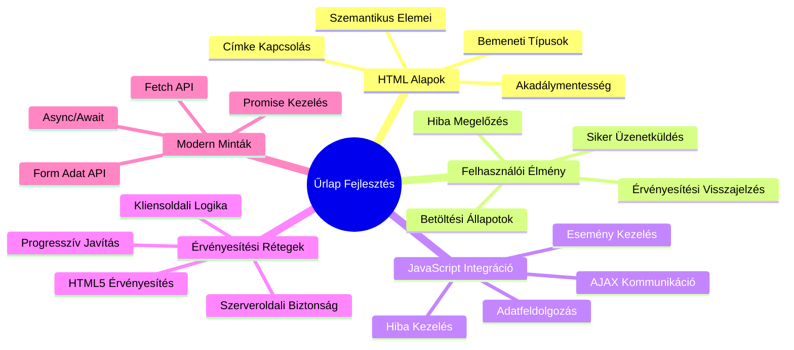
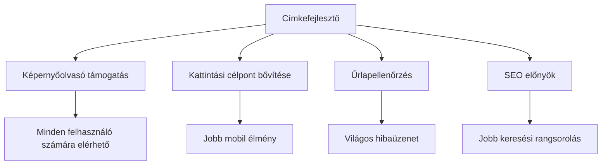
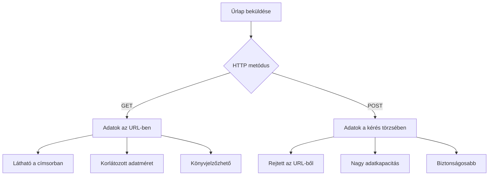
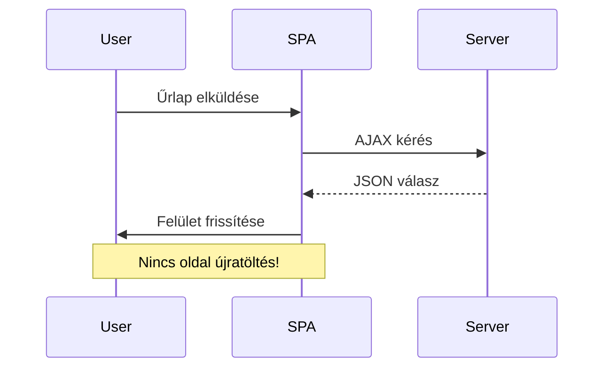
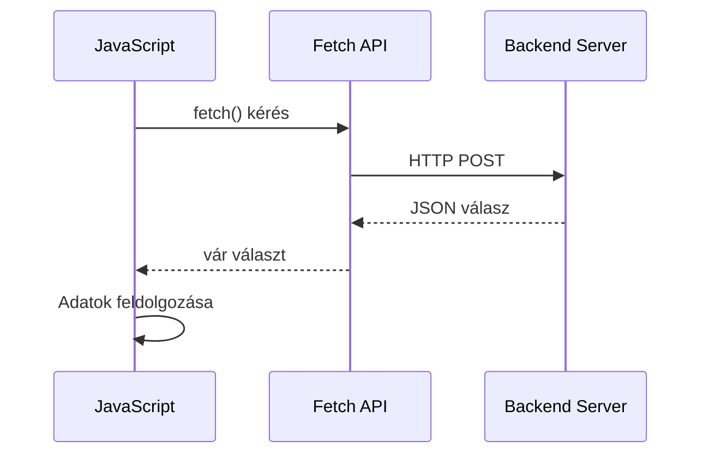
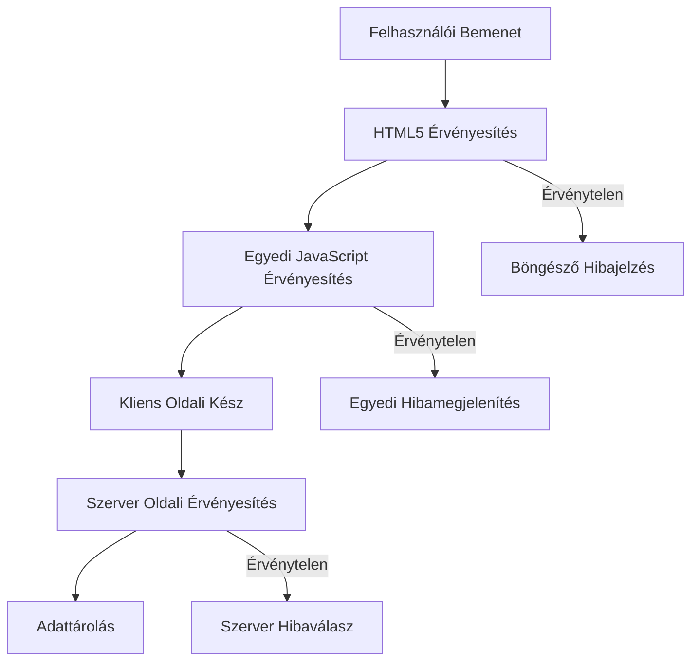
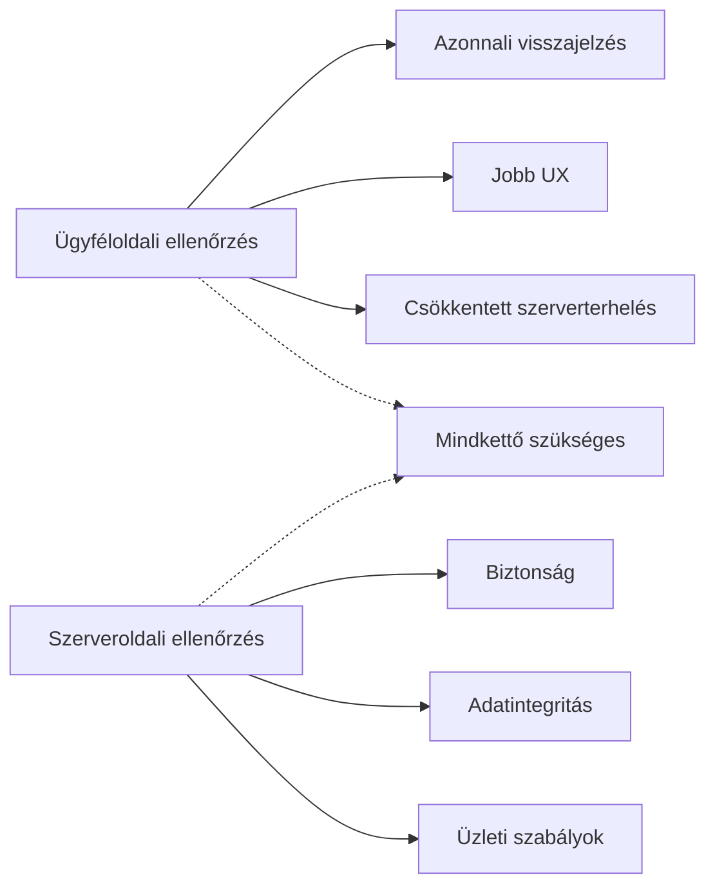
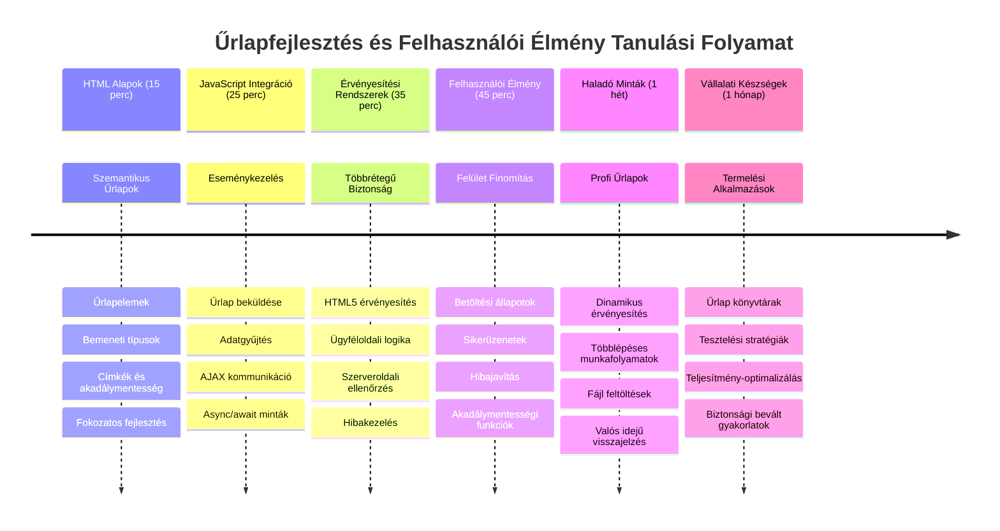

<!--
CO_OP_TRANSLATOR_METADATA:
{
  "original_hash": "7cbdbd132d39a2bb493e85bc2a9387cc",
  "translation_date": "2026-01-07T02:53:50+00:00",
  "source_file": "7-bank-project/2-forms/README.md",
  "language_code": "hu"
}
-->
# Banki alkalmazás készítése 2. rész: Bejelentkezési és regisztrációs űrlap készítése


## Előadás előtti kvíz

[Előadás előtti kvíz](https://ff-quizzes.netlify.app/web/quiz/43)

Töltöttél már ki online űrlapot, ami elutasította az email formátumodat? Vagy elveszítetted az összes adatodat, amikor a küldés gombra kattintottál? Mindannyian találkoztunk már ezekkel a frusztráló élményekkel.

Az űrlapok híd szerepét töltik be a felhasználók és az alkalmazás funkciói között. Ahogy a légiforgalmi irányítók pontos protokollokat alkalmaznak a repülőgépek biztonságos irányítására, úgy a jól megtervezett űrlapok tiszta visszajelzést adnak és megelőzik a költséges hibákat. A rosszul megtervezett űrlapok viszont messzebb űzik a felhasználókat, mint egy félreértés a zsúfolt repülőtéren.

Ebben a leckében átalakítjuk a statikus banki alkalmazásodat interaktívvá. Megtanulod, hogyan építs űrlapokat, melyek érvényesítik a felhasználói adatokat, kommunikálnak a szerverekkel, és hasznos visszajelzést nyújtanak. Olyan, mintha a vezérlőfelületet építenéd, amely lehetővé teszi a felhasználóknak, hogy navigáljanak az alkalmazás funkciói között.

A végére teljes bejelentkezési és regisztrációs rendszert fogsz látni, amely érvényesítéssel segíti a felhasználókat a sikeres használat felé a frusztráció helyett.


## Előfeltételek

Mielőtt elkezdenénk az űrlapok építését, győződj meg róla, hogy minden megfelelően van beállítva. Ez a lecke ott folytatja, ahol az előző abbahagyta, így ha átlépted, érdemes visszamenni és először az alapokat működésbe hozni.

### Szükséges beállítások

| Komponens | Állapot | Leírás |
|-----------|--------|-------------|
| [HTML sablonok](../1-template-route/README.md) | ✅ Szükséges | Az alap banki alkalmazás szerkezete |
| [Node.js](https://nodejs.org) | ✅ Szükséges | JavaScript futtatókörnyezet a szerverhez |
| [Bank API szerver](../api/README.md) | ✅ Szükséges | Háttérszolgáltatás adat tárolásához |

> 💡 **Fejlesztési tipp**: Egyszerre két külön szervert fogsz futtatni – egyet a front-end banki alkalmazásodhoz, és egyet a backend API-hoz. Ez a beállítás tükrözi a valós fejlesztést, ahol a frontend és backend szolgáltatások külön működnek.

### Szerver konfiguráció

**A fejlesztői környezeted tartalmazni fogja:**
- **Frontend szerver**: Szolgálja a banki alkalmazásodat (általában a `3000` porton)
- **Backend API szerver**: Kezeli az adat tárolást és lekérést (a `5000` porton)
- **Mindkét szerver** egyszerre is futtatható összeütközés nélkül

**API kapcsolat tesztelése:**
```bash
curl http://localhost:5000/api
# Várt válasz: "Bank API v1.0.0"
```

**Ha az API verzió válaszát látod, készen állsz a folytatásra!**

---

## HTML űrlapok és vezérlők megértése

A HTML űrlapok azok, amin keresztül a felhasználók kommunikálnak a webalkalmazásoddal. Olyanok, mint a távírórendszer, ami a 19. században összekötötte a távoli helyeket – ők a kommunikációs protokoll a felhasználói szándék és az alkalmazás válasza között. Ha jól tervezik őket, elkapják a hibákat, vezetik a bevitel formázását, és hasznos javaslatokat adnak.

A modern űrlapok sokkal fejlettebbek, mint az egyszerű szövegmezők. Az HTML5 speciális bemeneti típusokat vezetett be, amelyek automatikusan kezelik az email érvényesítést, számformázást, dátum kiválasztást. Ezek az fejlesztések javítják mind az akadálymentességet, mind a mobilos felhasználói élményt.

### Alapvető űrlapelemek

**Azok az építőkövek, amik minden űrlapban szükségesek:**

```html
<!-- Basic form structure -->
<form id="userForm" method="POST">
  <label for="username">Username</label>
  <input id="username" name="username" type="text" required>
  
  <button type="submit">Submit</button>
</form>
```

**Ez a kód a következőket végzi:**
- **Létrehoz** egy űrlap konténert egyedi azonosítóval
- **Meghatározza** az HTTP metódust az adatküldéshez
- **Összekapcsolja** a címkéket a bemenetekkel az akadálymentességért
- **Definiál** egy beküldő gombot az űrlap feldolgozásához

### Modern bemeneti típusok és attribútumok

| Bemeneti típus | Cél | Példa használat |
|------------|---------|---------------|
| `text` | Általános szövegbevitel | `<input type="text" name="username">` |
| `email` | Email érvényesítés | `<input type="email" name="email">` |
| `password` | Rejtett szöveg bevitel | `<input type="password" name="password">` |
| `number` | Számbevitel | `<input type="number" name="balance" min="0">` |
| `tel` | Telefonszám | `<input type="tel" name="phone">` |

> 💡 **Modern HTML5 előnyök**: A specifikus bemeneti típusok automatikus érvényesítést, megfelelő mobil billentyűzetet, és jobb akadálymentességet biztosítanak JavaScript nélkül is!

### Gomb típusok és működésük

```html
<!-- Different button behaviors -->
<button type="submit">Save Data</button>     <!-- Submits the form -->
<button type="reset">Clear Form</button>    <!-- Resets all fields -->
<button type="button">Custom Action</button> <!-- No default behavior -->
```

**Minden gomb típus ennél többet tesz:**
- **Submit gombok**: Elindítják az űrlap küldést, és elküldik az adatokat a megadott végpontra
- **Reset gombok**: Visszaállítják az összes mezőt eredeti állapotába
- **Rendes gombok**: Nincsenek előre definiált funkciók, egyedi JavaScript kell hozzájuk

> ⚠️ **Fontos megjegyzés**: Az `<input>` elem önzáró, nincs szükség lezáró tagra. A modern gyakorlat az, hogy `<input>`-ot írsz perjel nélkül.

### Bejelentkezési űrlap építése

Most készítsünk egy gyakorlati bejelentkezési űrlapot, amely megmutatja a modern HTML űrlapgyakorlati megoldásokat. Egy alap szerkezettel kezdünk, majd fokozatosan javítjuk akadálymentességi funkciókkal és érvényesítéssel.

```html
<template id="login">
  <h1>Bank App</h1>
  <section>
    <h2>Login</h2>
    <form id="loginForm" novalidate>
      <div class="form-group">
        <label for="username">Username</label>
        <input id="username" name="user" type="text" required 
               autocomplete="username" placeholder="Enter your username">
      </div>
      <button type="submit">Login</button>
    </form>
  </section>
</template>
```

**Itt történik:**
- **Szervezi** az űrlapot szemantikus HTML5 elemekkel
- **Csoportosítja** a kapcsolódó elemeket `div` konténerekkel osztályokkal
- **Összekapcsolja** a címkéket a bemenetekkel `for` és `id` attribútumokkal
- **Tartalmazza** a modern attribútumokat, mint `autocomplete` és `placeholder` jobb UX érdekében
- **Hozzáadja** a `novalidate`-ot, hogy a érvényesítést JavaScript kezelje a böngésző helyett

### A helyes címkék ereje

**Miért fontosak a címkék a modern webfejlesztésben:**


**Mit érünk el a helyes címkékkel:**
- **Lehetővé teszi** a képernyőolvasók számára az űrlapmezők tiszta bemondását
- **Növeli** a kattintható területet (a címke kattintásával az input fókuszba kerül)
- **Javítja** a mobil használhatóságot nagyobb érintési célpontokkal
- **Támogatja** az érvényesítést értelmes hibaüzenetekkel
- **Erősíti** az SEO-t szemantikus jelentéssel az űrlapelemeknek

> 🎯 **Akadálymentességi cél**: Minden űrlapmezőhöz kötelező a kapcsolódó címke. Ez az egyszerű gyakorlat az űrlapokat mindenki számára használhatóvá teszi, beleértve a fogyatékkal élőket is, és az összes felhasználó élményét javítja.

### Regisztrációs űrlap készítése

A regisztrációs űrlap több részletes adatot igényel a felhasználói fiók létrehozásához. Építsük meg modern HTML5 funkciókkal és fokozott akadálymentességgel.

```html
<hr/>
<h2>Register</h2>
<form id="registerForm" novalidate>
  <div class="form-group">
    <label for="user">Username</label>
    <input id="user" name="user" type="text" required 
           autocomplete="username" placeholder="Choose a username">
  </div>
  
  <div class="form-group">
    <label for="currency">Currency</label>
    <input id="currency" name="currency" type="text" value="$" 
           required maxlength="3" placeholder="USD, EUR, etc.">
  </div>
  
  <div class="form-group">
    <label for="description">Account Description</label>
    <input id="description" name="description" type="text" 
           maxlength="100" placeholder="Personal savings, checking, etc.">
  </div>
  
  <div class="form-group">
    <label for="balance">Starting Balance</label>
    <input id="balance" name="balance" type="number" value="0" 
           min="0" step="0.01" placeholder="0.00">
  </div>
  
  <button type="submit">Create Account</button>
</form>
```

**Ebben a példában:**
- **Szerveztük** az egyes mezőket konténer `div`-ekbe jobb stílus és elrendezés érdekében
- **Hozzáadtuk** a megfelelő `autocomplete` attribútumokat a böngésző automatikus kitöltés támogatásához
- **Tartalmaztunk** hasznos helykitöltő szöveget a felhasználói bevitel segítésére
- **Alapértelmezett értékeket állítottunk be** a `value` attribútummal
- **Alkalmaztunk** érvényesítési attribútumokat, mint `required`, `maxlength` és `min`
- **Használtuk** a `type="number"` típust egyenleg mezőre, tizedes értékek támogatásával

### Bemeneti típusok és viselkedésük áttekintése

**A modern bemeneti típusok kibővített funkciókat nyújtanak:**

| Jellemző | Előny | Példa |
|---------|---------|----------|
| `type="number"` | Numerikus billentyűzet mobilon | Egyszerűbb egyenleg bevitel |
| `step="0.01"` | Tizedes pontosság szabályozás | Lehetővé teszi az aprópénzt a pénznémeknél |
| `autocomplete` | Böngésző automatikus kitöltés | Gyorsabb űrlap kitöltés |
| `placeholder` | Kontekstus alapú segítség | Segíti a felhasználói elvárásokat |

> 🎯 **Akadálymentességi kihívás**: Próbáld ki az űrlapokat csak billentyűzettel használva! Használd a `Tab`-ot a mezők közt váltáshoz, `Space`-t a jelölőnégyzet kipipálásához és `Enter`-t a beküldéshez. Ez segít megérteni, hogyan használják a képernyőolvasót igénylő felhasználók az űrlapjaidat.

### 🔄 **Pedagógiai ellenőrzés**
**Űrlap alapok megértése**: Mielőtt JavaScriptet alkalmaznánk, biztos vagy benne, hogy érted:
- ✅ Hogyan hoz létre a szemantikus HTML akadálymentes űrlapszerkezeteket
- ✅ Miért számítanak a bemeneti típusok a mobil billentyűzetek és az érvényesítés szempontjából
- ✅ A címkék és az űrlap vezérlők közötti kapcsolatot
- ✅ Hogyan befolyásolják az űrlap attribútumok a böngésző alapértelmezett viselkedését

**Gyors önellenőrzés**: Mi történik, ha beküldesz egy űrlapot JavaScript kezelés nélkül?
*Válasz: A böngésző végrehajtja az alapértelmezett beküldést, általában átirányítva a megadott akció URL-re*

**HTML5 űrlap előnyei**: A modern űrlapok biztosítják:
- **Beépített érvényesítés**: Automatikus email és szám formátum ellenőrzés
- **Mobil optimalizáció**: Megfelelő billentyűzetek különböző bemeneti típusokra
- **Akadálymentesség**: Képernyőolvasó támogatás és billentyűzetes navigáció
- **Fokozatos fejlesztés**: Működik JavaScript kikapcsolásakor is

## Az űrlapküldési módszerek megértése

Amikor valaki kitölti az űrlapodat és megnyomja a küldés gombot, az adat valahova el kell jusson – általában egy szerverhez, ami el tudja tárolni. Erre többféle módszer létezik, és tudni, melyiket használjuk, később sok gondtól megóvhat.

Nézzük meg, mi történik valójában, amikor valaki rákattint a beküldés gombra.

### Alapértelmezett űrlap viselkedés

Először nézzük meg, mi történik alapvető űrlap beküldéssel:

**Teszteld a jelenlegi űrlapjaidat:**
1. Kattints a *Regisztráció* gombra az űrlapodon
2. Figyeld meg a böngésző címsávjának változását
3. Jegyezd meg, hogy az oldal újratöltődik és az adatok megjelennek az URL-ben


### HTTP metódusok összehasonlítása


**A különbségek magyarázata:**

| Módszer | Használati eset | Adat helye | Biztonsági szint | Méretkorlát |
|--------|----------|---------------|----------------|-------------|
| `GET` | Keresések, szűrők | URL paraméterek | Alacsony (látható) | ~2000 karakter |
| `POST` | Felhasználói fiókok, érzékeny adatok | Kérés törzse | Magasabb (rejtett) | Nincs érdemi korlát |

**Az alapvető különbségek megértése:**
- **GET**: Az űrlapadatokat a URL-hez fűzi query paraméterekként (kereséshez ideális)
- **POST**: Az adatokat a kérés törzsében küldi (lényeges érzékeny információknál)
- **GET korlátai**: Méretkorlátok, látható adatok, tartós böngésző előzmények
- **POST előnyei**: Nagyobb adatkapacitás, adatvédelem, fájlfeltöltés támogatás

> 💡 **Legjobb gyakorlat**: Használd a `GET`-et kereső űrlapokhoz és szűrőkhöz (adatlekéréshez), és a `POST`-ot felhasználói regisztrációhoz, bejelentkezéshez, és adat létrehozáshoz.

### Az űrlapküldés konfigurálása

Konfiguráljuk a regisztrációs űrlapodat, hogy megfelelően kommunikáljon a backend API-val POST módszerrel:

```html
<form id="registerForm" action="//localhost:5000/api/accounts" 
      method="POST" novalidate>
```

**Ez a beállítás a következőket teszi:**
- **Irányítja** az űrlap küldést az API végpontodra
- **Használja** a POST metódust az adatok biztonságos átvitelére
- **Tartalmazza** a `novalidate`-ot, hogy az érvényesítést JavaScript kezelje

### Az űrlapküldés tesztelése

**Kövesd ezeket a lépéseket az űrlapod teszteléséhez:**
1. **Töltsd ki** a regisztrációs űrlapot az adataiddal
2. **Kattints** a "Fiók létrehozása" gombra
3. **Figyeld meg** a szerver válaszát a böngésződben


**Amit látnod kell:**
- **Böngésző átirányít** az API végpont URL-jére
- **JSON válasz** az újonnan létrehozott fiók adataival
- **Szerver megerősítés** hogy a fiók sikeresen létrejött

> 🧪 **Kísérlet idő**: Próbálj meg ismét regisztrálni ugyanazzal a felhasználónévvel. Milyen választ kapsz? Ez segít megérteni, hogyan kezeli a szerver az ismétlődő adatokat és a hibás állapotokat.

### JSON válaszok megértése

**Amikor a szerver sikeresen feldolgozza az űrlapod:**
```json
{
  "user": "john_doe",
  "currency": "$",
  "description": "Personal savings",
  "balance": 100,
  "id": "unique_account_id"
}
```

**Ez a válasz azt igazolja:**
- **Új fiókot hoz létre** a megadott adatokkal
- **Hozzárendel** egy egyedi azonosítót a jövőbeni hivatkozásokhoz
- **Visszaadja** az összes fiókinformációt ellenőrzésre
- **Jelzi** a sikeres adatbázis tárolást

## Modern űrlapkezelés JavaScript-tel

A hagyományos űrlapküldés teljes oldal újratöltést okoz, hasonlóan ahhoz, amikor a korai űrmissziók teljes rendszerresetet igényeltek az iránykorrekciókhoz. Ez megzavarja a felhasználói élményt és elveszíti az alkalmazás állapotát.

A JavaScript alapú űrlapkezelés olyan, mint a folyamatos irányító rendszerek a modern űrhajóknál – valós idejű korrekciókat tesz lehetővé anélkül, hogy elveszítenénk a navigációs kontextust. Elfoghatjuk az űrlap küldést, azonnali visszajelzést nyújtunk, hibákat kezelünk, és frissítjük a felületet a szerver válaszai alapján miközben megtartjuk a felhasználó pozícióját az alkalmazásban.

### Miért kerülendő az oldal újratöltése?


**A JavaScript űrlapkezelés előnyei:**
- **Megtartja** az alkalmazás állapotát és a felhasználói kontextust
- **Azonnali** visszajelzést és betöltési jelzőket nyújt
- **Lehetővé teszi** dinamikus hibakezelést és érvényesítést
- **Zökkenőmentes**, alkalmazásszerű felhasználói élményt teremt
- **Feltételes logikát** alkalmazhat a szerver válaszai alapján

### Átállás a hagyományosról a modern űrlapokra

**Hagyományos megközelítés problémái:**
- **Elirányítja** a felhasználót az alkalmazásodból
- **Elveszíti** az aktuális alkalmazásállapotot és kontextust
- **Teljes oldal újratöltéseket** igényel egyszerű műveletekhez
- **Korlátozott vezérlést** ad a felhasználói visszajelzés felett

**Modern JavaScript megközelítés előnyei:**
- **Benn tartja** a felhasználót az alkalmazásban
- **Megőrzi** az összes alkalmazásállapotot és adatot
- **Lehetővé teszi** a valós idejű érvényesítést és visszajelzést
- **Támogatja** a fokozatos fejlesztést és akadálymentességet

### JavaScript űrlapkezelés megvalósítása

Cseréljük le a hagyományos űrlapküldést modern JavaScript eseménykezelésre:

```html
<!-- Remove the action attribute and add event handling -->
<form id="registerForm" method="POST" novalidate>
```

**Add hozzá a regisztráció logikát az `app.js` fájlodhoz:**

```javascript
// Modern eseményvezérelt űrlapkezelés
function register() {
  const registerForm = document.getElementById('registerForm');
  const formData = new FormData(registerForm);
  const data = Object.fromEntries(formData);
  const jsonData = JSON.stringify(data);
  
  console.log('Form data prepared:', data);
}

// Eseményfigyelő hozzáadása az oldal betöltésekor
document.addEventListener('DOMContentLoaded', () => {
  const registerForm = document.getElementById('registerForm');
  registerForm.addEventListener('submit', (event) => {
    event.preventDefault(); // Az alapértelmezett űrlapbeküldés megakadályozása
    register();
  });
});
```

**Itt történik:**
- **Megakadályozza** az alapértelmezett űrlapküldést az `event.preventDefault()` használatával
- **Lekéri** az űrlapelemet modern DOM kiválasztással
- **Kinyeri** az űrlapadatokat a hatékony `FormData` API segítségével
- **Átalakítja** a FormData objektumot sima objektummá az `Object.fromEntries()`-el
- **Szerializálja** az adatokat JSON formátumba a szerver kommunikációhoz
- **Ellenőrző naplózást** végez a feldolgozott adatokkal hibakereséshez

### A FormData API megértése

**A FormData API erőteljes űrlapkezelést tesz lehetővé:**
```javascript
// Példa arra, mit rögzít a FormData
const formData = new FormData(registerForm);

// A FormData automatikusan rögzíti:
// {
//   "user": "john_doe",
//   "currency": "$",
//   "description": "Személyes számla",
//   "balance": "100"
// }
```

**A FormData API előnyei:**
- **Átfogó gyűjtés**: Minden űrlapelem begyűjtése, beleértve a szöveget, fájlokat és összetett beviteli mezőket
- **Típusérzékenység**: Különböző inputtípusokat automatikusan kezel, egyedi kódolás nélkül
- **Hatékonyság**: Kézi mezőgyűjtés helyett egyetlen API hívás
- **Alkalmazkodóképesség**: Megőrzi a működést az űrlap szerkezetének változása során

### A szerverkommunikációs függvény létrehozása

Most építsünk egy robusztus függvényt, hogy kommunikáljunk az API szerverünkkel modern JavaScript mintákkal:

```javascript
async function createAccount(account) {
  try {
    const response = await fetch('//localhost:5000/api/accounts', {
      method: 'POST',
      headers: { 
        'Content-Type': 'application/json',
        'Accept': 'application/json'
      },
      body: account
    });
    
    // Ellenőrizze, hogy a válasz sikeres volt-e
    if (!response.ok) {
      throw new Error(`HTTP error! status: ${response.status}`);
    }
    
    return await response.json();
  } catch (error) {
    console.error('Account creation failed:', error);
    return { error: error.message || 'Network error occurred' };
  }
}
```

**Az aszinkron JavaScript megértése:**


**Mit valósít meg ez a modern megvalósítás:**
- **Használja** az `async/await`-et az olvasható aszinkron kódért
- **Tartalmaz** megfelelő hibakezelést try/catch blokkokkal
- **Ellenőrzi** a válasz státuszát a feldolgozás előtt
- **Beállítja** a megfelelő fejléceket JSON kommunikációhoz
- **Részletes** hibaüzeneteket ad a hibakereséshez
- **Konzisztens** adatstruktúrát ad vissza siker és hiba esetén egyaránt

### A modern Fetch API ereje

**A Fetch API előnyei a régi módszerekkel szemben:**

| Funkció | Előny | Megvalósítás |
|---------|---------|----------------|
| Promise alapú | Tiszta aszinkron kód | `await fetch()` |
| Kérés testreszabás | Teljes HTTP vezérlés | Fejlécek, metódusok, törzs |
| Válasz kezelése | Rugalmas adatfeldolgozás | `.json()`, `.text()`, `.blob()` |
| Hibakezelés | Átfogó hibafogás | Try/catch blokkok |

> 🎥 **Tudj meg többet**: [Async/Await oktatóanyag](https://youtube.com/watch?v=YwmlRkrxvkk) – Az aszinkron JavaScript minták megértése a modern webfejlesztéshez.

**Kulcsfontosságú fogalmak szerverkommunikációhoz:**
- **Async függvények** lehetővé teszik a végrehajtás szüneteltetését, amíg a szerver válaszol
- **Await kulcsszó** az aszinkron kódot szinkronként olvashatóvá teszi
- **Fetch API** modern, promise-alapú HTTP kérésekhez
- **Hibakezelés** biztosítja, hogy az app hálózati hibák esetén is megfelelően reagáljon

### A regisztrációs függvény befejezése

Hozzuk össze az egészet egy kész, éles használatra alkalmas regisztrációs függvénnyé:

```javascript
async function register() {
  const registerForm = document.getElementById('registerForm');
  const submitButton = registerForm.querySelector('button[type="submit"]');
  
  try {
    // Betöltési állapot megjelenítése
    submitButton.disabled = true;
    submitButton.textContent = 'Creating Account...';
    
    // Űrlapadatok feldolgozása
    const formData = new FormData(registerForm);
    const jsonData = JSON.stringify(Object.fromEntries(formData));
    
    // Küldés a szervernek
    const result = await createAccount(jsonData);
    
    if (result.error) {
      console.error('Registration failed:', result.error);
      alert(`Registration failed: ${result.error}`);
      return;
    }
    
    console.log('Account created successfully!', result);
    alert(`Welcome, ${result.user}! Your account has been created.`);
    
    // Űrlap visszaállítása sikeres regisztráció után
    registerForm.reset();
    
  } catch (error) {
    console.error('Unexpected error:', error);
    alert('An unexpected error occurred. Please try again.');
  } finally {
    // Gomb állapotának visszaállítása
    submitButton.disabled = false;
    submitButton.textContent = 'Create Account';
  }
}
```

**Ez a továbbfejlesztett megvalósítás tartalmazza:**
- **Vizuális visszajelzést** ad az űrlap beküldése alatt
- **Letiltja** a küldés gombot az ismétlődő beküldés megakadályozására
- **Kezeli** a várt és váratlan hibákat is elegánsan
- **Felhasználóbarát** siker- és hibaüzeneteket mutat
- **Alaphelyzetbe állítja** az űrlapot sikeres regisztráció után
- **Visszaállítja** a felhasználói felület állapotát az eredménytől függetlenül

### A megvalósítás tesztelése

**Nyisd meg a böngésződ fejlesztői eszközeit és teszteld a regisztrációt:**

1. **Nyisd meg** a böngésző konzolját (F12 → Konzol fül)
2. **Töltsd ki** a regisztrációs űrlapot
3. **Kattints** a „Fiók létrehozása” gombra
4. **Figyeld** a konzol üzeneteket és a felhasználói visszajelzést


**Mit kell látnod:**
- **Betöltési állapot** jelenik meg a küldés gombon
- **Konzol üzenetek** részletes információkat mutatnak
- **Sikerüzenet** jelenik meg, ha a fiók létrejött
- **Az űrlap automatikusan törlődik** sikeres beküldés után

> 🔒 **Biztonsági megjegyzés**: Jelenleg az adatok HTTP-n keresztül utaznak, ami nem biztonságos éles környezetben. Valódi alkalmazásoknál mindig használj HTTPS-t az adatátvitel titkosításához. Tudj meg többet a [HTTPS biztonságról](https://en.wikipedia.org/wiki/HTTPS) és miért elengedhetetlen a felhasználói adatok védelméhez.

### 🔄 **Pedagógiai ellenőrzőpont**
**Modern JavaScript integráció**: Ellenőrizd az aszinkron űrlapkezelés megértését:
- ✅ Hogyan változtatja meg az `event.preventDefault()` az alapértelmezett űrlap viselkedést?
- ✅ Miért hatékonyabb a FormData API a kézi mezőgyűjtésnél?
- ✅ Hogyan javítja az async/await minta a kód olvashatóságát?
- ✅ Milyen szerepe van a hibakezelésnek a felhasználói élményben?

**Rendszerarchitektúra**: Az űrlapkezelésed bemutatja:
- **Eseményvezérelt programozást**: Az űrlapok azonnal reagálnak felhasználói műveletekre
- **Aszinkron kommunikációt**: A szerverrel való kérés nem blokkolja a felhasználói felületet
- **Hibakezelést**: Méltányos visszaesés hálózati hibák esetén
- **Állapotkezelést**: A felhasználói felület a szerver válaszainak megfelelően frissül
- **Fokozatos fejlesztést**: Alapfunkcionalitás működik, JavaScript tovább javítja azt

**Professzionális minták**: Megvalósítottad:
- **Egység felelősség elvét**: A függvényeknek világos, fókuszált céljuk van
- **Hibahatárokat**: A try/catch blokkok megakadályozzák az alkalmazás összeomlását
- **Felhasználói visszajelzést**: Betöltési állapotok és siker/hiba üzenetek
- **Adatátalakítást**: FormData-ból JSON a szerver kommunikációhoz

## Átfogó űrlapvalidálás

Az űrlapvalidálás megakadályozza, hogy a hibákat csak a beküldés után fedezzük fel, ami frusztráló. Akárcsak az Űrállomás több redundáns rendszere, a hatékony validálás több biztonsági réteget alkalmaz.

Az optimális megoldás kombinálja a böngészőszintű validálást az azonnali visszajelzésért, a JavaScript validálást a jobb felhasználói élményért, és a szerveroldali ellenőrzést a biztonság és adat integritás érdekében. Ez a redundancia biztosítja a felhasználói elégedettséget és a rendszer védelmét.

### A validálási rétegek megértése


**Többrétegű validálási stratégia:**
- **HTML5 validálás**: Azonnali böngészői ellenőrzés
- **JavaScript validálás**: Egyedi logika és jobb felhasználói élmény
- **Szerveroldali validálás**: Végső biztonsági és adatintegritási ellenőrzés
- **Fokozatos fejlesztés**: Működik akkor is, ha a JavaScript ki van kapcsolva

### HTML5 validációs attribútumok

**Modern validáló eszközök kezedben:**

| Attribútum | Célja | Példa használat | Böngésző viselkedés |
|-----------|---------|---------------|------------------|
| `required` | Kötelező mezők | `<input required>` | Megakadályozza az üres beküldést |
| `minlength`/`maxlength` | Szöveg hossz korlátok | `<input maxlength="20">` | Karakter limitet szab |
| `min`/`max` | Numerikus tartományok | `<input min="0" max="1000">` | Számhatárokat ellenőriz |
| `pattern` | Egyedi reguláris kifejezés szabályok | `<input pattern="[A-Za-z]+">` | Meghatározott formátumokat ellenőriz |
| `type` | Adattípus validálás | `<input type="email">` | Formátum specifikus ellenőrzés |

### CSS validációs stílus

**Létrehoz vizuális visszajelzést a validáció állapotokhoz:**

```css
/* Valid input styling */
input:valid {
  border-color: #28a745;
  background-color: #f8fff9;
}

/* Invalid input styling */
input:invalid {
  border-color: #dc3545;
  background-color: #fff5f5;
}

/* Focus states for better accessibility */
input:focus:valid {
  box-shadow: 0 0 0 0.2rem rgba(40, 167, 69, 0.25);
}

input:focus:invalid {
  box-shadow: 0 0 0 0.2rem rgba(220, 53, 69, 0.25);
}
```

**Mit érnek el ezek a vizuális jelek:**
- **Zöld keretek**: Sikeres validálást jeleznek, mint a zöld lámpák a küldetésirányításnál
- **Piros keretek**: Figyelmet igénylő validációs hibákat jelölnek
- **Fókuszkiemelések**: Egyértelmű vizuális útmutató az aktuális bevitel helyére
- **Konzisztens stílus**: Megjósolható interfész mintákat alakítanak ki, amelyeket a felhasználók megtanulnak

> 💡 **Hasznos tipp**: Használjuk a `:valid` és `:invalid` CSS pszeudo-osztályokat, hogy azonnali vizuális visszajelzést adjunk a gépelés során, így reszponzív és segítő felületet alkotva.

### Átfogó validáció implementálása

Fejlesszük tovább a regisztrációs űrlapodat robusztus validációval, ami kiváló felhasználói élményt és adatminőséget biztosít:

```html
<form id="registerForm" method="POST" novalidate>
  <div class="form-group">
    <label for="user">Username <span class="required">*</span></label>
    <input id="user" name="user" type="text" required 
           minlength="3" maxlength="20" 
           pattern="[a-zA-Z0-9_]+" 
           autocomplete="username"
           title="Username must be 3-20 characters, letters, numbers, and underscores only">
    <small class="form-text">Choose a unique username (3-20 characters)</small>
  </div>
  
  <div class="form-group">
    <label for="currency">Currency <span class="required">*</span></label>
    <input id="currency" name="currency" type="text" required 
           value="$" maxlength="3" 
           pattern="[A-Z$€£¥₹]+" 
           title="Enter a valid currency symbol or code">
    <small class="form-text">Currency symbol (e.g., $, €, £)</small>
  </div>
  
  <div class="form-group">
    <label for="description">Account Description</label>
    <input id="description" name="description" type="text" 
           maxlength="100" 
           placeholder="Personal savings, checking, etc.">
    <small class="form-text">Optional description (up to 100 characters)</small>
  </div>
  
  <div class="form-group">
    <label for="balance">Starting Balance</label>
    <input id="balance" name="balance" type="number" 
           value="0" min="0" step="0.01" 
           title="Enter a positive number for your starting balance">
    <small class="form-text">Initial account balance (minimum $0.00)</small>
  </div>
  
  <button type="submit">Create Account</button>
</form>
```

**Az továbbfejlesztett validálás megértése:**
- **Kombinálja** a kötelező mezőjelöléseket segítő leírásokkal
- **Tartalmazza** a formátumellenőrzéshez `pattern` attribútumokat
- **Biztosítja** az elérhetőséget és tooltip-eket a `title` attribútummal
- **Hozzáad** segédszöveget a felhasználói bevitel támogatására
- **Használ** szemantikus HTML szerkezetet jobb akadálymentességért

### Haladó validációs szabályok

**Mit teljesít minden validációs szabály:**

| Mező | Validációs szabályok | Felhasználói előny |
|-------|------------------|--------------|
| Felhasználónév | `required`, `minlength="3"`, `maxlength="20"`, `pattern="[a-zA-Z0-9_]+"` | Érvényes, egyedi azonosítókat biztosít |
| Pénznem | `required`, `maxlength="3"`, `pattern="[A-Z$€£¥₹]+"` | Elfogadja a gyakori pénznem szimbólumokat |
| Egyenleg | `min="0"`, `step="0.01"`, `type="number"` | Megakadályozza a negatív egyenleget |
| Leírás | `maxlength="100"` | Ésszerű hosszkorlátokat állít be |

### Validációs viselkedés tesztelése

**Próbáld ki ezeket a validációs helyzeteket:**
1. **Küldd be** az űrlapot üres kötelező mezőkkel
2. **Írj be** 3 karakternél rövidebb felhasználónevet
3. **Próbálj meg** különleges karaktereket a felhasználónév mezőbe
4. **Add meg** negatív egyenleg értéket


**Mit fogsz tapasztalni:**
- **A böngésző megjeleníti** a natív validációs üzeneteket
- **A stílus változik** a `:valid` és `:invalid` állapotok alapján
- **Az űrlap beküldése megakadályozott**, amíg az összes validáció nem teljesül
- **A fókusz automatikusan** az első hibás mezőre ugrik

### Ügyféloldali vs Szerveroldali validáció


**Miért kell mindkettő:**
- **Ügyféloldali validáció**: Azonnali visszajelzést ad és javítja a felhasználói élményt
- **Szerveroldali validáció**: Biztosítja a biztonságot és kezeli az összetett üzleti szabályokat
- **Kombinált megközelítés**: Erős, felhasználóbarát és biztonságos alkalmazásokat hoz létre
- **Fokozatos fejlesztés**: Működik akkor is, ha a JavaScript ki van kapcsolva

> 🛡️ **Biztonsági emlékeztető**: Soha ne bízz csak az ügyféloldali validálásban! A rosszindulatú felhasználók megkerülhetik az ügyféloldali ellenőrzéseket, ezért a szerveroldali validáció elengedhetetlen a biztonság és az adat integritás miatt.

### ⚡ **Amit a következő 5 percben megtehetsz**
- [ ] Teszteld az űrlapot érvénytelen adatokkal, hogy lásd a validációs üzeneteket
- [ ] Próbáld meg beküldeni az űrlapot JavaScript nélkül az HTML5 validálás teszteléséhez
- [ ] Nyisd meg a böngésző fejlesztői eszközeit és nézd meg a szervernek küldött űrlapadatokat
- [ ] Kísérletezz különböző input típusokkal, hogy lásd a mobil billentyűzet változásokat

### 🎯 **Amit ebben az órában elérhetsz**
- [ ] Töltsd ki az óra utáni tesztet és értsd meg az űrlapkezelési koncepciókat
- [ ] Valósítsd meg az átfogó validálási kihívást valós idejű visszajelzésekkel
- [ ] Adj hozzá CSS stílusokat professzionális űrlapok létrehozásához
- [ ] Készíts hibakezelést az ismétlődő felhasználónevek és szerverhibák kezelésére
- [ ] Adj hozzá jelszó megerősítő mezőket egyező validálással

### 📅 **Az egyhetes űrlap-mester kurzusod**
- [ ] Készítsd el a teljes banki appot haladó űrlapfunkciókkal
- [ ] Valósítsd meg a fájlfeltöltést profilképek vagy dokumentumok számára
- [ ] Adj hozzá több lépésből álló űrlapokat előrehaladási mutatókkal és állapotkezeléssel
- [ ] Készíts dinamikus űrlapokat, amelyek alkalmazkodnak a felhasználó választásaihoz
- [ ] Valósítsd meg az űrlap automatikus mentést és visszaállítást a jobb felhasználói élmény érdekében
- [ ] Adj hozzá haladó validálási funkciókat, például email ellenőrzést és telefonszám formázást

### 🌟 **Az egyhónapos frontend fejlesztő mesterséged**
- [ ] Építs komplex űrlapalkalmazásokat feltételes logikával és munkafolyamatokkal
- [ ] Tanulj meg űrlap könyvtárakat és keretrendszereket a gyors fejlesztéshez
- [ ] Sajátítsd el az akadálymentességi irányelveket és befogadó tervezési elveket
- [ ] Valósíts meg nemzetközivé és lokalizáltá tás a globális űrlapokért
- [ ] Készíts újrahasználható űrlap komponens könyvtárakat és dizájn rendszereket
- [ ] Vegyél részt nyílt forráskódú űrlap projektekben és oszd meg a bevált gyakorlatokat

## 🎯 Az űrlapfejlesztés mesterfokú idővonala


### 🛠️ Az űrlapfejlesztő eszköztárad összefoglalója

A lecke elvégzése után mostanra elsajátítottad:
- **HTML5 űrlapok**: Szemantikus struktúra, bemeneti típusok és akadálymentességi funkciók
- **JavaScript űrlapkezelés**: Eseménykezelés, adatgyűjtés és AJAX kommunikáció
- **Validációs architektúra**: Többrétegű validálás a biztonságért és felhasználói élményért
- **Aszinkron programozás**: Modern fetch API és async/await minták
- **Hibakezelés**: Átfogó hibakezelés és felhasználói visszajelző rendszerek
- **Felhasználói élmény dizájn**: Betöltési állapotok, sikerüzenetek és hibakezelés
- **Fokozatos fejlesztés**: Működő űrlapok minden böngészőben és képességnél

**Valós alkalmazásokhoz**: Az űrlapfejlesztési képességeid közvetlenül alkalmazhatók:
- **E-kereskedelmi alkalmazások**: Kosárfeldolgozás, fiók regisztráció, fizetési űrlapok
- **Vállalati szoftverek**: Adatbeviteli rendszerek, jelentéskészítő felületek, munkafolyamat alkalmazások
- **Tartalomkezelés**: Publikáló platformok, felhasználói tartalom, adminisztrációs felületek
- **Pénzügyi alkalmazások**: Banki felületek, befektetési platformok, tranzakciós rendszerek
- **Egészségügyi rendszerek**: Páciensek portáljai, időpontfoglalás, orvosi dokumentációs űrlapok
- **Oktatási platformok**: Kurzus regisztráció, értékelő eszközök, tanulásmenedzsment

**Megszerezett szakmai készségek**: Most már képes vagy:
- **Tervezni** akadálymentes űrlapokat, amelyek minden felhasználó számára működnek, beleértve a fogyatékkal élőket is
- **Megvalósítani** biztonságos validációt, amely megakadályozza az adatok sérülését és biztonsági rések kialakulását
- **Készíteni** reszponzív felhasználói felületeket, amelyek egyértelmű visszajelzést és útmutatást nyújtanak
- **Hibakeresni** összetett űrlaphatásokat böngésző fejlesztői eszközökkel és hálózat elemzéssel
- **Optimalizálni** az űrlapok teljesítményét hatékony adatkezeléssel és validációs stratégiákkal

**Elsajátított frontend fejlesztési koncepciók**:
- **Eseményvezérelt architektúra**: Felhasználói interakciók kezelése és válasz rendszerek
- **Aszinkron programozás**: Nem blokkoló szerver kommunikáció és hibakezelés
- **Adat validáció**: Ügyfél- és szerveroldali biztonsági és integritás ellenőrzés
- **Felhasználói élmény dizájn**: Intuitív felületek, amelyek a sikert segítik elő
- **Akadálymentesség mérnöksége**: Befogadó tervezés, amely sokféle felhasználói igénynek megfelel

**Következő szint**: Készen állsz, hogy felfedezd a fejlett űrlapk könyvtárakat, megvalósíts összetett validációs szabályokat, vagy építs vállalati szintű adatgyűjtő rendszereket!

🌟 **Elért siker**: Teljes űrlapkezelő rendszert építettél profi validációval, hibakezeléssel és felhasználói élmény mintákkal!

---


---

## GitHub Copilot Agent Challenge 🚀

Használd az Agent módot a következő kihívás teljesítéséhez:

**Leírás:** Bővítsd ki a regisztrációs űrlapot átfogó ügyféloldali validációval és felhasználói visszajelzéssel. Ez a kihívás segít gyakorolni az űrlapvalidálást, hibakezelést és a felhasználói élmény javítását interaktív visszajelzéssel.
**Prompt:** Hozz létre egy teljes űrlap-érvényesítő rendszert a regisztrációs űrlaphoz, amely tartalmazza: 1) Valós idejű visszajelzést az egyes mezőkhöz, miközben a felhasználó gépel, 2) Egyedi érvényesítési üzeneteket, amelyek az egyes bemeneti mezők alatt jelennek meg, 3) Jelszó megerősítő mezőt az egyezőség ellenőrzésére, 4) Vizuális jelzéseket (például zöld pipa az érvényes mezőkhöz és piros figyelmeztetés a nem érvényesekhez), 5) Egy beküldés gombot, amely csak akkor engedélyezett, ha az összes érvényesítés sikeres. Használj HTML5 érvényesítési attribútumokat, CSS-t az érvényesítési állapotok stílusához, és JavaScriptet az interaktív viselkedéshez.

Tudj meg többet az [agent mode](https://code.visualstudio.com/blogs/2025/02/24/introducing-copilot-agent-mode) használatáról itt.

## 🚀 Kihívás

Mutass meg egy hibaüzenetet az HTML-ben, ha a felhasználó már létezik.

Íme egy példa arra, hogy nézhet ki a végleges bejelentkezési oldal egy kis stílus hozzáadása után:


## Óra utáni kvíz

[Óra utáni kvíz](https://ff-quizzes.netlify.app/web/quiz/44)

## Áttekintés & Önkéntes tanulás

A fejlesztők nagyon kreatívak lettek az űrlapépítési munkájuk során, különösen az érvényesítési stratégiákat illetően. Ismerj meg különböző űrlapfolyamatokat a [CodePen](https://codepen.com) böngészésével; találsz érdekes és inspiráló űrlapokat?

## Feladat

[Stílusozd a banki alkalmazásod](assignment.md)

---

<!-- CO-OP TRANSLATOR DISCLAIMER START -->
**Jogi nyilatkozat**:
Ez a dokumentum az AI fordító szolgáltatás, a [Co-op Translator](https://github.com/Azure/co-op-translator) segítségével készült. Bár az pontosságra törekszünk, kérjük, vegye figyelembe, hogy az automatikus fordítás hibákat vagy pontatlanságokat tartalmazhat. Az eredeti dokumentum az anyanyelvén tekintendő hiteles forrásnak. Fontos információk esetén szakmai, emberi fordítást javaslunk. Nem vállalunk felelősséget a fordítás használatából eredő félreértésekért vagy félreértelmezésekért.
<!-- CO-OP TRANSLATOR DISCLAIMER END -->