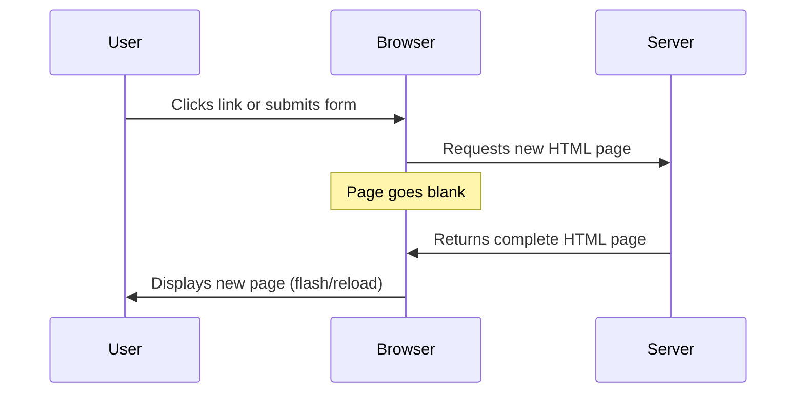
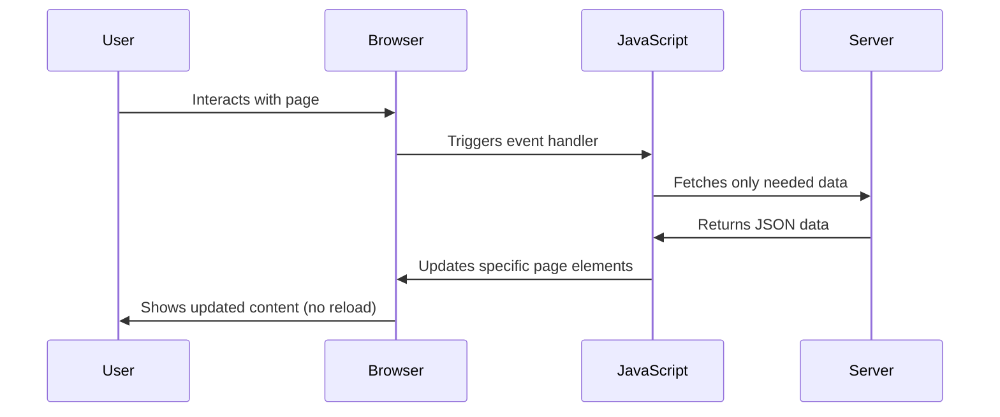
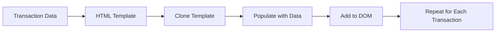

<!--
CO_OP_TRANSLATOR_METADATA:
{
  "original_hash": "2c1164912414820c8efd699b43f64954",
  "translation_date": "2025-10-24T20:20:49+00:00",
  "source_file": "7-bank-project/3-data/README.md",
  "language_code": "hu"
}
-->
# Banki Alkalmazás Készítése 3. rész: Adatok Lekérése és Használata

Gondolj a Star Trek Enterprise számítógépére - amikor Picard kapitány megkérdezi a hajó állapotát, az információ azonnal megjelenik anélkül, hogy az egész felület újratöltődne vagy újraépülne. Pontosan ezt a zökkenőmentes információáramlást építjük most dinamikus adatlekéréssel.

Jelenleg a banki alkalmazásod olyan, mint egy nyomtatott újság - informatív, de statikus. Átalakítjuk valami olyasmivé, mint a NASA irányítóközpontja, ahol az adatok folyamatosan áramlanak és valós időben frissülnek anélkül, hogy megszakítanák a felhasználó munkafolyamatát.

Megtanulod, hogyan kommunikálj aszinkron módon a szerverekkel, hogyan kezeld a különböző időpontokban érkező adatokat, és hogyan alakítsd át a nyers információkat a felhasználók számára érthető formába. Ez a különbség egy bemutató és egy éles szoftver között.

## Előadás előtti kvíz

[Előadás előtti kvíz](https://ff-quizzes.netlify.app/web/quiz/45)

### Előfeltételek

Mielőtt belevágnánk az adatok lekérésébe, győződj meg róla, hogy ezek az elemek készen állnak:

- **Előző lecke**: Fejezd be a [Bejelentkezési és regisztrációs űrlapot](../2-forms/README.md) - erre fogunk építeni
- **Helyi szerver**: Telepítsd a [Node.js-t](https://nodejs.org) és [indítsd el a szerver API-t](../api/README.md), hogy elérhető legyen a fiókadatokhoz
- **API kapcsolat**: Teszteld a szerverkapcsolatot ezzel a paranccsal:

```bash
curl http://localhost:5000/api
# Expected response: "Bank API v1.0.0"
```

Ez a gyors teszt biztosítja, hogy minden komponens megfelelően kommunikáljon:
- Ellenőrzi, hogy a Node.js helyesen fut-e a rendszereden
- Megerősíti, hogy az API szerver aktív és válaszol
- Validálja, hogy az alkalmazásod eléri-e a szervert (mint egy rádiókapcsolat ellenőrzése egy küldetés előtt)

---

## Az adatok lekérésének megértése a modern webalkalmazásokban

Az, ahogyan a webalkalmazások kezelik az adatokat, drámaian fejlődött az elmúlt két évtizedben. Ennek az evolúciónak a megértése segít abban, hogy értékelni tudd, miért olyan erőteljesek a modern technikák, mint az AJAX és a Fetch API, és miért váltak nélkülözhetetlen eszközökké a webfejlesztők számára.

Nézzük meg, hogyan működtek a hagyományos weboldalak a dinamikus, reszponzív alkalmazásokhoz képest, amelyeket ma építünk.

### Hagyományos többoldalas alkalmazások (MPA)

A web korai napjaiban minden kattintás olyan volt, mintha egy régi televízión csatornát váltanánk - a képernyő elsötétült, majd lassan megjelent az új tartalom. Ez volt a valóság a korai webalkalmazásoknál, ahol minden interakció az egész oldal teljes újraépítését jelentette.




**Miért érezte ezt az ember nehézkesnek:**
- Minden kattintás az egész oldal újraépítését jelentette
- A felhasználókat megszakították a zavaró oldalvillanások
- Az internetkapcsolat túlórázott, hogy újra és újra letöltse ugyanazt a fejlécet és láblécet
- Az alkalmazások inkább egy iratszekrény átlapozására hasonlítottak, mint egy szoftver használatára

### Modern egyoldalas alkalmazások (SPA)

Az AJAX (Asynchronous JavaScript and XML) teljesen megváltoztatta ezt a paradigmát. Mint az űrállomás moduláris kialakítása, ahol az űrhajósok egyes komponenseket kicserélhetnek anélkül, hogy az egész szerkezetet újra kellene építeni, az AJAX lehetővé teszi, hogy egy weboldal bizonyos részeit frissítsük anélkül, hogy mindent újratöltenénk. Bár a névben szerepel az XML, ma már leginkább JSON-t használunk, de az alapelv ugyanaz: csak azt frissítjük, amire szükség van.




**Miért jobbak az SPA-k:**
- Csak azok a részek frissülnek, amelyek valóban megváltoztak (okos, nem?)
- Nincsenek zavaró megszakítások - a felhasználók a saját ritmusukban maradnak
- Kevesebb adatot kell továbbítani, ami gyorsabb betöltést eredményez
- Minden gyors és reszponzív, mint a telefonos alkalmazások

### Az evolúció a modern Fetch API-ig

A modern böngészők biztosítják a [`Fetch` API-t](https://developer.mozilla.org/docs/Web/API/Fetch_API), amely felváltja a régebbi [`XMLHttpRequest`](https://developer.mozilla.org/docs/Web/API/XMLHttpRequest/Using_XMLHttpRequest) technológiát. Mint a távíró és az e-mail közötti különbség, a Fetch API ígéreteket használ a tisztább aszinkron kódhoz, és természetesen kezeli a JSON-t.

| Funkció | XMLHttpRequest | Fetch API |
|---------|----------------|-----------|
| **Szintaxis** | Bonyolult, visszahívás-alapú | Tiszta, ígéret-alapú |
| **JSON kezelés** | Manuális elemzés szükséges | Beépített `.json()` metódus |
| **Hibakezelés** | Korlátozott hibainformáció | Átfogó hibainformáció |
| **Modern támogatás** | Régi kompatibilitás | ES6+ ígéretek és async/await |

> 💡 **Böngésző kompatibilitás**: Jó hír - a Fetch API minden modern böngészőben működik! Ha kíváncsi vagy a konkrét verziókra, a [caniuse.com](https://caniuse.com/fetch) teljes kompatibilitási történetet nyújt.
> 
**A lényeg:**
- Kiválóan működik Chrome, Firefox, Safari és Edge böngészőkben (gyakorlatilag mindenhol, ahol a felhasználóid vannak)
- Csak az Internet Explorer igényel extra segítséget (és őszintén szólva, ideje elengedni az IE-t)
- Tökéletesen előkészíti az utat az elegáns async/await mintákhoz, amelyeket később használunk

### Felhasználói bejelentkezés és adatlekérés megvalósítása

Most valósítsuk meg azt a bejelentkezési rendszert, amely a banki alkalmazásodat egy statikus kijelzőből működőképes alkalmazássá alakítja. Mint a biztonságos katonai létesítményekben használt hitelesítési protokollok, ellenőrizzük a felhasználói hitelesítő adatokat, majd hozzáférést biztosítunk a saját adataikhoz.

Ezt lépésről lépésre építjük fel, kezdve az alapvető hitelesítéssel, majd hozzáadva az adatlekérési képességeket.

#### 1. lépés: A bejelentkezési funkció alapjainak létrehozása

Nyisd meg az `app.js` fájlt, és adj hozzá egy új `login` függvényt. Ez fogja kezelni a felhasználói hitelesítési folyamatot:

```javascript
async function login() {
  const loginForm = document.getElementById('loginForm');
  const user = loginForm.user.value;
}
```

**Részletezzük:**
- Az `async` kulcsszó azt jelzi a JavaScript számára, hogy "hé, ennek a függvénynek lehet, hogy várnia kell valamire"
- Megkeressük az űrlapot az oldalon (semmi bonyolult, csak az ID alapján)
- Ezután kinyerjük, amit a felhasználó beírt felhasználónévként
- Egy jó trükk: bármely űrlapmezőt elérheted a `name` attribútumán keresztül - nincs szükség extra getElementById hívásokra!

> 💡 **Űrlap elérési minta**: Minden űrlapvezérlő elérhető a `name` attribútumán keresztül (amelyet a HTML-ben állítasz be) az űrlapelem tulajdonságaként. Ez tiszta, olvasható módot biztosít az űrlapadatok elérésére.

#### 2. lépés: Hozz létre egy fiókadatok lekérési függvényt

Ezután hozz létre egy dedikált függvényt a fiókadatok szerverről történő lekérésére. Ez ugyanazt a mintát követi, mint a regisztrációs függvényed, de az adatok lekérésére összpontosít:

```javascript
async function getAccount(user) {
  try {
    const response = await fetch('//localhost:5000/api/accounts/' + encodeURIComponent(user));
    return await response.json();
  } catch (error) {
    return { error: error.message || 'Unknown error' };
  }
}
```

**Ez a kód a következőket végzi:**
- **Használja** a modern `fetch` API-t az adatok aszinkron lekérésére
- **Összeállít** egy GET kérés URL-t a felhasználónév paraméterrel
- **Alkalmazza** az `encodeURIComponent()`-et, hogy biztonságosan kezelje az URL-ek speciális karaktereit
- **Átalakítja** a választ JSON formátumba az egyszerű adatkezelés érdekében
- **Kezeli** a hibákat, hogy ne omoljon össze a program

> ⚠️ **Biztonsági megjegyzés**: Az `encodeURIComponent()` függvény kezeli az URL-ek speciális karaktereit. Mint a haditengerészeti kommunikációs kódolási rendszerek, biztosítja, hogy az üzenet pontosan érkezzen meg, és megakadályozza, hogy a karakterek, mint például a "#" vagy "&", félreértelmezésre kerüljenek.
> 
**Miért fontos ez:**
- Megakadályozza, hogy a speciális karakterek tönkretegyék az URL-eket
- Véd az URL-manipulációs támadások ellen
- Biztosítja, hogy a szerver a szándékolt adatokat kapja meg
- Biztonságos kódolási gyakorlatokat követ

#### HTTP GET kérések megértése

Talán meglepő lehet: amikor a `fetch`-et használod extra opciók nélkül, az automatikusan egy [`GET`](https://developer.mozilla.org/docs/Web/HTTP/Methods/GET) kérést hoz létre. Ez tökéletes arra, amit most csinálunk - megkérdezzük a szervert: "Hé, megnézhetem ennek a felhasználónak a fiókadatait?"

Folytatás...
Bonyolultabb tartalom esetén kombináld a [`document.createElement()`](https://developer.mozilla.org/docs/Web/API/Document/createElement) metódust az [`append()`](https://developer.mozilla.org/docs/Web/API/ParentNode/append) metódussal:

```javascript
// Safe way to create new elements
const transactionItem = document.createElement('div');
transactionItem.className = 'transaction-item';
transactionItem.textContent = `${transaction.date}: ${transaction.description}`;
container.append(transactionItem);
```

**Ennek a megközelítésnek a megértése:**
- **Programozottan létrehoz** új DOM elemeket
- **Teljes kontrollt biztosít** az elemek attribútumai és tartalma felett
- **Lehetővé teszi** összetett, egymásba ágyazott elemek struktúráját
- **Biztonságot nyújt**, mivel elválasztja a struktúrát a tartalomtól

> ⚠️ **Biztonsági megfontolás**: Bár az [`innerHTML`](https://developer.mozilla.org/docs/Web/API/Element/innerHTML) sok oktatóanyagban szerepel, képes beágyazott szkripteket futtatni. Akárcsak a CERN biztonsági protokolljai, amelyek megakadályozzák az illetéktelen kódvégrehajtást, a `textContent` és a `createElement` használata biztonságosabb alternatívát kínál.
> 
**Az innerHTML kockázatai:**
- Végrehajtja a felhasználói adatokban található `<script>` címkéket
- Sérülékeny a kódinjektálási támadásokkal szemben
- Potenciális biztonsági rést hoz létre
- Az általunk használt biztonságos alternatívák egyenértékű funkcionalitást biztosítanak

### Hibák felhasználóbaráttá tétele

Jelenleg a bejelentkezési hibák csak a böngésző konzoljában jelennek meg, ami a felhasználók számára láthatatlan. Akárcsak a pilóta belső diagnosztikája és az utasok információs rendszere közötti különbség, fontos információkat kell közvetítenünk a megfelelő csatornán keresztül.

A látható hibaüzenetek megvalósítása azonnali visszajelzést nyújt a felhasználóknak arról, hogy mi ment rosszul, és hogyan lehet tovább lépni.

#### 1. lépés: Hely a hibaüzeneteknek

Először adjunk helyet a hibaüzeneteknek a HTML-ben. Ezt a bejelentkezési gomb előtt helyezzük el, hogy a felhasználók természetesen észrevegyék:

```html
<!-- This is where error messages will appear -->
<div id="loginError" role="alert"></div>
<button>Login</button>
```

**Mi történik itt:**
- Létrehozunk egy üres tárolót, amely láthatatlan marad, amíg szükség nem lesz rá
- Olyan helyre helyezzük, ahol a felhasználók természetesen keresik a "Bejelentkezés" gomb megnyomása után
- A `role="alert"` egy szép kiegészítés a képernyőolvasók számára - ez azt mondja az akadálymentesítési technológiának, hogy "hé, ez fontos!"
- Az egyedi `id` megkönnyíti a JavaScript számára a célzást

#### 2. lépés: Készíts egy praktikus segédfunkciót

Hozzunk létre egy kis segédfunkciót, amely bármely elem szövegét frissíteni tudja. Ez egy olyan "egyszer megírod, mindenhol használod" típusú funkció, amely időt takarít meg:

```javascript
function updateElement(id, text) {
  const element = document.getElementById(id);
  element.textContent = text;
}
```

**A funkció előnyei:**
- Egyszerű interfész, amely csak egy elem ID-t és szövegtartalmat igényel
- Biztonságosan megtalálja és frissíti a DOM elemeket
- Újrahasználható minta, amely csökkenti a kódismétlést
- Egységes frissítési viselkedést biztosít az alkalmazásban

#### 3. lépés: Mutasd meg a hibákat, ahol a felhasználók látják őket

Most cseréljük ki a rejtett konzolüzenetet valamire, amit a felhasználók ténylegesen láthatnak. Frissítsd a bejelentkezési funkciót:

```javascript
// Instead of just logging to console, show the user what's wrong
if (data.error) {
  return updateElement('loginError', data.error);
}
```

**Ez a kis változtatás nagy különbséget jelent:**
- A hibaüzenetek ott jelennek meg, ahol a felhasználók keresik őket
- Nincs többé rejtélyes, csendes hiba
- A felhasználók azonnali, cselekvésre ösztönző visszajelzést kapnak
- Az alkalmazás professzionálisabbnak és átgondoltabbnak tűnik

Most, ha egy érvénytelen fiókkal tesztelsz, egy hasznos hibaüzenetet fogsz látni közvetlenül az oldalon!


#### 4. lépés: Legyél befogadó az akadálymentességgel

Van valami szuper dolog abban a korábban hozzáadott `role="alert"` attribútumban - ez nem csak díszítés! Ez a kis attribútum egy úgynevezett [Live Region](https://developer.mozilla.org/docs/Web/Accessibility/ARIA/ARIA_Live_Regions)-t hoz létre, amely azonnal bejelenti a változásokat a képernyőolvasóknak:

```html
<div id="loginError" role="alert"></div>
```

**Miért fontos ez:**
- A képernyőolvasó felhasználók azonnal hallják a hibaüzenetet, amint megjelenik
- Mindenki ugyanazt a fontos információt kapja, függetlenül attól, hogyan navigál
- Egyszerű módja annak, hogy az alkalmazás több ember számára működjön
- Megmutatja, hogy törődsz az inkluzív élmények megteremtésével

Az ilyen apró részletek különböztetik meg a jó fejlesztőket a kiválóaktól!

#### 5. lépés: Alkalmazd ugyanazt a mintát a regisztrációra

A konzisztencia érdekében valósítsd meg azonos hibaüzenet-kezelést a regisztrációs űrlapban:

1. **Adj hozzá** egy hibaüzenet megjelenítő elemet a regisztrációs HTML-hez:
```html
<div id="registerError" role="alert"></div>
```

2. **Frissítsd** a regisztrációs funkciót, hogy ugyanazt a hibaüzenet-megjelenítési mintát használja:
```javascript
if (data.error) {
  return updateElement('registerError', data.error);
}
```

**A konzisztens hibaüzenet-kezelés előnyei:**
- **Egységes** felhasználói élményt biztosít minden űrlapon
- **Csökkenti** a kognitív terhelést az ismerős minták használatával
- **Egyszerűsíti** a karbantartást az újrahasználható kóddal
- **Biztosítja** az akadálymentességi szabványok betartását az alkalmazás egészében

## Dinamikus irányítópult létrehozása

Most átalakítjuk a statikus irányítópultodat egy dinamikus felületté, amely valós fiókadatokat jelenít meg. Akárcsak a nyomtatott repülési menetrend és a repülőterek élő indulási táblái közötti különbség, statikus információról valós idejű, reagáló megjelenítésre váltunk.

A megtanult DOM manipulációs technikák segítségével olyan irányítópultot hozunk létre, amely automatikusan frissül az aktuális fiókadatokkal.

### Ismerkedés az adatokkal

Mielőtt elkezdenénk építeni, nézzük meg, milyen adatokat küld vissza a szerver. Amikor valaki sikeresen bejelentkezik, itt van az információk kincsesbányája, amivel dolgozhatsz:

```json
{
  "user": "test",
  "currency": "$",
  "description": "Test account",
  "balance": 75,
  "transactions": [
    { "id": "1", "date": "2020-10-01", "object": "Pocket money", "amount": 50 },
    { "id": "2", "date": "2020-10-03", "object": "Book", "amount": -10 },
    { "id": "3", "date": "2020-10-04", "object": "Sandwich", "amount": -5 }
  ]
}
```

**Ez az adatstruktúra biztosítja:**
- **`user`**: Tökéletes a személyre szabott élményhez ("Üdv újra, Sarah!")
- **`currency`**: Biztosítja, hogy a pénzösszegeket helyesen jelenítsük meg
- **`description`**: Egy barátságos név a fiókhoz
- **`balance`**: A legfontosabb aktuális egyenleg
- **`transactions`**: A teljes tranzakciós előzmény minden részletével

Minden, amire szükséged van egy professzionális megjelenésű banki irányítópult létrehozásához!

> 💡 **Profi tipp**: Szeretnéd az irányítópultodat azonnal működés közben látni? Használd a `test` felhasználónevet bejelentkezéskor - előre feltöltött mintaadatokkal érkezik, így mindent láthatsz működés közben anélkül, hogy először tranzakciókat kellene létrehoznod.
> 
**Miért hasznos a tesztfiók:**
- Már előre feltöltött valósághű mintaadatokkal érkezik
- Tökéletes a tranzakciók megjelenítésének megtekintéséhez
- Nagyszerű az irányítópult funkcióinak teszteléséhez
- Megkímél attól, hogy manuálisan kelljen tesztadatokat létrehozni

### Az irányítópult megjelenítő elemeinek létrehozása

Lépésről lépésre építsük fel az irányítópult felületét, kezdve a fiók összefoglaló információival, majd haladjunk tovább az összetettebb funkciók, például a tranzakciós listák felé.

#### 1. lépés: Frissítsd a HTML struktúrát

Először cseréld le a statikus "Egyenleg" szekciót dinamikus helyőrző elemekre, amelyeket a JavaScript tölthet ki:

```html
<section>
  Balance: <span id="balance"></span><span id="currency"></span>
</section>
```

Ezután adj hozzá egy szekciót a fiók leírásához. Mivel ez a tartalom címeként működik az irányítópulton, használj szemantikus HTML-t:

```html
<h2 id="description"></h2>
```

**A HTML struktúra megértése:**
- **Különálló** `<span>` elemeket használ az egyenleg és a pénznem egyedi kezeléséhez
- **Egyedi ID-ket** alkalmaz minden elemhez a JavaScript célzásához
- **Szemantikus HTML-t** követve `<h2>`-t használ a fiók leírásához
- **Logikus hierarchiát** hoz létre a képernyőolvasók és SEO számára

> ✅ **Akadálymentességi betekintés**: A fiók leírása a tartalom címeként működik az irányítópulton, ezért szemantikusan fejlécként van megjelölve. Tudj meg többet arról, hogy a [fejlécstruktúra](https://www.nomensa.com/blog/2017/how-structure-headings-web-accessibility) hogyan befolyásolja az akadálymentességet. Felismered az oldalad más elemeit, amelyek hasznosak lehetnek fejléc címkék használatával?

#### 2. lépés: Hozd létre az irányítópult frissítő funkcióját

Most hozz létre egy funkciót, amely valódi fiókadatokkal tölti fel az irányítópultot:

```javascript
function updateDashboard() {
  if (!account) {
    return navigate('/login');
  }

  updateElement('description', account.description);
  updateElement('balance', account.balance.toFixed(2));
  updateElement('currency', account.currency);
}
```

**Lépésről lépésre, mit csinál ez a funkció:**
- **Ellenőrzi**, hogy léteznek-e fiókadatok, mielőtt folytatná
- **Átirányítja** a hitelesítetlen felhasználókat a bejelentkezési oldalra
- **Frissíti** a fiók leírását az újrahasználható `updateElement` funkcióval
- **Formázza** az egyenleget, hogy mindig két tizedesjegyet mutasson
- **Megjeleníti** a megfelelő pénznem szimbólumot

> 💰 **Pénzformázás**: Az [`toFixed(2)`](https://developer.mozilla.org/docs/Web/JavaScript/Reference/Global_Objects/Number/toFixed) metódus életmentő! Biztosítja, hogy az egyenleg mindig valódi pénznek tűnjön - "75.00" a "75" helyett. A felhasználók értékelni fogják a megszokott pénznem formázást.

#### 3. lépés: Biztosítsd, hogy az irányítópult frissüljön

Annak érdekében, hogy az irányítópult minden alkalommal frissüljön, amikor valaki meglátogatja, be kell építenünk a navigációs rendszeredbe. Ha befejezted az [1. lecke feladatát](../1-template-route/assignment.md), ez ismerős lesz. Ha nem, ne aggódj - itt van, amire szükséged van:

Add hozzá ezt az `updateRoute()` funkció végéhez:

```javascript
if (typeof route.init === 'function') {
  route.init();
}
```

Ezután frissítsd az útvonalakat, hogy tartalmazzák az irányítópult inicializálását:

```javascript
const routes = {
  '/login': { templateId: 'login' },
  '/dashboard': { templateId: 'dashboard', init: updateDashboard }
};
```

**Mit csinál ez az okos beállítás:**
- Ellenőrzi, hogy egy útvonalnak van-e speciális inicializáló kódja
- Automatikusan futtatja azt a kódot, amikor az útvonal betöltődik
- Biztosítja, hogy az irányítópult mindig friss, aktuális adatokat mutasson
- Tisztán és szervezetten tartja az útvonalkezelési logikát

#### Az irányítópult tesztelése

A változtatások bevezetése után teszteld az irányítópultot:

1. **Jelentkezz be** egy tesztfiókkal
2. **Ellenőrizd**, hogy átirányítanak az irányítópultra
3. **Győződj meg róla**, hogy a fiók leírása, egyenlege és pénzneme helyesen jelenik meg
4. **Próbálj meg kijelentkezni és újra bejelentkezni**, hogy megbizonyosodj az adatok megfelelő frissítéséről

Az irányítópultnak most dinamikus fiókadatokat kell megjelenítenie, amelyek a bejelentkezett felhasználó adatai alapján frissülnek!

## Okos tranzakciós listák létrehozása sablonokkal

Ahelyett, hogy manuálisan hoznánk létre HTML-t minden tranzakcióhoz, sablonokat fogunk használni, hogy automatikusan biztosítsuk az egységes formázást. Akárcsak az űrhajógyártásban használt szabványosított alkatrészek, a sablonok biztosítják, hogy minden tranzakciós sor ugyanazt a struktúrát és megjelenést kövesse.

Ez a technika hatékonyan skálázódik néhány tranzakciótól több ezerig, miközben fenntartja a következetes teljesítményt és megjelenést.



### 1. lépés: Hozd létre a tranzakciós sablont

Először adj hozzá egy újrahasználható sablont a tranzakciós sorokhoz a HTML `<body>` részében:

```html
<template id="transaction">
  <tr>
    <td></td>
    <td></td>
    <td></td>
  </tr>
</template>
```

**A HTML sablonok megértése:**
- **Meghatározza** egyetlen táblázatsor struktúráját
- **Láthatatlan** marad, amíg JavaScript segítségével klónozzák és kitöltik
- **Három cellát** tartalmaz dátum, leírás és összeg számára
- **Újrahasználható mintát** biztosít az egységes formázáshoz

### 2. lépés: Készítsd elő a táblázatot dinamikus tartalomhoz

Ezután adj egy `id`-t a táblázat törzséhez, hogy a JavaScript könnyen célozhassa:

```html
<tbody id="transactions"></tbody>
```

**Mit ér el ez:**
- **Egyértelmű célt** hoz létre a tranzakciós sorok beszúrásához
- **Elválasztja** a táblázat struktúráját a dinamikus tartalomtól
- **Lehetővé teszi** a tranzakciós adatok egyszerű törlését és újrapopulálását

### 3. lépés: Építsd meg a tranzakciós sor gyártó funkciót

Most hozz létre egy funkciót, amely a tranzakciós adatokat HTML elemekké alakítja:

```javascript
function createTransactionRow(transaction) {
  const template = document.getElementById('transaction');
  const transactionRow = template.content.cloneNode(true);
  const tr = transactionRow.querySelector('tr');
  tr.children[0].textContent = transaction.date;
  tr.children[1].textContent = transaction.object;
  tr.children[2].textContent = transaction.amount.toFixed(2);
  return transactionRow;
}
```

**A gyártó funkció lebontása:**
- **Lekéri** a sablonelemet az ID alapján
-
**Prompt:** Hozzon létre keresési funkciót a banki alkalmazáshoz, amely tartalmazza: 1) Egy keresési űrlapot dátumtartomány (kezdő/vég), minimum/maximum összeg és tranzakció leírás kulcsszavak mezőkkel, 2) Egy `filterTransactions()` függvényt, amely az account.transactions tömböt szűri a keresési kritériumok alapján, 3) Frissítse az `updateDashboard()` függvényt, hogy a szűrt eredményeket jelenítse meg, és 4) Adjon hozzá egy "Szűrők törlése" gombot a nézet visszaállításához. Használjon modern JavaScript tömbmetódusokat, mint például a `filter()`, és kezelje az üres keresési kritériumokkal kapcsolatos szélsőséges eseteket.

Tudjon meg többet az [agent mode](https://code.visualstudio.com/blogs/2025/02/24/introducing-copilot-agent-mode) funkcióról itt.

## 🚀 Kihívás

Készen áll arra, hogy a banki alkalmazását a következő szintre emelje? Tegyük olyanná, amit valóban szívesen használna. Íme néhány ötlet, hogy inspirálódjon:

**Tegye gyönyörűvé**: Adjon hozzá CSS-stílusokat, hogy az egyszerű műszerfalat vizuálisan vonzóvá alakítsa. Gondoljon tiszta vonalakra, jó térközökre, és talán néhány finom animációra is.

**Tegye reszponzívvá**: Próbálja ki a [media queries](https://developer.mozilla.org/docs/Web/CSS/Media_Queries) használatát, hogy [reszponzív dizájnt](https://developer.mozilla.org/docs/Web/Progressive_web_apps/Responsive/responsive_design_building_blocks) hozzon létre, amely telefonokon, táblagépeken és asztali gépeken is remekül működik. A felhasználói hálásak lesznek érte!

**Adjon hozzá némi stílust**: Fontolja meg a tranzakciók színkódolását (zöld a bevételekhez, piros a kiadásokhoz), ikonok hozzáadását, vagy olyan hover-effekteket, amelyek interaktívvá teszik a felületet.

Így nézhet ki egy kifinomult műszerfal:


Nem kell pontosan ezt követnie - használja inspirációként, és alakítsa saját ízlése szerint!

## Előadás utáni kvíz

[Előadás utáni kvíz](https://ff-quizzes.netlify.app/web/quiz/46)

## Feladat

[Refaktorálja és kommentálja a kódját](assignment.md)

---

**Felelősség kizárása**:  
Ez a dokumentum az AI fordítási szolgáltatás [Co-op Translator](https://github.com/Azure/co-op-translator) segítségével lett lefordítva. Bár törekszünk a pontosságra, kérjük, vegye figyelembe, hogy az automatikus fordítások hibákat vagy pontatlanságokat tartalmazhatnak. Az eredeti dokumentum az eredeti nyelvén tekintendő hiteles forrásnak. Fontos információk esetén javasolt professzionális emberi fordítást igénybe venni. Nem vállalunk felelősséget semmilyen félreértésért vagy téves értelmezésért, amely a fordítás használatából eredhet.