<!--
CO_OP_TRANSLATOR_METADATA:
{
  "original_hash": "86ee5069f27ea3151389d8687c95fac9",
  "translation_date": "2026-01-07T02:58:24+00:00",
  "source_file": "7-bank-project/3-data/README.md",
  "language_code": "hu"
}
-->
# Banki alkalmazás készítése 3. rész: Az adatok lekérésének és használatának módszerei

Gondolj az Enterprise számítógépére a Star Trekből – amikor Picard kapitány megkéri az állapotjelentést, az információ azonnal megjelenik anélkül, hogy az egész felület leállna és újraépülne. Pont ezt a zökkenőmentes adatáramlást építjük most dinamikus adatlekéréssel.

Most a banki alkalmazásod olyan, mint egy nyomtatott újság – információgazdag, de statikus. Átalakítjuk olyanná, mint a NASA parancsnoki központja, ahol az adatok folyamatosan, valós időben frissülnek anélkül, hogy megzavarnák a felhasználó munkafolyamatát.

Megtanulod, hogyan kommunikálj aszinkron módon a szerverrel, kezelni az eltérő időben érkező adatokat, és hogyan alakítsd át a nyers információt valami értékessé a felhasználók számára. Ez a különbség a demó és a gyártásra kész szoftver között.

## ⚡ Amit a következő 5 percben megtehetsz

**Gyors indítás elfoglalt fejlesztőknek**

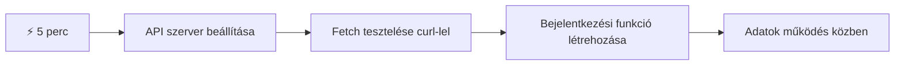
- **1-2. perc**: Indítsd el az API szervert (`cd api && npm start`), és teszteld a kapcsolatot
- **3. perc**: Hozz létre egy alap `getAccount()` függvényt fetch használatával
- **4. perc**: Kapcsold össze a bejelentkező űrlapot az `action="javascript:login()"` attribútummal
- **5. perc**: Teszteld a bejelentkezést, és figyeld meg, ahogy a fiókadatok megjelennek a konzolon

**Gyors teszt parancsok**:
```bash
# Ellenőrizze, hogy az API fut-e
curl http://localhost:5000/api

# Tesztelje a fiókadatok lekérését
curl http://localhost:5000/api/accounts/test
```

**Miért fontos ez?** 5 perc alatt megtapasztalod az aszinkron adatlekérés varázsát, amely a modern webalkalmazások motorja. Ez az alapja annak, hogy az appok reszponzívnak és élőnek érezzék magukat.

## 🗺️ Tanulási utad adatvezérelt webalkalmazásokkal

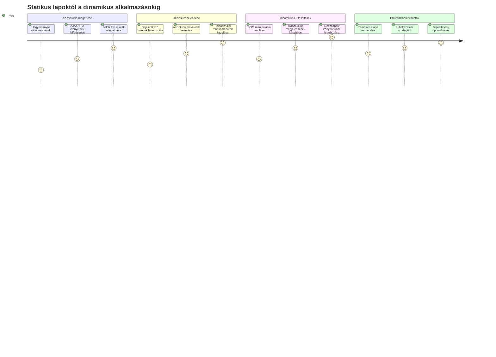
**Utazásod célja**: A lecke végére megérted, hogyan kérnek le, dolgoznak fel és jelenítenek meg adatokat a modern webalkalmazások dinamikusan, létrehozva az általunk elvárt zökkenőmentes felhasználói élményeket.

## Előzetes kvíz

[Előadó előtti kvíz](https://ff-quizzes.netlify.app/web/quiz/45)

### Előfeltételek

Mielőtt belevágnál az adatlekérésbe, győződj meg róla, hogy ezek az összetevők készen állnak:

- **Előző lecke**: Készítsd el a [Bejelentkező és regisztrációs űrlapot](../2-forms/README.md) – erre építünk majd tovább
- **Helyi szerver**: Telepítsd a [Node.js-t](https://nodejs.org) és [indítsd el az API szervert](../api/README.md), hogy szolgáltassa a fiókadatokat
- **API kapcsolat**: Teszteld a szerver kapcsolatot ezzel a paranccsal:

```bash
curl http://localhost:5000/api
# Várt válasz: "Bank API v1.0.0"
```

Ez a gyors teszt biztosítja a kommunikációt:
- Ellenőrzi, hogy a Node.js helyesen fut a gépeden
- Megerősíti, hogy az API szerver aktív és válaszol
- Érvényesíti, hogy az app eléri a szervert (mint rádiókapcsolat ellenőrzése a küldetés előtt)

## 🧠 Adatkezelési rendszer áttekintése

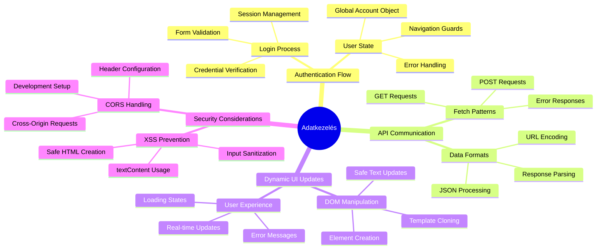
**Alapelvek**: A modern webalkalmazások adat-orchestrációs rendszerek – koordinálják a felhasználói felületet, a szerver API-kat és a böngésző biztonsági modelljét, hogy zökkenőmentes, reszponzív élményeket alkossanak.

---

## Az adatlekérés megértése a modern webalkalmazásokban

Az elmúlt két évtizedben drámaian fejlődött, ahogyan a webalkalmazások kezelik az adatokat. Az evolúció megértése segít értékelni, miért olyan erőteljesek a mai AJAX és Fetch API technikák, és miért váltak elengedhetetlen eszközökké a fejlesztők számára.

Vizsgáljuk meg, hogyan működtek a hagyományos weboldalak a mai dinamikus, reszponzív alkalmazásokhoz képest.

### Hagyományos, sokoldalas alkalmazások (MPA)

A web korai napjaiban minden kattintás olyan volt, mint a tévécsatorna váltás – a képernyő elsötétült, majd lassan töltődött be az új tartalom. Ez volt a korai webalkalmazások valósága, ahol minden interakció az egész oldal teljes újraépítését jelentette.

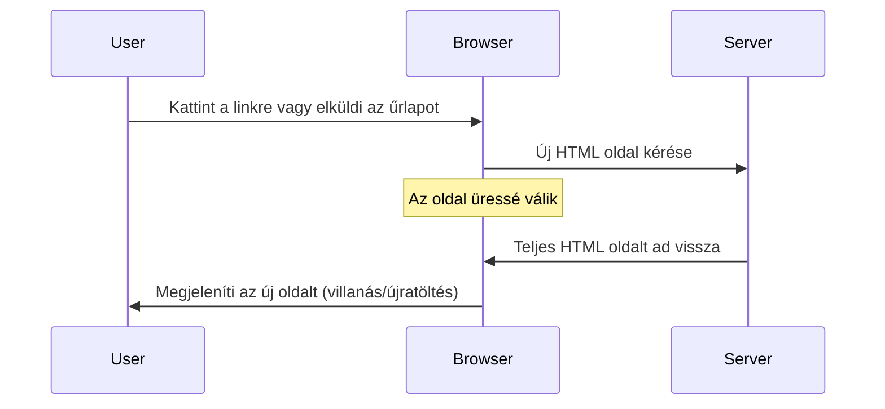
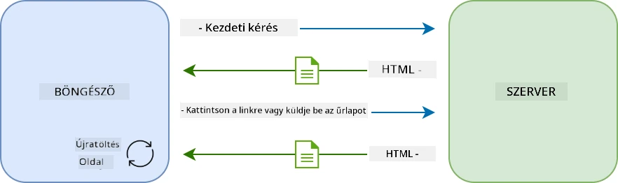

**Miért volt kényelmetlen ez az eljárás:**
- Minden kattintás az egész oldal újraépítését jelentette
- A felhasználók közbeszakadtak a gondolataikban a zavaró oldal-frissítések miatt
- A netkapcsolat túlórázott, mert folyton letöltötte ugyanazt a fejlécet és láblécet
- Az appok inkább fájlszekrények között való kattintgatáshoz hasonlítottak, mint szoftverhasználathoz

### Modern egylapos alkalmazások (SPA)

Az AJAX (Asynchronous JavaScript and XML) teljesen megváltoztatta ezt a paradigmát. Olyan, mint a Nemzetközi Űrállomás moduláris felépítése, ahol az asztronauták tudják cserélni az egyes részegységeket anélkül, hogy az egészet újraépítenék – az AJAX lehetővé teszi, hogy egy weboldal adott részeit frissítsük újratöltés nélkül. Az elnevezés XML-t említ, de ma főként JSON-t használunk, a lényeg az, hogy csak azt frissítjük, ami változott.

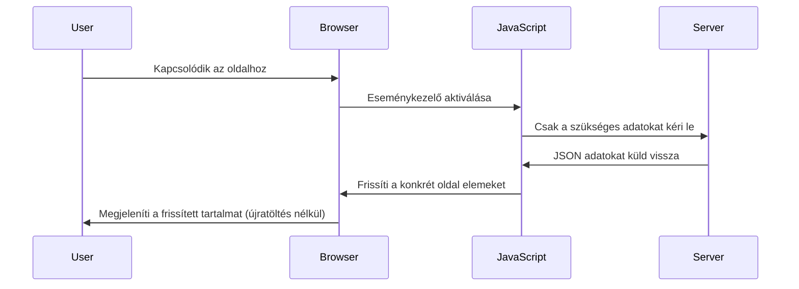
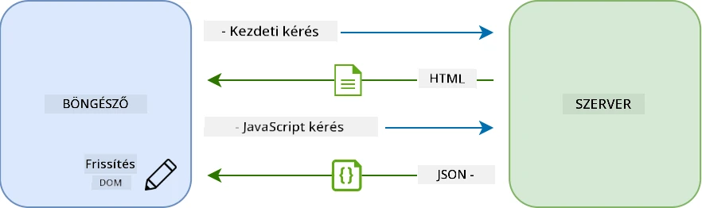

**Miért jobb az SPA:**
- Csak a ténylegesen változott részek frissülnek (okosan, ugye?)
- Nincs több menet közbeni megszakítás – a felhasználók áramlásban maradnak
- Kevesebb adat utazik, gyorsabb a betöltés
- Minden gyors és reszponzív érzésű, mint a telefonodon futó appok

### Az áttérés a modern Fetch API-ra

A modern böngészők biztosítják a [`Fetch` API-t](https://developer.mozilla.org/docs/Web/API/Fetch_API), amely leváltotta a régebbi [`XMLHttpRequest`](https://developer.mozilla.org/docs/Web/API/XMLHttpRequest/Using_XMLHttpRequest) megoldást. Mint a távíró és az email különbsége, a Fetch ígéreteket használ a tisztább aszinkron kódért, és natívan kezeli a JSON-t.

| Tulajdonság | XMLHttpRequest | Fetch API |
|-------------|----------------|-----------|
| **Szintaxis** | Bonyolult callback alapú | Tiszta promise alapú |
| **JSON kezelés** | Kézi feldolgozás szükséges | Beépített `.json()` metódus |
| **Hiba kezelés** | Korlátozott hibainformáció | Részletes hibakezelés |
| **Modern támogatás** | Legacy kompatibilitás | ES6+ ígéretek és async/await |

> 💡 **Böngésző kompatibilitás**: Jó hír – a Fetch API működik minden modern böngészőben! Ha kíváncsi vagy adott verziókra, [caniuse.com](https://caniuse.com/fetch) teljes kompatibilitási táblázatot nyújt.
>  
**Összefoglalva:**
- Jól működik Chrome-ban, Firefox-ban, Safari-ban és Edge-ben (ahol a felhasználóid is vannak)
- Csak az Internet Explorer igényel plusz támogatást (Őszintén, ideje elengedni az IE-t)
- Tökéletes alapot ad az elegáns async/await mintákhoz, amiket még látni fogunk

### Felhasználói bejelentkezés és adatlekérés megvalósítása

Most valósítsuk meg a bejelentkező rendszert, amely a statikus megjelenítésből funkcionális alkalmazást varázsol. Mint a biztonságos katonai létesítmények hitelesítési protokolljai, ellenőrizzük a felhasználó adatait, majd hozzáférést adunk a személyes fiókadataihoz.

Fokozatosan építjük fel: először a hitelesítés, aztán az adatlekérés funkciókat.

#### 1. lépés: A bejelentkező függvény alapja

Nyisd meg az `app.js` fájlodat, és adj hozzá egy új `login` függvényt, amely kezeli a felhasználó hitelesítését:

```javascript
async function login() {
  const loginForm = document.getElementById('loginForm');
  const user = loginForm.user.value;
}
```

**Íme a bontás:**
- Az `async` kulcsszó azt jelzi a JavaScriptnek, hogy várakoznia kellhet
- Kikeressük az űrlapot az oldalon (semmi extra, csak az ID alapján)
- Kiolvassuk a felhasználónév értékét
- Egy praktikus trükk: bármely űrlapelemhez hozzáférhetsz a `name` attribútumán keresztül – nem kell plusz getElementById hívás!

> 💡 **Űrlap elérési minta**: Minden űrlapvezérlőhöz hozzáférsz a `name` attribútum alapján, az űrlap elem tulajdonságaként. Ez átlátható, tiszta mód az adatkinyeréshez.

#### 2. lépés: Az adatlekérő függvény létrehozása

Készítsünk egy külön függvényt a fiókadatok szerverről való lekérésére. Ez hasonló a regisztrációs funkcióhoz, de most az adatokat kérjük le:

```javascript
async function getAccount(user) {
  try {
    const response = await fetch('//localhost:5000/api/accounts/' + encodeURIComponent(user));
    return await response.json();
  } catch (error) {
    return { error: error.message || 'Unknown error' };
  }
}
```

**Mit csinál ez a kód:**
- **Használ** modernebb `fetch` API-t az aszinkron adatlekéréshez
- **Összerak** egy GET kérést a felhasználónév paraméterével
- **Használja** az `encodeURIComponent()`-ot az URL speciális karaktereinek biztonságos kezelésére
- **Átalakítja** a választ JSON formátummá az egyszerű adatkezelés miatt
- **Kezeletlenül kezeli** a hibákat, hibaobjektummal tér vissza, nem omlik össze

> ⚠️ **Biztonsági megjegyzés**: Az `encodeURIComponent()` védi az URL-ben szereplő speciális karaktereket. Mint egy haditengerészeti kódolási rendszer, megakadályozza, hogy a `#` vagy `&` karakterek rossz értelmezést kapjanak.
>  
**Miért fontos:**
- Megakadályozza, hogy speciális karakterek tönkretegyék az URL-t
- Védekezik az URL manipulációs támadások ellen
- Biztosítja, hogy a szerver pontosan megkapja az adatot
- Követi a biztonságos kódolási gyakorlatokat

#### HTTP GET kérések megértése

Valami, ami talán meglep: ha fetch-t használunk opciók nélkül, automatikusan egy [`GET`](https://developer.mozilla.org/docs/Web/HTTP/Methods/GET) kérést készít. Ez tökéletes arra, hogy megkérjük a szervert: „Mutasd a felhasználó fiókadatait!”

Gondolj a GET-re úgy, mintha udvariasan kölcsönkérnél egy könyvet a könyvtárból – már létező adatot kérsz. A POST (amit a regisztrációhoz használtunk) inkább új könyv beadásához hasonlít.

| GET kérés | POST kérés |
|-----------|------------|
| **Cél** | Meglévő adat lekérése | Új adat elküldése a szerverre |
| **Paraméterek** | URL-ben/kérdésben | Kérés törzsében |
| **Gyorsítótár** | Böngésző gyorsítótárazhatja | Általában nem gyorsítótárazott |
| **Biztonság** | Látható az URL-ben/naplókban | El van rejtve a kérés törzsében |

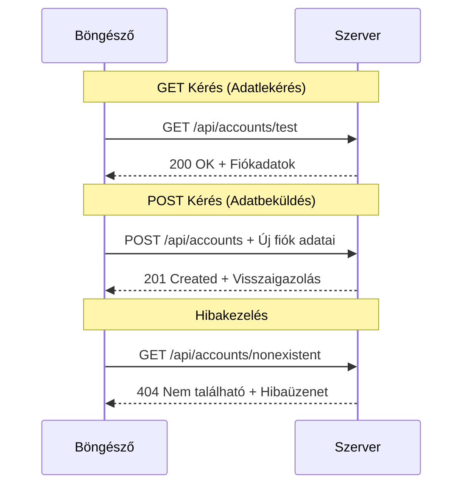
#### 3. lépés: Összekapcsolás

Most jön a lényeg: csatlakoztassuk a fiókadat lekérő függvényt a bejelentkezéshez. Itt áll össze minden:

```javascript
async function login() {
  const loginForm = document.getElementById('loginForm');
  const user = loginForm.user.value;
  const data = await getAccount(user);

  if (data.error) {
    return console.log('loginError', data.error);
  }

  account = data;
  navigate('/dashboard');
}
```

Ez a függvény világos sorrendet követ:
- Kimenti a felhasználónevet az űrlapról
- Lekéri a fiókadatokat a szerverről
- Kezeli az esetleges hibákat
- Siker esetén eltárolja az adatokat és a műszerfalra navigál

> 🎯 **Async/Await minta**: Mivel `getAccount` aszinkron, használjuk az `await` kulcsszót, hogy várjon a válaszra, így ne folytassa a kódot nem definiált adatokkal.

#### 4. lépés: Hol tároljuk az adatokat?

Az appnak kell valami „rövid távú memóriája”, ahol megtartja a beolvasott adatokat. Ezt helyezd az `app.js` tetejére:

```javascript
// Ez tárolja az aktuális felhasználó fiókadatait
let account = null;
```

**Miért van erre szükség:**
- Mindenhol hozzáférhetővé teszi az aktuális adatokat
- Kezdőérték `null`, ami azt jelenti: „még senki nincs bejelentkezve”
- Frissítve lesz bejelentkezés vagy regisztráció után
- Központi forrásként szolgál – egyértelmű, ki van bejelentkezve

#### 5. lépés: Kapcsold be az űrlapot

Most kösd össze az űrlapot az új login függvénnyel. Módosítsd az űrlap címkéjét:

```html
<form id="loginForm" action="javascript:login()">
  <!-- Your existing form inputs -->
</form>
```

**Mit tesz ez a kis módosítás:**
- Meggátolja az űrlapot abban, hogy újratöltse az egész oldalt
- Ezzel helyette a saját JavaScript függvényedet hívja meg
- Minden simán, egylapos-alkalmazásszerűen történik
- Teljes kontrollt ad, mi történjen a bejelentkezéskor

#### 6. lépés: Regisztrációs funkció bővítése

Az egységesség kedvéért frissítsd a `register` függvényt is, hogy eltárolja az adatokat és a műszerfalra navigáljon:

```javascript
// Add hozzá ezeket a sorokat a register függvényed végéhez
account = result;
navigate('/dashboard');
```

**Ez a bővítés biztosítja:**
- **Zökkenőmentes** átmenet regisztráció után a műszerfalra
- **Egységes** felhasználói élmény bejelentkezés és regisztráció között
- **Azonnali** hozzáférést a fiókadatokhoz sikeres regisztráció után

#### Teszteld az implementációt

```mermaid
flowchart TD
    A[Felhasználó megadja a hitelesítő adatokat] --> B[Bejelentkező függvény hívása]
    B --> C[Fiókadatok lekérése a szerverről]
    C --> D{Az adatok sikeresen megérkeztek?}
    D -->|Igen| E[Fiókadatok globális tárolása]
    D -->|Nem| F[Hibaüzenet megjelenítése]
    E --> G[Átnavigálás a műszerfalra]
    F --> H[Felhasználó a bejelentkező oldalon marad]
```
**Itt az idő kipróbálni:**
1. Hozz létre új fiókot, hogy megbizonyosodj a működésről
2. Jelentkezz be ezekkel az adatokkal
3. Nézd meg a böngésző konzolt (F12), ha valami nem stimmel
4. Ellenőrizd, hogy a sikeres bejelentkezés után a műszerfalra kerülsz-e

Ha valami nem működik, ne ess pánikba! A legtöbb hibát elírás vagy az API szerver el nem indítása okozza.

#### Egy gyors szó a cross-origin varázslatról

Lehet, hogy érdekel: "Hogy beszél a webalkalmazásom a másik porton futó API szerverrel?" Ez egy általános kérdés, ami minden webfejlesztőt előbb-utóbb foglalkoztat.

> 🔒 **Cross-Origin biztonság**: A böngészők “same-origin policy”-t alkalmaznak, hogy megelőzzék a jogosulatlan kommunikációt. Mint a Pentagon ellenőrző pontja, letesztelik, hogy engedélyezett-e az adatátvitel.
>  
**A mi esetünkben:**
- A webappod a `localhost:3000` címen fut (fejlesztői szerver)
- Az API szerver a `localhost:5000` címen fut (backend)
- Az API szerver CORS fejléceket alkalmaz, melyek engedélyezik a kommunikációt a webalkalmazásodtól

Ez tükrözi a valós fejlesztői környezetet, ahol front- és backend külön szervereken fut.

> 📚 **További tanulás**: Mélyedj el az API-k és adatlekérés témakörében a [Microsoft Learn részletes moduljában API-król](https://docs.microsoft.com/learn/modules/use-apis-discover-museum-art/?WT.mc_id=academic-77807-sagibbon).

## Az adatok életre keltése HTML-ben

Most megjelenítjük a lekért adatokat a felhasználóknak a DOM manipuláció segítségével. Olyan, mintha a fényképeket kidolgoznánk a sötétkamrában – az eddig láthatatlan adatokat valami láthatóvá és használhatóvá alakítjuk.
A DOM manipuláció az a technika, amely statikus weboldalakat dinamikus alkalmazásokká alakít, amelyek a felhasználói interakciók és a szerver válaszai alapján frissítik tartalmukat.

### A megfelelő eszköz kiválasztása a feladathoz

Amikor a HTML-edet JavaScript-tel szeretnéd frissíteni, több lehetőséged van. Gondolj ezekre úgy, mint egy szerszámosládában lévő különféle szerszámokra – mindegyik tökéletes bizonyos feladatokhoz:

| Módszer | Mire jó | Mikor használd | Biztonsági szint |
|---------|---------|----------------|------------------|
| `textContent` | Felhasználói adatok biztonságos megjelenítése | Bármikor, amikor szöveget jelenítesz meg | ✅ Sziklaszilárd |
| `createElement()` + `append()` | Összetett elrendezések építése | Új szekciók/listák létrehozásához | ✅ Több sebből vérzik |
| `innerHTML` | HTML tartalom beállítása | ⚠️ Próbáld meg kerülni | ❌ Kockázatos |

#### Szöveg biztonságos megjelenítése: textContent

A [`textContent`](https://developer.mozilla.org/docs/Web/API/Node/textContent) tulajdonság a legjobb barátod, amikor felhasználói adatokat szeretnél megjeleníteni. Olyan, mint egy kidobó az oldaladon – semmi káros nem jut át:

```javascript
// A szöveg biztonságos, megbízható frissítési módja
const balanceElement = document.getElementById('balance');
balanceElement.textContent = account.balance;
```

**A textContent előnyei:**
- Minden elemet egyszerű szövegként kezel (megakadályozza a szkriptek futtatását)
- Automatikusan törli a meglévő tartalmat
- Hatékony egyszerű szövegfrissítéshez
- Beépített védelem a rosszindulatú tartalom ellen

#### Dinamikus HTML elemek létrehozása

Összetettebb tartalomhoz kombináld a [`document.createElement()`](https://developer.mozilla.org/docs/Web/API/Document/createElement) metódust az [`append()`](https://developer.mozilla.org/docs/Web/API/ParentNode/append) módszerrel:

```javascript
// Biztonságos módja új elemek létrehozásának
const transactionItem = document.createElement('div');
transactionItem.className = 'transaction-item';
transactionItem.textContent = `${transaction.date}: ${transaction.description}`;
container.append(transactionItem);
```

**Az eljárás megértése:**
- **Új** DOM elemeket hoz létre programozottan
- **Teljes** kontrollt biztosít az elem attribútumai és tartalma felett
- **Lehetővé** teszi összetett, egymásba ágyazott elemszerkezetek létrehozását
- **Megőrzi** a biztonságot azáltal, hogy szétválasztja a szerkezetet a tartalomtól

> ⚠️ **Biztonsági megfontolás**: Bár az [`innerHTML`](https://developer.mozilla.org/docs/Web/API/Element/innerHTML) sok oktatóanyagban előfordul, képes végrehajtani beágyazott szkripteket. Akárcsak a CERN biztonsági protokolljai, amelyek megakadályozzák az illetéktelen kódvégrehajtást, a `textContent` és `createElement` használata biztonságosabb alternatívákat nyújt.
> 
**Az innerHTML kockázatai:**
- Végrehajt minden `<script>` taget a felhasználói adatokban
- Kódinjekciós támadásokra sebezhető
- Potenciális biztonsági réseket hoz létre
- A használt biztonságosabb alternatívák egyenértékű funkciókat biztosítanak

### Hibaüzenetek felhasználóbaráttá tétele

Jelenleg a bejelentkezési hibák csak a böngésző konzoljában jelennek meg, ami a felhasználók számára láthatatlan. Olyan ez, mint a pilóta belső diagnosztikája és az utasok tájékoztató rendszere között a különbség, fontos, hogy a megfelelő csatornán közöljük a fontos információkat.

A látható hibaüzenetek megjelenítése azonnali visszajelzést ad a felhasználóknak arról, hogy mi siklott félre és hogyan tovább.

#### 1. lépés: Adj helyet a hibaüzeneteknek

Először is adj a hibaüzeneteknek egy helyet a HTML-edben. Tedd ezt közvetlenül a bejelentkezés gomb elé, hogy a felhasználók természetesen lássák:

```html
<!-- This is where error messages will appear -->
<div id="loginError" role="alert"></div>
<button>Login</button>
```

**Mi történik itt:**
- Létrehozunk egy üres konténert, ami rejtve marad, amíg szükség nem lesz rá
- Olyan helyen van, ahol a felhasználók természetesen néznek a "Bejelentkezés" gombra kattintás után
- A `role="alert"` egy kedves extra a képernyőolvasóknak – jelzi a segédeszközöknek, hogy „hé, ez fontos!”
- Az egyedi `id` könnyű célpontot ad a JavaScriptnek

#### 2. lépés: Készíts egy hasznos segédfüggvényt

Készítsünk egy kis segédfunkciót, ami bármely elem szövegét frissíteni tudja. Ez egy "írj egyszer, használj mindenhol" fajta függvény, ami időt takarít meg:

```javascript
function updateElement(id, text) {
  const element = document.getElementById(id);
  element.textContent = text;
}
```

**A függvény előnyei:**
- Egyszerű interfész, csak az elem azonosítóját és a szöveget kell megadni
- Biztonságosan megtalálja és frissíti a DOM elemeket
- Újrahasznosítható mintázat, ami csökkenti a kódduplikációt
- Konzisztens frissítési viselkedést tart fenn az alkalmazásban

#### 3. lépés: Mutasd a hibákat ott, ahol a felhasználók látják

Most cseréljük le a rejtett konzolüzenetet olyanra, amit a felhasználók ténylegesen láthatnak. Frissítsd a bejelentkező függvényed:

```javascript
// A konzolra való naplózás helyett mutasd meg a felhasználónak, mi a probléma
if (data.error) {
  return updateElement('loginError', data.error);
}
```

**Ez a kis változtatás nagy különbséget jelent:**
- A hibaüzenetek ott jelennek meg, ahol a felhasználók néznek
- Nincs több titokzatos csendes hiba
- A felhasználók azonnali, cselekvésre ösztönző visszajelzést kapnak
- Az alkalmazásod professzionálisnak és átgondoltnak tűnik

Most, ha hibás fiókkal próbálkozol, egy segítőkész hibaüzenetet fogsz látni az oldalon!


#### 4. lépés: Legyél befogadó az akadálymentesítéssel

Valami menő az előbb hozzáadott `role="alert"` attribútumban – nem csak dísznek van ott! Ez az apró jelző létrehoz egy úgynevezett [élő régiót (Live Region)](https://developer.mozilla.org/docs/Web/Accessibility/ARIA/ARIA_Live_Regions), ami azonnal közli a változásokat a képernyőolvasókkal:

```html
<div id="loginError" role="alert"></div>
```

**Miért fontos ez:**
- A képernyőolvasót használók azonnal meghallják a hibaüzenetet amint megjelenik
- Mindenki ugyanazt a fontos információt kapja, függetlenül attól, hogyan navigál
- Egyszerű módja annak, hogy az app több ember számára is használható legyen
- Megmutatja, hogy törődsz a befogadó élmények létrehozásával

Az ilyen apró részletek különböztetik meg a jó fejlesztőket a kiválóaktól!

### 🎯 Pedagógiai ellenőrzőpont: Hitelesítési minták

**Állj meg és gondolkodj**: Most fejezted be egy teljes hitelesítési folyamat megvalósítását. Ez az alapminták egyike a webfejlesztésben.

**Gyors önértékelés**:
- El tudod magyarázni, miért használunk async/await-et API hívásokhoz?
- Mi történne, ha elfelejtenénk az `encodeURIComponent()` függvényt?
- Hogyan javítja a hiba kezelés a felhasználói élményt?

**Kapcsolódás a valósághoz**: Az itt tanult minták (async adatlekérés, hiba kezelés, felhasználói visszajelzés) minden nagyobb webalkalmazásban előfordulnak, a közösségi médiától az e-kereskedelmi oldalakig. Gyakorlatilag éles környezethez szükséges készségeket fejlesztesz!

**Kihívás kérdés**: Hogyan módosítanád ezt a hitelesítési rendszert több felhasználói szerepkör (ügyfél, admin, pénztáros) kezelésére? Gondolj az adatstruktúrára és a felhasználói felület változtatásaira.

#### 5. lépés: Alkalmazd ugyanazt a mintát a regisztrációra is

Az egységesség érdekében valósítsd meg ugyanazt a hiba kezelési mintát a regisztrációs űrlapban is:

1. **Adj hozzá** egy hiba megjelenítő elemet a regisztráció HTML-jéhez:
```html
<div id="registerError" role="alert"></div>
```

2. **Frissítsd** a regisztrációs függvényt, hogy ugyanazt a hiba megjelenítési mintát használja:
```javascript
if (data.error) {
  return updateElement('registerError', data.error);
}
```

**Az egységes hiba kezelés előnyei:**
- **Biztosít** egységes felhasználói élményt az összes űrlapon
- **Csökkenti** a kognitív terhelést ismerős minták használatával
- **Egyszerűsíti** a karbantartást újrahasznosítható kóddal
- **Garantálja** az akadálymentességi szabványok betartását az egész alkalmazásban

## Dinamikus irányítópult készítése

Most átalakítjuk a statikus irányítópultodat egy olyan dinamikus felületté, amely valós fiókadatokat mutat. Olyan ez, mint a nyomtatott menetrend és az élő indulási táblák a reptereken; a statikus információról az azonnali, válaszképes megjelenítésre lépünk.

A korábban tanult DOM manipulációs technikák segítségével egy irányítópultot hozunk létre, ami automatikusan frissül az aktuális fiókinformációkkal.

### Ismerkedj az adataiddal

Mielőtt elkezdenénk építeni, kukkantsunk bele, milyen adatokat küld vissza a szerver. Amikor valaki sikeresen bejelentkezik, ezt a kincsesládát kapod munkára:

```json
{
  "user": "test",
  "currency": "$",
  "description": "Test account",
  "balance": 75,
  "transactions": [
    { "id": "1", "date": "2020-10-01", "object": "Pocket money", "amount": 50 },
    { "id": "2", "date": "2020-10-03", "object": "Book", "amount": -10 },
    { "id": "3", "date": "2020-10-04", "object": "Sandwich", "amount": -5 }
  ]
}
```

**Ez az adatstruktúra tartalmazza:**
- **`user`**: Személyre szabott élményhez ("Üdv újra, Sarah!")
- **`currency`**: Pontosan mutatja a pénznemeket
- **`description`**: Barátságos név a fiókhoz
- **`balance`**: A legfontosabb aktuális egyenleg
- **`transactions`**: Teljes tranzakciós történet minden részlettel

Minden, amire szükséged van egy professzionális kinézetű banki irányítópult felépítéséhez!

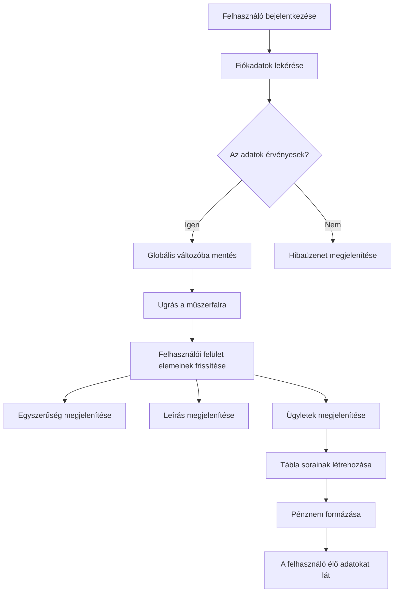
> 💡 **Pro tipp**: Szeretnéd az irányítópultodat azonnal működés közben látni? Használd a `test` felhasználónevet a bejelentkezéskor – előre betöltött mintaadatokkal érkezik, így anélkül is láthatod a működést, hogy előzetesen tranzakciókat hoznál létre.
> 
**Miért hasznos a tesztfiók:**
- Már valósághű mintaadatokkal érkezik
- Tökéletes arra, hogy lásd, hogyan jelennek meg a tranzakciók
- Jól használható az irányítópult funkcióinak teszteléséhez
- Megspórolja, hogy kézzel kelljen hamis adatokat létrehoznod

### Az irányítópult megjelenítő elemeinek létrehozása

Építsük fel lépésről lépésre az irányítópult felületét, először a fiók összefoglaló információival, majd haladjunk tovább az összetettebb funkciók, mint a tranzakciós listák felé.

#### 1. lépés: Frissítsd a HTML szerkezetet

Először cseréld le a statikus "Egyenleg" részt dinamikus helyőrző elemekre, amelyeket a JavaScripted majd kitölt:

```html
<section>
  Balance: <span id="balance"></span><span id="currency"></span>
</section>
```

Ezután adj hozzá egy szekciót a fiók leírásának megjelenítésére. Mivel ez szolgál az irányítópult tartalmának címeként, használj szemantikus HTML-t:

```html
<h2 id="description"></h2>
```

**A HTML szerkezet megértése:**
- **Külön `<span>` elemeket használ** az egyenleghez és a pénznemhez, egyéni vezérlésért
- **Egyedi azonosítókat alkalmaz** minden elemnél, hogy a JavaScript hivatkozhasson rájuk
- **Szemantikus HTML-t követ** a fiókleíráshoz `<h2>` használatával
- **Logikus hierarchiát hoz létre** a képernyőolvasók és a SEO számára

> ✅ **Akadálymentességi megjegyzés**: A fiókleírás az irányítópult tartalmának címe, ezért szerepel szemantikusan címsorként. Tudj meg többet arról, hogyan befolyásolja a [címsor struktúra](https://www.nomensa.com/blog/2017/how-structure-headings-web-accessibility) az akadálymentességet. Tudsz az oldaladon más elemeket is azonosítani, amelyeknek hasznos lenne a címsor használata?

#### 2. lépés: Készítsd el az irányítópult frissítő függvényét

Most hozz létre egy függvényt, amely valódi fiókadatokkal tölti fel az irányítópultot:

```javascript
function updateDashboard() {
  if (!account) {
    return navigate('/login');
  }

  updateElement('description', account.description);
  updateElement('balance', account.balance.toFixed(2));
  updateElement('currency', account.currency);
}
```

**Lépésről lépésre, mit csinál ez a függvény:**
- **Ellenőrzi**, hogy vannak-e fiókadatok mielőtt folytatná
- **Átirányítja** a nem hitelesített felhasználókat vissza a bejelentkezési oldalra
- **Frissíti** a fiókleírást az újrahasznosítható `updateElement` függvénnyel
- **Formázza** az egyenleget úgy, hogy mindig két tizedesjegyet mutasson
- **Megjeleníti** a megfelelő pénznemsimbólumot

> 💰 **Pénzformázás**: Az a [`toFixed(2)`](https://developer.mozilla.org/docs/Web/JavaScript/Reference/Global_Objects/Number/toFixed) metódus igazi segítség! Ez biztosítja, hogy az egyenleg mindig úgy nézzen ki, mint valódi pénz – „75.00” és ne csak „75”. A felhasználóid értékelni fogják, hogy ismerős formátumot látnak.

#### 3. lépés: Biztosítsd, hogy az irányítópultod frissüljön

Annak érdekében, hogy az irányítópultod minden alkalommal frissüljön, amikor valaki meglátogatja, be kell horgonyoznunk a navigációs rendszeredbe. Ha elvégezted a [1. leckében kapott feladatot](../1-template-route/assignment.md), ez ismerős lesz. Ha nem, ne aggódj – itt van, amire szükséged van:

Add ezt a `updateRoute()` függvény végére:

```javascript
if (typeof route.init === 'function') {
  route.init();
}
```

Majd frissítsd az útvonalakat, hogy tartalmazzák az irányítópult inicializációját:

```javascript
const routes = {
  '/login': { templateId: 'login' },
  '/dashboard': { templateId: 'dashboard', init: updateDashboard }
};
```

**Mit csinál ez az ügyes megoldás:**
- Ellenőrzi, van-e speciális inicializációs kód az adott útvonalhoz
- Automatikusan lefuttatja ezt a kódot az útvonal betöltésekor
- Biztosítja, hogy az irányítópult mindig friss, aktuális adatokat mutasson
- Tisztán és rendezetten tartja a routing logikát

#### Az irányítópult tesztelése

Miután bevezetted ezeket a változtatásokat, teszteld az irányítópultot:

1. **Jelentkezz be** egy tesztfiókkal
2. **Ellenőrizd**, hogy átirányít a műszerfalra
3. **Győződj meg róla**, hogy a fiókleírás, egyenleg és pénznem jól jelenik meg
4. **Próbálj kijelentkezni, majd újra bejelentkezni**, hogy meggyőződj, az adatok frissülnek rendesen

Most az irányítópult dinamikus fiókinformációkat jelenít meg, amelyek a bejelentkezett felhasználó adatai alapján frissülnek!

## Okos tranzakciós listák készítése sablonokkal

Ahelyett, hogy kézzel hoznánk létre HTML-t minden tranzakcióhoz, sablonokat használunk, amely automatikusan generál egységes formázást. Olyan ez, mint az űrhajógyártás szabványos alkatrészei: a sablonok biztosítják, hogy minden tranzakciós sor azonos szerkezetet és megjelenést kapjon.

Ez a technika hatékonyan skálázódik néhány tranzakciótól akár több ezerig, miközben egyenletes teljesítményt és megjelenítést biztosít.

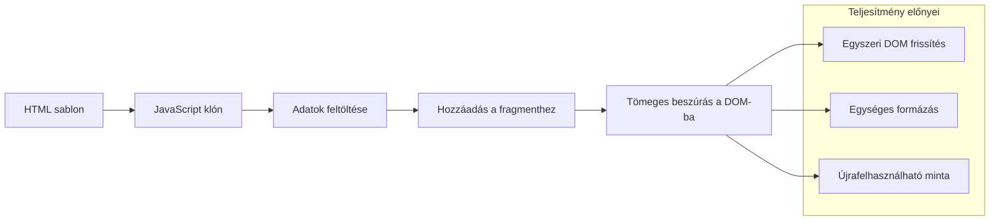
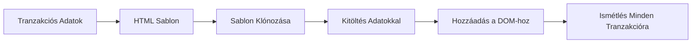
### 1. lépés: Hozd létre a tranzakciós sablont

Először adj hozzá egy újrahasznosítható sablont a tranzakciós sorokhoz a HTML `<body>` részében:

```html
<template id="transaction">
  <tr>
    <td></td>
    <td></td>
    <td></td>
  </tr>
</template>
```

**Az HTML sablon megértése:**
- **Meghatározza** egyetlen táblázatsor szerkezetét
- **Láthatatlan** marad, amíg JavaScript klónozza és kitölti
- **Három cellát tartalmaz** a dátum, leírás és összeg számára
- **Újrahasznosítható mintázatot biztosít** az egységes formázáshoz

### 2. lépés: Készülj fel a táblázat dinamikus tartalmára

Ezután adj az asztal törzsének (`tbody`) egy `id` attribútumot, hogy a JavaScript könnyen megtalálja:

```html
<tbody id="transactions"></tbody>
```

**Mit érünk el ezzel:**
- **Egy tiszta célt teremtünk** a tranzakciós sorok beszúrásához
- **Elválasztjuk** a táblázat szerkezetét a dinamikus tartalomtól
- **Lehetővé tesszük az egyszerű törlést és újratöltést** a tranzakciós adatoknak

### 3. lépés: Építsd meg a tranzakciós sor gyártó függvényt

Most készíts egy függvényt, amely a tranzakciós adatokat HTML elemmé alakítja:

```javascript
function createTransactionRow(transaction) {
  const template = document.getElementById('transaction');
  const transactionRow = template.content.cloneNode(true);
  const tr = transactionRow.querySelector('tr');
  tr.children[0].textContent = transaction.date;
  tr.children[1].textContent = transaction.object;
  tr.children[2].textContent = transaction.amount.toFixed(2);
  return transactionRow;
}
```

**A gyártó függvény részletezése:**
- **Megkeresi a sablon elemet** azonosító alapján
- **Klónozza a sablon tartalmát**, így biztonságosan dolgozik vele
- **Kiválasztja** a táblázatsort a klónozott tartalmon belül
- **Kitölti** az egyes cellákat a tranzakciós adatokkal
- **Formázza** az összeget megfelelő tizedesjegyekkel
- **Visszaadja** a kész sort, amely készen áll a beszúrásra

### 4. lépés: Több tranzakciós sor hatékony generálása

Add hozzá ezt a kódot az `updateDashboard()` függvényedhez, hogy megjelenítse az összes tranzakciót:

```javascript
const transactionsRows = document.createDocumentFragment();
for (const transaction of account.transactions) {
  const transactionRow = createTransactionRow(transaction);
  transactionsRows.appendChild(transactionRow);
}
updateElement('transactions', transactionsRows);
```

**Az eredmény hatékony megközelítése:**
- **Létrehoz egy dokumentum töredéket** a DOM műveletek csoportosításához
- **Végigiterál** az összes tranzakción a fiókadatokban
- **Generál** egy-egy sor minden tranzakcióra a gyártó függvény segítségével
- **Összegyűjti** az összes sort a töredékben, mielőtt a DOM-ba illesztené
- **Egyszeri DOM frissítést hajt végre**, nem pedig több külön beszúrást
> ⚡ **Teljesítményoptimalizálás**: A [`document.createDocumentFragment()`](https://developer.mozilla.org/docs/Web/API/Document/createDocumentFragment) olyan, mint a Boeing összeszerelő folyamata – az alkatrészeket a fő vonaltól távol készítik elő, majd teljes egységként szerelik össze. Ez a csoportosítás csökkenti a DOM újrarajzolásokat azáltal, hogy egyetlen beszúrást hajt végre több különálló művelet helyett.

### 5. lépés: Frissítő függvény fejlesztése vegyes tartalomhoz

Az `updateElement()` függvényed jelenleg csak szöveges tartalmat kezel. Frissítsd úgy, hogy mind szöveggel, mind DOM csomópontokkal működjön:

```javascript
function updateElement(id, textOrNode) {
  const element = document.getElementById(id);
  element.textContent = ''; // Minden gyerekelemet eltávolít
  element.append(textOrNode);
}
```

**A frissítés kulcsfontosságú fejlesztései:**
- **Kitörli** a meglévő tartalmat, mielőtt új tartalmat ad hozzá
- **Elfogad** paraméterként szöveges stringeket vagy DOM csomópontokat
- **A [`append()`](https://developer.mozilla.org/docs/Web/API/ParentNode/append) metódust használja a rugalmasság érdekében
- **Megőrzi** a korábbi, szövegalapú használattal való visszafelé kompatibilitást

### Próbáld ki a dashboardodat

Elérkezett az igazság pillanata! Nézzük meg, hogyan működik a dinamikus dashboardod:

1. Jelentkezz be a `test` fiókkal (ez előre feltöltött mintaadatokat tartalmaz)
2. Navigálj a dashboardodra
3. Ellenőrizd, hogy a tranzakciós sorok megjelennek-e megfelelő formázással
4. Győződj meg róla, hogy a dátumok, leírások és összegek mind rendben vannak-e

Ha minden működik, egy teljesen működő tranzakciós listát kell látnod a dashboardodon! 🎉

**Amit elértél:**
- Egy olyan dashboardot építettél, amely bármennyi adatra skálázódik
- Újrahasználható sablonokat hoztál létre egységes formázáshoz
- Hatékony DOM manipulációs technikákat alkalmaztál
- Olyan funkcionalitást fejlesztettél, ami összevethető egy éles banki alkalmazással

Sikeresen egy statikus weboldalt alakítottál át dinamikus webalkalmazássá.

### 🎯 Pedagógiai állomás: Dinamikus tartalom generálás

**Architektúra megértése**: Egy kifinomult adat–UI csővezeték rendszert valósítottál meg, amely tükrözi a React, Vue és Angular keretrendszerekben használt mintákat.

**Főbb elsajátított fogalmak**:
- **Sablonalapú renderelés**: Újrahasználható UI komponensek létrehozása
- **Dokumentumfragementumok**: A DOM teljesítményének optimalizálása
- **Biztonságos DOM manipuláció**: Biztonsági rések megelőzése
- **Adat transzformáció**: Szerveroldali adatok átalakítása felhasználói felületté

**Ipari összefüggés**: Ezek a technikák képezik a modern frontend keretrendszerek alapját. A React virtuális DOM-ja, a Vue sablonrendszere és az Angular komponens architektúrája is ezekre az alapokra épít.

**Elmélkedő kérdés**: Hogyan bővítenéd ki ezt a rendszert valós idejű frissítések kezelésére (például új tranzakciók automatikus megjelenése)? Gondolkodj WebSocketeken vagy Server-Sent Eventeken.

---

## 📈 Az adataid kezelésének mesterszintű idővonala

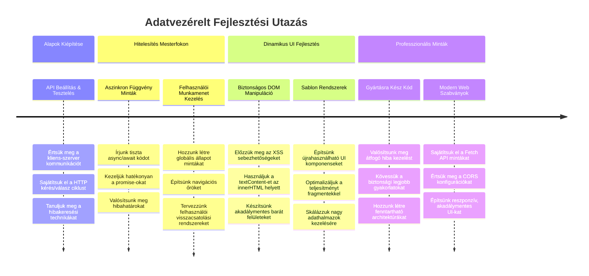
**🎓 Diplomaszerzési mérföldkő**: Sikeresen elkészítettél egy teljes adatvezérelt webalkalmazást modern JavaScript minták segítségével. Ezek a képességek közvetlenül alkalmazhatók olyan keretrendszereknél, mint a React, Vue vagy Angular.

**🔄 A következő szint képességei**:
- Készen állsz, hogy további frontend keretrendszereket fedezz fel, amelyek ezen koncepciókra épülnek
- Felkészült vagy valós idejű funkciók megvalósítására WebSocketekkel
- Képes vagy offline képességekkel rendelkező Progresszív Webalkalmazások (PWA) fejlesztésére
- Megvan az alapod a fejlett állapotkezelő minták elsajátításához

## GitHub Copilot Ügynök kihívás 🚀

Használd az Ügynök módot a következő kihívás teljesítéséhez:

**Leírás:** Fejleszd a banki alkalmazást tranzakciókereső és szűrő funkcióval, amely lehetővé teszi a felhasználók számára, hogy dátum intervallum, összeg vagy leírás alapján keressenek konkrét tranzakciókat.

**Kérés:** Készíts kereső funkciót a banki alkalmazáshoz, amely tartalmazza: 1) egy kereső űrlapot, amely ad mezőket a dátum intervallumhoz (tól-ig), a minimum/maximum összeghez és a tranzakció leírás kulcsszavaihoz, 2) egy `filterTransactions()` függvényt, amely az `account.transactions` tömböt szűri a keresési feltételek alapján, 3) frissítsd az `updateDashboard()` függvényt a szűrt eredmények megjelenítésére, és 4) adj egy "Szűrők törlése" gombot a nézet visszaállításához. Használj modern JavaScript tömbmetódusokat, mint a `filter()`, és kezeld az üres keresési feltételek speciális esetét.

Tudj meg többet az [ügynök módról](https://code.visualstudio.com/blogs/2025/02/24/introducing-copilot-agent-mode) itt.

## 🚀 Kihívás

Készen állsz, hogy a banki alkalmazásodat a következő szintre emeld? Tegyük olyan élményessé és megjelenésűvé, amit valóban használni szeretnél. Íme néhány ötlet, hogy beindítsuk a kreativitásodat:

**Tedd szépé**: Adj CSS stílusokat, hogy a működő dashboardod vizuálisan is vonzó legyen. Gondolj letisztult vonalakra, jó térközökre, és akár finom animációkra is.

**Legyen reszponzív**: Próbáld ki a [media queries](https://developer.mozilla.org/docs/Web/CSS/Media_Queries) használatát, hogy egy [reszponzív dizájnt](https://developer.mozilla.org/docs/Web/Progressive_web_apps/Responsive/responsive_design_building_blocks) hozz létre, ami jól működik telefonon, tableten és asztali gépen is. A felhasználóid hálásak lesznek!

**Adj egy kis csavart**: Gondolkodj színezett tranzakciókon (zöld a bevétel, piros a kiadás), ikonokon, vagy hover effekteken, melyek interaktívabbá teszik a felületet.

Így nézhet ki egy kidolgozott dashboard:

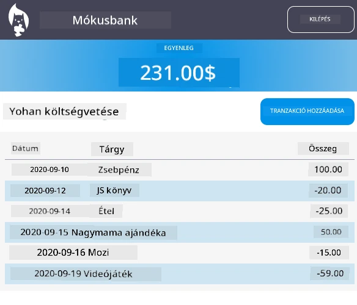

Nem kell pontosan ezt másolnod – használd inspirációnak és alakítsd saját ízlésed szerint!

## Előadás utáni kvíz

[Előadás utáni kvíz](https://ff-quizzes.netlify.app/web/quiz/46)

## Feladat

[Kódod refaktorálása és kommentelése](assignment.md)

---

<!-- CO-OP TRANSLATOR DISCLAIMER START -->
**Jogi nyilatkozat**:  
Ezt a dokumentumot az AI fordítási szolgáltatás [Co-op Translator](https://github.com/Azure/co-op-translator) segítségével fordítottuk le. Bár a pontosságra törekszünk, kérjük, vegye figyelembe, hogy az automatikus fordítások hibákat vagy pontatlanságokat tartalmazhatnak. Az eredeti dokumentum az anyanyelvén tekintendő hivatalos forrásnak. Fontos információk esetén professzionális, emberi fordítást javaslunk. Nem vállalunk felelősséget a fordítás használatából eredő félreértésekért vagy téves értelmezésekért.
<!-- CO-OP TRANSLATOR DISCLAIMER END -->