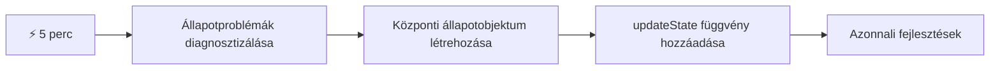
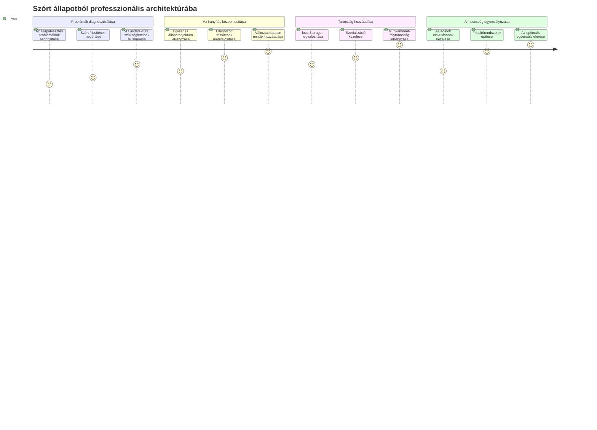
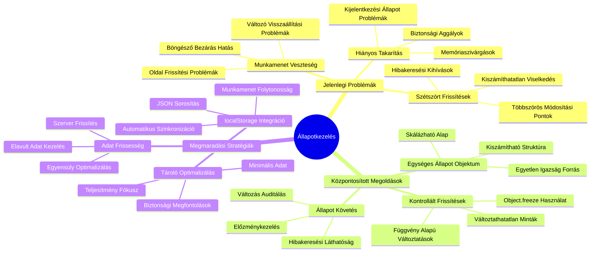
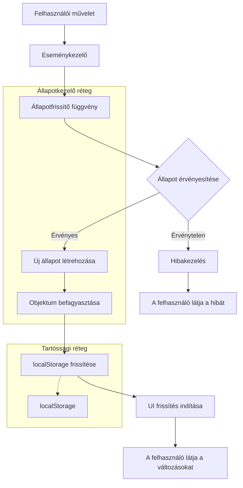
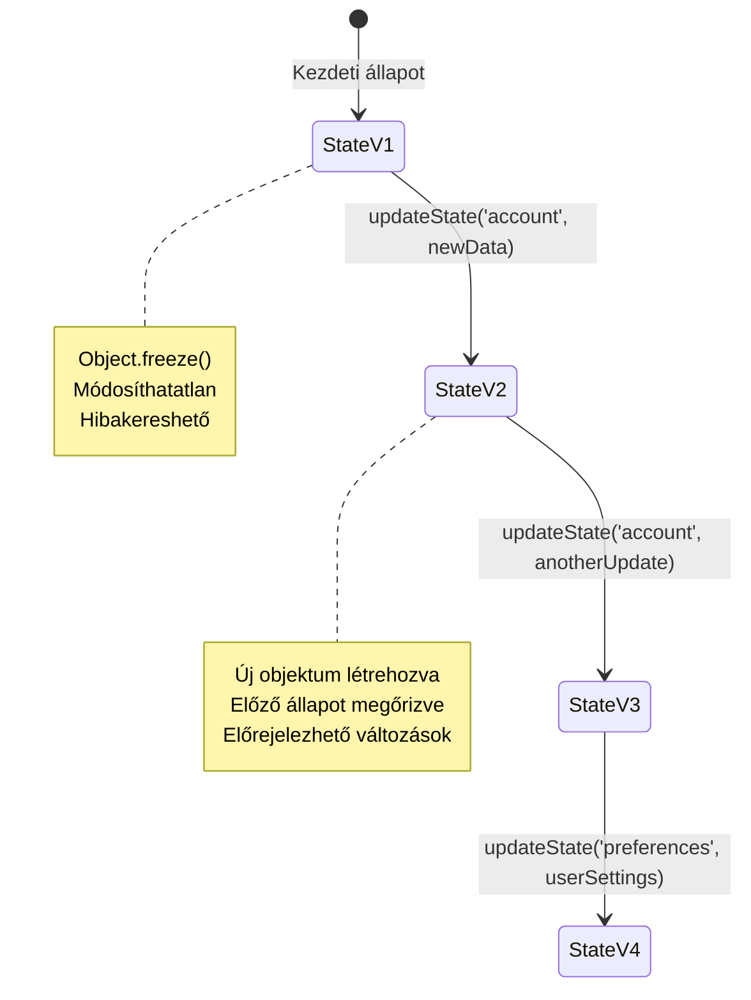
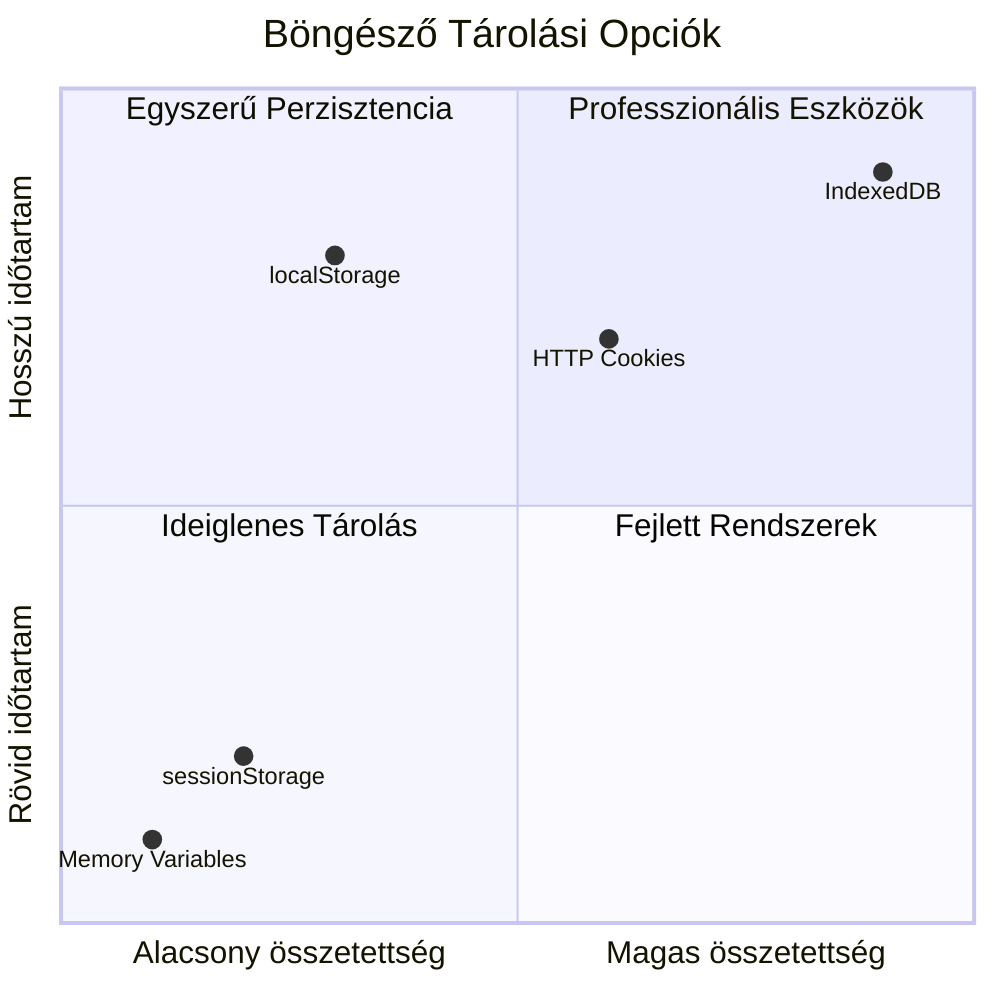
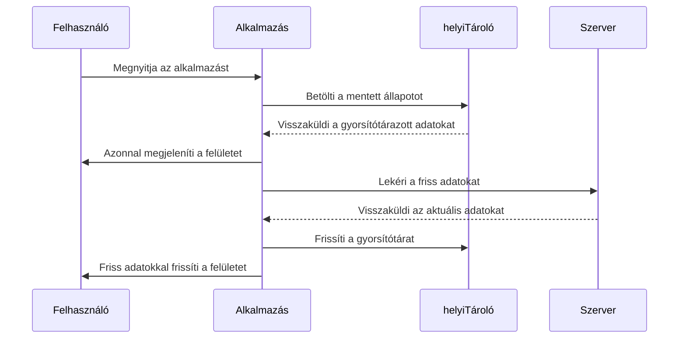
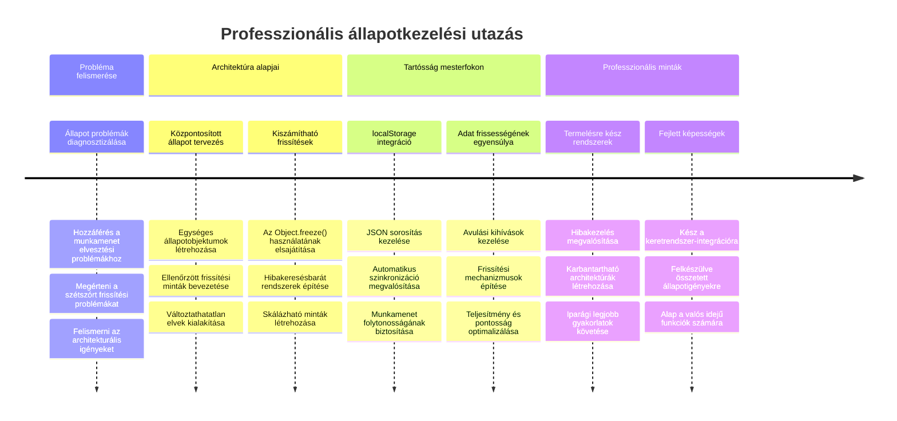

<!--
CO_OP_TRANSLATOR_METADATA:
{
  "original_hash": "b807b09df716dc48a2b750835bf8e933",
  "translation_date": "2026-01-07T03:01:02+00:00",
  "source_file": "7-bank-project/4-state-management/README.md",
  "language_code": "hu"
}
-->
# Banking alkalmazás készítése 4. rész: Az állapotkezelés fogalmai

## ⚡ Mit tehetsz a következő 5 percben

**Gyorsindítás elfoglalt fejlesztőknek**


- **1. perc**: Teszteld a jelenlegi állapotproblémát – jelentkezz be, frissítsd az oldalt, figyeld meg a kijelentkezést
- **2. perc**: Cseréld le a `let account = null`-t `let state = { account: null }`-re
- **3. perc**: Készíts egy egyszerű `updateState()` függvényt az irányított frissítésekhez
- **4. perc**: Módosítsd az egyik függvényt, hogy az új mintát használja
- **5. perc**: Teszteld a jobb előreláthatóságot és hibakeresési lehetőségeket

**Gyors diagnosztikai teszt**:
```javascript
// Előtte: Széttöredezett állapot
let account = null; // Frissítésre elveszik!

// Utána: Központosított állapot
let state = Object.freeze({ account: null }); // Irányított és nyomon követhető!
```

**Miért fontos ez**: 5 perc alatt megtapasztalod az állapotkezelés káoszából a kiszámítható, hibakereshető minták felé történő átalakulást. Ez az alapja a bonyolult alkalmazások fenntarthatóságának.

## 🗺️ Az állapotkezelés elsajátításának tanulási útja


**A tanulási célod**: A tanóra végére egy professzionális szintű állapotkezelő rendszert építesz, amely kezeli az állapot megőrzését, az adatok frissességét és a kiszámítható frissítéseket – ugyanezeket a mintákat használják a gyártási alkalmazások.

## Előadás előtti kvíz

[Előadás előtti kvíz](https://ff-quizzes.netlify.app/web/quiz/47)

## Bevezetés

Az állapotkezelés olyan, mint a Voyager űrszonda navigációs rendszere – amikor minden simán működik, alig veszed észre. De ha valami rosszul megy, az a különbség az, hogy elérjük-e az intersztelláris teret, vagy elveszünk a kozmikus űr végtelenségében. A webfejlesztésben az állapot minden, amit az alkalmazásnak meg kell jegyeznie: a felhasználó bejelentkezési státusza, az űrlapadatok, a navigációs előzmények és az ideiglenes felületi állapotok.

Ahogy a banking alkalmazásod egy egyszerű bejelentkezési űrlapról egy kifinomultabb alkalmazássá fejlődött, valószínűleg találkoztál néhány gyakori kihívással. Frissítsd az oldalt, és a felhasználók váratlanul kijelentkeznek. Bezárod a böngészőt, és minden folyamat törlődik. Hibát keresel, és több funkció között kell vadásznod, melyek különböző módokon módosítják ugyanazt az adatot.

Ezek nem a rossz kód jelei – ezek a természetes növekedési fájdalmak, melyek akkor jelentkeznek, amikor az alkalmazások elérnek egy bizonyos összetettségi szintet. Minden fejlesztő szembesül ezekkel a kihívásokkal, amikor az alkalmazása áttér a „bizonyítási példány” állapotból a „gyártásra kész” állapotba.

Ebben a leckében egy központosított állapotkezelő rendszert valósítunk meg, amely megbízható, professzionális alkalmazássá alakítja a banking appodat. Megtanulod, hogyan kezeld az adatáramlásokat kiszámíthatóan, a felhasználói munkameneteket megfelelően megőrizve, és létrehozod a sima felhasználói élményt, amit a modern webalkalmazások megkövetelnek.

## Előfeltételek

Mielőtt belevágnál az állapotkezelés fogalmaiba, szükséged van arra, hogy a fejlesztői környezeted megfelelően legyen beállítva, és az alkalmazásod alapjai meglegyenek. Ez a lecke közvetlenül az előző részek kódján és koncepcióin alapul.

Győződj meg róla, hogy a következő elemek készen állnak:

**Szükséges beállítás:**
- Töltsd le a [adatletöltési leckét](../3-data/README.md) – az alkalmazásodnak sikeresen kell betöltenie és megjelenítenie a fiókadatokat
- Telepítsd a [Node.js](https://nodejs.org) rendszert a backend API futtatásához
- Indítsd el helyben a [szerver API-t](../api/README.md) a fiókadatok kezeléséhez

**A környezet tesztelése:**

Ellenőrizd, hogy az API szervered helyesen fut-e, úgy, hogy egy terminálban lefuttatod ezt a parancsot:

```sh
curl http://localhost:5000/api
# -> "Bank API v1.0.0"-t kell, hogy visszaadjon eredményként
```

**Mit csinál ez a parancs:**
- **GET kérést küld** a helyi API szerverednek
- **Teszteli** a kapcsolatot és ellenőrzi, hogy a szerver válaszol-e
- **Visszaadja** az API verzióinformációját, ha minden rendben

## 🧠 Állapotkezelési architektúra áttekintése


**Alapelv**: A professzionális állapotkezelés egyensúlyt tart a kiszámíthatóság, az adatok megőrzése és a teljesítmény között, hogy megbízható felhasználói élményt nyújtson, amely skálázható az egyszerű interakcióktól a bonyolult alkalmazási munkafolyamatokig.

---

## A jelenlegi állapotproblémák diagnosztizálása

Akár Sherlock Holmes, aki egy bűntény helyszínét vizsgálja, pontosan meg kell értenünk, mi történik jelenlegi megvalósításunkban, mielőtt megoldjuk a felhasználói munkamenet eltűnésének rejtélyét.

Végezzünk egy egyszerű kísérletet, amely feltárja az állapotkezelés mögöttes kihívásait:

**🧪 Próbáld ki ezt a diagnosztikai tesztet:**
1. Jelentkezz be a banking alkalmazásba és menj a műszerfalra
2. Frissítsd az oldalt a böngészőben
3. Figyeld meg, mi történik a bejelentkezési státuszoddal

Ha visszairányít a bejelentkező képernyőre, felfedezted a klasszikus állapotmegőrzési problémát. Ez azért történik, mert a jelenlegi megvalósítás JavaScript változókban tárolja a felhasználói adatokat, amelyek minden oldalbetöltéskor törlődnek.

**A jelenlegi megvalósítás problémái:**

Az egyszerű `account` változó a [korábbi leckéből](../3-data/README.md) három jelentős problémát okoz, amelyek mind a felhasználói élményt, mind a kód fenntarthatóságát érintik:

| Probléma | Műszaki ok | Felhasználói hatás |
|---------|-----------|--------------------|
| **Munkamenet elvesztése** | Az oldalfrissítés törli a JavaScript változókat | A felhasználóknak gyakran újra be kell jelentkezniük |
| **Szétszórt frissítések** | Több függvény közvetlenül módosítja az állapotot | A hibakeresés egyre nehezebbé válik |
| **Hiányos takarítás** | A kijelentkezés nem töröl minden állapothivatkozást | Biztonsági és adatvédelmi problémák lehetnek |

**Az architekturális kihívás:**

Akárcsak a Titanic rekeszes kialakítása, amely elsőre erősnek tűnt, míg egyszerre nem árasztotta el több rekesz, az egyedi hibák kijavítása nem oldja meg az alapvető architekturális problémát. Egy átfogó állapotkezelő megoldásra van szükségünk.

> 💡 **Mit is akarunk valójában elérni itt?**

Az [állapotkezelés](https://en.wikipedia.org/wiki/State_management) valójában két alapvető kérdést próbál megoldani:

1. **Hol vannak az adataim?**: Nyomon követni, milyen információnk van és honnan származik
2. **Mindenki ugyanazt látja?**: Biztosítani, hogy amit a felhasználók látnak, megfeleljen a valóságnak

**A tervünk:**

Ahelyett, hogy körbe-körbe futnánk, létrehozunk egy **központosított állapotkezelő** rendszert. Gondolj rá úgy, mint egy igazán rendezett személyre, aki az összes fontos dologért felelős:



**Értelmezve az adatfolyamot:**
- **Központosítja** az alkalmazás minden állapotát egy helyen
- **Irányítja** az állapotváltozásokat ellenőrzött függvényeken keresztül
- **Biztosítja**, hogy a UI szinkronban maradjon az aktuális állapottal
- **Világos, kiszámítható mintát** ad az adatkezeléshez

> 💡 **Szakmai tipp**: Ez a lecke az alapelvekre fókuszál. Bonyolultabb alkalmazások esetén olyan könyvtárak, mint a [Redux](https://redux.js.org) fejlettebb állapotkezelési képességeket kínálnak. Ezeknek az alapelveknek az ismerete segít bármely állapotkezelő könyvtár elsajátításában.

> ⚠️ **Haladó téma**: Nem foglalkozunk itt az állapotváltozás által automatikusan aktivált UI frissítésekkel, mert ezek a [Reaktív programozás](https://en.wikipedia.org/wiki/Reactive_programming) fogalmait érintik. Ez kiváló következő lépés a tanulásod során!

### Feladat: Az állapot szerkezetének központosítása

Kezdjük el az állapotkezelés széttöredezett rendszerét központosítottá alakítani. Ez az első lépés lefekteti az alapokat minden további fejlesztéshez.

**1. lépés: Központi állapot objektum létrehozása**

Cseréld le a egyszerű `account` deklarációt:

```js
let account = null;
```

Egy strukturált állapotobjektumra:

```js
let state = {
  account: null
};
```

**Miért fontos ez a változtatás:**
- **Központosítja** az összes alkalmazásadatot egy helyen
- **Felkészíti** a struktúrát további állapottulajdonságok hozzáadására
- **Világos határt** teremt az állapot és más változók között
- **Minta alapját képezi**, amely skálázódik az alkalmazás növekedésével

**2. lépés: Az állapot elérési minták frissítése**

Módosítsd a függvényeidet, hogy az új állapotszerkezetet használják:

**A `register()` és `login()` függvényekben** cseréld le:
```js
account = ...
```

Erre:
```js
state.account = ...
```

**Az `updateDashboard()` függvényben** vedd fel a következő sort a tetejére:
```js
const account = state.account;
```

**Mit érnek el ezek a frissítések:**
- **Megőrzik** a meglévő funkciókat, miközben javítják a szerkezetet
- **Felkészítik** a kódot összetettebb állapotkezeléshez
- **Konzisztens mintákat** hoznak létre az állapotadatok eléréséhez
- **Létrehozzák** a központosított állapotfrissítések alapját

> 💡 **Megjegyzés**: Ez a refaktorálás nem oldja meg azonnal a problémákat, de megteremti az alapokat a hatékonyabb fejlesztésekhez!

### 🎯 Pedagógiai ellenőrzés: Központosítási elvek

**Állj meg és gondolkodj el**: éppen megvalósítottad a központosított állapotkezelés alapjait. Ez kulcsfontosságú architekturális döntés.

**Gyors önértékelés**:
- Meg tudod magyarázni, hogy miért jobb az állapot egyetlen objektumban való központosítása, mint a szétszórt változók használata?
- Mi történik, ha elfelejtesz egy függvényt frissíteni, hogy `state.account`-ot használjon?
- Hogyan készíti fel ez a minta a kódodat összetettebb funkciók beépítésére?

**Valós kapcsolódás**: A megtanult központosítási minta a modern keretrendszerek alapja, mint a Redux, Vuex vagy React Context. Ugyanezt az architekturális gondolkodást építed.

**Kihívás kérdés**: Ha felhasználói beállításokat (téma, nyelv) kellene hozzáadnod az alkalmazáshoz, hová tennéd ezeket az állapot struktúrában? Hogyan skálázódna ez a megoldás?

## Irányított állapotfrissítések megvalósítása

Miután központosítottuk az állapotot, a következő lépés az adatmódosítások irányított mechanizmusainak bevezetése. Ez az eljárás garantálja a kiszámítható állapotváltozásokat és egyszerűbb hibakeresést.

Az alapelv hasonlít a légiirányításhoz: ahelyett, hogy több függvény függetlenül módosítani tudná az állapotot, minden változást egyetlen ellenőrzött funkción keresztül csatornázunk. Ez a minta átláthatóvá teszi, mikor és hogyan történik adatmódosítás.

**Immutábilis állapotkezelés:**

Az `state` objektumot [*immutábilisnak*](https://en.wikipedia.org/wiki/Immutable_object) tekintjük, vagyis soha nem módosítjuk közvetlenül. Ehelyett minden változás új állapotobjektumot hoz létre a frissített adatokkal.

Bár ez a megközelítés kezdetben kevésbé tűnhet hatékonynak a közvetlen módosításokhoz képest, jelentős előnyöket kínál hibakeresés, tesztelés és a kiszámíthatóság fenntartása terén.

**Az immutábilis állapotkezelés előnyei:**

| Előny | Leírás | Hatás |
|---------|-------------|--------|
| **Kiszámíthatóság** | Változások kizárólag ellenőrzött függvényeken keresztül történnek | Könnyebb a hibakeresés és tesztelés |
| **Előzménykövetés** | Minden állapotváltozás új objektumot hoz létre | Engedélyezi a visszavonás/újra végrehajtás funkciókat |
| **Mellékhatás-mentesség** | Nincsenek véletlen módosítások | Megelőzi a rejtélyes hibákat |
| **Teljesítmény-optimalizálás** | Könnyű érzékelni, mikor változott ténylegesen az állapot | Hatékony UI frissítések támogatása |

**JavaScript immutabilitás az `Object.freeze()` segítségével:**

A JavaScript [`Object.freeze()`](https://developer.mozilla.org/docs/Web/JavaScript/Reference/Global_Objects/Object/freeze) metódust biztosít az objektum módosítások megakadályozására:

```js
const immutableState = Object.freeze({ account: userData });
// Bármilyen próbálkozás az immutableState módosítására hibát fog okozni
```

**Mit csinál ez a kód:**
- **Megakadályozza** a közvetlen tulajdonság hozzárendelést vagy törlést
- **Hibát dob**, ha módosítási kísérlet történik
- **Biztosítja**, hogy az állapotváltozások ellenőrzött funkciókon keresztül történjenek
- **Világos szerződést** hoz létre az állapot frissítésének módjára

> 💡 **Mélyebb betekintés**: Tanulmányozd az *elszínt* és *mély* immutabilitás közötti különbséget az [MDN dokumentációban](https://developer.mozilla.org/docs/Web/JavaScript/Reference/Global_Objects/Object/freeze#What_is_shallow_freeze). Ennek megértése kulcsfontosságú összetett állapotstruktúrák esetén.


### Feladat

Hozzuk létre az új `updateState()` függvényt:

```js
function updateState(property, newData) {
  state = Object.freeze({
    ...state,
    [property]: newData
  });
}
```

Ebben a függvényben új állapotobjektumot hozunk létre és átmásoljuk az előző állapotot a [*spread (`...`) operátor*](https://developer.mozilla.org/docs/Web/JavaScript/Reference/Operators/Spread_syntax#Spread_in_object_literals) segítségével. Ezután felülírunk egy adott tulajdonságot az új adattal a [zárójelnotációval](https://developer.mozilla.org/docs/Web/JavaScript/Guide/Working_with_Objects#Objects_and_properties) `[property]` az értékadásra. Végül lezárjuk az objektumot az `Object.freeze()` használatával, hogy megakadályozzuk a módosításokat. Jelenleg csak az `account` tulajdonság tárolódik az állapotban, de ezzel a megközelítéssel tetszőleges számú tulajdonságot hozzáadhatsz.

Frissítjük az állapot inicializálását is, hogy az első állapot is le legyen fagyasztva:

```js
let state = Object.freeze({
  account: null
});
```

Ezután módosítsd a `register` függvényt úgy, hogy a `state.account = result;` helyett ezt használd:

```js
updateState('account', result);
```

Ugyanezt tedd a `login` függvénnyel, cseréld le a `state.account = data;`-t erre:

```js
updateState('account', data);
```

Most lehetőségünk van orvosolni azt a problémát, hogy a fiókadatok nem törlődnek, amikor a felhasználó a *Kijelentkezés* gombra kattint.

Hozz létre egy új `logout()` függvényt:

```js
function logout() {
  updateState('account', null);
  navigate('/login');
}
```

Az `updateDashboard()`-ban cseréld le az átirányítást `return navigate('/login');`-ről `return logout();`-ra;

Próbálj új fiókot regisztrálni, kijelentkezni és újra bejelentkezni, hogy ellenőrizd, minden rendben működik-e.

> Tipp: Az összes állapotváltozást megtekintheted, ha az `updateState()` aljára írod be a `console.log(state)` kifejezést, és megnyitod a böngésződ fejlesztői eszközeinek konzolját.

## Adatmegőrzés megvalósítása

A korábban azonosított munkamenet elvesztési problémára egy megőrzési megoldás szükséges, amely megtartja a felhasználói állapotot a böngésző munkamenetek között. Ezáltal az alkalmazás ideiglenes élményből egy megbízható, professzionális eszközzé válik.

Gondolj az atomórákra, amelyek az áramkimaradások alatt is pontos időt tartanak, mivel kritikus állapotukat nem illékony memóriában tárolják. Hasonlóan, a webalkalmazásoknak is szükségük van tartós tárolási mechanizmusokra, hogy megőrizzék a lényeges felhasználói adatokat böngészőmunkamenetek és oldalfrissítések között.

**Stratégiai kérdések az adatmegőrzéshez:**

Mielőtt bevezeted a megőrzést, fontold meg a következő fontos tényezőket:

| Kérdés | Banking alkalmazás kontextusa | Döntés hatása |
|----------|-------------------|----------------|
| **Érzékeny adat?** | Számlaegyenleg, tranzakciós előzmények | Válassz biztonságos tárolási módokat |
| **Meddig maradjon meg?** | Bejelentkezési állapot vs. ideiglenes UI beállítások | Válassza ki a megfelelő tárolási időtartamot |
| **Szüksége van rá a szervernek?** | Hitelesítési tokenek vs. UI beállítások | Határozza meg a megosztási követelményeket |

**Böngésző tárolási lehetőségek:**

A modern böngészők többféle tárolási mechanizmust kínálnak, amelyek különböző felhasználási esetekre lettek tervezve:

**Elsődleges tároló API-k:**

1. **[`localStorage`](https://developer.mozilla.org/docs/Web/API/Window/localStorage)**: Tartós [Kulcs/Érték tárolás](https://en.wikipedia.org/wiki/Key%E2%80%93value_database)
   - **Megőrzi** az adatokat a böngésző munkamenetek között korlátlan ideig  
   - **Túléli** a böngésző újraindítását és a számítógép újraindulását
   - **Korlátozódik** a konkrét weboldal domainjére
   - **Tökéletes** a felhasználói beállítások és bejelentkezési állapotok tárolására

2. **[`sessionStorage`](https://developer.mozilla.org/docs/Web/API/Window/sessionStorage)**: Ideiglenes munkamenet-tárolás
   - **Ugyanúgy működik**, mint a localStorage az aktív munkamenet alatt
   - **Automatikusan törlődik**, amikor a böngésző fül bezárul
   - **Ideális** ideiglenes adatok számára, amelyek nem maradhatnak meg

3. **[HTTP sütik](https://developer.mozilla.org/docs/Web/HTTP/Cookies)**: Szerverrel megosztott tárolás
   - **Automatikusan** elküldésre kerül minden szerver kérésnél
   - **Tökéletes** az [azonosítási](https://en.wikipedia.org/wiki/Authentication) tokenekhez
   - **Korlátozott méretű**, és befolyásolhatja a teljesítményt

**Adatszerializációs követelmény:**

Mind a `localStorage`, mind a `sessionStorage` csak [sztringeket](https://developer.mozilla.org/docs/Web/JavaScript/Reference/Global_Objects/String) képes tárolni:

```js
// Objektumok JSON karakterláncokká alakítása tároláshoz
const accountData = { user: 'john', balance: 150 };
localStorage.setItem('account', JSON.stringify(accountData));

// JSON karakterláncok visszaalakítása objektumokká lekéréskor
const savedAccount = JSON.parse(localStorage.getItem('account'));
```

**A szerializáció megértése:**
- **JavaScript objektumokat alakít át JSON sztringekké** a [`JSON.stringify()`](https://developer.mozilla.org/docs/Web/JavaScript/Reference/Global_Objects/JSON/stringify) használatával
- **Objektumokat rekonstruál** JSON-ból a [`JSON.parse()`](https://developer.mozilla.org/docs/Web/JavaScript/Reference/Global_Objects/JSON/parse) segítségével
- **Automatikusan kezeli** az összetett ágyazott objektumokat és tömböket
- **Nem működik** függvényekkel, undefined értékekkel és körkörös hivatkozásokkal

> 💡 **Fejlettebb lehetőség**: Összetett offline alkalmazásokhoz nagy adatkészletekkel fontolja meg az [`IndexedDB` API](https://developer.mozilla.org/docs/Web/API/IndexedDB_API) használatát. Ez teljes kliensoldali adatbázist biztosít, de összetettebb megvalósítást igényel.


### Feladat: localStorage tartósság megvalósítása

Valósítsuk meg a tartós tárolást úgy, hogy a felhasználók bejelentkezve maradnak, amíg kifejezetten ki nem jelentkeznek. A `localStorage`-t fogjuk használni az adat megőrzésére a böngésző munkamenetek között.

**1. lépés: Tárolási konfiguráció definiálása**

```js
const storageKey = 'savedAccount';
```

**Mit biztosít ez a konstans:**
- **Létrehoz** egy egységes azonosítót a tárolt adatok számára
- **Megakadályozza** a tároló kulcs elírását
- **Könnyűvé teszi** a tároló kulcs későbbi módosítását
- **Betartja** a fenntartható kód irányelveit

**2. lépés: Automatikus tartósság hozzáadása**

Adja hozzá ezt a sort az `updateState()` függvény végén:

```js
localStorage.setItem(storageKey, JSON.stringify(state.account));
```

**Mit csinál pontosan itt:**
- **Átalakítja** a fiók objektumot JSON sztringgé a tároláshoz
- **Eltárolja** az adatokat az egységes tároló kulccsal
- **Automatikusan lefut** minden állapotváltozáskor
- **Biztosítja**, hogy a tárolt adat szinkronban legyen a jelenlegi állapottal

> 💡 **Architektúrális előny**: Mivel az összes állapotfrissítés a `updateState()`-n keresztül történt, a tartósság hozzáadása csak egy sor kódot igényelt. Ez a jó architekturális döntések erejét mutatja!

**3. lépés: Állapot helyreállítása az alkalmazás betöltésekor**

Hozzon létre inicializáló függvényt az elmentett adat visszaállításához:

```js
function init() {
  const savedAccount = localStorage.getItem(storageKey);
  if (savedAccount) {
    updateState('account', JSON.parse(savedAccount));
  }

  // Az előző inicializációs kódunk
  window.onpopstate = () => updateRoute();
  updateRoute();
}

init();
```

**Az inicializálás megértése:**
- **Lekéri** az előzőleg elmentett fiókadatokat a localStorage-ból
- **Parszolja** a JSON sztringet vissza JavaScript objektummá
- **Frissíti** az állapotot a kontrollált update függvényünkön keresztül
- **Automatikusan visszaállítja** a felhasználói munkamenetet az oldal betöltésekor
- **Fut** az útvonal frissítése előtt, hogy az állapot elérhető legyen

**4. lépés: Alapértelmezett útvonal optimalizálása**

Frissítse az alapértelmezett útvonalat, hogy kihasználja a tartósságot:

Az `updateRoute()` függvényben cserélje le:
```js
// Cserélje le: return navigate('/login');
return navigate('/dashboard');
```

**Miért értelmes ez a változtatás:**
- **Hatékonyan használja** az új tartóssági rendszert
- **Lehetővé teszi** a műszerfal számára az azonosítási ellenőrzést
- **Automatikusan átirányít** bejelentkezéshez, ha nincs elmentett munkamenet
- **Zökkenőmentesebb felhasználói élményt teremt**

**Megvalósítás tesztelése:**

1. Jelentkezzen be a banki alkalmazásba
2. Frissítse a böngésző oldalt
3. Ellenőrizze, hogy be van-e jelentkezve és a műszerfalon tartózkodik
4. Zárja be és nyissa újra a böngészőt
5. Navigáljon vissza az apphoz, és győződjön meg róla, hogy még mindig be van jelentkezve

🎉 **Sikeresen megvalósítva**: Mostantól az alkalmazás professzionális webalkalmazásként működik.

### 🎯 Pedagógiai ellenőrzőpont: Tartóssági architektúra

**Architektúra megértése**: Egy kifinomult tartóssági réteget építettél, amely kiegyensúlyozza a felhasználói élményt és az adatkezelési összetettséget.

**Elsajátított kulcsfogalmak**:
- **JSON szerializáció**: Összetett objektumok konvertálása tárolható sztringekké
- **Automatikus szinkronizáció**: Állapotváltozások kiváltják a tartós tárolást
- **Munkamenet helyreállítás**: Az alkalmazások vissza tudják állítani a felhasználói kontextust megszakítások után
- **Központosított tartósság**: Egy frissítő függvény kezeli az összes tárolást

**Iparági kapcsolat**: Ez a tartóssági minta alapvető a Progresszív Webalkalmazásoknál (PWA-k), offline első alkalmazásoknál és a modern mobil webes élményeknél. Gyártási szintű képességeket hozol létre.

**Reflexiós kérdés**: Hogyan módosítanád ezt a rendszert, hogy egyazon eszközön több felhasználói fiókot kezeljen? Gondolj a magánéletre és biztonságra!

## A tartósság és adatfrissesség egyensúlya

Rendszerünk gondoskodik a felhasználói munkamenetek megőrzéséről, de új kihívást hoz: az adatok elavulását. Amikor több felhasználó vagy alkalmazás módosítja ugyanazt a szerver adatot, a helyileg tárolt gyorsítótáras információ elavulttá válik.

Ez hasonló a viking hajósokhoz, akik egyszerre támaszkodtak a tárolt csillagtérképekre és az aktuális égi megfigyelésekre. A térképek következetességet adtak, de a navigátoroknak frissebb észlelésekre volt szükségük a változó körülményekhez. Hasonlóan, alkalmazásunknak mind a tartós felhasználói állapotra, mind a naprakész szerver alapú adatra szüksége van.

**🧪 Az adatfrissesség problémájának felfedezése:**

1. Jelentkezzen be a műszerfalra a `test` fiókkal
2. Futassa le ezt a parancsot egy terminálban, hogy egy másik forrásból tranzakciót szimuláljon:

```sh
curl --request POST \
     --header "Content-Type: application/json" \
     --data "{ \"date\": \"2020-07-24\", \"object\": \"Bought book\", \"amount\": -20 }" \
     http://localhost:5000/api/accounts/test/transactions
```

3. Frissítse a műszerfal oldalát a böngészőben
4. Figyelje meg, hogy megjelenik-e az új tranzakció

**Mit mutat ez a teszt:**
- **Megmutatja**, hogy a helyi tárolás hogyan válhat „elavulttá”
- **Szimulálja** azokat a valós helyzeteket, amikor az adatok az alkalmazáson kívül változnak
- **Feltárja** a tartósság és az adatfrissesség közti ellentétet

**Az adatelavulás kihívása:**

| Probléma | Ok | Felhasználói hatás |
|---------|-------|-------------|
| **Elavult adatok** | A localStorage sosem jár le automatikusan | A felhasználók elavult információkat látnak |
| **Szerver oldali változások** | Más alkalmazások/felhasználók módosítják ugyanazt az adatot | Inkonzisztens nézetek platformok között |
| **Gyorsítótár vs valóság** | A helyi gyorsítótár nem egyezik a szerver állapottal | Rossz felhasználói élmény és zavart okoz |

**Megoldási stratégia:**

Megvalósítunk egy "frissítés betöltéskor" mintát, amely egyensúlyban tartja a tartósság előnyeit és az adatok frissességének szükségességét. Ez megőrzi a zökkenőmentes felhasználói élményt, miközben biztosítja az adat pontosságát.


### Feladat: Adatfrissítő rendszer megvalósítása

Hozzunk létre egy rendszert, amely automatikusan lekéri a friss adatokat a szerverről, miközben megőrzi a tartós állapotkezelés előnyeit.

**1. lépés: Fiókadat frissítő létrehozása**

```js
async function updateAccountData() {
  const account = state.account;
  if (!account) {
    return logout();
  }

  const data = await getAccount(account.user);
  if (data.error) {
    return logout();
  }

  updateState('account', data);
}
```

**A függvény logikájának megértése:**
- **Ellenőrzi**, hogy van-e érvényes bejelentkezett felhasználó (state.account létezik)
- **Átirányít** kijelentkezéshez, ha nincs érvényes munkamenet
- **Lekéri** a friss fiókadatokat a szerverről a meglévő `getAccount()` függvénnyel
- **Kezeli** a szerverhibákat elegánsan az érvénytelen munkamenetek kijelentkeztetésével
- **Frissíti** az állapotot friss adatokkal a kontrollált frissítési rendszerünkkel
- **Elindítja** a localStorage automatikus mentését az `updateState()`-on keresztül

**2. lépés: Műszerfal frissítő kezelő létrehozása**

```js
async function refresh() {
  await updateAccountData();
  updateDashboard();
}
```

**Mi valósul meg ebben a frissítő függvényben:**
- **Koordinálja** az adatfrissítést és a felhasználói felület frissítését
- **Várja meg**, hogy a friss adatok betöltődjenek, mielőtt frissíti a megjelenítést
- **Biztosítja**, hogy a műszerfal a legaktuálisabb adatokat mutassa
- **Tiszta elválasztást tart fenn** az adatkezelés és a UI frissítés között

**3. lépés: Integráció az útvonal rendszerbe**

Frissítse az útvonal konfigurációját, hogy automatikusan elindítsa a frissítést:

```js
const routes = {
  '/login': { templateId: 'login' },
  '/dashboard': { templateId: 'dashboard', init: refresh }
};
```

**Az integráció működése:**
- **Minden alkalommal lefut**, amikor a műszerfal útvonal betöltődik
- **Garantálja**, hogy mindig friss adatok jelenjenek meg, amikor a felhasználók a műszerfalra navigálnak
- **Megőrzi** a meglévő útvonal struktúrát, miközben hozzáadja az adatfrissességet
- **Konzisztens mintát ad** a route-specifikus inicializáláshoz

**Adatfrissítő rendszer tesztelése:**

1. Jelentkezzen be banki alkalmazásába
2. Futtassa az előzőleg ismertetett curl parancsot egy új tranzakció létrehozásához
3. Frissítse a műszerfal oldalát vagy navigáljon el és vissza
4. Ellenőrizze, hogy az új tranzakció azonnal megjelenik-e

🎉 **Tökéletes egyensúly**: Az alkalmazásod most ötvözi a tartós állapot sima élményét a friss szerveradat pontosságával!

## 📈 Állapotkezelési mesterségidővonalad


**🎓 Diplomázási mérföldkő**: Sikeresen kiépítettél egy teljes állapotkezelő rendszer, azokat az elveket követve, amelyek a Reduxot, Vuex-et és más professzionális állománykönyvtárakat működtetik. Ezek a minták egyszerű alkalmazásoktól a vállalati szintű megoldásokig skálázhatók.

**🔄 Következő szintű képességek**:
- Készen állsz az állapotkezelő keretrendszerek (Redux, Zustand, Pinia) elsajátítására
- Felkészültél valós idejű funkciók megvalósítására WebSocketeken keresztül
- Alkalmas vagy offline első Progresszív Webalkalmazások fejlesztésére
- Megalapoztad a fejlett minták, például állapotgépek és megfigyelők megértését

## GitHub Copilot Agent kihívás 🚀

Használd az Agent módot az alábbi kihívás teljesítéséhez:

**Leírás:** Valósíts meg egy átfogó állapotkezelő rendszert visszavonás/visszaváltás funkciókkal a banki alkalmazáshoz. Ez a kihívás segít gyakorolni az előrehaladott állapotkezelési koncepciókat, beleértve az állapottörténet követését, az immutábilis frissítéseket és a felhasználói felület szinkronizálását.

**Prompt:** Készíts egy továbbfejlesztett állapotkezelő rendszert, amely tartalmazza: 1) Egy állapottörténet tömböt, amely nyomon követi az összes korábbi állapotot, 2) Visszavonás és újra végrehajtás funkciókat, amelyek visszaállítják a korábbi állapotokat, 3) UI gombokat a visszavonás/újra végrehajtás műveletekhez a műszerfalon, 4) Max. 10 állapot hosszúságú történeti korlátot a memória problémák elkerülésére, 5) Történet megfelelő törlését kijelentkezéskor. Biztosítsd, hogy a visszavonás/újra funkciók működjenek a számlaegyenleg változásokkal és megmaradjanak böngészőfrissítés után is.

További információ a [agent mode](https://code.visualstudio.com/blogs/2025/02/24/introducing-copilot-agent-mode)-ról itt.

## 🚀 Kihívás: Tárolás optimalizálása

Megvalósításod most hatékonyan kezeli a felhasználói munkameneteket, adatfrissítést és állapotkezelést. Azonban vizsgáld meg, hogy jelenlegi megközelítésünk optimálisan egyensúlyozza-e a tárolási hatékonyságot és a funkcionalitást.

Ahogyan a sakkmesterek megkülönböztetik az alapvető figurákat a feláldozható gyalogoktól, az állapotkezelés akkor hatékony, ha felismeri, mely adatoknak kell megmaradniuk, és melyeket kell mindig frissen betölteni a szerverről.

**Optimalizálási elemzés:**

Értékeld ki a jelenlegi localStorage megvalósításodat és gondolkodj el ezeken a stratégiai kérdéseken:
- Mi a minimális információ, ami a felhasználói hitelesítés fenntartásához szükséges?
- Mely adatok változnak elég gyakran, hogy a helyi gyorsítótár kevés előnyt nyújt?
- Hogyan javítható a tárolás teljesítménye anélkül, hogy rontaná a felhasználói élményt?

Ez a fajta architektúrális elemzés megkülönbözteti a tapasztalt fejlesztőket, akik mind a funkcionalitást, mind a hatékonyságot figyelembe veszik megoldásaikban.

**Megvalósítási stratégia:**
- **Azonosítsd** az alapvető adatot, amelynek meg kell maradnia (valószínűleg csak a felhasználói azonosítás)
- **Módosítsd** a localStorage implementációját, hogy csak kritikus munkamenet adatokat tároljon
- **Biztosítsd**, hogy a friss adatok mindig a szerverről töltődjenek be a műszerfal látogatásakor
- **Teszteld**, hogy az optimalizált megközelítés megőrzi ugyanazt a felhasználói élményt

**Fejlett megfontolás:**
- **Hasonlítsd össze** a teljes fiókadat tárolás és a csak azonosító tokenek tárolásának előnyeit és hátrányait
- **Dokumentáld** döntéseidet és indoklásaidat a jövőbeni csapattagok számára

Ez a kihívás segít neked úgy gondolkodni, mint egy professzionális fejlesztő, aki mind a felhasználói élményt, mind az alkalmazás hatékonyságát figyelembe veszi. Szánj rá időt, és kísérletezz különböző megközelítésekkel!

## Előadás utáni kvíz

[Előadás utáni kvíz](https://ff-quizzes.netlify.app/web/quiz/48)

## Feladat

[„Tranzakció hozzáadása” párbeszédablak megvalósítása](assignment.md)

Íme egy példa eredmény a feladat elvégzése után:


---

<!-- CO-OP TRANSLATOR DISCLAIMER START -->
**Felmentés**:
Ezt a dokumentumot a [Co-op Translator](https://github.com/Azure/co-op-translator) mesterséges intelligencia fordítószolgáltatás segítségével fordítottuk le. Bár igyekszünk a pontosságra, kérjük, vegye figyelembe, hogy az automatikus fordítások tartalmazhatnak hibákat vagy pontatlanságokat. Az eredeti dokumentum az anyanyelvén tekintendő a hiteles forrásnak. Kritikus információk esetén professzionális emberi fordítást javaslunk. Nem vállalunk felelősséget a fordítás használatából eredő félreértésekért vagy téves értelmezésekért.
<!-- CO-OP TRANSLATOR DISCLAIMER END -->