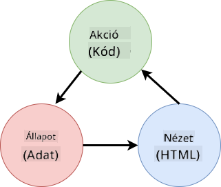
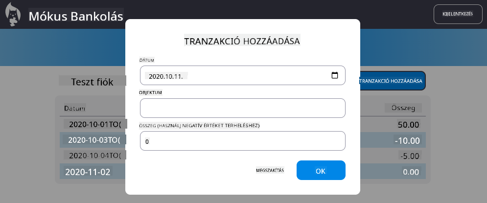

<!--
CO_OP_TRANSLATOR_METADATA:
{
  "original_hash": "5d2efabbc8f94d89f4317ee8646c3ce9",
  "translation_date": "2025-08-29T10:22:49+00:00",
  "source_file": "7-bank-project/4-state-management/README.md",
  "language_code": "hu"
}
-->
# Banki alkalmazás építése 4. rész: Állapotkezelés fogalmai

## Előadás előtti kvíz

[Előadás előtti kvíz](https://ff-quizzes.netlify.app/web/quiz/47)

### Bevezetés

Ahogy egy webalkalmazás növekszik, egyre nehezebb nyomon követni az összes adatáramlást. Melyik kód kapja meg az adatokat, melyik oldal használja fel, hol és mikor kell frissíteni... könnyen előfordulhat, hogy rendezetlen kódot kapunk, amelyet nehéz karbantartani. Ez különösen igaz, ha az adatokat meg kell osztani az alkalmazás különböző oldalai között, például a felhasználói adatokat. Az *állapotkezelés* fogalma mindig is létezett mindenféle programban, de ahogy a webalkalmazások egyre bonyolultabbá válnak, ez ma már kulcsfontosságú szempont a fejlesztés során.

Ebben az utolsó részben átnézzük az általunk épített alkalmazást, hogy újragondoljuk az állapotkezelést, lehetővé téve a böngésző frissítését bármikor, és az adatok megőrzését a felhasználói munkamenetek között.

### Előfeltétel

A webalkalmazás [adatlekérés](../3-data/README.md) részét be kell fejezned ehhez a leckéhez. Továbbá telepítened kell a [Node.js](https://nodejs.org) programot, és [helyileg futtatnod kell a szerver API-t](../api/README.md), hogy kezelni tudd a fiókadatokat.

Ellenőrizheted, hogy a szerver megfelelően fut-e, ha végrehajtod ezt a parancsot egy terminálban:

```sh
curl http://localhost:5000/api
# -> should return "Bank API v1.0.0" as a result
```

---

## Állapotkezelés újragondolása

Az [előző leckében](../3-data/README.md) bevezettük az állapot alapfogalmát az alkalmazásunkban a globális `account` változóval, amely tartalmazza az aktuálisan bejelentkezett felhasználó banki adatait. Azonban a jelenlegi megvalósításunknak vannak hiányosságai. Próbáld meg frissíteni az oldalt, amikor a vezérlőpulton vagy. Mi történik?

A jelenlegi kóddal három probléma van:

- Az állapot nem marad meg, mivel a böngésző frissítése visszavisz a bejelentkezési oldalra.
- Több funkció módosítja az állapotot. Ahogy az alkalmazás növekszik, nehéz lehet nyomon követni a változásokat, és könnyen elfelejthetünk frissíteni egyet.
- Az állapot nincs megtisztítva, így amikor a *Kijelentkezés* gombra kattintasz, a fiókadatok még mindig ott vannak, annak ellenére, hogy a bejelentkezési oldalon vagy.

Frissíthetnénk a kódunkat, hogy egyenként kezeljük ezeket a problémákat, de ez több kódismétlést eredményezne, és az alkalmazás bonyolultabbá és nehezebben karbantarthatóvá válna. Vagy megállhatnánk néhány percre, és újragondolhatnánk a stratégiánkat.

> Milyen problémákat próbálunk valójában megoldani?

Az [állapotkezelés](https://en.wikipedia.org/wiki/State_management) lényege, hogy jó megközelítést találjunk ennek a két konkrét problémának a megoldására:

- Hogyan lehet az adatáramlásokat egy alkalmazásban érthetővé tenni?
- Hogyan lehet az állapotadatokat mindig szinkronban tartani a felhasználói felülettel (és fordítva)?

Ha ezeket megoldottad, bármilyen más probléma, amivel szembesülhetsz, vagy már megoldódott, vagy könnyebben megoldhatóvá vált. Számos lehetséges megközelítés létezik ezeknek a problémáknak a megoldására, de mi egy gyakori megoldást választunk, amely **az adatok és a módosítási lehetőségek központosítását** foglalja magában. Az adatáramlás így nézne ki:



> Itt nem térünk ki arra a részre, ahol az adatok automatikusan frissítik a nézetet, mivel ez a [Reaktív programozás](https://en.wikipedia.org/wiki/Reactive_programming) fejlettebb fogalmaihoz kapcsolódik. Ez egy jó következő téma, ha mélyebben szeretnél belemerülni.

✅ Számos könyvtár létezik különböző megközelítésekkel az állapotkezeléshez, például a [Redux](https://redux.js.org), amely egy népszerű opció. Nézd meg a használt fogalmakat és mintákat, mivel gyakran jó módja annak, hogy megtudd, milyen potenciális problémákkal szembesülhetsz nagy webalkalmazásokban, és hogyan lehet ezeket megoldani.

### Feladat

Kezdjünk egy kis refaktorálással. Cseréld le az `account` deklarációt:

```js
let account = null;
```

Erre:

```js
let state = {
  account: null
};
```

Az ötlet az, hogy *központosítsuk* az összes alkalmazásadatot egyetlen állapotobjektumban. Jelenleg csak az `account` van az állapotban, így ez nem változtat sokat, de megnyitja az utat a további fejlesztések előtt.

Frissítenünk kell az ezt használó funkciókat is. A `register()` és `login()` funkciókban cseréld le az `account = ...` kifejezést `state.account = ...`-ra;

Az `updateDashboard()` funkció elején add hozzá ezt a sort:

```js
const account = state.account;
```

Ez a refaktorálás önmagában nem hozott sok javulást, de az ötlet az volt, hogy lefektessük az alapokat a következő változtatásokhoz.

## Adatváltozások nyomon követése

Most, hogy létrehoztuk az `state` objektumot az adataink tárolására, a következő lépés az, hogy központosítsuk a frissítéseket. A cél az, hogy könnyebb legyen nyomon követni a változásokat és azt, hogy mikor történnek.

Az `state` objektum módosításának elkerülése érdekében jó gyakorlatnak számít, ha azt [*változtathatatlannak*](https://en.wikipedia.org/wiki/Immutable_object) tekintjük, ami azt jelenti, hogy egyáltalán nem lehet módosítani. Ez azt is jelenti, hogy új állapotobjektumot kell létrehoznod, ha bármit meg akarsz változtatni benne. Ezzel védelmet építesz ki a potenciálisan nem kívánt [mellékhatások](https://en.wikipedia.org/wiki/Side_effect_(computer_science)) ellen, és lehetőséget nyitsz új funkciók bevezetésére az alkalmazásodban, például visszavonás/újra végrehajtás implementálására, miközben megkönnyíted a hibakeresést. Például naplózhatnád az állapotban végrehajtott minden változást, és megőrizhetnéd a változások történetét, hogy megértsd egy hiba forrását.

JavaScriptben az [`Object.freeze()`](https://developer.mozilla.org/docs/Web/JavaScript/Reference/Global_Objects/Object/freeze) segítségével hozhatsz létre egy változtathatatlan objektumot. Ha megpróbálsz változtatásokat végrehajtani egy változtathatatlan objektumon, kivétel keletkezik.

✅ Tudod, mi a különbség a *sekély* és a *mély* változtathatatlan objektum között? Olvass róla [itt](https://developer.mozilla.org/docs/Web/JavaScript/Reference/Global_Objects/Object/freeze#What_is_shallow_freeze).

### Feladat

Hozzunk létre egy új `updateState()` funkciót:

```js
function updateState(property, newData) {
  state = Object.freeze({
    ...state,
    [property]: newData
  });
}
```

Ebben a funkcióban létrehozunk egy új állapotobjektumot, és az előző állapotból másoljuk az adatokat a [*spread (`...`) operátor*](https://developer.mozilla.org/docs/Web/JavaScript/Reference/Operators/Spread_syntax#Spread_in_object_literals) segítségével. Ezután felülírunk egy adott tulajdonságot az állapotobjektumban az új adatokkal a [zárójel notáció](https://developer.mozilla.org/docs/Web/JavaScript/Guide/Working_with_Objects#Objects_and_properties) `[property]` használatával. Végül zároljuk az objektumot, hogy megakadályozzuk a módosításokat az `Object.freeze()` segítségével. Jelenleg csak az `account` tulajdonságot tároljuk az állapotban, de ezzel a megközelítéssel annyi tulajdonságot adhatsz hozzá az állapothoz, amennyire szükséged van.

Frissítsük az `state` inicializálását is, hogy az inicializálási állapot is zárolva legyen:

```js
let state = Object.freeze({
  account: null
});
```

Ezután frissítsük a `register` funkciót az `state.account = result;` kifejezés lecserélésével:

```js
updateState('account', result);
```

Ugyanezt tegyük a `login` funkcióval, cseréljük le az `state.account = data;` kifejezést:

```js
updateState('account', data);
```

Most kihasználjuk az alkalmat, hogy kijavítsuk azt a problémát, hogy a fiókadatok nem törlődnek, amikor a felhasználó a *Kijelentkezés* gombra kattint.

Hozz létre egy új `logout()` funkciót:

```js
function logout() {
  updateState('account', null);
  navigate('/login');
}
```

Az `updateDashboard()`-ban cseréld le az `return navigate('/login');` átirányítást `return logout();`-ra;

Próbálj meg regisztrálni egy új fiókot, kijelentkezni, majd újra bejelentkezni, hogy ellenőrizd, minden továbbra is megfelelően működik-e.

> Tipp: megnézheted az összes állapotváltozást, ha hozzáadod a `console.log(state)` kifejezést az `updateState()` aljára, és megnyitod a böngésződ fejlesztői eszközeinek konzolját.

## Az állapot megőrzése

A legtöbb webalkalmazásnak meg kell őriznie az adatokat, hogy megfelelően működjön. Az összes kritikus adatot általában egy adatbázisban tárolják, és egy szerver API-n keresztül érik el, például a felhasználói fiókadatokat esetünkben. De néha az is érdekes lehet, hogy az adatokat megőrizzük a böngészőben futó kliensalkalmazásban, a jobb felhasználói élmény vagy a betöltési teljesítmény javítása érdekében.

Amikor adatokat szeretnél megőrizni a böngésződben, néhány fontos kérdést fel kell tenned magadnak:

- *Érzékeny az adat?* Kerüld az érzékeny adatok, például a felhasználói jelszavak tárolását a kliensen.
- *Mennyi ideig szeretnéd megőrizni ezeket az adatokat?* Csak az aktuális munkamenet során szeretnéd elérni ezeket az adatokat, vagy örökre tárolni szeretnéd őket?

Számos módja van az információk tárolásának egy webalkalmazásban, attól függően, hogy mit szeretnél elérni. Például használhatod az URL-eket egy keresési lekérdezés tárolására, és megoszthatod azt más felhasználókkal. Használhatsz [HTTP sütiket](https://developer.mozilla.org/docs/Web/HTTP/Cookies), ha az adatokat meg kell osztani a szerverrel, például az [azonosítási](https://en.wikipedia.org/wiki/Authentication) információkat.

Egy másik lehetőség, hogy a böngésző API-k egyikét használod az adatok tárolására. Két különösen érdekes API létezik:

- [`localStorage`](https://developer.mozilla.org/docs/Web/API/Window/localStorage): egy [kulcs/érték tároló](https://en.wikipedia.org/wiki/Key%E2%80%93value_database), amely lehetővé teszi az adott webhelyhez tartozó adatok megőrzését különböző munkamenetek között. Az itt tárolt adatok soha nem járnak le.
- [`sessionStorage`](https://developer.mozilla.org/docs/Web/API/Window/sessionStorage): ez ugyanúgy működik, mint a `localStorage`, kivéve, hogy az itt tárolt adatok törlődnek, amikor a munkamenet véget ér (amikor a böngészőt bezárják).

Fontos megjegyezni, hogy mindkét API csak [sztringeket](https://developer.mozilla.org/docs/Web/JavaScript/Reference/Global_Objects/String) tud tárolni. Ha összetett objektumokat szeretnél tárolni, akkor azokat a [JSON](https://developer.mozilla.org/docs/Web/JavaScript/Reference/Global_Objects/JSON) formátumba kell sorosítanod a [`JSON.stringify()`](https://developer.mozilla.org/docs/Web/JavaScript/Reference/Global_Objects/JSON/stringify) segítségével.

✅ Ha olyan webalkalmazást szeretnél létrehozni, amely nem működik szerverrel, akkor az [`IndexedDB` API](https://developer.mozilla.org/docs/Web/API/IndexedDB_API) segítségével létrehozhatsz egy adatbázist a kliensen. Ez az opció fejlettebb esetekre vagy jelentős mennyiségű adat tárolására van fenntartva, mivel bonyolultabb a használata.

### Feladat

Azt szeretnénk, hogy a felhasználók bejelentkezve maradjanak, amíg kifejezetten nem kattintanak a *Kijelentkezés* gombra, ezért a `localStorage`-t fogjuk használni a fiókadatok tárolására. Először határozzunk meg egy kulcsot, amelyet az adatok tárolására fogunk használni.

```js
const storageKey = 'savedAccount';
```

Ezután add hozzá ezt a sort az `updateState()` funkció végéhez:

```js
localStorage.setItem(storageKey, JSON.stringify(state.account));
```

Ezzel a felhasználói fiókadatok megmaradnak, és mindig naprakészek lesznek, mivel korábban központosítottuk az összes állapotfrissítést. Itt kezdjük el élvezni az összes korábbi refaktorálás előnyeit 🙂.

Mivel az adatok mentésre kerülnek, gondoskodnunk kell azok visszaállításáról is, amikor az alkalmazás betöltődik. Mivel egyre több inicializáló kódunk lesz, érdemes lehet létrehozni egy új `init` funkciót, amely tartalmazza a korábbi kódot is az `app.js` alján:

```js
function init() {
  const savedAccount = localStorage.getItem(storageKey);
  if (savedAccount) {
    updateState('account', JSON.parse(savedAccount));
  }

  // Our previous initialization code
  window.onpopstate = () => updateRoute();
  updateRoute();
}

init();
```

Itt visszanyerjük a mentett adatokat, és ha van ilyen, frissítjük az állapotot ennek megfelelően. Fontos, hogy ezt *azelőtt* tegyük meg, hogy frissítenénk az útvonalat, mivel lehet, hogy van olyan kód, amely az állapotra támaszkodik az oldal frissítése során.

Az alkalmazás alapértelmezett oldalának is megtehetjük a *Vezérlőpult* oldalt, mivel most már megőrizzük a fiókadatokat. Ha nem található adat, a vezérlőpult gondoskodik arról, hogy átirányítson a *Bejelentkezés* oldalra. Az `updateRoute()`-ban cseréld le az alapértelmezett `return navigate('/login');` kifejezést `return navigate('/dashboard');`-ra.

Most jelentkezz be az alkalmazásba, és próbáld meg frissíteni az oldalt. A vezérlőpulton kell maradnod. Ezzel a frissítéssel gondoskodtunk az összes kezdeti problémánkról...

## Az adatok frissítése

...De lehet, hogy egy új problémát is létrehoztunk. Hoppá!

Menj a vezérlőpultra a `test` fiókkal, majd futtasd ezt a parancsot egy terminálban, hogy létrehozz egy új tranzakciót:

```sh
curl --request POST \
     --header "Content-Type: application/json" \
     --data "{ \"date\": \"2020-07-24\", \"object\": \"Bought book\", \"amount\": -20 }" \
     http://localhost:5000/api/accounts/test/transactions
```

Próbáld meg frissíteni a vezérlőpult oldalt a böngészőben. Mi történik? Látod az új tranzakciót?

Az állapot határozatlan ideig megmarad a `localStorage`-nak köszönhetően, de ez azt is jelenti, hogy soha nem frissül, amíg ki nem jelentkezel az alkalmazásból, majd újra be
[Valósítsd meg a "Tranzakció hozzáadása" párbeszédablakot](assignment.md)

Íme egy példakép az elkészült feladatról, amely bemutatja a "Tranzakció hozzáadása" párbeszédablakot:



---

**Felelősségkizárás**:  
Ezt a dokumentumot az [Co-op Translator](https://github.com/Azure/co-op-translator) AI fordítószolgáltatás segítségével fordítottuk le. Bár törekszünk a pontosságra, kérjük, vegye figyelembe, hogy az automatikus fordítások hibákat vagy pontatlanságokat tartalmazhatnak. Az eredeti dokumentum az eredeti nyelvén tekintendő hiteles forrásnak. Kritikus információk esetén javasolt a professzionális, emberi fordítás igénybevétele. Nem vállalunk felelősséget a fordítás használatából eredő félreértésekért vagy téves értelmezésekért.