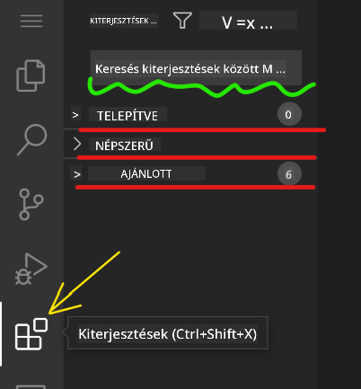

<!--
CO_OP_TRANSLATOR_METADATA:
{
  "original_hash": "1ba61d96a11309a2a6ea507496dcf7e5",
  "translation_date": "2025-08-29T10:35:35+00:00",
  "source_file": "8-code-editor/1-using-a-code-editor/README.md",
  "language_code": "hu"
}
-->
# Kódszerkesztő használata

Ez a lecke bemutatja a [VSCode.dev](https://vscode.dev) webalapú kódszerkesztő alapjait, hogy módosíthasd a kódodat és hozzájárulhass egy projekthez anélkül, hogy bármit telepítenél a számítógépedre.

## Tanulási célok

Ebben a leckében megtanulod:

- Hogyan használj kódszerkesztőt egy kódprojektben
- Hogyan kövesd nyomon a változtatásokat verziókezeléssel
- Hogyan testreszabhatod a szerkesztőt a fejlesztéshez

### Előfeltételek

Mielőtt elkezdenéd, szükséged lesz egy [GitHub](https://github.com) fiókra. Látogass el a [GitHub](https://github.com/) oldalra, és hozz létre egy fiókot, ha még nincs.

### Bevezetés

A kódszerkesztő alapvető eszköz a programok írásához és meglévő kódprojektekben való együttműködéshez. Ha megérted egy szerkesztő alapjait és annak funkcióit, akkor ezeket a tudásokat alkalmazhatod a kódírás során.

## Első lépések a VSCode.dev használatával

A [VSCode.dev](https://vscode.dev) egy webalapú kódszerkesztő. Nem szükséges semmit telepítened a használatához, ugyanúgy megnyithatod, mint bármely más weboldalt. A szerkesztő elindításához nyisd meg a következő linket: [https://vscode.dev](https://vscode.dev). Ha nem vagy bejelentkezve a [GitHub](https://github.com/) fiókodba, kövesd az utasításokat a bejelentkezéshez vagy egy új fiók létrehozásához.

Amikor betöltődik, valami ilyesmit kell látnod:


Három fő szekció van, balról jobbra haladva:

1. Az _aktivitási sáv_, amely néhány ikont tartalmaz, például a nagyítót 🔎, a fogaskereket ⚙️ és néhány mást.
2. Az aktivitási sáv kibővített része, amely alapértelmezetten az _Explorer_ (felfedező), más néven _oldalsáv_.
3. És végül a kódterület a jobb oldalon.

Kattints az egyes ikonokra, hogy különböző menüket jeleníts meg. Ha végeztél, kattints az _Explorer_-re, hogy visszatérj az alapértelmezett nézethez.

Amikor elkezdesz kódot írni vagy meglévő kódot módosítani, az a jobb oldali legnagyobb területen fog történni. Ezt a területet használod majd a meglévő kód megtekintésére is, amit a következő lépésben fogsz megtenni.

## GitHub-tárház megnyitása

Az első lépés egy GitHub-tárház megnyitása. Többféleképpen is megnyithatsz egy tárházat. Ebben a szekcióban két különböző módot láthatsz, hogy elkezdhesd a munkát.

### 1. A szerkesztővel

Használd magát a szerkesztőt egy távoli tárház megnyitásához. Ha ellátogatsz a [VSCode.dev](https://vscode.dev) oldalra, látni fogsz egy _"Open Remote Repository"_ gombot:


Használhatod a parancspalettát is. A parancspaletta egy beviteli mező, ahol bármilyen parancs vagy művelet nevét beírhatod, hogy megtaláld a megfelelő parancsot. Használd a bal felső menüt, válaszd a _View_ menüpontot, majd a _Command Palette_ opciót, vagy használd a következő billentyűkombinációt: Ctrl-Shift-P (MacOS-en Command-Shift-P).


Amikor a menü megnyílik, írd be, hogy _open remote repository_, majd válaszd az első opciót. Megjelennek azok a tárházak, amelyeknek tagja vagy, vagy amelyeket nemrég megnyitottál. Használhatsz egy teljes GitHub URL-t is a kiválasztáshoz. Használd a következő URL-t, és illeszd be a mezőbe:

```
https://github.com/microsoft/Web-Dev-For-Beginners
```

✅ Ha sikeres volt, látni fogod a tárház összes fájlját a szövegszerkesztőben.

### 2. Az URL használatával

Egy URL-t közvetlenül is használhatsz egy tárház betöltéséhez. Például a jelenlegi tárház teljes URL-je [https://github.com/microsoft/Web-Dev-For-Beginners](https://github.com/microsoft/Web-Dev-For-Beginners), de a GitHub domain helyett használhatod a `VSCode.dev/github` címet, és közvetlenül betöltheted a tárházat. Az eredményül kapott URL a következő lenne: [https://vscode.dev/github/microsoft/Web-Dev-For-Beginners](https://vscode.dev/github/microsoft/Web-Dev-For-Beginners).

## Fájlok szerkesztése

Miután megnyitottad a tárházat a böngészőben vagy a vscode.dev-en, a következő lépés a projekt frissítése vagy módosítása.

### 1. Új fájl létrehozása

Új fájlt létrehozhatsz egy meglévő mappában, vagy a gyökérkönyvtárban. Egy új fájl létrehozásához nyisd meg azt a helyet/mappát, ahová a fájlt menteni szeretnéd, válaszd a _'New file ...'_ ikont az aktivitási sávon _(bal oldalon)_, adj neki egy nevet, majd nyomj Entert.


### 2. Fájl szerkesztése és mentése a tárházban

A vscode.dev különösen hasznos, ha gyors frissítéseket szeretnél végezni a projekteden anélkül, hogy bármilyen szoftvert helyileg betöltenél.  
A kód frissítéséhez kattints az 'Explorer' ikonra, amely szintén az aktivitási sávon található, hogy megtekinthesd a tárház fájljait és mappáit.  
Válassz ki egy fájlt, hogy megnyisd a kódterületen, végezd el a módosításokat, majd mentsd el.


Miután befejezted a projekt frissítését, válaszd a _`source control`_ ikont, amely tartalmazza az összes új változtatást, amit a tárházadban végeztél.

A projektedben végrehajtott változtatások megtekintéséhez válaszd ki a fájl(oka)t a `Changes` mappában a kibővített aktivitási sávon. Ez megnyit egy 'Working Tree'-t, ahol vizuálisan láthatod a fájlban végrehajtott változtatásokat. A piros a projektből való törlést, míg a zöld a hozzáadást jelzi.


Ha elégedett vagy a végrehajtott változtatásokkal, vidd az egeret a `Changes` mappa fölé, és kattints a `+` gombra a változtatások színpadra állításához. A színpadra állítás azt jelenti, hogy előkészíted a változtatásokat a GitHub-ra való elkötelezéshez.

Ha azonban nem vagy elégedett néhány változtatással, és el akarod vetni őket, vidd az egeret a `Changes` mappa fölé, és válaszd a `visszavonás` ikont.

Ezután írj be egy `commit üzenetet` _(egy leírás a projektben végrehajtott változtatásokról)_, kattints a `pipa ikonra`, hogy elkötelezd és feltöltsd a változtatásokat.

Miután befejezted a munkát a projekten, válaszd a `hamburger menü ikont` a bal felső sarokban, hogy visszatérj a tárházhoz a github.com-on.


## Bővítmények használata

A bővítmények telepítése a VSCode-ban lehetővé teszi új funkciók hozzáadását és a fejlesztési környezet testreszabását, hogy javítsd a fejlesztési munkafolyamatot. Ezek a bővítmények segítenek több programozási nyelv támogatásában, és gyakran általános vagy nyelvspecifikus bővítmények.

A rendelkezésre álló bővítmények listájának böngészéséhez kattints az _`Extensions ikonra`_ az aktivitási sávon, és kezd el beírni a bővítmény nevét a _'Search Extensions in Marketplace'_ mezőbe.  
Egy listát fogsz látni a bővítményekről, amelyek tartalmazzák **a bővítmény nevét, a kiadó nevét, egy mondatos leírást, a letöltések számát** és **egy csillagos értékelést**.


Megtekintheted az összes korábban telepített bővítményt az _`Installed folder`_ kibontásával, a legtöbb fejlesztő által használt népszerű bővítményeket a _`Popular folder`_-ben, valamint az ajánlott bővítményeket, amelyeket vagy az azonos munkaterületen lévő felhasználók, vagy a nemrég megnyitott fájlok alapján javasolnak a _`recommended folder`_-ben.



### 1. Bővítmények telepítése

Egy bővítmény telepítéséhez írd be a bővítmény nevét a keresőmezőbe, és kattints rá, hogy további információkat jeleníts meg róla a kódterületen, amikor megjelenik a kibővített aktivitási sávon.

Kattinthatsz a _kék telepítés gombra_ a kibővített aktivitási sávon, vagy használhatod a kódterületen megjelenő telepítés gombot, miután kiválasztottad a bővítményt.


### 2. Bővítmények testreszabása

A bővítmény telepítése után előfordulhat, hogy módosítanod kell annak működését, és testre kell szabnod az igényeid szerint. Ehhez válaszd ki a Bővítmények ikont, és ezúttal a bővítményed megjelenik az _Installed folder_-ben. Kattints a _**Fogaskerék ikonra**_, majd navigálj az _Extensions Setting_ menüponthoz.


### 3. Bővítmények kezelése

A bővítmény telepítése és használata után a vscode.dev különböző lehetőségeket kínál a bővítmény kezelésére az igényeid szerint. Például dönthetsz úgy, hogy:

- **Letiltod:** _(Ideiglenesen letilthatsz egy bővítményt, ha már nincs rá szükséged, de nem akarod teljesen eltávolítani.)_

    Válaszd ki a telepített bővítményt a kibővített aktivitási sávon > kattints a Fogaskerék ikonra > válaszd a 'Disable' vagy 'Disable (Workspace)' opciót **VAGY** Nyisd meg a bővítményt a kódterületen, és kattints a kék Letiltás gombra.

- **Eltávolítod:** Válaszd ki a telepített bővítményt a kibővített aktivitási sávon > kattints a Fogaskerék ikonra > válaszd az 'Uninstall' opciót **VAGY** Nyisd meg a bővítményt a kódterületen, és kattints a kék Eltávolítás gombra.

---

## Feladat

[Hozz létre egy önéletrajz weboldalt a vscode.dev segítségével](https://github.com/microsoft/Web-Dev-For-Beginners/blob/main/8-code-editor/1-using-a-code-editor/assignment.md)

## Áttekintés és önálló tanulás

Olvass többet a [VSCode.dev](https://code.visualstudio.com/docs/editor/vscode-web?WT.mc_id=academic-0000-alfredodeza) funkcióiról és egyéb lehetőségeiről.

---

**Felelősségkizárás**:  
Ez a dokumentum az [Co-op Translator](https://github.com/Azure/co-op-translator) AI fordítási szolgáltatás segítségével készült. Bár törekszünk a pontosságra, kérjük, vegye figyelembe, hogy az automatikus fordítások hibákat vagy pontatlanságokat tartalmazhatnak. Az eredeti dokumentum az eredeti nyelvén tekintendő hiteles forrásnak. Kritikus információk esetén javasolt professzionális, emberi fordítást igénybe venni. Nem vállalunk felelősséget a fordítás használatából eredő félreértésekért vagy téves értelmezésekért.