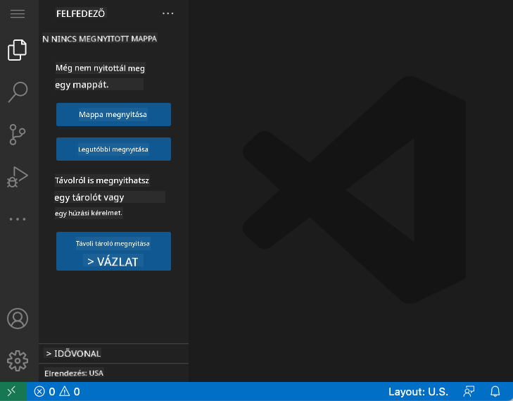
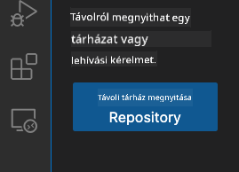
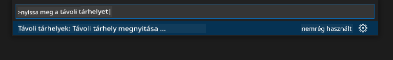

<!--
CO_OP_TRANSLATOR_METADATA:
{
  "original_hash": "cfd4a15974168ca426d50c67682ab9d4",
  "translation_date": "2025-10-24T19:54:10+00:00",
  "source_file": "8-code-editor/1-using-a-code-editor/README.md",
  "language_code": "hu"
}
-->
# Kódszerkesztő használata: VSCode.dev mesterfokon

Emlékszel a *Mátrixra*, amikor Neo hatalmas számítógépes terminálhoz csatlakozott, hogy hozzáférjen a digitális világhoz? A mai webfejlesztési eszközök ennek épp az ellenkezőjét képviselik – hihetetlenül erős funkciók, amelyek bárhonnan elérhetők. A VSCode.dev egy böngészőalapú kódszerkesztő, amely professzionális fejlesztési eszközöket hoz el bármely internetkapcsolattal rendelkező eszközre.

Ahogy a nyomda mindenki számára elérhetővé tette a könyveket, nem csak a kolostorok írnokainak, úgy a VSCode.dev is demokratizálja a kódolást. Dolgozhatsz projekteken könyvtári számítógépen, iskolai laborban, vagy bárhol, ahol böngészőhöz férsz hozzá. Nincs telepítés, nincs "szükségem a saját beállításaimra" korlátozás.

A leckénk végére megérted, hogyan navigálj a VSCode.dev-ben, hogyan nyiss meg GitHub repozitóriumokat közvetlenül a böngésződben, és hogyan használd a Git-et verziókezelésre – mindezek olyan készségek, amelyeket a profi fejlesztők naponta alkalmaznak.

## Amit megtanulsz

Miután végigmentünk ezen, képes leszel:

- Úgy navigálni a VSCode.dev-ben, mintha a második otthonod lenne – mindent megtalálsz, anélkül hogy eltévednél
- Bármely GitHub repozitóriumot megnyitni a böngésződben, és azonnal szerkeszteni (ez tényleg varázslatos!)
- A Git segítségével nyomon követni a változásokat és profi módon menteni a munkádat
- Felturbózni a szerkesztőt bővítményekkel, amelyek gyorsabbá és szórakoztatóbbá teszik a kódolást
- Magabiztosan létrehozni és rendszerezni projektfájlokat

## Amire szükséged lesz

A követelmények egyszerűek:

- Egy ingyenes [GitHub fiók](https://github.com) (ha szükséges, segítünk létrehozni)
- Alapvető ismeretek a webböngészőkről
- A GitHub Alapok lecke hasznos háttérinformációkat nyújt, bár nem elengedhetetlen

> 💡 **Új vagy a GitHub-on?** A fiók létrehozása ingyenes és percek alatt megvan. Ahogy egy könyvtári kártya hozzáférést biztosít a világ könyveihez, úgy egy GitHub fiók megnyitja az ajtót az interneten található kódrepozitóriumokhoz.

## Miért fontosak a webalapú kódszerkesztők?

Az internet előtt a tudósok különböző egyetemeken nem tudták könnyen megosztani a kutatásaikat. Aztán jött az ARPANET az 1960-as években, amely távolságokon át összekapcsolta a számítógépeket. A webalapú kódszerkesztők ugyanezt az elvet követik – erős eszközöket tesznek elérhetővé, függetlenül a fizikai helytől vagy az eszköztől.

A kódszerkesztő a fejlesztési munkaterület, ahol kódot írsz, szerkesztesz és rendszerezel. Az egyszerű szövegszerkesztőkkel szemben a professzionális kódszerkesztők szintaxiskiemelést, hibadetektálást és projektmenedzsment funkciókat kínálnak.

A VSCode.dev ezeket a képességeket hozza el a böngésződbe:

**Webalapú szerkesztés előnyei:**

| Funkció | Leírás | Gyakorlati előny |
|---------|-------------|----------|
| **Platformfüggetlenség** | Bármely böngészővel rendelkező eszközön fut | Zökkenőmentes munka különböző számítógépeken |
| **Nincs szükség telepítésre** | Webes URL-en keresztül érhető el | Kikerülheted a szoftvertelepítési korlátozásokat |
| **Automatikus frissítések** | Mindig a legújabb verzió fut | Új funkciók elérése kézi frissítések nélkül |
| **Repozitórium integráció** | Közvetlen kapcsolat a GitHub-bal | Kód szerkesztése helyi fájlkezelés nélkül |

**Gyakorlati következmények:**
- Folyamatos munka különböző környezetekben
- Egységes felület operációs rendszertől függetlenül
- Azonnali együttműködési lehetőségek
- Csökkentett helyi tárhelyigény

## A VSCode.dev felfedezése

Ahogy Marie Curie laboratóriuma kifinomult eszközöket tartalmazott egy viszonylag egyszerű térben, úgy a VSCode.dev is professzionális fejlesztési eszközöket csomagol egy böngészőfelületbe. Ez a webes alkalmazás ugyanazokat az alapvető funkciókat kínálja, mint az asztali kódszerkesztők.

Kezdd azzal, hogy megnyitod a [vscode.dev](https://vscode.dev) oldalt a böngésződben. Az interfész letöltések vagy rendszertelepítések nélkül töltődik be – a felhőalapú számítástechnika elveinek közvetlen alkalmazása.

### GitHub fiók összekapcsolása

Ahogy Alexander Graham Bell telefonja távoli helyeket kötött össze, a GitHub fiókod összekapcsolása hidat képez a VSCode.dev és a kódrepozitóriumaid között. Amikor a rendszer kéri, hogy jelentkezz be a GitHub-ba, érdemes elfogadni ezt a kapcsolatot.

**GitHub integráció előnyei:**
- Közvetlen hozzáférés a repozitóriumaidhoz a szerkesztőn belül
- Szinkronizált beállítások és bővítmények eszközök között
- Egyszerűsített mentési munkafolyamat a GitHub-ra
- Személyre szabott fejlesztési környezet

### Az új munkaterület megismerése

Amikor minden betöltődik, egy gyönyörűen letisztult munkaterületet látsz, amelyet arra terveztek, hogy arra koncentrálj, ami igazán számít – a kódodra!

**Íme a környék bemutatása:**
- **Tevékenységsáv** (a bal oldali csík): Fő navigációs eszközöd az Explorer 📁, Keresés 🔍, Verziókezelés 🌿, Bővítmények 🧩 és Beállítások ⚙️ között
- **Oldalsáv** (a mellette lévő panel): Az általad kiválasztott funkcióhoz kapcsolódó információkat mutatja
- **Szerkesztőterület** (a nagy középső rész): Itt történik a varázslat – ez a fő kódolási terület

**Szánj egy pillanatot a felfedezésre:**
- Kattints a Tevékenységsáv ikonokra, és nézd meg, mit csinálnak
- Figyeld meg, hogyan frissül az oldalsáv különböző információkkal – elég menő, ugye?
- Az Explorer nézet (📁) valószínűleg az a hely, ahol a legtöbb időt töltöd, szóval szokj hozzá

## GitHub repozitóriumok megnyitása

Az internet előtt a kutatóknak fizikailag kellett utazniuk könyvtárakba, hogy hozzáférjenek dokumentumokhoz. A GitHub repozitóriumok hasonlóan működnek – távolról tárolt kódgyűjtemények. A VSCode.dev kiküszöböli a hagyományos lépést, hogy a repozitóriumokat le kell tölteni a helyi gépre szerkesztés előtt.

Ez a funkció lehetővé teszi, hogy bármely nyilvános repozitóriumot azonnal megnyiss, szerkeszd vagy hozzájárulj hozzá. Íme két módszer a repozitóriumok megnyitására:

### 1. módszer: A kattintós megoldás

Ez tökéletes, ha frissen kezded a VSCode.dev használatát, és egy konkrét repozitóriumot szeretnél megnyitni. Egyszerű és kezdőbarát:

**Így csináld:**

1. Lépj a [vscode.dev](https://vscode.dev) oldalra, ha még nem vagy ott
2. Keresd meg a "Open Remote Repository" gombot a kezdőképernyőn, és kattints rá

   

3. Illeszd be bármely GitHub repozitórium URL-jét (próbáld ki ezt: `https://github.com/microsoft/Web-Dev-For-Beginners`)
4. Nyomj Entert, és figyeld a varázslatot!

**Profi tipp - A Command Palette gyorsbillentyű:**

Szeretnél úgy érezni, mint egy kódoló varázsló? Próbáld ki ezt a billentyűkombinációt: Ctrl+Shift+P (vagy Mac-en Cmd+Shift+P), hogy megnyisd a Command Palette-et:

**A Command Palette olyan, mint egy keresőmotor mindenhez, amit csinálhatsz:**
- Írd be, hogy "open remote", és megtalálja neked a repozitórium megnyitót
- Emlékszik a nemrég megnyitott repozitóriumokra (szuper hasznos!)
- Ha megszokod, villámgyorsan tudsz kódolni
- Ez gyakorlatilag a VSCode.dev "Hey Siri-je, de kódoláshoz"

### 2. módszer: URL módosítási technika

Ahogy a HTTP és HTTPS különböző protokollokat használ, miközben megtartja ugyanazt a domain struktúrát, úgy a VSCode.dev is egy URL mintát használ, amely tükrözi a GitHub címzési rendszerét. Bármely GitHub repozitórium URL módosítható, hogy közvetlenül megnyíljon a VSCode.dev-ben.

**URL átalakítási minta:**

| Repozitórium típusa | GitHub URL | VSCode.dev URL |
|----------------|---------------------|----------------|
| **Nyilvános repozitórium** | `github.com/microsoft/Web-Dev-For-Beginners` | `vscode.dev/github/microsoft/Web-Dev-For-Beginners` |
| **Személyes projekt** | `github.com/your-username/my-project` | `vscode.dev/github/your-username/my-project` |
| **Bármely elérhető repo** | `github.com/their-username/awesome-repo` | `vscode.dev/github/their-username/awesome-repo` |

**Megvalósítás:**
- Cseréld le a `github.com`-ot `vscode.dev/github`-ra
- Tartsd meg az URL többi elemét változatlanul
- Bármely nyilvánosan elérhető repozitóriummal működik
- Azonnali szerkesztési hozzáférést biztosít

> 💡 **Életet megváltoztató tipp**: Könyvjelzőzd a kedvenc repozitóriumaid VSCode.dev verzióit. Nekem vannak olyan könyvjelzőim, mint "Edit My Portfolio" és "Fix Documentation", amelyek közvetlenül szerkesztési módba visznek!

**Melyik módszert használd?**
- **Az interfész módszer**: Nagyszerű, ha felfedezel, vagy nem emlékszel pontos repozitórium nevekre
- **Az URL trükk**: Tökéletes villámgyors hozzáféréshez, ha pontosan tudod, hová tartasz

## Fájlok és projektek kezelése

Most, hogy megnyitottál egy repozitóriumot, kezdjünk építkezni! A VSCode.dev mindent megad, amire szükséged van a kód fájlok létrehozásához, szerkesztéséhez és rendszerezéséhez. Gondolj rá úgy, mint a digitális műhelyedre – minden eszköz ott van, ahol szükséged van rá.

Merüljünk el a mindennapi feladatokban, amelyek a kódolási munkafolyamatod nagy részét alkotják.

### Új fájlok létrehozása

Ahogy egy építész irodájában a tervrajzokat rendszerezik, a fájl létrehozás a VSCode.dev-ben strukturált megközelítést követ. A rendszer támogatja az összes szabványos webfejlesztési fájltípust.

**Fájl létrehozási folyamat:**

1. Navigálj a célmappához az Explorer oldalsávban
2. Vidd az egérmutatót a mappanévre, hogy megjelenjen az "Új fájl" ikon (📄+)
3. Írd be a fájlnevet a megfelelő kiterjesztéssel (`style.css`, `script.js`, `index.html`)
4. Nyomj Entert a fájl létrehozásához

**Elnevezési konvenciók:**
- Használj leíró neveket, amelyek utalnak a fájl céljára
- Tartalmazd a fájlkiterjesztéseket a megfelelő szintaxiskiemeléshez
- Kövesd a konzisztens elnevezési mintákat a projektekben
- Használj kisbetűket és kötőjeleket szóközök helyett

### Fájlok szerkesztése és mentése

Itt kezdődik az igazi móka! A VSCode.dev szerkesztője tele van hasznos funkciókkal, amelyek gördülékennyé és intuitívvá teszik a kódolást. Olyan, mintha lenne egy nagyon okos írássegéded, de kódhoz.

**Szerkesztési munkafolyamat:**

1. Kattints bármely fájlra az Explorerben, hogy megnyíljon a fő területen
2. Kezdj el gépelni, és figyeld, ahogy a VSCode.dev segít színekkel, javaslatokkal és hibajelzéssel
3. Mentsd el a munkádat Ctrl+S (Windows/Linux) vagy Cmd+S (Mac) billentyűkombinációval – bár automatikusan is ment!

**A menő dolgok, amelyek kódolás közben történnek:**
- A kódod gyönyörűen színezett lesz, így könnyen olvasható
- A VSCode.dev javaslatokat tesz gépelés közben (mint az automatikus javítás, de sokkal okosabb)
- Elkapja a hibákat és elírásokat, mielőtt mentenéd
- Több fájlt is megnyithatsz lapokon, akárcsak egy böngészőben
- Minden automatikusan mentődik a háttérben

> ⚠️ **Gyors tipp**: Bár az automatikus mentés vigyáz rád, a Ctrl+S vagy Cmd+S megnyomása még mindig jó szokás. Azonnal ment mindent, és néhány extra hasznos funkciót is aktivál, például a hibakeresést.

### Verziókezelés a Git segítségével

Ahogy a régészek részletes feljegyzéseket készítenek az ásatási rétegekről, úgy a Git nyomon követi a kódod változásait az idő múlásával. Ez a rendszer megőrzi a projekt történetét, és lehetővé teszi, hogy visszatérj korábbi verziókhoz, ha szükséges. A VSCode.dev beépített Git funkciókat tartalmaz.

**Verziókezelési felület:**

1. Lépj be a Verziókezelés panelbe a 🌿 ikon segítségével a Tevékenységsávban
2. A módosított fájlok megjelennek a "Változások" szekcióban
3. A színkódolás jelzi a változások típusát: zöld a hozzáadásokhoz, piros a törlésekhez

![Változások megtekintése a Verzió
- Minden bővítmény értékeléseket, letöltési számokat és valódi felhasználói véleményeket mutat
- Képernyőképeket és egyértelmű leírásokat kapsz arról, hogy mit csinál az adott bővítmény
- Minden egyértelműen jelölve van kompatibilitási információkkal
- Hasonló bővítményeket javasolnak, hogy összehasonlíthasd az opciókat

### Bővítmények telepítése (Szuper egyszerű!)

Új funkciók hozzáadása a szerkesztődhöz olyan egyszerű, mint egy gomb megnyomása. A bővítmények másodpercek alatt települnek, és azonnal működni kezdenek – nincs újraindítás, nincs várakozás.

**Csak ennyit kell tenned:**

1. Keress rá arra, amit szeretnél (próbáld ki például a "live server" vagy "prettier" keresést)
2. Kattints arra, amelyik jónak tűnik, hogy megnézd a részleteket
3. Olvasd el, mit csinál, és nézd meg az értékeléseket
4. Nyomd meg a kék "Install" gombot, és kész is vagy!

**Mi történik a háttérben:**
- A bővítmény automatikusan letöltődik és beállítja magát
- Az új funkciók azonnal megjelennek a felületen
- Minden azonnal működni kezd (komolyan, ennyire gyors!)
- Ha be vagy jelentkezve, a bővítmény szinkronizálódik az összes eszközödre

**Néhány bővítmény, amit ajánlok kezdéshez:**
- **Live Server**: Nézd meg, ahogy a weboldalad valós időben frissül, miközben kódolsz (ez varázslatos!)
- **Prettier**: Automatikusan tisztává és professzionálissá teszi a kódodat
- **Auto Rename Tag**: Ha megváltoztatsz egy HTML tag-et, a párja is frissül
- **Bracket Pair Colorizer**: Színesíti a zárójeleket, hogy soha ne vessz el
- **GitLens**: Felturbózza a Git funkciókat rengeteg hasznos információval

### Bővítmények testreszabása

A legtöbb bővítmény beállításokkal érkezik, amelyeket módosíthatsz, hogy pontosan úgy működjenek, ahogy szeretnéd. Gondolj rá úgy, mint az autó üléseinek és tükrének beállítására – mindenkinek megvannak a saját preferenciái!

**Bővítmény beállítások módosítása:**

1. Keresd meg a telepített bővítményt az Extensions panelen
2. Keresd meg a kis fogaskerék ikont (⚙️) a neve mellett, és kattints rá
3. Válaszd az "Extension Settings" opciót a legördülő menüből
4. Állítsd be a dolgokat úgy, hogy tökéletesen illeszkedjenek a munkafolyamatodhoz

**Gyakori dolgok, amiket érdemes módosítani:**
- Hogyan formázza a kódot (tabulátorok vs szóközök, sorhossz, stb.)
- Melyik billentyűkombináció indít különböző műveleteket
- Milyen fájltípusokkal működjön a bővítmény
- Bizonyos funkciók ki- vagy bekapcsolása, hogy tisztább legyen a környezet

### Bővítmények rendszerezése

Ahogy egyre több szuper bővítményt fedezel fel, érdemes rendben tartani a gyűjteményedet, hogy minden zökkenőmentesen működjön. A VSCode.dev ezt nagyon egyszerűvé teszi.

**Bővítménykezelési opciók:**

| Mit tehetsz | Mikor hasznos | Profi tipp |
|--------|---------|----------|
| **Letiltás** | Ha tesztelni szeretnéd, hogy egy bővítmény okoz-e problémát | Jobb, mint eltávolítani, ha később még szükséged lehet rá |
| **Eltávolítás** | Teljesen törölni a nem szükséges bővítményeket | Tisztán és gyorsan tartja a környezetet |
| **Frissítés** | A legújabb funkciók és hibajavítások beszerzése | Általában automatikusan történik, de érdemes ellenőrizni |

**Hogyan szoktam kezelni a bővítményeket:**
- Néhány havonta átnézem, mit telepítettem, és eltávolítom, amit nem használok
- Frissen tartom a bővítményeket, hogy megkapjam a legújabb fejlesztéseket és biztonsági javításokat
- Ha valami lassúnak tűnik, ideiglenesen letiltom a bővítményeket, hogy kiderítsem, melyik okozza a problémát
- Elolvasom a frissítési jegyzeteket, amikor a bővítmények nagyobb frissítést kapnak – néha szuper új funkciók vannak benne!

> ⚠️ **Teljesítmény tipp**: A bővítmények fantasztikusak, de túl sok lelassíthatja a rendszert. Koncentrálj azokra, amelyek valóban megkönnyítik az életed, és ne félj eltávolítani azokat, amelyeket soha nem használsz.

## GitHub Copilot Agent Kihívás 🚀

Ahogy a NASA strukturált megközelítést alkalmaz az űrmissziókhoz, ez a kihívás a VSCode.dev készségek szisztematikus alkalmazását igényli egy teljes munkafolyamat-szcenárióban.

**Cél:** Mutasd be a VSCode.dev használatában való jártasságodat egy átfogó webfejlesztési munkafolyamat létrehozásával.

**Projekt követelmények:** Az Agent mód segítségével végezd el ezeket a feladatokat:
1. Forkolj egy meglévő repót vagy hozz létre egy újat
2. Hozz létre egy működő projektstruktúrát HTML, CSS és JavaScript fájlokkal
3. Telepíts és konfigurálj három fejlesztést segítő bővítményt
4. Gyakorold a verziókezelést leíró commit üzenetekkel
5. Kísérletezz feature branch létrehozásával és módosításával
6. Dokumentáld a folyamatot és a tanulságokat egy README.md fájlban

Ez a gyakorlat összefoglalja a VSCode.dev koncepcióit egy gyakorlati munkafolyamatban, amelyet a jövőbeli fejlesztési projektekben is alkalmazhatsz.

További információ az [Agent módról](https://code.visualstudio.com/blogs/2025/02/24/introducing-copilot-agent-mode) itt.

## Feladat

Ideje élesben kipróbálni ezeket a készségeket! Van egy gyakorlati projekt, amely lehetővé teszi, hogy mindent gyakorolj, amit eddig tanultunk: [Készíts egy önéletrajz weboldalt a VSCode.dev segítségével](./assignment.md)

Ez a feladat végigvezet egy professzionális önéletrajz weboldal elkészítésén, teljes egészében a böngésződben. Használni fogod az összes VSCode.dev funkciót, amit felfedeztünk, és a végére lesz egy nagyszerű kinézetű weboldalad, valamint magabiztosságod az új munkafolyamatodban.

## Fedezd fel és fejleszd tovább a készségeidet

Most már szilárd alapjaid vannak, de rengeteg további szuper dolgot fedezhetsz fel! Íme néhány forrás és ötlet, hogy a VSCode.dev készségeidet a következő szintre emeld:

**Hivatalos dokumentációk, amelyeket érdemes könyvjelzőzni:**
- [VSCode Web Dokumentáció](https://code.visualstudio.com/docs/editor/vscode-web?WT.mc_id=academic-0000-alfredodeza) – A böngészőalapú szerkesztés teljes útmutatója
- [GitHub Codespaces](https://docs.github.com/en/codespaces) – Ha még több felhőalapú erőre van szükséged

**Szuper funkciók, amiket érdemes kipróbálni:**
- **Billentyűkombinációk**: Tanuld meg azokat a kombinációkat, amelyekkel igazi kódoló nindzsa lehetsz
- **Munkaterület beállítások**: Állítsd be különböző környezeteket különböző projekttípusokhoz
- **Multi-root Workspaces**: Dolgozz egyszerre több repón (nagyon hasznos!)
- **Terminál integráció**: Használj parancssori eszközöket közvetlenül a böngésződben

**Gyakorlási ötletek:**
- Ugorj bele néhány nyílt forráskódú projektbe, és járulj hozzá a VSCode.dev használatával – ez egy nagyszerű módja annak, hogy visszaadj!
- Próbálj ki különböző bővítményeket, hogy megtaláld a tökéletes beállítást
- Készíts projekt sablonokat azokhoz a weboldalakhoz, amelyeket leggyakrabban építesz
- Gyakorold a Git munkafolyamatokat, mint például az ágazás és az egyesítés – ezek a készségek aranyat érnek csapatprojektekben

---

**Mesterévé váltál a böngészőalapú fejlesztésnek!** 🎉 Ahogy a hordozható műszerek feltalálása lehetővé tette a tudósok számára, hogy távoli helyeken végezzenek kutatásokat, a VSCode.dev lehetővé teszi a professzionális kódolást bármely internetkapcsolattal rendelkező eszközről.

Ezek a készségek tükrözik a jelenlegi iparági gyakorlatokat – sok profi fejlesztő használ felhőalapú fejlesztési környezeteket azok rugalmassága és hozzáférhetősége miatt. Olyan munkafolyamatot tanultál meg, amely az egyéni projektektől a nagy csapatmunkákig skálázható.

Alkalmazd ezeket a technikákat a következő fejlesztési projektedben! 🚀

---

**Felelősség kizárása**:  
Ez a dokumentum az [Co-op Translator](https://github.com/Azure/co-op-translator) AI fordítási szolgáltatás segítségével lett lefordítva. Bár törekszünk a pontosságra, kérjük, vegye figyelembe, hogy az automatikus fordítások hibákat vagy pontatlanságokat tartalmazhatnak. Az eredeti dokumentum az eredeti nyelvén tekintendő hiteles forrásnak. Kritikus információk esetén javasolt professzionális emberi fordítást igénybe venni. Nem vállalunk felelősséget semmilyen félreértésért vagy téves értelmezésért, amely a fordítás használatából eredhet.