# Kódszerkesztő használata: VSCode.dev mesterfokon

Emlékszel *Mátrix*-ban, amikor Neo-nak egy hatalmas számítógépes terminálhoz kellett csatlakoznia, hogy elérje a digitális világot? A mai webfejlesztő eszközök ennek az ellenkezője – hihetetlenül erőteljes képességek, amik bárhonnan hozzáférhetők. A VSCode.dev egy böngésző alapú kódszerkesztő, amely profi fejlesztői eszközöket hoz bármely internetkapcsolattal rendelkező eszközre.

Ahogy a nyomda feltalálása lehetővé tette, hogy a könyveket bárki elérhesse, nem csak a kolostorok írnokai, úgy a VSCode.dev demokratizálja a kódolást. Dolgozhatsz projektekben a könyvtár számítógépén, az iskolai laborban, vagy bárhol, ahol böngészőhöz férsz. Nincs telepítés, nincs „csak a saját beállításom kell” korlátozás.

A tanfolyam végére meg fogod érteni, hogyan navigálj a VSCode.dev-ben, hogyan nyiss közvetlenül GitHub tárházakat a böngésződben, és hogyan használd a Git-et verziókezeléshez – azok a képességek, melyekre a profi fejlesztők nap mint nap támaszkodnak.

## ⚡ Mit tehetsz a következő 5 percben

**Gyors indítás elfoglalt fejlesztőknek**

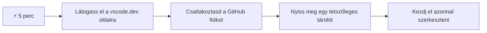
- **1. perc**: Lépj a [vscode.dev](https://vscode.dev) oldalra – telepítés nem szükséges
- **2. perc**: Jelentkezz be GitHub-fiókkal, hogy összekapcsold a tárhelyeidet
- **3. perc**: Próbáld ki az URL trükköt: cseréld le a `github.com`-ot `vscode.dev/github`-re bármelyik repo URL-ben
- **4. perc**: Hozz létre új fájlt és nézd, ahogy a szintaxiskiemelés automatikusan működik
- **5. perc**: Tegyél egy módosítást és kövesd el a commit-ot a Forráskezelő panelen

**Gyors teszt URL**:  
```
# Transform this:
github.com/microsoft/Web-Dev-For-Beginners

# Into this:
vscode.dev/github/microsoft/Web-Dev-For-Beginners
```
  
**Miért fontos ez?**: 5 perc alatt megtapasztalod, milyen szabadságot nyújt a professzionális eszközökből álló, bárhonnan elérhető kódolás. Ez a fejlesztés jövője – elérhető, erőteljes és azonnali.

## 🗺️ Tanulási utad a felhőalapú fejlesztésben

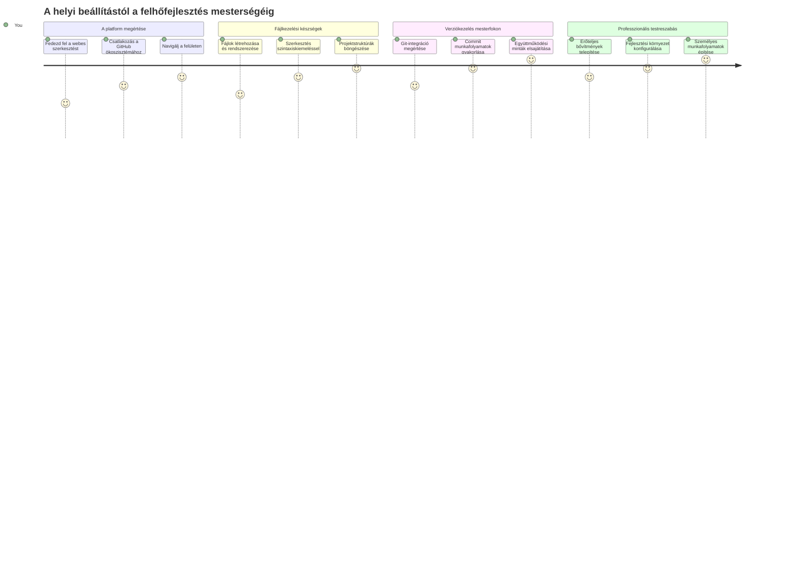
**Úti célod**: A tanfolyam végére profi felhőfejlesztő környezetet sajátítasz el, ami bármilyen eszközön működik, és azt a kódoló eszköztárat használhatod vele, amit a nagy technológiai cégeknél dolgozó fejlesztők is használnak.

## Amit megtanulsz

A közös végigjárás után képes leszel:

- Navigálni a VSCode.dev-ben, mintha a második otthonod lenne – mindent megtalálva könnyedén
- Megnyitni bármely GitHub tárhelyet a böngészőben és azonnal szerkeszteni (ez elég varázslatos!)
- Használni a Git-et a változások követéséhez és a haladásod mentéséhez profi módon
- Kiegészítőkkel felturbózni a szerkesztőt, hogy gyorsabb és szórakoztatóbb legyen a kódolás
- Magabiztosan létrehozni és szervezni projektfájlokat

## Amit szükséged lesz hozzá

Az igények egyszerűek:

- Egy ingyenes [GitHub-fiók](https://github.com) (ha kell, végigvezetünk a létrehozáson)
- Alapfokú ismeret a webböngészőkről
- A GitHub Basics tanfolyam hasznos háttér, de nem elengedhetetlen

> 💡 **Új vagy GitHubon?** A fiók létrehozása ingyenes és pár percet vesz igénybe. Ahogyan a könyvtári olvasójegy világszinten elérhetővé teszi a könyveket, úgy a GitHub-fiók kaput nyit az internetes kód tárhelyekhez.

## 🧠 Felhőalapú fejlesztési ökoszisztéma áttekintés

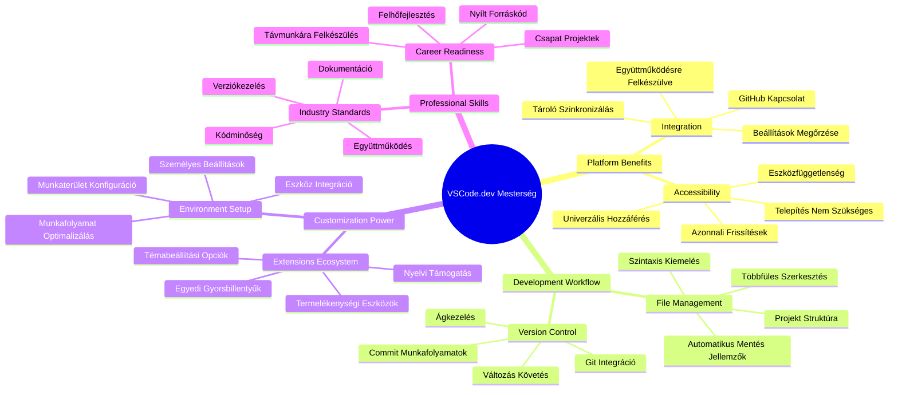
**Alapelv**: A felhőalapú fejlesztő környezetek a kódolás jövőjét jelentik – profi eszközök, melyek elérhetők, együttműködőek és platformfüggetlenek.

## Miért fontosak a webes kódszerkesztők?

Az internet előtt a tudósok különböző egyetemeken nehezen tudták megosztani kutatásaikat. A 60-as években érkezett az ARPANET, amely gépeket kötött össze távolságokon át. A webes kódszerkesztők ugyanilyen elven működnek: erőteljes eszközöket tesznek elérhetővé függetlenül a fizikai helyedtől vagy eszközödtől.

A kódszerkesztő a fejlesztő munkaterülete, ahol kódot írsz, szerkesztesz és rendszerezel. Az egyszerű szövegszerkesztőkkel ellentétben a profi szerkesztők szintaxiskiemelést, hibafelismerést és projektkezelési funkciókat nyújtanak.

A VSCode.dev ezeket hozza el a böngésződbe:

**A webes szerkesztés előnyei:**

| Jellemző | Leírás | Gyakorlati előny |
|---------|-------------|----------|
| **Platformfüggetlenség** | Bármely böngészővel rendelkező eszközön fut | Különböző számítógépekről is zökkenőmentes munka |
| **Nincs szükség telepítésre** | Webes URL-en keresztüli elérés | Megkerülöd a szoftvertelepítési korlátokat |
| **Automatikus frissítések** | Mindig a legfrissebb verzió fut | Az új funkciók manuális frissítés nélkül elérhetők |
| **Tárhely integráció** | Közvetlen kapcsolat GitHubbal | Kód szerkesztése helyi fájlkezelés nélkül |

**Gyakorlati hatások:**
- Munkafolyamat folytonosság különböző környezetek között
- Konzisztens felület operációs rendszertől függetlenül
- Azonnali együttműködési lehetőségek
- Kevesebb lokális tárhelyigény

## Felfedezzük a VSCode.dev-et

Ahogy Marie Curie laborja kifinomult felszereléseket tartalmazott viszonylag egyszerű térben, úgy a VSCode.dev profi fejlesztői eszközöket sűrít egy böngészőalapú felületbe. Ez a webalkalmazás ugyanazt a központi funkcionalitást nyújtja, mint az asztali kódszerkesztők.

Kezdj azzal, hogy megnyitod a [vscode.dev](https://vscode.dev) oldalt a böngésződben. A felület letöltés vagy rendszertelepítés nélkül töltődik be – közvetlen megvalósítása a felhőalapú számítástechnika elveinek.

### GitHub fiók összekapcsolása

Ahogyan Alexander Graham Bell telefonja távoli helyeket kötött össze, a GitHub-fiókod összekapcsolása összeköti a VSCode.dev-et a kódtárhelyeiddel. Ha a GitHub bejelentkezésre kér, ajánlott elfogadni a kapcsolatot.

**A GitHub integráció biztosítja:**
- Közvetlen hozzáférést a tárhelyeidhez a szerkesztőn belül
- Szinkronizált beállításokat és kiegészítőket eszközök között
- Egyszerűsített mentési munkafolyamatot a GitHub felé
- Személyre szabott fejlesztői környezetet

### Megismered az új munkaterületedet

Miután minden betöltődött, egy gyönyörűen letisztult munkaterületet látsz, ami úgy van tervezve, hogy a fontos dolgokra – a kódodra! – koncentrálhass!

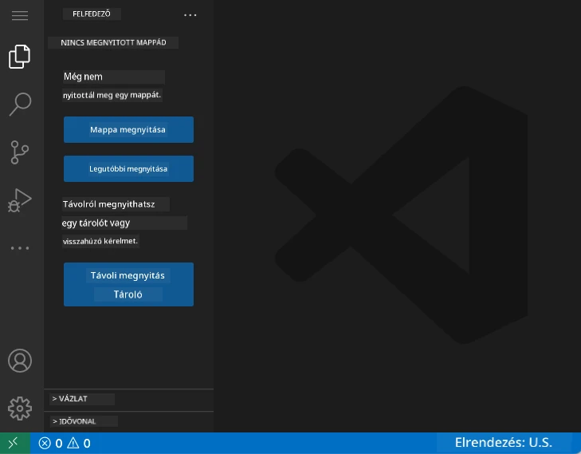

**Íme, a városrész bemutatója:**
- **Aktivitás sáv** (bal oldali csík): a fő navigációd az Explorer 📁, Keresés 🔍, Forrás vezérlés 🌿, Kiegészítők 🧩 és Beállítások ⚙️ között
- **Oldalsáv** (mellette lévő panel): a kiválasztott elemhez kapcsolódó releváns információkat mutatja
- **Szerkesztő terület** (a középső nagy rész): itt zajlik a varázslat – a fő kódolási felület

**Szánj egy percet a felfedezésre:**
- Kattints az Aktivitás sáv ikonokra és nézd meg, mit csinál mindegyik
- Figyeld, hogyan változik az oldalsáv az információkhoz – elég menő, igaz?
- Az Explorer nézet (📁) lesz valószínűleg a legtöbb időd helyszíne, ismerkedj meg vele

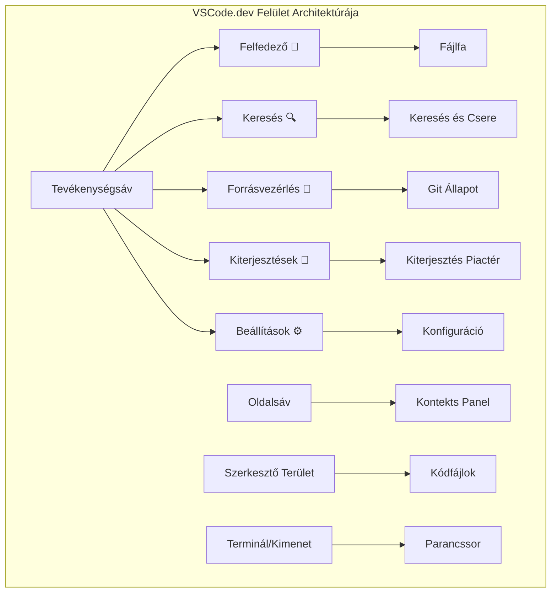
## GitHub tárhelyek megnyitása

Az internet előtt a kutatóknak fizikailag el kellett utazniuk könyvtárakba, hogy hozzáférjenek dokumentumokhoz. A GitHub tárhelyek hasonlóan működnek – kód gyűjtemények távol tárolva. A VSCode.dev megszünteti a hagyományos lépést, mely szerint le kellett tölteni a tárat a helyi gépre szerkesztés előtt.

Ez a képesség azonnali hozzáférést tesz lehetővé bármely nyilvános tárhelyhez megtekintésre, szerkesztésre vagy hozzájárulásra. Íme két mód a tárhelyek megnyitására:

### 1. módszer: Kattintgatós megoldás

Ez tökéletes, ha frissen indulsz a VSCode.dev-ben és meg akarsz nyitni egy konkrét tárhelyet. Egyszerű és kezdőknek való:

**Így csináld:**

1. Lépj a [vscode.dev](https://vscode.dev) oldalra, ha még nem vagy ott
2. Keresd meg a "Open Remote Repository" gombot a kezdőképernyőn, és kattints rá

   

3. Illeszd be bármely GitHub tárhely URL-jét (próbáld ki ezt: `https://github.com/microsoft/Web-Dev-For-Beginners`)
4. Nyomj Entert és figyeld a varázslatot!

**Pro tipp - Parancspaletta gyorsbillentyű:**

Szeretnél kódvarázslónak érezni magad? Próbáld ezt a billentyűkombinációt: Ctrl+Shift+P (Macen Cmd+Shift+P), hogy megnyisd a Parancspalettát:


**A Parancspaletta olyan, mint egy keresőmotor mindennek, amit csinálhatsz:**
- Írd be, hogy "open remote", és megtalálja a távoli tárhely megnyitóját
- Megjegyzi, milyen tárhelyeket nyitottál meg mostanában (nagyon hasznos!)
- Ha megszokod, úgy fogsz kódolni, mint a villám
- Ez lényegében a VSCode.dev "Hey Siri-je" kódoláshoz

### 2. módszer: URL módosítási trükk

Ahogy az HTTP és HTTPS külön protokollként működnek ugyanazzal a domain struktúrával, úgy a VSCode.dev egy URL mintát használ, ami a GitHub címezési rendszerét tükrözi. Bármely GitHub tárhely URL-je módosítható, hogy közvetlenül a VSCode.dev-ben nyíljon meg.

**URL átalakítási minta:**

| Tárhely típus | GitHub URL | VSCode.dev URL |
|----------------|---------------------|----------------|
| **Nyilvános tárhely** | `github.com/microsoft/Web-Dev-For-Beginners` | `vscode.dev/github/microsoft/Web-Dev-For-Beginners` |
| **Saját projekt** | `github.com/your-username/my-project` | `vscode.dev/github/your-username/my-project` |
| **Bármi elérhető repo** | `github.com/their-username/awesome-repo` | `vscode.dev/github/their-username/awesome-repo` |

**Megvalósítás:**
- Cseréld le a `github.com`-ot `vscode.dev/github`-re
- A többi URL összetevőt változatlanul hagyod
- Működik bármely nyilvánosan elérhető tárhellyel
- Azonnali szerkesztési hozzáférést biztosít

> 💡 **Életmentő tipp**: Kövesd le könyvjelzőként VSCode.dev változatban kedvenc tárhelyeidet. Nekem vannak olyanok, mint „Szerkessz portfóliót” vagy „Dokumentáció javítása”, amelyek egyből szerkesztési módba visznek!

**Melyik módszert használd?**
- **Felületes út**: Jó, ha felfedezel vagy nem emlékszel pontos tárhelynevekre
- **URL trükk**: Hibátlanul gyors elérés, amikor tudod, hová akarsz menni

### 🎯 Pedagógiai visszacsatolás: felhőfejlesztési hozzáférés

**Állj meg és gondolkodj:** Most két módszert tanultál a kódtárhelyek webes böngészőn keresztüli elérésére. Ez alapvető változást jelent a fejlesztésben.

**Gyors önértékelés:**
- Tudod magyarázni, miért szünteti meg a webes szerkesztés a hagyományos "fejlesztő környezet beállítást"?
- Milyen előnyei vannak az URL módosítási technikának a helyi git klónozással szemben?
- Hogyan változtathatja meg ez a megközelítés a nyílt forráskódú projektekhez való hozzájárulást?

**Kapcsolódás a valós világhoz:** Olyan nagy cégek, mint a GitHub, GitLab és Replit a felhő-központú elvekre építették fejlesztői platformjukat. Te ugyanazokat a munkafolyamatokat tanulod, melyeket profi fejlesztő csapatok használnak világszerte.

**Kihívás kérdés:** Hogyan változtathatja meg a felhőalapú fejlesztés az iskolai kódolás tanítását? Gondolj az eszközigényre, szoftverkezelésre és együttműködési lehetőségekre.

## Dolgozás fájlokkal és projektekkel

Most, hogy megnyitottál egy tárhelyet, kezdjünk az építkezéssel! A VSCode.dev mindent megad, ami kell a kód fájlok létrehozásához, szerkesztéséhez és rendszerezéséhez. Gondolj rá úgy, mint a digitális műhelyed – minden eszköz ott van, ahol szükséged van rá.

Nézzük meg a mindennapi feladatokat, amik a kódolási munkafolyamatod nagy részét adják majd.

### Új fájlok létrehozása

Ahogy egy építész irodájában a tervrajzok rendszerezettek, úgy a fájl létrehozás a VSCode.dev-ben struktúráltan zajlik. A rendszer támogat minden szabványos webfejlesztői fájltípust.

**Fájl létrehozási folyamat:**

1. Navigálj a célmappába az Explorer oldalsávban
2. Mozgasd az egeret a mappa neve fölé, hogy megjelenjen az "Új fájl" ikon (📄+)
3. Írd be a fájl nevét a megfelelő kiterjesztéssel (`style.css`, `script.js`, `index.html`)
4. Nyomj Entert a fájl létrehozásához

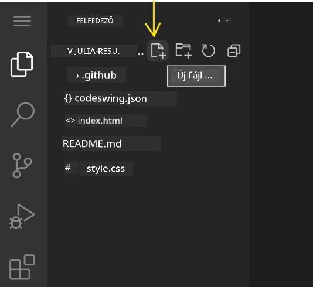

**Névzési szabályok:**
- Használj leíró neveket, amelyek jelzik a fájl célját
- Tartsd meg a fájlkiterjesztést a helyes szintaxiskiemeléshez
- Kövesd a konzisztens névadási mintákat a projektekben
- Kisbetűk és kötőjelek használata szóközök helyett

### Fájlok szerkesztése és mentése

Itt kezdődik az igazi móka! A VSCode.dev szerkesztője tele van hasznos funkciókkal, amelyek gördülékennyé és intuitívvá teszik a kód dolgot. Olyan, mintha egy nagyon okos író asszisztensed lenne, csak kódhoz.

**Szerkesztési munkafolyamatod:**

1. Kattints bármely fájlra az Explorerben, hogy megnyisd a fő szerkesztőterületen
2. Kezdj el gépelni és nézd, hogyan segít a VSCode.dev színekkel, javaslatokkal és hibafelismeréssel
3. Mentsd el munkád Ctrl+S (Windows/Linux) vagy Cmd+S (Mac) billentyűkkel – de van automatikus mentés is!

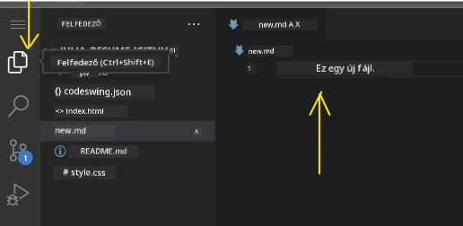

**Ügyes dolgok, amik közben történnek:**
- Kódod gyönyörűen színezett, hogy könnyen olvasható legyen
- A VSCode.dev javaslatokat ad gépelés közben (mint az automatikus javítás, csak okosabb)
- Már mentés előtt felismeri a gépelési hibákat és más problémákat
- Több fájlt is nyithatsz meg fülönként, mint egy böngészőben
- Minden háttérben automatikusan mentődik

> ⚠️ **Gyors tipp**: Bár az automatikus mentés a hátad mögött működik, a Ctrl+S vagy Cmd+S lenyomása jó szokás. Azonnal ment, és elindít extra hasznos funkciókat, például hibakeresést.

### Verziókezelés Git-tel

Ahogy a régészek részletes feljegyzéseket készítenek a feltárás rétegeiről, a Git nyomon követi a kódod változásait az időben. Ez a rendszer megőrzi a projekt történetét, és lehetővé teszi a korábbi verziók visszaállítását szükség esetén. A VSCode.dev integrált Git funkcionalitással rendelkezik.

**Forráskezelő felület:**

1. Nyisd meg a Forráskezelő panelt a 🌿 ikonra kattintva az Aktivitás sávban
2. A módosított fájlok megjelennek a "Changes" (Változások) részben
3. Színkódok jelzik a változtatások típusát: zöld a hozzáadások, piros a törlések

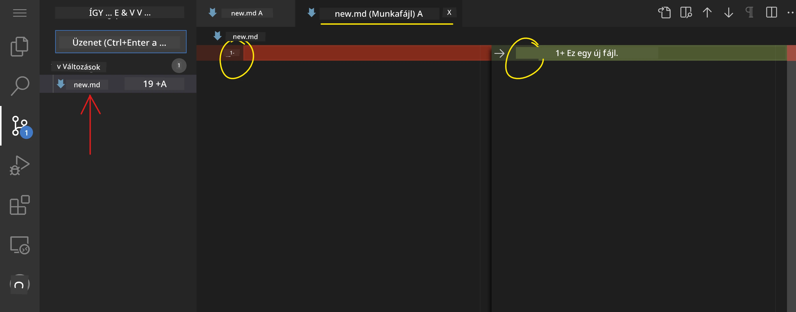

**Munkád mentése (commit munkafolyamat):**

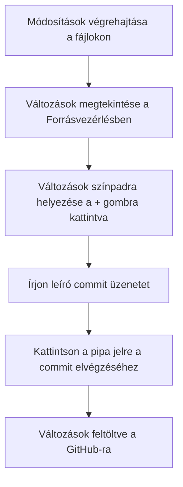
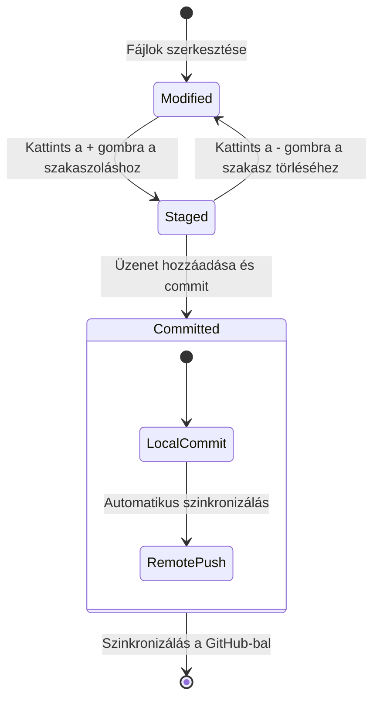
**Lépésről lépésre:**
- Kattints a "+" ikonra azok mellett a fájlok mellett, amiket menteni szeretnél (ez a „staging”-et jelenti)
- Ellenőrizd kétszer, hogy elégedett vagy-e az összes színpadra helyezett módosításoddal
- Írj egy rövid megjegyzést, amely elmagyarázza, hogy mit csináltál (ez lesz a "commit üzeneted")
- Kattints a pipára a módosítások mentéséhez a GitHubon
- Ha meggondolod magad valamivel kapcsolatban, a visszavonás ikon lehetővé teszi a változtatások elvetését

**Jó commit üzenetek írása (ez könnyebb, mint gondolnád!):**
- Egyszerűen írd le, mit csináltál, például "Kapcsolatfelvételi űrlap hozzáadása" vagy "Törött navigáció javítása"
- Tartsd röviden és lényegre törően – gondolj tweet hosszúságra, ne esszére
- Kezdd cselekvő igékkel, mint "Hozzáad", "Javít", "Frissít", vagy "Eltávolít"
- **Jó példák**: "Reszponzív navigációs menü hozzáadása", "Mobil elrendezési hibák javítása", "Színek frissítése jobb hozzáférhetőségért"

> 💡 **Gyors navigációs tipp**: Használd az ☰ hamburger menüt a bal felső sarokban, hogy visszaugrj a GitHub tárhelyedre, és online megnézhesd az elkötelezett változtatásokat. Ez olyan, mint egy kapu a szerkesztő környezeted és a projekted GitHub-hazája között!

## Funkcionalitás bővítése kiterjesztésekkel

Ahogy egy kézműves műhelyében különféle szerszámok vannak a különböző feladatokhoz, úgy a VSCode.dev is testreszabható olyan kiterjesztésekkel, amelyek speciális képességeket adnak hozzá. Ezek a közösség által fejlesztett pluginek a gyakori fejlesztési igényeket oldják meg, például kódformázást, élő előnézetet és továbbfejlesztett Git-integrációt.

A kiterjesztés piactéren több ezer ingyenes eszköz található, amelyeket fejlesztők világszerte készítettek. Minden kiterjesztés egy adott munkafolyamat kihívásait oldja meg, lehetővé téve, hogy személyre szabott fejlesztői környezetet építs, amely megfelel a saját igényeidnek és preferenciáidnak.

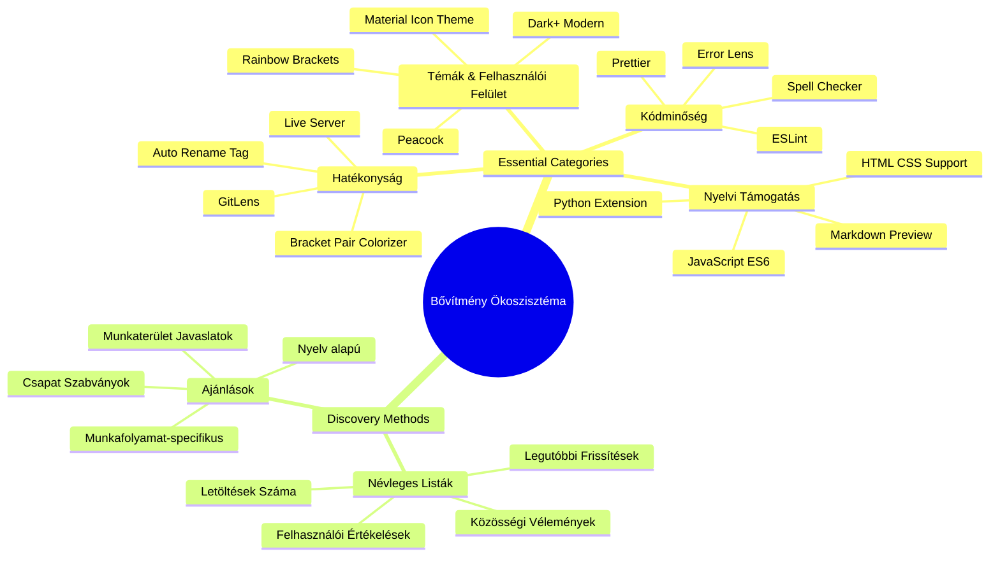
### A tökéletes kiterjesztéseid megtalálása

A kiterjesztés piactér nagyon jól szervezett, így nem fogsz eltévedni, amikor megpróbálod megtalálni, amire szükséged van. Arra tervezték, hogy segítsen felfedezni specifikus eszközöket, és olyan menő dolgokat is, amikről nem is tudtad, hogy léteznek!

**A piactérhez jutás:**

1. Kattints a Kiterjesztések ikonra (🧩) az Activity Bar-on
2. Böngéssz, vagy keress valami konkrétat
3. Kattints bármire, ami érdekesnek tűnik, hogy többet megtudj róla

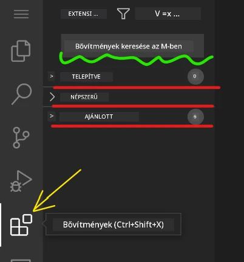

**Mit látsz ott:**

| Szegmens | Mi van benne | Miért hasznos |
|----------|--------------|---------------|
| **Telepítve** | A már hozzáadott kiterjesztéseid | A személyes kódolási eszköztárad |
| **Népszerű** | A közönségkedvencek | Amiben a legtöbb fejlesztő megbízik |
| **Ajánlott** | Okos ajánlások a projektedhez | A VSCode.dev hasznos javaslatai |

**Mi könnyíti meg a böngészést:**
- Minden kiterjesztésnél látod az értékeléseket, letöltésszámokat, és valódi felhasználói véleményeket
- Kapsz képernyőképeket és egyértelmű leírásokat arról, mit csinál
- Minden egyértelmű kompatibilitási információval van jelölve
- Hasonló kiterjesztéseket ajánl, hogy össze tudj hasonlítani opciókat

### Kiterjesztések telepítése (nagyon egyszerű!)

Új képességek hozzáadása a szerkesztődhöz olyan egyszerű, mint egy gombra kattintani. A kiterjesztések másodpercek alatt települnek és azonnal működésbe lépnek – nincs újraindítás vagy várakozás.

**Csak ezt kell tenned:**

1. Keresd meg, amit akarsz (próbáld ki a "live server" vagy "prettier" keresést)
2. Kattints arra, amelyik jónak tűnik, hogy többet megtudj róla
3. Olvasd el, mit csinál, és nézd meg az értékeléseket
4. Nyomd meg a kék "Install" gombot, és kész is vagy!


**Mi történik a háttérben:**
- A kiterjesztés letöltődik és automatikusan beállítja magát
- Az új funkciók azonnal megjelennek a felületen
- Minden azonnal működik (komolyan, ilyen gyors!)
- Ha be vagy jelentkezve, a kiterjesztés szinkronizál az összes eszközödön

**Néhány kiterjesztés, amit érdemes lehet kipróbálni:**
- **Live Server**: Nézd meg a weboldalad valós idejű frissítését kódolás közben (ez igazi varázslat!)
- **Prettier**: Automatikusan szépre rendezi és professzionálissá teszi a kódodat
- **Auto Rename Tag**: Ha egy HTML taget megváltasz, a párja is automatikusan frissül
- **Bracket Pair Colorizer**: Színezett zárójelekkel segít, hogy sose tévedj el bennük
- **GitLens**: Felturbózza a Git funkcióidat rengeteg hasznos információval

### Kiterjesztéseid testreszabása

A legtöbb kiterjesztés beállításokkal rendelkezik, amelyeket módosíthatsz, hogy pontosan úgy működjenek, ahogy szeretnéd. Gondolj rá úgy, mint az ülések és tükrök beállítására egy autóban – mindenkinek megvannak a saját ízlései!

**Beállítások módosítása:**

1. Keresd meg a telepített kiterjesztést a Kiterjesztések panelen
2. Keresd a kis fogaskerék ikont (⚙️) a neve mellett, és kattints rá
3. Válaszd az "Extension Settings" menüpontot a legördülőből
4. Állítsd be, amíg a munkafolyamatodhoz pont megfelelőnek érzed

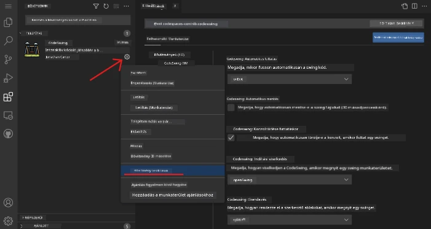

**Gyakori beállítási lehetőségek:**
- Hogyan formázódjon a kódod (tabulátorok vagy szóközök, sorhossz, stb.)
- Melyik billentyűparancsok indítsanak különböző műveleteket
- Milyen fájltípusokon működjön a kiterjesztés
- Bizonyos funkciók ki- vagy bekapcsolása a tisztaság érdekében

### Kiterjesztéseid rendezése

Ahogy egyre több menő kiterjesztést fedezel fel, szeretnéd, hogy a gyűjteményed rendezett és stabilan működő legyen. A VSCode.dev ezt nagyon könnyen kezeli.

**Milyen lehetőségeid vannak a kiterjesztések kezelésekor:**

| Mit tudsz csinálni | Mikor hasznos | Profi tipp |
|--------------------|---------------|------------|
| **Letiltás** | Ha teszteled, hogy okoz-e problémát egy kiterjesztés | Jobb, mint eltávolítani, ha később még kellhet |
| **Eltávolítás** | Ha teljesen törölni akarod a nem használt kiterjesztéseket | Tiszta és gyors környezetet tart fenn |
| **Frissítés** | Ha az új funkciókat vagy hibajavításokat akarod megkapni | Általában automatikusan történik, de érdemes ellenőrizni |

**Így szoktam én kezelni a kiterjesztéseimet:**
- Pár havonta átnézem, miket telepítettem, és eltávolítom, amit nem használok
- Frissítem őket, hogy mindig meglegyenek a legújabb fejlesztések és biztonsági javítások
- Ha valami lassú, ideiglenesen letiltom a kiterjesztéseket, hogy megnézzem, melyik a hibás
- Elolvasom a frissítési jegyzeteket nagyobb verzióváltásoknál – néha remek funkciók jönnek!

> ⚠️ **Teljesítménytipp**: A kiterjesztések fantasztikusak, de a túl sok lelassíthatja a rendszert. Koncentrálj azokra, amelyek valóban megkönnyítik az életed, és ne félj eltávolítani a soha nem használtakat.

### 🎯 Pedagógiai állapotfelmérés: Fejlesztői környezet testreszabása

**Architektúra megértése**: Megtanultad, hogyan testre szabj egy professzionális fejlesztői környezetet közösségi fejlesztésű kiterjesztések segítségével. Ez tükrözi, hogyan építenek szabványosított eszközkészleteket vállalati fejlesztői csapatok.

**Kulcsfogalmak elsajátítása**:
- **Kiterjesztés felfedezés**: Eszközök megtalálása, amelyek adott fejlesztési problémákat oldanak meg
- **Környezet konfigurálás**: Az eszközök személyre szabása személyes vagy csapat preferenciákhoz
- **Teljesítmény optimalizálás**: Funkcionalitás és rendszer-teljesítmény kiegyensúlyozása
- **Közösségi együttműködés**: A globális fejlesztői közösség által készített eszközök hasznosítása

**Iparági kapcsolat**: A kiterjesztés ökoszisztémák táplálják a fő fejlesztői platformokat, mint a VS Code, Chrome DevTools és modern IDE-k. Az, hogy hogyan értékeled, telepíted és konfigurálod a kiterjesztéseket, alapvető a professzionális fejlesztési munkafolyamatokhoz.

**Reflexiós kérdés**: Hogyan közelítenéd meg egy 10 fejlesztőből álló csapat számára egy szabványosított fejlesztői környezet beállítását? Vegyél figyelembe következetességet, teljesítményt és egyéni preferenciákat.

## 📈 A felhőfejlesztési tudásod idővonala

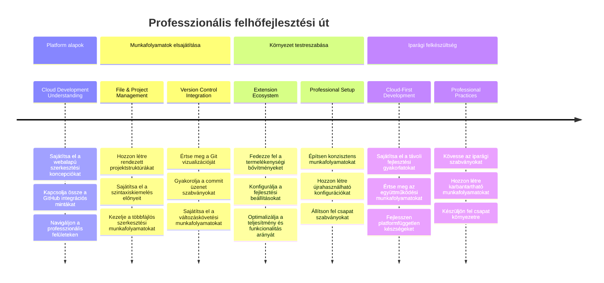
**🎓 Vizsgaforduló**: Sikeresen elsajátítottad a felhőalapú fejlesztést ugyanazokkal az eszközökkel és munkafolyamatokkal, amelyeket a nagy tech cégek profi fejlesztői használnak. Ezek a készségek a jövő szoftverfejlesztését jelentik.

**🔄 Következő szintű képességek**:
- Készen állsz haladó felhőfejlesztési platformok (Codespaces, GitPod) felfedezésére
- Felkészült vagy elosztott fejlesztői csapatokban való munkára
- Képes vagy globálisan hozzájárulni nyílt forráskódú projektekhez
- Alapot teremtettél a modern DevOps és folyamatos integráció gyakorlataihoz

## GitHub Copilot Agent kihívás 🚀

Ahogy a NASA struktúrált megközelítést alkalmaz az űrmissziókhoz, ez a kihívás a VSCode.dev készségek szisztematikus alkalmazását követeli meg egy teljes fejlesztési munkafolyamatban.

**Cél:** Mutasd be a VSCode.dev ismereteket egy átfogó webfejlesztési munkafolyamat létrehozásával.

**Projekt követelmények:** Az agent mód segítségével hajtsd végre ezeket:
1. Forkolj egy meglévő repót vagy hozz létre újat
2. Hozz létre működő projektstruktúrát HTML, CSS és JavaScript fájlokkal
3. Telepíts és állíts be három fejlesztést segítő kiterjesztést
4. Gyakorold a verziókezelést leíró commit üzenetekkel
5. Kísérletezz feature branch létrehozásával és módosításával
6. Dokumentáld a folyamatot és a tanulságokat egy README.md fájlban

Ez a gyakorlat összefoglalja az összes VSCode.dev koncepciót egy gyakorlati munkafolyamatban, amit későbbi fejlesztési projekteken is alkalmazhatsz.

További info az [agent mód](https://code.visualstudio.com/blogs/2025/02/24/introducing-copilot-agent-mode) használatáról.

## Feladat

Ideje, hogy ezekkel a képességekkel egy valós projektbe kezdj! Van egy gyakorlati feladat, amelyen mindent kipróbálhatsz, amit tanultunk: [Önéletrajz weboldal készítése VSCode.dev segítségével](./assignment.md)

Ez a feladat végigvezet azon, hogyan készíts profi önéletrajz weboldalt teljesen a böngésződben. Használni fogod az összes VSCode.dev funkciót, amit felfedeztünk, és a végére nemcsak egy nagyszerű weboldalad, hanem magabiztosságod is lesz az új munkafolyamatodban.

## Folyamatos felfedezés és képességnövelés

Most már szilárd alapokkal rendelkezel, de még rengeteg menő dolgot fedezhetsz fel! Itt van néhány forrás és ötlet, hogy a VSCode.dev képességeidet magasabb szintre emeld:

**Hivatalos dokumentációk, amiket érdemes elmenteni:**
- [VSCode Web Dokumentáció](https://code.visualstudio.com/docs/editor/vscode-web?WT.mc_id=academic-0000-alfredodeza) – Teljes útmutató böngésző-alapú szerkesztéshez
- [GitHub Codespaces](https://docs.github.com/en/codespaces) – Ha még több felhőerőt szeretnél

**Menő funkciók, amiket érdemes kipróbálni:**
- **Billentyűparancsok**: Tanuld meg a kombinációkat, amiktől igazi kódbajnoknak fogod érezni magad
- **Munkaterület beállítások**: Állíts be különböző környezeteket különböző projekttípusokhoz
- **Több gyökér munkaterületek**: Több repón dolgozz egyidejűleg (nagyon praktikus!)
- **Terminál integráció**: Parancssori eszközöket érsz el közvetlenül a böngészőben

**Gyakorlati ötletek:**
- Vegyél részt nyílt forráskódú projektekben VSCode.dev használatával – remek módja a visszaadásnak!
- Próbálj ki különböző kiterjesztéseket, hogy megtaláld a tökéletes beállítást
- Készíts projekt sablonokat a leggyakrabban épített weboldalakhoz
- Gyakorold a Git munkafolyamatokat, mint a branchelés és merge-elés – ezek aranyat érnek csapatmunkában

---

**Mesteri szintre jutottál a böngésző-alapú fejlesztésben!** 🎉 Ahogy a hordozható műszerek feltalálása lehetővé tette a tudósoknak a kutatást messzi helyeken, úgy a VSCode.dev profi kódolást tesz lehetővé bármilyen internetkapcsolattal rendelkező eszközről.

Ezek a készségek tükrözik a jelenlegi iparági gyakorlatokat – sok profi fejlesztő felhőalapú fejlesztői környezeteket használ a rugalmasság és hozzáférhetőség miatt. Olyan munkafolyamatot tanultál meg, amely skálázható az egyéni projektektől a nagy csapatmunkáig.

Alkalmazd ezeket a technikákat a következő fejlesztési projektednél! 🚀

---

<!-- CO-OP TRANSLATOR DISCLAIMER START -->
**Határidő nélküli felelősségkizárás**:
Ezt a dokumentumot az AI fordító szolgáltatás, a [Co-op Translator](https://github.com/Azure/co-op-translator) segítségével fordítottuk. Bár törekszünk a pontosságra, kérjük, vegye figyelembe, hogy az automatikus fordítások tartalmazhatnak hibákat vagy pontatlanságokat. Az eredeti, anyanyelvű dokumentum tekintendő a hiteles forrásnak. Fontos információk esetén szakmai, emberi fordítást javaslunk. Nem vállalunk felelősséget semmilyen félreértésért vagy téves értelmezésért, amely ebből a fordításból adódik.
<!-- CO-OP TRANSLATOR DISCLAIMER END -->