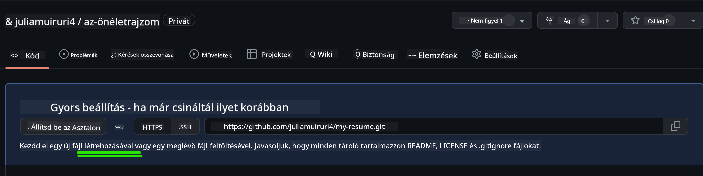
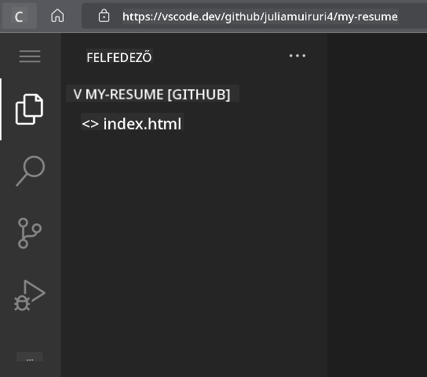

<!--
CO_OP_TRANSLATOR_METADATA:
{
  "original_hash": "bd3aa6d2b879c30ea496c43aec1c49ed",
  "translation_date": "2025-08-29T10:36:21+00:00",
  "source_file": "8-code-editor/1-using-a-code-editor/assignment.md",
  "language_code": "hu"
}
-->
# Készíts egy önéletrajz-weboldalt a vscode.dev segítségével

_Milyen menő lenne, ha egy toborzó elkérné az önéletrajzodat, és te egy URL-t küldenél neki?_ 😎

## Célkitűzések

E feladat elvégzése után megtanulod, hogyan:

- Hozz létre egy weboldalt, amely bemutatja az önéletrajzodat.

### Előfeltételek

1. Egy GitHub-fiók. Látogass el a [GitHub](https://github.com/) oldalra, és hozz létre egy fiókot, ha még nincs.

## Lépések

**1. lépés:** Hozz létre egy új GitHub-tárházat, és nevezd el `my-resume` néven.

**2. lépés:** Hozz létre egy `index.html` fájlt a tárházadban. Legalább egy fájlt hozzá kell adnunk a github.com-on, mert üres tárházat nem lehet megnyitni a vscode.dev-en.

Kattints a `creating a new file` linkre, írd be a fájl nevét `index.html`, majd válaszd a `Commit new file` gombot.



**3. lépés:** Nyisd meg a [VSCode.dev](https://vscode.dev) oldalt, és válaszd az `Open Remote Repository` gombot.

Másold ki az önéletrajz-weboldaladhoz létrehozott tárház URL-jét, és illeszd be a bemeneti mezőbe:

_Cseréld ki a `your-username` részt a GitHub-felhasználónevedre._

```
https://github.com/your-username/my-resume
```

✅ Ha sikeres, a projekted és az `index.html` fájl megjelenik a böngésző szövegszerkesztőjében.



**4. lépés:** Nyisd meg az `index.html` fájlt, illeszd be az alábbi kódot a kódrészbe, majd mentsd el.

<details>
    <summary><b>HTML kód az önéletrajz-weboldalad tartalmához.</b></summary>
    
        <html>

            <head>
                <link href="style.css" rel="stylesheet">
                <link rel="stylesheet" href="https://cdnjs.cloudflare.com/ajax/libs/font-awesome/5.15.4/css/all.min.css">
                <title>A neved ide kerül!</title>
            </head>
            <body>
                <header id="header">
                    <!-- önéletrajz fejléc a neveddel és a pozícióddal -->
                    <h1>A neved ide kerül!</h1>
                    <hr>
                    A szerepköröd!
                    <hr>
                </header>
                <main>
                    <article id="mainLeft">
                        <section>
                            <h2>KAPCSOLAT</h2>
                            <!-- kapcsolati adatok, beleértve a közösségi médiát -->
                            <p>
                                <i class="fa fa-envelope" aria-hidden="true"></i>
                                <a href="mailto:username@domain.top-level domain">Írd ide az e-mail címedet</a>
                            </p>
                            <p>
                                <i class="fab fa-github" aria-hidden="true"></i>
                                <a href="github.com/yourGitHubUsername">Írd ide a felhasználónevedet!</a>
                            </p>
                            <p>
                                <i class="fab fa-linkedin" aria-hidden="true"></i>
                                <a href="linkedin.com/yourLinkedInUsername">Írd ide a felhasználónevedet!</a>
                            </p>
                        </section>
                        <section>
                            <h2>KÉSZSÉGEK</h2>
                            <!-- a készségeid -->
                            <ul>
                                <li>Készség 1!</li>
                                <li>Készség 2!</li>
                                <li>Készség 3!</li>
                                <li>Készség 4!</li>
                            </ul>
                        </section>
                        <section>
                            <h2>OKTATÁS</h2>
                            <!-- az oktatásod -->
                            <h3>Írd ide a kurzusodat!</h3>
                            <p>
                                Írd ide az intézményedet!
                            </p>
                            <p>
                                Kezdési - Befejezési dátum
                            </p>
                        </section>            
                    </article>
                    <article id="mainRight">
                        <section>
                            <h2>RÓLAM</h2>
                            <!-- rólad -->
                            <p>Írj egy rövid bemutatkozást magadról!</p>
                        </section>
                        <section>
                            <h2>MUNKAHELYI TAPASZTALAT</h2>
                            <!-- a munkatapasztalatod -->
                            <h3>Munkakör</h3>
                            <p>
                                Szervezet neve ide kerül | Kezdési hónap – Befejezési hónap
                            </p>
                            <ul>
                                    <li>Feladat 1 - Írd le, mit csináltál!</li>
                                    <li>Feladat 2 - Írd le, mit csináltál!</li>
                                    <li>Írd le a hozzájárulásod eredményeit/hatását</li>
                                    
                            </ul>
                            <h3>Munkakör 2</h3>
                            <p>
                                Szervezet neve ide kerül | Kezdési hónap – Befejezési hónap
                            </p>
                            <ul>
                                    <li>Feladat 1 - Írd le, mit csináltál!</li>
                                    <li>Feladat 2 - Írd le, mit csináltál!</li>
                                    <li>Írd le a hozzájárulásod eredményeit/hatását</li>
                                    
                            </ul>
                        </section>
                    </article>
                </main>
            </body>
        </html>
</details>

Cseréld ki az _helyőrző szöveget_ az önéletrajzod adataira az HTML kódban.

**5. lépés:** Vidd az egeret a My-Resume mappa fölé, kattints az `Új fájl ...` ikonra, és hozz létre 2 új fájlt a projektedben: `style.css` és `codeswing.json`.

**6. lépés:** Nyisd meg a `style.css` fájlt, illeszd be az alábbi kódot, majd mentsd el.

<details>
        <summary><b>CSS kód a weboldal elrendezésének formázásához.</b></summary>
            
            body {
                font-family: 'Segoe UI', Tahoma, Geneva, Verdana, sans-serif;
                font-size: 16px;
                max-width: 960px;
                margin: auto;
            }
            h1 {
                font-size: 3em;
                letter-spacing: .6em;
                padding-top: 1em;
                padding-bottom: 1em;
            }

            h2 {
                font-size: 1.5em;
                padding-bottom: 1em;
            }

            h3 {
                font-size: 1em;
                padding-bottom: 1em;
            }
            main { 
                display: grid;
                grid-template-columns: 40% 60%;
                margin-top: 3em;
            }
            header {
                text-align: center;
                margin: auto 2em;
            }

            section {
                margin: auto 1em 4em 2em;
            }

            i {
                margin-right: .5em;
            }

            p {
                margin: .2em auto
            }

            hr {
                border: none;
                background-color: lightgray;
                height: 1px;
            }

            h1, h2, h3 {
                font-weight: 100;
                margin-bottom: 0;
            }
            #mainLeft {
                border-right: 1px solid lightgray;
            }
            
</details>

**6. lépés:** Nyisd meg a `codeswing.json` fájlt, illeszd be az alábbi kódot, majd mentsd el.

    {
    "scripts": [],
    "styles": []
    }

**7. lépés:** Telepítsd a `Codeswing bővítményt`, hogy megtekinthesd az önéletrajz-weboldalt a kódrészben.

Kattints a _`Bővítmények`_ ikonra az aktivitási sávon, és írd be a Codeswing szót. Kattints a _kék telepítés gombra_ a kibővített aktivitási sávon, vagy használd a telepítés gombot, amely a kódrészben jelenik meg, miután kiválasztottad a bővítményt. A bővítmény telepítése után figyeld meg a projektedben történt változásokat 😃


Ezt fogod látni a képernyődön, miután telepítetted a bővítményt.


Ha elégedett vagy a változtatásokkal, vidd az egeret a `Változások` mappa fölé, és kattints a `+` gombra a változtatások színpadra állításához.

Írj egy commit üzenetet _(A projektben végrehajtott változtatások leírása)_, majd kattints a `pipa` gombra a commit végrehajtásához. Miután befejezted a munkát a projekten, válaszd a bal felső sarokban lévő hamburger menü ikont, hogy visszatérj a GitHub tárházhoz.

Gratulálok 🎉 Most néhány lépésben létrehoztál egy önéletrajz-weboldalt a vscode.dev segítségével.

## 🚀 Kihívás

Nyiss meg egy távoli tárházat, amelyhez van jogosultságod változtatásokat végrehajtani, és frissíts néhány fájlt. Ezután próbálj meg létrehozni egy új ágat a változtatásaiddal, és készíts egy Pull Requestet.

## Áttekintés és önálló tanulás

Olvass többet a [VSCode.dev](https://code.visualstudio.com/docs/editor/vscode-web?WT.mc_id=academic-0000-alfredodeza) oldalról és annak egyéb funkcióiról.

---

**Felelősségkizárás**:  
Ez a dokumentum az [Co-op Translator](https://github.com/Azure/co-op-translator) AI fordítási szolgáltatás segítségével készült. Bár törekszünk a pontosságra, kérjük, vegye figyelembe, hogy az automatikus fordítások hibákat vagy pontatlanságokat tartalmazhatnak. Az eredeti dokumentum az eredeti nyelvén tekintendő hiteles forrásnak. Kritikus információk esetén javasolt professzionális, emberi fordítást igénybe venni. Nem vállalunk felelősséget a fordítás használatából eredő félreértésekért vagy téves értelmezésekért.