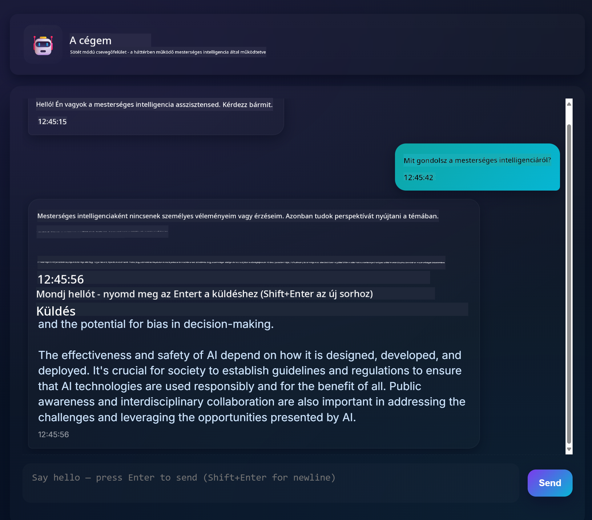
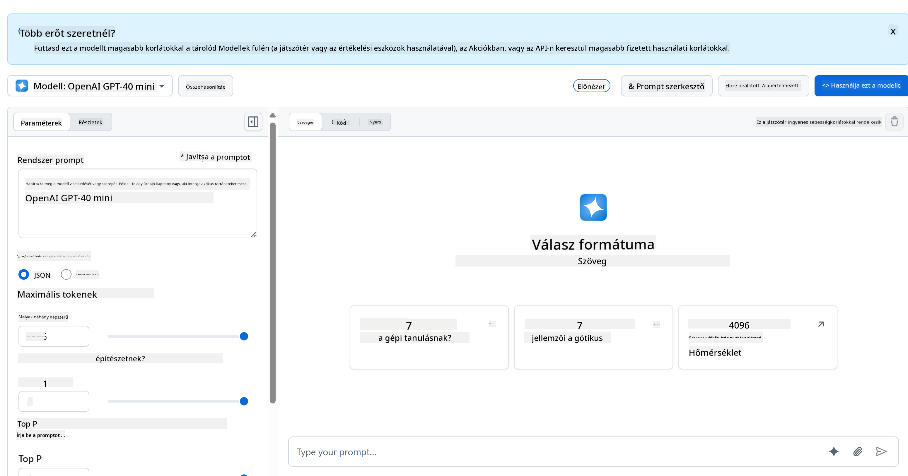
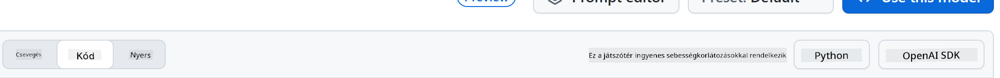
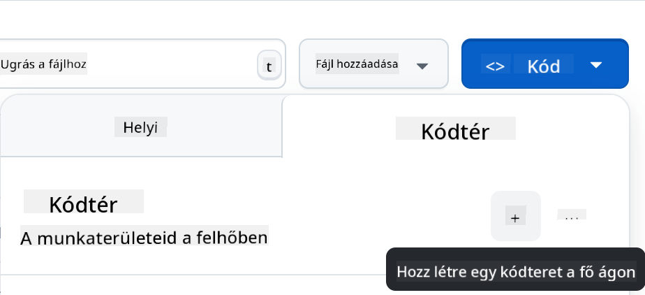

<!--
CO_OP_TRANSLATOR_METADATA:
{
  "original_hash": "11cf36165c243947b6cd85b88cf6faa6",
  "translation_date": "2025-09-01T17:00:23+00:00",
  "source_file": "9-chat-project/README.md",
  "language_code": "hu"
}
-->
# Chat projekt

Ez a chat projekt bemutatja, hogyan lehet Chat Asszisztenst építeni GitHub Modellek segítségével.

Így néz ki a kész projekt:



Néhány háttérinformáció: generatív AI használatával chat asszisztensek építése remek módja annak, hogy elkezdjünk tanulni az AI-ról. Ebben a leckében megtanulhatod, hogyan integrálj generatív AI-t egy webalkalmazásba. Kezdjük!

## Kapcsolódás a generatív AI-hoz

A backendhez a GitHub Modelleket használjuk. Ez egy nagyszerű szolgáltatás, amely lehetővé teszi az AI ingyenes használatát. Látogass el a playgroundjára, és szerezd meg a kódot, amely megfelel a választott backend nyelvednek. Így néz ki a [GitHub Models Playground](https://github.com/marketplace/models/azure-openai/gpt-4o-mini/playground).



Ahogy mondtuk, válaszd ki a "Code" fület és a kívánt futtatási környezetet.



### Python használata

Ebben az esetben a Python-t választjuk, ami azt jelenti, hogy ezt a kódot választjuk:

```python
"""Run this model in Python

> pip install openai
"""
import os
from openai import OpenAI

# To authenticate with the model you will need to generate a personal access token (PAT) in your GitHub settings. 
# Create your PAT token by following instructions here: https://docs.github.com/en/authentication/keeping-your-account-and-data-secure/managing-your-personal-access-tokens
client = OpenAI(
    base_url="https://models.github.ai/inference",
    api_key=os.environ["GITHUB_TOKEN"],
)

response = client.chat.completions.create(
    messages=[
        {
            "role": "system",
            "content": "",
        },
        {
            "role": "user",
            "content": "What is the capital of France?",
        }
    ],
    model="openai/gpt-4o-mini",
    temperature=1,
    max_tokens=4096,
    top_p=1
)

print(response.choices[0].message.content)
```

Tisztítsuk meg ezt a kódot, hogy újrahasználható legyen:

```python
def call_llm(prompt: str, system_message: str):
    response = client.chat.completions.create(
        messages=[
            {
                "role": "system",
                "content": system_message,
            },
            {
                "role": "user",
                "content": prompt,
            }
        ],
        model="openai/gpt-4o-mini",
        temperature=1,
        max_tokens=4096,
        top_p=1
    )

    return response.choices[0].message.content
```

Ezzel a `call_llm` függvénnyel most már megadhatunk egy promptot és egy rendszerpromptot, és a függvény visszaadja az eredményt.

### AI Asszisztens testreszabása

Ha testre szeretnéd szabni az AI asszisztenst, megadhatod, hogyan viselkedjen, a rendszerprompt kitöltésével, például így:

```python
call_llm("Tell me about you", "You're Albert Einstein, you only know of things in the time you were alive")
```

## Web API-n keresztüli elérés

Nagyszerű, az AI rész kész, nézzük meg, hogyan integrálhatjuk ezt egy Web API-ba. A Web API-hoz a Flask-et választjuk, de bármelyik webes keretrendszer megfelelő lehet. Nézzük meg a kódot:

### Python használata

```python
# api.py
from flask import Flask, request, jsonify
from llm import call_llm
from flask_cors import CORS

app = Flask(__name__)
CORS(app)   # *   example.com

@app.route("/", methods=["GET"])
def index():
    return "Welcome to this API. Call POST /hello with 'message': 'my message' as JSON payload"


@app.route("/hello", methods=["POST"])
def hello():
    # get message from request body  { "message": "do this taks for me" }
    data = request.get_json()
    message = data.get("message", "")

    response = call_llm(message, "You are a helpful assistant.")
    return jsonify({
        "response": response
    })

if __name__ == "__main__":
    app.run(host="0.0.0.0", port=5000)
```

Itt létrehozunk egy Flask API-t, és definiálunk egy alapértelmezett útvonalat "/" és "/chat". Az utóbbi arra szolgál, hogy a frontendünk kérdéseket küldjön a backendnek.

Az *llm.py* integrálásához a következőket kell tennünk:

- Importáljuk a `call_llm` függvényt:

   ```python
   from llm import call_llm
   from flask import Flask, request
   ```

- Meghívjuk a "/chat" útvonalról:

   ```python
   @app.route("/hello", methods=["POST"])
   def hello():
      # get message from request body  { "message": "do this taks for me" }
      data = request.get_json()
      message = data.get("message", "")

      response = call_llm(message, "You are a helpful assistant.")
      return jsonify({
         "response": response
      })
   ```

   Itt feldolgozzuk a bejövő kérést, hogy kinyerjük a JSON törzsből a `message` tulajdonságot. Ezután az LLM-et így hívjuk meg:

   ```python
   response = call_llm(message, "You are a helpful assistant")

   # return the response as JSON
   return jsonify({
      "response": response 
   })
   ```

Nagyszerű, most már készen vagyunk.

## Cors konfigurálása

Fontos megemlíteni, hogy beállítunk valamit, amit CORS-nak, azaz cross-origin resource sharing-nek hívnak. Ez azt jelenti, hogy mivel a backendünk és a frontendünk különböző portokon fog futni, engedélyeznünk kell, hogy a frontend hívja a backendet.

### Python használata

Van egy kódrészlet az *api.py*-ban, amely ezt beállítja:

```python
from flask_cors import CORS

app = Flask(__name__)
CORS(app)   # *   example.com
```

Jelenleg úgy van beállítva, hogy "*" legyen, ami minden eredetet engedélyez, és ez egy kicsit nem biztonságos. Ezt korlátozni kell, amikor produkcióba kerülünk.

## Projekt futtatása

A projekt futtatásához először a backendet, majd a frontendet kell elindítanod.

### Python használata

Oké, tehát van *llm.py* és *api.py*, hogyan működtethetjük ezeket a backenddel? Két dolgot kell tennünk:

- Függőségek telepítése:

   ```sh
   cd backend
   python -m venv venv
   source ./venv/bin/activate

   pip install openai flask flask-cors openai
   ```

- API indítása:

   ```sh
   python api.py
   ```

   Ha Codespaces-ben dolgozol, menj az editor alsó részén található Ports részhez, kattints rá jobb gombbal, válaszd a "Port Visibility"-t, majd válaszd a "Public" opciót.

### Frontend fejlesztése

Most, hogy az API működik, hozzunk létre egy frontendet ehhez. Egy minimális frontendet, amelyet lépésről lépésre fejlesztünk tovább. A *frontend* mappában hozz létre a következőket:

```text
backend/
frontend/
index.html
app.js
styles.css
```

Kezdjük az **index.html**-lel:

```html
<html>
    <head>
        <link rel="stylesheet" href="styles.css">
    </head>
    <body>
      <form>
        <textarea id="messages"></textarea>
        <input id="input" type="text" />
        <button type="submit" id="sendBtn">Send</button>  
      </form>  
      <script src="app.js" />
    </body>
</html>    
```

Ez a minimum, amire szükséged van egy chat ablak támogatásához, mivel tartalmaz egy textarea-t, ahol az üzenetek megjelennek, egy input mezőt, ahová az üzenetet beírhatod, és egy gombot, amely elküldi az üzenetet a backendnek. Nézzük meg a JavaScriptet a *app.js*-ben.

**app.js**

```js
// app.js

(function(){
  // 1. set up elements  
  const messages = document.getElementById("messages");
  const form = document.getElementById("form");
  const input = document.getElementById("input");

  const BASE_URL = "change this";
  const API_ENDPOINT = `${BASE_URL}/hello`;

  // 2. create a function that talks to our backend
  async function callApi(text) {
    const response = await fetch(API_ENDPOINT, {
      method: "POST",
      headers: { "Content-Type": "application/json" },
      body: JSON.stringify({ message: text })
    });
    let json = await response.json();
    return json.response;
  }

  // 3. add response to our textarea
  function appendMessage(text, role) {
    const el = document.createElement("div");
    el.className = `message ${role}`;
    el.innerHTML = text;
    messages.appendChild(el);
  }

  // 4. listen to submit events
  form.addEventListener("submit", async(e) => {
    e.preventDefault();
   // someone clicked the button in the form
   
   // get input
   const text = input.value.trim();

   appendMessage(text, "user")

   // reset it
   input.value = '';

   const reply = await callApi(text);

   // add to messages
   appendMessage(reply, "assistant");

  })
})();
```

Nézzük át a kódot szakaszonként:

- 1) Itt hivatkozást kapunk az összes elemre, amelyre később hivatkozunk a kódban.
- 2) Ebben a szakaszban létrehozunk egy függvényt, amely a beépített `fetch` metódust használja a backend hívására.
- 3) Az `appendMessage` segít hozzáadni a válaszokat, valamint azt, amit te, mint felhasználó írsz.
- 4) Itt figyelünk a submit eseményre, és végül kiolvassuk az input mezőt, elhelyezzük a felhasználó üzenetét a textarea-ban, meghívjuk az API-t, és megjelenítjük a választ a textarea-ban.

Nézzük meg a stílusokat, itt igazán kreatív lehetsz, és úgy alakíthatod, ahogy szeretnéd, de itt van néhány javaslat:

**styles.css**

```
.message {
    background: #222;
    box-shadow: 0 0 0 10px orange;
    padding: 10px:
    margin: 5px;
}

.message.user {
    background: blue;
}

.message.assistant {
    background: grey;
} 
```

Ezzel a három osztállyal különbözőképpen fogod formázni az üzeneteket attól függően, hogy az asszisztenstől vagy tőled, mint felhasználótól származnak. Ha inspirációt keresel, nézd meg a `solution/frontend/styles.css` mappát.

### Alap URL módosítása

Van itt egy dolog, amit nem állítottunk be, és ez a `BASE_URL`. Ez nem ismert, amíg a backend el nem indul. Beállításához:

- Ha az API-t helyben futtatod, valami ilyesminek kell lennie: `http://localhost:5000`.
- Ha Codespaces-ben futtatod, valami ilyesminek kell kinéznie: "[name]app.github.dev".

## Feladat

Hozz létre egy saját *project* mappát, amelynek tartalma a következő:

```text
project/
  frontend/
    index.html
    app.js
    styles.css
  backend/
    ...
```

Másold át a fentiekben leírt tartalmat, de nyugodtan testreszabhatod saját ízlésed szerint.

## Megoldás

[Megoldás](./solution/README.md)

## Bónusz

Próbáld meg megváltoztatni az AI asszisztens személyiségét.

### Python esetén

Amikor meghívod a `call_llm` függvényt az *api.py*-ban, megváltoztathatod a második argumentumot arra, amit szeretnél, például:

```python
call_llm(message, "You are Captain Picard")
```

### Frontend

Változtasd meg a CSS-t és a szöveget is saját ízlésed szerint, tehát végezz módosításokat az *index.html*-ben és a *styles.css*-ben.

## Összefoglaló

Nagyszerű, megtanultad, hogyan hozhatsz létre egy személyes asszisztenst AI segítségével. Ezt GitHub Modellek, egy Python backend és egy HTML, CSS és JavaScript frontend segítségével valósítottuk meg.

## Beállítás Codespaces-szel

- Navigálj ide: [Web Dev For Beginners repo](https://github.com/microsoft/Web-Dev-For-Beginners)
- Hozz létre egy sablonból (győződj meg róla, hogy be vagy jelentkezve a GitHub-ra) a jobb felső sarokban:

    

- Miután a saját repódban vagy, hozz létre egy Codespace-t:

    

    Ez elindít egy környezetet, amelyben most már dolgozhatsz.

---

**Felelősség kizárása**:  
Ez a dokumentum az AI fordítási szolgáltatás [Co-op Translator](https://github.com/Azure/co-op-translator) segítségével lett lefordítva. Bár törekszünk a pontosságra, kérjük, vegye figyelembe, hogy az automatikus fordítások hibákat vagy pontatlanságokat tartalmazhatnak. Az eredeti dokumentum az eredeti nyelvén tekintendő hiteles forrásnak. Fontos információk esetén javasolt professzionális emberi fordítást igénybe venni. Nem vállalunk felelősséget semmilyen félreértésért vagy téves értelmezésért, amely a fordítás használatából eredhet.