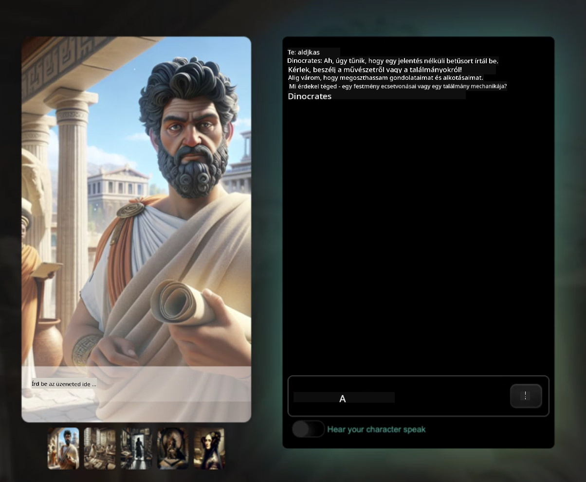

<!--
CO_OP_TRANSLATOR_METADATA:
{
  "original_hash": "efa251c5fc089367f0a81c572874afca",
  "translation_date": "2025-08-28T03:18:02+00:00",
  "source_file": "README.md",
  "language_code": "hu"
}
-->
[](https://github.com/microsoft/Web-Dev-For-Beginners/blob/master/LICENSE)  
[](https://GitHub.com/microsoft/Web-Dev-For-Beginners/graphs/contributors/)  
[](https://GitHub.com/microsoft/Web-Dev-For-Beginners/issues/)  
[](https://GitHub.com/microsoft/Web-Dev-For-Beginners/pulls/)  
[](http://makeapullrequest.com)  

[](https://GitHub.com/microsoft/Web-Dev-For-Beginners/watchers/)  
[](https://GitHub.com/microsoft/Web-Dev-For-Beginners/network/)  
[](https://GitHub.com/microsoft/Web-Dev-For-Beginners/stargazers/)  

[](https://discord.gg/zxKYvhSnVp?WT.mc_id=academic-000002-leestott)  

[](https://open.vscode.dev/microsoft/Web-Dev-For-Beginners)  

[](https://discord.com/invite/ByRwuEEgH4)  

Kövesd az alábbi lépéseket, hogy elkezdhesd használni ezeket az erőforrásokat:  
1. **Forkold a repót**: Kattints ide [](https://GitHub.com/microsoft/Web-Dev-For-Beginners/fork)  
2. **Klónozd a repót**:   `git clone https://github.com/microsoft/Web-Dev-For-Beginners.git`  
3. [**Csatlakozz az Azure AI Foundry Discordhoz, és találkozz szakértőkkel és fejlesztőkkel**](https://discord.com/invite/ByRwuEEgH4)  

# Webfejlesztés kezdőknek - Tananyag  

Tanuld meg a webfejlesztés alapjait a Microsoft Cloud Advocates 12 hetes átfogó kurzusával. A 24 lecke során JavaScript, CSS és HTML ismereteket sajátíthatsz el gyakorlati projekteken keresztül, mint például terráriumok, böngészőbővítmények és űrjátékok. Vegyél részt kvízeken, vitákon és gyakorlati feladatokon. Fejleszd képességeidet és optimalizáld a tudásod projektalapú tanulási módszerünkkel. Kezdd el a kódolási utadat még ma!  

#### 🧑‍🎓 _Diák vagy?_  

Látogasd meg a [**Student Hub oldalt**](https://docs.microsoft.com/learn/student-hub/?WT.mc_id=academic-77807-sagibbon), ahol kezdőknek szóló forrásokat, diákcsomagokat és akár ingyenes tanúsítványkuponokat is találhatsz. Ez az az oldal, amit érdemes könyvjelzőzni és időnként visszanézni, mivel havonta frissítjük a tartalmat.  

### 📣 Bejelentés - _Új tananyag_ a Generatív AI-ról JavaScripthez most jelent meg  

Ne hagyd ki az új Generatív AI tananyagot!  

Látogasd meg a [https://aka.ms/genai-js-course](https://aka.ms/genai-js-course) oldalt, hogy elkezdhesd!  

  

- Leckék az alapoktól a RAG-ig.  
- Interakció történelmi karakterekkel a GenAI és a társalkalmazásunk segítségével.  
- Szórakoztató és lebilincselő narratíva, időutazásban lesz részed!  

  

Minden lecke tartalmaz egy feladatot, egy tudásellenőrzőt és egy kihívást, hogy megtanulhasd az alábbi témákat:  
- Promptolás és prompt mérnökség  
- Szöveg- és képalkalmazások generálása  
- Keresési alkalmazások  

Látogasd meg a [https://aka.ms/genai-js-course](https://aka.ms/genai-js-course) oldalt, hogy elkezdhesd!  

## 🌱 Kezdés  

> **Tanárok**, [adtunk néhány javaslatot](for-teachers.md) arra, hogyan használhatjátok ezt a tananyagot. Örömmel várjuk visszajelzéseiteket [a vitafórumunkon](https://github.com/microsoft/Web-Dev-For-Beginners/discussions/categories/teacher-corner)!  

**[Tanulók](https://aka.ms/student-page/?WT.mc_id=academic-77807-sagibbon)**, minden leckénél kezdjétek egy előzetes kvízzel, majd olvassátok el az előadási anyagot, végezzétek el a különböző tevékenységeket, és ellenőrizzétek a megértéseteket az utólagos kvízzel.  

A tanulási élmény fokozása érdekében kapcsolódjatok össze társaitokkal, hogy együtt dolgozzatok a projekteken! A viták ösztönzöttek a [vitafórumunkon](https://github.com/microsoft/Web-Dev-For-Beginners/discussions), ahol moderátoraink válaszolnak a kérdéseitekre.  

További tanulmányaitokhoz erősen ajánljuk, hogy fedezzétek fel a [Microsoft Learn](https://learn.microsoft.com/users/wirelesslife/collections/p1ddcy5jwy0jkm?WT.mc_id=academic-77807-sagibbon) további tananyagainkat.  

### 📋 Környezet beállítása  

Ez a tananyag egy előre elkészített fejlesztési környezettel rendelkezik! Kezdésként választhatsz, hogy a tananyagot egy [Codespace](https://github.com/features/codespaces/) (_böngészőalapú, telepítést nem igénylő környezet_) vagy a saját számítógépeden, egy szövegszerkesztővel, például a [Visual Studio Code](https://code.visualstudio.com/?WT.mc_id=academic-77807-sagibbon) segítségével futtatod.  

#### Hozd létre a repódat  
Ahhoz, hogy könnyen elmentsd a munkádat, javasoljuk, hogy hozz létre egy saját másolatot erről a repóról. Ezt a **Use this template** gombra kattintva teheted meg az oldal tetején. Ez egy új repót hoz létre a GitHub fiókodban a tananyag másolatával.  

Kövesd az alábbi lépéseket:  
1. **Forkold a repót**: Kattints a "Fork" gombra az oldal jobb felső sarkában.  
2. **Klónozd a repót**:   `git clone https://github.com/microsoft/Web-Dev-For-Beginners.git`  

#### A tananyag futtatása Codespace-ben  

A saját másolatodban, amit létrehoztál, kattints a **Code** gombra, és válaszd a **Open with Codespaces** lehetőséget. Ez létrehoz egy új Codespace-t, ahol dolgozhatsz.  

[!Codespace](../..)./images/createcodespace.png)  

#### A tananyag futtatása helyileg a számítógépeden  

Ahhoz, hogy helyileg futtasd a tananyagot a számítógépeden, szükséged lesz egy szövegszerkesztőre, egy böngészőre és egy parancssori eszközre. Az első leckénk, [Bevezetés a programozási nyelvekbe és eszközökbe](../../1-getting-started-lessons/1-intro-to-programming-languages), végigvezet a különböző lehetőségeken, hogy kiválaszthasd, mi működik a legjobban számodra.  

Ajánlásunk a [Visual Studio Code](https://code.visualstudio.com/?WT.mc_id=academic-77807-sagibbon) használata, amely beépített [Terminállal](https://code.visualstudio.com/docs/terminal/basics/?WT.mc_id=academic-77807-sagibbon) is rendelkezik. A Visual Studio Code-ot [innen töltheted le](https://code.visualstudio.com/?WT.mc_id=academic-77807-sagibbon).  

1. Klónozd a repódat a számítógépedre. Ezt a **Code** gombra kattintva és az URL másolásával teheted meg:  

    [!CodeSpace](./images/createcodespace.png)  

    Ezután nyisd meg a [Terminált](https://code.visualstudio.com/docs/terminal/basics/?WT.mc_id=academic-77807-sagibbon) a [Visual Studio Code](https://code.visualstudio.com/?WT.mc_id=academic-77807-sagibbon) belül, és futtasd az alábbi parancsot, az `<your-repository-url>` helyére illesztve a másolt URL-t:  

    ```bash 
    git clone <your-repository-url>
    ```  

2. Nyisd meg a mappát a Visual Studio Code-ban. Ezt a **File** > **Open Folder** lehetőséggel teheted meg, és válaszd ki a most klónozott mappát.  

>  Ajánlott Visual Studio Code bővítmények:  
>  
> * [Live Server](https://marketplace.visualstudio.com/items?itemName=ritwickdey.LiveServer&WT.mc_id=academic-77807-sagibbon) - HTML oldalak előnézetéhez a Visual Studio Code-on belül  
> * [Copilot](https://marketplace.visualstudio.com/items?itemName=GitHub.copilot&WT.mc_id=academic-77807-sagibbon) - hogy gyorsabban írhass kódot  

## 📂 Minden lecke tartalmazza:  

- opcionális sketchnote  
- opcionális kiegészítő videó  
- előzetes bemelegítő kvíz  
- írott lecke  
- projektalapú leckéknél lépésről lépésre útmutatók a projekt elkészítéséhez  
- tudásellenőrzők  
- egy kihívás  
- kiegészítő olvasmány  
- feladat  
- [utólagos kvíz](https://ff-quizzes.netlify.app/)  

> **Megjegyzés a kvízekről**: Minden kvíz a Quiz-app mappában található, összesen 48 darab, mindegyik három kérdéssel. Ezek elérhetők [itt](https://ff-quizzes.netlify.app/), a kvíz alkalmazás helyileg is futtatható vagy Azure-ra telepíthető; kövesd az utasításokat a `quiz-app` mappában.  

## 🗃️ Leckék  

|     |                       Projekt neve                       |                            Tanított fogalmak                             | Tanulási célok                                                                                                                 |                                                         Kapcsolódó lecke                                                          |         Szerző          |  
| :-: | :------------------------------------------------------: | :--------------------------------------------------------------------: | ----------------------------------------------------------------------------------------------------------------------------------- | :----------------------------------------------------------------------------------------------------------------------------: | :---------------------: |  
| 01  |                     Kezdés                      |           Bevezetés a programozásba és az eszközök világába           | Ismerd meg a legtöbb programozási nyelv alapjait és a szoftvereket, amelyek segítik a profi fejlesztők munkáját | [Bevezetés a programozási nyelvekbe és eszközökbe](./1-getting-started-lessons/1-intro-to-programming-languages/README.md) |         Jasmine         |  
| 02  |                     Kezdés                      |             GitHub alapjai, csapatmunkával együtt             | Hogyan használd a GitHubot a projektedben, hogyan működj együtt másokkal egy kódbázison                                                    |                            [Bevezetés a GitHubba](./1-getting-started-lessons/2-github-basics/README.md)                             |          Floor          |  
| 03  |                     Kezdés                      |                             Hozzáférhetőség                              | Ismerd meg a webes hozzáférhetőség alapjait                                                                                               |                       [Hozzáférhetőség alapjai](./1-getting-started-lessons/3-accessibility/README.md)                       |       Christopher       |  
| 04  |                        JS Alapok                         |                         JavaScript adattípusok                          | A JavaScript adattípusainak alapjai                                                                                                 |                                       [Adattípusok](./2-js-basics/1-data-types/README.md)                                        |         Jasmine         |  
| 05  |                        JS Alapok                         |                         Függvények és metódusok                          | Ismerd meg a függvényeket és metódusokat, hogy kezeld az alkalmazás logikai folyamatait                                                             |                              [Függvények és metódusok](./2-js-basics/2-functions-methods/README.md)                               | Jasmine és Christopher |  
| 06  |                        JS Alapok                         |                        Döntéshozatal JS-ben                        | Tanuld meg, hogyan hozz létre feltételeket a kódodban döntéshozatali módszerekkel                                                           |                                 [Döntéshozatal](./2-js-basics/3-making-decisions/README.md)                                  |         Jasmine         |  
| 07  |                        JS Alapok                         |                            Tömbök és ciklusok                            | Dolgozz adatokkal JavaScript tömbök és ciklusok segítségével                                                                                 |                                   [Tömbök és ciklusok](./2-js-basics/4-arrays-loops/README.md)                                    |         Jasmine         |  
| 08  |       [Terrárium](./3-terrarium/solution/README.md)       |                            HTML a gyakorlatban                            | Építsd meg a HTML-t egy online terráriumhoz, a layout kialakítására összpontosítva                                                         |                                 [Bevezetés a HTML-be](./3-terrarium/1-intro-to-html/README.md)                                 |           Jen           |  
| 09  |       [Terrárium](./3-terrarium/solution/README.md)       |                            CSS a gyakorlatban                             | Építsd meg a CSS-t az online terráriumhoz, a CSS alapjaira összpontosítva, beleértve az oldal reszponzívvá tételét                     |                                  [Bevezetés a CSS-be](./3-terrarium/2-intro-to-css/README.md)                                  |           Jen           |  
| 10  |            [Terrárium](./3-terrarium/solution/README.md)            |                 JavaScript lezárások, DOM manipuláció                  | Készítsd el a JavaScriptet, hogy a terrárium húzás/ejtés interfészként működjön, a lezárásokra és a DOM manipulációra összpontosítva |                  [JavaScript lezárások, DOM manipuláció](./3-terrarium/3-intro-to-DOM-and-closures/README.md)                   |           Jen           |
| 11  |          [Gépírás játék](./4-typing-game/solution/README.md)          |                          Gépírás játék készítése                       | Tanuld meg, hogyan használhatod a billentyűzet eseményeit JavaScript alkalmazásod logikájának vezérlésére                          |                                [Eseményvezérelt programozás](./4-typing-game/typing-game/README.md)                                |       Christopher       |
| 12  | [Zöld böngészőbővítmény](./5-browser-extension/solution/README.md) |                         Böngészőkkel való munka                        | Ismerd meg, hogyan működnek a böngészők, történetüket, és hogyan hozhatod létre egy böngészőbővítmény első elemeit                 |                               [A böngészőkről](./5-browser-extension/1-about-browsers/README.md)                                |           Jen           |
| 13  | [Zöld böngészőbővítmény](./5-browser-extension/solution/README.md) | Űrlap készítése, API hívása és változók tárolása helyi tárolóban       | Készítsd el böngészőbővítményed JavaScript elemeit, hogy API-t hívhass helyi tárolóban tárolt változók segítségével                |                [API-k, űrlapok és helyi tároló](./5-browser-extension/2-forms-browsers-local-storage/README.md)                 |           Jen           |
| 14  | [Zöld böngészőbővítmény](./5-browser-extension/solution/README.md) |          Háttérfolyamatok a böngészőben, webes teljesítmény            | Használd a böngésző háttérfolyamatait az ikon kezelésére; ismerd meg a webes teljesítményt és néhány optimalizálási lehetőséget    |             [Háttérfeladatok és teljesítmény](./5-browser-extension/3-background-tasks-and-performance/README.md)              |           Jen           |
| 15  |           [Űrjáték](./6-space-game/solution/README.md)           |             Fejlettebb játékfejlesztés JavaScriptben                  | Ismerd meg az öröklődést osztályok és kompozíciók segítségével, valamint a Pub/Sub mintát, hogy felkészülj egy játék készítésére   |                      [Bevezetés a fejlett játékfejlesztésbe](./6-space-game/1-introduction/README.md)                       |          Chris          |
| 16  |           [Űrjáték](./6-space-game/solution/README.md)           |                           Rajzolás vászonra                           | Ismerd meg a Canvas API-t, amelyet elemek képernyőre rajzolására használnak                                                        |                                [Rajzolás vászonra](./6-space-game/2-drawing-to-canvas/README.md)                                |          Chris          |
| 17  |           [Űrjáték](./6-space-game/solution/README.md)           |                   Elemek mozgatása a képernyőn                        | Fedezd fel, hogyan lehet mozgást adni az elemeknek a derékszögű koordináták és a Canvas API segítségével                          |                           [Elemek mozgatása](./6-space-game/3-moving-elements-around/README.md)                           |          Chris          |
| 18  |           [Űrjáték](./6-space-game/solution/README.md)           |                          Ütközésérzékelés                             | Készítsd el, hogy az elemek ütközzenek és reagáljanak egymásra billentyűleütések segítségével, valamint biztosíts egy cooldown funkciót a játék teljesítményének érdekében |                              [Ütközésérzékelés](./6-space-game/4-collision-detection/README.md)                              |          Chris          |
| 19  |           [Űrjáték](./6-space-game/solution/README.md)           |                             Pontszám vezetése                         | Végezz matematikai számításokat a játék állapota és teljesítménye alapján                                                          |                                    [Pontszám vezetése](./6-space-game/5-keeping-score/README.md)                                    |          Chris          |
| 20  |           [Űrjáték](./6-space-game/solution/README.md)           |                     Játék befejezése és újraindítása                   | Ismerd meg, hogyan lehet befejezni és újraindítani a játékot, beleértve az eszközök tisztítását és a változók értékeinek visszaállítását |                                [A befejezési feltétel](./6-space-game/6-end-condition/README.md)                                 |          Chris          |
| 21  |         [Banki alkalmazás](./7-bank-project/solution/README.md)          |                 HTML sablonok és útvonalak egy webalkalmazásban       | Tanuld meg, hogyan hozhatod létre egy többoldalas weboldal architektúrájának vázát útvonalak és HTML sablonok segítségével         |                            [HTML sablonok és útvonalak](./7-bank-project/1-template-route/README.md)                             |          Yohan          |
| 22  |         [Banki alkalmazás](./7-bank-project/solution/README.md)          |                  Bejelentkezési és regisztrációs űrlap készítése       | Ismerd meg, hogyan készíthetsz űrlapokat és kezelheted az érvényesítési rutinokat                                                  |                                           [Űrlapok](./7-bank-project/2-forms/README.md)                                           |          Yohan          |
| 23  |         [Banki alkalmazás](./7-bank-project/solution/README.md)          |                   Adatok lekérése és használata                       | Ismerd meg, hogyan áramlik az adat az alkalmazásodba és ki belőle, hogyan lehet lekérni, tárolni és eldobni                       |                                            [Adatok](./7-bank-project/3-data/README.md)                                            |          Yohan          |
| 24  |         [Banki alkalmazás](./7-bank-project/solution/README.md)          |                      Állapotkezelés fogalmai                          | Ismerd meg, hogyan őrzi meg az alkalmazásod az állapotot, és hogyan kezelheted programozottan                                      |                                [Állapotkezelés](./7-bank-project/4-state-management/README.md)                                |          Yohan          |


## 🏫 Pedagógia

Tananyagunk két kulcsfontosságú pedagógiai elvet követ:
* projektalapú tanulás
* gyakori kvízek

A program megtanítja a JavaScript, HTML és CSS alapjait, valamint a legújabb eszközöket és technikákat, amelyeket a mai webfejlesztők használnak. A diákok lehetőséget kapnak arra, hogy gyakorlati tapasztalatot szerezzenek gépírás játék, virtuális terrárium, környezetbarát böngészőbővítmény, űrjáték és üzleti banki alkalmazás készítésével. A sorozat végére a diákok szilárd webfejlesztési ismereteket szereznek.

> 🎓 A tananyag első néhány leckéjét [Learn Path](https://docs.microsoft.com/learn/paths/web-development-101/?WT.mc_id=academic-77807-sagibbon) formájában is elvégezheted a Microsoft Learn platformon!

A tartalom projektekhez való igazítása révén a tanulási folyamat érdekesebbé válik a diákok számára, és a fogalmak megértése is tartósabb lesz. Emellett több JavaScript alapokat bemutató kezdő leckét is írtunk, amelyeket a "[Beginners Series to: JavaScript](https://channel9.msdn.com/Series/Beginners-Series-to-JavaScript/?WT.mc_id=academic-77807-sagibbon)" videósorozat kísér, amelynek néhány szerzője hozzájárult ehhez a tananyaghoz.

Ezenkívül egy alacsony tétű kvíz az óra előtt segít a diákoknak a téma iránti érdeklődés felkeltésében, míg egy második kvíz az óra után elősegíti a fogalmak további rögzítését. Ez a tananyag rugalmas és szórakoztató, és teljes egészében vagy részben is elvégezhető. A projektek kicsiben kezdődnek, és a 12 hetes ciklus végére egyre összetettebbé válnak.

Bár szándékosan kerültük a JavaScript keretrendszerek bevezetését, hogy a webfejlesztőként szükséges alapvető készségekre koncentráljunk, mielőtt keretrendszert alkalmaznánk, a tananyag befejezése után jó következő lépés lehet a Node.js megismerése egy másik videósorozat segítségével: "[Beginner Series to: Node.js](https://channel9.msdn.com/Series/Beginners-Series-to-Nodejs/?WT.mc_id=academic-77807-sagibbon)".

> Látogasd meg a [Magatartási kódexünket](CODE_OF_CONDUCT.md) és a [Hozzájárulási irányelveinket](CONTRIBUTING.md). Örömmel fogadjuk az építő jellegű visszajelzéseidet!


## 🧭 Offline hozzáférés

Ezt a dokumentációt offline is futtathatod a [Docsify](https://docsify.js.org/#/) segítségével. Forkold ezt a repót, [telepítsd a Docsify-t](https://docsify.js.org/#/quickstart) a helyi gépedre, majd a repó gyökérmappájában írd be: `docsify serve`. A weboldal a localhost 3000-es portján lesz elérhető: `localhost:3000`.

## 📘 PDF

Az összes lecke PDF formátumban megtalálható [itt](https://microsoft.github.io/Web-Dev-For-Beginners/pdf/readme.pdf).


## 🎒 Egyéb kurzusok

Csapatunk más kurzusokat is készít! Nézd meg:

- [Generatív AI kezdőknek](https://aka.ms/genai-beginners)
- [Generatív AI kezdőknek .NET](https://github.com/microsoft/Generative-AI-for-beginners-dotnet)
- [Generatív AI JavaScript-tel](https://github.com/microsoft/generative-ai-with-javascript)
- [Generatív AI Java-val](https://github.com/microsoft/Generative-AI-for-beginners-java)
- [AI kezdőknek](https://aka.ms/ai-beginners)
- [Adattudomány kezdőknek](https://aka.ms/datascience-beginners)
- [ML kezdőknek](https://aka.ms/ml-beginners)
- [Kiberbiztonság kezdőknek](https://github.com/microsoft/Security-101)
- [Webfejlesztés kezdőknek](https://aka.ms/webdev-beginners)
- [IoT kezdőknek](https://aka.ms/iot-beginners)
- [XR fejlesztés kezdőknek](https://github.com/microsoft/xr-development-for-beginners)
- [GitHub Copilot elsajátítása ügynöki használatra](https://github.com/microsoft/Mastering-GitHub-Copilot-for-Paired-Programming)
- [GitHub Copilot elsajátítása C#/.NET fejlesztők számára](https://github.com/microsoft/mastering-github-copilot-for-dotnet-csharp-developers)
- [Válaszd ki saját Copilot kalandodat](https://github.com/microsoft/CopilotAdventures)

## Licenc

Ez a repó az MIT licenc alatt van licencelve. További információért lásd a [LICENC](../../LICENSE) fájlt.

---

**Felelősség kizárása**:  
Ez a dokumentum az AI fordítási szolgáltatás, a [Co-op Translator](https://github.com/Azure/co-op-translator) segítségével lett lefordítva. Bár törekszünk a pontosságra, kérjük, vegye figyelembe, hogy az automatikus fordítások hibákat vagy pontatlanságokat tartalmazhatnak. Az eredeti dokumentum az eredeti nyelvén tekintendő hiteles forrásnak. Kritikus információk esetén javasolt professzionális emberi fordítást igénybe venni. Nem vállalunk felelősséget semmilyen félreértésért vagy téves értelmezésért, amely a fordítás használatából eredhet.