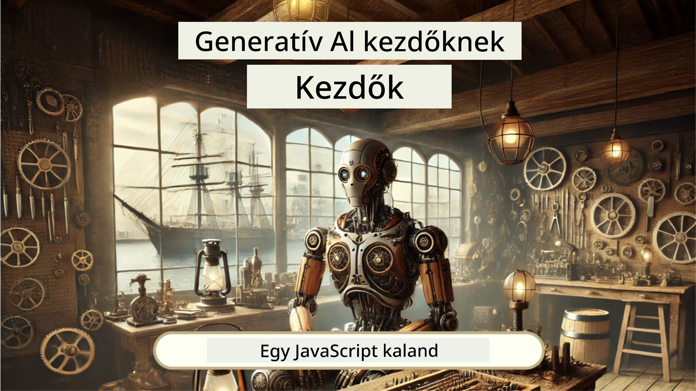
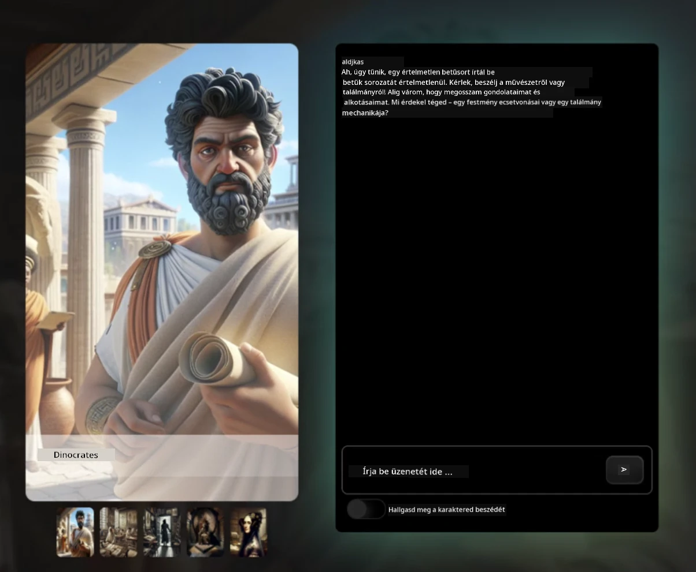
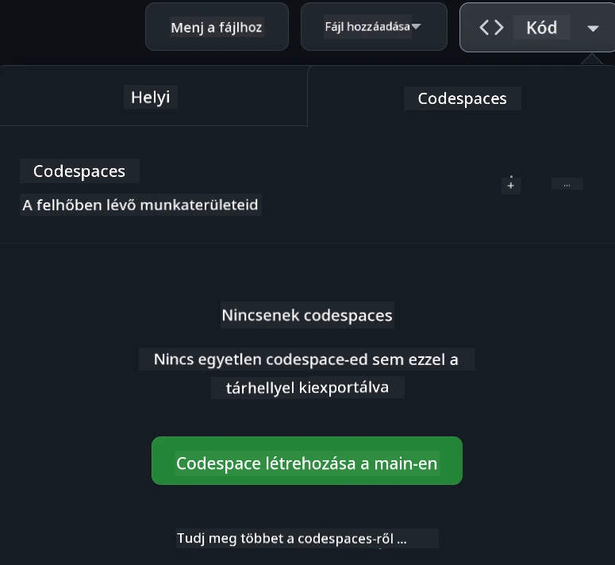

<!--
CO_OP_TRANSLATOR_METADATA:
{
  "original_hash": "fea3a0fceb8ad86fd640c09cf63a2aac",
  "translation_date": "2026-01-07T02:16:35+00:00",
  "source_file": "README.md",
  "language_code": "hu"
}
-->
[](https://github.com/microsoft/Web-Dev-For-Beginners/blob/master/LICENSE)
[](https://GitHub.com/microsoft/Web-Dev-For-Beginners/graphs/contributors/)
[](https://GitHub.com/microsoft/Web-Dev-For-Beginners/issues/)
[](https://GitHub.com/microsoft/Web-Dev-For-Beginners/pulls/)
[](http://makeapullrequest.com)

[](https://GitHub.com/microsoft/Web-Dev-For-Beginners/watchers/)
[](https://GitHub.com/microsoft/Web-Dev-For-Beginners/network/)
[](https://GitHub.com/microsoft/Web-Dev-For-Beginners/stargazers/)

[](https://discord.gg/nTYy5BXMWG)

# Webfejlesztés kezdőknek - Tananyag

Ismerd meg a webfejlesztés alapjait Microsoft Cloud Advocates 12 hetes átfogó tanfolyamán. A 24 leckéből mindegyik a JavaScript, CSS és HTML témaköreit dolgozza fel gyakorlati projektek révén, mint például terráriumok, böngészőbővítmények és űrjátékok. Vegyél részt kvízekben, vitákban és gyakorlati feladatokban! Fejleszd készségeidet, és optimalizáld tudásod megtartását hatékony, projektalapú tanítási módszerünkkel. Kezdd el a kódolási utadat még ma!

Csatlakozz az Azure AI Foundry Discord közösséghez

[](https://discord.gg/nTYy5BXMWG)

Kövesd az alábbi lépéseket, hogy elindulj ezzel az anyaggal:
1. **Repository fork-olása**: Kattints ide [](https://GitHub.com/microsoft/Web-Dev-For-Beginners/fork)
2. **Repository klónozása**:  `git clone https://github.com/microsoft/Web-Dev-For-Beginners.git`
3. [**Csatlakozz az Azure AI Foundry Discord szerverhez, és ismerkedj szakértőkkel és fejlesztőtársakkal**](https://discord.com/invite/ByRwuEEgH4)

### 🌐 Többnyelvű támogatás

#### GitHub Action segítségével támogatott (Automatikus és mindig naprakész)

<!-- CO-OP TRANSLATOR LANGUAGES TABLE START -->
[Arabic](../ar/README.md) | [Bengali](../bn/README.md) | [Bulgarian](../bg/README.md) | [Burmese (Myanmar)](../my/README.md) | [Chinese (Simplified)](../zh/README.md) | [Chinese (Traditional, Hong Kong)](../hk/README.md) | [Chinese (Traditional, Macau)](../mo/README.md) | [Chinese (Traditional, Taiwan)](../tw/README.md) | [Croatian](../hr/README.md) | [Czech](../cs/README.md) | [Danish](../da/README.md) | [Dutch](../nl/README.md) | [Estonian](../et/README.md) | [Finnish](../fi/README.md) | [French](../fr/README.md) | [German](../de/README.md) | [Greek](../el/README.md) | [Hebrew](../he/README.md) | [Hindi](../hi/README.md) | [Hungarian](./README.md) | [Indonesian](../id/README.md) | [Italian](../it/README.md) | [Japanese](../ja/README.md) | [Kannada](../kn/README.md) | [Korean](../ko/README.md) | [Lithuanian](../lt/README.md) | [Malay](../ms/README.md) | [Malayalam](../ml/README.md) | [Marathi](../mr/README.md) | [Nepali](../ne/README.md) | [Nigerian Pidgin](../pcm/README.md) | [Norwegian](../no/README.md) | [Persian (Farsi)](../fa/README.md) | [Polish](../pl/README.md) | [Portuguese (Brazil)](../br/README.md) | [Portuguese (Portugal)](../pt/README.md) | [Punjabi (Gurmukhi)](../pa/README.md) | [Romanian](../ro/README.md) | [Russian](../ru/README.md) | [Serbian (Cyrillic)](../sr/README.md) | [Slovak](../sk/README.md) | [Slovenian](../sl/README.md) | [Spanish](../es/README.md) | [Swahili](../sw/README.md) | [Swedish](../sv/README.md) | [Tagalog (Filipino)](../tl/README.md) | [Tamil](../ta/README.md) | [Telugu](../te/README.md) | [Thai](../th/README.md) | [Turkish](../tr/README.md) | [Ukrainian](../uk/README.md) | [Urdu](../ur/README.md) | [Vietnamese](../vi/README.md)

> **Szeretnéd helyben klónozni?**

> Ez a repository több mint 50 nyelv fordítását tartalmazza, ami jelentősen megnöveli a letöltési méretet. Ha letöltés nélkül szeretnél klónozni, használj sparse checkoutot:
> ```bash
> git clone --filter=blob:none --sparse https://github.com/microsoft/Web-Dev-For-Beginners.git
> cd Web-Dev-For-Beginners
> git sparse-checkout set --no-cone '/*' '!translations' '!translated_images'
> ```
> Ez mindent megad, amire a tanfolyam elvégzéséhez szükséged van sokkal gyorsabb letöltéssel.
<!-- CO-OP TRANSLATOR LANGUAGES TABLE END -->

**Ha szeretnél további fordítási nyelveket támogatni, azok [itt vannak felsorolva](https://github.com/Azure/co-op-translator/blob/main/getting_started/supported-languages.md)**

[](https://open.vscode.dev/microsoft/Web-Dev-For-Beginners)

#### 🧑‍🎓 _Diák vagy?_

Látogass el a [**Diákok oldalára**](https://docs.microsoft.com/learn/student-hub/?WT.mc_id=academic-77807-sagibbon), ahol kezdő forrásokat, Diák csomagokat, és még ingyenes tanúsítvány-vouchereket is találhatsz. Ezt az oldalt érdemes könyvjelzőzni, és időről időre visszanézni, mert havonta frissül a tartalom.

### 📣 Bejelentés - Új GitHub Copilot Agent mód kihívások!

Új kihívás érkezett, keresd a "GitHub Copilot Agent Challenge 🚀" címkét a legtöbb fejezetben. Ez egy új kihívás, amelyet GitHub Copilot és Agent módban kell teljesíteni. Ha még nem használtad az Agent módot, ez nemcsak szöveg generálására képes, hanem fájlokat is létrehoz, szerkeszt, parancsokat futtat és még sok mást.

### 📣 Bejelentés - _Új generatív AI projekt_

Új AI Asszisztens projekt érkezett, nézd meg [projekt](./9-chat-project/README.md)

### 📣 Bejelentés - _Új tananyag_ Generatív AI JavaScript-hez

Ne hagyd ki új Generatív AI tananyagunkat!

Látogass el ide: [https://aka.ms/genai-js-course](https://aka.ms/genai-js-course) hogy elindulj!



- Leckék az alapoktól a RAG-ig.
- Interakció történelmi karakterekkel GenAI és társalkalmazásunk segítségével.
- Szórakoztató és lebilincselő narratíva, időutazás!




Minden lecke tartalmaz egy feladatot, tudásellenőrzést és egy kihívást, hogy eligazodj olyan témákban, mint:
- Promptolás és prompt tervezés
- Szöveges és képes alkalmazás générálás
- Keresőalkalmazások

Látogass el ide: [https://aka.ms/genai-js-course](https://aka.ms/genai-js-course) hogy elindulj!


## 🌱 Első lépések

> **Tanárok**, [ajánlásokat adtunk](for-teachers.md) a tananyag használatához. Örömmel várjuk visszajelzéseteket [vitafórumunkon](https://github.com/microsoft/Web-Dev-For-Beginners/discussions/categories/teacher-corner)!

**[Tanulók](https://aka.ms/student-page/?WT.mc_id=academic-77807-sagibbon)** minden leckéhez kezdjetek egy előadás előtti kvízzel, majd olvassátok el az előadás anyagát, végezzétek el a különböző tevékenységeket, és ellenőrizzétek tudásotokat az előadás utáni kvízzel.

A tanulási élmény fokozásához dolgozzatok közösen a projekteken társaiddal! A vitákat bátorítjuk a [vitafórumunkon](https://github.com/microsoft/Web-Dev-For-Beginners/discussions), ahol moderátoraink segítséget nyújtanak kérdéseitekre.

Továbbá ajánljuk, hogy mélyítsd tudásodat a [Microsoft Learn](https://learn.microsoft.com/users/wirelesslife/collections/p1ddcy5jwy0jkm?WT.mc_id=academic-77807-sagibbon) platformján található további tananyagaink segítségével.

### 📋 Fejlesztői környezet beállítása

Ez a tananyag már előkészített fejlesztői környezettel érkezik! Kezdetnek választhatod a tananyagot [Codespace-ben](https://github.com/features/codespaces/) futtatni (_böngésző alapú, telepítés nélküli környezet_), vagy helyileg a számítógépeden egy szövegszerkesztővel, például [Visual Studio Code](https://code.visualstudio.com/?WT.mc_id=academic-77807-sagibbon) használva.

#### Repository létrehozása
Az egyszerű mentés érdekében érdemes saját másolatot készítened ebből a repository-ból. Ezt a lap tetején található **Használd ezt a sablont** gombra kattintva teheted meg. Ezzel egy új repository jön létre GitHub fiókodban a tananyag másolatával.

Kövesd a lépéseket:
1. **Forkold a Repository-t**: Kattints erre az oldal jobb felső sarkában található "Fork" gombra.
2. **Klónozd a Repository-t**:  `git clone https://github.com/microsoft/Web-Dev-For-Beginners.git`

#### Tananyag futtatása Codespace-ben

A létrehozott repository példányában kattints a **Code** gombra, majd válaszd az **Open with Codespaces** lehetőséget. Ez létrehoz egy új Codespace-t a munkához.



#### Tananyag futtatása helyileg a számítógépen

A tananyag helyi futtatásához szükséged lesz egy szövegszerkesztőre, böngészőre és egy parancssorra. Első leckénk, a [Programozási nyelvek és eszközök bevezetése](../../1-getting-started-lessons/1-intro-to-programming-languages), végigvezet a különböző eszközválasztási lehetőségeken, hogy megtaláld, ami neked a legjobb.

Ajánlásunk a [Visual Studio Code](https://code.visualstudio.com/?WT.mc_id=academic-77807-sagibbon) használata szerkesztőként, amely rendelkezik beépített [Terminállal](https://code.visualstudio.com/docs/terminal/basics/?WT.mc_id=academic-77807-sagibbon). A Visual Studio Code-ot innen töltheted le: [ide](https://code.visualstudio.com/?WT.mc_id=academic-77807-sagibbon).


1. Klónozd a repository-t a számítógépedre. Ehhez kattints a **Code** gombra, és másold a URL-t:

    [CodeSpace](./images/createcodespace.png)
    Ezután nyissa meg a [Terminált](https://code.visualstudio.com/docs/terminal/basics/?WT.mc_id=academic-77807-sagibbon) a [Visual Studio Code](https://code.visualstudio.com/?WT.mc_id=academic-77807-sagibbon) alkalmazásban, és futtassa a következő parancsot, cserélve le a `<your-repository-url>` részt a most másolt URL-re:

    ```bash 
    git clone <your-repository-url>
    ```

2. Nyissa meg a mappát a Visual Studio Code-ban. Ezt úgy teheti meg, hogy a **Fájl** > **Mappa megnyitása** menüpontra kattint, majd kiválasztja a nemrég klónozott mappát.


>  Ajánlott Visual Studio Code bővítmények:
>
> * [Live Server](https://marketplace.visualstudio.com/items?itemName=ritwickdey.LiveServer&WT.mc_id=academic-77807-sagibbon) - HTML oldalak előnézete a Visual Studio Code-ban
> * [Copilot](https://marketplace.visualstudio.com/items?itemName=GitHub.copilot&WT.mc_id=academic-77807-sagibbon) - segít gyorsabban kódot írni

## 📂 Minden leckében megtalálható:

- választható vázlatkép
- választható kiegészítő videó
- elő-lecke bemelegítő kvíz
- írott lecke
- projektalapú leckék esetén lépésről lépésre útmutatók a projekt megépítéséhez
- tudásellenőrzések
- kihívás
- kiegészítő olvasmány
- [lecke utáni kvíz](https://ff-quizzes.netlify.app/web/)

> **Megjegyzés a kvízekhez**: Minden kvíz a Quiz-app mappában található, összesen 48 kvíz, mindegyik három kérdéssel. Ezek elérhetők [itt](https://ff-quizzes.netlify.app/web/), a kvíz alkalmazás helyben is futtatható vagy Azure-ra telepíthető; kövesse az utasításokat a `quiz-app` mappában.

## 🗃️ Leckék

|     |                       Projekt neve                        |                            Tanított fogalmak                            | Tanulási célok                                                                                                                    |                                                         Kapcsolódó lecke                                                          |         Szerző          |
| :-: | :------------------------------------------------------: | :--------------------------------------------------------------------: | -------------------------------------------------------------------------------------------------------------------------------- | :----------------------------------------------------------------------------------------------------------------------------: | :---------------------: |
| 01  |                     Kezdő lépések                        |           Bevezetés a programozásba és a szakmai eszközökbe            | Ismerje meg a legtöbb programozási nyelv alapjait és a professzionális fejlesztők munkáját segítő szoftvereket                  | [Bevezetés a programozási nyelvekbe és az eszközökbe](./1-getting-started-lessons/1-intro-to-programming-languages/README.md) |         Jasmine         |
| 02  |                     Kezdő lépések                        |             A GitHub alapjai, csapatmunkával                         | Hogyan használja a GitHubot projektjeiben, és hogyan működjön együtt másokkal egy kódalapon                                     |                            [Bevezetés a GitHubba](./1-getting-started-lessons/2-github-basics/README.md)                             |          Floor          |
| 03  |                     Kezdő lépések                        |                             Hozzáférhetőség                             | Ismerkedjen meg a webes hozzáférhetőség alapjaival                                                                             |                       [Hozzáférhetőség alapjai](./1-getting-started-lessons/3-accessibility/README.md)                       |       Christopher       |
| 04  |                        JS Alapok                         |                         JavaScript adattípusok                        | Ismerkedjen meg a JavaScript adattípusok alapjaival                                                                           |                                       [Adattípusok](./2-js-basics/1-data-types/README.md)                                        |         Jasmine         |
| 05  |                        JS Alapok                         |                         Függvények és metódusok                       | Ismerkedjen meg a függvényekkel és metódusokkal, amelyek az alkalmazás logikáját kezelik                                        |                              [Függvények és metódusok](./2-js-basics/2-functions-methods/README.md)                               | Jasmine és Christopher  |
| 06  |                        JS Alapok                         |                        Döntéshozatal JS-ben                           | Ismerje meg, hogyan hozzon létre feltételeket a kódjában döntéshozatali módszerekkel                                            |                                 [Döntéshozatal](./2-js-basics/3-making-decisions/README.md)                                  |         Jasmine         |
| 07  |                        JS Alapok                         |                            Tömbök és ciklusok                         | Dolgozzon adatokkal tömbök és ciklusok segítségével JavaScript-ben                                                            |                                   [Tömbök és ciklusok](./2-js-basics/4-arrays-loops/README.md)                                    |         Jasmine         |
| 08  |       [Terrárium](./3-terrarium/solution/README.md)       |                            HTML gyakorlatban                          | Építse meg az online terrárium HTML-ját, fókuszálva a layout létrehozására                                                     |                                 [Bevezetés a HTML-be](./3-terrarium/1-intro-to-html/README.md)                                 |           Jen           |
| 09  |       [Terrárium](./3-terrarium/solution/README.md)       |                            CSS gyakorlatban                           | Építse meg az online terrárium CSS-ét, fókuszálva a CSS alapjaira, beleértve az oldal reszponzívvá tételét                      |                                  [Bevezetés a CSS-be](./3-terrarium/2-intro-to-css/README.md)                                  |           Jen           |
| 10  |            [Terrárium](./3-terrarium/solution/README.md)            |                 JavaScript bezárások, DOM manipuláció                  | Készítse el a JavaScript-et, amely a terráriumot drag/drop felületté alakítja, fókuszálva a bezárásokra és a DOM manipulációra |                  [JavaScript bezárások és DOM manipuláció](./3-terrarium/3-intro-to-DOM-and-closures/README.md)                   |           Jen           |
| 11  |          [Gépelős játék](./4-typing-game/solution/README.md)          |                          Gépelős játék készítése                        | Tanulja meg, hogyan használjon billentyűzet eseményeket JavaScript alkalmazása logikájának vezérléséhez                         |                                [Eseményvezérelt programozás](./4-typing-game/typing-game/README.md)                                |       Christopher       |
| 12  | [Zöld böngészőbővítmény](./5-browser-extension/solution/README.md) |                         Böngészőkkel való munka                       | Ismerje meg a böngészők működését, történetét és hogyan hozhat létre egy első bővítmény elemeket                               |                               [A böngészőkről](./5-browser-extension/1-about-browsers/README.md)                                |           Jen           |
| 13  | [Zöld böngészőbővítmény](./5-browser-extension/solution/README.md) | Űrlap készítése, API hívása és változók tárolása helyi tárolóban        | Készítse el a JavaScript elemeket bővítményéhez az API hívásokhoz, helyi tárolóban tárolt változókkal                           |                [API-k, űrlapok és helyi tárolás](./5-browser-extension/2-forms-browsers-local-storage/README.md)                 |           Jen           |
| 14  | [Zöld böngészőbővítmény](./5-browser-extension/solution/README.md) |          Háttérfolyamatok a böngészőben, web teljesítmény               | Használja a böngésző háttérfolyamatait a bővítmény ikon kezelésére; ismerje meg a web teljesítményt és néhány optimalizálást    |             [Háttérfeladatok és teljesítmény](./5-browser-extension/3-background-tasks-and-performance/README.md)              |           Jen           |
| 15  |           [Űrjáték](./6-space-game/solution/README.md)           |             Fejlettebb játékkészítés JavaScript-tel                   | Ismerje meg az öröklődést osztályokkal és komponálással, valamint a Pub/Sub mintát, felkészülve egy játék fejlesztésére          |                      [Bevezetés a fejlett játékkészítésbe](./6-space-game/1-introduction/README.md)                             |          Chris          |
| 16  |           [Űrjáték](./6-space-game/solution/README.md)           |                           Rajzolás vászonra                            | Ismerje meg a Canvas API-t, amely elemeket rajzol a képernyőre                                                                |                                [Rajzolás vászonra](./6-space-game/2-drawing-to-canvas/README.md)                                |          Chris          |
| 17  |           [Űrjáték](./6-space-game/solution/README.md)           |                   Mozgatás a képernyőn                                | Fedezze fel, hogyan mozdíthatók el az elemek a kartézián koordináták és a Canvas API használatával                             |                           [Mozgatás képernyőn](./6-space-game/3-moving-elements-around/README.md)                            |          Chris          |
| 18  |           [Űrjáték](./6-space-game/solution/README.md)           |                          Ütközés érzékelés                            | Tegye lehetővé, hogy az elemek ütközzenek, reagáljanak egymásra billentyűnyomásra, és biztosítson lehűlési funkciót a játék hatékonyságához |                              [Ütközés érzékelés](./6-space-game/4-collision-detection/README.md)                              |          Chris          |
| 19  |           [Űrjáték](./6-space-game/solution/README.md)           |                             Pontszám vezetése                          | Végezzen matematikai számításokat a játék állapota és teljesítménye alapján                                                    |                                    [Pontszámlálás](./6-space-game/5-keeping-score/README.md)                                    |          Chris          |
| 20  |           [Űrjáték](./6-space-game/solution/README.md)           |                     A játék vége és újraindítása                       | Ismerje meg a játék befejezését és újraindítását, beleértve az erőforrások takarítását és a változók alaphelyzetbe állítását     |                                [A befejezés feltétele](./6-space-game/6-end-condition/README.md)                                |          Chris          |
| 21  |         [Banki alkalmazás](./7-bank-project/solution/README.md)          |                 HTML sablonok és útvonalak egy webalkalmazásban       | Ismerje meg, hogyan készítsen többoldalas webhely felépítését routing és HTML sablonok használatával                            |                            [HTML sablonok és útvonalak](./7-bank-project/1-template-route/README.md)                             |          Yohan          |
| 22  |         [Banki alkalmazás](./7-bank-project/solution/README.md)          |                  Bejelentkezési és regisztrációs űrlap készítése       | Ismerje meg az űrlapkészítést és a validációs rutinok kezelését                                                               |                                           [Űrlapok](./7-bank-project/2-forms/README.md)                                           |          Yohan          |
| 23  |         [Banki alkalmazás](./7-bank-project/solution/README.md)          |                   Adatlekérés és -használati módszerek                | Hogyan áramlik az adat az alkalmazásában, hogyan kérheti le, tárolhatja és dobhatja el                                          |                                            [Adatok](./7-bank-project/3-data/README.md)                                            |          Yohan          |
| 24  |         [Banki alkalmazás](./7-bank-project/solution/README.md)          |                      Állapotkezelési fogalmak                         | Ismerje meg, hogyan tartja meg az alkalmazás az állapotot és hogyan kezelje programozottan                                        |                                [Állapotkezelés](./7-bank-project/4-state-management/README.md)                                |          Yohan          |
| 25 | [Böngésző/VScode kód](../../8-code-editor) | Munka a VScode-dal | Ismerje meg a kódszerkesztő használatát | [VScode kódszerkesztő használata](./8-code-editor/1-using-a-code-editor/README.md) | Chris |
| 26 | [AI asszisztensek](./9-chat-project/README.md) | Munka AI-val | Ismerje meg, hogyan készíthet saját AI asszisztenst | [AI asszisztens projekt](./9-chat-project/README.md) | Chris |

## 🏫 Pedagógia

Tananyagunkat két kulcsfontosságú pedagógiai elv alapján terveztük:
* projekt-alapú tanulás
* gyakori kvízek

A program bemutatja a JavaScript, HTML és CSS alapjait, valamint a legújabb eszközöket és technikákat, amelyeket a mai webfejlesztők használnak. A hallgatóknak lehetőségük lesz gyakorlati tapasztalatokat szerezni egy gépelős játék, virtuális terrárium, környezetbarát böngészőbővítmény, űrinváziós játék és egy üzleti banki alkalmazás építésével. A sorozat végére szilárd alapokat szereznek a webfejlesztésben.

> 🎓 Az első néhány leckét ebben a tananyagban a Microsoft Learn-en egy [Tanulási útként](https://docs.microsoft.com/learn/paths/web-development-101/?WT.mc_id=academic-77807-sagibbon) is elvégezheti!

Azáltal, hogy a tartalom projektekhez kapcsolódik, a folyamat élvezetesebb a diákok számára, és fokozza a fogalmak megőrzését. Több bevezető leckét is írtunk a JavaScript alapjai témában, amelyeket a "[Beginners Series to: JavaScript](https://channel9.msdn.com/Series/Beginners-Series-to-JavaScript/?WT.mc_id=academic-77807-sagibbon)" videósorozat videóival egészítettünk ki, melynek néhány szerzője hozzájárult ehhez a tananyaghoz.

Ezenkívül egy alacsony tétű kvíz az óra előtt segíti a hallgató tanulási szándékát, míg egy második kvíz az óra után a további megőrzést biztosítja. Ez a tananyag rugalmas és szórakoztató jellegű, egészben vagy részleteiben is elvégezhető. A projektek kicsiben indulnak, és a 12 hetes ciklus végére egyre összetettebbek lesznek.

Bár szándékosan kerültük a JavaScript keretrendszerek bevezetését, hogy a webfejlesztői alapokat fejlesszük bevezetőként egy keretrendszer használata előtt, a tananyag befejezésének jó következő lépése lehet a Node.js elsajátítása egy másik videósorozaton keresztül: "[Beginner Series to: Node.js](https://channel9.msdn.com/Series/Beginners-Series-to-Nodejs/?WT.mc_id=academic-77807-sagibbon)".

> Tekintse meg [Magatartási kódexünket](CODE_OF_CONDUCT.md) és a [Hozzájárulási](CONTRIBUTING.md) útmutatónkat. Várjuk konstruktív visszajelzéseit!


## 🧭 Offline hozzáférés

Ezt a dokumentációt offline is futtathatja a [Docsify](https://docsify.js.org/#/) használatával. Forkolja ezt a repót, [telepítse a Docsify-t](https://docsify.js.org/#/quickstart) a helyi gépére, majd a repó gyökérmappájában írja be a `docsify serve` parancsot. A weboldal a 3000-es porton lesz elérhető a localhoston: `localhost:3000`.

## 📘 PDF

Az összes leckéről készült PDF itt található: [ide kattintva](https://microsoft.github.io/Web-Dev-For-Beginners/pdf/readme.pdf).


## 🎒 További tanfolyamok
Csapatunk más tanfolyamokat is készít! Nézd meg:

<!-- CO-OP TRANSLATOR OTHER COURSES START -->
### LangChain
[](https://aka.ms/langchain4j-for-beginners)
[](https://aka.ms/langchainjs-for-beginners?WT.mc_id=m365-94501-dwahlin)

---

### Azure / Edge / MCP / Ügynökök
[](https://github.com/microsoft/AZD-for-beginners?WT.mc_id=academic-105485-koreyst)
[](https://github.com/microsoft/edgeai-for-beginners?WT.mc_id=academic-105485-koreyst)
[](https://github.com/microsoft/mcp-for-beginners?WT.mc_id=academic-105485-koreyst)
[](https://github.com/microsoft/ai-agents-for-beginners?WT.mc_id=academic-105485-koreyst)

---
 
### Generatív MI sorozat
[](https://github.com/microsoft/generative-ai-for-beginners?WT.mc_id=academic-105485-koreyst)
[-9333EA?style=for-the-badge&labelColor=E5E7EB&color=9333EA)](https://github.com/microsoft/Generative-AI-for-beginners-dotnet?WT.mc_id=academic-105485-koreyst)
[-C084FC?style=for-the-badge&labelColor=E5E7EB&color=C084FC)](https://github.com/microsoft/generative-ai-for-beginners-java?WT.mc_id=academic-105485-koreyst)
[-E879F9?style=for-the-badge&labelColor=E5E7EB&color=E879F9)](https://github.com/microsoft/generative-ai-with-javascript?WT.mc_id=academic-105485-koreyst)

---
 
### Alapvető tanulás
[](https://aka.ms/ml-beginners?WT.mc_id=academic-105485-koreyst)
[](https://aka.ms/datascience-beginners?WT.mc_id=academic-105485-koreyst)
[](https://aka.ms/ai-beginners?WT.mc_id=academic-105485-koreyst)
[](https://github.com/microsoft/Security-101?WT.mc_id=academic-96948-sayoung)
[](https://aka.ms/webdev-beginners?WT.mc_id=academic-105485-koreyst)
[](https://aka.ms/iot-beginners?WT.mc_id=academic-105485-koreyst)
[](https://github.com/microsoft/xr-development-for-beginners?WT.mc_id=academic-105485-koreyst)

---
 
### Copilot sorozat
[](https://aka.ms/GitHubCopilotAI?WT.mc_id=academic-105485-koreyst)
[](https://github.com/microsoft/mastering-github-copilot-for-dotnet-csharp-developers?WT.mc_id=academic-105485-koreyst)
[](https://github.com/microsoft/CopilotAdventures?WT.mc_id=academic-105485-koreyst)
<!-- CO-OP TRANSLATOR OTHER COURSES END -->

## Segítség kérése

Ha elakadsz, vagy kérdéseid vannak az MI-alkalmazások fejlesztésével kapcsolatban, csatlakozz más tanulókhoz és tapasztalt fejlesztőkhöz az MCP témájú beszélgetésekben. Ez egy támogató közösség, ahol szívesen fogadnak kérdéseket, és a tudás szabadon megosztott.

[](https://discord.gg/nTYy5BXMWG)

Ha termék visszajelzésed vagy hibákat tapasztalsz a fejlesztés során, látogass el ide:

[](https://aka.ms/foundry/forum)

## Licenc

Ez a tárhely az MIT licenc alatt áll. További információért lásd a [LICENSE](../../LICENSE) fájlt.

---

<!-- CO-OP TRANSLATOR DISCLAIMER START -->
**Jogi nyilatkozat**:
Ez a dokumentum az AI fordító szolgáltatás [Co-op Translator](https://github.com/Azure/co-op-translator) segítségével készült. Bár igyekszünk pontosak lenni, kérjük, vegye figyelembe, hogy az automatikus fordítások hibákat vagy pontatlanságokat tartalmazhatnak. Az eredeti dokumentum a saját nyelvén tekintendő hivatalos forrásnak. Fontos információk esetén javasolt szakmai emberi fordítást igénybe venni. Nem vállalunk felelősséget a fordítás használatából eredő félreértésekért vagy félreértelmezésekért.
<!-- CO-OP TRANSLATOR DISCLAIMER END -->