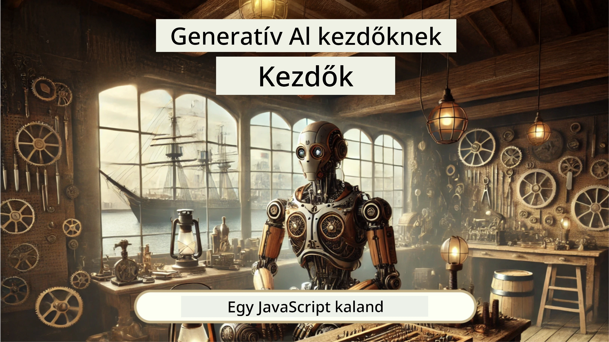
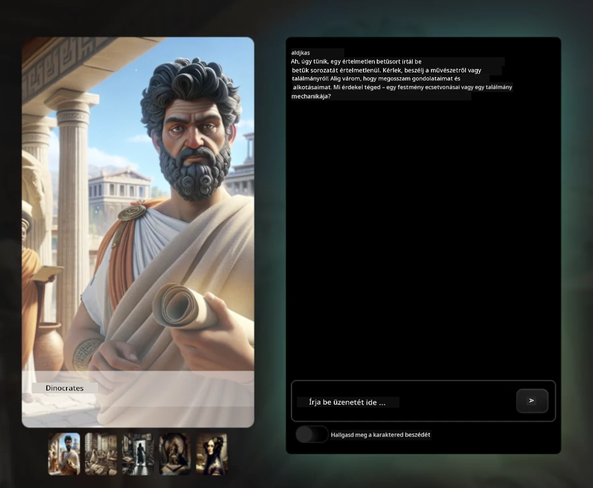
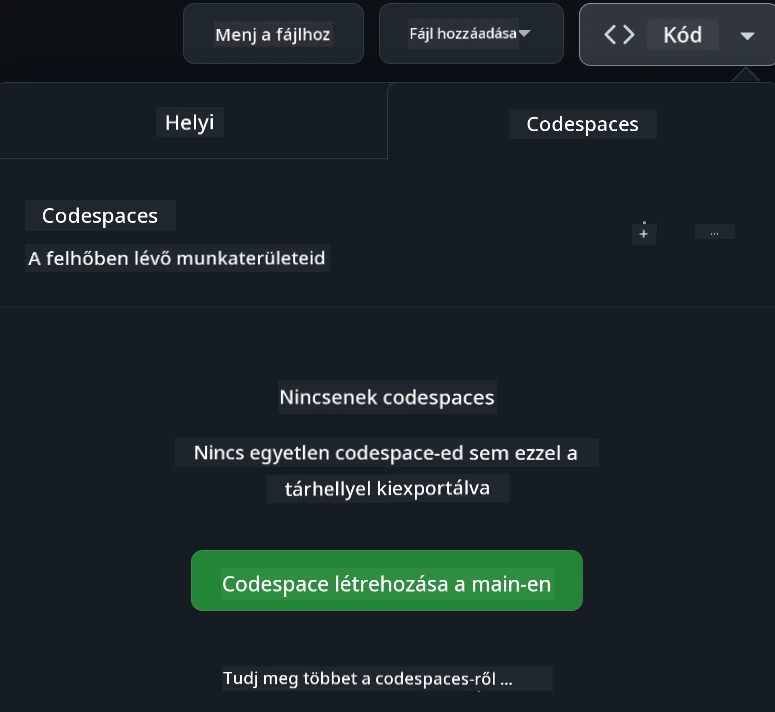

[](https://github.com/microsoft/Web-Dev-For-Beginners/blob/master/LICENSE)
[](https://GitHub.com/microsoft/Web-Dev-For-Beginners/graphs/contributors/)
[](https://GitHub.com/microsoft/Web-Dev-For-Beginners/issues/)
[](https://GitHub.com/microsoft/Web-Dev-For-Beginners/pulls/)
[](http://makeapullrequest.com) 

[](https://GitHub.com/microsoft/Web-Dev-For-Beginners/watchers/)
[](https://GitHub.com/microsoft/Web-Dev-For-Beginners/network/)
[](https://GitHub.com/microsoft/Web-Dev-For-Beginners/stargazers/)

[](https://discord.gg/nTYy5BXMWG)

# Webfejlesztés kezdőknek - Tanmenet

Ismerkedjen meg a webfejlesztés alapjaival a Microsoft Cloud Advocates által készített 12 hetes átfogó tanfolyamunkkal. Mind a 24 lecke a JavaScript, CSS és HTML témakörébe nyújt betekintést gyakorlati projektek segítségével, mint például terráriumok, böngészőkiegészítők és űrjátékok. Vegyen részt kvízekben, beszélgetésekben és gyakorlati feladatokban. Fejlessze képességeit és optimalizálja tudásának megőrzését hatékony, projekten alapuló oktatásunkkal. Kezdje el a kódolási kalandot még ma!

Csatlakozzon az Azure AI Foundry Discord közösséghez

[](https://discord.gg/nTYy5BXMWG)

Kövesse az alábbi lépéseket, hogy elkezdje használni ezeket az erőforrásokat:
1. **Forkolja a tárházat**: Kattintson ide [](https://GitHub.com/microsoft/Web-Dev-For-Beginners/fork)
2. **Klónozza a tárházat**:   `git clone https://github.com/microsoft/Web-Dev-For-Beginners.git`
3. [**Csatlakozzon az Azure AI Foundry Discordhoz, hogy találkozzon szakértőkkel és fejlesztőtársaival**](https://discord.com/invite/ByRwuEEgH4)

### 🌐 Többnyelvű támogatás

#### GitHub Action segítségével támogatott (Automatizált és Mindig naprakész)

<!-- CO-OP TRANSLATOR LANGUAGES TABLE START -->
[Arab](../ar/README.md) | [Bengáli](../bn/README.md) | [Bolgár](../bg/README.md) | [Burmese (Myanmar)](../my/README.md) | [Kínai (egyszerűsített)](../zh-CN/README.md) | [Kínai (hagyományos, Hong Kong)](../zh-HK/README.md) | [Kínai (hagyományos, Makaó)](../zh-MO/README.md) | [Kínai (hagyományos, Tajvan)](../zh-TW/README.md) | [Horvát](../hr/README.md) | [Cseh](../cs/README.md) | [Dán](../da/README.md) | [Holland](../nl/README.md) | [Észt](../et/README.md) | [Finn](../fi/README.md) | [Francia](../fr/README.md) | [Német](../de/README.md) | [Görög](../el/README.md) | [Héber](../he/README.md) | [Hindi](../hi/README.md) | [Magyar](./README.md) | [Indonéz](../id/README.md) | [Olasz](../it/README.md) | [Japán](../ja/README.md) | [Kannada](../kn/README.md) | [Khmer](../km/README.md) | [Koreai](../ko/README.md) | [Litván](../lt/README.md) | [Maláj](../ms/README.md) | [Malayalam](../ml/README.md) | [Marathi](../mr/README.md) | [Nepáli](../ne/README.md) | [Nigériai pidgin](../pcm/README.md) | [Norvég](../no/README.md) | [Perzsa (Farsi)](../fa/README.md) | [Lengyel](../pl/README.md) | [Portugál (Brazília)](../pt-BR/README.md) | [Portugál (Portugália)](../pt-PT/README.md) | [Pandzsábi (Gurmukhi)](../pa/README.md) | [Román](../ro/README.md) | [Orosz](../ru/README.md) | [Szerb (cirill)](../sr/README.md) | [Szlovák](../sk/README.md) | [Szlovén](../sl/README.md) | [Spanyol](../es/README.md) | [Szuahéli](../sw/README.md) | [Svéd](../sv/README.md) | [Tagalog (Filippínó)](../tl/README.md) | [Tamil](../ta/README.md) | [Telugu](../te/README.md) | [Thai](../th/README.md) | [Török](../tr/README.md) | [Ukrán](../uk/README.md) | [Urdu](../ur/README.md) | [Vietnami](../vi/README.md)

> **Szeretné helyben klónozni?**
>
> Ez a tárház több mint 50 nyelvi fordítást tartalmaz, ami jelentősen megnöveli a letöltési méretet. Ha fordítások nélkül szeretné klónozni, használja a sparse checkout-ot:
>
> **Bash / macOS / Linux:**
> ```bash
> git clone --filter=blob:none --sparse https://github.com/microsoft/Web-Dev-For-Beginners.git
> cd Web-Dev-For-Beginners
> git sparse-checkout set --no-cone '/*' '!translations' '!translated_images'
> ```
>
> **CMD (Windows):**
> ```cmd
> git clone --filter=blob:none --sparse https://github.com/microsoft/Web-Dev-For-Beginners.git
> cd Web-Dev-For-Beginners
> git sparse-checkout set --no-cone "/*" "!translations" "!translated_images"
> ```
>
> Ez mindent megad, amire szüksége van a tanfolyam elvégzéséhez sokkal gyorsabb letöltéssel.
<!-- CO-OP TRANSLATOR LANGUAGES TABLE END -->

**Ha további támogatott fordítási nyelveket szeretne, azok [itt találhatók](https://github.com/Azure/co-op-translator/blob/main/getting_started/supported-languages.md)**

[](https://open.vscode.dev/microsoft/Web-Dev-For-Beginners)

#### 🧑‍🎓 _Diák vagy?_

Látogass el a [**Diák Hub oldalra**](https://docs.microsoft.com/learn/student-hub/?WT.mc_id=academic-77807-sagibbon), ahol kezdő erőforrásokat, diák csomagokat és akár ingyenes tanúsítvány utalványokat is találsz. Ezt az oldalt érdemes rendszeresen könyvjelzőzni, mivel havonta frissítjük a tartalmat.

### 📣 Bejelentés - Új GitHub Copilot Agent mód kihívások!

Új kihívás került hozzáadásra "GitHub Copilot Agent Challenge 🚀" néven a legtöbb fejezetben. Ez egy új kihívás, amit a GitHub Copilot és az Agent mód segítségével teljesíthetsz. Ha még nem használtad az Agent módot, az nemcsak szöveg generálására képes, hanem fájlok létrehozására és szerkesztésére, parancsok futtatására és még sok másra.

### 📣 Bejelentés - _Új projekt a Generatív Mesterséges Intelligencia használatával_ 

Új AI asszisztens projekt került hozzáadásra, nézd meg a [projektdokumentációt](./9-chat-project/README.md)

### 📣 Bejelentés - _Új tanmenet_ JavaScript Generatív MI témában jelent meg

Ne hagyd ki új Generatív MI tanmenetünket!

Látogass el a [https://aka.ms/genai-js-course](https://aka.ms/genai-js-course) oldalra, és kezdj bele!



- Leckék az alapoktól a RAG-ig.
- Történelmi szereplőkkel léphetsz interakcióba a Generatív MI és kísérő alkalmazásunk segítségével.
- Szórakoztató és lebilincselő történet, időutazás élményével!




Minden lecke egy feladatot, egy tudásellenőrzést és egy kihívást tartalmaz, hogy segítsen a következő témák elsajátításában:
- Promptolás és prompt mérnöki munka
- Szöveg- és képalkalmazás generálás
- Keresőalkalmazások

Látogass el a [https://aka.ms/genai-js-course](https://aka.ms/genai-js-course) oldalra, és kezdj bele!


## 🌱 Kezdés

> **Tanárként** néhány javaslatot [ide](for-teachers.md) tettünk közzé a tanmenet használatára. Szívesen fogadjuk visszajelzésedet [vitafórumunkban](https://github.com/microsoft/Web-Dev-For-Beginners/discussions/categories/teacher-corner)!

**[Tanulók](https://aka.ms/student-page/?WT.mc_id=academic-77807-sagibbon)**, minden lecke előtt végezzetek bevezető kvízt, majd olvassátok el az anyagot, végezzétek el a feladatokat, és teszteljétek tudásotokat az utólagos kvízzel.

A tanulási élmény fokozása érdekében dolgozzatok együtt diáktársaitokkal a projekteken! A beszélgetések ösztönzöttek a [vitafórumunkon](https://github.com/microsoft/Web-Dev-For-Beginners/discussions), ahol moderátor csapatunk készen áll válaszolni kérdéseitekre.

A tanulmányaitok elősegítéséhez erősen ajánljuk a [Microsoft Learn](https://learn.microsoft.com/users/wirelesslife/collections/p1ddcy5jwy0jkm?WT.mc_id=academic-77807-sagibbon) platform további anyagainak felfedezését.

### 📋 Fejlesztői környezet beállítása

Ez a tanmenet egy működő fejlesztői környezettel érkezik! Kezdésként választhatjátok a tanmenet futtatását [Codespace-ben](https://github.com/features/codespaces/) (_böngésző alapú, telepítés nélküli környezet_), vagy helyben, a számítógépeden egy szövegszerkesztővel, például a [Visual Studio Code](https://code.visualstudio.com/?WT.mc_id=academic-77807-sagibbon) segítségével.

#### Hozd létre a saját tárházad
A munkád biztonságos mentése érdekében ajánlott létrehoznod a saját példányodat ebből a tárházból. Ezt megteheted az oldal tetején található **Use this template** gombra kattintva. Ez egy új tárházat hoz létre GitHub fiókodban, a tanmenet másolatával.

Lépések:
1. **Forkold a tárházat**: Kattints a jobb felső sarokban lévő "Fork" gombra.
2. **Klónozd a tárházat**:   `git clone https://github.com/microsoft/Web-Dev-For-Beginners.git`

#### Tanmenet futtatása Codespace-ben

A tárházadban, amit létrehoztál, kattints a **Code** gombra, majd válaszd az **Open with Codespaces** opciót. Ez létrehoz egy új Codespace-t a munkához.



#### Tanmenet futtatása helyben a számítógépeden

A tanmenet helyi futtatásához szükséged lesz egy szövegszerkesztőre, egy böngészőre és egy parancssori eszközre. Az első leckénk, [Bevezetés a programozási nyelvekbe és eszközökbe](../../1-getting-started-lessons/1-intro-to-programming-languages) segít több lehetőség közötti választásban ezek közül.

Ajánljuk a [Visual Studio Code](https://code.visualstudio.com/?WT.mc_id=academic-77807-sagibbon) használatát szerkesztőként, amely beépített [Terminált](https://code.visualstudio.com/docs/terminal/basics/?WT.mc_id=academic-77807-sagibbon) is tartalmaz. A Visual Studio Code letölthető [innen](https://code.visualstudio.com/?WT.mc_id=academic-77807-sagibbon).
1. Klónozd a tárolódat a számítógépedre. Ezt úgy teheted meg, hogy rákattintasz a **Code** gombra, és kimásolod az URL-t:

    [CodeSpace](./images/createcodespace.png)

    Ezután nyisd meg a [Terminált](https://code.visualstudio.com/docs/terminal/basics/?WT.mc_id=academic-77807-sagibbon) a [Visual Studio Code](https://code.visualstudio.com/?WT.mc_id=academic-77807-sagibbon) belül, és futtasd a következő parancsot, az `<your-repository-url>` helyére beillesztve a most kimásolt URL-t:

    ```bash 
    git clone <your-repository-url>
    ```

2. Nyisd meg a mappát a Visual Studio Code-ban. Ezt úgy teheted meg, hogy rákattintasz a **File** > **Open Folder** menüpontra, majd kiválasztod a klónozott mappát.


>  Ajánlott Visual Studio Code kiterjesztések:
>
> * [Live Server](https://marketplace.visualstudio.com/items?itemName=ritwickdey.LiveServer&WT.mc_id=academic-77807-sagibbon) - HTML oldalak előnézete a Visual Studio Code-on belül
> * [Copilot](https://marketplace.visualstudio.com/items?itemName=GitHub.copilot&WT.mc_id=academic-77807-sagibbon) - segít gyorsabban kódot írni

## 📂 Minden lecke tartalmaz:

- opcionális vázlatrajzot
- opcionális kiegészítő videót
- tanóra előtti bemelegítő kvízt
- írott leckét
- projekt alapú leckékhez lépésről lépésre útmutatókat a projekt megépítéséhez
- tudásellenőrzéseket
- kihívást
- kiegészítő olvasnivalót
- feladatot
- [tanóra utáni kvízt](https://ff-quizzes.netlify.app/web/)

> **Megjegyzés a kvízekhez**: Minden kvíz a Quiz-app mappában található, összesen 48 kvíz három kérdéssel. Elérhetőek [itt](https://ff-quizzes.netlify.app/web/), a kvízalkalmazás futtatható helyileg vagy telepíthető Azure-ra; kövesd az utasításokat a `quiz-app` mappában.

## 🗃️ Leckék

|     |                       Projekt neve                       |                            Tanított fogalmak                             | Tanulási célok                                                                                                                 |                                                         Hivatkozott lecke                                                          |         Szerző          |
| :-: | :------------------------------------------------------: | :--------------------------------------------------------------------: | ----------------------------------------------------------------------------------------------------------------------------------- | :----------------------------------------------------------------------------------------------------------------------------: | :---------------------: |
| 01  |                     Kezdés                      |           Bevezetés a programozásba és a szakmai eszközökbe           | Ismerd meg a legtöbb programozási nyelv alapjait és azokat a szoftvereket, amelyek segítik a profi fejlesztők munkáját | [Bevezetés a programozási nyelvekbe és eszközökbe](./1-getting-started-lessons/1-intro-to-programming-languages/README.md) |         Jasmine         |
| 02  |                     Kezdés                      |             A GitHub alapjai, beleértve a csapatmunkát             | Hogyan használd a GitHubot a projektedben, és hogyan működj együtt másokkal kódbázison                                                    |                            [Bevezetés a GitHubba](./1-getting-started-lessons/2-github-basics/README.md)                             |          Floor          |
| 03  |                     Kezdés                      |                             Akadálymentesség                              | Ismerd meg a web akadálymentesség alapjait                                                                                               |                       [Akadálymentesség alapjai](./1-getting-started-lessons/3-accessibility/README.md)                       |       Christopher       |
| 04  |                        JS alapok                         |                         JavaScript adattípusok                          | A JavaScript adattípusok alapjai                                                                                                 |                                       [Adattípusok](./2-js-basics/1-data-types/README.md)                                        |         Jasmine         |
| 05  |                        JS alapok                         |                         Függvények és metódusok                          | Ismerd meg a függvényeket és metódusokat az alkalmazás logikájának kezeléséhez                                                             |                              [Függvények és metódusok](./2-js-basics/2-functions-methods/README.md)                               | Jasmine és Christopher |
| 06  |                        JS alapok                         |                        Döntéshozatal JS-ben                        | Tanuld meg, hogyan hozz létre feltételeket a kódodban döntéshozatali módszerekkel                                                           |                                 [Döntéshozatal](./2-js-basics/3-making-decisions/README.md)                                  |         Jasmine         |
| 07  |                        JS alapok                         |                            Tömbök és ciklusok                            | Dolgozz adatkezeléssel tömbök és ciklusok segítségével JavaScriptben                                                                                 |                                   [Tömbök és ciklusok](./2-js-basics/4-arrays-loops/README.md)                                    |         Jasmine         |
| 08  |       [Terrárium](./3-terrarium/solution/README.md)       |                            HTML gyakorlatban                            | Építsd meg a HTML-t egy online terráriumhoz, a layout készítésére fókuszálva                                                         |                                 [Bevezetés a HTML-be](./3-terrarium/1-intro-to-html/README.md)                                 |           Jen           |
| 09  |       [Terrárium](./3-terrarium/solution/README.md)       |                            CSS gyakorlatban                             | Építsd meg a CSS-t az online terráriumhoz, a CSS alapjaira fókuszálva, beleértve az oldal reszponzívvá tételét                     |                                  [Bevezetés a CSS-be](./3-terrarium/2-intro-to-css/README.md)                                  |           Jen           |
| 10  |            [Terrárium](./3-terrarium/solution/README.md)            |                 JavaScript closures, DOM manipuláció                  | Építsd meg a JavaScript-et, hogy a terrárium drag/drop felületként működjön, fókuszálva a closures és a DOM kezelésére             |                  [JavaScript closures, DOM manipuláció](./3-terrarium/3-intro-to-DOM-and-closures/README.md)                   |           Jen           |
| 11  |          [Gépelős játék](./4-typing-game/solution/README.md)          |                          Gépelős játék építése                           | Tanuld meg, hogyan használd a billentyűzetes eseményeket appod logikájának vezérlésére                                                          |                                [Eseményvezérelt programozás](./4-typing-game/typing-game/README.md)                                |       Christopher       |
| 12  | [Zöld böngészőbővítmény](./5-browser-extension/solution/README.md) |                         Böngészőkkel való munka                          | Tanuld meg, hogyan működnek a böngészők, történetüket és hogyan használd a böngészőbővítmény első elemeinek létrehozásához                               |                               [A böngészőkről](./5-browser-extension/1-about-browsers/README.md)                                |           Jen           |
| 13  | [Zöld böngészőbővítmény](./5-browser-extension/solution/README.md) | Űrlap készítése, API hívása és helyi tároló változók használata | Építsd meg a böngészőbővítményed JavaScript elemeit egy API meghívásához helyi tároló változókkal                      |                [API-k, űrlapok és helyi tárolás](./5-browser-extension/2-forms-browsers-local-storage/README.md)                 |           Jen           |
| 14  | [Zöld böngészőbővítmény](./5-browser-extension/solution/README.md) |          Háttérfolyamatok a böngészőben, web teljesítmény          | Használd a böngésző háttérfolyamatait az ikonjának kezelésére; ismerd meg a web teljesítményét és néhány optimalizálási módszert   |             [Háttérfeladatok és teljesítmény](./5-browser-extension/3-background-tasks-and-performance/README.md)              |           Jen           |
| 15  |           [Űr játék](./6-space-game/solution/README.md)           |            Fejlettebb játékfejlesztés JavaScript-tel            | Ismerd meg az öröklést osztályok és összetétel (composition) használatával, valamint a Pub/Sub mintát, hogy előkészülj egy játék építésére              |                      [Bevezetés a fejlett játékfejlesztésbe](./6-space-game/1-introduction/README.md)                       |          Chris          |
| 16  |           [Űr játék](./6-space-game/solution/README.md)           |                           Rajzolás a vászonra                            | Ismerd meg a Canvas API-t, amellyel elemeket rajzolhatunk a képernyőre                                                                       |                                [Rajzolás a vászonra](./6-space-game/2-drawing-to-canvas/README.md)                                |          Chris          |
| 17  |           [Űr játék](./6-space-game/solution/README.md)           |                   Mozgatás a képernyőn                    | Fedezd fel, hogyan kaphatnak mozgást az elemek a kartézián koordináták és a Canvas API segítségével                                            |                           [Elemek mozgatása](./6-space-game/3-moving-elements-around/README.md)                           |          Chris          |
| 18  |           [Űr játék](./6-space-game/solution/README.md)           |                          Ütközésészlelés                           | Készíts ütközéseket és reagálást az elemek között billentyűleütésekkel és adj hozzá hűlési funkciót a játék teljesítményének biztosítására    |                              [Ütközésészlelés](./6-space-game/4-collision-detection/README.md)                              |          Chris          |
| 19  |           [Űr játék](./6-space-game/solution/README.md)           |                             Pontszám nyilvántartás                              | Végez matematika műveleteket a játék állapota és teljesítménye alapján                                                                |                                    [Pontszámlálás](./6-space-game/5-keeping-score/README.md)                                    |          Chris          |
| 20  |           [Űr játék](./6-space-game/solution/README.md)           |                     A játék befejezése és újraindítása                     | Tanuld meg a játék befejezését és újraindítását, beleértve az erőforrások takarítását és a változó értékek visszaállítását                              |                                [A befejezési feltétel](./6-space-game/6-end-condition/README.md)                                 |          Chris          |
| 21  |         [Banki alkalmazás](./7-bank-project/solution/README.md)          |                 HTML sablonok és útvonalak egy webalkalmazásban                 | Tanuld meg, hogyan készítsd el egy többoldalas weboldal felépítését routinggal és HTML sablonokkal                             |                            [HTML sablonok és útvonalak](./7-bank-project/1-template-route/README.md)                             |          Yohan          |
| 22  |         [Banki alkalmazás](./7-bank-project/solution/README.md)          |                  Bejelentkezési és regisztrációs űrlap készítése                   | Tanuld meg az űrlapkészítést és az érvényesítési rutinok kezelését                                                                          |                                           [Űrlapok](./7-bank-project/2-forms/README.md)                                           |          Yohan          |
| 23  |         [Banki alkalmazás](./7-bank-project/solution/README.md)          |                   Adatok lekérése és használata                   | Hogyan áramlanak be és ki az adatok az alkalmazásból, hogyan kérd le, tárold és szabadulj meg tőlük                                                 |                                            [Adatok](./7-bank-project/3-data/README.md)                                            |          Yohan          |
| 24  |         [Banki alkalmazás](./7-bank-project/solution/README.md)          |                      Állapotkezelés fogalmai                      | Tanuld meg, hogyan őrzi meg az alkalmazás az állapotot és hogyan kezeld programozottan                                                              |                                [Állapotkezelés](./7-bank-project/4-state-management/README.md)                                |          Yohan          |
| 25 | [Böngésző/VScode kód](../../8-code-editor) | Munka VScode-dal | Tanulj meg kódszerkesztőt használni | [VScode kódszerkesztő használata](./8-code-editor/1-using-a-code-editor/README.md) | Chris |
| 26 | [Mesterséges intelligencia asszisztensek](./9-chat-project/README.md) | Munkavégzés MI-vel | Tanuld meg, hogyan építsd fel a saját MI asszisztensed | [MI asszisztens projekt](./9-chat-project/README.md) | Chris |

## 🏫 Pedagógia

Tananyagunk két fontos pedagógiai elv szerint készült:
* projekt alapú tanulás
* gyakori kvízek

A program JavaScript, HTML és CSS alapjait tanítja meg, valamint a legújabb eszközöket és technikákat, amelyeket a mai webfejlesztők használnak. A diákoknak lehetőségük nyílik gyakorlati tapasztalat szerzésére gépelős játék, virtuális terrárium, környezetbarát böngészőbővítmény, űrhajós játék és üzleti bankalkalmazás építésével. A sorozat végére alapos webfejlesztési tudásra tesznek szert.

> 🎓 Az első néhány leckét ebben a tananyagban Microsoft Learn-ön [Tanulási útvonalként](https://docs.microsoft.com/learn/paths/web-development-101/?WT.mc_id=academic-77807-sagibbon) is végezheted!

Azáltal, hogy a tartalom a projektekhez igazodik, a folyamat érdekesebb a diákok számára, és a fogalmak megtartása is javul. Több kezdő leckét is írtunk JavaScript alapokból, hogy megismertessük az alapfogalmakat, kiegészítve a "[Beginners Series to: JavaScript](https://channel9.msdn.com/Series/Beginners-Series-to-JavaScript/?WT.mc_id=academic-77807-sagibbon)" videósorozat néhány szerzőjének oktató videóival, akik szintén hozzájárultak ehhez a tananyaghoz.

Továbbá egy alacsony tétű kvíz óra előtt beállítja a diák szándékát a tanulásra, míg egy második kvíz óra után elősegíti a tudás mélyebb rögzítését. Ez a tananyag rugalmas és szórakoztató, egészben vagy részleteiben is végezhető. A projektek kicsiben indulnak és fokozatosan egyre összetettebbek lesznek a 12 hetes ciklus végére.

Bár tudatosan kerültük a JavaScript keretrendszerek bevezetését, hogy az alapvető webfejlesztői készségekre koncentráljunk a keretrendszerhasználat előtt, a tananyag elvégzése után jó következő lépés a Node.js megismerése egy másik videósorozat segítségével: "[Beginner Series to: Node.js](https://channel9.msdn.com/Series/Beginners-Series-to-Nodejs/?WT.mc_id=academic-77807-sagibbon)".

> Látogasd meg [Viselkedési Kódexünket](CODE_OF_CONDUCT.md) és [Hozzájárulás](CONTRIBUTING.md) irányelveinket. Szívesen fogadjuk építő jellegű visszajelzéseidet!


## 🧭 Offline hozzáférés

Ezt a dokumentációt offline is futtathatod a [Docsify](https://docsify.js.org/#/) használatával. Fork-old ezt a repót, [telepítsd a Docsify-t](https://docsify.js.org/#/quickstart) a helyi gépedre, majd a repó gyökérmappájában írd be: `docsify serve`. Az oldal a 3000-es porton lesz elérhető a localhostodon: `localhost:3000`.

## 📘 PDF
A PDF az összes leckéről megtalálható [itt](https://microsoft.github.io/Web-Dev-For-Beginners/pdf/readme.pdf).


## 🎒 Egyéb kurzusok

Csapatunk más kurzusokat is készít! Nézd meg:

<!-- CO-OP TRANSLATOR OTHER COURSES START -->
### LangChain
[](https://aka.ms/langchain4j-for-beginners)
[](https://aka.ms/langchainjs-for-beginners?WT.mc_id=m365-94501-dwahlin)
[](https://github.com/microsoft/langchain-for-beginners?WT.mc_id=m365-94501-dwahlin)
---

### Azure / Edge / MCP / Ügynökök
[](https://github.com/microsoft/AZD-for-beginners?WT.mc_id=academic-105485-koreyst)
[](https://github.com/microsoft/edgeai-for-beginners?WT.mc_id=academic-105485-koreyst)
[](https://github.com/microsoft/mcp-for-beginners?WT.mc_id=academic-105485-koreyst)
[](https://github.com/microsoft/ai-agents-for-beginners?WT.mc_id=academic-105485-koreyst)

---
 
### Generatív AI sorozat
[](https://github.com/microsoft/generative-ai-for-beginners?WT.mc_id=academic-105485-koreyst)
[-9333EA?style=for-the-badge&labelColor=E5E7EB&color=9333EA)](https://github.com/microsoft/Generative-AI-for-beginners-dotnet?WT.mc_id=academic-105485-koreyst)
[-C084FC?style=for-the-badge&labelColor=E5E7EB&color=C084FC)](https://github.com/microsoft/generative-ai-for-beginners-java?WT.mc_id=academic-105485-koreyst)
[-E879F9?style=for-the-badge&labelColor=E5E7EB&color=E879F9)](https://github.com/microsoft/generative-ai-with-javascript?WT.mc_id=academic-105485-koreyst)

---
 
### Alapvető tanulás
[](https://aka.ms/ml-beginners?WT.mc_id=academic-105485-koreyst)
[](https://aka.ms/datascience-beginners?WT.mc_id=academic-105485-koreyst)
[](https://aka.ms/ai-beginners?WT.mc_id=academic-105485-koreyst)
[](https://github.com/microsoft/Security-101?WT.mc_id=academic-96948-sayoung)
[](https://aka.ms/webdev-beginners?WT.mc_id=academic-105485-koreyst)
[](https://aka.ms/iot-beginners?WT.mc_id=academic-105485-koreyst)
[](https://github.com/microsoft/xr-development-for-beginners?WT.mc_id=academic-105485-koreyst)

---
 
### Copilot sorozat
[](https://aka.ms/GitHubCopilotAI?WT.mc_id=academic-105485-koreyst)
[](https://github.com/microsoft/mastering-github-copilot-for-dotnet-csharp-developers?WT.mc_id=academic-105485-koreyst)
[](https://github.com/microsoft/CopilotAdventures?WT.mc_id=academic-105485-koreyst)
<!-- CO-OP TRANSLATOR OTHER COURSES END -->

## Segítségkérés

Ha elakadsz vagy kérdésed van AI alkalmazások fejlesztésével kapcsolatban. Csatlakozz tanulótársaidhoz és tapasztalt fejlesztőkhöz a MCP témájú beszélgetésekben. Ez egy támogató közösség, ahol a kérdések szívesen látottak, és a tudás szabadon megosztott.

[](https://discord.gg/nTYy5BXMWG)

Ha visszajelzésed vagy hibák vannak a fejlesztés közben, látogass el ide:

[](https://aka.ms/foundry/forum)

## Licenc

Ez a tároló az MIT licenc alatt áll. További információért lásd a [LICENSE](../../LICENSE) fájlt.

---

<!-- CO-OP TRANSLATOR DISCLAIMER START -->
**Felelősség kizárása**:  
Ezt a dokumentumot az AI fordító szolgáltatás [Co-op Translator](https://github.com/Azure/co-op-translator) segítségével fordítottuk. Bár törekszünk a pontosságra, kérjük, vegye figyelembe, hogy az automatikus fordítások hibákat vagy pontatlanságokat tartalmazhatnak. Az eredeti dokumentum a saját nyelvén tekintendő hivatalos forrásnak. Kritikus információk esetén professzionális emberi fordítás javasolt. Nem vállalunk felelősséget a fordítás használatából eredő félreértésekért vagy félreértelmezésekért.
<!-- CO-OP TRANSLATOR DISCLAIMER END -->