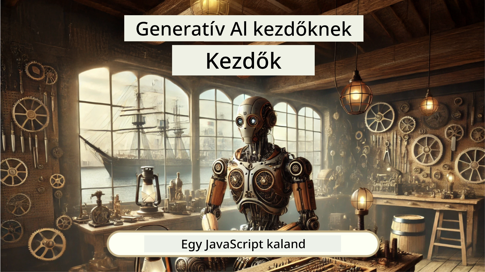
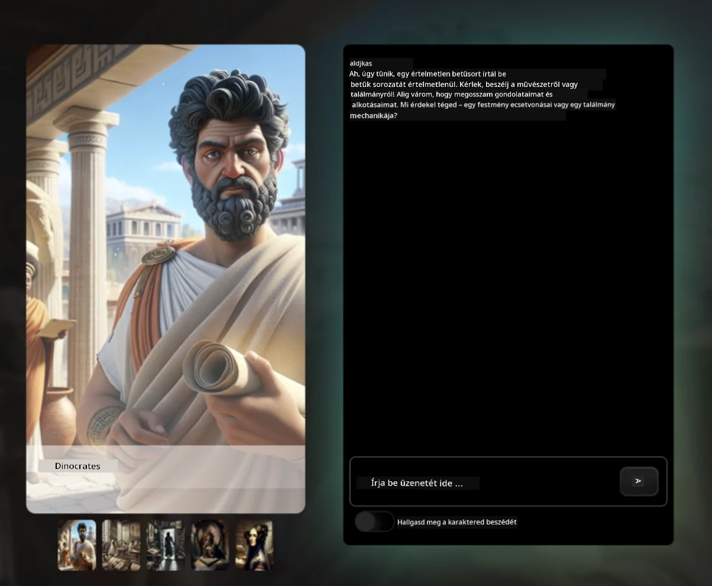
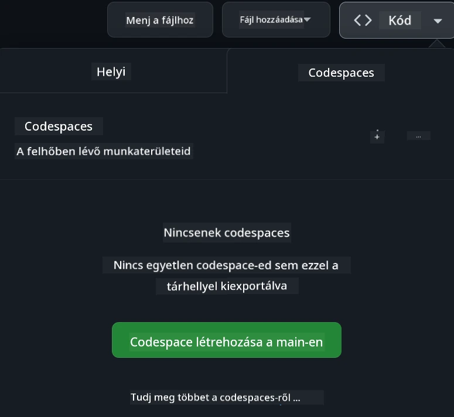

[](https://github.com/microsoft/Web-Dev-For-Beginners/blob/master/LICENSE)
[](https://GitHub.com/microsoft/Web-Dev-For-Beginners/graphs/contributors/)
[](https://GitHub.com/microsoft/Web-Dev-For-Beginners/issues/)
[](https://GitHub.com/microsoft/Web-Dev-For-Beginners/pulls/)
[](http://makeapullrequest.com) 

[](https://GitHub.com/microsoft/Web-Dev-For-Beginners/watchers/)
[](https://GitHub.com/microsoft/Web-Dev-For-Beginners/network/)
[](https://GitHub.com/microsoft/Web-Dev-For-Beginners/stargazers/)

[](https://discord.gg/nTYy5BXMWG)

# Webfejlesztés kezdőknek - Tanterv

Ismerje meg a webfejlesztés alapjait a Microsoft Cloud Advocates által készített 12 hetes átfogó tanfolyamunkkal. A 24 lecke mindegyike gyakorlati projektek segítségével mélyed el a JavaScript, CSS és HTML témakörökben, mint például terráriumok, böngészőbővítmények és űrjátékok. Vegyen részt kvízekben, beszélgetésekben és gyakorlati feladatokban. Fejlessze képességeit és optimalizálja tudásának megszilárdítását hatékony, projektalapú oktatásunkkal. Kezdje el a kódolási útját még ma!

Csatlakozzon az Azure AI Foundry Discord szerveréhez, ismerkedjen meg szakértőkkel és fejlesztőtársakkal.

[](https://discord.gg/nTYy5BXMWG)

Kövesse az alábbi lépéseket a források használatának megkezdéséhez:
1. **Forkolja a tárolót**: Kattintson ide [](https://GitHub.com/microsoft/Web-Dev-For-Beginners/fork)
2. **Klónozza a tárolót**:   `git clone https://github.com/microsoft/Web-Dev-For-Beginners.git`
3. [**Csatlakozzon az Azure AI Foundry Discord szerveréhez, és ismerkedjen meg szakértőkkel és fejlesztőtársakkal**](https://discord.com/invite/ByRwuEEgH4)

### 🌐 Többnyelvű támogatás

#### GitHub Action segítségével támogatott (Automatikus és mindig naprakész)

<!-- CO-OP TRANSLATOR LANGUAGES TABLE START -->
[Arabic](../ar/README.md) | [Bengali](../bn/README.md) | [Bulgarian](../bg/README.md) | [Burmese (Myanmar)](../my/README.md) | [Chinese (Simplified)](../zh-CN/README.md) | [Chinese (Traditional, Hong Kong)](../zh-HK/README.md) | [Chinese (Traditional, Macau)](../zh-MO/README.md) | [Chinese (Traditional, Taiwan)](../zh-TW/README.md) | [Croatian](../hr/README.md) | [Czech](../cs/README.md) | [Danish](../da/README.md) | [Dutch](../nl/README.md) | [Estonian](../et/README.md) | [Finnish](../fi/README.md) | [French](../fr/README.md) | [German](../de/README.md) | [Greek](../el/README.md) | [Hebrew](../he/README.md) | [Hindi](../hi/README.md) | [Hungarian](./README.md) | [Indonesian](../id/README.md) | [Italian](../it/README.md) | [Japanese](../ja/README.md) | [Kannada](../kn/README.md) | [Khmer](../km/README.md) | [Korean](../ko/README.md) | [Lithuanian](../lt/README.md) | [Malay](../ms/README.md) | [Malayalam](../ml/README.md) | [Marathi](../mr/README.md) | [Nepali](../ne/README.md) | [Nigerian Pidgin](../pcm/README.md) | [Norwegian](../no/README.md) | [Persian (Farsi)](../fa/README.md) | [Polish](../pl/README.md) | [Portuguese (Brazil)](../pt-BR/README.md) | [Portuguese (Portugal)](../pt-PT/README.md) | [Punjabi (Gurmukhi)](../pa/README.md) | [Romanian](../ro/README.md) | [Russian](../ru/README.md) | [Serbian (Cyrillic)](../sr/README.md) | [Slovak](../sk/README.md) | [Slovenian](../sl/README.md) | [Spanish](../es/README.md) | [Swahili](../sw/README.md) | [Swedish](../sv/README.md) | [Tagalog (Filipino)](../tl/README.md) | [Tamil](../ta/README.md) | [Telugu](../te/README.md) | [Thai](../th/README.md) | [Turkish](../tr/README.md) | [Ukrainian](../uk/README.md) | [Urdu](../ur/README.md) | [Vietnamese](../vi/README.md)

> **Szeretné helyben klónozni?**
>
> Ez a tároló több mint 50 nyelvű fordítást tartalmaz, ami jelentősen növeli a letöltési méretet. A fordítások nélküli klónozáshoz használjon részleges kitekintést:
>
> **Bash / macOS / Linux:**
> ```bash
> git clone --filter=blob:none --sparse https://github.com/microsoft/Web-Dev-For-Beginners.git
> cd Web-Dev-For-Beginners
> git sparse-checkout set --no-cone '/*' '!translations' '!translated_images'
> ```
>
> **CMD (Windows):**
> ```cmd
> git clone --filter=blob:none --sparse https://github.com/microsoft/Web-Dev-For-Beginners.git
> cd Web-Dev-For-Beginners
> git sparse-checkout set --no-cone "/*" "!translations" "!translated_images"
> ```
>
> Így mindent megkap, ami a kurzus elvégzéséhez szükséges, sokkal gyorsabb letöltéssel.
<!-- CO-OP TRANSLATOR LANGUAGES TABLE END -->

**Ha további fordításokat szeretne, az elérhető nyelvek itt találhatók: [itt](https://github.com/Azure/co-op-translator/blob/main/getting_started/supported-languages.md)**

[](https://open.vscode.dev/microsoft/Web-Dev-For-Beginners)

#### 🧑‍🎓 _Diák vagy?_

Látogasd meg a [**Student Hub oldalt**](https://docs.microsoft.com/learn/student-hub/?WT.mc_id=academic-77807-sagibbon), ahol kezdő erőforrásokat, diákcsomagokat és akár ingyenes tanúsítványkuponokat is találsz. Ezt az oldalt érdemes könyvjelzőznie és időről időre ellenőriznie, mivel havonta cseréljük a tartalmat.

### 📣 Bejelentés – Új GitHub Copilot Agent mód kihívások elvégzésére!

Új kihívás került hozzáadásra, keresd a "GitHub Copilot Agent Challenge 🚀" feliratot a legtöbb fejezetben. Ez egy új kihívás, amelyet GitHub Copilot és Agent mód segítségével kell megoldanod. Ha még nem használtad az Agent módot, az nemcsak szöveg generálására képes, hanem fájlok létrehozására és szerkesztésére, parancsok futtatására és egyéb feladatokra is.

### 📣 Bejelentés – _Új projekt generatív MI használatával_

Új MI-asszisztens projekt került hozzáadásra, nézd meg a [projektet](./9-chat-project/README.md)

### 📣 Bejelentés – _Új tanterv_ a JavaScript generatív MI témakörében megjelent

Ne hagyd ki új generatív MI tantervünket!

Látogasd meg a [https://aka.ms/genai-js-course](https://aka.ms/genai-js-course) oldalt a kezdéshez!



- Leckék, amelyek az alapoktól a RAG-ig mindent lefednek.
- Interakció történelmi szereplőkkel a GenAI és társalkalmazásunk segítségével.
- Szórakoztató és lebilincselő narratíva, időutazás élményével!




Minden lecke tartalmaz egy befejezendő feladatot, egy tudásellenőrzést és egy kihívást, amelyek témái például:
- Utasítások megadása és utasítás-tervezés
- Szöveg- és képgeneráló alkalmazások
- Keresőalkalmazások

Látogasd meg a [https://aka.ms/genai-js-course](https://aka.ms/genai-js-course) oldalt a kezdéshez!


## 🌱 Kezdés

> **Tanárként**, [ide kattintva](for-teachers.md) találsz néhány javaslatot a tanterv használatához. Várjuk visszajelzésed [beszélgetési fórumunkban](https://github.com/microsoft/Web-Dev-For-Beginners/discussions/categories/teacher-corner)!

**[Tanulók](https://aka.ms/student-page/?WT.mc_id=academic-77807-sagibbon)**, minden leckéhez kezdjétek egy előadás előtti kvízzel, majd olvassátok el az előadási anyagot, teljesítsétek a különféle feladatokat, és ellenőrizzétek a tudásotokat az előadás utáni kvízzel.

A tanulási élmény fokozása érdekében dolgozzatok együtt társaitokkal a projekteken! A beszélgetésekre bátorítunk a [beszélgetési fórumunkon](https://github.com/microsoft/Web-Dev-For-Beginners/discussions), ahol moderátoraink segítséget nyújtanak kérdéseitekre.

További tanulmányokhoz javasoljuk a [Microsoft Learn](https://learn.microsoft.com/users/wirelesslife/collections/p1ddcy5jwy0jkm?WT.mc_id=academic-77807-sagibbon) használatát, ahol még több oktatóanyagot találsz.

### 📋 Környezet beállítása

Ezen tantervhez egy kész fejlesztői környezet tartozik! Induláskor választhatod a tanterv futtatását [Codespace-ben](https://github.com/features/codespaces/) (_egy böngészőalapú, telepítés nélküli környezet_), vagy helyben a számítógépedön egy szövegszerkesztő, például a [Visual Studio Code](https://code.visualstudio.com/?WT.mc_id=academic-77807-sagibbon) használatával.

#### Tároló létrehozása
Ahhoz, hogy könnyen elmentsd a munkád, ajánlott, hogy saját példányt készíts erről a tárolóról. Ezt a lap tetején található **Use this template** gomb megnyomásával teheted meg. Ez létrehoz egy új tárolót a GitHub fiókodban, amely a tanterv másolatát tartalmazza.

Kövesd ezeket a lépéseket:
1. **Forkold a tárolót**: Kattints az oldal jobb felső sarkában a "Fork" gombra.
2. **Klónozd a tárolót**:   `git clone https://github.com/microsoft/Web-Dev-For-Beginners.git`

#### A tanterv futtatása Codespace-ben

A saját tárolód példányában, amit előzőleg létrehoztál, kattints a **Code** gombra, és válaszd az **Open with Codespaces** opciót. Ez létrehoz egy új Codespace-t, ahol dolgozhatsz.



#### A tanterv helyi futtatása a számítógépeden

A tanterv helyi futtatásához szükséged lesz egy szövegszerkesztőre, böngészőre és parancssori eszközre. Az első leckénk, a [Bevezetés a programozási nyelvekbe és fejlesztőeszközökbe](../../1-getting-started-lessons/1-intro-to-programming-languages), végigvezet a különböző lehetőségeken, hogy kiválaszthasd a számodra legmegfelelőbb eszközöket.

Ajánljuk, hogy a [Visual Studio Code](https://code.visualstudio.com/?WT.mc_id=academic-77807-sagibbon) szerkesztőt használd, amely beépített [terminállal](https://code.visualstudio.com/docs/terminal/basics/?WT.mc_id=academic-77807-sagibbon) rendelkezik. A Visual Studio Code-ot innen töltheted le: [itt](https://code.visualstudio.com/?WT.mc_id=academic-77807-sagibbon).
1. Klónozd a tárhelyed a számítógépedre. Ezt megteheted a **Code** gombra kattintva, majd a URL másolásával:

    [CodeSpace](./images/createcodespace.png)

    Ezután nyisd meg a [Terminált](https://code.visualstudio.com/docs/terminal/basics/?WT.mc_id=academic-77807-sagibbon) a [Visual Studio Code](https://code.visualstudio.com/?WT.mc_id=academic-77807-sagibbon) programban, és futtasd a következő parancsot, cseréld le a `<your-repository-url>` részt az imént másolt URL-re:

    ```bash 
    git clone <your-repository-url>
    ```

2. Nyisd meg a mappát a Visual Studio Code-ban. Ezt úgy teheted meg, hogy az **File** > **Open Folder** menüpontra kattintasz, és kiválasztod az imént klónozott mappát.

>  Ajánlott Visual Studio Code kiegészítők:
>
> * [Live Server](https://marketplace.visualstudio.com/items?itemName=ritwickdey.LiveServer&WT.mc_id=academic-77807-sagibbon) - HTML oldalak előnézete a Visual Studio Code-on belül
> * [Copilot](https://marketplace.visualstudio.com/items?itemName=GitHub.copilot&WT.mc_id=academic-77807-sagibbon) - segít a kód gyorsabb írásában

## 📂 Minden leckében található:

- opcionális vázlatjegyzet
- opcionális kiegészítő videó
- óra előtti bemelegítő kvíz
- írott lecke
- projektalapú leckékhez lépésről-lépésre útmutatók a projekt elkészítéséhez
- tudásellenőrzések
- kihívás
- kiegészítő olvasmány
- feladat
- [órafeladat utáni kvíz](https://ff-quizzes.netlify.app/web/)

> **Megjegyzés a kvízekhez**: Minden kvíz a Quiz-app mappában található, összesen 48 kvíz mindegyik három kérdéssel. Ezek elérhetők [itt](https://ff-quizzes.netlify.app/web/), a kvíz alkalmazás futtatható helyben vagy telepíthető Azure-ra; kövesd az utasításokat a `quiz-app` mappában.

## 🗃️ Leckék

|     |                       Projekt neve                       |                            Oktatott fogalmak                            | Tanulási célok                                                                                                                     |                                                       Kapcsolódó lecke                                                        |         Szerző          |
| :-: | :------------------------------------------------------: | :--------------------------------------------------------------------: | --------------------------------------------------------------------------------------------------------------------------------- | :----------------------------------------------------------------------------------------------------------------------------: | :---------------------: |
| 01  |                     Első lépések                         |           Bevezetés a programozásba és a munkaeszközökbe               | Megérteni a legtöbb programozási nyelv alapjait és a szoftvereket, melyek segítik a profi fejlesztőket munkájukban             | [Bevezetés a programozási nyelvekbe és eszközökbe](./1-getting-started-lessons/1-intro-to-programming-languages/README.md)     |         Jasmine         |
| 02  |                     Első lépések                         |             GitHub alapjai, csapatmunkával                            | Hogyan használd a GitHubot a projektben, hogyan működj együtt másokkal egy kódalapon                                           |                            [GitHub alapok](./1-getting-started-lessons/2-github-basics/README.md)                                |          Floor          |
| 03  |                     Első lépések                         |                             Akadálymentesség                           | Megtanulni a webes akadálymentesség alapjait                                                                                      |                       [Akadálymentesség alapjai](./1-getting-started-lessons/3-accessibility/README.md)                        |       Christopher       |
| 04  |                        JS alapok                         |                         JavaScript adattípusok                         | A JavaScript adattípusainak alapjai                                                                                                |                                       [Adattípusok](./2-js-basics/1-data-types/README.md)                                      |         Jasmine         |
| 05  |                        JS alapok                         |                         Függvények és metódusok                       | Megismerni a függvényeket és metódusokat, hogy hogyan kezeljük az alkalmazás logikai folyamatát                                   |                              [Függvények és metódusok](./2-js-basics/2-functions-methods/README.md)                            | Jasmine és Christopher  |
| 06  |                        JS alapok                         |                        Döntéshozatal JavaScript-tel                   | Hogyan készítsünk feltételeket a kódban döntési szerkezetekkel                                                                    |                                 [Döntéshozatal](./2-js-basics/3-making-decisions/README.md)                                   |         Jasmine         |
| 07  |                        JS alapok                         |                            Tömbök és ciklusok                         | Adatkezelés tömbök és ciklusok használatával JavaScript-ben                                                                        |                                   [Tömbök és ciklusok](./2-js-basics/4-arrays-loops/README.md)                                |         Jasmine         |
| 08  |       [Terrárium](./3-terrarium/solution/README.md)       |                            HTML gyakorlat                             | HTML készítése online terráriumhoz, a layout kialakítására fókuszálva                                                              |                                 [Bevezetés a HTML-be](./3-terrarium/1-intro-to-html/README.md)                              |           Jen           |
| 09  |       [Terrárium](./3-terrarium/solution/README.md)       |                            CSS gyakorlat                              | CSS készítése az online terrárium stílusához, alapok a reszponzív oldal készítéséhez                                              |                                  [Bevezetés a CSS-be](./3-terrarium/2-intro-to-css/README.md)                                |           Jen           |
| 10  |            [Terrárium](./3-terrarium/solution/README.md)            |                 JavaScript zárványok, DOM manipuláció                 | JavaScript készítése, hogy a terrárium működjön húzd és ejtsd felületen, zárványok és DOM manipulációra fókuszálva                |                  [JavaScript zárványok, DOM manipuláció](./3-terrarium/3-intro-to-DOM-and-closures/README.md)                  |           Jen           |
| 11  |          [Gépelős játék](./4-typing-game/solution/README.md)          |                          Gépelős játék készítése                       | Megtanulni a billentyűzet események használatát JavaScript alkalmazás logikájához                                                 |                                [Eseményvezérelt programozás](./4-typing-game/typing-game/README.md)                             |       Christopher       |
| 12  | [Green Browser Extension](./5-browser-extension/solution/README.md) |                         Böngészőkezelés                              | Megérteni, hogyan működnek a böngészők, történetük és hogyan építsük fel az első elemeket egy böngészőbővítményhez                |                               [A böngészőkről](./5-browser-extension/1-about-browsers/README.md)                                |           Jen           |
| 13  | [Green Browser Extension](./5-browser-extension/solution/README.md) | Űrlapkészítés, API hívás és helyi adattárolás                         | JavaScript elemek építése bővítményedhez, API hívások végrehajtásához és változók helyi tárolásával                                |                [API-k, űrlapok, helyi tárolás](./5-browser-extension/2-forms-browsers-local-storage/README.md)                 |           Jen           |
| 14  | [Green Browser Extension](./5-browser-extension/solution/README.md) |     Háttérfolyamatok a böngészőben, webes teljesítmény                | Böngésző háttérfolyamatok kezelése az ikon menedzseléséhez; webes teljesítmény és optimalizációk megismerése                      |             [Háttérfeladatok és teljesítmény](./5-browser-extension/3-background-tasks-and-performance/README.md)            |           Jen           |
| 15  |           [Űrjáték](./6-space-game/solution/README.md)           |             Haladóbb játékfejlesztés JavaScript-tel                   | Megtanulni az öröklődést osztályok és összetétel segítségével, valamint a Pub/Sub mintázatot játék készítés előtt                  |                      [Bevezetés haladó játékfejlesztésbe](./6-space-game/1-introduction/README.md)                             |          Chris          |
| 16  |           [Űrjáték](./6-space-game/solution/README.md)           |                           Rajzolás a vászonra                        | Megismerni a Canvas API-t a képernyőre rajzoláshoz                                                                                |                                [Rajzolás a vászonra](./6-space-game/2-drawing-to-canvas/README.md)                            |          Chris          |
| 17  |           [Űrjáték](./6-space-game/solution/README.md)           |                   Mozgatás a képernyőn elhelyezett elemekkel          | Felfedezni, hogyan mozognak az elemek kartézián koordinátákkal és a Canvas API-val                                                |                           [Elemek mozgatása](./6-space-game/3-moving-elements-around/README.md)                               |          Chris          |
| 18  |           [Űrjáték](./6-space-game/solution/README.md)           |                          Ütközés érzékelés                          | Az elemek ütközésének és kölcsönhatásának megvalósítása billentyűleütések segítségével, hűtési funkcióval a teljesítményért     |                              [Ütközésérzékelés](./6-space-game/4-collision-detection/README.md)                              |          Chris          |
| 19  |           [Űrjáték](./6-space-game/solution/README.md)           |                             Pontozás                               | Matematikai számítások elvégzése a játék állapota és teljesítménye alapján                                                        |                                    [Pontozás](./6-space-game/5-keeping-score/README.md)                                      |          Chris          |
| 20  |           [Űrjáték](./6-space-game/solution/README.md)           |                     Játék befejezése és újraindítása                   | Játék befejezésének és újraindításának megtanulása, eszközök tisztítása és változók visszaállítása                               |                                [Befejezési feltétel](./6-space-game/6-end-condition/README.md)                                |          Chris          |
| 21  |         [Banki alkalmazás](./7-bank-project/solution/README.md)          |                 HTML sablonok és útvonalak webalkalmazásban           | Többoldalas weboldal felépítésének megértése routing és HTML sablonok használatával                                              |                            [HTML sablonok és útvonalak](./7-bank-project/1-template-route/README.md)                           |          Yohan          |
| 22  |         [Banki alkalmazás](./7-bank-project/solution/README.md)          |                  Bejelentkező és regisztrációs űrlap készítése         | Űrlapkészítés és validációs folyamatok megismerése                                                                                 |                                           [Űrlapok](./7-bank-project/2-forms/README.md)                                      |          Yohan          |
| 23  |         [Banki alkalmazás](./7-bank-project/solution/README.md)          |                   Adatok lekérése és kezelése                         | Az adatáramlás megértése az alkalmazásban, hogyan kérjük le, tároljuk és dobjuk el az adatokat                                     |                                            [Adatok](./7-bank-project/3-data/README.md)                                       |          Yohan          |
| 24  |         [Banki alkalmazás](./7-bank-project/solution/README.md)          |                      Állapotkezelés fogalmai                         | Megtanulni, hogyan őrzi meg az alkalmazás az állapotot és hogyan kezelhető programozottan                                         |                                [Állapotkezelés](./7-bank-project/4-state-management/README.md)                               |          Yohan          |
| 25 | [Böngésző/VScode kód](../../8-code-editor) | Működés VScode-dal | Megtanulni szerkesztő használatát | [VScode kód szerkesztő használata](./8-code-editor/1-using-a-code-editor/README.md) | Chris |
| 26 | [AI asszisztensek](./9-chat-project/README.md) | Működés AI-val | Megtanulni saját AI asszisztenst építeni | [AI asszisztens projekt](./9-chat-project/README.md) | Chris |

## 🏫 Pedagógia

Tananyagunk két fő pedagógiai elven alapul:
* projektalapú tanulás
* gyakori kvízek

A program a JavaScript, HTML és CSS alapjait tanítja meg, valamint a legújabb webfejlesztői eszközöket és technikákat. A diákok gyakorlati tapasztalatot szerezhetnek gépelős játék, virtuális terrárium, környezetbarát böngészőbővítmény, űr-inváziós stílusú játék, és egy banki alkalmazás elkészítésével. A sorozat végére alapos webfejlesztési tudást szereznek.

> 🎓 Az első néhány leckét elvégezheted [Tanulási Útként](https://docs.microsoft.com/learn/paths/web-development-101/?WT.mc_id=academic-77807-sagibbon) a Microsoft Learn-en!

Ha az anyagokat projektekhez igazítjuk, az érdeklődést fenntartja a diákoknál és növeli a fogalmak megtartását. Több bevezető leckét is írtunk JavaScript alapok témában, videóval kiegészítve a "[JavaScript kezdő sorozat](https://channel9.msdn.com/Series/Beginners-Series-to-JavaScript/?WT.mc_id=academic-77807-sagibbon)" oktatóvideókból, amelyek egyes szerzői hozzájárultak ehhez a tananyaghoz.

Emellett egy alacsony tétű kvíz óra előtt beállítja a tanuló szándékát egy téma megtanulására, míg az óra utáni kvíz elősegíti a további megszilárdítást. Ez a tananyag rugalmas és élvezetes, egészben vagy részenként is végezhető. A projektek kis lépésekben indulnak, és a 12 hetes ciklus végére egyre összetettebbek lesznek.

Miközben szándékosan kerültük a JavaScript keretrendszerek bemutatását, hogy az alapvető készségekre koncentráljunk, mielőtt keretrendszert használunk, egy jó következő lépés lehet a Node.js megtanulása a "[Node.js kezdő sorozat](https://channel9.msdn.com/Series/Beginners-Series-to-Nodejs/?WT.mc_id=academic-77807-sagibbon)" videógyűjtemény segítségével.

> Látogasd meg [Magatartási kódexünket](CODE_OF_CONDUCT.md) és [Közreműködési útmutatónkat](CONTRIBUTING.md). Várjuk építő jellegű visszajelzésedet!

## 🧭 Offline hozzáférés

Ez a dokumentáció offline is futtatható a [Docsify](https://docsify.js.org/#/) használatával. Fork-old ezt a tárolót, [telepítsd a Docsify-t](https://docsify.js.org/#/quickstart) a helyi gépedre, majd a tároló gyökérmappájában írd be, hogy `docsify serve`. A webhely a 3000-es porton lesz elérhető a localhostodon: `localhost:3000`.

## 📘 PDF
Az összes leckéről szóló PDF [itt](https://microsoft.github.io/Web-Dev-For-Beginners/pdf/readme.pdf) található.


## 🎒 Egyéb tanfolyamok

Csapatunk más tanfolyamokat is készít! Nézd meg:

<!-- CO-OP TRANSLATOR OTHER COURSES START -->
### LangChain
[](https://aka.ms/langchain4j-for-beginners)
[](https://aka.ms/langchainjs-for-beginners?WT.mc_id=m365-94501-dwahlin)
[](https://github.com/microsoft/langchain-for-beginners?WT.mc_id=m365-94501-dwahlin)
---

### Azure / Edge / MCP / Ügynökök
[](https://github.com/microsoft/AZD-for-beginners?WT.mc_id=academic-105485-koreyst)
[](https://github.com/microsoft/edgeai-for-beginners?WT.mc_id=academic-105485-koreyst)
[](https://github.com/microsoft/mcp-for-beginners?WT.mc_id=academic-105485-koreyst)
[](https://github.com/microsoft/ai-agents-for-beginners?WT.mc_id=academic-105485-koreyst)

---
 
### Generatív AI sorozat
[](https://github.com/microsoft/generative-ai-for-beginners?WT.mc_id=academic-105485-koreyst)
[-9333EA?style=for-the-badge&labelColor=E5E7EB&color=9333EA)](https://github.com/microsoft/Generative-AI-for-beginners-dotnet?WT.mc_id=academic-105485-koreyst)
[-C084FC?style=for-the-badge&labelColor=E5E7EB&color=C084FC)](https://github.com/microsoft/generative-ai-for-beginners-java?WT.mc_id=academic-105485-koreyst)
[-E879F9?style=for-the-badge&labelColor=E5E7EB&color=E879F9)](https://github.com/microsoft/generative-ai-with-javascript?WT.mc_id=academic-105485-koreyst)

---
 
### Alapvető tanulás
[](https://aka.ms/ml-beginners?WT.mc_id=academic-105485-koreyst)
[](https://aka.ms/datascience-beginners?WT.mc_id=academic-105485-koreyst)
[](https://aka.ms/ai-beginners?WT.mc_id=academic-105485-koreyst)
[](https://github.com/microsoft/Security-101?WT.mc_id=academic-96948-sayoung)
[](https://aka.ms/webdev-beginners?WT.mc_id=academic-105485-koreyst)
[](https://aka.ms/iot-beginners?WT.mc_id=academic-105485-koreyst)
[](https://github.com/microsoft/xr-development-for-beginners?WT.mc_id=academic-105485-koreyst)

---
 
### Copilot sorozat
[](https://aka.ms/GitHubCopilotAI?WT.mc_id=academic-105485-koreyst)
[](https://github.com/microsoft/mastering-github-copilot-for-dotnet-csharp-developers?WT.mc_id=academic-105485-koreyst)
[](https://github.com/microsoft/CopilotAdventures?WT.mc_id=academic-105485-koreyst)
<!-- CO-OP TRANSLATOR OTHER COURSES END -->

## Segítségkérés

Ha elakadnál vagy kérdésed van az AI alkalmazások fejlesztésével kapcsolatban, csatlakozz más tanulókhoz és tapasztalt fejlesztőkhöz az MCP-ről folytatott beszélgetésekben. Ez egy támogató közösség, ahol a kérdések szívesen fogadottak, és a tudás szabadon megosztott.

[](https://discord.gg/nTYy5BXMWG)

Ha termék visszajelzésed vagy hibákat találsz fejlesztés közben, látogass el ide:

[](https://aka.ms/foundry/forum)

## Licenc

Ez a tárhely az MIT licenc alatt áll. További információkért lásd a [LICENSE](../../LICENSE) fájlt.

---

<!-- CO-OP TRANSLATOR DISCLAIMER START -->
**Jogi nyilatkozat**:  
Ez a dokumentum az AI fordító szolgáltatás, a [Co-op Translator](https://github.com/Azure/co-op-translator) segítségével készült. Bár igyekszünk a pontosságra, kérjük, vegye figyelembe, hogy az automatikus fordítások hibákat vagy pontatlanságokat tartalmazhatnak. Az eredeti dokumentum az eredeti nyelven tekintendő hivatalos forrásnak. Kritikus információk esetén professzionális emberi fordítás használata javasolt. Nem vállalunk felelősséget a fordítás használatából eredő félreértésekért vagy hibás értelmezésekért.
<!-- CO-OP TRANSLATOR DISCLAIMER END -->