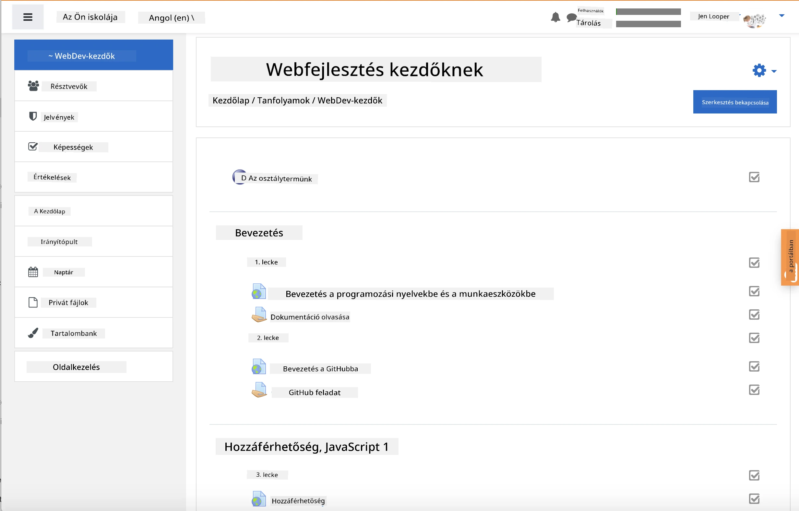
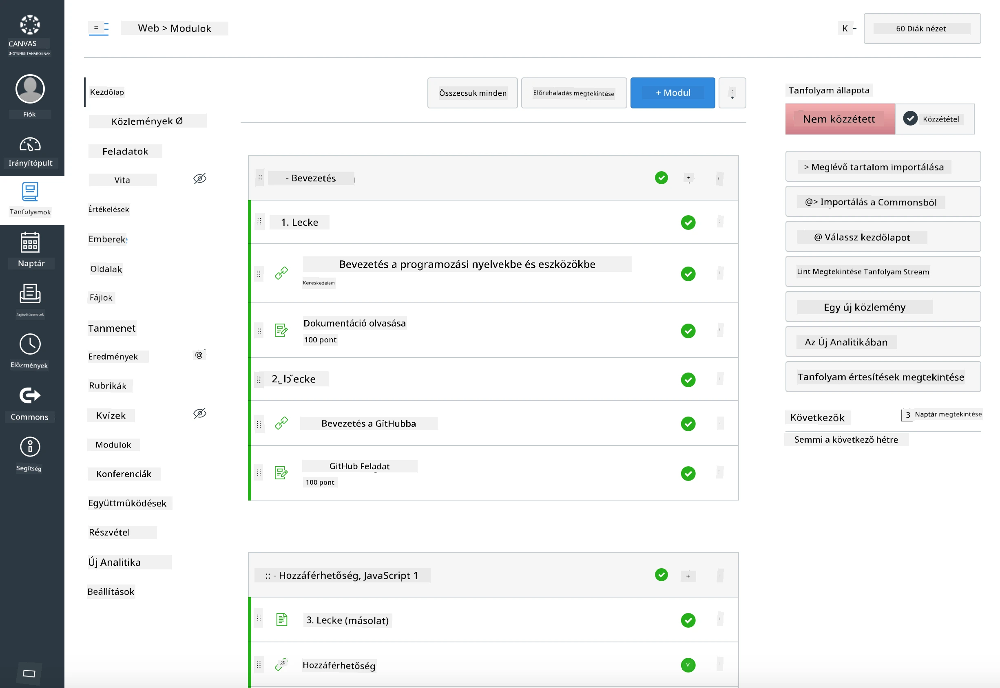

### Oktatóknak

Örömmel használhatja ezt a tananyagot az osztályában. Zökkenőmentesen működik a GitHub Classroommal és a vezető LMS platformokkal, de önálló repóként is használható a diákjaival.

### Használat GitHub Classroommal

Az órák és feladatok csoportonkénti kezeléséhez hozzon létre egy repót minden egyes órához, hogy a GitHub Classroom külön-külön tudja csatolni az egyes feladatokat.

- Forkolja ezt a repót a szervezetébe.
- Hozzon létre külön repót minden egyes órához úgy, hogy az óra mappáját külön repóba helyezi.
  - Opció A: Hozzon létre üres repókat (egy-egy minden órához), és másolja bele az óra mappa tartalmát.
  - Opció B: Használjon Git történet-megőrző megoldást (pl. egy mappa szétválasztása új repóba), ha szüksége van az eredetiség megőrzésére.
- A GitHub Classroomban hozzon létre egy feladatot minden órához, és mutasson az adott óra repójára.
- Ajánlott beállítások:
  - Repó láthatósága: privát a diákok munkájához.
  - Használjon kezdőkódot az óra repójának alapértelmezett ágából.
  - Adjon hozzá issue- és pull request-sablonokat a kvízekhez és beadásokhoz.
  - Opcionálisan konfiguráljon automatikus értékelést és teszteket, ha az órák tartalmazzák ezeket.
- Hasznos konvenciók:
  - Repónevek, mint például lesson-01-intro, lesson-02-html stb.
  - Címkék: quiz, assignment, needs-review, late, resubmission.
  - Címkék/kiadások csoportonként (pl. v2025-term1).

Tipp: Kerülje a repók szinkronizált mappákban (pl. OneDrive/Google Drive) való tárolását, hogy elkerülje a Git konfliktusokat Windows rendszeren.

### Használat Moodle, Canvas vagy Blackboard platformmal

Ez a tananyag importálható csomagokat tartalmaz a gyakori LMS munkafolyamatokhoz.

- Moodle: Használja a Moodle feltöltési fájlt [Moodle feltöltési fájl](../../../../../../../teaching-files/webdev-moodle.mbz) a teljes kurzus betöltéséhez.
- Common Cartridge: Használja a Common Cartridge fájlt [Common Cartridge fájl](../../../../../../../teaching-files/webdev-common-cartridge.imscc) a szélesebb LMS kompatibilitás érdekében.
- Megjegyzések:
  - A Moodle Cloud korlátozott Common Cartridge támogatással rendelkezik. Előnyben részesítse a fenti Moodle fájlt, amely Canvasba is feltölthető.
  - Az importálás után ellenőrizze a modulokat, határidőket és kvízbeállításokat, hogy illeszkedjenek az Ön tanévi ütemtervéhez.

> A tananyag egy Moodle osztályteremben

> A tananyag a Canvasban

### A repó közvetlen használata (Classroom nélkül)

Ha nem szeretné használni a GitHub Classroomot, a kurzust közvetlenül ebből a repóból is futtathatja.

- Szinkron/online formátumok (Zoom/Teams):
  - Tartson rövid mentorált bemelegítéseket; használjon breakout szobákat a kvízekhez.
  - Jelöljön ki egy időablakot a kvízekhez; a diákok GitHub Issue-ként nyújtsák be a válaszaikat.
  - Együttműködő feladatokhoz a diákok nyilvános óra repókban dolgoznak, és pull requesteket nyitnak.
- Privát/aszinkron formátumok:
  - A diákok forkolják az egyes órákat saját **privát** repóikba, és adják hozzá Önt mint közreműködőt.
  - Issue-ként (kvízek) és Pull Requestként (feladatok) nyújtsák be a beadásokat az Ön osztálytermi repójában vagy a saját privát forkjaikban.

### Legjobb gyakorlatok

- Tartson egy orientációs órát a Git/GitHub alapokról, Issue-król és PR-ekről.
- Használjon ellenőrzőlistákat az Issue-kban a több lépéses kvízekhez/feladatokhoz.
- Adjon hozzá CONTRIBUTING.md és CODE_OF_CONDUCT.md fájlokat az osztálytermi normák meghatározásához.
- Adjon hozzá akadálymentességi megjegyzéseket (alt szöveg, feliratok), és kínáljon nyomtatható PDF-eket.
- Verziózza a tartalmat tanévenként, és fagyassza be az óra repókat a közzététel után.

### Visszajelzés és támogatás

Azt szeretnénk, hogy ez a tananyag működjön Önnek és a diákjainak. Kérjük, nyisson egy új Issue-t ebben a repóban hibák, kérések vagy fejlesztések esetén, vagy kezdjen egy beszélgetést a Teacher Cornerben.

---

**Felelősség kizárása**:  
Ez a dokumentum az [Co-op Translator](https://github.com/Azure/co-op-translator) AI fordítási szolgáltatás segítségével került lefordításra. Bár törekszünk a pontosságra, kérjük, vegye figyelembe, hogy az automatikus fordítások hibákat vagy pontatlanságokat tartalmazhatnak. Az eredeti dokumentum az eredeti nyelvén tekintendő hiteles forrásnak. Kritikus információk esetén javasolt professzionális emberi fordítást igénybe venni. Nem vállalunk felelősséget semmilyen félreértésért vagy téves értelmezésért, amely a fordítás használatából eredhet.