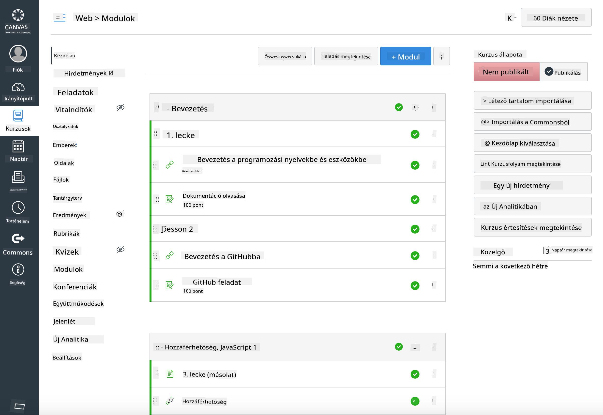

<!--
CO_OP_TRANSLATOR_METADATA:
{
  "original_hash": "75cb51f7ca9ea0b097ef4a1287e9290c",
  "translation_date": "2025-08-28T03:22:27+00:00",
  "source_file": "for-teachers.md",
  "language_code": "hu"
}
-->
## Oktatóknak

Szeretné használni ezt a tananyagot az osztályában? Nyugodtan tegye meg!

Valójában a GitHubon belül is használhatja, ha a GitHub Classroomot használja.

Ehhez forkolja ezt a repót. Minden leckéhez létre kell hoznia egy külön repót, így minden mappát külön repóba kell kiválasztania. Így a [GitHub Classroom](https://classroom.github.com/classrooms) külön-külön tudja kezelni az egyes leckéket.

Ezek az [részletes útmutatók](https://github.blog/2020-03-18-set-up-your-digital-classroom-with-github-classroom/) segítenek abban, hogyan állítsa be az osztályát.

## Használata Moodle-ben, Canvasben vagy Blackboardban

Ez a tananyag jól működik ezekben a tanulásmenedzsment rendszerekben! Használja a [Moodle feltöltési fájlt](../../../../../../../teaching-files/webdev-moodle.mbz) a teljes tartalomhoz, vagy próbálja ki a [Common Cartridge fájlt](../../../../../../../teaching-files/webdev-common-cartridge.imscc), amely néhány tartalmat tartalmaz. A Moodle Cloud nem támogatja a teljes Common Cartridge exportokat, ezért célszerűbb a Moodle letöltési fájlt használni, amely feltölthető a Canvasba. Kérjük, ossza meg velünk, hogyan javíthatnánk ezen az élményen.

> A tananyag egy Moodle osztályteremben

> A tananyag a Canvasben

## A repó használata jelenlegi formájában

Ha szeretné a repót a jelenlegi formájában használni, GitHub Classroom nélkül, az is lehetséges. Ebben az esetben kommunikálnia kell a diákjaival, hogy melyik leckén dolgozzanak együtt.

Online formátumban (Zoom, Teams vagy más) például létrehozhat csoportszobákat a kvízekhez, és mentorálhatja a diákokat, hogy felkészüljenek a tanulásra. Ezután meghívhatja a diákokat a kvízekre, és kérheti, hogy egy adott időpontban 'issues' formájában nyújtsák be a válaszaikat. Ugyanezt megteheti a feladatokkal is, ha azt szeretné, hogy a diákok nyíltan, együttműködve dolgozzanak.

Ha inkább egy privátabb formátumot részesít előnyben, kérje meg a diákjait, hogy forkolják a tananyagot, leckéről leckére, saját GitHub repóikba privát repóként, és adjanak Önnek hozzáférést. Ezután a diákok privát módon kitölthetik a kvízeket és feladatokat, és azokat az Ön osztálytermi repóján keresztül issues formájában nyújthatják be.

Számos módja van annak, hogy ez működjön egy online osztálytermi formátumban. Kérjük, ossza meg velünk, hogy Önnek mi működik a legjobban!

## Kérjük, ossza meg velünk a véleményét!

Szeretnénk, ha ez a tananyag az Ön és a diákjai számára is megfelelően működne. Vegye fel velünk a kapcsolatot a [Tanári sarokban](https://github.com/microsoft/Web-Dev-For-Beginners/discussions/categories/teacher-corner), és nyisson egy [**új issue-t**](https://github.com/microsoft/Web-Dev-For-Beginners/issues/new/choose) bármilyen kérés, hiba vagy visszajelzés esetén.

---

**Felelősség kizárása**:  
Ez a dokumentum az AI fordítási szolgáltatás, a [Co-op Translator](https://github.com/Azure/co-op-translator) segítségével került lefordításra. Bár törekszünk a pontosságra, kérjük, vegye figyelembe, hogy az automatikus fordítások hibákat vagy pontatlanságokat tartalmazhatnak. Az eredeti dokumentum az eredeti nyelvén tekintendő hiteles forrásnak. Kritikus információk esetén javasolt professzionális emberi fordítást igénybe venni. Nem vállalunk felelősséget a fordítás használatából eredő félreértésekért vagy téves értelmezésekért.