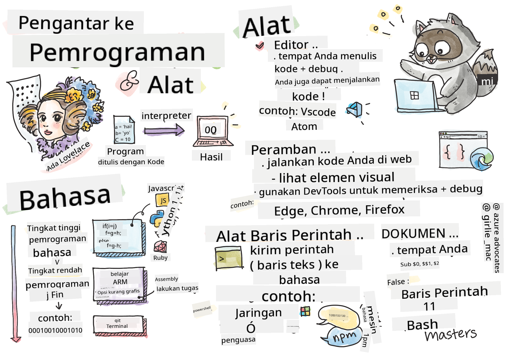

<!--
CO_OP_TRANSLATOR_METADATA:
{
  "original_hash": "2dcbb9259dee4f20a4f08d9a1aa2bd4c",
  "translation_date": "2025-08-29T09:17:50+00:00",
  "source_file": "1-getting-started-lessons/1-intro-to-programming-languages/README.md",
  "language_code": "id"
}
-->
# Pengantar Bahasa Pemrograman dan Alat yang Digunakan

Pelajaran ini membahas dasar-dasar bahasa pemrograman. Topik yang dibahas di sini berlaku untuk sebagian besar bahasa pemrograman modern saat ini. Pada bagian 'Alat yang Digunakan', Anda akan mempelajari perangkat lunak yang berguna untuk membantu Anda sebagai pengembang.


> Sketchnote oleh [Tomomi Imura](https://twitter.com/girlie_mac)

## Kuis Pra-Pelajaran
[Kuis pra-pelajaran](https://forms.office.com/r/dru4TE0U9n?origin=lprLink)

## Pengantar

Dalam pelajaran ini, kita akan membahas:

- Apa itu pemrograman?
- Jenis-jenis bahasa pemrograman
- Elemen dasar dari sebuah program
- Perangkat lunak dan alat yang berguna untuk pengembang profesional

> Anda dapat mengikuti pelajaran ini di [Microsoft Learn](https://docs.microsoft.com/learn/modules/web-development-101/introduction-programming/?WT.mc_id=academic-77807-sagibbon)!

## Apa itu Pemrograman?

Pemrograman (juga dikenal sebagai coding) adalah proses menulis instruksi untuk perangkat seperti komputer atau perangkat seluler. Kita menulis instruksi ini menggunakan bahasa pemrograman, yang kemudian diinterpretasikan oleh perangkat. Kumpulan instruksi ini dapat disebut dengan berbagai nama, seperti *program*, *program komputer*, *aplikasi (app)*, dan *eksekusi*.

Sebuah *program* bisa berupa apa saja yang ditulis dengan kode; situs web, permainan, dan aplikasi ponsel adalah program. Meskipun memungkinkan untuk membuat program tanpa menulis kode, logika dasarnya diinterpretasikan oleh perangkat, dan logika tersebut kemungkinan besar ditulis dengan kode. Program yang sedang *berjalan* atau *mengeksekusi* kode sedang menjalankan instruksi. Perangkat yang Anda gunakan untuk membaca pelajaran ini sedang menjalankan program untuk menampilkan pelajaran ini di layar Anda.

✅ Lakukan sedikit penelitian: siapa yang dianggap sebagai programmer komputer pertama di dunia?

## Bahasa Pemrograman

Bahasa pemrograman memungkinkan pengembang menulis instruksi untuk perangkat. Perangkat hanya dapat memahami biner (1s dan 0s), dan bagi *kebanyakan* pengembang, itu bukan cara yang efisien untuk berkomunikasi. Bahasa pemrograman adalah sarana komunikasi antara manusia dan komputer.

Bahasa pemrograman hadir dalam berbagai format dan dapat melayani tujuan yang berbeda. Misalnya, JavaScript terutama digunakan untuk aplikasi web, sementara Bash terutama digunakan untuk sistem operasi.

*Bahasa tingkat rendah* biasanya membutuhkan lebih sedikit langkah dibandingkan *bahasa tingkat tinggi* bagi perangkat untuk menginterpretasikan instruksi. Namun, yang membuat bahasa tingkat tinggi populer adalah keterbacaan dan dukungannya. JavaScript dianggap sebagai bahasa tingkat tinggi.

Kode berikut menggambarkan perbedaan antara bahasa tingkat tinggi dengan JavaScript dan bahasa tingkat rendah dengan kode assembly ARM.

```javascript
let number = 10
let n1 = 0, n2 = 1, nextTerm;

for (let i = 1; i <= number; i++) {
    console.log(n1);
    nextTerm = n1 + n2;
    n1 = n2;
    n2 = nextTerm;
}
```

```c
 area ascen,code,readonly
 entry
 code32
 adr r0,thumb+1
 bx r0
 code16
thumb
 mov r0,#00
 sub r0,r0,#01
 mov r1,#01
 mov r4,#10
 ldr r2,=0x40000000
back add r0,r1
 str r0,[r2]
 add r2,#04
 mov r3,r0
 mov r0,r1
 mov r1,r3
 sub r4,#01
 cmp r4,#00
 bne back
 end
```

Percaya atau tidak, *keduanya melakukan hal yang sama*: mencetak urutan Fibonacci hingga 10.

✅ Urutan Fibonacci [didefinisikan](https://en.wikipedia.org/wiki/Fibonacci_number) sebagai kumpulan angka di mana setiap angka adalah jumlah dari dua angka sebelumnya, dimulai dari 0 dan 1. Sepuluh angka pertama dalam urutan Fibonacci adalah 0, 1, 1, 2, 3, 5, 8, 13, 21, dan 34.

## Elemen Program

Satu instruksi dalam program disebut *pernyataan* dan biasanya memiliki karakter atau spasi baris yang menandai di mana instruksi berakhir, atau *berhenti*. Cara program berhenti bervariasi untuk setiap bahasa.

Pernyataan dalam program mungkin bergantung pada data yang diberikan oleh pengguna atau sumber lain untuk menjalankan instruksi. Data dapat mengubah cara program berperilaku, sehingga bahasa pemrograman dilengkapi dengan cara untuk menyimpan data sementara agar dapat digunakan nanti. Ini disebut *variabel*. Variabel adalah pernyataan yang menginstruksikan perangkat untuk menyimpan data dalam memorinya. Variabel dalam program mirip dengan variabel dalam aljabar, di mana mereka memiliki nama unik dan nilainya dapat berubah seiring waktu.

Ada kemungkinan beberapa pernyataan tidak akan dieksekusi oleh perangkat. Hal ini biasanya dirancang oleh pengembang atau terjadi secara tidak sengaja ketika terjadi kesalahan yang tidak terduga. Jenis kontrol ini membuat aplikasi lebih kuat dan dapat dipelihara. Biasanya, perubahan kontrol ini terjadi ketika kondisi tertentu terpenuhi. Pernyataan umum yang digunakan dalam pemrograman modern untuk mengontrol cara program berjalan adalah pernyataan `if..else`.

✅ Anda akan mempelajari lebih lanjut tentang jenis pernyataan ini dalam pelajaran berikutnya.

## Alat yang Digunakan

[](https://youtube.com/watch?v=69WJeXGBdxg "Tools of the Trade")

> 🎥 Klik gambar di atas untuk video tentang alat-alat

Dalam bagian ini, Anda akan mempelajari beberapa perangkat lunak yang mungkin sangat berguna saat Anda memulai perjalanan pengembangan profesional Anda.

**Lingkungan pengembangan** adalah kumpulan alat dan fitur unik yang sering digunakan pengembang saat menulis perangkat lunak. Beberapa alat ini telah disesuaikan untuk kebutuhan spesifik pengembang, dan dapat berubah seiring waktu jika pengembang tersebut mengubah prioritas dalam pekerjaan, proyek pribadi, atau saat mereka menggunakan bahasa pemrograman yang berbeda. Lingkungan pengembangan sama uniknya dengan pengembang yang menggunakannya.

### Editor

Salah satu alat paling penting untuk pengembangan perangkat lunak adalah editor. Editor adalah tempat Anda menulis kode dan terkadang tempat Anda menjalankan kode.

Pengembang mengandalkan editor untuk beberapa alasan tambahan:

- *Debugging* membantu menemukan bug dan kesalahan dengan menelusuri kode, baris demi baris. Beberapa editor memiliki kemampuan debugging; mereka dapat disesuaikan dan ditambahkan untuk bahasa pemrograman tertentu.
- *Penyorotan sintaks* menambahkan warna dan format teks ke kode, membuatnya lebih mudah dibaca. Sebagian besar editor memungkinkan penyorotan sintaks yang disesuaikan.
- *Ekstensi dan Integrasi* adalah alat khusus untuk pengembang, oleh pengembang. Alat-alat ini tidak dibangun ke dalam editor dasar. Misalnya, banyak pengembang mendokumentasikan kode mereka untuk menjelaskan cara kerjanya. Mereka mungkin menginstal ekstensi pemeriksa ejaan untuk membantu menemukan kesalahan ketik dalam dokumentasi. Sebagian besar ekstensi ditujukan untuk digunakan dalam editor tertentu, dan sebagian besar editor dilengkapi dengan cara untuk mencari ekstensi yang tersedia.
- *Kustomisasi* memungkinkan pengembang menciptakan lingkungan pengembangan unik yang sesuai dengan kebutuhan mereka. Sebagian besar editor sangat dapat disesuaikan dan juga memungkinkan pengembang membuat ekstensi khusus.

#### Editor Populer dan Ekstensi Pengembangan Web

- [Visual Studio Code](https://code.visualstudio.com/?WT.mc_id=academic-77807-sagibbon)
  - [Code Spell Checker](https://marketplace.visualstudio.com/items?itemName=streetsidesoftware.code-spell-checker)
  - [Live Share](https://marketplace.visualstudio.com/items?itemName=MS-vsliveshare.vsliveshare)
  - [Prettier - Code formatter](https://marketplace.visualstudio.com/items?itemName=esbenp.prettier-vscode)
- [Atom](https://atom.io/)
  - [spell-check](https://atom.io/packages/spell-check)
  - [teletype](https://atom.io/packages/teletype)
  - [atom-beautify](https://atom.io/packages/atom-beautify)
  
- [Sublimetext](https://www.sublimetext.com/)
  - [emmet](https://emmet.io/)
  - [SublimeLinter](http://www.sublimelinter.com/en/stable/)

### Browser

Alat penting lainnya adalah browser. Pengembang web mengandalkan browser untuk melihat bagaimana kode mereka berjalan di web. Browser juga digunakan untuk menampilkan elemen visual dari halaman web yang ditulis di editor, seperti HTML.

Banyak browser dilengkapi dengan *alat pengembang* (DevTools) yang berisi kumpulan fitur dan informasi yang berguna untuk membantu pengembang mengumpulkan dan menangkap informasi penting tentang aplikasi mereka. Misalnya: Jika halaman web memiliki kesalahan, terkadang berguna untuk mengetahui kapan kesalahan tersebut terjadi. DevTools dalam browser dapat dikonfigurasi untuk menangkap informasi ini.

#### Browser Populer dan DevTools

- [Edge](https://docs.microsoft.com/microsoft-edge/devtools-guide-chromium/?WT.mc_id=academic-77807-sagibbon)
- [Chrome](https://developers.google.com/web/tools/chrome-devtools/)
- [Firefox](https://developer.mozilla.org/docs/Tools)

### Alat Baris Perintah

Beberapa pengembang lebih memilih tampilan yang kurang grafis untuk tugas sehari-hari mereka dan mengandalkan baris perintah untuk mencapainya. Menulis kode membutuhkan banyak mengetik dan beberapa pengembang lebih memilih untuk tidak mengganggu alur mereka di keyboard. Mereka akan menggunakan pintasan keyboard untuk beralih antara jendela desktop, bekerja pada file yang berbeda, dan menggunakan alat. Sebagian besar tugas dapat diselesaikan dengan mouse, tetapi salah satu manfaat menggunakan baris perintah adalah banyak hal yang dapat dilakukan dengan alat baris perintah tanpa perlu beralih antara mouse dan keyboard. Manfaat lain dari baris perintah adalah mereka dapat dikonfigurasi dan Anda dapat menyimpan konfigurasi khusus, mengubahnya nanti, dan mengimpornya ke mesin pengembangan lainnya. Karena lingkungan pengembangan sangat unik untuk setiap pengembang, beberapa akan menghindari menggunakan baris perintah, beberapa akan sepenuhnya mengandalkannya, dan beberapa lebih memilih campuran keduanya.

### Opsi Baris Perintah Populer

Opsi untuk baris perintah akan berbeda berdasarkan sistem operasi yang Anda gunakan.

*💻 = sudah terinstal di sistem operasi.*

#### Windows

- [Powershell](https://docs.microsoft.com/powershell/scripting/overview?view=powershell-7/?WT.mc_id=academic-77807-sagibbon) 💻
- [Command Line](https://docs.microsoft.com/windows-server/administration/windows-commands/windows-commands/?WT.mc_id=academic-77807-sagibbon) (juga dikenal sebagai CMD) 💻
- [Windows Terminal](https://docs.microsoft.com/windows/terminal/?WT.mc_id=academic-77807-sagibbon)
- [mintty](https://mintty.github.io/)
  
#### MacOS

- [Terminal](https://support.apple.com/guide/terminal/open-or-quit-terminal-apd5265185d-f365-44cb-8b09-71a064a42125/mac) 💻
- [iTerm](https://iterm2.com/)
- [Powershell](https://docs.microsoft.com/powershell/scripting/install/installing-powershell-core-on-macos?view=powershell-7/?WT.mc_id=academic-77807-sagibbon)

#### Linux

- [Bash](https://www.gnu.org/software/bash/manual/html_node/index.html) 💻
- [KDE Konsole](https://docs.kde.org/trunk5/en/konsole/konsole/index.html)
- [Powershell](https://docs.microsoft.com/powershell/scripting/install/installing-powershell-core-on-linux?view=powershell-7/?WT.mc_id=academic-77807-sagibbon)

#### Alat Baris Perintah Populer

- [Git](https://git-scm.com/) (💻 di sebagian besar sistem operasi)
- [NPM](https://www.npmjs.com/)
- [Yarn](https://classic.yarnpkg.com/en/docs/cli/)

### Dokumentasi

Ketika seorang pengembang ingin mempelajari sesuatu yang baru, mereka kemungkinan besar akan beralih ke dokumentasi untuk mempelajari cara menggunakannya. Pengembang sering mengandalkan dokumentasi untuk memandu mereka tentang cara menggunakan alat dan bahasa dengan benar, serta untuk mendapatkan pengetahuan yang lebih dalam tentang cara kerjanya.

#### Dokumentasi Populer tentang Pengembangan Web

- [Mozilla Developer Network (MDN)](https://developer.mozilla.org/docs/Web), dari Mozilla, penerbit browser [Firefox](https://www.mozilla.org/firefox/)
- [Frontend Masters](https://frontendmasters.com/learn/)
- [Web.dev](https://web.dev), dari Google, penerbit [Chrome](https://www.google.com/chrome/)
- [Dokumentasi pengembang Microsoft](https://docs.microsoft.com/microsoft-edge/#microsoft-edge-for-developers), untuk [Microsoft Edge](https://www.microsoft.com/edge)
- [W3 Schools](https://www.w3schools.com/where_to_start.asp)

✅ Lakukan penelitian: Sekarang setelah Anda mengetahui dasar-dasar lingkungan pengembang web, bandingkan dan bedakan dengan lingkungan desainer web.

---

## 🚀 Tantangan

Bandingkan beberapa bahasa pemrograman. Apa saja ciri khas JavaScript dibandingkan Java? Bagaimana dengan COBOL dibandingkan Go?

## Kuis Pasca-Pelajaran
[Kuis pasca-pelajaran](https://ff-quizzes.netlify.app/web/)

## Tinjauan & Studi Mandiri

Pelajari sedikit tentang berbagai bahasa yang tersedia untuk programmer. Cobalah menulis satu baris dalam satu bahasa, lalu tulis ulang dalam dua bahasa lainnya. Apa yang Anda pelajari?

## Tugas

[Membaca Dokumentasi](assignment.md)

---

**Penafian**:  
Dokumen ini telah diterjemahkan menggunakan layanan penerjemahan AI [Co-op Translator](https://github.com/Azure/co-op-translator). Meskipun kami berupaya untuk memberikan hasil yang akurat, harap diperhatikan bahwa terjemahan otomatis mungkin mengandung kesalahan atau ketidakakuratan. Dokumen asli dalam bahasa aslinya harus dianggap sebagai sumber yang berwenang. Untuk informasi yang bersifat kritis, disarankan menggunakan jasa penerjemahan manusia profesional. Kami tidak bertanggung jawab atas kesalahpahaman atau penafsiran yang keliru yang timbul dari penggunaan terjemahan ini.