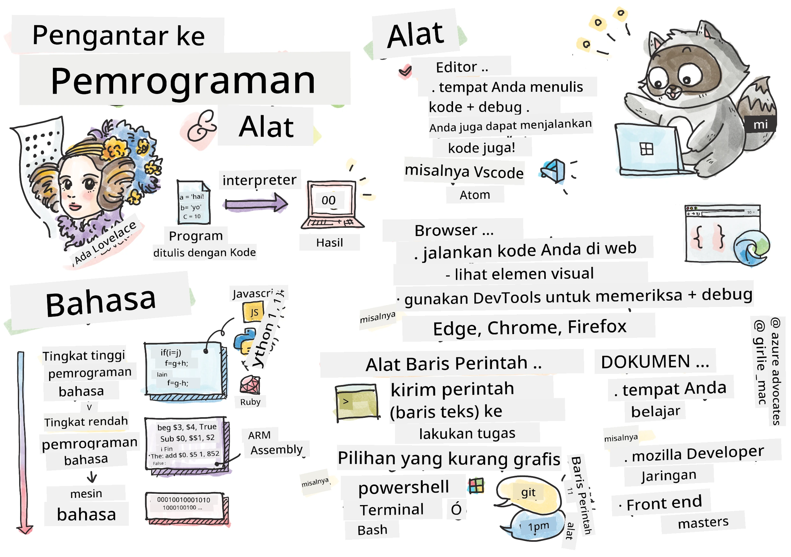
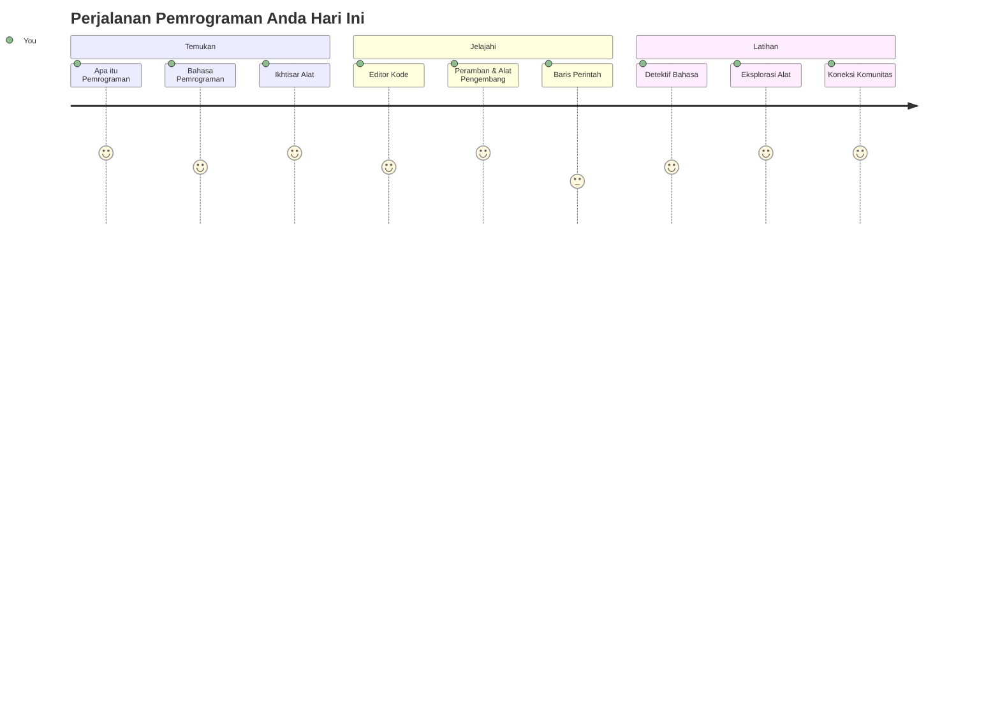
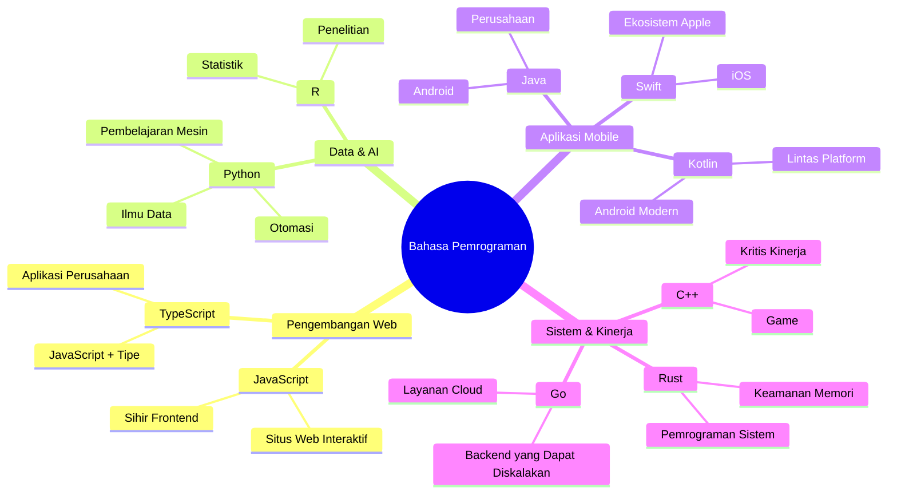
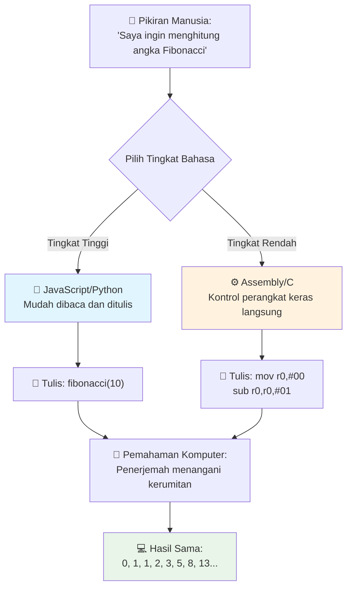
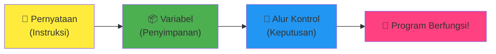
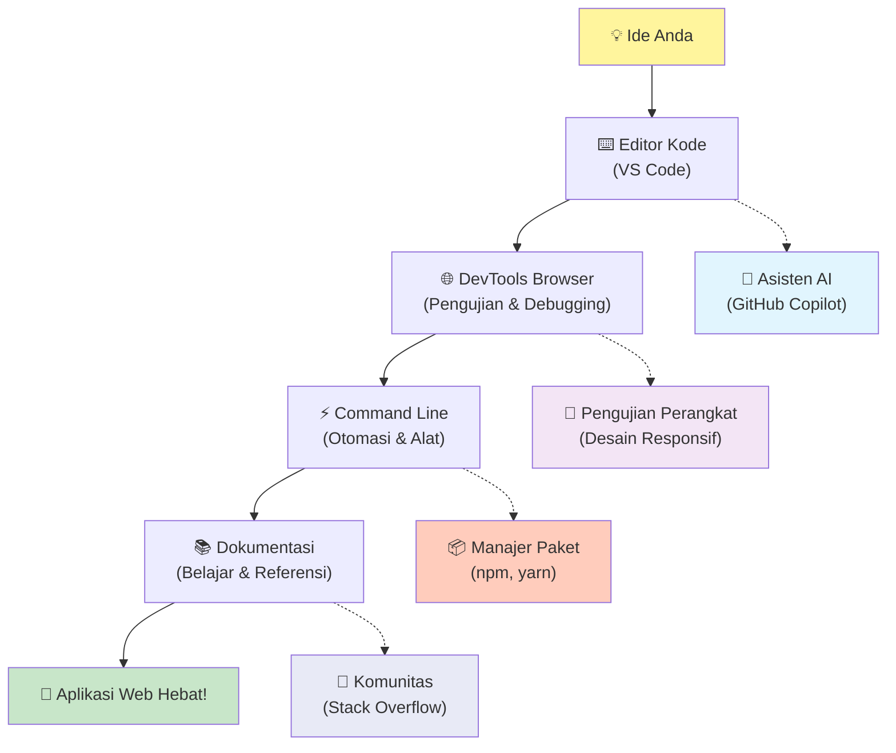
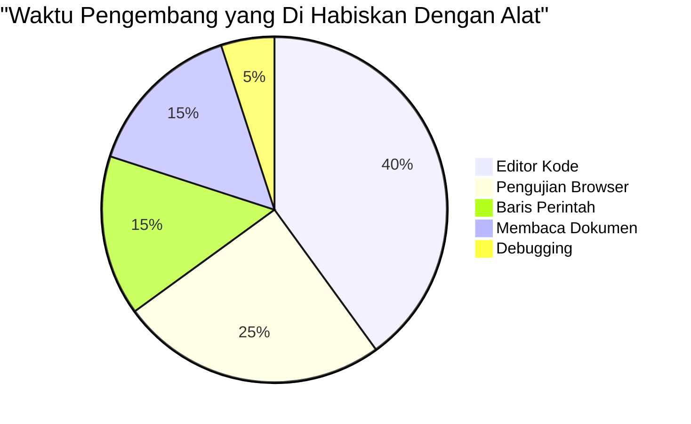
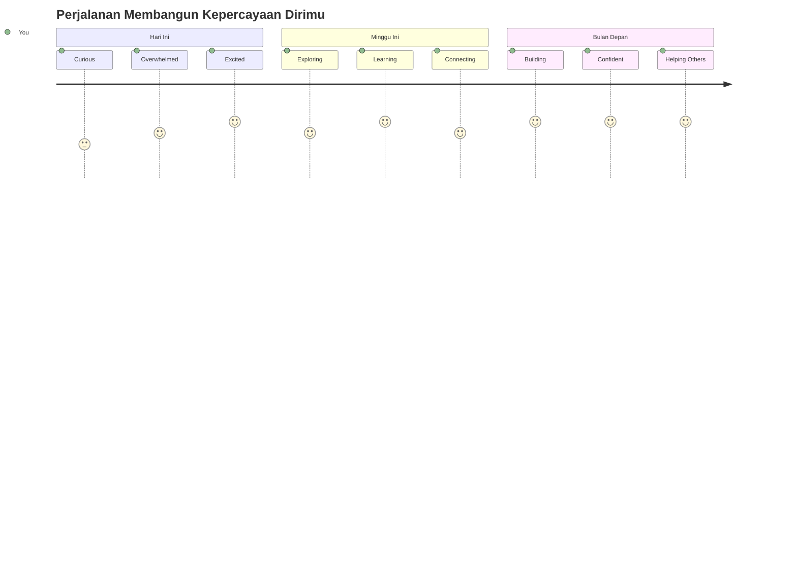

# Pengenalan Bahasa Pemrograman dan Alat Pengembang Modern

Hai, calon pengembang! 👋 Boleh aku kasih tahu sesuatu yang selalu membuatku merinding setiap hari? Kamu akan segera menemukan bahwa pemrograman bukan hanya tentang komputer – ini tentang memiliki kekuatan super nyata untuk mewujudkan ide liar terbaikmu!

Kamu tahu momen saat kamu menggunakan aplikasi favoritmu dan semuanya terasa pas? Saat kamu mengetuk sebuah tombol dan sesuatu yang benar-benar ajaib terjadi yang membuatmu berkata "wow, bagaimana mereka MELAKUKANNYA?" Nah, seseorang seperti kamu – mungkin sedang duduk di kedai kopi favoritnya jam 2 pagi dengan espresso ketiga – menulis kode yang menciptakan keajaiban itu. Dan ini akan membuatmu tercengang: di akhir pelajaran ini, kamu tidak hanya akan mengerti bagaimana mereka melakukannya, tapi kamu akan sangat ingin mencobanya sendiri!

Dengar, aku mengerti jika pemrograman terasa menakutkan sekarang. Saat pertama kali aku mulai, aku benar-benar mengira kamu harus menjadi jenius matematika atau sudah coding sejak umur lima tahun. Tapi ini yang benar-benar mengubah perspektifku: pemrograman persis seperti belajar berbicara dalam bahasa baru. Kamu mulai dengan "halo" dan "terima kasih," lalu berkembang ke memesan kopi, dan sebelum kamu sadar, kamu sudah berdiskusi filsafat yang mendalam! Bedanya, di sini kamu mengobrol dengan komputer, dan sejujurnya? Mereka adalah pasangan ngobrol paling sabar yang pernah kamu temui – mereka tak pernah menghakimi kesalahanmu dan selalu antusias mencoba lagi!

Hari ini, kita akan menjelajahi alat luar biasa yang membuat pengembangan web modern bukan hanya mungkin, tapi benar-benar adiktif. Aku berbicara tentang editor, browser, dan alur kerja yang sama persis yang digunakan pengembang di Netflix, Spotify, dan studio aplikasi indie favoritmu setiap hari. Dan ini bagian yang akan membuatmu menari bahagia: sebagian besar alat standar profesional ini benar-benar gratis!


> Sketchnote oleh [Tomomi Imura](https://twitter.com/girlie_mac)


```mermaid
journey
    title Perjalanan Pemrograman Anda Hari Ini
    section Temukan
      Apa itu Pemrograman: 5: You
      Bahasa Pemrograman: 4: You
      Ikhtisar Alat: 5: You
    section Jelajahi
      Editor Kode: 4: You
      Peramban & Alat Pengembang: 5: You
      Baris Perintah: 3: You
    section Latihan
      Detektif Bahasa: 4: You
      Eksplorasi Alat: 5: You
      Koneksi Komunitas: 5: You
```
## Mari Kita Lihat Apa yang Sudah Kamu Ketahui!

Sebelum kita mulai ke hal seru, aku penasaran – apa yang sudah kamu ketahui tentang dunia pemrograman ini? Dan dengar, jika kamu melihat pertanyaan-pertanyaan ini dan berpikir "Aku benar-benar tidak tahu apa-apa tentang ini," itu bukan hanya oke, tapi sempurna! Itu berarti kamu berada di tempat yang tepat. Anggap kuis ini seperti pemanasan sebelum olahraga – kita hanya memanaskan otot otakmu!

[Ikuti kuis pra-pelajaran](https://ff-quizzes.netlify.app/web/)

## Petualangan yang Akan Kita Lakukan Bersama

Oke, aku benar-benar bersemangat untuk apa yang akan kita jelajahi hari ini! Serius, aku berharap bisa melihat wajahmu saat beberapa konsep ini mulai klik. Ini adalah perjalanan luar biasa yang akan kita lakukan bersama:

- **Apa sebenarnya pemrograman itu (dan mengapa ini hal paling keren!)** – Kita akan menemukan bagaimana kode secara harfiah adalah sihir tak terlihat yang menggerakkan segala sesuatu di sekitarmu, mulai dari alarm yang entah kenapa tahu hari Senin pagi sampai algoritma yang secara sempurna mengkurasi rekomendasi Netflix-mu
- **Bahasa pemrograman dan kepribadian menakjubkan mereka** – Bayangkan masuk ke sebuah pesta di mana setiap orang memiliki kekuatan super yang benar-benar berbeda dan cara menyelesaikan masalah yang unik. Begitulah dunia bahasa pemrograman, dan kamu akan senang bertemu mereka!
- **Blok bangunan fundamental yang membuat keajaiban digital terjadi** – Anggap ini seperti set LEGO kreatif terbaik. Setelah kamu mengerti bagaimana potongan-potongan ini menyatu, kamu akan menyadari kamu bisa membangun apa pun yang kamu bayangkan
- **Alat profesional yang akan membuatmu merasa seperti baru diberi tongkat penyihir** – Aku tidak berlebihan – alat-alat ini benar-benar akan membuatmu merasa seperti punya kekuatan super, dan bagian terbaiknya? Mereka sama yang dipakai para profesional!

> 💡 **Ini dia:** Jangan pikirkan untuk menghafal semuanya hari ini! Saat ini, aku hanya ingin kamu merasakan percikan semangat tentang apa yang mungkin. Detailnya akan melekat secara alami saat kita berlatih bersama – begitulah cara belajar yang nyata!

> Kamu bisa mengikuti pelajaran ini di [Microsoft Learn](https://learn.microsoft.com/en-us/learn/modules/web-development-101/introduction-programming/?WT.mc_id=academic-77807-sagibbon)!

## Jadi Sebenarnya Apa Itu *Pemrograman*?

Oke, mari kita jawab pertanyaan sejuta dolar: apa sebenarnya pemrograman?

Aku akan memberi cerita yang benar-benar mengubah cara pikirku tentang hal ini. Minggu lalu, aku mencoba menjelaskan kepada ibuku bagaimana menggunakan remote TV pintar baru kami. Aku menangkap diriku berkata seperti "Tekan tombol merah, tapi bukan tombol merah besar, tombol merah kecil di kiri... tidak, kiri yang lain... oke, sekarang tahan selama dua detik, bukan satu, bukan tiga..." Kedengarannya familiar? 😅

Itulah pemrograman! Seni memberikan instruksi yang sangat rinci dan langkah demi langkah kepada sesuatu yang sangat kuat tapi harus dijelaskan dengan sempurna. Bedanya, bukan menjelaskan ke ibumu (yang bisa bertanya "tombol merah yang mana?!"), kamu menjelaskan ke komputer (yang melakukan persis apa yang kamu katakan, walaupun yang kamu katakan mungkin bukan yang kamu maksud).

Ini yang membuatku terkesan ketika pertama belajar: komputer sebenarnya cukup sederhana pada inti-nya. Mereka hanya mengerti dua hal – 1 dan 0, yang pada dasarnya "ya" dan "tidak" atau "nyala" dan "mati." Itu saja! Tapi inilah yang menjadi ajaib – kita tidak harus berbicara dalam 1 dan 0 seperti di The Matrix. Di situ muncul **bahasa pemrograman** yang menolong. Mereka seperti penerjemah terbaik dunia yang mengubah pikiran manusia biasa menjadi bahasa komputer.

Dan ini yang masih membuatku merinding setiap pagi saat bangun: secara harfiah *segala sesuatu* digital dalam hidupmu dimulai dari seseorang seperti kamu, mungkin duduk dengan piyama dan secangkir kopi, mengetik kode di laptopnya. Filter Instagram yang membuatmu tampak sempurna? Seseorang membuat kodenya. Rekomendasi yang membawamu ke lagu favorit barumu? Seorang pengembang membangun algoritmanya. Aplikasi yang membantumu membagi tagihan makan malam dengan teman? Ya, seseorang berpikir "ini mengganggu, aku yakin bisa memperbaikinya" dan kemudian... mereka melakukannya!

Saat kamu belajar pemrograman, kamu tidak hanya memperoleh keterampilan baru – kamu menjadi bagian dari komunitas luar biasa pembuat solusi yang menghabiskan hari-hari mereka berpikir, "Bagaimana jika aku bisa membangun sesuatu yang membuat hari seseorang sedikit lebih baik?" Jujur, apa yang lebih keren dari itu?

✅ **Tugas Mencari Fakta Menarik**: Ini sesuatu yang sangat keren untuk dicari saat kamu ada waktu luang – siapa yang kamu kira adalah programmer komputer pertama di dunia? Aku beri petunjuk: mungkin bukan orang yang kamu kira! Cerita di balik orang ini benar-benar menarik dan memperlihatkan bahwa pemrograman selalu soal pemecahan masalah kreatif dan berpikir di luar kotak.

### 🧠 **Waktu Cek: Bagaimana Perasaanmu?**

**Luangkan waktu untuk merenung:**
- Apakah ide "memberikan instruksi ke komputer" sekarang masuk akal buatmu?
- Bisakah kamu memikirkan tugas sehari-hari yang ingin kamu otomatisasi dengan pemrograman?
- Pertanyaan apa yang mulai muncul di benakmu tentang hal pemrograman ini?

> **Ingat**: Normal jika beberapa konsep terasa membingungkan sekarang. Belajar pemrograman itu seperti belajar bahasa baru – membutuhkan waktu untuk otak membangun jalur saraf itu. Kamu sudah melakukan dengan baik!

## Bahasa Pemrograman Itu Seperti Rasa-Rasa Sihir yang Berbeda

Oke, ini akan terdengar aneh, tapi ikuti aku – bahasa pemrograman sangat mirip dengan berbagai jenis musik. Pikirkanlah: ada jazz yang santai dan improvisasi, rock yang kuat dan langsung, klasik yang elegan dan terstruktur, dan hip-hop yang kreatif dan ekspresif. Setiap gaya punya vibe sendiri, komunitas penggemar penuh semangat sendiri, dan masing-masing cocok untuk suasana dan kesempatan berbeda.

Bahasa pemrograman bekerja dengan cara yang sama! Kamu tidak akan memakai bahasa yang sama untuk membuat game mobile seru dengan bahasa yang kamu pakai untuk mengolah data iklim dalam jumlah besar, sama seperti kamu tidak akan memainkan death metal di kelas yoga (yah, sebagian besar kelas yoga deh! 😄).

Tapi ini yang selalu membuatku terkagum setiap kali memikirkannya: bahasa-bahasa ini seperti memiliki penerjemah paling sabar dan jenius di dunia duduk tepat di sampingmu. Kamu bisa mengekspresikan ide dengan cara yang terasa alami untuk otak manusia, dan mereka mengurus semua kerja keras rumit menerjemahkan itu ke 1 dan 0 yang sebenarnya komputer pahami. Seperti punya teman yang fasih dalam "kreativitas manusia" dan "logika komputer" – dan mereka tidak pernah lelah, tidak perlu istirahat kopi, dan tidak pernah menghakimi kamu bertanya hal sama dua kali!

### Bahasa Pemrograman Populer dan Kegunaannya


```mermaid
mindmap
  root((Bahasa Pemrograman))
    Pengembangan Web
      JavaScript
        Sihir Frontend
        Situs Web Interaktif
      TypeScript
        JavaScript + Tipe
        Aplikasi Perusahaan
    Data & AI
      Python
        Ilmu Data
        Pembelajaran Mesin
        Otomasi
      R
        Statistik
        Penelitian
    Aplikasi Mobile
      Java
        Android
        Perusahaan
      Swift
        iOS
        Ekosistem Apple
      Kotlin
        Android Modern
        Lintas Platform
    Sistem & Kinerja
      C++
        Game
        Kritis Kinerja
      Rust
        Keamanan Memori
        Pemrograman Sistem
      Go
        Layanan Cloud
        Backend yang Dapat Diskalakan
```
| Bahasa | Terbaik Untuk | Mengapa Populer |
|----------|----------|------------------|
| **JavaScript** | Pengembangan web, antarmuka pengguna | Berjalan di browser dan menggerakkan situs interaktif |
| **Python** | Ilmu data, otomatisasi, AI | Mudah dibaca dan dipelajari, perpustakaan kuat |
| **Java** | Aplikasi perusahaan, aplikasi Android | Independen platform, kuat untuk sistem besar |
| **C#** | Aplikasi Windows, pengembangan game | Dukungan ekosistem Microsoft yang kuat |
| **Go** | Layanan cloud, sistem backend | Cepat, sederhana, dirancang untuk komputasi modern |

### Bahasa Tingkat Tinggi vs Bahasa Tingkat Rendah

Oke, ini sebenarnya konsep yang membuat otakku mentok ketika pertama belajar, jadi aku akan membagikan analogi yang akhirnya membuatnya klik untukku – dan aku harap ini juga membantu kamu!

Bayangkan kamu mengunjungi negara di mana kamu tidak bisa bahasanya, dan kamu sangat perlu menemukan kamar mandi terdekat (kita semua pasti pernah di situ, kan? 😅):

- **Pemrograman tingkat rendah** seperti belajar dialek lokal sedemikian rupa sehingga kamu bisa ngobrol dengan nenek yang jual buah di sudut jalan menggunakan referensi budaya, bahasa gaul lokal, dan lelucon dalam yang hanya dipahami orang yang tumbuh di sana. Sangat mengesankan dan sangat efisien... jika kamu fasih! Tapi cukup membingungkan ketika hanya ingin cari kamar mandi.

- **Pemrograman tingkat tinggi** seperti punya teman lokal hebat yang mengerti kamu. Kamu bisa bilang "Aku benar-benar perlu kamar mandi" dalam bahasa Inggris biasa, dan dia yang urus terjemahan budaya dan memberimu petunjuk dengan cara yang masuk akal untuk otak non-lokalmu.

Dalam istilah pemrograman:
- **Bahasa tingkat rendah** (seperti Assembly atau C) membolehkanmu memiliki percakapan sangat rinci dengan perangkat keras komputer, tapi kamu perlu berpikir seperti mesin, yang... ya, mari kita katakan itu perubahan mental besar!
- **Bahasa tingkat tinggi** (seperti JavaScript, Python, atau C#) membolehkan kamu berpikir seperti manusia sementara mereka yang urus semua bahasa mesin di belakang layar. Plus, mereka punya komunitas yang sangat ramah, penuh orang yang ingat bagaimana rasanya jadi pemula dan benar-benar ingin membantu!

Tebak bahasa mana yang akan aku sarankan untuk kamu mulai? 😉 Bahasa tingkat tinggi seperti roda latihan yang kamu tak pernah benar-benar ingin lepaskan karena membuat pengalaman belajar jadi jauh lebih menyenangkan!


```mermaid
flowchart TB
    A["👤 Pikiran Manusia:<br/>'Saya ingin menghitung angka Fibonacci'"] --> B{Pilih Tingkat Bahasa}
    
    B -->|Tingkat Tinggi| C["🌟 JavaScript/Python<br/>Mudah dibaca dan ditulis"]
    B -->|Tingkat Rendah| D["⚙️ Assembly/C<br/>Kontrol perangkat keras langsung"]
    
    C --> E["📝 Tulis: fibonacci(10)"]
    D --> F["📝 Tulis: mov r0,#00<br/>sub r0,r0,#01"]
    
    E --> G["🤖 Pemahaman Komputer:<br/>Penerjemah menangani kerumitan"]
    F --> G
    
    G --> H["💻 Hasil Sama:<br/>0, 1, 1, 2, 3, 5, 8, 13..."]
    
    style C fill:#e1f5fe
    style D fill:#fff3e0
    style H fill:#e8f5e8
```
### Aku Akan Tunjukkan Kenapa Bahasa Tingkat Tinggi Jauh Lebih Ramah

Oke, aku akan menunjukkan sesuatu yang secara sempurna memperlihatkan mengapa aku jatuh cinta dengan bahasa tingkat tinggi, tapi sebelumnya – aku perlu kamu janji sesuatu. Saat kamu melihat contoh kode pertama, jangan panik! Kode itu memang seharusnya tampak menakutkan. Itu memang poin yang ingin aku buat!

Kita akan melihat tugas yang sama ditulis dalam dua gaya yang benar-benar berbeda. Keduanya membuat apa yang disebut deret Fibonacci – pola matematika indah di mana setiap angka adalah jumlah dua angka sebelumnya: 0, 1, 1, 2, 3, 5, 8, 13... (Fakta menyenangkan: kamu akan menemukan pola ini di mana-mana di alam – spiral biji bunga matahari, pola buah pinus, bahkan cara galaksi terbentuk!)

Siap melihat bedanya? Ayo!

**Bahasa tingkat tinggi (JavaScript) – Ramah manusia:**

```javascript
// Langkah 1: Pengaturan dasar Fibonacci
const fibonacciCount = 10;
let current = 0;
let next = 1;

console.log('Fibonacci sequence:');
```

**Ini yang dilakukan kode ini:**
- **Deklarasikan** konstanta untuk menentukan berapa banyak angka Fibonacci yang ingin kita buat
- **Inisialisasi** dua variabel untuk melacak angka sekarang dan berikutnya dalam deret
- **Atur** nilai awal (0 dan 1) yang mendefinisikan pola Fibonacci
- **Tampilkan** pesan header untuk mengenali output kita

```javascript
// Langkah 2: Hasilkan urutan dengan sebuah loop
for (let i = 0; i < fibonacciCount; i++) {
  console.log(`Position ${i + 1}: ${current}`);
  
  // Hitung angka berikutnya dalam urutan
  const sum = current + next;
  current = next;
  next = sum;
}
```

**Menjelaskan apa yang terjadi:**
- **Loop** melalui setiap posisi dalam deret menggunakan `for` loop
- **Tampilkan** setiap angka dengan posisinya menggunakan template literal
- **Hitung** angka Fibonacci berikutnya dengan menjumlahkan nilai sekarang dan berikutnya
- **Perbarui** variabel pelacakan untuk melanjutkan ke iterasi berikutnya

```javascript
// Langkah 3: Pendekatan fungsional modern
const generateFibonacci = (count) => {
  const sequence = [0, 1];
  
  for (let i = 2; i < count; i++) {
    sequence[i] = sequence[i - 1] + sequence[i - 2];
  }
  
  return sequence;
};

// Contoh penggunaan
const fibSequence = generateFibonacci(10);
console.log(fibSequence);
```

**Di atas, kita telah:**
- **Membuat** fungsi yang bisa digunakan ulang dengan sintaks fungsi panah modern
- **Membangun** array untuk menyimpan deret lengkap alih-alih menampilkan satu per satu
- **Menggunakan** indeks array untuk menghitung setiap angka baru dari nilai sebelumnya
- **Mengembalikan** deret lengkap untuk penggunaan fleksibel di bagian lain program

**Bahasa tingkat rendah (ARM Assembly) – Ramah komputer:**

```assembly
 area ascen,code,readonly
 entry
 code32
 adr r0,thumb+1
 bx r0
 code16
thumb
 mov r0,#00
 sub r0,r0,#01
 mov r1,#01
 mov r4,#10
 ldr r2,=0x40000000
back add r0,r1
 str r0,[r2]
 add r2,#04
 mov r3,r0
 mov r0,r1
 mov r1,r3
 sub r4,#01
 cmp r4,#00
 bne back
 end
```

Perhatikan bahwa versi JavaScript membacanya hampir seperti instruksi bahasa Inggris, sementara versi Assembly menggunakan perintah misterius yang langsung mengendalikan prosesor komputer. Keduanya menyelesaikan tugas yang sama persis, tapi bahasa tingkat tinggi jauh lebih mudah dipahami, ditulis, dan dirawat manusia.

**Perbedaan utama yang kamu perhatikan:**
- **Keterbacaan**: JavaScript menggunakan nama deskriptif seperti `fibonacciCount` sementara Assembly menggunakan label yang sulit dimengerti seperti `r0`, `r1`
- **Komentar**: Bahasa tingkat tinggi mendorong komentar penjelasan yang membuat kode terdokumentasi secara mandiri
- **Struktur**: Alur logis JavaScript sesuai dengan cara manusia berpikir tentang masalah langkah demi langkah
- **Pemeliharaan**: Memperbarui versi JavaScript untuk kebutuhan yang berbeda itu sederhana dan jelas

✅ **Tentang deret Fibonacci**: Pola angka yang sangat indah ini (di mana setiap angka sama dengan jumlah dua angka sebelumnya: 0, 1, 1, 2, 3, 5, 8...) muncul secara harfiah *di mana-mana* di alam! Kamu akan menemukannya di spiral bunga matahari, pola kerucut pinus, cara cangkang nautilus melengkung, dan bahkan cara cabang pohon tumbuh. Sungguh menakjubkan bagaimana matematika dan kode bisa membantu kita memahami dan mereplikasi pola-pola yang digunakan alam untuk menciptakan keindahan!


## Blok Bangunan yang Membuat Keajaiban Terjadi

Baiklah, sekarang setelah kamu melihat seperti apa bahasa pemrograman dalam aksi, mari kita uraikan bagian fundamental yang membentuk setiap program yang pernah ditulis. Anggap ini sebagai bahan penting dalam resep favoritmu – setelah kamu mengerti fungsi masing-masing, kamu akan bisa membaca dan menulis kode di hampir semua bahasa!

Ini agak seperti mempelajari tata bahasa pemrograman. Ingat waktu sekolah ketika kamu belajar tentang kata benda, kata kerja, dan cara menyusun kalimat? Pemrograman punya versi tata bahasanya sendiri, dan jujur saja, itu jauh lebih logis dan memaafkan daripada tata bahasa Inggris! 😄

### Pernyataan: Instruksi Langkah-demi-Langkah

Mari mulai dengan **pernyataan** – ini seperti kalimat individu dalam percakapan dengan komputer. Setiap pernyataan memberitahu komputer untuk melakukan satu hal spesifik, seperti memberi petunjuk arah: "Belok kiri di sini," "Berhenti di lampu merah," "Parkir di tempat itu."

Yang saya suka dari pernyataan adalah biasanya mereka sangat mudah dibaca. Lihat ini:

```javascript
// Pernyataan dasar yang melakukan tindakan tunggal
const userName = "Alex";                    
console.log("Hello, world!");              
const sum = 5 + 3;                         
```

**Ini yang dilakukan kode ini:**
- **Mendeklarasikan** variabel konstan untuk menyimpan nama pengguna
- **Menampilkan** pesan sapaan ke output konsol
- **Menghitung** dan menyimpan hasil operasi matematika

```javascript
// Pernyataan yang berinteraksi dengan halaman web
document.title = "My Awesome Website";      
document.body.style.backgroundColor = "lightblue";
```

**Langkah demi langkah, ini yang terjadi:**
- **Mengubah** judul halaman web yang muncul di tab browser
- **Mengganti** warna latar belakang seluruh bodi halaman

### Variabel: Sistem Memori Programmu

Oke, **variabel** sebenarnya adalah salah satu konsep favorit saya untuk diajarkan karena sangat mirip dengan hal-hal yang sudah kamu gunakan setiap hari!

Pikirkan tentang daftar kontak ponselmu sebentar. Kamu tidak menghafal nomor telepon semua orang – sebaliknya, kamu menyimpan "Ibu," "Teman Terbaik," atau "Tempat Pizza yang Antar Hingga Jam 2 Pagi" dan membiarkan ponselmu mengingat nomor sebenarnya. Variabel bekerja dengan cara yang sama! Mereka seperti wadah berlabel dimana programmu bisa menyimpan informasi dan mengambilnya kembali nanti dengan nama yang masuk akal.

Yang keren banget: variabel bisa berubah saat programmu berjalan (makanya namanya "variabel" – lihat caranya bermain kata!). Sama seperti kamu mungkin memperbarui kontak tempat pizza saat menemukan yang lebih baik, variabel bisa diperbarui saat programmu mendapatkan informasi baru atau situasi berubah!

Mari saya tunjukkan betapa sederhananya ini:

```javascript
// Langkah 1: Membuat variabel dasar
const siteName = "Weather Dashboard";        
let currentWeather = "sunny";               
let temperature = 75;                       
let isRaining = false;                      
```

**Memahami konsep ini:**
- **Menyimpan** nilai yang tidak berubah dalam variabel `const` (seperti nama situs)
- **Menggunakan** `let` untuk nilai yang bisa berubah sepanjang program
- **Menetapkan** tipe data berbeda: string (teks), angka, dan boolean (true/false)
- **Memilih** nama deskriptif yang menjelaskan isi setiap variabel

```javascript
// Langkah 2: Bekerja dengan objek untuk mengelompokkan data terkait
const weatherData = {                       
  location: "San Francisco",
  humidity: 65,
  windSpeed: 12
};
```

**Pada contoh di atas, kita:**
- **Membuat** objek untuk mengelompokkan informasi cuaca terkait bersama-sama
- **Mengorganisir** beberapa data di bawah satu nama variabel
- **Menggunakan** pasangan kunci-nilai untuk memberi label setiap data dengan jelas

```javascript
// Langkah 3: Menggunakan dan memperbarui variabel
console.log(`${siteName}: Today is ${currentWeather} and ${temperature}°F`);
console.log(`Wind speed: ${weatherData.windSpeed} mph`);

// Memperbarui variabel yang dapat diubah
currentWeather = "cloudy";                  
temperature = 68;                          
```

**Mari kita pahami setiap bagian:**
- **Menampilkan** informasi menggunakan template literal dengan sintaks `${}`
- **Mengakses** properti objek menggunakan notasi titik (`weatherData.windSpeed`)
- **Memperbarui** variabel yang dideklarasikan dengan `let` untuk mencerminkan kondisi yang berubah
- **Menggabungkan** beberapa variabel untuk membuat pesan bermakna

```javascript
// Langkah 4: Destrukturisasi modern untuk kode yang lebih bersih
const { location, humidity } = weatherData; 
console.log(`${location} humidity: ${humidity}%`);
```

**Yang perlu kamu ketahui:**
- **Mengekstrak** properti spesifik dari objek menggunakan assignment destrukturisasi
- **Membuat** variabel baru otomatis dengan nama yang sama seperti kunci objek
- **Menyederhanakan** kode dengan menghindari notasi titik yang berulang-ulang

### Alur Kontrol: Mengajarkan Programmu Berpikir

Oke, di sinilah pemrograman jadi benar-benar menakjubkan! **Alur kontrol** pada dasarnya mengajarkan programmu bagaimana membuat keputusan cerdas, persis seperti yang kamu lakukan setiap hari tanpa harus berpikir keras.

Bayangkan ini: pagi ini kamu mungkin melewati sesuatu seperti "Kalau hujan, saya akan mengambil payung. Kalau dingin, saya akan memakai jaket. Kalau saya terlambat, saya akan melewatkan sarapan dan minum kopi di jalan." Otakmu secara alami mengikuti logika if-then ini puluhan kali setiap hari!

Ini yang membuat program terasa cerdas dan hidup, bukan hanya menjalankan skrip membosankan dan bisa diprediksi. Mereka benar-benar bisa melihat situasi, mengevaluasi apa yang terjadi, dan merespons dengan tepat. Seperti memberikan otak pada program yang bisa beradaptasi dan membuat pilihan!

Mau lihat betapa indahnya ini bekerja? Mari saya tunjukkan:

```javascript
// Langkah 1: Logika kondisional dasar
const userAge = 17;

if (userAge >= 18) {
  console.log("You can vote!");
} else {
  const yearsToWait = 18 - userAge;
  console.log(`You'll be able to vote in ${yearsToWait} year(s).`);
}
```

**Ini yang dilakukan kode ini:**
- **Memeriksa** apakah usia pengguna memenuhi syarat memilih
- **Menjalankan** blok kode berbeda berdasarkan hasil kondisi
- **Menghitung** dan menampilkan berapa lama sampai memenuhi syarat memilih jika kurang dari 18
- **Memberikan** umpan balik spesifik dan membantu untuk tiap skenario

```javascript
// Langkah 2: Beberapa kondisi dengan operator logika
const userAge = 17;
const hasPermission = true;

if (userAge >= 18 && hasPermission) {
  console.log("Access granted: You can enter the venue.");
} else if (userAge >= 16) {
  console.log("You need parent permission to enter.");
} else {
  console.log("Sorry, you must be at least 16 years old.");
}
```

**Menguraikan apa yang terjadi di sini:**
- **Menggabungkan** beberapa kondisi menggunakan operator `&&` (dan)
- **Membuat** hierarki kondisi menggunakan `else if` untuk banyak skenario
- **Menangani** semua kemungkinan dengan pernyataan `else` terakhir
- **Memberikan** umpan balik yang jelas dan dapat ditindaklanjuti untuk setiap situasi berbeda

```javascript
// Langkah 3: Kondisional singkat dengan operator ternary
const votingStatus = userAge >= 18 ? "Can vote" : "Cannot vote yet";
console.log(`Status: ${votingStatus}`);
```

**Yang perlu diingat:**
- **Menggunakan** operator ternary (`? :`) untuk kondisi dua pilihan yang sederhana
- **Menulis** kondisi terlebih dahulu, lalu `?`, hasil benar, lalu `:`, hasil salah
- **Menerapkan** pola ini saat perlu menetapkan nilai berdasarkan kondisi

```javascript
// Langkah 4: Menangani beberapa kasus spesifik
const dayOfWeek = "Tuesday";

switch (dayOfWeek) {
  case "Monday":
  case "Tuesday":
  case "Wednesday":
  case "Thursday":
  case "Friday":
    console.log("It's a weekday - time to work!");
    break;
  case "Saturday":
  case "Sunday":
    console.log("It's the weekend - time to relax!");
    break;
  default:
    console.log("Invalid day of the week");
}
```

**Kode ini melakukan hal berikut:**
- **Mencocokkan** nilai variabel terhadap beberapa kasus spesifik
- **Mengelompokkan** kasus serupa bersama (hari kerja vs akhir pekan)
- **Menjalankan** blok kode yang tepat saat ditemukan kecocokan
- **Menyertakan** kasus `default` untuk menangani nilai tak terduga
- **Menggunakan** pernyataan `break` untuk mencegah kode lanjut ke kasus berikutnya

> 💡 **Analogi dunia nyata**: Anggap alur kontrol seperti GPS paling sabar di dunia yang memberimu petunjuk arah. Mungkin berkata "Jika ada kemacetan di Jalan Utama, ambil jalan tol. Jika konstruksi menghalangi jalan tol, coba jalur pemandangan." Program menggunakan logika kondisional sama seperti itu untuk merespon cerdas berbagai situasi dan selalu memberi pengguna pengalaman terbaik.

### 🎯 **Cek Konsep: Menguasai Blok Bangunan**

**Yuk cek sejauh mana pemahamanmu tentang dasar-dasar:**
- Bisakah kamu jelaskan perbedaan antara variabel dan pernyataan dengan kata-katamu sendiri?
- Pikirkan skenario dunia nyata di mana kamu akan menggunakan keputusan if-then (seperti contoh pemilihan)
- Apa satu hal tentang logika pemrograman yang membuatmu terkejut?

**Penyemangat cepat:**

```mermaid
flowchart LR
    A["📝 Pernyataan<br/>(Instruksi)"] --> B["📦 Variabel<br/>(Penyimpanan)"] --> C["🔀 Alur Kontrol<br/>(Keputusan)"] --> D["🎉 Program Berfungsi!"]
    
    style A fill:#ffeb3b
    style B fill:#4caf50
    style C fill:#2196f3
    style D fill:#ff4081
```
✅ **Apa yang akan datang selanjutnya**: Kita akan bersenang-senang menyelami lebih dalam konsep-konsep ini saat kita melanjutkan perjalanan luar biasa ini bersama! Sekarang, fokus saja pada perasaan semangat tentang semua kemungkinan menakjubkan di depanmu. Keterampilan dan teknik spesifik akan melekat secara alami saat kita berlatih bersama – saya janji ini akan jauh lebih menyenangkan dari yang kamu kira!

## Alat-Alat Pilihan

Baiklah, ini benar-benar membuat saya sangat bersemangat sampai hampir tidak bisa menahan diri! 🚀 Kita akan membahas alat luar biasa yang akan membuatmu merasa seperti baru saja diberikan kunci pesawat luar angkasa digital.

Kamu tahu bagaimana koki punya pisau yang seimbang sempurna dan terasa seperti bagian dari tangannya? Atau bagaimana musisi punya gitar yang tampaknya langsung bernyanyi saat mereka menyentuhnya? Nah, para pengembang punya versi alat ajaib ini, dan ini yang akan membuatmu tercengang – sebagian besar dari alat ini benar-benar gratis!

Saya sampai melompat-lompat karena membagikan ini padamu, sebab alat-alat ini benar-benar sudah merevolusi cara kita membuat perangkat lunak. Kita berbicara tentang asisten pengkodean bertenaga AI yang bisa membantu menulis kode (saya tidak bercanda!), lingkungan cloud di mana kamu bisa membangun aplikasi lengkap dari mana saja dengan Wi-Fi, dan alat debugging yang begitu canggih seolah-olah punya penglihatan sinar-X untuk programmu.

Dan bagian yang masih membuat saya merinding: ini bukan alat "pemula" yang bakal kamu tinggalkan nantinya. Ini adalah alat tingkat profesional yang sama yang digunakan pengembang di Google, Netflix, dan studio aplikasi indie yang kamu sukai saat ini juga. Kamu akan merasa seperti profesional saat memakainya!


```mermaid
graph TD
    A["💡 Ide Anda"] --> B["⌨️ Editor Kode<br/>(VS Code)"] 
    B --> C["🌐 DevTools Browser<br/>(Pengujian & Debugging)"]
    C --> D["⚡ Command Line<br/>(Otomasi & Alat)"]
    D --> E["📚 Dokumentasi<br/>(Belajar & Referensi)"]
    E --> F["🚀 Aplikasi Web Hebat!"]
    
    B -.-> G["🤖 Asisten AI<br/>(GitHub Copilot)"]
    C -.-> H["📱 Pengujian Perangkat<br/>(Desain Responsif)"]
    D -.-> I["📦 Manajer Paket<br/>(npm, yarn)"]
    E -.-> J["👥 Komunitas<br/>(Stack Overflow)"]
    
    style A fill:#fff59d
    style F fill:#c8e6c9
    style G fill:#e1f5fe
    style H fill:#f3e5f5
    style I fill:#ffccbc
    style J fill:#e8eaf6
```
### Editor Kode dan IDE: Sahabat Digital Barumu

Mari kita bahas editor kode – ini benar-benar akan menjadi tempat favorit baru untuk bersantai! Anggap ini sebagai tempat suci pengkodean pribadimu di mana kamu akan menghabiskan sebagian besar waktu membuat dan menyempurnakan karya digitalmu.

Tapi yang benar-benar ajaib dari editor modern: mereka bukan hanya editor teks biasa. Mereka seperti memiliki mentor pengkodean paling cerdas dan suportif duduk di sebelahmu 24/7. Mereka menangkap kesalahan ketik sebelum kamu menyadarinya, menyarankan perbaikan yang membuatmu terlihat jenius, membantu kamu memahami fungsi setiap potongan kode, dan beberapa bahkan bisa memprediksi apa yang akan kamu ketik berikutnya dan menawarkan menyelesaikan kalimatmu!

Saya ingat pertama kali menemukan auto-completion – saya benar-benar merasa seperti hidup di masa depan. Kamu mulai mengetik sesuatu, dan editor berkata, "Hei, apakah kamu sedang memikirkan fungsi ini yang melakukan persis yang kamu butuhkan?" Rasanya seperti punya pembaca pikiran sebagai teman pengkodean!

**Apa yang membuat editor ini luar biasa?**

Editor kode modern menawarkan berbagai fitur mengesankan yang dirancang untuk meningkatkan produktivitasmu:

| Fitur | Fungsinya | Mengapa Berguna |
|-------|-----------|-----------------|
| **Syntax Highlighting** | Memberi warna pada bagian kode berbeda | Membuat kode lebih mudah dibaca dan menemukan error |
| **Auto-completion** | Menyaran kan kode saat mengetik | Mempercepat pengkodean dan mengurangi typo |
| **Debugging Tools** | Membantu menemukan dan memperbaiki kesalahan | Menghemat waktu troubleshooting |
| **Extensions** | Menambahkan fitur khusus | Menyesuaikan editor untuk teknologi apapun |
| **AI Assistants** | Menyarankan kode dan penjelasan | Mempercepat pembelajaran dan produktivitas |

> 🎥 **Sumber Video**: Mau lihat alat-alat ini dalam aksi? Tonton [video Tools of the Trade](https://youtube.com/watch?v=69WJeXGBdxg) untuk gambaran lengkap.

#### Editor Rekomendasi untuk Pengembangan Web

**[Visual Studio Code](https://code.visualstudio.com/?WT.mc_id=academic-77807-sagibbon)** (Gratis)
- Paling populer di kalangan pengembang web
- Ekosistem ekstensi yang sangat baik
- Terminal bawaan dan integrasi Git
- **Ekstensi wajib:**
  - [GitHub Copilot](https://marketplace.visualstudio.com/items?itemName=GitHub.copilot) - saran kode berbasis AI
  - [Live Share](https://marketplace.visualstudio.com/items?itemName=MS-vsliveshare.vsliveshare) - kolaborasi waktu nyata
  - [Prettier](https://marketplace.visualstudio.com/items?itemName=esbenp.prettier-vscode) - format kode otomatis
  - [Code Spell Checker](https://marketplace.visualstudio.com/items?itemName=streetsidesoftware.code-spell-checker) - menangkap typo kode

**[JetBrains WebStorm](https://www.jetbrains.com/webstorm/)** (Berbayar, gratis untuk pelajar)
- Alat debugging dan pengujian canggih
- Penyelesaian kode cerdas
- Kontrol versi bawaan

**IDE Berbasis Cloud** (Beragam harga)
- [GitHub Codespaces](https://github.com/features/codespaces) - VS Code lengkap di browser
- [Replit](https://replit.com/) - Bagus untuk belajar dan berbagi kode
- [StackBlitz](https://stackblitz.com/) - Pengembangan web full-stack instan

> 💡 **Tips Memulai**: Mulailah dengan Visual Studio Code – gratis, banyak digunakan di industri, dan punya komunitas besar yang membuat tutorial dan ekstensi berguna.


### Peramban Web: Laboratorium Pengembangan Rahasiamu

Oke, bersiaplah untuk dibuat terpesona! Kamu tahu kan selama ini kamu menggunakan peramban untuk menggulir media sosial dan menonton video? Ternyata mereka menyembunyikan laboratorium pengembang rahasia yang luar biasa ini selama ini, menunggu untuk kamu temukan!

Setiap kali kamu klik kanan di halaman web dan memilih "Inspect Element," kamu membuka dunia tersembunyi alat pengembang yang jujur lebih kuat daripada beberapa perangkat lunak mahal yang pernah saya bayar ratusan dolar. Rasanya seperti menemukan bahwa dapur biasa kamu ternyata menyembunyikan laboratorium koki profesional di balik panel rahasia!
Pertama kali seseorang menunjukkan DevTools browser kepada saya, saya menghabiskan sekitar tiga jam hanya mengklik sana-sini sambil berkata, "TUNGGU, BISA BEGITU JUGA?!" Anda benar-benar bisa mengedit situs web apa pun secara real-time, melihat dengan tepat seberapa cepat semuanya dimuat, menguji bagaimana tampilan situs Anda di perangkat berbeda, dan bahkan melakukan debug JavaScript seperti seorang profesional. Ini benar-benar luar biasa!

**Inilah mengapa browser adalah senjata rahasia Anda:**

Saat Anda membuat situs web atau aplikasi web, Anda perlu melihat bagaimana tampilannya dan berperilaku di dunia nyata. Browser tidak hanya menampilkan karya Anda tetapi juga memberikan umpan balik rinci tentang performa, aksesibilitas, dan masalah potensial.

#### Alat Pengembang Browser (DevTools)

Browser modern menyertakan rangkaian pengembangan yang lengkap:

| Kategori Alat | Fungsinya | Contoh Penggunaan |
|---------------|--------------|------------------|
| **Element Inspector** | Melihat dan mengedit HTML/CSS secara real-time | Menyesuaikan gaya untuk melihat hasil langsung |
| **Console** | Melihat pesan kesalahan dan menguji JavaScript | Debug masalah dan bereksperimen dengan kode |
| **Network Monitor** | Melacak bagaimana sumber daya dimuat | Mengoptimalkan performa dan waktu muat |
| **Accessibility Checker** | Menguji desain inklusif | Memastikan situs Anda dapat digunakan oleh semua pengguna |
| **Device Simulator** | Pratinjau pada berbagai ukuran layar | Menguji desain responsif tanpa perangkat banyak |

#### Browser yang Direkomendasikan untuk Pengembangan

- **[Chrome](https://developers.google.com/web/tools/chrome-devtools/)** - DevTools standar industri dengan dokumentasi lengkap
- **[Firefox](https://developer.mozilla.org/docs/Tools)** - Alat CSS Grid dan aksesibilitas yang sangat baik
- **[Edge](https://docs.microsoft.com/microsoft-edge/devtools-guide-chromium/?WT.mc_id=academic-77807-sagibbon)** - Dibangun di atas Chromium dengan sumber daya pengembang Microsoft

> ⚠️ **Tips Pengujian Penting**: Selalu uji situs web Anda di berbagai browser! Apa yang berjalan sempurna di Chrome mungkin tampak berbeda di Safari atau Firefox. Pengembang profesional menguji di semua browser utama untuk memastikan pengalaman pengguna yang konsisten.


### Alat Baris Perintah: Gerbang Menuju Kekuatan Super Pengembang

Oke, mari kita jujur sebentar tentang baris perintah, karena saya ingin Anda mendengarnya dari seseorang yang benar-benar mengerti. Ketika pertama kali saya melihatnya – hanya layar hitam menakutkan dengan teks berkedip – saya benar-benar berpikir, "Tidak, sama sekali tidak! Ini terlihat seperti sesuatu dari film hacker tahun 1980-an, dan saya pasti tidak cukup pintar untuk ini!" 😅

Tapi inilah yang saya harap seseorang katakan kepada saya saat itu, dan yang saya katakan kepada Anda sekarang: baris perintah tidak menakutkan – sebenarnya seperti berbicara langsung dengan komputer Anda. Anggaplah ini seperti perbedaan antara memesan makanan lewat aplikasi mewah dengan gambar dan menu (yang mudah dan nyaman) dibandingkan masuk ke restoran lokal favorit Anda di mana kokinya tahu persis apa yang Anda suka dan bisa membuatkan sesuatu yang sempurna hanya dengan Anda berkata "kejutan sesuatu yang luar biasa."

Baris perintah adalah tempat para pengembang merasa seperti penyihir sejati. Anda mengetik beberapa kata yang tampak ajaib (oke, sebenarnya perintah biasa, tapi terasa ajaib!), tekan enter, dan BOOM – Anda telah membuat seluruh struktur proyek, memasang alat kuat dari seluruh dunia, atau meluncurkan aplikasi Anda ke internet agar jutaan orang melihat. Setelah Anda merasakan kekuatan itu, jujur sangat adiktif!

**Mengapa baris perintah akan menjadi alat favorit Anda:**

Meskipun antarmuka grafis bagus untuk banyak tugas, baris perintah unggul dalam otomatisasi, presisi, dan kecepatan. Banyak alat pengembangan bekerja terutama melalui antarmuka baris perintah, dan mempelajarinya dengan efisien dapat meningkatkan produktivitas Anda secara dramatis.

```bash
# Langkah 1: Buat dan navigasi ke direktori proyek
mkdir my-awesome-website
cd my-awesome-website
```

**Inilah yang dilakukan kode ini:**
- **Membuat** direktori baru bernama "my-awesome-website" untuk proyek Anda
- **Masuk** ke dalam direktori yang baru dibuat untuk mulai bekerja

```bash
# Langkah 2: Inisialisasi proyek dengan package.json
npm init -y

# Instal alat pengembangan modern
npm install --save-dev vite prettier eslint
npm install --save-dev @eslint/js
```

**Langkah demi langkah, inilah yang terjadi:**
- **Inisialisasi** proyek Node.js baru dengan pengaturan default menggunakan `npm init -y`
- **Pasang** Vite sebagai alat build modern untuk pengembangan cepat dan produksi
- **Tambahkan** Prettier untuk format kode otomatis dan ESLint untuk pemeriksaan kualitas kode
- **Gunakan** flag `--save-dev` untuk menandai ini sebagai dependensi pengembangan saja

```bash
# Langkah 3: Buat struktur dan berkas proyek
mkdir src assets
echo '<!DOCTYPE html><html><head><title>My Site</title></head><body><h1>Hello World</h1></body></html>' > index.html

# Mulai server pengembangan
npx vite
```

**Dalam kode di atas, kami telah:**
- **Mengorganisir** proyek dengan membuat folder terpisah untuk kode sumber dan aset
- **Menghasilkan** file HTML dasar dengan struktur dokumen yang benar
- **Menjalankan** server pengembangan Vite untuk live reload dan hot module replacement

#### Alat Baris Perintah Esensial untuk Pengembangan Web

| Alat | Tujuan | Mengapa Anda Membutuhkannya |
|------|---------|-----------------|
| **[Git](https://git-scm.com/)** | Kontrol versi | Melacak perubahan, kolaborasi, backup pekerjaan |
| **[Node.js & npm](https://nodejs.org/)** | Runtime JavaScript & manajemen paket | Menjalankan JavaScript di luar browser, pasang alat pengembangan modern |
| **[Vite](https://vitejs.dev/)** | Alat build & server dev | Pengembangan cepat dengan hot module replacement |
| **[ESLint](https://eslint.org/)** | Kualitas kode | Temukan dan perbaiki masalah JavaScript secara otomatis |
| **[Prettier](https://prettier.io/)** | Format kode | Jaga kode Anda konsisten dan mudah dibaca |

#### Opsi Khusus Platform

**Windows:**
- **[Windows Terminal](https://docs.microsoft.com/windows/terminal/?WT.mc_id=academic-77807-sagibbon)** - Terminal modern dengan fitur lengkap
- **[PowerShell](https://docs.microsoft.com/powershell/?WT.mc_id=academic-77807-sagibbon)** 💻 - Lingkungan scripting yang kuat
- **[Command Prompt](https://docs.microsoft.com/windows-server/administration/windows-commands/?WT.mc_id=academic-77807-sagibbon)** 💻 - Baris perintah Windows tradisional

**macOS:**
- **[Terminal](https://support.apple.com/guide/terminal/)** 💻 - Aplikasi terminal bawaan
- **[iTerm2](https://iterm2.com/)** - Terminal yang ditingkatkan dengan fitur lanjutan

**Linux:**
- **[Bash](https://www.gnu.org/software/bash/)** 💻 - Shell Linux standar
- **[KDE Konsole](https://docs.kde.org/trunk5/en/konsole/konsole/index.html)** - Emulator terminal canggih

> 💻 = Sudah terpasang di sistem operasi

> 🎯 **Jalur Pembelajaran**: Mulailah dengan perintah dasar seperti `cd` (pindah direktori), `ls` atau `dir` (daftar file), dan `mkdir` (buat folder). Berlatih dengan perintah alur kerja modern seperti `npm install`, `git status`, dan `code .` (membuka direktori saat ini di VS Code). Saat Anda semakin nyaman, Anda akan secara alami mempelajari perintah dan teknik otomatisasi yang lebih maju.


### Dokumentasi: Mentor Belajar Anda yang Selalu Tersedia

Oke, saya akan membagikan rahasia kecil yang akan membuat Anda merasa jauh lebih baik sebagai pemula: bahkan pengembang paling berpengalaman menghabiskan sebagian besar waktunya membaca dokumentasi. Dan itu bukan karena mereka tidak tahu apa yang mereka lakukan – itu sebenarnya tanda kebijaksanaan!

Anggaplah dokumentasi seperti memiliki akses ke guru paling sabar dan berpengetahuan di dunia yang tersedia 24/7. Terjebak pada masalah jam 2 pagi? Dokumentasi hadir dengan pelukan virtual hangat dan jawaban yang tepat Anda butuhkan. Mau belajar fitur baru keren yang sedang ramai dibicarakan? Dokumentasi mendukung Anda dengan contoh langkah demi langkah. Mencoba memahami mengapa sesuatu bekerja seperti itu? Anda benar – dokumentasi siap menjelaskannya sampai Anda benar-benar paham!

Ini sesuatu yang benar-benar mengubah perspektif saya: dunia pengembangan web bergerak sangat cepat, dan tidak ada siapa pun (benar-benar tidak ada!) yang menghafal semuanya. Saya pernah melihat pengembang senior dengan pengalaman 15+ tahun mencari sintaks dasar, dan tahu apa? Itu bukan memalukan – itu pintar! Bukan soal menghafal sempurna; ini soal tahu di mana menemukan jawaban yang dapat dipercaya dengan cepat dan memahami cara menggunakannya.

**Inilah tempat keajaiban sebenarnya terjadi:**

Pengembang profesional menghabiskan banyak waktu membaca dokumentasi – bukan karena tidak tahu apa yang dilakukan, tetapi karena lanskap pengembangan web berkembang begitu cepat sehingga tetap up-to-date membutuhkan pembelajaran terus-menerus. Dokumentasi bagus membantu Anda memahami bukan hanya *bagaimana* menggunakan sesuatu, tetapi *mengapa* dan *kapan* menggunakannya.

#### Sumber Dokumentasi Penting

**[Mozilla Developer Network (MDN)](https://developer.mozilla.org/docs/Web)**
- Standar emas untuk dokumentasi teknologi web
- Panduan komprehensif untuk HTML, CSS, dan JavaScript
- Termasuk informasi kompatibilitas browser
- Menyediakan contoh praktis dan demo interaktif

**[Web.dev](https://web.dev)** (oleh Google)
- Praktik terbaik pengembangan web modern
- Panduan optimasi performa
- Prinsip aksesibilitas dan desain inklusif
- Studi kasus dari proyek dunia nyata

**[Microsoft Developer Documentation](https://docs.microsoft.com/microsoft-edge/#microsoft-edge-for-developers)**
- Sumber daya pengembangan browser Edge
- Panduan Progressive Web App
- Wawasan pengembangan lintas platform

**[Frontend Masters Learning Paths](https://frontendmasters.com/learn/)**
- Kurikulum pembelajaran terstruktur
- Kursus video dari para ahli industri
- Latihan pengkodean langsung

> 📚 **Strategi Belajar**: Jangan mencoba menghafal dokumentasi – sebaliknya, pelajari cara menavigasi dengan efisien. Tandai referensi yang sering digunakan dan latih menggunakan fungsi pencarian untuk menemukan informasi spesifik dengan cepat.

### 🔧 **Pemeriksaan Penguasaan Alat: Apa yang Membekas Pada Anda?**

**Luangkan waktu untuk mempertimbangkan:**
- Alat mana yang paling Anda ingin coba dulu? (Tidak ada jawaban salah!)
- Apakah baris perintah masih terasa menakutkan, atau Anda semakin penasaran?
- Bisakah Anda membayangkan menggunakan DevTools browser untuk mengintip sisi dalam situs favorit Anda?


```mermaid
pie title "Waktu Pengembang yang Di Habiskan Dengan Alat"
    "Editor Kode" : 40
    "Pengujian Browser" : 25
    "Baris Perintah" : 15
    "Membaca Dokumen" : 15
    "Debugging" : 5
```
> **Wawasan menyenangkan**: Sebagian besar pengembang menghabiskan sekitar 40% waktunya di editor kode, tapi perhatikan berapa banyak waktu yang dihabiskan untuk pengujian, belajar, dan memecahkan masalah. Pemrograman bukan hanya tentang menulis kode – ini tentang menciptakan pengalaman!

✅ **Bahan renungan**: Ini sesuatu yang menarik untuk dipikirkan – menurut Anda, alat membangun situs web (pengembangan) mungkin berbeda apa ya dengan alat mendesain bagaimana tampilannya (desain)? Ini seperti perbedaan antara arsitek yang merancang rumah indah dan kontraktor yang membangunnya. Keduanya penting, tetapi membutuhkan kotak peralatan berbeda! Jenis pemikiran ini akan membantu Anda melihat gambaran besar bagaimana situs web menjadi hidup.

## Tantangan GitHub Copilot Agent 🚀

Gunakan mode Agen untuk menyelesaikan tantangan berikut:

**Deskripsi:** Jelajahi fitur editor kode modern atau IDE dan tunjukkan bagaimana alat itu dapat meningkatkan alur kerja Anda sebagai pengembang web.

**Prompt:** Pilih editor kode atau IDE (seperti Visual Studio Code, WebStorm, atau IDE berbasis cloud). Daftar tiga fitur atau ekstensi yang membantu Anda menulis, debug, atau memelihara kode dengan lebih efisien. Untuk masing-masing, berikan penjelasan singkat bagaimana itu menguntungkan alur kerja Anda.

---

## 🚀 Tantangan

**Oke, detektif, siap untuk kasus pertama Anda?**

Sekarang Anda telah memiliki fondasi hebat ini, saya punya petualangan yang akan membantu Anda melihat betapa beragam dan menariknya dunia pemrograman sesungguhnya. Dan dengarkan – ini bukan soal menulis kode dulu, jadi jangan merasa tertekan! Anggap diri Anda sebagai detektif bahasa pemrograman pada kasus pertama yang seru ini!

**Misi Anda, jika Anda memutuskan untuk menerimanya:**
1. **Jadilah penjelajah bahasa:** Pilih tiga bahasa pemrograman dari dunia yang benar-benar berbeda – mungkin satu yang membangun situs web, satu yang membuat aplikasi seluler, dan satu yang mengolah data untuk ilmuwan. Temukan contoh tugas sederhana yang sama ditulis dalam setiap bahasa. Saya jamin Anda akan sangat takjub melihat betapa berbeda tampilannya walaupun melakukan hal yang sama!

2. **Ungkap cerita asal-usulnya:** Apa yang membuat setiap bahasa istimewa? Ini fakta keren – setiap bahasa pemrograman dibuat karena seseorang berpikir, "Tahu nggak? Harus ada cara lebih baik untuk menyelesaikan masalah spesifik ini." Bisakah Anda cari tahu masalah apa yang mereka selesaikan? Beberapa cerita ini benar-benar menarik!

3. **Temui komunitasnya:** Lihat seberapa ramah dan antusias komunitas masing-masing bahasa. Beberapa punya jutaan pengembang berbagi ilmu dan saling membantu, yang lain lebih kecil tapi sangat kompak dan suportif. Anda akan senang melihat berbagai kepribadian komunitas ini!

4. **Ikuti intuisi Anda:** Bahasa mana yang terasa paling mudah didekati bagi Anda sekarang? Jangan khawatir soal memilih yang "sempurna" – cukup dengarkan insting Anda! Tidak ada jawaban salah di sini, dan Anda selalu bisa menjelajahi lainnya nanti.

**Kerja bonus detektif:** Cari tahu situs web atau aplikasi besar apa saja yang dibangun dengan masing-masing bahasa. Saya jamin Anda akan terkejut mengetahui apa yang menjalankan Instagram, Netflix, atau game seluler favorit Anda yang tidak bisa berhenti dimainkan!

> 💡 **Ingat**: Anda tidak mencoba menjadi ahli di salah satu bahasa hari ini. Anda hanya mengenal lingkungan di sekitarnya sebelum memutuskan tempat yang ingin Anda jadikan markas. Santai saja, bersenang-senanglah, dan biarkan rasa ingin tahu memandu Anda!

## Mari Rayakan Apa yang Sudah Anda Temukan!

Astaga, Anda telah menyerap begitu banyak informasi hebat hari ini! Saya benar-benar bersemangat melihat seberapa banyak dari perjalanan menakjubkan ini yang sudah Anda ingat. Dan ingat – ini bukan ujian yang harus sempurna. Ini lebih seperti perayaan semua hal keren yang sudah Anda pelajari tentang dunia menarik yang akan Anda masuki!

[Ikuti kuis pasca-pembelajaran](https://ff-quizzes.netlify.app/web/)

## Ulasan & Belajar Mandiri

**Luangkan waktu untuk mengeksplorasi dan bersenang-senang!**
Anda telah melangkah jauh hari ini, dan itu adalah sesuatu yang patut dibanggakan! Sekarang saatnya bagian yang menyenangkan – menjelajahi topik-topik yang memicu rasa penasaran Anda. Ingat, ini bukan pekerjaan rumah – ini adalah petualangan!

**Menyelami lebih dalam apa yang membuat Anda bersemangat:**

**Berinteraksi langsung dengan bahasa pemrograman:**
- Kunjungi situs resmi 2-3 bahasa yang menarik perhatian Anda. Masing-masing memiliki kepribadian dan kisahnya sendiri!
- Coba beberapa playground coding online seperti [CodePen](https://codepen.io/), [JSFiddle](https://jsfiddle.net/), atau [Replit](https://replit.com/). Jangan takut bereksperimen – Anda tidak akan merusak apa pun!
- Baca tentang bagaimana bahasa favorit Anda terbentuk. Serius, beberapa cerita asal usul ini sangat menarik dan akan membantu Anda memahami mengapa bahasa bekerja seperti itu.

**Mengenal alat baru Anda:**
- Unduh Visual Studio Code jika Anda belum melakukannya – ini gratis dan Anda akan menyukainya!
- Luangkan beberapa menit untuk menjelajahi marketplace Extensions. Ini seperti toko aplikasi untuk editor kode Anda!
- Buka Developer Tools browser Anda dan klik-clic saja. Jangan khawatir memahami semuanya – cukup kenali apa yang ada di sana.

**Bergabung dengan komunitas:**
- Ikuti beberapa komunitas pengembang di [Dev.to](https://dev.to/), [Stack Overflow](https://stackoverflow.com/), atau [GitHub](https://github.com/). Komunitas pemrograman sangat ramah terhadap pendatang baru!
- Tonton beberapa video coding ramah pemula di YouTube. Ada banyak pembuat konten hebat di luar sana yang ingat bagaimana rasanya memulai.
- Pertimbangkan bergabung dengan meetups lokal atau komunitas online. Percayalah, para pengembang senang membantu pendatang baru!

> 🎯 **Dengar, ini yang saya ingin Anda ingat**: Anda tidak diharapkan menjadi ahli coding dalam semalam! Saat ini, Anda baru mengenal dunia luar biasa yang akan menjadi bagian Anda. Santai saja, nikmati perjalanan, dan ingat – setiap pengembang yang Anda kagumi dulu juga pernah duduk tepat di tempat Anda sekarang, merasa bersemangat dan mungkin sedikit kewalahan. Itu sangat normal, dan itu berarti Anda melangkah dengan benar!


## Tugas

[Membaca Dokumentasi](assignment.md)

> 💡 **Sedikit dorongan untuk tugas Anda**: Saya sangat ingin melihat Anda menjelajahi beberapa alat yang belum kita bahas! Lewatkan editor, browser, dan alat baris perintah yang sudah kita bicarakan – ada semesta alat pengembangan luar biasa lainnya yang menunggu untuk ditemukan. Cari yang aktif dipelihara dan memiliki komunitas yang hidup dan membantu (biasanya mereka punya tutorial terbaik dan orang-orang paling suportif saat Anda mengalami kebuntuan dan butuh bantuan ramah).

---

## 🚀 Garis Waktu Perjalanan Pemrograman Anda

### ⚡ **Apa yang Bisa Anda Lakukan Dalam 5 Menit ke Depan**
- [ ] Tandai 2-3 situs bahasa pemrograman yang menarik perhatian Anda
- [ ] Unduh Visual Studio Code jika belum dilakukan
- [ ] Buka DevTools browser Anda (F12) dan klik-klick di sembarang situs web
- [ ] Bergabung dengan satu komunitas pemrograman (Dev.to, Reddit r/webdev, atau Stack Overflow)

### ⏰ **Apa yang Bisa Anda Capai Dalam Satu Jam Ini**
- [ ] Selesaikan kuis pasca-pelajaran dan renungkan jawaban Anda
- [ ] Siapkan VS Code dengan ekstensi GitHub Copilot
- [ ] Coba contoh "Hello World" di 2 bahasa pemrograman berbeda secara online
- [ ] Tonton video "Sehari Dalam Kehidupan Seorang Pengembang" di YouTube
- [ ] Mulai pekerjaan detektif bahasa pemrograman Anda (dari tantangan)

### 📅 **Petualangan Anda Selama Seminggu**
- [ ] Selesaikan tugas dan jelajahi 3 alat pengembangan baru
- [ ] Ikuti 5 pengembang atau akun pemrograman di media sosial
- [ ] Coba bangun sesuatu yang kecil di CodePen atau Replit (bahkan hanya "Hello, [Nama Anda]!")
- [ ] Baca satu posting blog pengembang tentang perjalanan coding seseorang
- [ ] Ikuti meetup virtual atau tonton ceramah pemrograman
- [ ] Mulai belajar bahasa pilihan Anda dengan tutorial online

### 🗓️ **Transformasi Anda Selama Sebulan**
- [ ] Bangun proyek kecil pertama Anda (bahkan halaman web sederhana sudah dihitung!)
- [ ] Berkontribusi pada proyek open-source (mulai dengan perbaikan dokumentasi)
- [ ] Mentori seseorang yang baru memulai perjalanan pemrogramannya
- [ ] Buat situs portofolio pengembang Anda
- [ ] Terhubung dengan komunitas pengembang lokal atau kelompok belajar
- [ ] Mulai rencanakan tonggak pembelajaran berikutnya

### 🎯 **Refleksi Akhir**

**Sebelum melanjutkan, luangkan waktu merayakan:**
- Apa satu hal tentang pemrograman yang membuat Anda bersemangat hari ini?
- Alat atau konsep apa yang ingin Anda eksplorasi duluan?
- Bagaimana perasaan Anda tentang memulai perjalanan pemrograman ini?
- Apa satu pertanyaan yang ingin Anda tanyakan kepada pengembang sekarang?


```mermaid
journey
    title Perjalanan Membangun Kepercayaan Dirimu
    section Hari Ini
      Curious: 3: You
      Overwhelmed: 4: You
      Excited: 5: You
    section Minggu Ini
      Exploring: 4: You
      Learning: 5: You
      Connecting: 4: You
    section Bulan Depan
      Building: 5: You
      Confident: 5: You
      Helping Others: 5: You
```
> 🌟 **Ingatlah**: Setiap ahli dulu adalah pemula. Setiap pengembang senior pernah merasakan persis seperti Anda sekarang – bersemangat, mungkin sedikit kewalahan, dan tentu penasaran tentang apa yang mungkin dilakukan. Anda berada dalam lingkaran luar biasa, dan perjalanan ini akan sangat mengagumkan. Selamat datang di dunia pemrograman yang menakjubkan! 🎉

---

<!-- CO-OP TRANSLATOR DISCLAIMER START -->
**Penafian**:  
Dokumen ini telah diterjemahkan menggunakan layanan terjemahan AI [Co-op Translator](https://github.com/Azure/co-op-translator). Meskipun kami berupaya untuk memberikan terjemahan yang akurat, harap diketahui bahwa terjemahan otomatis mungkin mengandung kesalahan atau ketidakakuratan. Dokumen asli dalam bahasa aslinya harus dianggap sebagai sumber yang otoritatif. Untuk informasi yang sangat penting, disarankan menggunakan terjemahan profesional oleh manusia. Kami tidak bertanggung jawab atas kesalahpahaman atau salah tafsir yang timbul dari penggunaan terjemahan ini.
<!-- CO-OP TRANSLATOR DISCLAIMER END -->