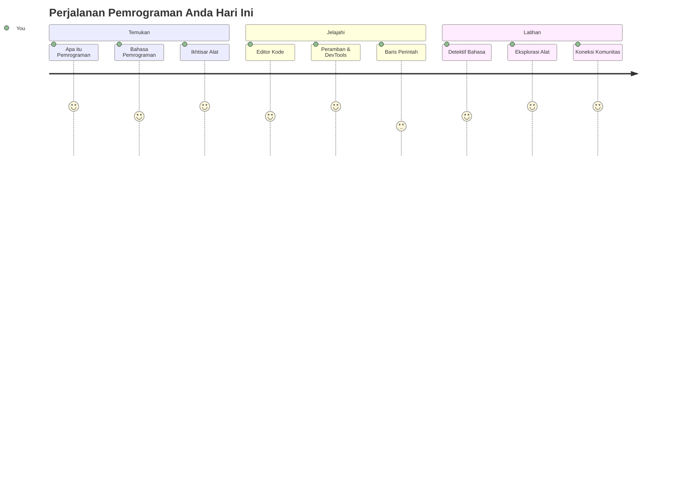
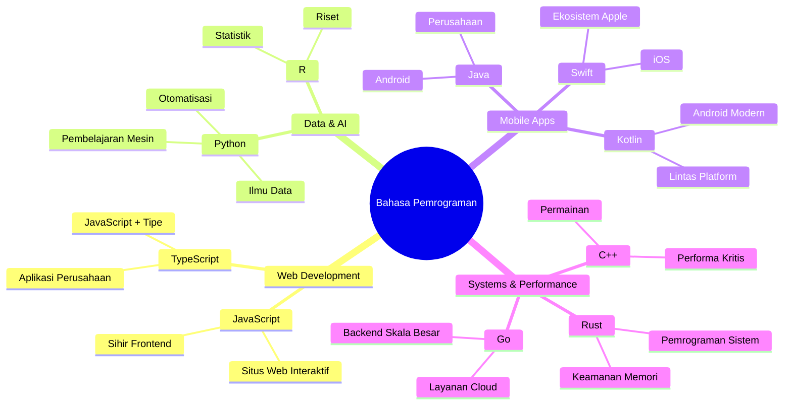
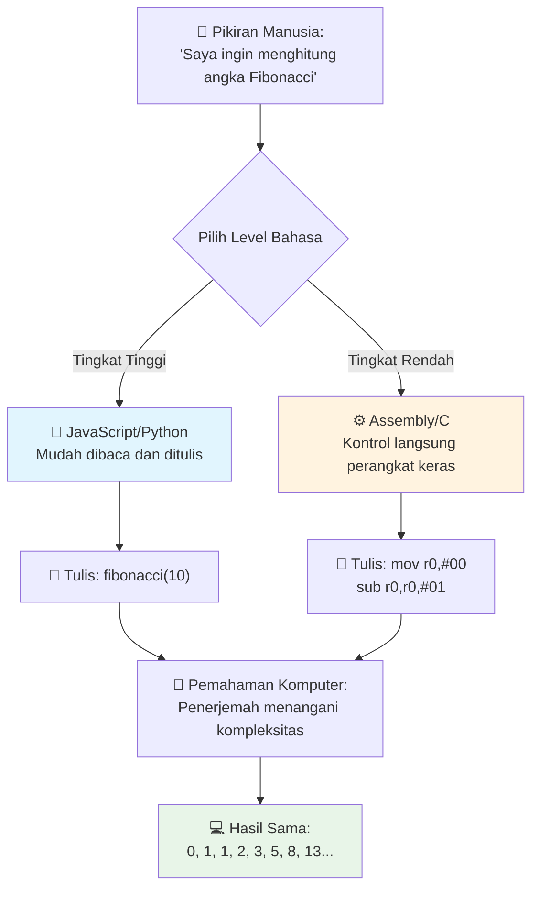
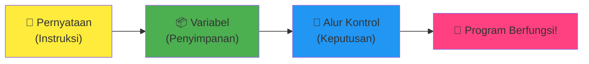
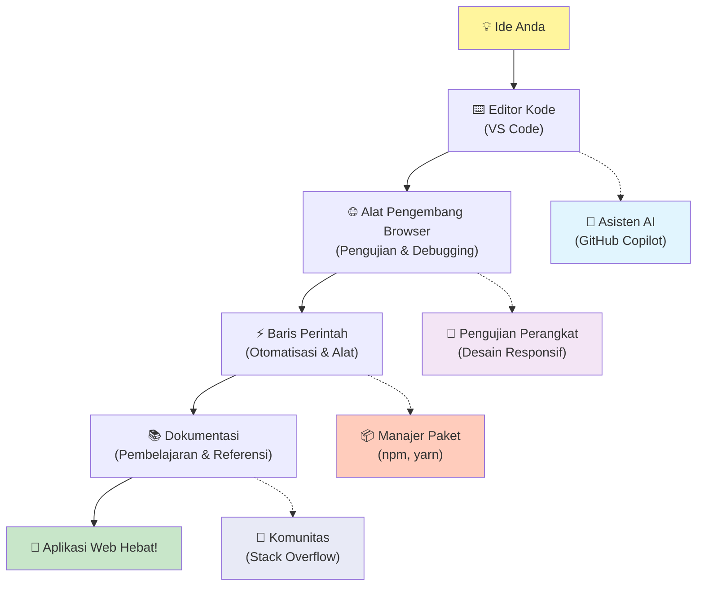
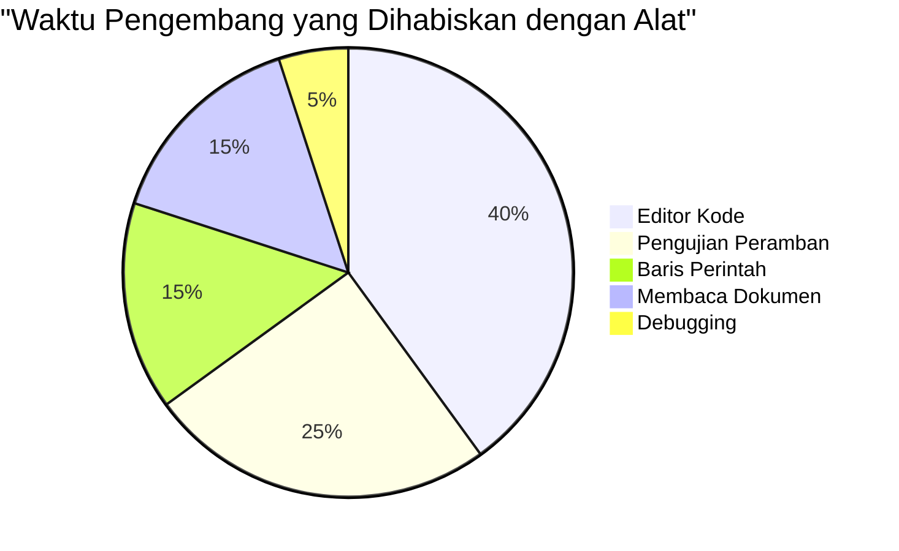
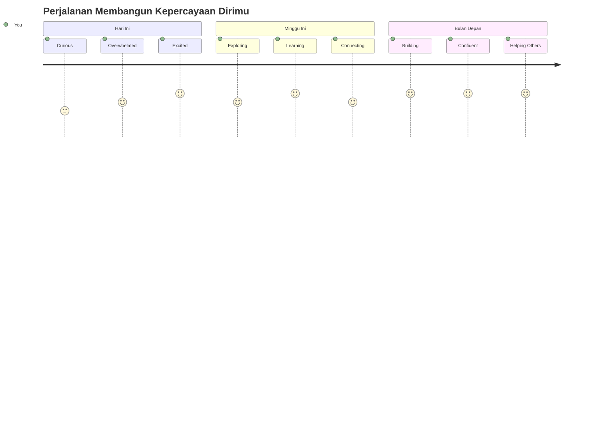

# Pengenalan Bahasa Pemrograman dan Alat Pengembang Modern

Halo, calon pengembang masa depan! 👋 Boleh saya ceritakan sesuatu yang masih membuat saya merinding setiap hari? Kamu akan segera menemukan bahwa pemrograman bukan hanya tentang komputer – ini tentang memiliki kekuatan super nyata untuk mewujudkan ide-ide terliarmu!

Kamu tahu momen ketika kamu menggunakan aplikasi favorit dan semuanya terasa sangat tepat? Saat kamu mengetuk tombol dan sesuatu yang benar-benar ajaib terjadi sehingga membuatmu berkata "wow, bagaimana mereka MELAKUKANNYA?" Nah, seseorang seperti kamu – mungkin sedang duduk di kedai kopi favoritnya pukul 2 pagi sambil menyeruput espresso ketiga – yang menulis kode yang menciptakan keajaiban itu. Dan ini yang akan membuatmu terkagum: pada akhir pelajaran ini, kamu tidak hanya akan memahami bagaimana mereka melakukannya, tapi kamu juga akan ingin mencobanya sendiri!

Dengar, saya benar-benar mengerti jika pemrograman terasa menakutkan sekarang. Saat pertama kali mulai, saya jujur berpikir kamu harus menjadi jenius matematika atau sudah coding sejak usia lima tahun. Tapi ini yang benar-benar mengubah pandangan saya: pemrograman persis seperti belajar berbicara dalam bahasa baru. Kamu mulai dengan "halo" dan "terima kasih," lalu belajar memesan kopi, dan sebelum kamu sadar, kamu sudah berdiskusi filsafat yang mendalam! Bedanya, di sini kamu berbicara dengan komputer, dan sungguh? Mereka adalah rekan bicara paling sabar yang pernah kamu temui – mereka tidak pernah menghakimi kesalahanmu dan selalu senang mencoba lagi!

Hari ini, kita akan menjelajahi alat-alat luar biasa yang membuat pengembangan web modern tidak hanya mungkin, tapi benar-benar adiktif. Saya berbicara tentang editor, browser, dan alur kerja yang sama yang digunakan pengembang di Netflix, Spotify, dan studio aplikasi indie favoritmu setiap hari. Dan inilah bagian yang akan membuatmu menari kegirangan: sebagian besar alat profesional dan standar industri ini benar-benar gratis!


> Sketchnote oleh [Tomomi Imura](https://twitter.com/girlie_mac)


```mermaid
journey
    title Perjalanan Pemrograman Anda Hari Ini
    section Temukan
      Apa itu Pemrograman: 5: You
      Bahasa Pemrograman: 4: You
      Ikhtisar Alat: 5: You
    section Jelajahi
      Editor Kode: 4: You
      Peramban & DevTools: 5: You
      Baris Perintah: 3: You
    section Latihan
      Detektif Bahasa: 4: You
      Eksplorasi Alat: 5: You
      Koneksi Komunitas: 5: You
```
## Mari Lihat Apa yang Sudah Kamu Ketahui!

Sebelum kita masuk ke hal menyenangkan, saya penasaran – apa yang sudah kamu ketahui tentang dunia pemrograman ini? Dan dengarkan, jika kamu melihat pertanyaan-pertanyaan ini dan berpikir "Saya benar-benar tidak tahu apa-apa tentang ini," itu tidak hanya oke, itu sempurna! Itu berarti kamu berada di tempat yang tepat. Anggaplah kuis ini seperti pemanasan sebelum olahraga – kita hanya memanaskan otot otakmu!

[Ikuti kuis pra-pelajaran](https://ff-quizzes.netlify.app/web/)


## Petualangan yang Akan Kita Jalani Bersama

Oke, saya benar-benar girang tentang apa yang akan kita jelajahi hari ini! Serius, saya ingin sekali melihat ekspresimu ketika beberapa konsep ini tiba-tiba nyambung. Ini perjalanan luar biasa yang akan kita tempuh bersama:

- **Apa sebenarnya pemrograman itu (dan mengapa itu hal paling keren!)** – Kita akan menemukan bagaimana kode secara harafiah adalah sihir tak kasat mata yang menggerakkan segala sesuatu di sekitarmu, dari alarm yang entah bagaimana tahu kalau itu Senin pagi hingga algoritma yang secara sempurna mengkurasi rekomendasi Netflix-mu
- **Bahasa pemrograman dan kepribadian menakjubkan mereka** – Bayangkan kamu masuk ke sebuah pesta di mana setiap orang memiliki kekuatan super dan cara menyelesaikan masalah yang sangat berbeda. Itulah dunia bahasa pemrograman, dan kamu akan senang bertemu mereka!
- **Blok bangunan dasar yang membuat sihir digital terjadi** – Anggap ini seperti set LEGO kreatif terbaik. Setelah kamu memahami bagaimana potongan-potongan ini menyatu, kamu akan menyadari kamu benar-benar bisa membangun apa saja yang kamu bayangkan
- **Alat profesional yang akan membuatmu merasa seperti baru dipasangkan tongkat penyihir** – Saya tidak berlebihan – alat-alat ini benar-benar membuatmu merasa punya kekuatan super, dan bagian terbaiknya? Mereka adalah yang sama yang digunakan para profesional!

> 💡 **Ini dia:** Jangan coba menghafal semuanya hari ini! Sekarang, saya hanya ingin kamu merasakan percikan semangat tentang apa yang mungkin terjadi. Detail akan melekat secara alami saat kita berlatih bersama – begitulah cara belajar yang sebenarnya!

> Kamu bisa mengambil pelajaran ini di [Microsoft Learn](https://learn.microsoft.com/en-us/learn/modules/web-development-101/introduction-programming/?WT.mc_id=academic-77807-sagibbon)!

## Jadi, Apa Sebenarnya *Pemrograman* Itu?

Baiklah, mari kita jawab pertanyaan jutaan dolar: apa sebenarnya pemrograman itu?

Saya akan ceritakan sebuah kisah yang mengubah cara saya memandang ini. Minggu lalu, saya mencoba menjelaskan kepada ibu saya bagaimana menggunakan remote TV pintar baru kami. Saya menyadari saya berkata hal-hal seperti "Tekan tombol merah, tapi bukan tombol merah besar, tombol merah kecil di sebelah kiri... bukan, sebelah kiri satumu... oke, sekarang tahan dua detik, bukan satu, bukan tiga..." Kedengarannya familiar? 😅

Itulah pemrograman! Seni memberikan instruksi sangat rinci langkah demi langkah kepada sesuatu yang sangat kuat tapi harus dijelaskan semuanya dengan sempurna. Bedanya, alih-alih menjelaskan kepada ibumu (yang bisa bertanya "tombol merah yang mana?!"), kamu menjelaskan kepada komputer (yang melakukan persis apa yang kamu katakan, bahkan jika apa yang kamu katakan tidak persis seperti yang kamu maksud).

Ini yang membuat saya tercengang saat pertama belajar: komputer sebenarnya cukup sederhana pada intinya. Mereka hanya mengerti dua hal – 1 dan 0, yang pada dasarnya adalah "ya" dan "tidak" atau "nyala" dan "mati." Itu saja! Tapi ini yang membuatnya ajaib – kita tidak harus berbicara dalam 1 dan 0 seperti di film The Matrix. Di sinilah **bahasa pemrograman** datang sebagai penyelamat. Mereka seperti penerjemah terbaik di dunia yang mengubah pikiran manusia biasa menjadi bahasa komputer.

Dan ini yang masih membuat saya merinding setiap pagi saat bangun: secara harafiah *semua* hal digital dalam hidupmu dimulai dari seseorang seperti kamu, mungkin sedang duduk di piyama dengan secangkir kopi, mengetik kode di laptop mereka. Filter Instagram yang membuatmu tampak sempurna? Seseorang yang menulis kodenya. Rekomendasi yang membawamu ke lagu favorit baru? Seorang pengembang yang membuat algoritmanya. Aplikasi yang membantumu membagi tagihan makan malam dengan teman? Ya, seseorang berpikir "ini menyebalkan, saya yakin bisa memperbaikinya" dan kemudian… mereka melakukannya!

Ketika kamu belajar pemrograman, kamu bukan hanya mendapatkan keterampilan baru – kamu menjadi bagian dari komunitas luar biasa para pemecah masalah yang menghabiskan hari-hari mereka dengan berpikir, "Bagaimana kalau saya membangun sesuatu yang membuat hari seseorang jadi sedikit lebih baik?" Jujur, apa yang lebih keren dari itu?

✅ **Fakta Menarik**: Ini sesuatu yang sangat keren untuk dicari saat kamu punya waktu luang – siapa menurutmu programmer komputer pertama di dunia? Saya beri petunjuk: mungkin bukan orang yang kamu kira! Cerita tentang orang ini sungguh menarik dan menunjukkan bahwa pemrograman selalu tentang pemecahan masalah kreatif dan berpikir di luar kotak.

### 🧠 **Waktunya Mengecek: Bagaimana Perasaanmu?**

**Luangkan waktu sejenak untuk merenung:**
- Apakah ide tentang "memberi instruksi kepada komputer" masuk akal bagimu sekarang?
- Bisakah kamu memikirkan tugas sehari-hari yang ingin kamu otomatisasi dengan pemrograman?
- Pertanyaan apa yang muncul di pikiranmu tentang segala hal tentang pemrograman ini?

> **Ingat:** Sangat normal jika beberapa konsep terasa membingungkan saat ini. Belajar pemrograman seperti belajar bahasa baru – butuh waktu bagi otakmu untuk membangun jalur saraf itu. Kamu sudah melakukan dengan baik!

## Bahasa Pemrograman Seperti Berbagai Rasa Sihir

Oke, ini mungkin terdengar aneh, tapi ikut aku ya – bahasa pemrograman itu seperti berbagai jenis musik. Pikirkan: kamu punya jazz yang halus dan improvisasional, rock yang kuat dan lugas, klasik yang anggun dan terstruktur, dan hip-hop yang kreatif dan ekspresif. Setiap gaya punya getaran sendiri, komunitas penggemar yang bersemangat, dan cocok untuk suasana dan kesempatan berbeda-beda.

Bahasa pemrograman bekerja dengan cara yang sama! Kamu tidak akan menggunakan bahasa yang sama untuk membuat game mobile yang menyenangkan dengan yang kamu gunakan untuk mengolah data iklim dalam jumlah besar, seperti kamu tidak akan memainkan death metal di kelas yoga (yah, kebanyakan kelas yoga sih! 😄).

Tapi ini yang selalu membuatku terkagum setiap kali memikirkannya: bahasa-bahasa ini seperti punya penerjemah paling sabar dan cerdas di dunia duduk tepat di sebelahmu. Kamu bisa mengungkapkan ide dengan cara yang alami bagi otak manusia, dan mereka mengurus semua pekerjaan rumit menerjemahkan itu ke dalam 1 dan 0 yang komputer benar-benar mengerti. Ini seperti punya teman yang benar-benar fasih dalam "kreativitas manusia" dan "logika komputer" – dan mereka tak pernah lelah, tak butuh istirahat kopi, dan tak pernah menghakimi jika kamu bertanya hal sama dua kali!

### Bahasa Pemrograman Populer dan Penggunaannya


```mermaid
mindmap
  root((Bahasa Pemrograman))
    Web Development
      JavaScript
        Sihir Frontend
        Situs Web Interaktif
      TypeScript
        JavaScript + Tipe
        Aplikasi Perusahaan
    Data & AI
      Python
        Ilmu Data
        Pembelajaran Mesin
        Otomatisasi
      R
        Statistik
        Riset
    Mobile Apps
      Java
        Android
        Perusahaan
      Swift
        iOS
        Ekosistem Apple
      Kotlin
        Android Modern
        Lintas Platform
    Systems & Performance
      C++
        Permainan
        Performa Kritis
      Rust
        Keamanan Memori
        Pemrograman Sistem
      Go
        Layanan Cloud
        Backend Skala Besar
```
| Bahasa | Terbaik Untuk | Mengapa Populer |
|----------|----------|------------------|
| **JavaScript** | Pengembangan web, antarmuka pengguna | Berjalan di browser dan menggerakkan situs interaktif |
| **Python** | Data science, otomasi, AI | Mudah dibaca dan dipelajari, perpustakaan yang kuat |
| **Java** | Aplikasi perusahaan, aplikasi Android | Independen platform, kuat untuk sistem besar |
| **C#** | Aplikasi Windows, pengembangan game | Dukungan kuat dari ekosistem Microsoft |
| **Go** | Layanan cloud, sistem backend | Cepat, sederhana, dirancang untuk komputasi modern |

### Bahasa Tingkat Tinggi vs. Tingkat Rendah

Oke, ini sebenarnya konsep yang membingungkan saya saat pertama belajar, jadi saya akan bagikan analogi yang akhirnya membuat saya paham – dan saya harap ini juga membantumu!

Bayangkan kamu sedang mengunjungi negara dimana kamu tidak bisa bahasa lokal, dan kamu sangat butuh menemukan kamar mandi terdekat (kita semua pernah merasakan, kan? 😅):

- **Pemrograman tingkat rendah** seperti mempelajari dialek lokal sampai kamu bisa ngobrol dengan nenek penjual buah di pojok menggunakan referensi budaya, bahasa gaul lokal, dan lelucon dalam yang hanya dimengerti orang yang besar di sana. Sangat mengesankan dan sangat efisien... jika kamu memang fasih! Tapi sangat membingungkan kalau kamu cuma ingin menemukan kamar mandi.

- **Pemrograman tingkat tinggi** seperti punya teman lokal yang hebat yang langsung mengerti. Kamu tinggal bilang "Saya sangat perlu cari kamar mandi" dalam bahasa Inggris sederhana, dan dia yang mengurus terjemahan budaya dan memberi petunjuk dengan cara yang masuk akal bagi otak non-lokalmu.

Dalam istilah pemrograman:
- **Bahasa tingkat rendah** (seperti Assembly atau C) membiarkan kamu berbicara sangat rinci dengan perangkat keras komputer sebenarnya, tapi kamu harus berpikir seperti mesin, yang... yah, mari bilang itu perpindahan mental besar!
- **Bahasa tingkat tinggi** (seperti JavaScript, Python, atau C#) membiarkan kamu berpikir seperti manusia sementara mereka mengurus semua bahasa mesin di belakang layar. Plus, mereka punya komunitas yang sangat ramah yang mengingat saat mereka baru belajar dan benar-benar ingin membantu!

Tebak bahasa mana yang akan saya sarankan kamu mulai? 😉 Bahasa tingkat tinggi seperti roda latihan yang sebenarnya tidak pernah ingin kamu lepaskan karena membuat pengalaman jadi jauh lebih menyenangkan!


```mermaid
flowchart TB
    A["👤 Pikiran Manusia:<br/>'Saya ingin menghitung angka Fibonacci'"] --> B{Pilih Level Bahasa}
    
    B -->|Tingkat Tinggi| C["🌟 JavaScript/Python<br/>Mudah dibaca dan ditulis"]
    B -->|Tingkat Rendah| D["⚙️ Assembly/C<br/>Kontrol langsung perangkat keras"]
    
    C --> E["📝 Tulis: fibonacci(10)"]
    D --> F["📝 Tulis: mov r0,#00<br/>sub r0,r0,#01"]
    
    E --> G["🤖 Pemahaman Komputer:<br/>Penerjemah menangani kompleksitas"]
    F --> G
    
    G --> H["💻 Hasil Sama:<br/>0, 1, 1, 2, 3, 5, 8, 13..."]
    
    style C fill:#e1f5fe
    style D fill:#fff3e0
    style H fill:#e8f5e8
```
### Ayo Saya Tunjukkan Kenapa Bahasa Tingkat Tinggi Lebih Ramah

Oke, saya akan tunjukkan sesuatu yang sempurna memperlihatkan kenapa saya jatuh cinta dengan bahasa tingkat tinggi, tapi pertama – saya ingin kamu berjanji. Ketika kamu melihat contoh kode pertama, jangan panik! Ini memang dimaksudkan untuk terlihat menakutkan. Itu tepatnya yang ingin saya tunjukkan!

Kita akan melihat tugas yang sama persis ditulis dalam dua gaya yang sangat berbeda. Keduanya membuat yang disebut deret Fibonacci – pola matematika indah di mana setiap angka adalah jumlah dari dua angka sebelumnya: 0, 1, 1, 2, 3, 5, 8, 13... (Fakta seru: kamu akan menemukan pola ini di mana-mana di alam – spiral biji bunga matahari, pola kerucut pinus, bahkan cara galaksi terbentuk!)

Siap untuk melihat perbedaannya? Mari kita mulai!

**Bahasa tingkat tinggi (JavaScript) – Ramah manusia:**

```javascript
// Langkah 1: Penyiapan dasar Fibonacci
const fibonacciCount = 10;
let current = 0;
let next = 1;

console.log('Fibonacci sequence:');
```

**Ini yang dilakukan kode ini:**
- **Mendeklarasikan** konstanta untuk menentukan berapa banyak angka Fibonacci yang ingin dibuat
- **Menginisialisasi** dua variabel untuk melacak angka saat ini dan berikutnya dalam deret
- **Mengatur** nilai awal (0 dan 1) yang mendefinisikan pola Fibonacci
- **Menampilkan** pesan header untuk mengenali keluaran kita

```javascript
// Langkah 2: Hasilkan urutan dengan sebuah loop
for (let i = 0; i < fibonacciCount; i++) {
  console.log(`Position ${i + 1}: ${current}`);
  
  // Hitung angka berikutnya dalam urutan
  const sum = current + next;
  current = next;
  next = sum;
}
```

**Menjelaskan apa yang terjadi di sini:**
- **Melakukan loop** lewat setiap posisi dalam deret menggunakan `for` loop
- **Menampilkan** setiap angka dengan posisinya menggunakan format template literal
- **Menghitung** angka Fibonacci berikutnya dengan menambahkan nilai saat ini dan berikutnya
- **Memperbarui** variabel pelacak untuk pindah ke iterasi berikutnya

```javascript
// Langkah 3: Pendekatan fungsional modern
const generateFibonacci = (count) => {
  const sequence = [0, 1];
  
  for (let i = 2; i < count; i++) {
    sequence[i] = sequence[i - 1] + sequence[i - 2];
  }
  
  return sequence;
};

// Contoh penggunaan
const fibSequence = generateFibonacci(10);
console.log(fibSequence);
```

**Dalam kode di atas, kita telah:**
- **Membuat** fungsi yang bisa digunakan ulang menggunakan sintaks panah modern
- **Membangun** array untuk menyimpan seluruh deret daripada menampilkan satu per satu
- **Menggunakan** indeks array untuk menghitung setiap angka baru dari nilai sebelumnya
- **Mengembalikan** deret lengkap untuk penggunaan fleksibel di bagian lain program

**Bahasa tingkat rendah (ARM Assembly) – Ramah komputer:**

```assembly
 area ascen,code,readonly
 entry
 code32
 adr r0,thumb+1
 bx r0
 code16
thumb
 mov r0,#00
 sub r0,r0,#01
 mov r1,#01
 mov r4,#10
 ldr r2,=0x40000000
back add r0,r1
 str r0,[r2]
 add r2,#04
 mov r3,r0
 mov r0,r1
 mov r1,r3
 sub r4,#01
 cmp r4,#00
 bne back
 end
```

Perhatikan bagaimana versi JavaScript hampir seperti instruksi bahasa Inggris, sementara versi Assembly menggunakan perintah misterius yang langsung mengendalikan prosesor komputer. Keduanya melakukan tugas yang sama persis, tapi bahasa tingkat tinggi jauh lebih mudah dipahami, ditulis, dan dirawat oleh manusia.

**Perbedaan utama yang akan kamu perhatikan:**
- **Keterbacaan**: JavaScript menggunakan nama yang deskriptif seperti `fibonacciCount` sementara Assembly menggunakan label yang sulit dimengerti seperti `r0`, `r1`
- **Komentar**: Bahasa tingkat tinggi mendorong komentar penjelasan yang membuat kode menjadi terdokumentasi sendiri
- **Struktur**: Alur logis JavaScript sesuai dengan cara manusia berpikir tentang masalah langkah demi langkah
- **Pemeliharaan**: Memperbarui versi JavaScript untuk kebutuhan yang berbeda sangatlah mudah dan jelas

✅ **Tentang deret Fibonacci**: Pola angka yang luar biasa indah ini (di mana setiap angka adalah jumlah dari dua angka sebelumnya: 0, 1, 1, 2, 3, 5, 8...) muncul secara harfiah *di mana-mana* dalam alam! Kamu akan menemukannya pada spiral bunga matahari, pola kerucut pinus, cara cangkang nautilus melengkung, dan bahkan pada cara cabang pohon tumbuh. Sangat menakjubkan bagaimana matematika dan kode bisa membantu kita memahami dan menciptakan kembali pola yang digunakan alam untuk menciptakan keindahan!

## Blok Bangunan yang Membuat Keajaiban Terjadi

Baiklah, sekarang setelah kamu melihat seperti apa bahasa pemrograman dalam praktik, mari kita bahas bagian dasar yang membentuk hampir setiap program yang pernah ditulis. Anggap saja ini sebagai bahan utama dalam resep favoritmu – begitu kamu mengerti fungsi masing-masing, kamu akan bisa membaca dan menulis kode dalam hampir semua bahasa!

Ini seperti mempelajari tata bahasa pemrograman. Ingat waktu di sekolah dulu ketika kamu belajar tentang kata benda, kata kerja, dan cara menyusun kalimat? Pemrograman punya versi tata bahasanya sendiri, dan jujur saja, itu jauh lebih logis dan mudah dibandingkan tata bahasa Inggris! 😄

### Pernyataan: Instruksi Langkah demi Langkah

Mari mulai dengan **pernyataan** – ini seperti kalimat individual dalam percakapan dengan komputer kamu. Setiap pernyataan memberitahu komputer untuk melakukan satu hal spesifik, seperti memberikan arahan: "Belok kiri di sini," "Berhenti di lampu merah," "Parkir di tempat itu."

Yang saya suka dari pernyataan adalah bagaimana mereka biasanya mudah dibaca. Lihat ini:

```javascript
// Pernyataan dasar yang melakukan tindakan tunggal
const userName = "Alex";                    
console.log("Hello, world!");              
const sum = 5 + 3;                         
```

**Berikut yang dilakukan kode ini:**
- **Deklarasikan** variabel konstan untuk menyimpan nama pengguna
- **Tampilkan** pesan sapaan di output konsol
- **Hitung** dan simpan hasil operasi matematis

```javascript
// Pernyataan yang berinteraksi dengan halaman web
document.title = "My Awesome Website";      
document.body.style.backgroundColor = "lightblue";
```

**Langkah demi langkah, berikut yang terjadi:**
- **Ubah** judul halaman web yang muncul di tab browser
- **Ganti** warna latar belakang seluruh badan halaman

### Variabel: Sistem Memori Program Kamu

Oke, **variabel** jujur saja adalah salah satu konsep favorit saya untuk diajarkan karena sangat mirip dengan hal-hal yang kamu gunakan setiap hari!

Pikirkan sejenak tentang daftar kontak di ponselmu. Kamu tidak menghafal nomor telepon semua orang – sebaliknya, kamu menyimpan "Ibu," "Teman Terbaik," atau "Tempat Pizza yang Antar Sampai Jam 2 Pagi" dan membiarkan ponselmu mengingat nomor sebenarnya. Variabel bekerja persis seperti itu! Mereka seperti wadah berlabel di mana program kamu dapat menyimpan informasi dan mengaksesnya kembali nanti dengan nama yang masuk akal.

Yang keren banget: variabel bisa berubah saat program kamu berjalan (makanya namanya "variabel" – lihat permainan katanya?). Sama seperti kamu mungkin memperbarui kontak tempat pizza ketika menemukan tempat yang lebih baik, variabel bisa diperbarui saat program kamu mempelajari informasi baru atau situasi berubah!

Biarkan saya tunjukkan betapa sederhananya ini:

```javascript
// Langkah 1: Membuat variabel dasar
const siteName = "Weather Dashboard";        
let currentWeather = "sunny";               
let temperature = 75;                       
let isRaining = false;                      
```

**Memahami konsep ini:**
- **Simpan** nilai yang tidak berubah dalam variabel `const` (seperti nama situs)
- **Gunakan** `let` untuk nilai yang bisa berubah selama program berjalan
- **Tentukan** tipe data berbeda: string (teks), angka, dan boolean (true/false)
- **Pilih** nama deskriptif yang menjelaskan isi setiap variabel

```javascript
// Langkah 2: Bekerja dengan objek untuk mengelompokkan data terkait
const weatherData = {                       
  location: "San Francisco",
  humidity: 65,
  windSpeed: 12
};
```

**Pada kode di atas, kita:**
- **Buat** objek untuk mengelompokkan informasi cuaca terkait
- **Atur** beberapa data di bawah satu nama variabel
- **Gunakan** pasangan kunci-nilai untuk memberi label setiap informasi dengan jelas

```javascript
// Langkah 3: Menggunakan dan memperbarui variabel
console.log(`${siteName}: Today is ${currentWeather} and ${temperature}°F`);
console.log(`Wind speed: ${weatherData.windSpeed} mph`);

// Memperbarui variabel yang dapat diubah
currentWeather = "cloudy";                  
temperature = 68;                          
```

**Mari pahami tiap bagian:**
- **Tampilkan** informasi menggunakan template literal dengan sintaks `${}`
- **Akses** properti objek menggunakan notasi titik (`weatherData.windSpeed`)
- **Perbarui** variabel yang dideklarasikan dengan `let` untuk mencerminkan kondisi yang berubah
- **Gabungkan** beberapa variabel untuk membuat pesan bermakna

```javascript
// Langkah 4: Destructuring modern untuk kode yang lebih bersih
const { location, humidity } = weatherData; 
console.log(`${location} humidity: ${humidity}%`);
```

**Yang perlu kamu tahu:**
- **Ekstrak** properti spesifik dari objek menggunakan destructuring assignment
- **Buat** variabel baru otomatis dengan nama yang sama seperti kunci objek
- **Permudah** kode dengan menghindari notasi titik yang berulang-ulang

### Alur Kontrol: Mengajarkan Program Kamu Berpikir

Oke, di sinilah pemrograman jadi benar-benar menakjubkan! **Alur kontrol** pada dasarnya mengajarkan program bagaimana membuat keputusan cerdas, persis seperti yang kamu lakukan setiap hari tanpa berpikir.

Bayangkan ini: pagi ini kamu mungkin melewati sesuatu seperti "Jika hujan, saya akan membawa payung. Jika dingin, saya akan pakai jaket. Jika terlambat, saya akan melewatkan sarapan dan ambil kopi di jalan." Otakmu secara alami mengikuti logika if-then ini puluhan kali setiap hari!

Ini yang membuat program terasa cerdas dan hidup, bukan hanya mengikuti skrip membosankan yang bisa diprediksi. Mereka benar-benar bisa melihat situasi, mengevaluasi apa yang terjadi, dan merespons dengan tepat. Seperti memberimu program sebuah otak yang bisa beradaptasi dan membuat pilihan!

Ingin lihat bagaimana ini bekerja dengan indah? Saya tunjukkan:

```javascript
// Langkah 1: Logika kondisional dasar
const userAge = 17;

if (userAge >= 18) {
  console.log("You can vote!");
} else {
  const yearsToWait = 18 - userAge;
  console.log(`You'll be able to vote in ${yearsToWait} year(s).`);
}
```

**Kode ini melakukan:**
- **Cek** apakah usia pengguna memenuhi syarat pemilih
- **Jalankan** blok kode yang berbeda berdasarkan hasil kondisi
- **Hitung** dan tampilkan berapa lama sampai memenuhi syarat memilih jika di bawah 18
- **Berikan** umpan balik spesifik dan membantu untuk tiap skenario

```javascript
// Langkah 2: Beberapa kondisi dengan operator logika
const userAge = 17;
const hasPermission = true;

if (userAge >= 18 && hasPermission) {
  console.log("Access granted: You can enter the venue.");
} else if (userAge >= 16) {
  console.log("You need parent permission to enter.");
} else {
  console.log("Sorry, you must be at least 16 years old.");
}
```

**Menerangkan apa yang terjadi di sini:**
- **Gabungkan** kondisi dengan operator `&&` (dan)
- **Buat** hierarki kondisi menggunakan `else if` untuk beberapa skenario
- **Tangani** semua kemungkinan dengan pernyataan `else` terakhir
- **Berikan** umpan balik jelas dan dapat ditindaklanjuti untuk setiap situasi berbeda

```javascript
// Langkah 3: Kondisional ringkas dengan operator ternary
const votingStatus = userAge >= 18 ? "Can vote" : "Cannot vote yet";
console.log(`Status: ${votingStatus}`);
```

**Yang perlu diingat:**
- **Gunakan** operator ternary (`? :`) untuk kondisi dua pilihan sederhana
- **Tulis** kondisi dulu, diikuti `?`, lalu hasil benar, lalu `:`, lalu hasil salah
- **Terapkan** pola ini saat perlu menetapkan nilai berdasarkan kondisi

```javascript
// Langkah 4: Menangani beberapa kasus spesifik
const dayOfWeek = "Tuesday";

switch (dayOfWeek) {
  case "Monday":
  case "Tuesday":
  case "Wednesday":
  case "Thursday":
  case "Friday":
    console.log("It's a weekday - time to work!");
    break;
  case "Saturday":
  case "Sunday":
    console.log("It's the weekend - time to relax!");
    break;
  default:
    console.log("Invalid day of the week");
}
```

**Kode ini melakukan:**
- **Cocokkan** nilai variabel dengan berbagai kasus spesifik
- **Kelompokkan** kasus serupa (hari kerja vs. akhir pekan)
- **Jalankan** blok kode yang sesuai saat ada kecocokan
- **Sertakan** kasus `default` untuk menangani nilai tak terduga
- **Gunakan** pernyataan `break` untuk mencegah kode lanjut ke kasus berikutnya

> 💡 **Analogi dunia nyata**: Anggap alur kontrol seperti GPS paling sabar di dunia yang memberimu arahan. Mungkin berkata "Jika ada kemacetan di Main Street, ambil jalan tol. Jika konstruksi menutup jalan tol, coba rute pemandangan." Program menggunakan logika kondisional yang sama persis untuk merespon dengan cerdas situasi berbeda dan selalu memberikan pengalaman terbaik bagi pengguna.

### 🎯 **Pengecekan Konsep: Penguasaan Blok Bangunan**

**Mari lihat seberapa faham kamu tentang dasar-dasarnya:**
- Bisakah kamu jelaskan perbedaan antara variabel dan pernyataan dengan kata-katamu sendiri?
- Pikirkan skenario dunia nyata di mana kamu akan menggunakan keputusan if-then (seperti contoh pemilihan suara)
- Apa satu hal tentang logika pemrograman yang mengejutkanmu?

**Peningkat kepercayaan diri singkat:**

```mermaid
flowchart LR
    A["📝 Pernyataan<br/>(Instruksi)"] --> B["📦 Variabel<br/>(Penyimpanan)"] --> C["🔀 Alur Kontrol<br/>(Keputusan)"] --> D["🎉 Program Berfungsi!"]
    
    style A fill:#ffeb3b
    style B fill:#4caf50
    style C fill:#2196f3
    style D fill:#ff4081
```
✅ **Apa yang akan datang**: Kita akan sangat bersenang-senang mempelajari lebih dalam konsep-konsep ini dalam perjalanan luar biasa bersama! Saat ini, cukup fokus pada rasa semangat untuk semua kemungkinan menakjubkan di depanmu. Keterampilan dan teknik spesifik akan mengalir alami saat kita berlatih bersama – saya janji ini akan jauh lebih menyenangkan dari yang kamu kira!

## Alat-Alat Kerja

Baiklah, ini jujur saja membuat saya sangat bersemangat sampai hampir tidak bisa menahan diri! 🚀 Kita akan bicara tentang alat luar biasa yang akan membuatmu merasa seperti baru saja memegang kunci pesawat luar angkasa digital.

Kamu tahu bagaimana koki punya pisau seimbang sempurna yang terasa seperti perpanjangan tangan mereka? Atau bagaimana musisi punya satu gitar yang seolah menyanyi saat mereka menyentuhnya? Nah, pengembang punya versi alat ajaib ini, dan inilah yang akan benar-benar mengejutkanmu – kebanyakan dari mereka benar-benar gratis!

Saya hampir melompat-lompat di kursi membayangkan membagikan ini ke kamu karena alat-alat ini benar-benar merevolusi cara kita membangun perangkat lunak. Kita bicara tentang asisten coding bertenaga AI yang bisa membantu menulis kode kamu (saya tidak bercanda!), lingkungan cloud di mana kamu bisa membangun aplikasi utuh dari mana saja dengan Wi-Fi, dan alat debugging yang begitu canggih mereka seperti punya penglihatan sinar-X untuk programmu.

Dan ini bagian yang masih bikin merinding: ini bukan “alat pemula” yang bakal kamu tinggalkan. Ini adalah alat profesional yang sama yang digunakan pengembang di Google, Netflix, dan studio aplikasi indie yang kamu suka saat ini juga. Kamu akan merasa seperti pro menggunakan mereka!


```mermaid
graph TD
    A["💡 Ide Anda"] --> B["⌨️ Editor Kode<br/>(VS Code)"] 
    B --> C["🌐 Alat Pengembang Browser<br/>(Pengujian & Debugging)"]
    C --> D["⚡ Baris Perintah<br/>(Otomatisasi & Alat)"]
    D --> E["📚 Dokumentasi<br/>(Pembelajaran & Referensi)"]
    E --> F["🚀 Aplikasi Web Hebat!"]
    
    B -.-> G["🤖 Asisten AI<br/>(GitHub Copilot)"]
    C -.-> H["📱 Pengujian Perangkat<br/>(Desain Responsif)"]
    D -.-> I["📦 Manajer Paket<br/>(npm, yarn)"]
    E -.-> J["👥 Komunitas<br/>(Stack Overflow)"]
    
    style A fill:#fff59d
    style F fill:#c8e6c9
    style G fill:#e1f5fe
    style H fill:#f3e5f5
    style I fill:#ffccbc
    style J fill:#e8eaf6
```
### Editor Kode dan IDE: Sahabat Digital Barumu

Mari kita bicara soal editor kode – ini akan segera jadi tempat favoritmu! Anggap saja itu sebagai tempat suci coding pribadi di mana kamu akan menghabiskan sebagian besar waktu menyusun dan menyempurnakan karya digitalmu.

Tapi keajaiban dari editor modern adalah: mereka bukan hanya editor teks biasa. Mereka seperti mentor coding paling cerdas dan suportif yang duduk di sampingmu 24/7. Mereka menangkap salah ketik sebelum kamu sadari, menyarankan perbaikan yang membuatmu tampak jenius, membantu kamu mengerti apa fungsi tiap potongan kode, dan beberapa bahkan bisa menebak apa yang akan kamu ketik dan menawarkan untuk menyelesaikan pikiranmu!

Saya ingat waktu pertama kali menemukan auto-completion – rasanya seperti hidup di masa depan. Kamu mulai mengetik sesuatu, dan editor berkata, "Hei, apakah kamu pikirkan fungsi ini yang melakukan persis yang kamu butuhkan?" Seperti punya pembaca pikiran sebagai teman coding!

**Apa yang membuat editor ini luar biasa?**

Editor kode modern menawarkan sederet fitur mengesankan untuk meningkatkan produktivitasmu:

| Fitur | Fungsi | Manfaat |
|---------|--------------|--------------|
| **Penyorotan Sintaks** | Memberi warna bagian kode berbeda | Membuat kode lebih mudah dibaca dan menemukan kesalahan |
| **Auto-completion** | Menyarankan kode saat mengetik | Mempercepat penulisan kode dan mengurangi salah ketik |
| **Alat Debugging** | Membantu menemukan dan memperbaiki kesalahan | Menghemat waktu troubleshooting berjam-jam |
| **Ekstensi** | Menambahkan fitur khusus | Menyesuaikan editor dengan teknologi apa pun |
| **Asisten AI** | Menyarankan kode dan penjelasan | Mempercepat pembelajaran dan produktivitas |

> 🎥 **Sumber Video**: Ingin melihat alat ini bekerja? Tonton [Tools of the Trade video](https://youtube.com/watch?v=69WJeXGBdxg) untuk gambaran lengkap.

#### Editor yang Direkomendasikan untuk Pengembangan Web

**[Visual Studio Code](https://code.visualstudio.com/?WT.mc_id=academic-77807-sagibbon)** (Gratis)
- Paling populer di kalangan pengembang web
- Ekosistem ekstensi yang luar biasa
- Terminal bawaan dan integrasi Git
- **Ekstensi wajib**:
  - [GitHub Copilot](https://marketplace.visualstudio.com/items?itemName=GitHub.copilot) - Saran kode bertenaga AI
  - [Live Share](https://marketplace.visualstudio.com/items?itemName=MS-vsliveshare.vsliveshare) - Kolaborasi waktu nyata
  - [Prettier](https://marketplace.visualstudio.com/items?itemName=esbenp.prettier-vscode) - Format otomatis kode
  - [Code Spell Checker](https://marketplace.visualstudio.com/items?itemName=streetsidesoftware.code-spell-checker) - Menangkap kesalahan ejaan di kode

**[JetBrains WebStorm](https://www.jetbrains.com/webstorm/)** (Berbayar, gratis untuk mahasiswa)
- Alat debugging dan pengujian canggih
- Penyelesaian kode cerdas
- Kontrol versi bawaan

**IDE Berbasis Cloud** (Beragam harga)
- [GitHub Codespaces](https://github.com/features/codespaces) - VS Code lengkap di browser
- [Replit](https://replit.com/) - Cocok untuk belajar dan berbagi kode
- [StackBlitz](https://stackblitz.com/) - Pengembangan web full-stack instan

> 💡 **Tip Memulai**: Mulailah dengan Visual Studio Code – gratis, banyak digunakan di industri, dan punya komunitas besar dengan tutorial dan ekstensi bermanfaat.

### Browser Web: Laboratorium Rahasia Pengembanganmu

Oke, bersiaplah untuk terpesona! Kamu tahu kan selama ini pakai browser buat scroll media sosial dan nonton video? Ternyata mereka menyembunyikan laboratorium pengembang rahasia yang luar biasa selama ini, menunggu kamu menemukannya!

Setiap kali kamu klik kanan pada halaman web dan pilih "Inspect Element," kamu membuka dunia tersembunyi alat pengembang yang jujur saja jauh lebih kuat daripada beberapa perangkat lunak mahal yang dulu saya bayar ratusan dolar. Seperti menemukan bahwa dapur biasa kamu sebenarnya menyimpan laboratorium koki profesional di balik panel rahasia!
Pertama kali seseorang menunjukkan DevTools browser kepada saya, saya menghabiskan sekitar tiga jam hanya mengklik sana-sini dan berkata, "TUNGGU, BISA KAYA GITU JUGA?!" Anda benar-benar bisa mengedit situs web mana pun secara real-time, melihat dengan tepat seberapa cepat semuanya dimuat, menguji bagaimana tampilan situs Anda di berbagai perangkat, dan bahkan melakukan debug JavaScript seperti seorang profesional sejati. Ini benar-benar menakjubkan!

**Inilah mengapa browser adalah senjata rahasia Anda:**

Saat Anda membuat situs web atau aplikasi web, Anda perlu melihat bagaimana tampilannya dan berperilaku di dunia nyata. Browser tidak hanya menampilkan karya Anda tetapi juga memberikan umpan balik terperinci tentang kinerja, aksesibilitas, dan potensi masalah.

#### Alat Pengembang Browser (DevTools)

Browser modern menyertakan satu set pengembangan lengkap:

| Kategori Alat | Fungsinya | Contoh Penggunaan |
|---------------|-----------|------------------|
| **Element Inspector** | Melihat dan mengedit HTML/CSS secara real-time | Mengatur gaya untuk melihat hasil langsung |
| **Console** | Melihat pesan kesalahan dan menguji JavaScript | Debug masalah dan bereksperimen dengan kode |
| **Network Monitor** | Melacak bagaimana sumber daya dimuat | Optimalkan kinerja dan waktu muat |
| **Accessibility Checker** | Menguji desain inklusif | Memastikan situs Anda bekerja untuk semua pengguna |
| **Device Simulator** | Pratinjau di berbagai ukuran layar | Menguji desain responsif tanpa perangkat tambahan |

#### Browser yang Direkomendasikan untuk Pengembangan

- **[Chrome](https://developers.google.com/web/tools/chrome-devtools/)** - DevTools standar industri dengan dokumentasi luas
- **[Firefox](https://developer.mozilla.org/docs/Tools)** - Alat CSS Grid dan aksesibilitas yang luar biasa
- **[Edge](https://docs.microsoft.com/microsoft-edge/devtools-guide-chromium/?WT.mc_id=academic-77807-sagibbon)** - Dibangun di Chromium dengan sumber daya pengembang Microsoft

> ⚠️ **Tips Penting Pengujian**: Selalu uji situs web Anda di berbagai browser! Apa yang bekerja dengan sempurna di Chrome mungkin berbeda tampilannya di Safari atau Firefox. Pengembang profesional menguji di semua browser utama untuk memastikan pengalaman pengguna yang konsisten.


### Alat Baris Perintah: Gerbang Menuju Kekuatan Super Pengembang

Oke, mari kita bicara jujur tentang baris perintah, karena saya ingin Anda mendengar ini dari seseorang yang benar-benar mengerti. Saat pertama kali saya melihatnya – hanya layar hitam menakutkan dengan teks berkedip – saya benar-benar berpikir, "Tidak, sama sekali tidak! Ini seperti sesuatu dari film hacker tahun 1980-an, dan saya jelas tidak cukup pintar untuk ini!" 😅

Tapi inilah yang saya harap seseorang telah katakan pada saya waktu itu, dan yang saya katakan pada Anda sekarang: baris perintah itu tidak menakutkan – sebenarnya seperti berbicara langsung dengan komputer Anda. Anggap saja seperti perbedaan antara memesan makanan lewat aplikasi canggih dengan gambar dan menu (yang nyaman dan mudah) versus masuk ke restoran lokal favorit di mana koki tahu persis apa yang Anda suka dan bisa membuat sesuatu yang sempurna hanya dengan Anda bilang "kejutan saya dengan sesuatu yang luar biasa."

Baris perintah adalah tempat para pengembang merasa seperti penyihir sejati. Anda mengetik beberapa kata yang tampak ajaib (oke, itu hanya perintah, tapi terasa ajaib!), tekan enter, dan BOOM – Anda telah membuat seluruh struktur proyek, memasang alat kuat dari seluruh dunia, atau menerapkan aplikasi Anda ke internet agar jutaan orang melihatnya. Setelah Anda merasakan kekuatan itu, jujur saja, itu sangat adiktif!

**Mengapa baris perintah akan menjadi alat favorit Anda:**

Meski antarmuka grafis bagus untuk banyak tugas, baris perintah unggul dalam otomatisasi, presisi, dan kecepatan. Banyak alat pengembangan bekerja utamanya melalui baris perintah, dan belajar menggunakannya dengan efisien bisa secara dramatis meningkatkan produktivitas Anda.

```bash
# Langkah 1: Buat dan masuk ke direktori proyek
mkdir my-awesome-website
cd my-awesome-website
```

**Ini yang dilakukan kode ini:**
- **Membuat** direktori baru bernama "my-awesome-website" untuk proyek Anda
- **Masuk** ke direktori yang baru dibuat untuk mulai bekerja

```bash
# Langkah 2: Inisialisasi proyek dengan package.json
npm init -y

# Pasang alat pengembangan modern
npm install --save-dev vite prettier eslint
npm install --save-dev @eslint/js
```

**Langkah demi langkah, ini yang terjadi:**
- **Inisialisasi** proyek Node.js baru dengan pengaturan default menggunakan `npm init -y`
- **Pasang** Vite sebagai alat build modern untuk pengembangan cepat dan build produksi
- **Tambahkan** Prettier untuk format kode otomatis dan ESLint untuk pemeriksaan kualitas kode
- **Gunakan** flag `--save-dev` untuk menandai ini sebagai dependensi dev saja

```bash
# Langkah 3: Buat struktur dan file proyek
mkdir src assets
echo '<!DOCTYPE html><html><head><title>My Site</title></head><body><h1>Hello World</h1></body></html>' > index.html

# Mulai server pengembangan
npx vite
```

**Di atas, kami telah:**
- **Mengorganisir** proyek kami dengan membuat folder terpisah untuk kode sumber dan aset
- **Menghasilkan** file HTML dasar dengan struktur dokumen yang benar
- **Memulai** server pengembangan Vite untuk live reload dan hot module replacement

#### Alat Baris Perintah Penting untuk Pengembangan Web

| Alat | Tujuan | Mengapa Anda Membutuhkannya |
|------|--------|-----------------------------|
| **[Git](https://git-scm.com/)** | Kontrol versi | Melacak perubahan, kolaborasi dengan orang lain, cadangkan pekerjaan Anda |
| **[Node.js & npm](https://nodejs.org/)** | Runtime JavaScript & manajemen paket | Menjalankan JavaScript di luar browser, memasang alat pengembangan modern |
| **[Vite](https://vitejs.dev/)** | Alat build & server dev | Pengembangan super cepat dengan hot module replacement |
| **[ESLint](https://eslint.org/)** | Kualitas kode | Temukan dan perbaiki masalah di JavaScript secara otomatis |
| **[Prettier](https://prettier.io/)** | Format kode | Menjaga kode Anda konsisten diformat dan mudah dibaca |

#### Pilihan Khusus Platform

**Windows:**
- **[Windows Terminal](https://docs.microsoft.com/windows/terminal/?WT.mc_id=academic-77807-sagibbon)** - Terminal modern lengkap fitur
- **[PowerShell](https://docs.microsoft.com/powershell/?WT.mc_id=academic-77807-sagibbon)** 💻 - Lingkungan scripting kuat
- **[Command Prompt](https://learn.microsoft.com/windows-server/administration/windows-commands/windows-commands)** 💻 - Baris perintah tradisional Windows

**macOS:**
- **[Terminal](https://support.apple.com/guide/terminal/)** 💻 - Aplikasi terminal bawaan
- **[iTerm2](https://iterm2.com/)** - Terminal yang ditingkatkan dengan fitur canggih

**Linux:**
- **[Bash](https://www.gnu.org/software/bash/)** 💻 - Shell Linux standar
- **[KDE Konsole](https://docs.kde.org/trunk5/en/konsole/konsole/index.html)** - Emulator terminal canggih

> 💻 = Sudah terpasang di sistem operasi

> 🎯 **Jalur Pembelajaran**: Mulailah dengan perintah dasar seperti `cd` (ganti direktori), `ls` atau `dir` (daftar file), dan `mkdir` (buat folder). Praktikkan dengan perintah alur kerja modern seperti `npm install`, `git status`, dan `code .` (membuka direktori saat ini di VS Code). Saat Anda semakin nyaman, Anda akan secara alami menguasai perintah dan teknik otomatisasi yang lebih canggih.


### Dokumentasi: Mentor Belajar Anda yang Selalu Tersedia

Oke, saya ingin berbagi rahasia kecil yang akan membuat Anda merasa jauh lebih baik tentang menjadi pemula: bahkan pengembang paling berpengalaman menghabiskan banyak waktu mereka membaca dokumentasi. Dan itu bukan karena mereka tidak tahu apa yang mereka lakukan – sebenarnya itu tanda kebijaksanaan!

Pikirkan dokumentasi sebagai akses ke guru paling sabar dan berpengetahuan di dunia yang tersedia 24/7. Terjebak dalam masalah pukul 2 pagi? Dokumentasi ada di sana dengan pelukan virtual hangat dan jawaban yang tepat Anda butuhkan. Ingin belajar tentang fitur keren yang sedang dibicarakan semua orang? Dokumentasi mendukung Anda dengan contoh langkah demi langkah. Mencoba memahami mengapa sesuatu bekerja seperti itu? Anda benar – dokumentasi siap menjelaskan dengan cara yang akhirnya membuat Anda paham!

Ada sesuatu yang sangat mengubah perspektif saya: dunia pengembangan web bergerak sangat cepat, dan tidak ada yang (benar-benar tidak ada!) menghafal semuanya. Saya pernah melihat pengembang senior dengan pengalaman 15+ tahun membuka referensi sintaks dasar, dan tahu apa? Itu bukan memalukan – itu cerdas! Ini bukan soal ingatan sempurna; ini soal tahu di mana menemukan jawaban terpercaya dengan cepat dan memahami cara menerapkannya.

**Di sinilah keajaiban sebenarnya terjadi:**

Pengembang profesional menghabiskan sebagian besar waktu mereka membaca dokumentasi – bukan karena mereka tidak tahu apa yang mereka lakukan, tetapi karena lanskap pengembangan web berubah begitu cepat sehingga mengikuti perkembangan membutuhkan pembelajaran berkelanjutan. Dokumentasi yang bagus membantu Anda memahami bukan hanya *bagaimana* menggunakan sesuatu, tapi *mengapa* dan *kapan* menggunakannya.

#### Sumber Dokumentasi Penting

**[Mozilla Developer Network (MDN)](https://developer.mozilla.org/docs/Web)**
- Standar emas untuk dokumentasi teknologi web
- Panduan lengkap untuk HTML, CSS, dan JavaScript
- Menyertakan informasi kompatibilitas browser
- Menampilkan contoh praktis dan demo interaktif

**[Web.dev](https://web.dev)** (oleh Google)
- Praktik terbaik pengembangan web modern
- Panduan optimasi performa
- Prinsip aksesibilitas dan desain inklusif
- Studi kasus dari proyek dunia nyata

**[Microsoft Developer Documentation](https://docs.microsoft.com/microsoft-edge/#microsoft-edge-for-developers)**
- Sumber daya pengembangan browser Edge
- Panduan Progressive Web App
- Wawasan pengembangan lintas platform

**[Frontend Masters Learning Paths](https://frontendmasters.com/learn/)**
- Kurikulum pembelajaran terstruktur
- Kursus video dari ahli industri
- Latihan coding praktis

> 📚 **Strategi Belajar**: Jangan coba menghafal dokumentasi – sebaliknya, pelajari cara menavigasinya dengan efisien. Tandai referensi yang sering digunakan dan latih penggunaan fungsi pencarian untuk menemukan informasi spesifik dengan cepat.

### 🔧 **Cek Penguasaan Alat: Mana yang Membekas di Anda?**

**Luangkan waktu untuk mempertimbangkan:**
- Alat mana yang paling Anda antusias coba pertama kali? (Tidak ada jawaban salah!)
- Apakah baris perintah masih terasa menakutkan, atau Anda mulai penasaran?
- Bisakah Anda membayangkan menggunakan DevTools browser untuk mengintip di balik layar situs favorit Anda?


```mermaid
pie title "Waktu Pengembang yang Dihabiskan dengan Alat"
    "Editor Kode" : 40
    "Pengujian Peramban" : 25
    "Baris Perintah" : 15
    "Membaca Dokumen" : 15
    "Debugging" : 5
```
> **Wawasan menyenangkan**: Kebanyakan pengembang menghabiskan sekitar 40% waktu mereka di editor kode, tapi perhatikan berapa banyak waktu yang digunakan untuk pengujian, belajar, dan memecahkan masalah. Pemrograman bukan hanya soal menulis kode – ini soal merancang pengalaman!

✅ **Bahan renungan**: Ini hal menarik untuk dipertimbangkan – bagaimana menurut Anda alat untuk membangun situs web (pengembangan) mungkin berbeda dari alat untuk mendesain tampilannya (desain)? Ini seperti perbedaan antara arsitek yang mendesain rumah indah dan kontraktor yang benar-benar membangunnya. Keduanya krusial, tapi membutuhkan kotak alat yang berbeda! Pemikiran seperti ini benar-benar akan membantu Anda melihat gambaran besar tentang bagaimana situs web dihidupkan.

## GitHub Copilot Agent Challenge 🚀

Gunakan mode Agen untuk menyelesaikan tantangan berikut:

**Deskripsi:** Jelajahi fitur editor kode modern atau IDE dan tunjukkan bagaimana hal itu dapat meningkatkan alur kerja Anda sebagai pengembang web.

**Prompt:** Pilih editor kode atau IDE (seperti Visual Studio Code, WebStorm, atau IDE berbasis cloud). Daftarkan tiga fitur atau ekstensi yang membantu Anda menulis, debug, atau memelihara kode lebih efisien. Untuk setiap fitur, berikan penjelasan singkat tentang bagaimana hal itu menguntungkan alur kerja Anda.

---

## 🚀 Tantangan

**Baiklah, detektif, siap untuk kasus pertama Anda?**

Sekarang setelah Anda mendapatkan fondasi yang luar biasa ini, saya punya petualangan yang akan membantu Anda melihat betapa beragam dan menariknya dunia pemrograman sebenarnya. Dan dengar – ini bukan soal menulis kode dulu, jadi jangan stres! Anggap saja Anda detektif bahasa pemrograman dalam kasus pertama yang sangat menarik ini!

**Misi Anda, jika Anda memilih menerimanya:**
1. **Jadilah penjelajah bahasa**: Pilih tiga bahasa pemrograman dari alam semesta yang benar-benar berbeda – mungkin satu yang membangun situs web, satu yang membuat aplikasi seluler, dan satu yang memproses data untuk ilmuwan. Temukan contoh tugas sederhana yang sama ditulis dalam tiap bahasa. Saya janji Anda akan sangat kagum melihat betapa berbeda tampilannya meski melakukan hal yang sama persis!

2. **Ungkap asal-usulnya**: Apa yang membuat setiap bahasa istimewa? Ini fakta keren – setiap bahasa pemrograman dibuat karena seseorang berpikir, "Tahukah kamu? Harus ada cara yang lebih baik untuk menyelesaikan masalah spesifik ini." Bisa Anda cari tahu apa masalah-masalah tersebut? Beberapa ceritanya sungguh menarik!

3. **Temui komunitasnya**: Lihat seberapa ramah dan antusias komunitas tiap bahasa. Ada yang punya jutaan pengembang berbagi ilmu dan saling membantu, ada yang lebih kecil tapi sangat erat dan suportif. Anda pasti suka melihat kepribadian berbeda komunitas ini!

4. **Ikuti insting Anda**: Bahasa mana yang saat ini terasa paling mudah didekati? Jangan khawatir memilih yang "sempurna" – dengarkan naluri Anda! Jujur tidak ada jawaban salah di sini, dan Anda selalu bisa menjelajahi yang lain nanti.

**Bonus pekerjaan detektif**: Coba cari tahu situs web atau aplikasi besar apa saja yang dibangun dengan tiap bahasa. Saya jamin Anda akan terkejut mengetahui apa yang menjalankan Instagram, Netflix, atau game seluler yang tidak bisa Anda berhenti mainkan itu!

> 💡 **Ingat**: Anda tidak mencoba menjadi ahli dalam bahasa apa pun hari ini. Anda hanya mencoba mengenal lingkungan sebelum menentukan tempat Anda ingin berkarir. Luangkan waktu, bersenang-senang, dan biarkan rasa ingin tahu memandu Anda!

## Mari Rayakan Apa yang Anda Temukan!

Astaga, Anda sudah menyerap begitu banyak informasi luar biasa hari ini! Saya benar-benar antusias melihat seberapa banyak dari perjalanan menakjubkan ini yang melekat pada Anda. Dan ingat – ini bukan ujian agar Anda harus sempurna. Ini lebih seperti perayaan semua hal keren yang sudah Anda pelajari tentang dunia menarik yang akan segera Anda jelajahi!

[Ikuti kuis pasca-pelajaran](https://ff-quizzes.netlify.app/web/)

## Ulasan & Belajar Mandiri

**Luangkan waktu Anda untuk menjelajah dan bersenang-senang!**
Anda telah menempuh banyak hal hari ini, dan itu sesuatu yang patut dibanggakan! Sekarang saatnya bagian yang menyenangkan – menjelajahi topik yang membangkitkan rasa penasaran Anda. Ingat, ini bukan pekerjaan rumah – ini petualangan!

**Jelajahi lebih dalam apa yang membuat Anda bersemangat:**

**Praktikkan bahasa pemrograman:**
- Kunjungi situs resmi 2-3 bahasa yang menarik perhatian Anda. Masing-masing punya kepribadian dan cerita sendiri!
- Coba beberapa playground coding online seperti [CodePen](https://codepen.io/), [JSFiddle](https://jsfiddle.net/), atau [Replit](https://replit.com/). Jangan takut bereksperimen – Anda tidak akan merusak apa pun!
- Baca tentang bagaimana bahasa favorit Anda dibuat. Serius, beberapa cerita asal-usul ini sangat menarik dan akan membantu Anda memahami mengapa bahasa bekerja seperti itu.

**Kenali alat-alat baru Anda:**
- Unduh Visual Studio Code jika Anda belum melakukannya – gratis dan Anda pasti akan menyukainya!
- Luangkan beberapa menit untuk menelusuri Extensions marketplace. Itu seperti toko aplikasi untuk editor kode Anda!
- Buka Developer Tools browser Anda dan klik di sekitar. Jangan khawatir untuk memahami semuanya – cukup kenali apa yang ada di sana.

**Bergabung dengan komunitas:**
- Ikuti beberapa komunitas pengembang di [Dev.to](https://dev.to/), [Stack Overflow](https://stackoverflow.com/), atau [GitHub](https://github.com/). Komunitas pemrograman sangat menyambut pendatang baru!
- Tonton beberapa video coding ramah pemula di YouTube. Ada begitu banyak pembuat konten hebat yang mengingat bagaimana rasanya memulai.
- Pertimbangkan untuk bergabung dengan meetup lokal atau komunitas online. Percayalah, pengembang suka membantu pendatang baru!

> 🎯 **Dengar, ini yang ingin saya ingatkan**: Anda tidak diharapkan menjadi penyihir coding dalam semalam! Saat ini, Anda hanya sedang mengenal dunia baru yang luar biasa ini yang akan Anda masuki. Luangkan waktu Anda, nikmati perjalanannya, dan ingat – setiap pengembang yang Anda kagumi pernah duduk tepat di tempat Anda sekarang, merasa bersemangat dan mungkin sedikit kewalahan. Itu sangat normal, dan itu berarti Anda sedang melakukan dengan benar!


## Tugas

[Reading the Docs](assignment.md)

> 💡 **Sedikit dorongan untuk tugas Anda**: Saya sangat ingin melihat Anda menjelajahi beberapa alat yang belum kita bahas! Lewati editor, browser, dan alat baris perintah yang sudah kita bicarakan – ada alam semesta luar biasa dari alat pengembangan hebat di luar sana yang menunggu untuk ditemukan. Cari yang aktif dipelihara dan memiliki komunitas yang hidup serta membantu (biasanya ini punya tutorial terbaik dan orang-orang paling mendukung saat Anda pasti terjebak dan butuh bantuan ramah).

---

## 🚀 Garis Waktu Perjalanan Pemrograman Anda

### ⚡ **Apa yang Bisa Anda Lakukan Dalam 5 Menit ke Depan**
- [ ] Tandai 2-3 situs web bahasa pemrograman yang menarik perhatian Anda
- [ ] Unduh Visual Studio Code jika belum
- [ ] Buka DevTools browser Anda (F12) dan klik di sekitar situs mana saja
- [ ] Bergabung dengan satu komunitas pemrograman (Dev.to, Reddit r/webdev, atau Stack Overflow)

### ⏰ **Apa yang Bisa Anda Capai Dalam Satu Jam Ini**
- [ ] Selesaikan kuis pasca-materi dan refleksikan jawaban Anda
- [ ] Siapkan VS Code dengan ekstensi GitHub Copilot
- [ ] Coba contoh "Hello World" dalam 2 bahasa pemrograman berbeda secara online
- [ ] Tonton video "Sehari dalam Kehidupan Seorang Pengembang" di YouTube
- [ ] Mulai penyelidikan bahasa pemrograman Anda (dari tantangan)

### 📅 **Petualangan Mingguan Anda**
- [ ] Selesaikan tugas dan jelajahi 3 alat pengembangan baru
- [ ] Ikuti 5 pengembang atau akun pemrograman di media sosial
- [ ] Coba buat sesuatu yang kecil di CodePen atau Replit (bahkan hanya "Hello, [Nama Anda]!")
- [ ] Baca satu posting blog pengembang tentang perjalanan coding seseorang
- [ ] Ikut meetup virtual atau tonton diskusi pemrograman
- [ ] Mulai belajar bahasa pilihan Anda dengan tutorial online

### 🗓️ **Transformasi Bulanan Anda**
- [ ] Bangun proyek kecil pertama Anda (bahkan halaman web sederhana saja sudah cukup!)
- [ ] Berkontribusi ke proyek open-source (mulai dari perbaikan dokumentasi)
- [ ] Menjadi mentor bagi seseorang yang baru memulai perjalanan pemrogramannya
- [ ] Buat situs portofolio pengembang Anda
- [ ] Hubungkan dengan komunitas pengembang lokal atau kelompok belajar
- [ ] Mulai rencanakan tonggak belajar berikutnya

### 🎯 **Refleksi Akhir**

**Sebelum Anda melanjutkan, luangkan waktu untuk merayakan:**
- Apa satu hal tentang pemrograman yang membuat Anda bersemangat hari ini?
- Alat atau konsep apa yang ingin Anda jelajahi pertama kali?
- Bagaimana perasaan Anda tentang memulai perjalanan pemrograman ini?
- Apa satu pertanyaan yang ingin Anda tanyakan kepada pengembang sekarang?


```mermaid
journey
    title Perjalanan Membangun Kepercayaan Dirimu
    section Hari Ini
      Curious: 3: You
      Overwhelmed: 4: You
      Excited: 5: You
    section Minggu Ini
      Exploring: 4: You
      Learning: 5: You
      Connecting: 4: You
    section Bulan Depan
      Building: 5: You
      Confident: 5: You
      Helping Others: 5: You
```
> 🌟 **Ingatlah**: Setiap ahli dulunya pemula. Setiap pengembang senior pernah merasa seperti Anda sekarang – bersemangat, mungkin sedikit kewalahan, dan pasti penasaran tentang apa yang mungkin. Anda berada di perusahaan yang luar biasa, dan perjalanan ini akan sangat luar biasa. Selamat datang di dunia pemrograman yang menakjubkan! 🎉

---

<!-- CO-OP TRANSLATOR DISCLAIMER START -->
**Penafian**:  
Dokumen ini telah diterjemahkan menggunakan layanan terjemahan AI [Co-op Translator](https://github.com/Azure/co-op-translator). Meskipun kami berupaya untuk akurasi, harap diperhatikan bahwa terjemahan otomatis mungkin mengandung kesalahan atau ketidakakuratan. Dokumen asli dalam bahasa aslinya harus dianggap sebagai sumber yang sah. Untuk informasi penting, disarankan menggunakan terjemahan profesional oleh manusia. Kami tidak bertanggung jawab atas kesalahpahaman atau salah tafsir yang timbul dari penggunaan terjemahan ini.
<!-- CO-OP TRANSLATOR DISCLAIMER END -->