# Pengantar Bahasa Pemrograman dan Alat Pengembang Modern

Hai, calon pengembang! 👋 Boleh saya ceritakan sesuatu yang masih membuat saya merinding setiap hari? Kamu akan segera menyadari bahwa pemrograman bukan hanya tentang komputer – ini adalah kekuatan super nyata untuk mewujudkan ide-ide terliarmu!

Kamu tahu momen ketika kamu menggunakan aplikasi favoritmu dan semuanya terasa pas? Ketika kamu menekan sebuah tombol dan sesuatu yang benar-benar ajaib terjadi yang membuatmu berpikir, "Wow, bagaimana mereka MELAKUKAN itu?" Nah, seseorang seperti kamu – mungkin sedang duduk di kedai kopi favoritnya jam 2 pagi dengan espresso ketiga – menulis kode yang menciptakan keajaiban itu. Dan ini yang akan membuatmu takjub: di akhir pelajaran ini, kamu tidak hanya akan memahami bagaimana mereka melakukannya, tetapi kamu juga akan ingin mencobanya sendiri!

Dengar, saya benar-benar mengerti jika pemrograman terasa menakutkan sekarang. Ketika saya pertama kali mulai, saya benar-benar berpikir kamu harus menjadi jenius matematika atau sudah coding sejak usia lima tahun. Tapi ini yang benar-benar mengubah perspektif saya: pemrograman persis seperti belajar berbicara dalam bahasa baru. Kamu mulai dengan "halo" dan "terima kasih," lalu berkembang hingga memesan kopi, dan sebelum kamu menyadarinya, kamu sedang berdiskusi filosofis yang mendalam! Bedanya, kali ini kamu berbicara dengan komputer, dan jujur saja? Mereka adalah mitra percakapan paling sabar yang pernah ada – mereka tidak pernah menghakimi kesalahanmu dan selalu bersemangat untuk mencoba lagi!

Hari ini, kita akan menjelajahi alat-alat luar biasa yang membuat pengembangan web modern tidak hanya mungkin, tetapi juga sangat adiktif. Saya berbicara tentang editor, browser, dan alur kerja yang sama persis yang digunakan pengembang di Netflix, Spotify, dan studio aplikasi indie favoritmu setiap hari. Dan ini bagian yang akan membuatmu ingin menari kegirangan: sebagian besar alat profesional kelas industri ini sepenuhnya gratis!


> Sketchnote oleh [Tomomi Imura](https://twitter.com/girlie_mac)


## Mari Lihat Apa yang Sudah Kamu Ketahui!

Sebelum kita masuk ke hal-hal seru, saya penasaran – apa yang sudah kamu ketahui tentang dunia pemrograman ini? Dan dengar, jika kamu melihat pertanyaan-pertanyaan ini sambil berpikir "Saya benar-benar tidak tahu apa-apa tentang ini," itu bukan hanya oke, itu sempurna! Itu berarti kamu berada di tempat yang tepat. Anggap kuis ini seperti peregangan sebelum olahraga – kita hanya memanaskan otakmu!

[Ikuti kuis pra-pelajaran](https://forms.office.com/r/dru4TE0U9n?origin=lprLink)

## Petualangan yang Akan Kita Jalani Bersama

Oke, saya benar-benar bersemangat tentang apa yang akan kita jelajahi hari ini! Serius, saya berharap bisa melihat wajahmu ketika beberapa konsep ini mulai masuk akal. Berikut adalah perjalanan luar biasa yang akan kita lalui bersama:

- **Apa sebenarnya pemrograman itu (dan mengapa ini hal paling keren!)** – Kita akan menemukan bagaimana kode adalah sihir tak terlihat yang menggerakkan segalanya di sekitarmu, mulai dari alarm yang entah bagaimana tahu ini hari Senin hingga algoritma yang dengan sempurna mengkurasi rekomendasi Netflix-mu
- **Bahasa pemrograman dan kepribadian mereka yang luar biasa** – Bayangkan masuk ke sebuah pesta di mana setiap orang memiliki kekuatan super dan cara menyelesaikan masalah yang berbeda. Itulah dunia bahasa pemrograman, dan kamu akan menyukai pertemuan dengan mereka!
- **Blok bangunan fundamental yang membuat keajaiban digital terjadi** – Anggap ini sebagai set LEGO kreatif terbaik. Setelah kamu memahami bagaimana potongan-potongan ini cocok, kamu akan menyadari bahwa kamu bisa membangun apa saja yang kamu impikan
- **Alat profesional yang akan membuatmu merasa seperti baru saja diberikan tongkat sihir** – Saya tidak berlebihan di sini – alat-alat ini benar-benar akan membuatmu merasa seperti memiliki kekuatan super, dan bagian terbaiknya? Ini adalah alat yang sama yang digunakan para profesional!

> 💡 **Ini yang penting**: Jangan berpikir untuk mencoba menghafal semuanya hari ini! Saat ini, saya hanya ingin kamu merasakan semangat tentang apa yang mungkin. Detailnya akan melekat secara alami saat kita berlatih bersama – begitulah cara belajar yang sebenarnya terjadi!

> Kamu bisa mengikuti pelajaran ini di [Microsoft Learn](https://docs.microsoft.com/learn/modules/web-development-101/introduction-programming/?WT.mc_id=academic-77807-sagibbon)!

## Jadi Apa Sebenarnya *Pemrograman* Itu?

Baiklah, mari kita bahas pertanyaan jutaan dolar: apa sebenarnya pemrograman itu?

Saya akan memberikan cerita yang benar-benar mengubah cara saya memandang ini. Minggu lalu, saya mencoba menjelaskan kepada ibu saya cara menggunakan remote TV pintar baru kami. Saya mendapati diri saya mengatakan hal-hal seperti "Tekan tombol merah, tapi bukan tombol merah besar, tombol merah kecil di sebelah kiri... tidak, kiri yang satunya... oke, sekarang tahan selama dua detik, bukan satu, bukan tiga..." Kedengarannya familiar? 😅

Itulah pemrograman! Ini adalah seni memberikan instruksi yang sangat rinci, langkah demi langkah, kepada sesuatu yang sangat kuat tetapi membutuhkan semuanya dijelaskan dengan sempurna. Bedanya, alih-alih menjelaskan kepada ibumu (yang bisa bertanya "tombol merah yang mana?!"), kamu menjelaskan kepada komputer (yang hanya melakukan persis seperti yang kamu katakan, bahkan jika apa yang kamu katakan tidak sepenuhnya seperti yang kamu maksud).

Ini yang membuat saya takjub ketika pertama kali mempelajarinya: komputer sebenarnya cukup sederhana pada intinya. Mereka hanya memahami dua hal – 1 dan 0, yang pada dasarnya hanya "ya" dan "tidak" atau "hidup" dan "mati." Itu saja! Tapi di sinilah letak keajaibannya – kita tidak perlu berbicara dalam 1s dan 0s seperti di The Matrix. Di sinilah **bahasa pemrograman** datang untuk menyelamatkan. Mereka seperti memiliki penerjemah terbaik di dunia yang mengambil pikiran manusia normalmu dan mengubahnya menjadi bahasa komputer.

Dan ini yang masih membuat saya merinding setiap pagi ketika saya bangun: secara harfiah *semua* hal digital dalam hidupmu dimulai dengan seseorang seperti kamu, mungkin sedang duduk di piyama dengan secangkir kopi, mengetik kode di laptop mereka. Filter Instagram yang membuatmu terlihat sempurna? Seseorang mengkodekan itu. Rekomendasi yang membawamu ke lagu favorit baru? Seorang pengembang membangun algoritma itu. Aplikasi yang membantu kamu membagi tagihan makan malam dengan teman-teman? Ya, seseorang berpikir "ini merepotkan, saya yakin saya bisa memperbaikinya" dan kemudian... mereka melakukannya!

Ketika kamu belajar pemrograman, kamu tidak hanya mempelajari keterampilan baru – kamu menjadi bagian dari komunitas luar biasa pemecah masalah yang menghabiskan hari-hari mereka berpikir, "Bagaimana jika saya bisa membangun sesuatu yang membuat hari seseorang sedikit lebih baik?" Jujur saja, apakah ada yang lebih keren dari itu?

✅ **Berburu Fakta Menarik**: Ini sesuatu yang sangat keren untuk dicari ketika kamu punya waktu luang – menurutmu siapa programmer komputer pertama di dunia? Saya akan memberikan petunjuk: mungkin bukan orang yang kamu harapkan! Cerita di balik orang ini sangat menarik dan menunjukkan bahwa pemrograman selalu tentang pemecahan masalah kreatif dan berpikir di luar kotak.

### 🧠 **Waktunya Refleksi: Bagaimana Perasaanmu?**

**Luangkan waktu untuk merenung:**
- Apakah ide "memberikan instruksi kepada komputer" sekarang masuk akal bagimu?
- Bisakah kamu memikirkan tugas sehari-hari yang ingin kamu otomatisasi dengan pemrograman?
- Pertanyaan apa yang muncul di benakmu tentang seluruh konsep pemrograman ini?

> **Ingat**: Sangat normal jika beberapa konsep masih terasa kabur sekarang. Belajar pemrograman seperti belajar bahasa baru – butuh waktu bagi otakmu untuk membangun jalur saraf itu. Kamu sudah melakukan yang hebat!

## Bahasa Pemrograman Seperti Berbagai Rasa Keajaiban

Oke, ini mungkin terdengar aneh, tapi tetaplah bersama saya – bahasa pemrograman itu seperti berbagai jenis musik. Pikirkan: ada jazz, yang halus dan improvisasi, rock yang kuat dan langsung, klasik yang elegan dan terstruktur, dan hip-hop yang kreatif dan ekspresif. Setiap gaya memiliki suasana sendiri, komunitas penggemar yang penuh semangat, dan masing-masing sempurna untuk suasana hati dan kesempatan yang berbeda.

Bahasa pemrograman bekerja persis sama! Kamu tidak akan menggunakan bahasa yang sama untuk membangun game mobile yang menyenangkan seperti yang kamu gunakan untuk menganalisis data iklim dalam jumlah besar, seperti kamu tidak akan memainkan death metal di kelas yoga (yah, sebagian besar kelas yoga setidaknya! 😄).

Tapi ini yang benar-benar membuat saya takjub setiap kali saya memikirkannya: bahasa-bahasa ini seperti memiliki penerjemah paling sabar dan brilian di dunia yang duduk tepat di sebelahmu. Kamu bisa mengekspresikan ide-ide kamu dengan cara yang terasa alami bagi otak manusia, dan mereka menangani semua pekerjaan yang sangat kompleks untuk menerjemahkan itu ke dalam 1s dan 0s yang sebenarnya diucapkan komputer. Ini seperti memiliki teman yang sangat fasih dalam "kreativitas manusia" dan "logika komputer" – dan mereka tidak pernah lelah, tidak pernah butuh istirahat kopi, dan tidak pernah menghakimi kamu karena bertanya pertanyaan yang sama dua kali!

### Bahasa Pemrograman Populer dan Penggunaannya


| Bahasa | Terbaik Untuk | Mengapa Populer |
|--------|---------------|-----------------|
| **JavaScript** | Pengembangan web, antarmuka pengguna | Berjalan di browser dan mendukung situs web interaktif |
| **Python** | Ilmu data, otomatisasi, AI | Mudah dibaca dan dipelajari, pustaka yang kuat |
| **Java** | Aplikasi perusahaan, aplikasi Android | Platform-independen, kokoh untuk sistem besar |
| **C#** | Aplikasi Windows, pengembangan game | Dukungan ekosistem Microsoft yang kuat |
| **Go** | Layanan cloud, sistem backend | Cepat, sederhana, dirancang untuk komputasi modern |

### Bahasa Tingkat Tinggi vs. Tingkat Rendah

Oke, ini adalah konsep yang benar-benar membuat otak saya "meledak" ketika saya pertama kali belajar, jadi saya akan berbagi analogi yang akhirnya membuat saya mengerti – dan saya sangat berharap ini membantu kamu juga!

Bayangkan kamu mengunjungi negara di mana kamu tidak berbicara bahasanya, dan kamu sangat perlu menemukan kamar mandi terdekat (kita semua pernah mengalaminya, kan? 😅):

- **Pemrograman tingkat rendah** seperti belajar dialek lokal dengan sangat baik sehingga kamu bisa berbicara dengan nenek yang menjual buah di sudut jalan menggunakan referensi budaya, slang lokal, dan lelucon dalam yang hanya dimengerti oleh seseorang yang tumbuh di sana. Sangat mengesankan dan sangat efisien... jika kamu kebetulan fasih! Tapi cukup membingungkan ketika kamu hanya mencoba menemukan kamar mandi.

- **Pemrograman tingkat tinggi** seperti memiliki teman lokal yang luar biasa yang langsung mengerti kamu. Kamu bisa mengatakan "Saya benar-benar perlu menemukan kamar mandi" dalam bahasa Inggris biasa, dan mereka menangani semua terjemahan budaya dan memberikan arahan dengan cara yang masuk akal bagi otak non-lokalmu.

Dalam istilah pemrograman:
- **Bahasa tingkat rendah** (seperti Assembly atau C) memungkinkan kamu memiliki percakapan yang sangat rinci dengan perangkat keras komputer yang sebenarnya, tetapi kamu harus berpikir seperti mesin, yang... yah, mari kita katakan itu adalah perubahan mental yang cukup besar!
- **Bahasa tingkat tinggi** (seperti JavaScript, Python, atau C#) memungkinkan kamu berpikir seperti manusia sementara mereka menangani semua "bahasa mesin" di belakang layar. Plus, mereka memiliki komunitas yang sangat ramah penuh dengan orang-orang yang ingat bagaimana rasanya menjadi pemula dan benar-benar ingin membantu!

Tebak mana yang akan saya sarankan untuk kamu mulai? 😉 Bahasa tingkat tinggi seperti memiliki roda bantu yang tidak pernah benar-benar ingin kamu lepaskan karena mereka membuat seluruh pengalaman jauh lebih menyenangkan!

```mermaid
flowchart TB
    A["👤 Human Thought:<br/>'I want to calculate Fibonacci numbers'"] --> B{Choose Language Level}
    
    B -->|High-Level| C["🌟 JavaScript/Python<br/>Easy to read and write"]
    B -->|Low-Level| D["⚙️ Assembly/C<br/>Direct hardware control"]
    
    C --> E["📝 Write: fibonacci(10)"]
    D --> F["📝 Write: mov r0,#00<br/>sub r0,r0,#01"]
    
    E --> G["🤖 Computer Understanding:<br/>Translator handles complexity"]
    F --> G
    
    G --> H["💻 Same Result:<br/>0, 1, 1, 2, 3, 5, 8, 13..."]
    
    style C fill:#e1f5fe
    style D fill:#fff3e0
    style H fill:#e8f5e8
```



### Biarkan Saya Tunjukkan Mengapa Bahasa Tingkat Tinggi Lebih Ramah

Baiklah, saya akan menunjukkan sesuatu yang dengan sempurna menunjukkan mengapa saya jatuh cinta dengan bahasa tingkat tinggi, tetapi pertama – saya butuh kamu berjanji sesuatu. Ketika kamu melihat contoh kode pertama itu, jangan panik! Itu memang dimaksudkan untuk terlihat menakutkan. Itulah poin yang ingin saya sampaikan!

Kita akan melihat tugas yang sama persis ditulis dalam dua gaya yang sangat berbeda. Keduanya menciptakan apa yang disebut deret Fibonacci – ini adalah pola matematika yang indah di mana setiap angka adalah jumlah dari dua angka sebelumnya: 0, 1, 1, 2, 3, 5, 8, 13... (Fakta menarik: kamu akan menemukan pola ini di mana-mana di alam – spiral biji bunga matahari, pola kerucut pinus, bahkan cara galaksi terbentuk!)

Siap melihat perbedaannya? Ayo mulai!

**Bahasa tingkat tinggi (JavaScript) – Ramah manusia:**

```javascript
// Step 1: Basic Fibonacci setup
const fibonacciCount = 10;
let current = 0;
let next = 1;

console.log('Fibonacci sequence:');
```

**Inilah yang dilakukan kode ini:**
- **Mendeklarasikan** konstanta untuk menentukan berapa banyak angka Fibonacci yang ingin kita hasilkan
- **Menginisialisasi** dua variabel untuk melacak angka saat ini dan berikutnya dalam deret
- **Menetapkan** nilai awal (0 dan 1) yang mendefinisikan pola Fibonacci
- **Menampilkan** pesan header untuk mengidentifikasi output kita

```javascript
// Step 2: Generate the sequence with a loop
for (let i = 0; i < fibonacciCount; i++) {
  console.log(`Position ${i + 1}: ${current}`);
  
  // Calculate next number in sequence
  const sum = current + next;
  current = next;
  next = sum;
}
```

**Memecah apa yang terjadi di sini:**
- **Melakukan loop** melalui setiap posisi dalam deret menggunakan `for` loop
- **Menampilkan** setiap angka dengan posisinya menggunakan format literal template
- **Menghitung** angka Fibonacci berikutnya dengan menambahkan nilai saat ini dan berikutnya
- **Memperbarui** variabel pelacakan kita untuk melanjutkan ke iterasi berikutnya

```javascript
// Step 3: Modern functional approach
const generateFibonacci = (count) => {
  const sequence = [0, 1];
  
  for (let i = 2; i < count; i++) {
    sequence[i] = sequence[i - 1] + sequence[i - 2];
  }
  
  return sequence;
};

// Usage example
const fibSequence = generateFibonacci(10);
console.log(fibSequence);
```

**Dalam kode di atas, kita telah:**
- **Membuat** fungsi yang dapat digunakan kembali menggunakan sintaks fungsi panah modern
- **Membangun** array untuk menyimpan seluruh deret daripada menampilkan satu per satu
- **Menggunakan** indeks array untuk menghitung setiap angka baru dari nilai sebelumnya
- **Mengembalikan** deret lengkap untuk penggunaan fleksibel di bagian lain program kita

**Bahasa tingkat rendah (ARM Assembly) – Ramah komputer:**

```assembly
 area ascen,code,readonly
 entry
 code32
 adr r0,thumb+1
 bx r0
 code16
thumb
 mov r0,#00
 sub r0,r0,#01
 mov r1,#01
 mov r4,#10
 ldr r2,=0x40000000
back add r0,r1
 str r0,[r2]
 add r2,#04
 mov r3,r0
 mov r0,r1
 mov r1,r3
 sub r4,#01
 cmp r4,#00
 bne back
 end
```

Perhatikan bagaimana versi JavaScript hampir seperti membaca instruksi dalam bahasa Inggris, sementara versi Assembly menggunakan perintah yang sulit dipahami yang langsung mengontrol prosesor komputer. Keduanya menyelesaikan tugas yang sama persis, tetapi bahasa tingkat tinggi jauh lebih mudah dipahami, ditulis, dan dipelihara oleh manusia.

**Perbedaan utama yang akan kamu perhatikan:**
- **Keterbacaan**: JavaScript menggunakan nama deskriptif seperti `fibonacciCount` sementara Assembly menggunakan label yang sulit dipahami seperti `r0`, `r1`
- **Komentar**: Bahasa tingkat tinggi mendorong penggunaan komentar penjelas yang membuat kode lebih mudah dipahami
- **Struktur**: Alur logis JavaScript sesuai dengan cara manusia berpikir tentang masalah secara langkah demi langkah
- **Pemeliharaan**: Memperbarui versi JavaScript untuk kebutuhan yang berbeda sangatlah mudah dan jelas

✅ **Tentang deret Fibonacci**: Pola angka yang sangat indah ini (di mana setiap angka adalah jumlah dari dua angka sebelumnya: 0, 1, 1, 2, 3, 5, 8...) benar-benar muncul *di mana-mana* di alam! Kamu bisa menemukannya di spiral bunga matahari, pola pada kerucut pinus, lengkungan cangkang nautilus, bahkan pada cara cabang pohon tumbuh. Sangat menakjubkan bagaimana matematika dan kode dapat membantu kita memahami dan menciptakan kembali pola yang digunakan alam untuk menciptakan keindahan!


## Komponen Dasar yang Membuat Keajaiban Terjadi

Baiklah, sekarang setelah kamu melihat seperti apa bahasa pemrograman dalam aksi, mari kita bahas bagian-bagian fundamental yang membentuk setiap program yang pernah ditulis. Anggap ini sebagai bahan-bahan penting dalam resep favoritmu – setelah kamu memahami apa fungsi masing-masing, kamu akan bisa membaca dan menulis kode dalam hampir semua bahasa!

Ini seperti belajar tata bahasa pemrograman. Ingat saat di sekolah kamu belajar tentang kata benda, kata kerja, dan cara menyusun kalimat? Pemrograman memiliki versi tata bahasanya sendiri, dan jujur saja, ini jauh lebih logis dan mudah daripada tata bahasa Inggris! 😄

### Pernyataan: Instruksi Langkah Demi Langkah

Mari kita mulai dengan **pernyataan** – ini seperti kalimat individu dalam percakapan dengan komputer. Setiap pernyataan memberi tahu komputer untuk melakukan satu hal spesifik, seperti memberikan arahan: "Belok kiri di sini," "Berhenti di lampu merah," "Parkir di tempat itu."

Yang saya suka dari pernyataan adalah betapa mudahnya dibaca. Lihat ini:

```javascript
// Basic statements that perform single actions
const userName = "Alex";                    
console.log("Hello, world!");              
const sum = 5 + 3;                         
```

**Inilah yang dilakukan kode ini:**
- **Mendeklarasikan** variabel konstan untuk menyimpan nama pengguna
- **Menampilkan** pesan sambutan ke output konsol
- **Menghitung** dan menyimpan hasil dari operasi matematika

```javascript
// Statements that interact with web pages
document.title = "My Awesome Website";      
document.body.style.backgroundColor = "lightblue";
```

**Langkah demi langkah, inilah yang terjadi:**
- **Mengubah** judul halaman web yang muncul di tab browser
- **Mengganti** warna latar belakang seluruh halaman

### Variabel: Sistem Memori Programmu

Oke, **variabel** adalah salah satu konsep favorit saya untuk diajarkan karena sangat mirip dengan hal-hal yang sudah kamu gunakan setiap hari!

Pikirkan daftar kontak di ponselmu sebentar. Kamu tidak menghafal nomor telepon semua orang – sebaliknya, kamu menyimpan "Ibu," "Sahabat," atau "Tempat Pizza yang Buka Sampai Jam 2 Pagi" dan membiarkan ponselmu mengingat nomor sebenarnya. Variabel bekerja persis seperti itu! Mereka seperti wadah berlabel di mana programmu dapat menyimpan informasi dan mengambilnya nanti menggunakan nama yang masuk akal.

Yang keren adalah: variabel dapat berubah saat programmu berjalan (itulah sebabnya disebut "variabel" – lihat apa yang mereka lakukan di sini?). Sama seperti kamu mungkin memperbarui kontak tempat pizza itu saat menemukan tempat yang lebih baik, variabel dapat diperbarui saat programmu mempelajari informasi baru atau saat situasi berubah!

Biarkan saya tunjukkan betapa sederhananya ini:

```javascript
// Step 1: Creating basic variables
const siteName = "Weather Dashboard";        
let currentWeather = "sunny";               
let temperature = 75;                       
let isRaining = false;                      
```

**Memahami konsep ini:**
- **Menyimpan** nilai yang tidak berubah dalam variabel `const` (seperti nama situs)
- **Menggunakan** `let` untuk nilai yang dapat berubah sepanjang program
- **Menetapkan** berbagai jenis data: string (teks), angka, dan boolean (benar/salah)
- **Memilih** nama deskriptif yang menjelaskan apa yang terkandung dalam setiap variabel

```javascript
// Step 2: Working with objects to group related data
const weatherData = {                       
  location: "San Francisco",
  humidity: 65,
  windSpeed: 12
};
```

**Dalam kode di atas, kita telah:**
- **Membuat** objek untuk mengelompokkan informasi cuaca terkait
- **Mengorganisasi** beberapa potongan data di bawah satu nama variabel
- **Menggunakan** pasangan kunci-nilai untuk memberi label pada setiap potongan informasi dengan jelas

```javascript
// Step 3: Using and updating variables
console.log(`${siteName}: Today is ${currentWeather} and ${temperature}°F`);
console.log(`Wind speed: ${weatherData.windSpeed} mph`);

// Updating changeable variables
currentWeather = "cloudy";                  
temperature = 68;                          
```

**Mari kita pahami setiap bagian:**
- **Menampilkan** informasi menggunakan template literal dengan sintaks `${}`
- **Mengakses** properti objek menggunakan notasi titik (`weatherData.windSpeed`)
- **Memperbarui** variabel yang dideklarasikan dengan `let` untuk mencerminkan kondisi yang berubah
- **Menggabungkan** beberapa variabel untuk membuat pesan yang bermakna

```javascript
// Step 4: Modern destructuring for cleaner code
const { location, humidity } = weatherData; 
console.log(`${location} humidity: ${humidity}%`);
```

**Yang perlu kamu ketahui:**
- **Menarik** properti spesifik dari objek menggunakan penugasan destrukturisasi
- **Membuat** variabel baru secara otomatis dengan nama yang sama seperti kunci objek
- **Menyederhanakan** kode dengan menghindari notasi titik yang berulang

### Alur Kontrol: Mengajari Programmu untuk Berpikir

Oke, di sinilah pemrograman menjadi sangat menakjubkan! **Alur kontrol** pada dasarnya mengajari programmu bagaimana membuat keputusan cerdas, persis seperti yang kamu lakukan setiap hari tanpa memikirkannya.

Bayangkan ini: pagi ini kamu mungkin melalui sesuatu seperti "Jika hujan, saya akan membawa payung. Jika dingin, saya akan memakai jaket. Jika saya terlambat, saya akan melewatkan sarapan dan mengambil kopi di jalan." Otakmu secara alami mengikuti logika if-then ini puluhan kali setiap hari!

Inilah yang membuat program terasa cerdas dan hidup daripada hanya mengikuti skrip yang membosankan dan dapat diprediksi. Mereka benar-benar dapat melihat situasi, mengevaluasi apa yang terjadi, dan merespons dengan tepat. Ini seperti memberi programmu otak yang dapat beradaptasi dan membuat pilihan!

Ingin melihat betapa indahnya ini bekerja? Biarkan saya tunjukkan:

```javascript
// Step 1: Basic conditional logic
const userAge = 17;

if (userAge >= 18) {
  console.log("You can vote!");
} else {
  const yearsToWait = 18 - userAge;
  console.log(`You'll be able to vote in ${yearsToWait} year(s).`);
}
```

**Inilah yang dilakukan kode ini:**
- **Memeriksa** apakah usia pengguna memenuhi persyaratan untuk memilih
- **Menjalankan** blok kode yang berbeda berdasarkan hasil kondisi
- **Menghitung** dan menampilkan berapa lama hingga memenuhi syarat memilih jika di bawah 18 tahun
- **Memberikan** umpan balik spesifik dan bermanfaat untuk setiap skenario

```javascript
// Step 2: Multiple conditions with logical operators
const userAge = 17;
const hasPermission = true;

if (userAge >= 18 && hasPermission) {
  console.log("Access granted: You can enter the venue.");
} else if (userAge >= 16) {
  console.log("You need parent permission to enter.");
} else {
  console.log("Sorry, you must be at least 16 years old.");
}
```

**Memecah apa yang terjadi di sini:**
- **Menggabungkan** beberapa kondisi menggunakan operator `&&` (dan)
- **Membuat** hierarki kondisi menggunakan `else if` untuk beberapa skenario
- **Menangani** semua kemungkinan kasus dengan pernyataan `else` terakhir
- **Memberikan** umpan balik yang jelas dan dapat ditindaklanjuti untuk setiap situasi yang berbeda

```javascript
// Step 3: Concise conditional with ternary operator
const votingStatus = userAge >= 18 ? "Can vote" : "Cannot vote yet";
console.log(`Status: ${votingStatus}`);
```

**Yang perlu kamu ingat:**
- **Menggunakan** operator ternary (`? :`) untuk kondisi dua opsi sederhana
- **Menulis** kondisi terlebih dahulu, diikuti oleh `?`, lalu hasil benar, lalu `:`, lalu hasil salah
- **Menerapkan** pola ini saat kamu perlu menetapkan nilai berdasarkan kondisi

```javascript
// Step 4: Handling multiple specific cases
const dayOfWeek = "Tuesday";

switch (dayOfWeek) {
  case "Monday":
  case "Tuesday":
  case "Wednesday":
  case "Thursday":
  case "Friday":
    console.log("It's a weekday - time to work!");
    break;
  case "Saturday":
  case "Sunday":
    console.log("It's the weekend - time to relax!");
    break;
  default:
    console.log("Invalid day of the week");
}
```

**Kode ini mencapai hal berikut:**
- **Mencocokkan** nilai variabel dengan beberapa kasus spesifik
- **Mengelompokkan** kasus serupa bersama-sama (hari kerja vs. akhir pekan)
- **Menjalankan** blok kode yang sesuai saat kecocokan ditemukan
- **Menyertakan** kasus `default` untuk menangani nilai yang tidak terduga
- **Menggunakan** pernyataan `break` untuk mencegah kode melanjutkan ke kasus berikutnya

> 💡 **Analogi dunia nyata**: Pikirkan alur kontrol seperti memiliki GPS paling sabar di dunia yang memberikanmu arahan. Mungkin mengatakan "Jika ada kemacetan di Jalan Utama, ambil jalan tol. Jika ada konstruksi yang menghalangi jalan tol, coba rute pemandangan." Program menggunakan logika kondisional yang sama untuk merespons dengan cerdas terhadap situasi yang berbeda dan selalu memberikan pengalaman terbaik kepada pengguna.

### 🎯 **Pemeriksaan Konsep: Penguasaan Komponen Dasar**

**Mari kita lihat sejauh mana pemahamanmu tentang dasar-dasar:**
- Bisakah kamu menjelaskan perbedaan antara variabel dan pernyataan dengan kata-katamu sendiri?
- Pikirkan skenario dunia nyata di mana kamu akan menggunakan keputusan if-then (seperti contoh pemilihan kita)
- Apa satu hal tentang logika pemrograman yang mengejutkanmu?

**Peningkat kepercayaan diri cepat:**

```mermaid
flowchart LR
    A["📝 Statements<br/>(Instructions)"] --> B["📦 Variables<br/>(Storage)"] --> C["🔀 Control Flow<br/>(Decisions)"] --> D["🎉 Working Program!"]
    
    style A fill:#ffeb3b
    style B fill:#4caf50
    style C fill:#2196f3
    style D fill:#ff4081
```


✅ **Yang akan datang**: Kita akan bersenang-senang mendalami konsep-konsep ini saat kita melanjutkan perjalanan luar biasa ini bersama! Saat ini, fokuslah pada perasaan antusias tentang semua kemungkinan luar biasa di depanmu. Keterampilan dan teknik spesifik akan melekat secara alami saat kita berlatih bersama – saya janji ini akan jauh lebih menyenangkan daripada yang kamu bayangkan!

## Alat yang Digunakan

Baiklah, ini adalah bagian di mana saya sangat bersemangat sampai hampir tidak bisa menahan diri! 🚀 Kita akan membahas alat-alat luar biasa yang akan membuatmu merasa seperti baru saja diberikan kunci ke pesawat luar angkasa digital.

Kamu tahu bagaimana seorang koki memiliki pisau yang seimbang sempurna yang terasa seperti perpanjangan dari tangan mereka? Atau bagaimana seorang musisi memiliki gitar yang seolah-olah bernyanyi saat mereka menyentuhnya? Nah, pengembang memiliki versi alat ajaib ini, dan inilah yang akan benar-benar membuatmu takjub – sebagian besar dari mereka benar-benar gratis!

Saya hampir melompat dari kursi saya memikirkan untuk berbagi ini denganmu karena mereka benar-benar merevolusi cara kita membangun perangkat lunak. Kita berbicara tentang asisten pengkodean bertenaga AI yang dapat membantu menulis kode (saya tidak bercanda!), lingkungan cloud di mana kamu dapat membangun aplikasi lengkap dari mana saja dengan Wi-Fi, dan alat debugging yang begitu canggih sehingga seperti memiliki penglihatan sinar-X untuk programmu.

Dan inilah bagian yang masih membuat saya merinding: ini bukan "alat pemula" yang akan kamu tinggalkan. Ini adalah alat profesional yang sama persis yang digunakan pengembang di Google, Netflix, dan studio aplikasi indie yang kamu sukai saat ini. Kamu akan merasa seperti seorang profesional saat menggunakannya!

```mermaid
graph TD
    A["💡 Your Idea"] --> B["⌨️ Code Editor<br/>(VS Code)"] 
    B --> C["🌐 Browser DevTools<br/>(Testing & Debugging)"]
    C --> D["⚡ Command Line<br/>(Automation & Tools)"]
    D --> E["📚 Documentation<br/>(Learning & Reference)"]
    E --> F["🚀 Amazing Web App!"]
    
    B -.-> G["🤖 AI Assistant<br/>(GitHub Copilot)"]
    C -.-> H["📱 Device Testing<br/>(Responsive Design)"]
    D -.-> I["📦 Package Managers<br/>(npm, yarn)"]
    E -.-> J["👥 Community<br/>(Stack Overflow)"]
    
    style A fill:#fff59d
    style F fill:#c8e6c9
    style G fill:#e1f5fe
    style H fill:#f3e5f5
    style I fill:#ffccbc
    style J fill:#e8eaf6
```



### Editor Kode dan IDE: Sahabat Digital Barumu

Mari kita bicara tentang editor kode – ini akan menjadi tempat favoritmu untuk menghabiskan waktu! Anggap mereka sebagai tempat perlindungan pribadi untuk coding di mana kamu akan menghabiskan sebagian besar waktumu membuat dan menyempurnakan kreasi digitalmu.

Tapi inilah yang benar-benar ajaib tentang editor modern: mereka bukan hanya editor teks mewah. Mereka seperti memiliki mentor coding paling brilian dan mendukung yang duduk di sebelahmu 24/7. Mereka menangkap kesalahan ketikmu sebelum kamu menyadarinya, menyarankan perbaikan yang membuatmu terlihat seperti jenius, membantu memahami apa yang dilakukan setiap bagian kode, dan beberapa dari mereka bahkan dapat memprediksi apa yang akan kamu ketik dan menawarkan untuk menyelesaikan pemikiranmu!

Saya ingat saat pertama kali menemukan auto-completion – saya benar-benar merasa seperti hidup di masa depan. Kamu mulai mengetik sesuatu, dan editor-mu berkata, "Hei, apakah kamu memikirkan fungsi ini yang melakukan persis apa yang kamu butuhkan?" Rasanya seperti memiliki pembaca pikiran sebagai teman coding!

**Apa yang membuat editor ini begitu luar biasa?**

Editor kode modern menawarkan berbagai fitur mengesankan yang dirancang untuk meningkatkan produktivitasmu:

| Fitur | Apa yang Dilakukan | Mengapa Membantu |
|-------|--------------------|------------------|
| **Penyorotan Sintaks** | Memberi warna pada bagian kode yang berbeda | Membuat kode lebih mudah dibaca dan menemukan kesalahan |
| **Auto-completion** | Menyarankan kode saat kamu mengetik | Mempercepat pengkodean dan mengurangi kesalahan ketik |
| **Alat Debugging** | Membantu menemukan dan memperbaiki kesalahan | Menghemat waktu berjam-jam untuk pemecahan masalah |
| **Ekstensi** | Menambahkan fitur khusus | Menyesuaikan editor untuk teknologi apa pun |
| **Asisten AI** | Menyarankan kode dan penjelasan | Mempercepat pembelajaran dan produktivitas |

> 🎥 **Sumber Video**: Ingin melihat alat-alat ini beraksi? Lihat [video Tools of the Trade](https://youtube.com/watch?v=69WJeXGBdxg) untuk gambaran lengkap.

#### Editor yang Direkomendasikan untuk Pengembangan Web

**[Visual Studio Code](https://code.visualstudio.com/?WT.mc_id=academic-77807-sagibbon)** (Gratis)
- Paling populer di kalangan pengembang web
- Ekosistem ekstensi yang sangat baik
- Terminal bawaan dan integrasi Git
- **Ekstensi wajib**:
  - [GitHub Copilot](https://marketplace.visualstudio.com/items?itemName=GitHub.copilot) - Saran kode berbasis AI
  - [Live Share](https://marketplace.visualstudio.com/items?itemName=MS-vsliveshare.vsliveshare) - Kolaborasi waktu nyata
  - [Prettier](https://marketplace.visualstudio.com/items?itemName=esbenp.prettier-vscode) - Format kode otomatis
  - [Code Spell Checker](https://marketplace.visualstudio.com/items?itemName=streetsidesoftware.code-spell-checker) - Menangkap kesalahan ketik dalam kode

**[JetBrains WebStorm](https://www.jetbrains.com/webstorm/)** (Berbayar, gratis untuk pelajar)
- Alat debugging dan pengujian yang canggih
- Penyelesaian kode yang cerdas
- Kontrol versi bawaan

**IDE Berbasis Cloud** (Berbagai harga)
- [GitHub Codespaces](https://github.com/features/codespaces) - VS Code lengkap di browsermu
- [Replit](https://replit.com/) - Bagus untuk belajar dan berbagi kode
- [StackBlitz](https://stackblitz.com/) - Pengembangan web full-stack instan

> 💡 **Tips Memulai**: Mulailah dengan Visual Studio Code – ini gratis, banyak digunakan di industri, dan memiliki komunitas besar yang membuat tutorial dan ekstensi yang bermanfaat.


### Browser Web: Laboratorium Rahasia Pengembanganmu

Oke, bersiaplah untuk benar-benar takjub! Kamu tahu bagaimana kamu menggunakan browser untuk menggulir media sosial dan menonton video? Nah, ternyata mereka menyembunyikan laboratorium pengembang yang luar biasa ini selama ini, hanya menunggu untuk kamu temukan!

Setiap kali kamu mengklik kanan pada halaman web dan memilih "Inspect Element," kamu membuka dunia tersembunyi alat pengembang yang sebenarnya lebih kuat daripada beberapa perangkat lunak mahal yang dulu saya bayar ratusan dolar. Rasanya seperti menemukan bahwa dapur biasa memiliki laboratorium koki profesional di balik panel rahasia!
Pertama kali seseorang menunjukkan saya DevTools browser, saya menghabiskan waktu sekitar tiga jam hanya dengan mengklik sana-sini sambil berkata, "TUNGGU, INI BISA LAKUKAN ITU JUGA?!" Anda benar-benar bisa mengedit situs web apa pun secara real-time, melihat seberapa cepat semuanya dimuat, menguji tampilan situs Anda di berbagai perangkat, dan bahkan debug JavaScript seperti seorang profesional. Ini benar-benar luar biasa!

**Inilah mengapa browser adalah senjata rahasia Anda:**

Saat Anda membuat situs web atau aplikasi web, Anda perlu melihat bagaimana tampilannya dan cara kerjanya di dunia nyata. Browser tidak hanya menampilkan hasil kerja Anda tetapi juga memberikan umpan balik mendetail tentang kinerja, aksesibilitas, dan potensi masalah.

#### Alat Pengembang Browser (DevTools)

Browser modern memiliki suite pengembangan yang sangat lengkap:

| Kategori Alat | Fungsinya | Contoh Penggunaan |
|---------------|-----------|-------------------|
| **Element Inspector** | Melihat dan mengedit HTML/CSS secara real-time | Menyesuaikan gaya untuk melihat hasil langsung |
| **Console** | Melihat pesan error dan menguji JavaScript | Debug masalah dan bereksperimen dengan kode |
| **Network Monitor** | Melacak bagaimana sumber daya dimuat | Mengoptimalkan kinerja dan waktu pemuatan |
| **Accessibility Checker** | Menguji desain inklusif | Memastikan situs Anda dapat digunakan oleh semua pengguna |
| **Device Simulator** | Pratinjau di berbagai ukuran layar | Menguji desain responsif tanpa banyak perangkat |

#### Browser yang Direkomendasikan untuk Pengembangan

- **[Chrome](https://developers.google.com/web/tools/chrome-devtools/)** - DevTools standar industri dengan dokumentasi yang luas
- **[Firefox](https://developer.mozilla.org/docs/Tools)** - Alat CSS Grid dan aksesibilitas yang luar biasa
- **[Edge](https://docs.microsoft.com/microsoft-edge/devtools-guide-chromium/?WT.mc_id=academic-77807-sagibbon)** - Dibangun di atas Chromium dengan sumber daya pengembang dari Microsoft

> ⚠️ **Tip Penting untuk Pengujian**: Selalu uji situs web Anda di beberapa browser! Apa yang bekerja sempurna di Chrome mungkin terlihat berbeda di Safari atau Firefox. Pengembang profesional menguji di semua browser utama untuk memastikan pengalaman pengguna yang konsisten.

### Alat Command Line: Gerbang Menuju Kekuatan Super Developer

Baiklah, mari kita jujur tentang command line, karena saya ingin Anda mendengar ini dari seseorang yang benar-benar mengerti. Saat pertama kali melihatnya – layar hitam yang menakutkan dengan teks berkedip – saya benar-benar berpikir, "Tidak, sama sekali tidak! Ini terlihat seperti sesuatu dari film hacker tahun 1980-an, dan saya jelas tidak cukup pintar untuk ini!" 😅

Tapi inilah yang saya harap seseorang katakan kepada saya saat itu, dan yang saya katakan kepada Anda sekarang: command line tidak menakutkan – sebenarnya ini seperti berbicara langsung dengan komputer Anda. Anggap saja seperti perbedaan antara memesan makanan melalui aplikasi mewah dengan gambar dan menu (yang mudah dan nyaman) versus masuk ke restoran lokal favorit Anda di mana koki tahu persis apa yang Anda suka dan bisa membuat sesuatu yang sempurna hanya dengan Anda berkata "kejutan saya dengan sesuatu yang luar biasa."

Command line adalah tempat para pengembang merasa seperti penyihir sejati. Anda mengetik beberapa kata ajaib (oke, itu hanya perintah, tapi rasanya ajaib!), tekan enter, dan BOOM – Anda telah membuat struktur proyek, menginstal alat-alat canggih dari seluruh dunia, atau menerbitkan aplikasi Anda ke internet untuk dilihat jutaan orang. Setelah Anda merasakan kekuatan itu, rasanya benar-benar adiktif!

**Mengapa command line akan menjadi alat favorit Anda:**

Meskipun antarmuka grafis bagus untuk banyak tugas, command line unggul dalam hal otomatisasi, presisi, dan kecepatan. Banyak alat pengembangan bekerja terutama melalui antarmuka command line, dan belajar menggunakannya dengan efisien dapat secara dramatis meningkatkan produktivitas Anda.

```bash
# Step 1: Create and navigate to project directory
mkdir my-awesome-website
cd my-awesome-website
```

**Apa yang dilakukan kode ini:**
- **Membuat** direktori baru bernama "my-awesome-website" untuk proyek Anda
- **Masuk** ke direktori yang baru dibuat untuk mulai bekerja

```bash
# Step 2: Initialize project with package.json
npm init -y

# Install modern development tools
npm install --save-dev vite prettier eslint
npm install --save-dev @eslint/js
```

**Langkah demi langkah, inilah yang terjadi:**
- **Menginisialisasi** proyek Node.js baru dengan pengaturan default menggunakan `npm init -y`
- **Menginstal** Vite sebagai alat build modern untuk pengembangan cepat dan build produksi
- **Menambahkan** Prettier untuk format kode otomatis dan ESLint untuk pemeriksaan kualitas kode
- **Menggunakan** flag `--save-dev` untuk menandai ini sebagai dependensi khusus pengembangan

```bash
# Step 3: Create project structure and files
mkdir src assets
echo '<!DOCTYPE html><html><head><title>My Site</title></head><body><h1>Hello World</h1></body></html>' > index.html

# Start development server
npx vite
```

**Dalam kode di atas, kita telah:**
- **Mengorganisasi** proyek dengan membuat folder terpisah untuk kode sumber dan aset
- **Menghasilkan** file HTML dasar dengan struktur dokumen yang benar
- **Memulai** server pengembangan Vite untuk live reloading dan hot module replacement

#### Alat Command Line Penting untuk Pengembangan Web

| Alat | Tujuan | Mengapa Anda Membutuhkannya |
|------|--------|-----------------------------|
| **[Git](https://git-scm.com/)** | Kontrol versi | Melacak perubahan, berkolaborasi dengan orang lain, mencadangkan pekerjaan Anda |
| **[Node.js & npm](https://nodejs.org/)** | Runtime JavaScript & manajemen paket | Menjalankan JavaScript di luar browser, menginstal alat pengembangan modern |
| **[Vite](https://vitejs.dev/)** | Alat build & server pengembangan | Pengembangan super cepat dengan hot module replacement |
| **[ESLint](https://eslint.org/)** | Kualitas kode | Secara otomatis menemukan dan memperbaiki masalah dalam JavaScript Anda |
| **[Prettier](https://prettier.io/)** | Format kode | Menjaga kode Anda tetap terformat dan mudah dibaca |

#### Opsi Khusus Platform

**Windows:**
- **[Windows Terminal](https://docs.microsoft.com/windows/terminal/?WT.mc_id=academic-77807-sagibbon)** - Terminal modern dengan fitur lengkap
- **[PowerShell](https://docs.microsoft.com/powershell/?WT.mc_id=academic-77807-sagibbon)** 💻 - Lingkungan scripting yang kuat
- **[Command Prompt](https://docs.microsoft.com/windows-server/administration/windows-commands/?WT.mc_id=academic-77807-sagibbon)** 💻 - Command line tradisional Windows

**macOS:**
- **[Terminal](https://support.apple.com/guide/terminal/)** 💻 - Aplikasi terminal bawaan
- **[iTerm2](https://iterm2.com/)** - Terminal yang ditingkatkan dengan fitur canggih

**Linux:**
- **[Bash](https://www.gnu.org/software/bash/)** 💻 - Shell standar Linux
- **[KDE Konsole](https://docs.kde.org/trunk5/en/konsole/konsole/index.html)** - Emulator terminal canggih

> 💻 = Sudah terinstal di sistem operasi

> 🎯 **Jalur Pembelajaran**: Mulailah dengan perintah dasar seperti `cd` (mengubah direktori), `ls` atau `dir` (daftar file), dan `mkdir` (membuat folder). Latih dengan perintah alur kerja modern seperti `npm install`, `git status`, dan `code .` (membuka direktori saat ini di VS Code). Seiring Anda semakin nyaman, Anda akan secara alami mempelajari perintah yang lebih canggih dan teknik otomatisasi.

### Dokumentasi: Mentor Belajar yang Selalu Tersedia

Baiklah, saya akan berbagi rahasia kecil yang akan membuat Anda merasa jauh lebih baik sebagai pemula: bahkan pengembang paling berpengalaman menghabiskan sebagian besar waktu mereka membaca dokumentasi. Dan itu bukan karena mereka tidak tahu apa yang mereka lakukan – itu sebenarnya tanda kebijaksanaan!

Anggap dokumentasi sebagai akses ke guru paling sabar dan berpengetahuan di dunia yang tersedia 24/7. Terjebak pada masalah jam 2 pagi? Dokumentasi ada di sana dengan pelukan virtual hangat dan jawaban yang Anda butuhkan. Ingin belajar tentang fitur baru yang keren yang sedang dibicarakan semua orang? Dokumentasi mendukung Anda dengan contoh langkah demi langkah. Mencoba memahami mengapa sesuatu bekerja seperti itu? Anda tahu – dokumentasi siap menjelaskannya dengan cara yang akhirnya membuat Anda mengerti!

Inilah sesuatu yang benar-benar mengubah perspektif saya: dunia pengembangan web bergerak sangat cepat, dan tidak ada (saya maksud benar-benar tidak ada!) yang mengingat semuanya. Saya telah melihat pengembang senior dengan pengalaman lebih dari 15 tahun mencari sintaks dasar, dan Anda tahu apa? Itu bukan memalukan – itu pintar! Ini bukan tentang memiliki ingatan yang sempurna; ini tentang mengetahui di mana menemukan jawaban yang dapat diandalkan dengan cepat dan memahami cara menerapkannya.

**Di sinilah keajaiban sebenarnya terjadi:**

Pengembang profesional menghabiskan sebagian besar waktu mereka membaca dokumentasi – bukan karena mereka tidak tahu apa yang mereka lakukan, tetapi karena lanskap pengembangan web berkembang begitu cepat sehingga tetap terkini membutuhkan pembelajaran terus-menerus. Dokumentasi yang baik membantu Anda memahami tidak hanya *bagaimana* menggunakan sesuatu, tetapi juga *mengapa* dan *kapan* menggunakannya.

#### Sumber Dokumentasi Penting

**[Mozilla Developer Network (MDN)](https://developer.mozilla.org/docs/Web)**
- Standar emas untuk dokumentasi teknologi web
- Panduan lengkap untuk HTML, CSS, dan JavaScript
- Termasuk informasi kompatibilitas browser
- Menampilkan contoh praktis dan demo interaktif

**[Web.dev](https://web.dev)** (oleh Google)
- Praktik terbaik pengembangan web modern
- Panduan optimasi kinerja
- Prinsip desain inklusif dan aksesibilitas
- Studi kasus dari proyek dunia nyata

**[Microsoft Developer Documentation](https://docs.microsoft.com/microsoft-edge/#microsoft-edge-for-developers)**
- Sumber daya pengembangan browser Edge
- Panduan Progressive Web App
- Wawasan pengembangan lintas platform

**[Frontend Masters Learning Paths](https://frontendmasters.com/learn/)**
- Kurikulum pembelajaran terstruktur
- Kursus video dari pakar industri
- Latihan coding langsung

> 📚 **Strategi Belajar**: Jangan mencoba menghafal dokumentasi – sebaliknya, pelajari cara menavigasinya dengan efisien. Tandai referensi yang sering digunakan dan latih menggunakan fungsi pencarian untuk menemukan informasi spesifik dengan cepat.

### 🔧 **Cek Penguasaan Alat: Apa yang Menarik Perhatian Anda?**

**Luangkan waktu sejenak untuk mempertimbangkan:**
- Alat mana yang paling Anda ingin coba pertama kali? (Tidak ada jawaban yang salah!)
- Apakah command line masih terasa menakutkan, atau Anda mulai penasaran?
- Bisakah Anda membayangkan menggunakan DevTools browser untuk mengintip di balik layar situs web favorit Anda?


> **Wawasan menarik**: Sebagian besar pengembang menghabiskan sekitar 40% waktu mereka di editor kode, tetapi perhatikan berapa banyak waktu yang dihabiskan untuk pengujian, pembelajaran, dan pemecahan masalah. Pemrograman bukan hanya tentang menulis kode – ini tentang menciptakan pengalaman!

✅ **Bahan untuk dipikirkan**: Berikut sesuatu yang menarik untuk direnungkan – bagaimana menurut Anda alat untuk membangun situs web (pengembangan) mungkin berbeda dari alat untuk mendesain tampilannya (desain)? Ini seperti perbedaan antara menjadi arsitek yang merancang rumah indah dan kontraktor yang benar-benar membangunnya. Keduanya sangat penting, tetapi membutuhkan kotak alat yang berbeda! Pemikiran seperti ini benar-benar akan membantu Anda melihat gambaran besar bagaimana situs web tercipta.

## Tantangan Agen GitHub Copilot 🚀

Gunakan mode Agen untuk menyelesaikan tantangan berikut:

**Deskripsi:** Jelajahi fitur editor kode modern atau IDE dan tunjukkan bagaimana itu dapat meningkatkan alur kerja Anda sebagai pengembang web.

**Prompt:** Pilih editor kode atau IDE (seperti Visual Studio Code, WebStorm, atau IDE berbasis cloud). Daftar tiga fitur atau ekstensi yang membantu Anda menulis, debug, atau memelihara kode lebih efisien. Untuk masing-masing, berikan penjelasan singkat tentang bagaimana itu bermanfaat bagi alur kerja Anda.

---

## 🚀 Tantangan

**Baiklah, detektif, siap untuk kasus pertama Anda?**

Sekarang setelah Anda memiliki dasar yang luar biasa ini, saya punya petualangan yang akan membantu Anda melihat betapa beragam dan menariknya dunia pemrograman. Dan dengar – ini bukan tentang menulis kode dulu, jadi tidak ada tekanan di sana! Anggap diri Anda sebagai detektif bahasa pemrograman dalam kasus pertama yang sangat menarik!

**Misi Anda, jika Anda memilih untuk menerimanya:**
1. **Jadilah penjelajah bahasa**: Pilih tiga bahasa pemrograman dari dunia yang benar-benar berbeda – mungkin satu yang membangun situs web, satu yang membuat aplikasi seluler, dan satu yang menganalisis data untuk para ilmuwan. Temukan contoh tugas sederhana yang sama yang ditulis dalam setiap bahasa. Saya jamin Anda akan benar-benar kagum melihat betapa berbeda mereka bisa terlihat saat melakukan hal yang sama!

2. **Ungkap cerita asal mereka**: Apa yang membuat setiap bahasa istimewa? Berikut fakta keren – setiap bahasa pemrograman diciptakan karena seseorang berpikir, "Anda tahu apa? Harus ada cara yang lebih baik untuk menyelesaikan masalah ini." Bisakah Anda mencari tahu apa masalah itu? Beberapa cerita ini benar-benar menarik!

3. **Temui komunitasnya**: Lihat bagaimana ramah dan penuh semangat komunitas setiap bahasa. Beberapa memiliki jutaan pengembang yang berbagi pengetahuan dan saling membantu, yang lain lebih kecil tetapi sangat erat dan mendukung. Anda akan menyukai melihat kepribadian berbeda yang dimiliki komunitas ini!

4. **Ikuti insting Anda**: Bahasa mana yang terasa paling mudah didekati bagi Anda saat ini? Jangan stres tentang membuat pilihan "sempurna" – cukup dengarkan insting Anda! Tidak ada jawaban yang salah di sini, dan Anda selalu bisa menjelajahi yang lain nanti.

**Pekerjaan detektif bonus**: Cari tahu situs web atau aplikasi besar apa yang dibangun dengan setiap bahasa. Saya jamin Anda akan terkejut mengetahui apa yang menggerakkan Instagram, Netflix, atau game seluler yang tidak bisa Anda hentikan!

> 💡 **Ingat**: Anda tidak mencoba menjadi ahli dalam salah satu bahasa ini hari ini. Anda hanya mengenal lingkungan sebelum memutuskan di mana Anda ingin menetap. Luangkan waktu Anda, nikmati, dan biarkan rasa ingin tahu Anda memandu Anda!

## Mari Rayakan Apa yang Telah Anda Temukan!

Wow, Anda telah menyerap begitu banyak informasi luar biasa hari ini! Saya benar-benar bersemangat melihat seberapa banyak dari perjalanan luar biasa ini yang melekat pada Anda. Dan ingat – ini bukan ujian di mana Anda harus mendapatkan semuanya dengan sempurna. Ini lebih seperti perayaan semua hal keren yang telah Anda pelajari tentang dunia yang menarik ini yang akan Anda masuki!

[Ambil kuis pasca-pelajaran](https://ff-quizzes.netlify.app/web/)
## Tinjauan & Belajar Mandiri

**Luangkan waktu untuk menjelajahi dan bersenang-senang!**

Hari ini kamu telah mempelajari banyak hal, dan itu adalah sesuatu yang patut dibanggakan! Sekarang saatnya bagian yang menyenangkan – menjelajahi topik yang menarik perhatianmu. Ingat, ini bukan tugas – ini adalah petualangan!

**Mendalami hal yang membuatmu bersemangat:**

**Praktik langsung dengan bahasa pemrograman:**
- Kunjungi situs resmi dari 2-3 bahasa yang menarik perhatianmu. Setiap bahasa memiliki kepribadian dan ceritanya sendiri!
- Coba beberapa playground coding online seperti [CodePen](https://codepen.io/), [JSFiddle](https://jsfiddle.net/), atau [Replit](https://replit.com/). Jangan takut untuk bereksperimen – kamu tidak akan merusak apa pun!
- Baca tentang bagaimana bahasa favoritmu diciptakan. Serius, beberapa cerita asal-usulnya sangat menarik dan akan membantumu memahami mengapa bahasa tersebut bekerja seperti itu.

**Kenali alat-alat barumu:**
- Unduh Visual Studio Code jika belum – ini gratis dan kamu pasti akan menyukainya!
- Luangkan beberapa menit untuk menjelajahi marketplace Extensions. Ini seperti toko aplikasi untuk editor kodenya!
- Buka Developer Tools di browsermu dan klik di sana-sini. Jangan khawatir jika belum memahami semuanya – cukup kenali apa saja yang ada di sana.

**Bergabung dengan komunitas:**
- Ikuti beberapa komunitas pengembang di [Dev.to](https://dev.to/), [Stack Overflow](https://stackoverflow.com/), atau [GitHub](https://github.com/). Komunitas pemrograman sangat ramah terhadap pemula!
- Tonton beberapa video coding yang ramah pemula di YouTube. Ada banyak kreator hebat di luar sana yang mengingat bagaimana rasanya memulai.
- Pertimbangkan untuk bergabung dengan meetup lokal atau komunitas online. Percayalah, pengembang senang membantu pemula!

> 🎯 **Dengar, ini yang ingin aku sampaikan**: Kamu tidak diharapkan menjadi ahli coding dalam semalam! Saat ini, kamu hanya sedang mengenal dunia luar biasa yang akan kamu masuki. Luangkan waktu, nikmati perjalanan, dan ingat – setiap pengembang yang kamu kagumi dulu pernah berada di posisi yang sama seperti kamu sekarang, merasa bersemangat dan mungkin sedikit kewalahan. Itu sangat normal, dan itu berarti kamu sedang melakukannya dengan benar!


## Tugas

[Reading the Docs](assignment.md)

> 💡 **Sedikit dorongan untuk tugasmu**: Aku sangat ingin melihatmu menjelajahi beberapa alat yang belum kita bahas! Lewati editor, browser, dan alat command line yang sudah kita bicarakan – ada seluruh dunia alat pengembangan luar biasa di luar sana yang menunggu untuk ditemukan. Cari yang aktif dipelihara dan memiliki komunitas yang hidup dan membantu (biasanya alat seperti ini memiliki tutorial terbaik dan orang-orang yang paling mendukung saat kamu mengalami kesulitan dan membutuhkan bantuan).

---

## 🚀 Garis Waktu Perjalanan Pemrogramanmu

### ⚡ **Yang Bisa Kamu Lakukan dalam 5 Menit ke Depan**
- [ ] Tandai 2-3 situs web bahasa pemrograman yang menarik perhatianmu
- [ ] Unduh Visual Studio Code jika belum
- [ ] Buka DevTools di browsermu (F12) dan klik di sana-sini di situs web mana saja
- [ ] Bergabung dengan satu komunitas pemrograman (Dev.to, Reddit r/webdev, atau Stack Overflow)

### ⏰ **Yang Bisa Kamu Capai dalam Satu Jam**
- [ ] Selesaikan kuis pasca-pelajaran dan refleksikan jawabanmu
- [ ] Pasang VS Code dengan ekstensi GitHub Copilot
- [ ] Coba contoh "Hello World" di 2 bahasa pemrograman yang berbeda secara online
- [ ] Tonton video "Day in the Life of a Developer" di YouTube
- [ ] Mulai pekerjaan detektif bahasa pemrogramanmu (dari tantangan)

### 📅 **Petualangan Selama Seminggu**
- [ ] Selesaikan tugas dan jelajahi 3 alat pengembangan baru
- [ ] Ikuti 5 pengembang atau akun pemrograman di media sosial
- [ ] Coba membuat sesuatu kecil di CodePen atau Replit (bahkan hanya "Hello, [Nama Kamu]!")
- [ ] Baca satu posting blog pengembang tentang perjalanan coding seseorang
- [ ] Bergabung dengan meetup virtual atau tonton pembicaraan tentang pemrograman
- [ ] Mulai belajar bahasa pilihanmu dengan tutorial online

### 🗓️ **Transformasi Selama Sebulan**
- [ ] Buat proyek kecil pertamamu (bahkan halaman web sederhana pun sudah cukup!)
- [ ] Berkontribusi pada proyek open-source (mulai dengan perbaikan dokumentasi)
- [ ] Mentor seseorang yang baru memulai perjalanan pemrogramannya
- [ ] Buat situs web portofolio pengembangmu
- [ ] Terhubung dengan komunitas pengembang lokal atau kelompok belajar
- [ ] Mulai merencanakan tonggak pembelajaran berikutnya

### 🎯 **Refleksi Akhir**

**Sebelum melanjutkan, luangkan waktu untuk merayakan:**
- Apa satu hal tentang pemrograman yang membuatmu bersemangat hari ini?
- Alat atau konsep mana yang ingin kamu eksplorasi pertama kali?
- Bagaimana perasaanmu tentang memulai perjalanan pemrograman ini?
- Apa satu pertanyaan yang ingin kamu tanyakan kepada pengembang saat ini?


> 🌟 **Ingat**: Setiap ahli dulunya adalah pemula. Setiap pengembang senior dulu pernah merasa persis seperti yang kamu rasakan sekarang – bersemangat, mungkin sedikit kewalahan, dan pasti penasaran dengan apa yang mungkin dicapai. Kamu berada di lingkungan yang luar biasa, dan perjalanan ini akan menjadi luar biasa. Selamat datang di dunia pemrograman yang menakjubkan! 🎉

---

**Penafian**:  
Dokumen ini telah diterjemahkan menggunakan layanan penerjemahan AI [Co-op Translator](https://github.com/Azure/co-op-translator). Meskipun kami berupaya untuk memberikan hasil yang akurat, harap diketahui bahwa terjemahan otomatis dapat mengandung kesalahan atau ketidakakuratan. Dokumen asli dalam bahasa aslinya harus dianggap sebagai sumber yang otoritatif. Untuk informasi yang bersifat kritis, disarankan menggunakan jasa penerjemahan manusia profesional. Kami tidak bertanggung jawab atas kesalahpahaman atau interpretasi yang keliru yang timbul dari penggunaan terjemahan ini.