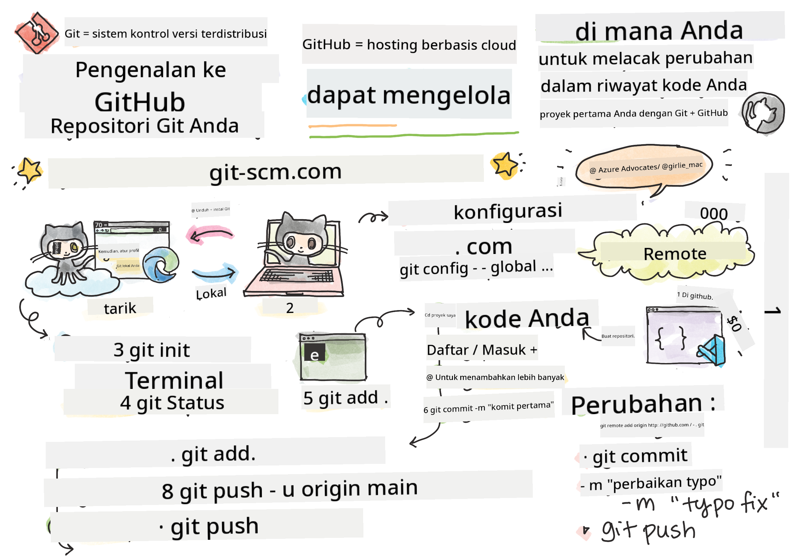
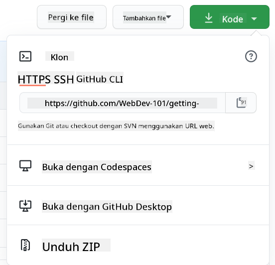

<!--
CO_OP_TRANSLATOR_METADATA:
{
  "original_hash": "ea65b75e488aa33a3cc5cb1c6c3f047a",
  "translation_date": "2025-10-03T14:06:35+00:00",
  "source_file": "1-getting-started-lessons/2-github-basics/README.md",
  "language_code": "id"
}
-->
# Pengantar GitHub

Pelajaran ini membahas dasar-dasar GitHub, sebuah platform untuk menyimpan dan mengelola perubahan pada kode Anda.


> Sketchnote oleh [Tomomi Imura](https://twitter.com/girlie_mac)

## Kuis Pra-Pelajaran
[Kuis pra-pelajaran](https://ff-quizzes.netlify.app)

## Pengantar

Dalam pelajaran ini, kita akan membahas:

- melacak pekerjaan yang Anda lakukan di komputer Anda
- bekerja pada proyek bersama orang lain
- cara berkontribusi pada perangkat lunak open source

### Prasyarat

Sebelum memulai, Anda perlu memeriksa apakah Git sudah terinstal. Di terminal, ketik: 
`git --version`

Jika Git belum terinstal, [unduh Git](https://git-scm.com/downloads). Kemudian, atur profil Git lokal Anda di terminal:
* `git config --global user.name "nama-anda"`
* `git config --global user.email "email-anda"`

Untuk memeriksa apakah Git sudah dikonfigurasi, Anda dapat mengetik:
`git config --list`

Anda juga memerlukan akun GitHub, editor kode (seperti Visual Studio Code), dan Anda perlu membuka terminal Anda (atau: command prompt).

Navigasikan ke [github.com](https://github.com/) dan buat akun jika Anda belum memilikinya, atau masuk dan lengkapi profil Anda.

✅ GitHub bukan satu-satunya repositori kode di dunia; ada yang lain, tetapi GitHub adalah yang paling dikenal.

### Persiapan

Anda memerlukan folder dengan proyek kode di komputer lokal Anda (laptop atau PC), dan repositori publik di GitHub, yang akan menjadi contoh bagaimana berkontribusi pada proyek orang lain.

---

## Manajemen Kode

Misalkan Anda memiliki folder lokal dengan proyek kode dan Anda ingin mulai melacak kemajuan Anda menggunakan git - sistem kontrol versi. Beberapa orang membandingkan menggunakan git dengan menulis surat cinta untuk diri Anda di masa depan. Membaca pesan commit Anda beberapa hari, minggu, atau bulan kemudian, Anda akan dapat mengingat mengapa Anda membuat keputusan, atau "mengembalikan" perubahan - yaitu, ketika Anda menulis pesan commit yang baik.

### Tugas: Membuat repositori dan commit kode  

> Tonton video
> 
> [](https://www.youtube.com/watch?v=9R31OUPpxU4)

1. **Buat repositori di GitHub**. Di GitHub.com, di tab repositori, atau dari bilah navigasi kanan atas, temukan tombol **new repo**.

   1. Beri nama repositori (folder) Anda
   1. Pilih **create repository**.

1. **Navigasikan ke folder kerja Anda**. Di terminal Anda, beralih ke folder (juga dikenal sebagai direktori) yang ingin Anda mulai lacak. Ketik:

   ```bash
   cd [name of your folder]
   ```

1. **Inisialisasi repositori git**. Di proyek Anda, ketik:

   ```bash
   git init
   ```

1. **Periksa status**. Untuk memeriksa status repositori Anda, ketik:

   ```bash
   git status
   ```

   outputnya bisa terlihat seperti ini:

   ```output
   Changes not staged for commit:
   (use "git add <file>..." to update what will be committed)
   (use "git checkout -- <file>..." to discard changes in working directory)

        modified:   file.txt
        modified:   file2.txt
   ```

   Biasanya perintah `git status` memberi tahu Anda hal-hal seperti file apa yang siap untuk _disimpan_ ke repo atau memiliki perubahan yang mungkin ingin Anda pertahankan.

1. **Tambahkan semua file untuk dilacak**
   Ini juga disebut sebagai staging file/menambahkan file ke area staging.

   ```bash
   git add .
   ```

   Argumen `git add` ditambah `.` menunjukkan bahwa semua file & perubahan Anda untuk dilacak.

1. **Tambahkan file tertentu untuk dilacak**

   ```bash
   git add [file or folder name]
   ```

   Ini membantu kita menambahkan hanya file tertentu ke area staging ketika kita tidak ingin commit semua file sekaligus.

1. **Batalkan staging semua file**

   ```bash
   git reset
   ```

   Perintah ini membantu kita membatalkan staging semua file sekaligus.

1. **Batalkan staging file tertentu**

   ```bash
   git reset [file or folder name]
   ```

   Perintah ini membantu kita membatalkan staging hanya file tertentu sekaligus yang tidak ingin kita sertakan untuk commit berikutnya.

1. **Menyimpan pekerjaan Anda**. Pada titik ini Anda telah menambahkan file ke area yang disebut _staging area_. Tempat di mana Git melacak file Anda. Untuk membuat perubahan permanen, Anda perlu _commit_ file tersebut. Untuk melakukannya, Anda membuat _commit_ dengan perintah `git commit`. Sebuah _commit_ mewakili titik penyimpanan dalam sejarah repo Anda. Ketik berikut ini untuk membuat _commit_:

   ```bash
   git commit -m "first commit"
   ```

   Ini melakukan commit semua file Anda, menambahkan pesan "first commit". Untuk pesan commit di masa depan, Anda akan ingin lebih deskriptif dalam deskripsi Anda untuk menyampaikan jenis perubahan yang telah Anda buat.

1. **Hubungkan repo Git lokal Anda dengan GitHub**. Repo Git bagus di komputer Anda, tetapi pada suatu saat Anda ingin memiliki cadangan file Anda di suatu tempat dan juga mengundang orang lain untuk bekerja dengan Anda di repo Anda. Salah satu tempat yang bagus untuk melakukannya adalah GitHub. Ingat kita sudah membuat repo di GitHub, jadi satu-satunya hal yang perlu kita lakukan adalah menghubungkan repo Git lokal kita dengan GitHub. Perintah `git remote add` akan melakukan hal itu. Ketik perintah berikut:

   > Catatan, sebelum Anda mengetik perintah, pergi ke halaman repo GitHub Anda untuk menemukan URL repositori. Anda akan menggunakannya dalam perintah di bawah ini. Ganti ```https://github.com/username/repository_name.git``` dengan URL GitHub Anda.

   ```bash
   git remote add origin https://github.com/username/repository_name.git
   ```

   Ini membuat _remote_, atau koneksi, bernama "origin" yang menunjuk ke repositori GitHub yang Anda buat sebelumnya.

1. **Kirim file lokal ke GitHub**. Sejauh ini Anda telah membuat _connection_ antara repo lokal dan repo GitHub. Mari kirim file ini ke GitHub dengan perintah berikut `git push`, seperti ini: 
   
   > Catatan, nama branch Anda mungkin berbeda secara default dari ```main```.

   ```bash
   git push -u origin main
   ```

   Ini mengirimkan commit Anda di branch "main" ke GitHub. Menetapkan branch `upstream` termasuk `-u` dalam perintah membangun tautan antara branch lokal Anda dan branch remote, sehingga Anda dapat menggunakan git push atau git pull tanpa menentukan nama branch di masa depan. Git akan secara otomatis menggunakan branch upstream dan Anda tidak perlu menentukan nama branch secara eksplisit dalam perintah di masa depan.

2. **Untuk menambahkan lebih banyak perubahan**. Jika Anda ingin terus membuat perubahan dan mengirimkannya ke GitHub, Anda hanya perlu menggunakan tiga perintah berikut:

   ```bash
   git add .
   git commit -m "type your commit message here"
   git push
   ```

   > Tip, Anda mungkin juga ingin mengadopsi file `.gitignore` untuk mencegah file yang tidak ingin Anda lacak muncul di GitHub - seperti file catatan yang Anda simpan di folder yang sama tetapi tidak memiliki tempat di repositori publik. Anda dapat menemukan template untuk file `.gitignore` di [.gitignore templates](https://github.com/github/gitignore).

#### Pesan Commit

Baris subjek commit Git yang hebat melengkapi kalimat berikut:
Jika diterapkan, commit ini akan <baris subjek Anda di sini>

Untuk subjek, gunakan bentuk imperatif, waktu sekarang: "ubah" bukan "diubah" atau "mengubah". 
Seperti dalam subjek, di badan (opsional) juga gunakan bentuk imperatif, waktu sekarang. Badan harus mencakup motivasi untuk perubahan dan membandingkan ini dengan perilaku sebelumnya. Anda menjelaskan `mengapa`, bukan `bagaimana`.

✅ Luangkan beberapa menit untuk menjelajahi GitHub. Bisakah Anda menemukan pesan commit yang benar-benar bagus? Bisakah Anda menemukan yang sangat minimal? Informasi apa yang menurut Anda paling penting dan berguna untuk disampaikan dalam pesan commit?

### Tugas: Berkolaborasi

Alasan utama untuk meletakkan sesuatu di GitHub adalah untuk memungkinkan kolaborasi dengan pengembang lain.

## Bekerja pada proyek bersama orang lain

> Tonton video
>
> [](https://www.youtube.com/watch?v=bFCM-PC3cu8)

Di repositori Anda, navigasikan ke `Insights > Community` untuk melihat bagaimana proyek Anda dibandingkan dengan standar komunitas yang direkomendasikan.

   Berikut adalah beberapa hal yang dapat meningkatkan repo GitHub Anda:
   - **Deskripsi**. Apakah Anda menambahkan deskripsi untuk proyek Anda?
   - **README**. Apakah Anda menambahkan README? GitHub menyediakan panduan untuk menulis [README](https://docs.github.com/articles/about-readmes/?WT.mc_id=academic-77807-sagibbon).
   - **Panduan kontribusi**. Apakah proyek Anda memiliki [panduan kontribusi](https://docs.github.com/articles/setting-guidelines-for-repository-contributors/?WT.mc_id=academic-77807-sagibbon), 
   - **Kode Etik**. sebuah [Kode Etik](https://docs.github.com/articles/adding-a-code-of-conduct-to-your-project/), 
   - **Lisensi**. Mungkin yang paling penting, sebuah [lisensi](https://docs.github.com/articles/adding-a-license-to-a-repository/)?


Semua sumber daya ini akan bermanfaat untuk onboarding anggota tim baru. Dan hal-hal tersebut biasanya adalah hal yang dilihat oleh kontributor baru sebelum bahkan melihat kode Anda, untuk mengetahui apakah proyek Anda adalah tempat yang tepat bagi mereka untuk menghabiskan waktu mereka.

✅ File README, meskipun membutuhkan waktu untuk disiapkan, sering diabaikan oleh pemelihara yang sibuk. Bisakah Anda menemukan contoh yang sangat deskriptif? Catatan: ada beberapa [alat untuk membantu membuat README yang baik](https://www.makeareadme.com/) yang mungkin ingin Anda coba.

### Tugas: Gabungkan kode

Dokumen kontribusi membantu orang berkontribusi pada proyek. Ini menjelaskan jenis kontribusi apa yang Anda cari dan bagaimana prosesnya bekerja. Kontributor perlu melalui serangkaian langkah untuk dapat berkontribusi pada repo Anda di GitHub:

1. **Forking repo Anda** Anda mungkin ingin orang-orang _fork_ proyek Anda. Forking berarti membuat replika repositori Anda di profil GitHub mereka.
1. **Clone**. Dari sana mereka akan meng-clone proyek ke komputer lokal mereka. 
1. **Buat branch**. Anda akan ingin meminta mereka untuk membuat _branch_ untuk pekerjaan mereka. 
1. **Fokuskan perubahan mereka pada satu area**. Minta kontributor untuk memusatkan kontribusi mereka pada satu hal pada satu waktu - dengan cara itu peluang bahwa Anda dapat _merge_ pekerjaan mereka lebih tinggi. Bayangkan mereka menulis perbaikan bug, menambahkan fitur baru, dan memperbarui beberapa tes - bagaimana jika Anda ingin, atau hanya dapat mengimplementasikan 2 dari 3, atau 1 dari 3 perubahan?

✅ Bayangkan situasi di mana branch sangat penting untuk menulis dan mengirimkan kode yang baik. Kasus penggunaan apa yang dapat Anda pikirkan?

> Catatan, jadilah perubahan yang ingin Anda lihat di dunia, dan buat branch untuk pekerjaan Anda sendiri juga. Setiap commit yang Anda buat akan dibuat di branch yang saat ini Anda "checkout". Gunakan `git status` untuk melihat branch mana itu.

Mari kita melalui alur kerja kontributor. Anggaplah kontributor sudah _forked_ dan _cloned_ repo sehingga mereka memiliki repo Git yang siap untuk dikerjakan, di komputer lokal mereka:

1. **Buat branch**. Gunakan perintah `git branch` untuk membuat branch yang akan berisi perubahan yang mereka maksudkan untuk berkontribusi:

   ```bash
   git branch [branch-name]
   ```

1. **Beralih ke branch kerja**. Beralih ke branch yang ditentukan dan perbarui direktori kerja dengan `git switch`:

   ```bash
   git switch [branch-name]
   ```

1. **Lakukan pekerjaan**. Pada titik ini Anda ingin menambahkan perubahan Anda. Jangan lupa untuk memberi tahu Git tentang hal itu dengan perintah berikut:

   ```bash
   git add .
   git commit -m "my changes"
   ```

   Pastikan Anda memberikan nama commit yang baik, untuk kepentingan Anda serta pemelihara repo yang Anda bantu.

1. **Gabungkan pekerjaan Anda dengan branch `main`**. Pada suatu saat Anda selesai bekerja dan Anda ingin menggabungkan pekerjaan Anda dengan branch `main`. Branch `main` mungkin telah berubah sementara itu, jadi pastikan Anda terlebih dahulu memperbaruinya ke yang terbaru dengan perintah berikut:

   ```bash
   git switch main
   git pull
   ```

   Pada titik ini Anda ingin memastikan bahwa setiap _conflicts_, situasi di mana Git tidak dapat dengan mudah _menggabungkan_ perubahan terjadi di branch kerja Anda. Oleh karena itu jalankan perintah berikut:

   ```bash
   git switch [branch_name]
   git merge main
   ```

   Perintah `git merge main` akan membawa semua perubahan dari `main` ke branch Anda. Semoga Anda bisa langsung melanjutkan. Jika tidak, VS Code akan memberi tahu Anda di mana Git _bingung_ dan Anda hanya perlu mengubah file yang terpengaruh untuk mengatakan konten mana yang paling akurat.

   Untuk beralih ke branch yang berbeda, gunakan perintah modern `git switch`:
   ```bash
   git switch [branch_name]

1. **Kirim pekerjaan Anda ke GitHub**. Mengirim pekerjaan Anda ke GitHub berarti dua hal. Mendorong branch Anda ke repo Anda dan kemudian membuka PR, Pull Request.

   ```bash
   git push --set-upstream origin [branch-name]
   ```

   Perintah di atas membuat branch di repo yang telah Anda fork.
1. **Buka PR**. Selanjutnya, Anda ingin membuka PR. Caranya adalah dengan membuka repo forked di GitHub. Anda akan melihat indikasi di GitHub yang menanyakan apakah Anda ingin membuat PR baru, klik itu dan Anda akan diarahkan ke antarmuka di mana Anda dapat mengubah judul pesan commit, memberikan deskripsi yang lebih sesuai. Sekarang, pemilik repo yang Anda fork akan melihat PR ini dan _semoga_ mereka menghargai dan _menggabungkan_ PR Anda. Selamat, Anda sekarang menjadi kontributor, yay :)

1. **Bersihkan**. Merupakan praktik yang baik untuk _membersihkan_ setelah Anda berhasil menggabungkan PR. Anda perlu membersihkan cabang lokal Anda dan cabang yang Anda dorong ke GitHub. Pertama, hapus cabang lokal dengan perintah berikut:

   ```bash
   git branch -d [branch-name]
   ```

   Pastikan Anda pergi ke halaman GitHub untuk repo forked dan hapus cabang remote yang baru saja Anda dorong ke sana.

`Pull request` mungkin terdengar seperti istilah yang aneh karena sebenarnya Anda ingin mendorong perubahan Anda ke proyek. Namun, pemilik proyek atau tim inti perlu mempertimbangkan perubahan Anda sebelum menggabungkannya dengan cabang "utama" proyek, jadi Anda sebenarnya meminta keputusan perubahan dari pemilik proyek.  

Pull request adalah tempat untuk membandingkan dan mendiskusikan perbedaan yang diperkenalkan pada cabang dengan ulasan, komentar, pengujian terintegrasi, dan lainnya. Pull request yang baik mengikuti aturan yang kurang lebih sama seperti pesan commit. Anda dapat menambahkan referensi ke sebuah isu di pelacak isu, misalnya ketika pekerjaan Anda memperbaiki sebuah isu. Ini dilakukan dengan menggunakan `#` diikuti oleh nomor isu Anda. Contohnya `#97`.

🤞Semoga semua pemeriksaan berhasil dan pemilik proyek menggabungkan perubahan Anda ke dalam proyek🤞

Perbarui cabang kerja lokal Anda saat ini dengan semua commit baru dari cabang remote yang sesuai di GitHub:

`git pull`

## Cara berkontribusi ke open source

Pertama, mari kita cari repositori (atau **repo**) di GitHub yang menarik bagi Anda dan ingin Anda kontribusikan perubahan. Anda perlu menyalin kontennya ke komputer Anda.

✅ Cara yang baik untuk menemukan repo yang 'ramah pemula' adalah dengan [mencari menggunakan tag 'good-first-issue'](https://github.blog/2020-01-22-browse-good-first-issues-to-start-contributing-to-open-source/).



Ada beberapa cara untuk menyalin kode. Salah satu caranya adalah dengan "mengkloning" konten repositori, menggunakan HTTPS, SSH, atau menggunakan GitHub CLI (Command Line Interface). 

Buka terminal Anda dan kloning repositori seperti ini:
`git clone https://github.com/ProjectURL`

Untuk bekerja pada proyek, pindah ke folder yang sesuai:
`cd ProjectURL`

Anda juga dapat membuka seluruh proyek menggunakan [Codespaces](https://github.com/features/codespaces), editor kode terintegrasi / lingkungan pengembangan cloud dari GitHub, atau [GitHub Desktop](https://desktop.github.com/).

Terakhir, Anda dapat mengunduh kode dalam folder yang dikompresi (zip).

### Beberapa hal menarik tentang GitHub

Anda dapat memberi bintang, mengikuti, dan/atau "fork" repositori publik mana pun di GitHub. Anda dapat menemukan repositori yang Anda beri bintang di menu drop-down kanan atas. Ini seperti menandai halaman, tetapi untuk kode.

Proyek memiliki pelacak isu, biasanya di GitHub pada tab "Issues" kecuali dinyatakan lain, tempat orang-orang mendiskusikan masalah terkait proyek. Dan tab Pull Requests adalah tempat orang-orang mendiskusikan dan meninjau perubahan yang sedang berlangsung.

Proyek juga mungkin memiliki diskusi di forum, milis, atau saluran obrolan seperti Slack, Discord, atau IRC.

✅ Jelajahi repo GitHub baru Anda dan coba beberapa hal, seperti mengedit pengaturan, menambahkan informasi ke repo Anda, dan membuat proyek (seperti papan Kanban). Ada banyak hal yang bisa Anda lakukan!

---

## 🚀 Tantangan 

Bekerja sama dengan teman untuk mengerjakan kode satu sama lain. Buat proyek secara kolaboratif, fork kode, buat cabang, dan gabungkan perubahan.

## Kuis Pasca-Kuliah
[Kuis pasca-kuliah](https://ff-quizzes.netlify.app/web/en/)

## Tinjauan & Belajar Mandiri

Baca lebih lanjut tentang [berkontribusi pada perangkat lunak open source](https://opensource.guide/how-to-contribute/#how-to-submit-a-contribution). 

[Git cheatsheet](https://training.github.com/downloads/github-git-cheat-sheet/).

Latihan, latihan, latihan. GitHub memiliki jalur pembelajaran yang hebat yang tersedia melalui [skills.github.com](https://skills.github.com):

- [Minggu Pertama di GitHub](https://skills.github.com/#first-week-on-github)

Anda juga akan menemukan kursus yang lebih lanjut.

## Tugas 

Selesaikan [kursus Minggu Pertama di GitHub](https://skills.github.com/#first-week-on-github)

---

**Penafian**:  
Dokumen ini telah diterjemahkan menggunakan layanan penerjemahan AI [Co-op Translator](https://github.com/Azure/co-op-translator). Meskipun kami berupaya untuk memberikan hasil yang akurat, harap diketahui bahwa terjemahan otomatis mungkin mengandung kesalahan atau ketidakakuratan. Dokumen asli dalam bahasa aslinya harus dianggap sebagai sumber yang otoritatif. Untuk informasi yang bersifat kritis, disarankan menggunakan jasa penerjemahan manusia profesional. Kami tidak bertanggung jawab atas kesalahpahaman atau penafsiran yang keliru yang timbul dari penggunaan terjemahan ini.