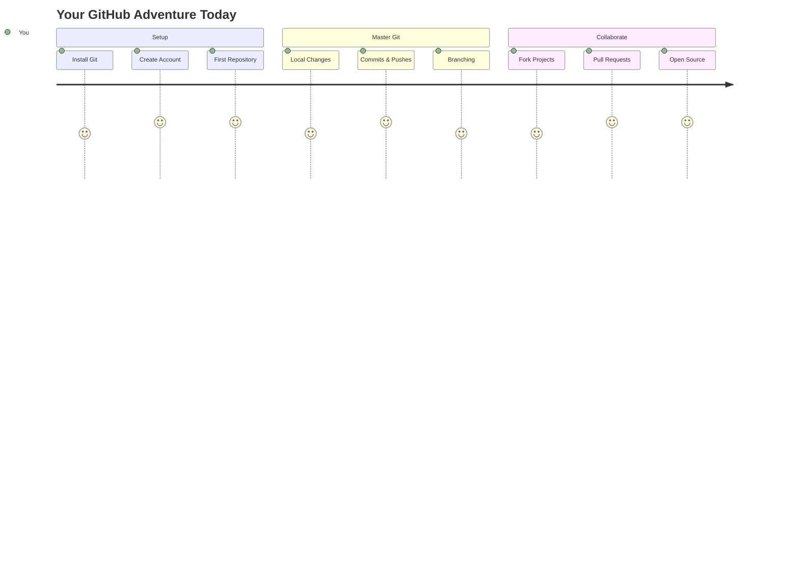
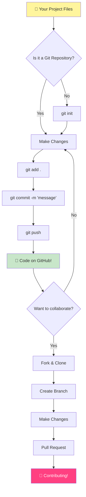
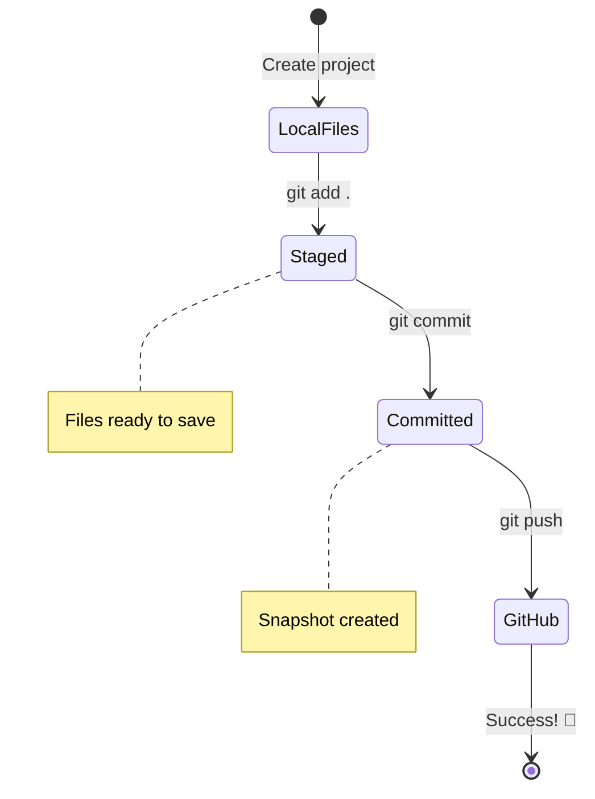
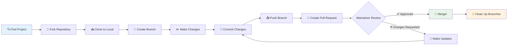
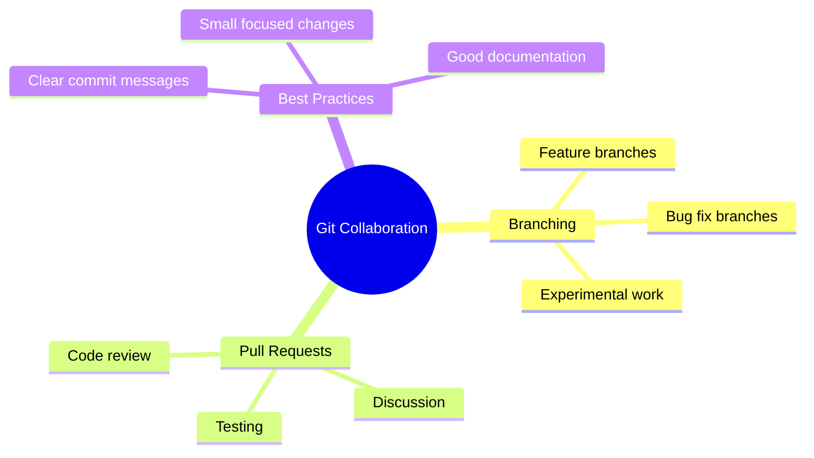
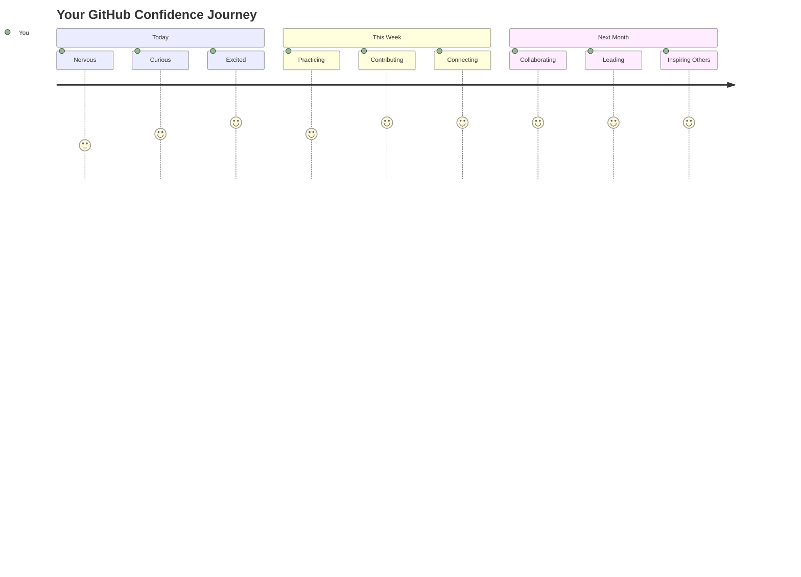

<!--
CO_OP_TRANSLATOR_METADATA:
{
  "original_hash": "5c383cc2cc23bb164b06417d1c107a44",
  "translation_date": "2025-11-18T18:39:36+00:00",
  "source_file": "1-getting-started-lessons/2-github-basics/README.md",
  "language_code": "id"
}
-->
# Pengantar GitHub

Hai, calon pengembang! 👋 Siap bergabung dengan jutaan coder di seluruh dunia? Saya sangat antusias memperkenalkan Anda pada GitHub – anggap saja seperti media sosial untuk programmer, tapi alih-alih berbagi foto makan siang, kita berbagi kode dan membangun hal-hal luar biasa bersama!

Yang benar-benar membuat saya kagum: setiap aplikasi di ponsel Anda, setiap situs web yang Anda kunjungi, dan sebagian besar alat yang akan Anda pelajari dibuat oleh tim pengembang yang berkolaborasi di platform seperti GitHub. Aplikasi musik yang Anda sukai? Seseorang seperti Anda berkontribusi padanya. Game yang tidak bisa Anda tinggalkan? Ya, mungkin dibangun dengan kolaborasi GitHub. Dan sekarang ANDA akan belajar bagaimana menjadi bagian dari komunitas luar biasa itu!

Saya tahu ini mungkin terasa banyak pada awalnya – saya ingat saat pertama kali melihat halaman GitHub saya dan berpikir "Apa maksud semua ini?" Tapi begini: setiap pengembang memulai persis di tempat Anda berada sekarang. Pada akhir pelajaran ini, Anda akan memiliki repositori GitHub Anda sendiri (anggap saja sebagai etalase proyek pribadi Anda di cloud), dan Anda akan tahu cara menyimpan pekerjaan Anda, membagikannya dengan orang lain, dan bahkan berkontribusi pada proyek yang digunakan jutaan orang.

Kita akan menjalani perjalanan ini bersama, langkah demi langkah. Tidak perlu terburu-buru, tidak ada tekanan – hanya Anda, saya, dan beberapa alat keren yang akan menjadi sahabat baru Anda!


> Sketchnote oleh [Tomomi Imura](https://twitter.com/girlie_mac)



## Kuis Pra-Pelajaran
[Kuis pra-pelajaran](https://ff-quizzes.netlify.app)

## Pengantar

Sebelum kita masuk ke hal-hal yang benar-benar menarik, mari siapkan komputer Anda untuk keajaiban GitHub! Anggap ini seperti mengatur perlengkapan seni Anda sebelum membuat mahakarya – memiliki alat yang tepat membuat segalanya lebih lancar dan jauh lebih menyenangkan.

Saya akan memandu Anda melalui setiap langkah pengaturan secara pribadi, dan saya janji ini tidak sesulit yang terlihat pada pandangan pertama. Jika ada yang tidak langsung klik, itu sangat normal! Saya ingat saat pertama kali mengatur lingkungan pengembangan saya dan merasa seperti mencoba membaca hieroglif kuno. Setiap pengembang pernah berada di tempat Anda sekarang, bertanya-tanya apakah mereka melakukannya dengan benar. Spoiler: jika Anda di sini belajar, Anda sudah melakukannya dengan benar! 🌟

Dalam pelajaran ini, kita akan membahas:

- melacak pekerjaan yang Anda lakukan di komputer Anda
- bekerja pada proyek bersama orang lain
- cara berkontribusi pada perangkat lunak open source

### Prasyarat

Mari siapkan komputer Anda untuk keajaiban GitHub! Jangan khawatir – pengaturan ini hanya perlu dilakukan sekali, dan setelah itu Anda siap untuk seluruh perjalanan coding Anda.

Baiklah, mari kita mulai dengan dasar-dasarnya! Pertama, kita perlu memeriksa apakah Git sudah ada di komputer Anda. Git pada dasarnya seperti memiliki asisten super pintar yang mengingat setiap perubahan yang Anda buat pada kode Anda – jauh lebih baik daripada panik menekan Ctrl+S setiap dua detik (kita semua pernah melakukannya!).

Mari kita lihat apakah Git sudah terinstal dengan mengetikkan perintah ajaib ini di terminal Anda:
`git --version`

Jika Git belum ada, tidak masalah! Cukup kunjungi [download Git](https://git-scm.com/downloads) dan unduh. Setelah Anda menginstalnya, kita perlu memperkenalkan Git kepada Anda dengan benar:

> 💡 **Pengaturan Pertama Kali**: Perintah ini memberi tahu Git siapa Anda. Informasi ini akan dilampirkan pada setiap commit yang Anda buat, jadi pilih nama dan email yang nyaman untuk dibagikan secara publik.

```bash
git config --global user.name "your-name"
git config --global user.email "your-email"
```

Untuk memeriksa apakah Git sudah dikonfigurasi, Anda dapat mengetik:
```bash
git config --list
```

Anda juga memerlukan akun GitHub, editor kode (seperti Visual Studio Code), dan Anda perlu membuka terminal Anda (atau: command prompt).

Navigasikan ke [github.com](https://github.com/) dan buat akun jika Anda belum memilikinya, atau masuk dan lengkapi profil Anda.

💡 **Tip Modern**: Pertimbangkan untuk mengatur [SSH keys](https://docs.github.com/en/authentication/connecting-to-github-with-ssh) atau menggunakan [GitHub CLI](https://cli.github.com/) untuk autentikasi yang lebih mudah tanpa kata sandi.

✅ GitHub bukan satu-satunya repositori kode di dunia; ada yang lain, tetapi GitHub adalah yang paling dikenal.

### Persiapan

Anda akan membutuhkan folder dengan proyek kode di komputer lokal Anda (laptop atau PC), dan repositori publik di GitHub, yang akan menjadi contoh bagaimana berkontribusi pada proyek orang lain.

### Menjaga Kode Anda Tetap Aman

Mari kita bicara tentang keamanan sebentar – tapi jangan khawatir, kita tidak akan membanjiri Anda dengan hal-hal yang menakutkan! Anggap praktik keamanan ini seperti mengunci mobil atau rumah Anda. Ini adalah kebiasaan sederhana yang menjadi kebiasaan dan menjaga kerja keras Anda tetap terlindungi.

Kami akan menunjukkan cara modern dan aman untuk bekerja dengan GitHub sejak awal. Dengan cara ini, Anda akan mengembangkan kebiasaan baik yang akan berguna sepanjang karier coding Anda.

Saat bekerja dengan GitHub, penting untuk mengikuti praktik keamanan terbaik:

| Area Keamanan | Praktik Terbaik | Mengapa Penting |
|---------------|-----------------|-----------------|
| **Autentikasi** | Gunakan SSH keys atau Personal Access Tokens | Kata sandi kurang aman dan mulai ditinggalkan |
| **Autentikasi Dua Faktor** | Aktifkan 2FA di akun GitHub Anda | Menambahkan lapisan perlindungan ekstra pada akun Anda |
| **Keamanan Repositori** | Jangan pernah commit informasi sensitif | API keys dan kata sandi tidak boleh ada di repositori publik |
| **Manajemen Dependensi** | Aktifkan Dependabot untuk pembaruan | Menjaga dependensi Anda tetap aman dan terkini |

> ⚠️ **Pengingat Keamanan Penting**: Jangan pernah commit API keys, kata sandi, atau informasi sensitif lainnya ke repositori mana pun. Gunakan variabel lingkungan dan file `.gitignore` untuk melindungi data sensitif.

**Pengaturan Autentikasi Modern:**

```bash
# Generate SSH key (modern ed25519 algorithm)
ssh-keygen -t ed25519 -C "your_email@example.com"

# Set up Git to use SSH
git remote set-url origin git@github.com:username/repository.git
```

> 💡 **Tip Pro**: SSH keys menghilangkan kebutuhan untuk memasukkan kata sandi berulang kali dan lebih aman daripada metode autentikasi tradisional.

---

## Mengelola Kode Anda Seperti Profesional

Oke, INI adalah bagian yang benar-benar menarik! 🎉 Kita akan belajar bagaimana melacak dan mengelola kode Anda seperti para profesional, dan jujur saja, ini adalah salah satu hal favorit saya untuk diajarkan karena ini benar-benar mengubah permainan.

Bayangkan ini: Anda sedang menulis cerita yang luar biasa, dan Anda ingin melacak setiap draf, setiap edit brilian, dan setiap momen "tunggu, itu jenius!" sepanjang jalan. Itulah yang dilakukan Git untuk kode Anda! Ini seperti memiliki buku catatan perjalanan waktu yang luar biasa yang mengingat SEGALANYA – setiap ketikan, setiap perubahan, setiap momen "oops, itu merusak segalanya" yang dapat Anda batalkan seketika.

Saya akan jujur – ini mungkin terasa membingungkan pada awalnya. Ketika saya mulai, saya berpikir "Kenapa saya tidak bisa menyimpan file saya seperti biasa?" Tapi percayalah pada ini: begitu Git klik untuk Anda (dan itu akan!), Anda akan memiliki momen lampu yang membuat Anda berpikir "Bagaimana saya PERNAH coding tanpa ini?" Ini seperti menemukan Anda bisa terbang ketika Anda telah berjalan ke mana-mana sepanjang hidup Anda!

Misalnya, Anda memiliki folder lokal dengan proyek kode dan Anda ingin mulai melacak kemajuan Anda menggunakan git - sistem kontrol versi. Beberapa orang membandingkan menggunakan git dengan menulis surat cinta untuk diri Anda di masa depan. Membaca pesan commit Anda beberapa hari, minggu, atau bulan kemudian, Anda akan dapat mengingat mengapa Anda membuat keputusan, atau "rollback" perubahan – yaitu, ketika Anda menulis pesan "commit" yang baik.



### Tugas: Buat Repositori Pertama Anda!

> 🎯 **Misi Anda (dan saya sangat bersemangat untuk Anda!)**: Kita akan membuat repositori GitHub pertama Anda bersama-sama! Pada saat kita selesai di sini, Anda akan memiliki sudut kecil internet Anda sendiri tempat kode Anda tinggal, dan Anda akan membuat "commit" pertama Anda (itu istilah pengembang untuk menyimpan pekerjaan Anda dengan cara yang sangat cerdas).
>
> Ini benar-benar momen yang istimewa – Anda akan secara resmi bergabung dengan komunitas pengembang global! Saya masih ingat kegembiraan membuat repo pertama saya dan berpikir "Wow, saya benar-benar melakukannya!"

Mari kita jalani petualangan ini bersama, langkah demi langkah. Luangkan waktu Anda di setiap bagian – tidak ada hadiah untuk terburu-buru, dan saya janji setiap langkah akan masuk akal. Ingat, setiap bintang coding yang Anda kagumi pernah duduk persis di tempat Anda berada, akan membuat repositori pertama mereka. Betapa kerennya itu?

> Lihat video
> 
> [](https://www.youtube.com/watch?v=9R31OUPpxU4)

**Mari Lakukan Bersama:**

1. **Buat repositori Anda di GitHub**. Pergi ke GitHub.com dan cari tombol hijau cerah **New** (atau tanda **+** di sudut kanan atas). Klik dan pilih **New repository**.

   Berikut yang harus dilakukan:
   1. Beri nama repositori Anda – buat sesuatu yang berarti bagi Anda!
   1. Tambahkan deskripsi jika Anda mau (ini membantu orang lain memahami tentang apa proyek Anda)
   1. Tentukan apakah Anda ingin repositori itu publik (semua orang bisa melihatnya) atau privat (hanya untuk Anda)
   1. Saya sarankan mencentang kotak untuk menambahkan file README – ini seperti halaman depan proyek Anda
   1. Klik **Create repository** dan rayakan – Anda baru saja membuat repo pertama Anda! 🎉

2. **Navigasikan ke folder proyek Anda**. Sekarang mari kita buka terminal Anda (jangan khawatir, ini tidak seseram kelihatannya!). Kita perlu memberi tahu komputer Anda di mana file proyek Anda berada. Ketik perintah ini:

   ```bash
   cd [name of your folder]
   ```

   **Apa yang kita lakukan di sini:**
   - Kita pada dasarnya mengatakan "Hei komputer, bawa saya ke folder proyek saya"
   - Ini seperti membuka folder tertentu di desktop Anda, tetapi kita melakukannya dengan perintah teks
   - Ganti `[name of your folder]` dengan nama sebenarnya dari folder proyek Anda

3. **Ubah folder Anda menjadi repositori Git**. Di sinilah keajaiban terjadi! Ketik:

   ```bash
   git init
   ```

   **Inilah yang baru saja terjadi (hal yang cukup keren!):**
   - Git baru saja membuat folder tersembunyi `.git` di proyek Anda – Anda tidak akan melihatnya, tetapi itu ada!
   - Folder biasa Anda sekarang menjadi "repositori" yang dapat melacak setiap perubahan yang Anda buat
   - Anggap saja seperti memberi folder Anda kekuatan super untuk mengingat segalanya

4. **Periksa apa yang sedang terjadi**. Mari kita lihat apa yang Git pikirkan tentang proyek Anda saat ini:

   ```bash
   git status
   ```

   **Memahami apa yang Git katakan kepada Anda:**
   
   Anda mungkin melihat sesuatu yang terlihat seperti ini:

   ```output
   Changes not staged for commit:
   (use "git add <file>..." to update what will be committed)
   (use "git restore <file>..." to discard changes in working directory)

        modified:   file.txt
        modified:   file2.txt
   ```

   **Jangan panik! Inilah artinya:**
   - File dalam **merah** adalah file yang memiliki perubahan tetapi belum siap untuk disimpan
   - File dalam **hijau** (ketika Anda melihatnya) siap untuk disimpan
   - Git membantu dengan memberi tahu Anda persis apa yang bisa Anda lakukan selanjutnya

   > 💡 **Tip pro**: Perintah `git status` adalah sahabat Anda! Gunakan kapan saja Anda bingung tentang apa yang sedang terjadi. Ini seperti bertanya kepada Git "Hei, apa situasinya sekarang?"

5. **Siapkan file Anda untuk disimpan** (ini disebut "staging"):

   ```bash
   git add .
   ```

   **Apa yang baru saja kita lakukan:**
   - Kita memberi tahu Git "Hei, saya ingin menyertakan SEMUA file saya dalam penyimpanan berikutnya"
   - `.` seperti mengatakan "semua dalam folder ini"
   - Sekarang file Anda "staged" dan siap untuk langkah berikutnya

   **Ingin lebih selektif?** Anda bisa menambahkan hanya file tertentu:

   ```bash
   git add [file or folder name]
   ```

   **Mengapa Anda mungkin ingin melakukan ini?**
   - Kadang-kadang Anda ingin menyimpan perubahan terkait bersama-sama
   - Ini membantu Anda mengatur pekerjaan Anda ke dalam bagian logis
   - Membuatnya lebih mudah untuk memahami apa yang berubah dan kapan

   **Berubah pikiran?** Tidak masalah! Anda bisa menghapus file dari tahap seperti ini:

   ```bash
   # Unstage everything
   git reset
   
   # Unstage just one file
   git reset [file name]
   ```

   Jangan khawatir – ini tidak menghapus pekerjaan Anda, hanya mengeluarkan file dari "siap untuk disimpan".

6. **Simpan pekerjaan Anda secara permanen** (membuat commit pertama Anda!):

   ```bash
   git commit -m "first commit"
   ```

   **🎉 Selamat! Anda baru saja membuat commit pertama Anda!**
   
   **Inilah yang baru saja terjadi:**
   - Git mengambil "snapshot" dari semua file yang telah Anda stage pada saat ini
   - Pesan commit Anda "first commit" menjelaskan tentang apa titik penyimpanan ini
   - Git memberikan snapshot ini ID unik sehingga Anda selalu bisa menemukannya nanti
   - Anda secara resmi mulai melacak sejarah proyek Anda!

   > 💡 **Pesan commit di masa depan**: Untuk commit berikutnya, jadilah lebih deskriptif! Alih-alih "updated stuff", coba "Tambahkan formulir kontak ke halaman utama" atau "Perbaiki bug menu navigasi". Diri Anda di masa depan akan berterima kasih!

7. **Hubungkan proyek lokal Anda ke GitHub**. Saat ini, proyek Anda hanya ada di komputer Anda. Mari kita hubungkan ke repositori GitHub Anda sehingga Anda bisa membagikannya dengan dunia!

   Pertama, pergi ke halaman repositori GitHub Anda dan salin URL-nya. Lalu kembali ke sini dan ketik:

   ```bash
   git remote add origin https://github.com/username/repository_name.git
   ```
   
   (Ganti URL itu dengan URL repositori Anda yang sebenarnya!)

   **Apa yang baru saja kita lakukan:**
   - Kami telah membuat koneksi antara proyek lokal Anda dan repositori GitHub Anda
   - "Origin" hanyalah nama panggilan untuk repositori GitHub Anda – seperti menambahkan kontak ke ponsel Anda
   - Sekarang Git lokal Anda tahu ke mana harus mengirim kode Anda saat Anda siap membagikannya

   💡 **Cara lebih mudah**: Jika Anda memiliki GitHub CLI terinstal, Anda dapat melakukannya dengan satu perintah:
   ```bash
   gh repo create my-repo --public --push --source=.
   ```

8. **Kirim kode Anda ke GitHub** (momen besar!):

   ```bash
   git push -u origin main
   ```

   **🚀 Ini dia! Anda sedang mengunggah kode Anda ke GitHub!**
   
   **Apa yang sedang terjadi:**
   - Komit Anda sedang dikirim dari komputer Anda ke GitHub
   - Flag `-u` membuat koneksi permanen sehingga pengiriman berikutnya lebih mudah
   - "main" adalah nama cabang utama Anda (seperti folder utama)
   - Setelah ini, Anda hanya perlu mengetik `git push` untuk pengunggahan berikutnya!

   💡 **Catatan cepat**: Jika cabang Anda memiliki nama lain (seperti "master"), gunakan nama tersebut. Anda dapat memeriksanya dengan `git branch --show-current`.

9. **Ritme coding harian baru Anda** (di sinilah semuanya menjadi adiktif!):

   Mulai sekarang, setiap kali Anda membuat perubahan pada proyek Anda, Anda memiliki tiga langkah sederhana ini:

   ```bash
   git add .
   git commit -m "describe what you changed"
   git push
   ```

   **Ini menjadi detak jantung coding Anda:**
   - Buat beberapa perubahan keren pada kode Anda ✨
   - Stage perubahan dengan `git add` ("Hei Git, perhatikan perubahan ini!")
   - Simpan dengan `git commit` dan pesan deskriptif (masa depan Anda akan berterima kasih!)
   - Bagikan ke dunia menggunakan `git push` 🚀
   - Ulangi terus – serius, ini menjadi sealamiah bernapas!

   Saya suka alur kerja ini karena seperti memiliki beberapa titik penyimpanan dalam permainan video. Membuat perubahan yang Anda sukai? Komit! Ingin mencoba sesuatu yang berisiko? Tidak masalah – Anda selalu dapat kembali ke komit terakhir jika ada masalah!

   > 💡 **Tip**: Anda mungkin juga ingin menggunakan file `.gitignore` untuk mencegah file yang tidak ingin Anda lacak muncul di GitHub - seperti file catatan yang Anda simpan di folder yang sama tetapi tidak cocok untuk repositori publik. Anda dapat menemukan template untuk file `.gitignore` di [.gitignore templates](https://github.com/github/gitignore) atau membuatnya menggunakan [gitignore.io](https://www.toptal.com/developers/gitignore).

### 🧠 **Check-in Repositori Pertama: Bagaimana Rasanya?**

**Luangkan waktu untuk merayakan dan merenung:**
- Bagaimana rasanya melihat kode Anda muncul di GitHub untuk pertama kalinya?
- Langkah mana yang terasa paling membingungkan, dan mana yang terasa mengejutkan mudah?
- Bisakah Anda menjelaskan perbedaan antara `git add`, `git commit`, dan `git push` dengan kata-kata Anda sendiri?



> **Ingat**: Bahkan pengembang berpengalaman kadang-kadang lupa perintah yang tepat. Membuat alur kerja ini menjadi memori otot membutuhkan latihan - Anda sudah melakukan yang hebat!

#### Alur Kerja Git Modern

Pertimbangkan untuk mengadopsi praktik modern ini:

- **Conventional Commits**: Gunakan format pesan komit yang standar seperti `feat:`, `fix:`, `docs:`, dll. Pelajari lebih lanjut di [conventionalcommits.org](https://www.conventionalcommits.org/)
- **Atomic commits**: Buat setiap komit mewakili satu perubahan logis
- **Frequent commits**: Komit sering dengan pesan deskriptif daripada komit besar yang jarang

#### Pesan Komit

Baris subjek pesan komit Git yang hebat melengkapi kalimat berikut:
Jika diterapkan, komit ini akan <baris subjek Anda di sini>

Untuk subjek gunakan bentuk imperatif, waktu sekarang: "ubah" bukan "diubah" atau "mengubah". 
Seperti pada subjek, di badan (opsional) juga gunakan bentuk imperatif, waktu sekarang. Badan harus mencakup motivasi untuk perubahan dan membandingkan ini dengan perilaku sebelumnya. Anda menjelaskan `mengapa`, bukan `bagaimana`.

✅ Luangkan beberapa menit untuk menjelajahi GitHub. Bisakah Anda menemukan pesan komit yang benar-benar hebat? Bisakah Anda menemukan yang sangat minimal? Informasi apa yang menurut Anda paling penting dan berguna untuk disampaikan dalam pesan komit?

## Bekerja dengan Orang Lain (Bagian yang Menyenangkan!)

Pegang topi Anda karena INI adalah saat GitHub menjadi benar-benar ajaib! 🪄 Anda telah menguasai pengelolaan kode Anda sendiri, tetapi sekarang kita akan menyelami bagian favorit saya – berkolaborasi dengan orang-orang luar biasa dari seluruh dunia.

Bayangkan ini: Anda bangun besok dan melihat seseorang di Tokyo meningkatkan kode Anda saat Anda tidur. Kemudian seseorang di Berlin memperbaiki bug yang Anda hadapi. Pada sore hari, seorang pengembang di São Paulo menambahkan fitur yang bahkan tidak pernah Anda pikirkan. Itu bukan fiksi ilmiah – itu hanya hari Selasa di dunia GitHub!

Yang membuat saya sangat bersemangat adalah keterampilan kolaborasi yang akan Anda pelajari? Ini adalah alur kerja YANG SAMA persis yang digunakan tim di Google, Microsoft, dan startup favorit Anda setiap hari. Anda tidak hanya belajar alat yang keren – Anda belajar bahasa rahasia yang membuat seluruh dunia perangkat lunak bekerja bersama. 

Serius, begitu Anda merasakan sensasi seseorang menggabungkan permintaan tarik pertama Anda, Anda akan mengerti mengapa pengembang sangat bersemangat tentang open source. Rasanya seperti menjadi bagian dari proyek tim terbesar dan paling kreatif di dunia!

> Tonton video
>
> [](https://www.youtube.com/watch?v=bFCM-PC3cu8)

Alasan utama untuk meletakkan sesuatu di GitHub adalah untuk memungkinkan kolaborasi dengan pengembang lain.



Di repositori Anda, navigasikan ke `Insights > Community` untuk melihat bagaimana proyek Anda dibandingkan dengan standar komunitas yang direkomendasikan.

Ingin membuat repositori Anda terlihat profesional dan ramah? Pergi ke repositori Anda dan klik `Insights > Community`. Fitur keren ini menunjukkan kepada Anda bagaimana proyek Anda dibandingkan dengan apa yang dianggap sebagai "praktik repositori yang baik" oleh komunitas GitHub.

> 🎯 **Membuat Proyek Anda Bersinar**: Repositori yang terorganisir dengan baik dan dokumentasi yang baik seperti memiliki etalase yang bersih dan ramah. Ini menunjukkan bahwa Anda peduli dengan pekerjaan Anda dan membuat orang lain ingin berkontribusi!

**Inilah yang membuat repositori luar biasa:**

| Apa yang Ditambahkan | Mengapa Penting | Apa yang Dilakukan untuk Anda |
|-----------------------|-----------------|-------------------------------|
| **Deskripsi** | Kesan pertama itu penting! | Orang tahu langsung apa yang dilakukan proyek Anda |
| **README** | Halaman depan proyek Anda | Seperti pemandu wisata ramah untuk pengunjung baru |
| **Panduan Kontribusi** | Menunjukkan Anda menyambut bantuan | Orang tahu persis bagaimana mereka dapat membantu Anda |
| **Kode Etik** | Menciptakan ruang yang ramah | Semua orang merasa diterima untuk berpartisipasi |
| **Lisensi** | Kejelasan hukum | Orang lain tahu bagaimana mereka dapat menggunakan kode Anda |
| **Kebijakan Keamanan** | Menunjukkan Anda bertanggung jawab | Menunjukkan praktik profesional |

> 💡 **Tip Pro**: GitHub menyediakan template untuk semua file ini. Saat membuat repositori baru, centang kotak untuk secara otomatis menghasilkan file-file ini.

**Fitur Modern GitHub untuk Dijelajahi:**

🤖 **Otomasi & CI/CD:**
- **GitHub Actions** untuk pengujian dan penerapan otomatis
- **Dependabot** untuk pembaruan dependensi otomatis

💬 **Komunitas & Manajemen Proyek:**
- **GitHub Discussions** untuk percakapan komunitas di luar masalah
- **GitHub Projects** untuk manajemen proyek gaya kanban
- **Aturan perlindungan cabang** untuk menegakkan standar kualitas kode

Semua sumber daya ini akan bermanfaat untuk onboarding anggota tim baru. Dan ini biasanya adalah hal-hal yang dilihat oleh kontributor baru sebelum bahkan melihat kode Anda, untuk mengetahui apakah proyek Anda adalah tempat yang tepat bagi mereka untuk menghabiskan waktu mereka.

✅ File README, meskipun membutuhkan waktu untuk disiapkan, sering diabaikan oleh pemelihara yang sibuk. Bisakah Anda menemukan contoh yang sangat deskriptif? Catatan: ada beberapa [alat untuk membantu membuat README yang baik](https://www.makeareadme.com/) yang mungkin ingin Anda coba.

### Tugas: Gabungkan beberapa kode

Dokumen kontribusi membantu orang berkontribusi pada proyek. Ini menjelaskan jenis kontribusi apa yang Anda cari dan bagaimana prosesnya bekerja. Kontributor perlu melalui serangkaian langkah untuk dapat berkontribusi pada repositori Anda di GitHub:

1. **Forking repositori Anda** Anda mungkin ingin orang-orang _fork_ proyek Anda. Forking berarti membuat replika repositori Anda di profil GitHub mereka.
1. **Clone**. Dari sana mereka akan mengkloning proyek ke mesin lokal mereka. 
1. **Buat cabang**. Anda akan ingin meminta mereka membuat _cabang_ untuk pekerjaan mereka. 
1. **Fokuskan perubahan mereka pada satu area**. Minta kontributor untuk memusatkan kontribusi mereka pada satu hal pada satu waktu - dengan cara itu peluang Anda untuk _menggabungkan_ pekerjaan mereka lebih tinggi. Bayangkan mereka menulis perbaikan bug, menambahkan fitur baru, dan memperbarui beberapa tes - bagaimana jika Anda ingin, atau hanya dapat menerapkan 2 dari 3, atau 1 dari 3 perubahan?

✅ Bayangkan situasi di mana cabang sangat penting untuk menulis dan mengirimkan kode yang baik. Kasus penggunaan apa yang dapat Anda pikirkan?

> Catatan, jadilah perubahan yang ingin Anda lihat di dunia, dan buat cabang untuk pekerjaan Anda sendiri juga. Komit apa pun yang Anda buat akan dibuat di cabang tempat Anda saat ini "checked out". Gunakan `git status` untuk melihat cabang mana itu.

Mari kita melalui alur kerja kontributor. Anggaplah kontributor telah _forked_ dan _cloned_ repositori sehingga mereka memiliki repositori Git yang siap untuk dikerjakan, di mesin lokal mereka:

1. **Buat cabang**. Gunakan perintah `git branch` untuk membuat cabang yang akan berisi perubahan yang mereka maksudkan untuk berkontribusi:

   ```bash
   git branch [branch-name]
   ```

   > 💡 **Pendekatan Modern**: Anda juga dapat membuat dan beralih ke cabang baru dalam satu perintah:
   ```bash
   git switch -c [branch-name]
   ```

1. **Beralih ke cabang kerja**. Beralih ke cabang yang ditentukan dan perbarui direktori kerja dengan `git switch`:

   ```bash
   git switch [branch-name]
   ```

   > 💡 **Catatan Modern**: `git switch` adalah pengganti modern untuk `git checkout` saat mengganti cabang. Ini lebih jelas dan lebih aman untuk pemula.

1. **Lakukan pekerjaan**. Pada titik ini Anda ingin menambahkan perubahan Anda. Jangan lupa untuk memberi tahu Git tentang hal itu dengan perintah berikut:

   ```bash
   git add .
   git commit -m "my changes"
   ```

   > ⚠️ **Kualitas Pesan Komit**: Pastikan Anda memberikan nama yang baik untuk komit Anda, baik untuk kepentingan Anda maupun pemelihara repositori yang Anda bantu. Jadilah spesifik tentang apa yang Anda ubah!

1. **Gabungkan pekerjaan Anda dengan cabang `main`**. Pada suatu saat Anda selesai bekerja dan Anda ingin menggabungkan pekerjaan Anda dengan cabang `main`. Cabang `main` mungkin telah berubah sementara itu jadi pastikan Anda pertama-tama memperbaruinya ke yang terbaru dengan perintah berikut:

   ```bash
   git switch main
   git pull
   ```

   Pada titik ini Anda ingin memastikan bahwa setiap _konflik_, situasi di mana Git tidak dapat dengan mudah _menggabungkan_ perubahan terjadi di cabang kerja Anda. Oleh karena itu jalankan perintah berikut:

   ```bash
   git switch [branch_name]
   git merge main
   ```

   Perintah `git merge main` akan membawa semua perubahan dari `main` ke cabang Anda. Semoga Anda bisa langsung melanjutkan. Jika tidak, VS Code akan memberi tahu Anda di mana Git _bingung_ dan Anda hanya perlu mengubah file yang terpengaruh untuk mengatakan konten mana yang paling akurat.

   💡 **Alternatif Modern**: Pertimbangkan menggunakan `git rebase` untuk sejarah yang lebih bersih:
   ```bash
   git rebase main
   ```
   Ini memutar ulang komit Anda di atas cabang utama terbaru, menciptakan sejarah yang linear.

1. **Kirim pekerjaan Anda ke GitHub**. Mengirim pekerjaan Anda ke GitHub berarti dua hal. Mendorong cabang Anda ke repositori Anda dan kemudian membuka PR, Pull Request.

   ```bash
   git push --set-upstream origin [branch-name]
   ```

   Perintah di atas membuat cabang di repositori yang Anda fork.

### 🤝 **Pemeriksaan Keterampilan Kolaborasi: Siap Bekerja dengan Orang Lain?**

**Mari kita lihat bagaimana perasaan Anda tentang kolaborasi:**
- Apakah ide tentang forking dan pull request masuk akal bagi Anda sekarang?
- Apa satu hal tentang bekerja dengan cabang yang ingin Anda latih lebih banyak?
- Seberapa nyaman Anda merasa berkontribusi pada proyek orang lain?



> **Peningkat kepercayaan diri**: Setiap pengembang yang Anda kagumi pernah merasa gugup tentang permintaan tarik pertama mereka. Komunitas GitHub sangat menyambut pendatang baru!

1. **Buka PR**. Selanjutnya, Anda ingin membuka PR. Anda melakukannya dengan menavigasi ke repositori yang di-fork di GitHub. Anda akan melihat indikasi di GitHub di mana ia bertanya apakah Anda ingin membuat PR baru, Anda klik itu dan Anda dibawa ke antarmuka di mana Anda dapat mengubah judul pesan komit, memberikan deskripsi yang lebih sesuai. Sekarang pemelihara repositori yang Anda fork akan melihat PR ini dan _semoga_ mereka menghargai dan _menggabungkan_ PR Anda. Anda sekarang adalah kontributor, yay :)

   💡 **Tip Modern**: Anda juga dapat membuat PR menggunakan GitHub CLI:
   ```bash
   gh pr create --title "Your PR title" --body "Description of changes"
   ```

   🔧 **Praktik terbaik untuk PR**:
   - Tautkan ke masalah terkait menggunakan kata kunci seperti "Fixes #123"
   - Tambahkan tangkapan layar untuk perubahan UI
   - Minta pengulas tertentu
   - Gunakan PR draft untuk pekerjaan yang sedang berlangsung
   - Pastikan semua pemeriksaan CI lulus sebelum meminta ulasan
1. **Bersihkan**. Merupakan praktik yang baik untuk _membersihkan_ setelah Anda berhasil menggabungkan PR. Anda perlu membersihkan cabang lokal Anda dan cabang yang Anda unggah ke GitHub. Pertama, hapus cabang lokal dengan perintah berikut:

   ```bash
   git branch -d [branch-name]
   ```

   Pastikan Anda pergi ke halaman GitHub untuk repo yang di-fork dan hapus cabang remote yang baru saja Anda unggah.

`Pull request` mungkin terdengar seperti istilah yang aneh karena sebenarnya Anda ingin mendorong perubahan Anda ke proyek. Namun, pemilik proyek atau tim inti perlu mempertimbangkan perubahan Anda sebelum menggabungkannya dengan cabang "utama" proyek, jadi Anda sebenarnya meminta keputusan perubahan dari pemilik proyek.

Pull request adalah tempat untuk membandingkan dan mendiskusikan perbedaan yang diperkenalkan pada sebuah cabang dengan ulasan, komentar, pengujian terintegrasi, dan lainnya. Pull request yang baik mengikuti aturan yang kurang lebih sama dengan pesan commit. Anda dapat menambahkan referensi ke sebuah issue di pelacak issue, misalnya ketika pekerjaan Anda memperbaiki sebuah issue. Ini dilakukan dengan menggunakan `#` diikuti oleh nomor issue Anda. Contohnya `#97`.

🤞Semoga semua pemeriksaan lulus dan pemilik proyek menggabungkan perubahan Anda ke dalam proyek🤞

Perbarui cabang kerja lokal Anda saat ini dengan semua commit baru dari cabang remote yang sesuai di GitHub:

`git pull`

## Berkontribusi pada Open Source (Kesempatan Anda untuk Memberi Dampak!)

Apakah Anda siap untuk sesuatu yang akan benar-benar membuat Anda takjub? 🤯 Mari kita bicara tentang berkontribusi pada proyek open source – dan saya merinding hanya memikirkan untuk berbagi ini dengan Anda!

Ini adalah kesempatan Anda untuk menjadi bagian dari sesuatu yang benar-benar luar biasa. Bayangkan memperbaiki alat yang digunakan jutaan pengembang setiap hari, atau memperbaiki bug di aplikasi yang disukai teman-teman Anda. Itu bukan hanya mimpi – itulah yang dimaksud dengan kontribusi open source!

Inilah yang selalu membuat saya merinding: setiap alat yang Anda pelajari – editor kode Anda, framework yang akan kita jelajahi, bahkan browser tempat Anda membaca ini – dimulai dengan seseorang seperti Anda yang membuat kontribusi pertama mereka. Pengembang brilian yang membangun ekstensi VS Code favorit Anda? Mereka dulu adalah pemula yang mengklik "create pull request" dengan tangan gemetar, seperti yang akan Anda lakukan.

Dan inilah bagian terindahnya: komunitas open source seperti pelukan grup terbesar di internet. Sebagian besar proyek secara aktif mencari pendatang baru dan memiliki issue yang diberi label "good first issue" khusus untuk orang seperti Anda! Para pemilik proyek benar-benar bersemangat ketika mereka melihat kontributor baru karena mereka ingat langkah pertama mereka sendiri.

```mermaid
flowchart TD
    A[🔍 Explore GitHub] --> B[🏷️ Find "good first issue"]
    B --> C[📖 Read Contributing Guidelines]
    C --> D[🍴 Fork Repository]
    D --> E[💻 Set Up Local Environment]
    E --> F[🌿 Create Feature Branch]
    F --> G[✨ Make Your Contribution]
    G --> H[🧪 Test Your Changes]
    H --> I[📝 Write Clear Commit]
    I --> J[📤 Push & Create PR]
    J --> K[💬 Engage with Feedback]
    K --> L[🎉 Merged! You're a Contributor!]
    L --> M[🌟 Find Next Issue]
    
    style A fill:#e1f5fe
    style L fill:#c8e6c9
    style M fill:#fff59d
```

Anda tidak hanya belajar coding di sini – Anda sedang mempersiapkan diri untuk bergabung dengan keluarga global pembangun yang bangun setiap hari dengan berpikir "Bagaimana kita bisa membuat dunia digital sedikit lebih baik?" Selamat datang di klub! 🌟

Pertama, mari kita temukan repositori (atau **repo**) di GitHub yang menarik bagi Anda dan ingin Anda kontribusikan perubahan. Anda akan ingin menyalin isinya ke mesin Anda.

✅ Cara yang baik untuk menemukan repo 'ramah pemula' adalah dengan [mencari berdasarkan tag 'good-first-issue'](https://github.blog/2020-01-22-browse-good-first-issues-to-start-contributing-to-open-source/).


Ada beberapa cara untuk menyalin kode. Salah satunya adalah dengan "mengkloning" isi repositori, menggunakan HTTPS, SSH, atau menggunakan GitHub CLI (Command Line Interface).

Buka terminal Anda dan kloning repositori seperti ini:
```bash
# Using HTTPS
git clone https://github.com/ProjectURL

# Using SSH (requires SSH key setup)
git clone git@github.com:username/repository.git

# Using GitHub CLI
gh repo clone username/repository
```

Untuk bekerja pada proyek, pindah ke folder yang benar:
`cd ProjectURL`

Anda juga dapat membuka seluruh proyek menggunakan:
- **[GitHub Codespaces](https://github.com/features/codespaces)** - Lingkungan pengembangan cloud GitHub dengan VS Code di browser
- **[GitHub Desktop](https://desktop.github.com/)** - Aplikasi GUI untuk operasi Git  
- **[GitHub.dev](https://github.dev)** - Tekan tombol `.` pada repo GitHub mana pun untuk membuka VS Code di browser
- **VS Code** dengan ekstensi GitHub Pull Requests

Terakhir, Anda dapat mengunduh kode dalam folder zip.

### Beberapa hal menarik lainnya tentang GitHub

Anda dapat memberi bintang, menonton, dan/atau "fork" repositori publik mana pun di GitHub. Anda dapat menemukan repositori yang Anda beri bintang di menu drop-down kanan atas. Ini seperti menandai, tetapi untuk kode.

Proyek memiliki pelacak issue, biasanya di GitHub di tab "Issues" kecuali dinyatakan lain, tempat orang mendiskusikan masalah terkait proyek. Dan tab Pull Requests adalah tempat orang mendiskusikan dan meninjau perubahan yang sedang berlangsung.

Proyek mungkin juga memiliki diskusi di forum, milis, atau saluran obrolan seperti Slack, Discord, atau IRC.

🔧 **Fitur modern GitHub**:
- **GitHub Discussions** - Forum bawaan untuk percakapan komunitas
- **GitHub Sponsors** - Mendukung pemilik proyek secara finansial  
- **Security tab** - Laporan kerentanan dan saran keamanan
- **Actions tab** - Melihat alur kerja otomatis dan pipeline CI/CD
- **Insights tab** - Analitik tentang kontributor, commit, dan kesehatan proyek
- **Projects tab** - Alat manajemen proyek bawaan GitHub

✅ Jelajahi repo GitHub baru Anda dan coba beberapa hal, seperti mengedit pengaturan, menambahkan informasi ke repo Anda, membuat proyek (seperti papan Kanban), dan mengatur GitHub Actions untuk otomatisasi. Ada banyak hal yang bisa Anda lakukan!

---

## 🚀 Tantangan 

Baiklah, saatnya menguji kemampuan GitHub baru Anda! 🚀 Berikut adalah tantangan yang akan membuat semuanya terasa lebih nyata:

Ajak seorang teman (atau anggota keluarga yang selalu bertanya apa yang Anda lakukan dengan semua "hal komputer" ini) dan mulailah petualangan coding kolaboratif bersama! Di sinilah keajaiban nyata terjadi – buat proyek, biarkan mereka fork, buat beberapa cabang, dan gabungkan perubahan seperti profesional yang sedang Anda wujudkan.

Saya tidak akan berbohong – Anda mungkin akan tertawa di beberapa titik (terutama ketika Anda berdua mencoba mengubah baris yang sama), mungkin menggaruk kepala karena bingung, tetapi Anda pasti akan memiliki momen "aha!" yang luar biasa yang membuat semua pembelajaran terasa sepadan. Plus, ada sesuatu yang istimewa tentang berbagi penggabungan pertama yang sukses dengan orang lain – ini seperti perayaan kecil tentang seberapa jauh Anda telah melangkah!

Belum punya teman coding? Tidak masalah sama sekali! Komunitas GitHub penuh dengan orang-orang yang sangat ramah yang ingat bagaimana rasanya menjadi baru. Cari repositori dengan label "good first issue" – mereka pada dasarnya berkata "Hei pemula, belajar bersama kami!" Betapa kerennya itu?

## Kuis Pasca-Pelajaran
[Kuis pasca-pelajaran](https://ff-quizzes.netlify.app/web/en/)

## Tinjau & Terus Belajar

Wah! 🎉 Lihat Anda – Anda baru saja menaklukkan dasar-dasar GitHub seperti seorang juara sejati! Jika otak Anda terasa sedikit penuh sekarang, itu sepenuhnya normal dan jujur adalah tanda yang baik. Anda baru saja mempelajari alat yang membutuhkan waktu berminggu-minggu untuk saya pahami saat saya mulai.

Git dan GitHub sangat kuat (seperti, benar-benar kuat), dan setiap pengembang yang saya kenal – termasuk yang sekarang terlihat seperti penyihir – harus berlatih dan tersandung sedikit sebelum semuanya terasa klik. Fakta bahwa Anda telah menyelesaikan pelajaran ini berarti Anda sudah dalam perjalanan untuk menguasai beberapa alat terpenting dalam toolkit pengembang.

Berikut adalah beberapa sumber daya luar biasa untuk membantu Anda berlatih dan menjadi lebih hebat lagi:

- [Panduan berkontribusi pada perangkat lunak open source](https://opensource.guide/how-to-contribute/#how-to-submit-a-contribution) – Peta jalan Anda untuk membuat perbedaan
- [Cheatsheet Git](https://training.github.com/downloads/github-git-cheat-sheet/) – Simpan ini untuk referensi cepat!

Dan ingat: latihan membuat kemajuan, bukan kesempurnaan! Semakin sering Anda menggunakan Git dan GitHub, semakin alami rasanya. GitHub telah membuat beberapa kursus interaktif yang luar biasa yang memungkinkan Anda berlatih di lingkungan yang aman:

- [Pengenalan ke GitHub](https://github.com/skills/introduction-to-github)
- [Berkomunikasi menggunakan Markdown](https://github.com/skills/communicate-using-markdown)  
- [GitHub Pages](https://github.com/skills/github-pages)
- [Mengelola konflik penggabungan](https://github.com/skills/resolve-merge-conflicts)

**Merasa petualang? Coba alat modern ini:**
- [Dokumentasi GitHub CLI](https://cli.github.com/manual/) – Untuk saat Anda ingin merasa seperti penyihir command-line
- [Dokumentasi GitHub Codespaces](https://docs.github.com/en/codespaces) – Kode di cloud!
- [Dokumentasi GitHub Actions](https://docs.github.com/en/actions) – Otomatiskan semuanya
- [Praktik terbaik Git](https://www.atlassian.com/git/tutorials/comparing-workflows) – Tingkatkan permainan alur kerja Anda 

## Tantangan Agen GitHub Copilot 🚀

Gunakan mode Agen untuk menyelesaikan tantangan berikut:

**Deskripsi:** Buat proyek pengembangan web kolaboratif yang menunjukkan alur kerja GitHub lengkap yang telah Anda pelajari dalam pelajaran ini. Tantangan ini akan membantu Anda berlatih pembuatan repositori, fitur kolaborasi, dan alur kerja Git modern dalam skenario dunia nyata.

**Prompt:** Buat repositori GitHub publik baru untuk proyek "Sumber Daya Pengembangan Web" sederhana. Repositori harus mencakup file README.md yang terstruktur dengan baik yang mencantumkan alat dan sumber daya pengembangan web yang berguna, diorganisir berdasarkan kategori (HTML, CSS, JavaScript, dll.). Atur repositori dengan standar komunitas yang tepat termasuk lisensi, pedoman kontribusi, dan kode etik. Buat setidaknya dua cabang fitur: satu untuk menambahkan sumber daya CSS dan satu lagi untuk sumber daya JavaScript. Lakukan commit ke setiap cabang dengan pesan commit yang deskriptif, lalu buat pull request untuk menggabungkan perubahan kembali ke main. Aktifkan fitur GitHub seperti Issues, Discussions, dan atur alur kerja GitHub Actions dasar untuk pemeriksaan otomatis.

## Tugas 

Misi Anda, jika Anda memilih untuk menerimanya: Selesaikan kursus [Pengenalan ke GitHub](https://github.com/skills/introduction-to-github) di GitHub Skills. Kursus interaktif ini akan memungkinkan Anda berlatih semua yang telah Anda pelajari di lingkungan yang aman dan terarah. Plus, Anda akan mendapatkan lencana keren saat selesai! 🏅

**Merasa siap untuk tantangan lebih lanjut?**
- Atur otentikasi SSH untuk akun GitHub Anda (tidak perlu kata sandi lagi!)
- Coba gunakan GitHub CLI untuk operasi Git harian Anda
- Buat repositori dengan alur kerja GitHub Actions
- Jelajahi GitHub Codespaces dengan membuka repositori ini di editor berbasis cloud

---

## 🚀 Garis Waktu Penguasaan GitHub Anda

### ⚡ **Apa yang Bisa Anda Lakukan dalam 5 Menit Berikutnya**
- [ ] Beri bintang pada repositori ini dan 3 proyek lain yang menarik bagi Anda
- [ ] Atur otentikasi dua faktor pada akun GitHub Anda
- [ ] Buat README sederhana untuk repositori pertama Anda
- [ ] Ikuti 5 pengembang yang pekerjaannya menginspirasi Anda

### 🎯 **Apa yang Bisa Anda Capai dalam Satu Jam**
- [ ] Selesaikan kuis pasca-pelajaran dan renungkan perjalanan GitHub Anda
- [ ] Atur kunci SSH untuk otentikasi GitHub tanpa kata sandi
- [ ] Buat commit pertama Anda yang bermakna dengan pesan commit yang hebat
- [ ] Jelajahi tab "Explore" GitHub untuk menemukan proyek yang sedang tren
- [ ] Latih forking repositori dan membuat perubahan kecil

### 📅 **Petualangan GitHub Anda Selama Seminggu**
- [ ] Selesaikan kursus GitHub Skills (Pengenalan ke GitHub, Markdown)
- [ ] Buat pull request pertama Anda ke proyek open source
- [ ] Atur situs GitHub Pages untuk memamerkan pekerjaan Anda
- [ ] Bergabunglah dengan Diskusi GitHub pada proyek yang Anda minati
- [ ] Buat repositori dengan standar komunitas yang tepat (README, Lisensi, dll.)
- [ ] Coba GitHub Codespaces untuk pengembangan berbasis cloud

### 🌟 **Transformasi Anda Selama Sebulan**
- [ ] Berkontribusi pada 3 proyek open source yang berbeda
- [ ] Menjadi mentor bagi seseorang yang baru di GitHub (berbagi ilmu!)
- [ ] Atur alur kerja otomatis dengan GitHub Actions
- [ ] Bangun portofolio yang menampilkan kontribusi GitHub Anda
- [ ] Ikut serta dalam Hacktoberfest atau acara komunitas serupa
- [ ] Menjadi pemilik proyek Anda sendiri yang dikontribusikan orang lain

### 🎓 **Pemeriksaan Akhir Penguasaan GitHub Anda**

**Rayakan seberapa jauh Anda telah melangkah:**
- Apa hal favorit Anda tentang menggunakan GitHub?
- Fitur kolaborasi mana yang paling membuat Anda bersemangat?
- Seberapa percaya diri Anda tentang berkontribusi pada open source sekarang?
- Proyek apa yang ingin Anda kontribusikan pertama kali?



> 🌍 **Selamat datang di komunitas pengembang global!** Anda sekarang memiliki alat untuk berkolaborasi dengan jutaan pengembang di seluruh dunia. Kontribusi pertama Anda mungkin tampak kecil, tetapi ingat - setiap proyek open source besar dimulai dengan seseorang yang membuat commit pertama mereka. Pertanyaannya bukan apakah Anda akan memberi dampak, tetapi proyek luar biasa apa yang akan mendapat manfaat dari perspektif unik Anda pertama kali! 🚀

Ingat: setiap ahli dulunya adalah pemula. Anda pasti bisa! 💪

---

<!-- CO-OP TRANSLATOR DISCLAIMER START -->
**Penafian**:  
Dokumen ini telah diterjemahkan menggunakan layanan terjemahan AI [Co-op Translator](https://github.com/Azure/co-op-translator). Meskipun kami berupaya untuk memberikan hasil yang akurat, harap diperhatikan bahwa terjemahan otomatis mungkin mengandung kesalahan atau ketidakakuratan. Dokumen asli dalam bahasa aslinya harus dianggap sebagai sumber yang berwenang. Untuk informasi yang bersifat kritis, disarankan menggunakan jasa terjemahan manusia profesional. Kami tidak bertanggung jawab atas kesalahpahaman atau interpretasi yang keliru yang timbul dari penggunaan terjemahan ini.
<!-- CO-OP TRANSLATOR DISCLAIMER END -->