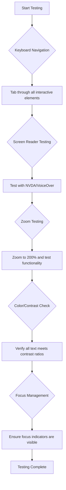
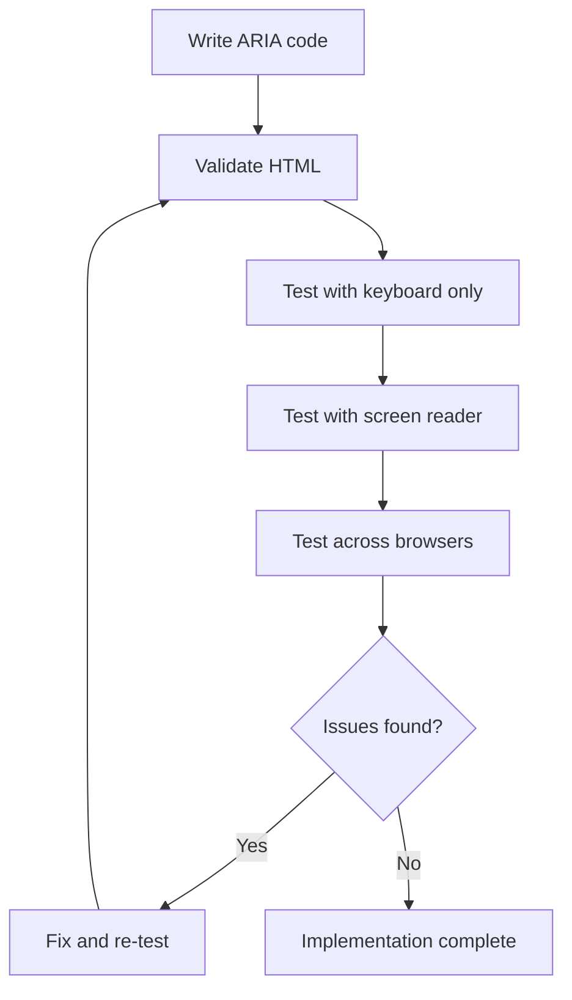

<!--
CO_OP_TRANSLATOR_METADATA:
{
  "original_hash": "90b19cde5b79b29e91babd3138cd8035",
  "translation_date": "2025-10-24T14:00:49+00:00",
  "source_file": "1-getting-started-lessons/3-accessibility/README.md",
  "language_code": "id"
}
-->
# Membuat Halaman Web yang Mudah Diakses


> Sketchnote oleh [Tomomi Imura](https://twitter.com/girlie_mac)

## Kuis Pra-Pelajaran
[Kuis pra-pelajaran](https://ff-quizzes.netlify.app/web/)

> Kekuatan Web terletak pada universalitasnya. Akses oleh semua orang, terlepas dari disabilitas, adalah aspek yang penting.
>
> \- Sir Timothy Berners-Lee, Direktur W3C dan penemu World Wide Web

Ada sesuatu yang mungkin mengejutkan Anda: saat Anda membangun situs web yang mudah diakses, Anda tidak hanya membantu orang dengan disabilitas—Anda sebenarnya membuat web lebih baik untuk semua orang!

Pernahkah Anda memperhatikan potongan trotoar di sudut jalan? Awalnya dirancang untuk kursi roda, tetapi sekarang membantu orang dengan kereta bayi, pekerja pengiriman dengan troli, pelancong dengan koper beroda, dan pengendara sepeda juga. Begitulah cara desain web yang mudah diakses bekerja—solusi yang membantu satu kelompok sering kali akhirnya bermanfaat bagi semua orang. Keren, kan?

Dalam pelajaran ini, kita akan menjelajahi cara membuat situs web yang benar-benar berfungsi untuk semua orang, tidak peduli bagaimana mereka menjelajahi web. Anda akan menemukan teknik praktis yang sudah terintegrasi dalam standar web, mencoba alat pengujian, dan melihat bagaimana aksesibilitas membuat situs Anda lebih mudah digunakan oleh semua pengguna.

Pada akhir pelajaran ini, Anda akan memiliki kepercayaan diri untuk menjadikan aksesibilitas sebagai bagian alami dari alur kerja pengembangan Anda. Siap untuk menjelajahi bagaimana pilihan desain yang bijaksana dapat membuka web untuk miliaran pengguna? Mari kita mulai!

> Anda dapat mengikuti pelajaran ini di [Microsoft Learn](https://docs.microsoft.com/learn/modules/web-development-101/accessibility/?WT.mc_id=academic-77807-sagibbon)!

## Memahami Teknologi Bantu

Sebelum kita mulai coding, mari luangkan waktu untuk memahami bagaimana orang dengan kemampuan berbeda benar-benar mengalami web. Ini bukan hanya teori—memahami pola navigasi dunia nyata ini akan membuat Anda menjadi pengembang yang jauh lebih baik!

Teknologi bantu adalah alat yang luar biasa yang membantu orang dengan disabilitas berinteraksi dengan situs web dengan cara yang mungkin mengejutkan Anda. Setelah Anda memahami cara kerja teknologi ini, menciptakan pengalaman web yang mudah diakses menjadi jauh lebih intuitif. Ini seperti belajar melihat kode Anda melalui mata orang lain.

### Pembaca layar

[Pembaca layar](https://en.wikipedia.org/wiki/Screen_reader) adalah teknologi canggih yang mengubah teks digital menjadi output suara atau braille. Meskipun terutama digunakan oleh orang dengan gangguan penglihatan, mereka juga sangat membantu bagi pengguna dengan gangguan belajar seperti disleksia.

Saya suka menganggap pembaca layar seperti narator yang sangat pintar yang membacakan buku untuk Anda. Ia membaca konten dengan suara keras dalam urutan logis, mengumumkan elemen interaktif seperti "tombol" atau "tautan," dan menyediakan pintasan keyboard untuk berpindah-pindah halaman. Tapi inilah masalahnya—pembaca layar hanya bisa bekerja dengan baik jika kita membangun situs web dengan struktur yang tepat dan konten yang bermakna. Di sinilah peran Anda sebagai pengembang!

**Pembaca layar populer di berbagai platform:**
- **Windows**: [NVDA](https://www.nvaccess.org/about-nvda/) (gratis dan paling populer), [JAWS](https://webaim.org/articles/jaws/), [Narrator](https://support.microsoft.com/windows/complete-guide-to-narrator-e4397a0d-ef4f-b386-d8ae-c172f109bdb1/?WT.mc_id=academic-77807-sagibbon) (bawaan)
- **macOS/iOS**: [VoiceOver](https://support.apple.com/guide/voiceover/welcome/10) (bawaan dan sangat canggih)
- **Android**: [TalkBack](https://support.google.com/accessibility/android/answer/6283677) (bawaan)
- **Linux**: [Orca](https://wiki.gnome.org/Projects/Orca) (gratis dan open-source)

**Cara pembaca layar menavigasi konten web:**

Pembaca layar menyediakan beberapa metode navigasi yang membuat browsing efisien bagi pengguna berpengalaman:
- **Membaca berurutan**: Membaca konten dari atas ke bawah, seperti membaca buku
- **Navigasi landmark**: Melompat antar bagian halaman (header, nav, main, footer)
- **Navigasi heading**: Melompat antar heading untuk memahami struktur halaman
- **Daftar tautan**: Menghasilkan daftar semua tautan untuk akses cepat
- **Kontrol formulir**: Langsung menavigasi antar bidang input dan tombol

> 💡 **Ini sesuatu yang mengejutkan saya**: 68% pengguna pembaca layar terutama menavigasi dengan heading ([Survei WebAIM](https://webaim.org/projects/screenreadersurvey9/#finding)). Ini berarti struktur heading Anda seperti peta jalan bagi pengguna—ketika Anda melakukannya dengan benar, Anda benar-benar membantu orang menemukan jalan mereka di sekitar konten Anda dengan lebih cepat!

### Membangun alur kerja pengujian Anda

Berita baiknya adalah—pengujian aksesibilitas yang efektif tidak harus membingungkan! Anda akan ingin menggabungkan alat otomatis (mereka hebat dalam menangkap masalah yang jelas) dengan beberapa pengujian langsung. Berikut pendekatan sistematis yang menurut saya menangkap sebagian besar masalah tanpa memakan waktu seharian:

**Alur kerja pengujian manual yang penting:**



**Daftar periksa pengujian langkah demi langkah:**
1. **Navigasi keyboard**: Gunakan hanya Tab, Shift+Tab, Enter, Space, dan tombol panah
2. **Pengujian pembaca layar**: Aktifkan NVDA, VoiceOver, atau Narrator dan navigasi dengan mata tertutup
3. **Pengujian zoom**: Uji pada tingkat zoom 200% dan 400%
4. **Verifikasi kontras warna**: Periksa semua teks dan komponen UI
5. **Pengujian indikator fokus**: Pastikan semua elemen interaktif memiliki status fokus yang terlihat

✅ **Mulai dengan Lighthouse**: Buka DevTools browser Anda, jalankan audit aksesibilitas Lighthouse, lalu gunakan hasilnya untuk memandu area fokus pengujian manual Anda.

### Alat zoom dan pembesaran

Anda tahu bagaimana kadang-kadang Anda mencubit untuk memperbesar di ponsel Anda ketika teks terlalu kecil, atau menyipitkan mata di layar laptop Anda di bawah sinar matahari terang? Banyak pengguna mengandalkan alat pembesaran untuk membuat konten dapat dibaca setiap hari. Ini termasuk orang dengan gangguan penglihatan, orang tua, dan siapa saja yang pernah mencoba membaca situs web di luar ruangan.

Teknologi zoom modern telah berkembang melampaui sekadar memperbesar. Memahami cara kerja alat ini akan membantu Anda menciptakan desain responsif yang tetap fungsional dan menarik pada tingkat pembesaran apa pun.

**Kemampuan zoom browser modern:**
- **Zoom halaman**: Menskalakan semua konten secara proporsional (teks, gambar, tata letak) - ini adalah metode yang disukai
- **Zoom teks saja**: Meningkatkan ukuran font sambil mempertahankan tata letak asli
- **Pinch-to-zoom**: Dukungan gerakan seluler untuk pembesaran sementara
- **Dukungan browser**: Semua browser modern mendukung zoom hingga 500% tanpa merusak fungsionalitas

**Perangkat lunak pembesaran khusus:**
- **Windows**: [Magnifier](https://support.microsoft.com/windows/use-magnifier-to-make-things-on-the-screen-easier-to-see-414948ba-8b1c-d3bd-8615-0e5e32204198) (bawaan), [ZoomText](https://www.freedomscientific.com/training/zoomtext/getting-started/)
- **macOS/iOS**: [Zoom](https://www.apple.com/accessibility/mac/vision/) (bawaan dengan fitur canggih)

> ⚠️ **Pertimbangan Desain**: WCAG mengharuskan konten tetap fungsional saat diperbesar hingga 200%. Pada tingkat ini, pengguliran horizontal harus minimal, dan semua elemen interaktif harus tetap dapat diakses.

✅ **Uji desain responsif Anda**: Zoom browser Anda hingga 200% dan 400%. Apakah tata letak Anda beradaptasi dengan baik? Bisakah Anda tetap mengakses semua fungsionalitas tanpa pengguliran berlebihan?

## Alat Pengujian Aksesibilitas Modern

Sekarang setelah Anda memahami bagaimana orang menavigasi web dengan teknologi bantu, mari kita jelajahi alat yang membantu Anda membangun dan menguji situs web yang mudah diakses.

Anggap saja seperti ini: alat otomatis sangat bagus untuk menangkap masalah yang jelas (seperti teks alt yang hilang), sementara pengujian langsung membantu Anda memastikan situs Anda terasa nyaman digunakan di dunia nyata. Bersama-sama, mereka memberi Anda kepercayaan diri bahwa situs Anda berfungsi untuk semua orang.

### Pengujian kontras warna

Berita baiknya adalah: kontras warna adalah salah satu masalah aksesibilitas yang paling umum, tetapi juga salah satu yang paling mudah diperbaiki. Kontras yang baik menguntungkan semua orang—dari pengguna dengan gangguan penglihatan hingga orang yang mencoba membaca ponsel mereka di pantai.

**Persyaratan kontras WCAG:**

| Jenis Teks | WCAG AA (Minimum) | WCAG AAA (Ditingkatkan) |
|------------|-------------------|-------------------------|
| **Teks normal** (di bawah 18pt) | Rasio kontras 4.5:1 | Rasio kontras 7:1 |
| **Teks besar** (18pt+ atau 14pt+ tebal) | Rasio kontras 3:1 | Rasio kontras 4.5:1 |
| **Komponen UI** (tombol, batas formulir) | Rasio kontras 3:1 | Rasio kontras 3:1 |

**Alat pengujian penting:**
- [Colour Contrast Analyser](https://www.tpgi.com/color-contrast-checker/) - Aplikasi desktop dengan pemilih warna
- [WebAIM Contrast Checker](https://webaim.org/resources/contrastchecker/) - Berbasis web dengan umpan balik instan
- [Stark](https://www.getstark.co/) - Plugin alat desain untuk Figma, Sketch, Adobe XD
- [Accessible Colors](https://accessible-colors.com/) - Temukan palet warna yang mudah diakses

✅ **Bangun palet warna yang lebih baik**: Mulailah dengan warna merek Anda dan gunakan pemeriksa kontras untuk membuat variasi yang mudah diakses. Dokumentasikan ini sebagai token warna yang mudah diakses dalam sistem desain Anda.

### Audit aksesibilitas yang komprehensif

Pengujian aksesibilitas yang paling efektif menggabungkan beberapa pendekatan. Tidak ada alat tunggal yang menangkap semuanya, jadi membangun rutinitas pengujian dengan berbagai metode memastikan cakupan yang menyeluruh.

**Pengujian berbasis browser (terintegrasi dalam DevTools):**
- **Chrome/Edge**: Audit aksesibilitas Lighthouse + panel Aksesibilitas
- **Firefox**: Inspector Aksesibilitas dengan tampilan pohon yang terperinci
- **Safari**: Tab Audit di Web Inspector dengan simulasi VoiceOver

**Ekstensi pengujian profesional:**
- [axe DevTools](https://www.deque.com/axe/devtools/) - Pengujian otomatis standar industri
- [WAVE](https://wave.webaim.org/extension/) - Umpan balik visual dengan penyorotan kesalahan
- [Accessibility Insights](https://accessibilityinsights.io/) - Suite pengujian komprehensif dari Microsoft

**Integrasi Command-line dan CI/CD:**
- [axe-core](https://github.com/dequelabs/axe-core) - Perpustakaan JavaScript untuk pengujian otomatis
- [Pa11y](https://pa11y.org/) - Alat pengujian aksesibilitas berbasis command-line
- [Lighthouse CI](https://github.com/GoogleChrome/lighthouse-ci) - Penilaian aksesibilitas otomatis

> 🎯 **Tujuan Pengujian**: Targetkan skor aksesibilitas Lighthouse 95+ sebagai baseline Anda. Ingat, alat otomatis hanya menangkap sekitar 30-40% masalah aksesibilitas—pengujian manual tetap penting!

## Membangun Aksesibilitas dari Awal

Kunci keberhasilan aksesibilitas adalah membangunnya ke dalam fondasi Anda sejak hari pertama. Saya tahu menggoda untuk berpikir "Saya akan menambahkan aksesibilitas nanti," tetapi itu seperti mencoba menambahkan ramp ke rumah setelah rumah itu selesai dibangun. Mungkin? Ya. Mudah? Tidak terlalu.

Anggap aksesibilitas seperti merencanakan rumah—jauh lebih mudah untuk memasukkan aksesibilitas kursi roda dalam rencana arsitektur awal Anda daripada merombak semuanya nanti.

### Prinsip POUR: Fondasi aksesibilitas Anda

Pedoman Konten Web yang Mudah Diakses (WCAG) dibangun di sekitar empat prinsip dasar yang disebut POUR. Jangan khawatir—ini bukan konsep akademis yang kaku! Mereka sebenarnya adalah panduan praktis untuk membuat konten yang berfungsi untuk semua orang.

Setelah Anda memahami POUR, membuat keputusan aksesibilitas menjadi jauh lebih intuitif. Ini seperti memiliki daftar periksa mental yang memandu pilihan desain Anda. Mari kita bahas:

**🔍 Dapat Dipersepsi**: Informasi harus dapat disajikan dengan cara yang dapat dirasakan pengguna melalui indra yang tersedia

- Sediakan alternatif teks untuk konten non-teks (gambar, video, audio)
- Pastikan kontras warna yang cukup untuk semua teks dan komponen UI
- Tawarkan teks dan transkrip untuk konten multimedia
- Desain konten yang tetap fungsional saat diperbesar hingga 200%
- Gunakan karakteristik sensorik ganda (bukan hanya warna) untuk menyampaikan informasi

**🎮 Dapat Dioperasikan**: Semua komponen antarmuka harus dapat dioperasikan melalui metode input yang tersedia

- Pastikan semua fungsionalitas dapat diakses melalui navigasi keyboard
- Berikan pengguna waktu yang cukup untuk membaca dan berinteraksi dengan konten
- Hindari konten yang menyebabkan kejang atau gangguan vestibular
- Bantu pengguna menavigasi dengan struktur dan landmark yang jelas
- Pastikan elemen interaktif memiliki ukuran target yang memadai (minimal 44px)

**📖 Dapat Dipahami**: Informasi dan operasi UI harus jelas dan mudah dipahami

- Gunakan bahasa yang jelas dan sederhana sesuai dengan audiens Anda
- Pastikan konten muncul dan beroperasi dengan cara yang dapat diprediksi dan konsisten
- Berikan instruksi dan pesan kesalahan yang jelas untuk input pengguna
- Bantu pengguna memahami dan memperbaiki kesalahan dalam formulir
- Atur konten dengan urutan membaca yang logis dan hierarki informasi

**💪 Kuat**: Konten harus bekerja secara andal di berbagai teknologi dan perangkat bantu

- Gunakan HTML yang valid dan semantik sebagai fondasi Anda
- Pastikan kompatibilitas dengan teknologi bantu saat ini dan masa depan
- Ikuti standar web dan praktik terbaik untuk markup
- Uji di berbagai browser, perangkat, dan alat bantu
- Struktur konten sehingga tetap berfungsi dengan baik saat fitur canggih tidak didukung

## Menciptakan Desain Visual yang Mudah Diakses

Desain visual yang baik dan aksesibilitas berjalan beriringan. Saat Anda mendesain dengan aksesibilitas dalam pikiran, Anda sering menemukan bahwa batasan ini mengarah pada solusi yang lebih bersih dan elegan yang menguntungkan semua pengguna.

Mari kita jelajahi cara menciptakan desain yang menarik secara visual yang berfungsi untuk semua orang, terlepas dari kemampuan visual mereka atau kondisi di mana mereka melihat konten Anda.

### Strategi warna dan aksesibilitas visual
Warna adalah alat komunikasi yang kuat, tetapi seharusnya tidak pernah menjadi satu-satunya cara untuk menyampaikan informasi penting. Merancang di luar warna menciptakan pengalaman yang lebih tangguh dan inklusif yang dapat berfungsi dalam berbagai situasi.

**Desain untuk perbedaan penglihatan warna:**

Sekitar 8% pria dan 0,5% wanita memiliki beberapa bentuk perbedaan penglihatan warna (sering disebut "buta warna"). Jenis yang paling umum adalah:
- **Deuteranopia**: Kesulitan membedakan merah dan hijau
- **Protanopia**: Merah tampak lebih redup
- **Tritanopia**: Kesulitan dengan biru dan kuning (jarang terjadi)

**Strategi warna yang inklusif:**

```css
/* ❌ Bad: Using only color to indicate status */
.error { color: red; }
.success { color: green; }

/* ✅ Good: Color plus icons and context */
.error {
  color: #d32f2f;
  border-left: 4px solid #d32f2f;
}
.error::before {
  content: "⚠️";
  margin-right: 8px;
}

.success {
  color: #2e7d32;
  border-left: 4px solid #2e7d32;
}
.success::before {
  content: "✅";
  margin-right: 8px;
}
```

**Melampaui persyaratan kontras dasar:**
- Uji pilihan warna Anda dengan simulator buta warna
- Gunakan pola, tekstur, atau bentuk bersama dengan kode warna
- Pastikan status interaktif tetap dapat dibedakan tanpa warna
- Pertimbangkan bagaimana desain Anda terlihat dalam mode kontras tinggi

✅ **Uji aksesibilitas warna Anda**: Gunakan alat seperti [Coblis](https://www.color-blindness.com/coblis-color-blindness-simulator/) untuk melihat bagaimana situs Anda muncul bagi pengguna dengan berbagai jenis penglihatan warna.

### Indikator fokus dan desain interaksi

Indikator fokus adalah setara digital dari kursor—mereka menunjukkan kepada pengguna keyboard di mana mereka berada di halaman. Indikator fokus yang dirancang dengan baik meningkatkan pengalaman untuk semua orang dengan membuat interaksi menjadi jelas dan dapat diprediksi.

**Praktik terbaik indikator fokus modern:**

```css
/* Enhanced focus styles that work across browsers */
button:focus-visible {
  outline: 2px solid #0066cc;
  outline-offset: 2px;
  box-shadow: 0 0 0 4px rgba(0, 102, 204, 0.25);
}

/* Remove focus outline for mouse users, preserve for keyboard users */
button:focus:not(:focus-visible) {
  outline: none;
}

/* Focus-within for complex components */
.card:focus-within {
  box-shadow: 0 0 0 3px rgba(74, 144, 164, 0.5);
  border-color: #4A90A4;
}

/* Ensure focus indicators meet contrast requirements */
.custom-focus:focus-visible {
  outline: 3px solid #ffffff;
  outline-offset: 2px;
  box-shadow: 0 0 0 6px #000000;
}
```

**Persyaratan indikator fokus:**
- **Visibilitas**: Harus memiliki rasio kontras setidaknya 3:1 dengan elemen sekitarnya
- **Lebar**: Ketebalan minimal 2px di sekitar seluruh elemen
- **Persistensi**: Harus tetap terlihat hingga fokus berpindah ke tempat lain
- **Pembedaan**: Harus secara visual berbeda dari status UI lainnya

> 💡 **Tips Desain**: Indikator fokus yang baik sering menggunakan kombinasi outline, box-shadow, dan perubahan warna untuk memastikan visibilitas di berbagai latar belakang dan konteks.

✅ **Audit indikator fokus**: Gunakan tombol Tab untuk menjelajahi situs web Anda dan catat elemen mana yang memiliki indikator fokus yang jelas. Apakah ada yang sulit dilihat atau bahkan tidak ada?

### HTML Semantik: Fondasi aksesibilitas

HTML semantik seperti memberikan teknologi bantu sistem GPS untuk situs web Anda. Ketika Anda menggunakan elemen HTML yang tepat untuk tujuan yang dimaksudkan, Anda pada dasarnya memberikan pembaca layar, keyboard, dan alat lainnya peta rinci untuk membantu pengguna menavigasi dengan efektif.

Berikut adalah analogi yang benar-benar membuat saya mengerti: HTML semantik adalah perbedaan antara perpustakaan yang terorganisir dengan kategori yang jelas dan tanda-tanda yang membantu dibandingkan dengan gudang tempat buku-buku tersebar secara acak. Kedua tempat memiliki buku yang sama, tetapi mana yang akan Anda pilih untuk mencari sesuatu? Tepat sekali!

**Blok bangunan struktur halaman yang dapat diakses:**

```html
<!-- Landmark elements provide page navigation structure -->
<header>
  <h1>Your Site Name</h1>
  <nav aria-label="Main navigation">
    <ul>
      <li><a href="/home">Home</a></li>
      <li><a href="/about">About</a></li>
      <li><a href="/services">Services</a></li>
    </ul>
  </nav>
</header>

<main>
  <article>
    <header>
      <h1>Article Title</h1>
      <p>Published on <time datetime="2024-10-14">October 14, 2024</time></p>
    </header>
    
    <section>
      <h2>First Section</h2>
      <p>Content that relates to this section...</p>
    </section>
    
    <section>
      <h2>Second Section</h2>
      <p>More related content...</p>
    </section>
  </article>
  
  <aside>
    <h2>Related Links</h2>
    <nav aria-label="Related articles">
      <ul>
        <li><a href="/related-1">First related article</a></li>
        <li><a href="/related-2">Second related article</a></li>
      </ul>
    </nav>
  </aside>
</main>

<footer>
  <p>&copy; 2024 Your Site Name. All rights reserved.</p>
  <nav aria-label="Footer links">
    <ul>
      <li><a href="/privacy">Privacy Policy</a></li>
      <li><a href="/contact">Contact Us</a></li>
    </ul>
  </nav>
</footer>
```

**Mengapa HTML semantik mengubah aksesibilitas:**

| Elemen Semantik | Tujuan | Manfaat Pembaca Layar |
|------------------|---------|----------------------|
| `<header>` | Header halaman atau bagian | "Landmark banner" - navigasi cepat ke atas |
| `<nav>` | Tautan navigasi | "Landmark navigasi" - daftar bagian navigasi |
| `<main>` | Konten utama halaman | "Landmark utama" - langsung ke konten |
| `<article>` | Konten mandiri | Menandai batas artikel |
| `<section>` | Kelompok konten bertema | Memberikan struktur konten |
| `<aside>` | Konten sidebar terkait | "Landmark pelengkap" |
| `<footer>` | Footer halaman atau bagian | "Landmark informasi konten" |

**Kekuatan pembaca layar dengan HTML semantik:**
- **Navigasi landmark**: Melompat di antara bagian utama halaman secara instan
- **Outline heading**: Membuat daftar isi dari struktur heading Anda
- **Daftar elemen**: Membuat daftar semua tautan, tombol, atau kontrol formulir
- **Kesadaran konteks**: Memahami hubungan antara bagian-bagian konten

> 🎯 **Tes Cepat**: Coba navigasikan situs Anda dengan pembaca layar menggunakan pintasan landmark (D untuk landmark, H untuk heading, K untuk tautan di NVDA/JAWS). Apakah navigasinya masuk akal?

✅ **Audit struktur semantik Anda**: Gunakan panel Aksesibilitas di DevTools browser Anda untuk melihat pohon aksesibilitas dan memastikan markup Anda menciptakan struktur yang logis.

### Hierarki heading: Membuat outline konten yang logis

Heading sangat penting untuk konten yang dapat diakses—mereka seperti tulang punggung yang menyatukan semuanya. Pengguna pembaca layar sangat bergantung pada heading untuk memahami dan menavigasi konten Anda. Anggap saja seperti menyediakan daftar isi untuk halaman Anda.

**Inilah aturan emas untuk heading:**
Jangan pernah melewatkan level. Selalu maju secara logis dari `<h1>` ke `<h2>` ke `<h3>`, dan seterusnya. Ingat membuat outline di sekolah? Prinsipnya persis sama—Anda tidak akan melompat dari "I. Poin Utama" langsung ke "C. Sub-sub-poin" tanpa "A. Sub-poin" di antaranya, bukan?

**Contoh struktur heading yang sempurna:**

```html
<!-- ✅ Excellent: Logical, hierarchical progression -->
<main>
  <h1>Complete Guide to Web Accessibility</h1>
  
  <section>
    <h2>Understanding Screen Readers</h2>
    <p>Introduction to screen reader technology...</p>
    
    <h3>Popular Screen Reader Software</h3>
    <p>NVDA, JAWS, and VoiceOver comparison...</p>
    
    <h3>Testing with Screen Readers</h3>
    <p>Step-by-step testing instructions...</p>
  </section>
  
  <section>
    <h2>Color and Contrast Guidelines</h2>
    <p>Designing with sufficient contrast...</p>
    
    <h3>WCAG Contrast Requirements</h3>
    <p>Understanding the different contrast levels...</p>
    
    <h3>Testing Tools and Techniques</h3>
    <p>Tools for verifying contrast ratios...</p>
  </section>
</main>
```

```html
<!-- ❌ Problematic: Skipping levels, inconsistent structure -->
<h1>Page Title</h1>
<h3>Subsection</h3> <!-- Skipped h2 -->
<h2>This should come before h3</h2>
<h1>Another main heading?</h1> <!-- Multiple h1s -->
```

**Praktik terbaik heading:**
- **Satu `<h1>` per halaman**: Biasanya judul utama halaman atau heading konten utama
- **Kemajuan logis**: Jangan pernah melewatkan level (h1 → h2 → h3, bukan h1 → h3)
- **Konten deskriptif**: Buat heading bermakna saat dibaca di luar konteks
- **Gaya visual dengan CSS**: Gunakan CSS untuk tampilan, level HTML untuk struktur

**Statistik navigasi pembaca layar:**
- 68% pengguna pembaca layar menavigasi dengan heading ([Survei WebAIM](https://webaim.org/projects/screenreadersurvey9/#finding))
- Pengguna mengharapkan menemukan outline heading yang logis
- Heading menyediakan cara tercepat untuk memahami struktur halaman

> 💡 **Tips Pro**: Gunakan ekstensi browser seperti "HeadingsMap" untuk memvisualisasikan struktur heading Anda. Seharusnya terbaca seperti daftar isi yang terorganisir dengan baik.

✅ **Tes struktur heading Anda**: Gunakan navigasi heading pembaca layar (tombol H di NVDA) untuk melompat melalui heading Anda. Apakah kemajuannya menceritakan kisah konten Anda secara logis?

### Teknik aksesibilitas visual tingkat lanjut

Selain dasar-dasar kontras dan warna, ada teknik canggih yang membantu menciptakan pengalaman visual yang benar-benar inklusif. Metode ini memastikan konten Anda berfungsi di berbagai kondisi tampilan dan teknologi bantu.

**Strategi komunikasi visual yang penting:**

- **Umpan balik multi-modal**: Gabungkan petunjuk visual, tekstual, dan kadang-kadang audio
- **Pengungkapan progresif**: Sajikan informasi dalam potongan yang mudah dicerna
- **Pola interaksi yang konsisten**: Gunakan konvensi UI yang familiar
- **Tipografi responsif**: Skala teks dengan tepat di berbagai perangkat
- **Status pemuatan dan kesalahan**: Berikan umpan balik yang jelas untuk semua tindakan pengguna

**Utilitas CSS untuk aksesibilitas yang ditingkatkan:**

```css
/* Screen reader only text - visually hidden but accessible */
.sr-only {
  position: absolute;
  width: 1px;
  height: 1px;
  padding: 0;
  margin: -1px;
  overflow: hidden;
  clip: rect(0, 0, 0, 0);
  white-space: nowrap;
  border: 0;
}

/* Skip link for keyboard navigation */
.skip-link {
  position: absolute;
  top: -40px;
  left: 6px;
  background: #000000;
  color: #ffffff;
  padding: 8px 16px;
  text-decoration: none;
  border-radius: 4px;
  font-weight: bold;
  transition: top 0.3s ease;
  z-index: 1000;
}

.skip-link:focus {
  top: 6px;
}

/* Reduced motion respect */
@media (prefers-reduced-motion: reduce) {
  .skip-link {
    transition: none;
  }
  
  * {
    animation-duration: 0.01ms !important;
    animation-iteration-count: 1 !important;
    transition-duration: 0.01ms !important;
  }
}

/* High contrast mode support */
@media (prefers-contrast: high) {
  .button {
    border: 2px solid;
  }
}
```

> 🎯 **Pola Aksesibilitas**: "Tautan lewati" sangat penting bagi pengguna keyboard. Tautan ini harus menjadi elemen yang dapat difokuskan pertama di halaman Anda dan langsung melompat ke area konten utama.

✅ **Implementasikan navigasi lewati**: Tambahkan tautan lewati ke halaman Anda dan uji dengan menekan Tab segera setelah halaman dimuat. Tautan tersebut harus muncul dan memungkinkan Anda melompat ke konten utama.

## Membuat Teks Tautan yang Bermakna

Tautan adalah jalan raya web, tetapi teks tautan yang ditulis dengan buruk seperti memiliki tanda jalan yang hanya mengatakan "Tempat" daripada "Pusat Kota Jakarta." Tidak terlalu membantu, bukan?

Berikut adalah sesuatu yang mengejutkan saya saat pertama kali mengetahuinya: pembaca layar dapat mengekstrak semua tautan dari halaman dan menampilkannya sebagai satu daftar besar. Bayangkan jika seseorang memberi Anda direktori dari setiap tautan di halaman Anda. Apakah masing-masing masuk akal dengan sendirinya? Itulah tes yang harus dilewati teks tautan Anda!

### Memahami pola navigasi tautan

Pembaca layar menawarkan fitur navigasi tautan yang kuat yang bergantung pada teks tautan yang ditulis dengan baik:

**Metode navigasi tautan:**
- **Pembacaan berurutan**: Tautan dibaca dalam konteks sebagai bagian dari aliran konten
- **Pembuatan daftar tautan**: Semua tautan halaman dikompilasi menjadi direktori yang dapat dicari
- **Navigasi cepat**: Melompat di antara tautan menggunakan pintasan keyboard (K di NVDA)
- **Fungsi pencarian**: Temukan tautan tertentu dengan mengetik teks parsial

**Mengapa konteks penting:**
Ketika pengguna pembaca layar menghasilkan daftar tautan, mereka melihat sesuatu seperti ini:
- "Unduh laporan"
- "Pelajari lebih lanjut"
- "Klik di sini"
- "Kebijakan privasi"
- "Klik di sini"

Hanya dua dari tautan ini yang memberikan informasi berguna saat dibaca di luar konteks!

> 📊 **Dampak Pengguna**: Pengguna pembaca layar memindai daftar tautan untuk memahami konten halaman dengan cepat. Teks tautan generik memaksa mereka untuk kembali ke konteks setiap tautan, secara signifikan memperlambat pengalaman menjelajah mereka.

### Kesalahan umum teks tautan yang harus dihindari

Memahami apa yang tidak berfungsi membantu Anda mengenali dan memperbaiki masalah aksesibilitas dalam konten yang ada.

**❌ Teks tautan generik yang tidak memberikan konteks:**

```html
<!-- Meaningless when read from a link list -->
<p>Our sustainability efforts are detailed in our recent report. 
   <a href="/sustainability-2024.pdf">Click here</a> to view it.</p>

<!-- Repeated generic text throughout the page -->
<div class="article-card">
  <h3>Web Accessibility Guide</h3>
  <p>Learn the fundamentals...</p>
  <a href="/accessibility-guide">Read more</a>
</div>
<div class="article-card">
  <h3>Color Contrast Tips</h3>
  <p>Improve your design...</p>
  <a href="/color-contrast">Read more</a>
</div>

<!-- URLs as link text (difficult for screen readers to announce) -->
<p>Visit https://www.w3.org/WAI/WCAG21/quickref/ for WCAG guidelines.</p>

<!-- Vague action words -->
<a href="/contact">Go</a> | <a href="/about">See</a> | <a href="/help">View</a>
```

**Mengapa pola ini gagal:**
- **"Klik di sini"** tidak memberi tahu pengguna apa pun tentang tujuan
- **"Baca lebih lanjut"** yang diulang beberapa kali menciptakan kebingungan
- **URL mentah** sulit diucapkan dengan jelas oleh pembaca layar
- **Kata tunggal** seperti "Pergi" atau "Lihat" kurang konteks deskriptif

### Menulis teks tautan yang sangat baik

Teks tautan yang deskriptif bermanfaat bagi semua orang—pengguna yang dapat melihat dapat dengan cepat memindai tautan, dan pengguna pembaca layar langsung memahami tujuan.

**✅ Contoh teks tautan yang jelas dan deskriptif:**

```html
<!-- Descriptive text that explains the destination -->
<p>Our comprehensive <a href="/sustainability-2024.pdf">2024 sustainability report (PDF, 2.1MB)</a> details our environmental initiatives.</p>

<!-- Specific, unique link text for each card -->
<div class="article-card">
  <h3>Web Accessibility Guide</h3>
  <p>Learn the fundamentals of inclusive design...</p>
  <a href="/accessibility-guide">Read our complete web accessibility guide</a>
</div>
<div class="article-card">
  <h3>Color Contrast Tips</h3>
  <p>Improve your design with better color choices...</p>
  <a href="/color-contrast">Explore color contrast best practices</a>
</div>

<!-- Meaningful text instead of raw URLs -->
<p>The <a href="https://www.w3.org/WAI/WCAG21/quickref/">WCAG 2.1 Quick Reference guide</a> provides comprehensive accessibility guidelines.</p>

<!-- Descriptive action links -->
<a href="/contact">Contact our support team</a> | 
<a href="/about">About our company</a> | 
<a href="/help">Get help with your account</a>
```

**Praktik terbaik teks tautan:**
- **Spesifik**: "Unduh laporan keuangan triwulan" vs. "Unduh"
- **Sertakan jenis file dan ukuran**: "(PDF, 1.2MB)" untuk file yang dapat diunduh
- **Sebutkan jika tautan terbuka secara eksternal**: "(terbuka di jendela baru)" jika sesuai
- **Gunakan bahasa aktif**: "Hubungi kami" vs. "Halaman kontak"
- **Tetap ringkas**: Usahakan 2-8 kata jika memungkinkan

### Pola aksesibilitas tautan tingkat lanjut

Kadang-kadang kendala desain visual atau persyaratan teknis membutuhkan solusi khusus. Berikut adalah teknik canggih untuk skenario yang sering menantang:

**Menggunakan ARIA untuk konteks yang ditingkatkan:**

```html
<!-- When button text must be short but needs more context -->
<a href="/report.pdf" 
   aria-label="Download 2024 annual financial report, PDF format, 2.3MB">
  Download Report
</a>

<!-- When the full context comes from surrounding content -->
<h3 id="sustainability-heading">Sustainability Initiative</h3>
<p>Our efforts to reduce environmental impact...</p>
<a href="/sustainability-details" 
   aria-labelledby="sustainability-heading"
   aria-describedby="sustainability-summary">
  Learn more
</a>
<p id="sustainability-summary">Detailed breakdown of our 2024 environmental goals and achievements</p>
```

**Menunjukkan jenis file dan tujuan eksternal:**

```html
<!-- Method 1: Include information in visible link text -->
<a href="/annual-report.pdf">
  Download our 2024 annual report (PDF, 2.3MB)
</a>

<!-- Method 2: Use screen reader-only text for file details -->
<a href="/annual-report.pdf">
  Download our 2024 annual report
  <span class="sr-only">(PDF format, 2.3MB)</span>
</a>

<!-- Method 3: External link indication -->
<a href="https://example.com" 
   target="_blank" 
   aria-describedby="external-link-warning">
  Visit external resource
</a>
<span id="external-link-warning" class="sr-only">
  (opens in new window)
</span>

<!-- Method 4: Using CSS for visual indicators -->
<a href="https://example.com" class="external-link">
  External resource
</a>
```

```css
/* Visual indicator for external links */
.external-link::after {
  content: " ↗";
  font-size: 0.8em;
  color: #666;
}

/* Screen reader announcement for external links */
.external-link::before {
  content: "External link: ";
  position: absolute;
  left: -10000px;
  width: 1px;
  height: 1px;
  overflow: hidden;
}
```

> ⚠️ **Penting**: Saat menggunakan `target="_blank"`, selalu beri tahu pengguna bahwa tautan terbuka di jendela atau tab baru. Perubahan navigasi yang tidak terduga dapat membingungkan.

✅ **Tes konteks tautan Anda**: Gunakan alat pengembang browser Anda untuk menghasilkan daftar semua tautan di halaman Anda. Bisakah Anda memahami tujuan setiap tautan tanpa konteks sekitarnya?

## ARIA: Meningkatkan Aksesibilitas HTML

[Accessible Rich Internet Applications (ARIA)](https://developer.mozilla.org/docs/Web/Accessibility/ARIA) seperti memiliki penerjemah universal antara aplikasi web kompleks Anda dan teknologi bantu. Ketika HTML saja tidak dapat mengekspresikan semua yang dilakukan komponen interaktif Anda, ARIA hadir untuk mengisi kekosongan tersebut.

Saya suka menganggap ARIA sebagai menambahkan anotasi yang membantu ke HTML Anda—seperti arahan panggung dalam naskah drama yang membantu aktor memahami peran dan hubungan mereka.

**Inilah aturan paling penting tentang ARIA**: Selalu gunakan HTML semantik terlebih dahulu, lalu tambahkan ARIA untuk meningkatkannya. Anggap ARIA sebagai bumbu, bukan hidangan utama. ARIA harus memperjelas dan meningkatkan struktur HTML Anda, tidak pernah menggantikannya. Pastikan fondasi itu benar terlebih dahulu!

### Implementasi strategis ARIA

ARIA itu kuat, tetapi dengan kekuatan datang tanggung jawab. ARIA yang salah dapat membuat aksesibilitas lebih buruk daripada tidak ada ARIA sama sekali. Berikut adalah kapan dan bagaimana menggunakannya secara efektif:

**✅ Gunakan ARIA saat:**
- Membuat widget interaktif khusus (accordion, tab, carousel)
- Membangun konten dinamis yang berubah tanpa memuat ulang halaman
- Memberikan konteks tambahan untuk hubungan UI yang kompleks
- Menunjukkan status pemuatan atau pembaruan konten langsung
- Membuat antarmuka seperti aplikasi dengan kontrol khusus

**❌ Hindari ARIA saat:**
- Elemen HTML standar sudah menyediakan semantik yang diperlukan
- Anda tidak yakin cara mengimplementasikannya dengan benar
- ARIA menduplikasi informasi yang sudah disediakan oleh HTML semantik
- Anda belum menguji dengan teknologi bantu yang sebenarnya

> 🎯 **Aturan Emas ARIA**: "Jangan ubah semantik kecuali benar-benar diperlukan, pastikan aksesibilitas keyboard selalu, dan uji dengan teknologi bantu yang nyata."

**Lima kategori ARIA:**

1. **Roles**: Apa elemen ini? (`button`, `tab`, `dialog`)
2. **Properties**: Apa fitur-fiturnya? (`aria-required`, `aria-haspopup`)
3. **States**: Apa kondisinya saat ini? (`aria-expanded`, `aria-checked`)
4. **Landmarks**: Di mana posisinya dalam struktur halaman? (`banner`, `navigation`, `main`)
5. **Live regions**: Bagaimana perubahan harus diumumkan? (`aria-live`, `aria-atomic`)

### Pola ARIA penting untuk aplikasi web modern

Pola-pola ini menyelesaikan tantangan aksesibilitas yang paling umum dalam aplikasi web interaktif:

**Memberi nama dan mendeskripsikan elemen:**

```html
<!-- aria-label: Provides accessible name when visible text isn't sufficient -->
<button aria-label="Close newsletter subscription dialog">×</button>

<!-- aria-labelledby: References existing text as the accessible name -->
<section aria-labelledby="news-heading">
  <h2 id="news-heading">Latest News</h2>
  <!-- news content -->
</section>

<!-- aria-describedby: Links to additional descriptive text -->
<input type="password" 
       aria-describedby="pwd-requirements pwd-strength"
       required>
<div id="pwd-requirements">
  Password must contain at least 8 characters, including uppercase, lowercase, and numbers.
</div>
<div id="pwd-strength" aria-live="polite">
  <!-- Dynamic password strength indicator -->
</div>
```

**Live regions untuk konten dinamis:**

```html
<!-- Polite announcements (don't interrupt current speech) -->
<div aria-live="polite" id="status-updates">
  <!-- Status messages appear here -->
</div>

<!-- Assertive announcements (interrupt and announce immediately) -->
<div aria-live="assertive" id="urgent-alerts">
  <!-- Error messages and critical alerts -->
</div>

<!-- Loading states with live regions -->
<button id="submit-btn" aria-describedby="loading-status">
  Submit Application
</button>
<div id="loading-status" aria-live="polite" aria-atomic="true">
  <!-- "Processing your application..." appears here -->
</div>
```

**Contoh widget interaktif (accordion):**

```html
<div class="accordion">
  <h3>
    <button aria-expanded="false" 
            aria-controls="panel-1" 
            id="accordion-trigger-1"
            class="accordion-trigger">
      Accessibility Guidelines
    </button>
  </h3>
  <div id="panel-1" 
       role="region"
       aria-labelledby="accordion-trigger-1" 
       hidden>
    <p>WCAG 2.1 provides comprehensive guidelines...</p>
  </div>
</div>
```

```javascript
// JavaScript to manage accordion state
function toggleAccordion(trigger) {
  const panel = document.getElementById(trigger.getAttribute('aria-controls'));
  const isExpanded = trigger.getAttribute('aria-expanded') === 'true';
  
  // Toggle states
  trigger.setAttribute('aria-expanded', !isExpanded);
  panel.hidden = isExpanded;
  
  // Announce change to screen readers
  const status = document.getElementById('status-updates');
  status.textContent = isExpanded ? 'Section collapsed' : 'Section expanded';
}
```

### Praktik terbaik implementasi ARIA

ARIA itu kuat tetapi membutuhkan implementasi yang hati-hati. Mengikuti pedoman ini membantu memastikan ARIA Anda meningkatkan daripada menghambat aksesibilitas:

**🛡️ Prinsip inti:**

1. **HTML semantik terlebih dahulu**: Selalu lebih memilih `<button>` daripada `<div role="button">`
2. **Jangan merusak semantik**: Jangan pernah menimpa makna HTML yang ada (hindari `<h1 role="button">`)
3. **Pertahankan aksesibilitas keyboard**: Semua elemen ARIA interaktif harus sepenuhnya dapat diakses dengan keyboard
4. **Uji dengan pengguna nyata**: Dukungan ARIA sangat bervariasi di antara teknologi bantu
5. **Mulai dengan yang sederhana**: Implementasi ARIA yang kompleks lebih rentan terhadap kesalahan

**🔍 Alur pengujian:**



**🚫 Kesalahan umum ARIA yang harus dihindari:**

- **Informasi yang bertentangan**: Jangan bertentangan dengan semantik HTML
- **Terlalu banyak label**: Informasi ARIA yang berlebihan dapat membingungkan pengguna
- **ARIA statis**: Lupa memperbarui status ARIA saat konten berubah
- **Implementasi yang tidak diuji**: ARIA yang secara teori berfungsi tetapi gagal dalam praktik
- **Dukungan keyboard yang hilang**: Peran ARIA tanpa interaksi keyboard yang sesuai

> 💡 **Sumber daya pengujian**: Gunakan alat seperti [accessibility-checker](https://www.npmjs.com/package/accessibility-checker) untuk validasi ARIA otomatis, tetapi selalu uji dengan pembaca layar nyata untuk pengalaman yang lengkap.

✅ **Belajar dari para ahli**: Pelajari [ARIA Authoring Practices Guide](https://w3c.github.io/aria-practices/) untuk pola dan implementasi yang telah teruji dalam membuat widget interaktif yang kompleks.

## Membuat Gambar dan Media Lebih Aksesibel

Konten visual dan audio adalah bagian penting dari pengalaman web modern, tetapi dapat menjadi penghalang jika tidak diterapkan dengan bijaksana. Tujuannya adalah memastikan bahwa informasi dan dampak emosional dari media Anda dapat dinikmati oleh semua pengguna. Setelah terbiasa, ini akan menjadi kebiasaan.

Berbagai jenis media membutuhkan pendekatan aksesibilitas yang berbeda. Seperti memasak—Anda tidak akan memperlakukan ikan yang lembut dengan cara yang sama seperti Anda memperlakukan steak yang tebal. Memahami perbedaan ini membantu Anda memilih solusi yang tepat untuk setiap situasi.

### Strategi aksesibilitas gambar

Setiap gambar di situs web Anda memiliki tujuan. Memahami tujuan tersebut membantu Anda menulis teks alternatif yang lebih baik dan menciptakan pengalaman yang lebih inklusif.

**Empat jenis gambar dan strategi teks alternatifnya:**

**Gambar informatif** - menyampaikan informasi penting:
```html

```

**Gambar dekoratif** - hanya visual tanpa nilai informasi:
```html

```

**Gambar fungsional** - berfungsi sebagai tombol atau kontrol:
```html
<button>
  
</button>
```

**Gambar kompleks** - grafik, diagram, infografis:
```html

<div id="chart-description">
  <p>Detailed description: Sales data shows a steady increase across all quarters...</p>
</div>
```

### Aksesibilitas video dan audio

**Persyaratan video:**
- **Teks**: Versi teks dari konten yang diucapkan dan efek suara
- **Deskripsi audio**: Narasi elemen visual untuk pengguna tunanetra
- **Transkrip**: Versi teks lengkap dari semua konten audio dan visual

```html
<video controls>
  <source src="video.mp4" type="video/mp4">
  <track kind="captions" src="captions.vtt" srclang="en" label="English">
  <track kind="descriptions" src="descriptions.vtt" srclang="en" label="Audio descriptions">
</video>
```

**Persyaratan audio:**
- **Transkrip**: Versi teks dari semua konten yang diucapkan
- **Indikator visual**: Untuk konten audio saja, sediakan petunjuk visual

### Teknik gambar modern

**Menggunakan CSS untuk gambar dekoratif:**
```css
.hero-section {
  background-image: url('decorative-hero.jpg');
  /* Decorative images in CSS don't need alt text */
}
```

**Gambar responsif dengan aksesibilitas:**
```html
<picture>
  <source media="(min-width: 800px)" srcset="large-chart.png">
  <source media="(min-width: 400px)" srcset="medium-chart.png">
  
</picture>
```

✅ **Uji aksesibilitas gambar**: Gunakan pembaca layar untuk menavigasi halaman dengan gambar. Apakah Anda mendapatkan informasi yang cukup untuk memahami konten?

## Navigasi Keyboard dan Manajemen Fokus

Banyak pengguna menavigasi web sepenuhnya dengan keyboard. Ini termasuk orang dengan disabilitas motorik, pengguna yang merasa keyboard lebih cepat daripada mouse, dan siapa saja yang mouse-nya tidak berfungsi. Memastikan situs Anda berfungsi dengan baik menggunakan input keyboard sangat penting dan sering kali membuat situs Anda lebih efisien untuk semua orang.

### Pola navigasi keyboard yang penting

**Interaksi keyboard standar:**
- **Tab**: Memindahkan fokus ke depan melalui elemen interaktif
- **Shift + Tab**: Memindahkan fokus ke belakang
- **Enter**: Mengaktifkan tombol dan tautan
- **Spasi**: Mengaktifkan tombol, mencentang kotak centang
- **Tombol panah**: Menavigasi dalam grup komponen (tombol radio, menu)
- **Escape**: Menutup modal, dropdown, atau membatalkan operasi

### Praktik terbaik manajemen fokus

**Indikator fokus yang terlihat:**
```css
/* Ensure focus is always visible */
button:focus-visible {
  outline: 2px solid #4A90A4;
  outline-offset: 2px;
}

/* Custom focus styles for different components */
.card:focus-within {
  box-shadow: 0 0 0 3px rgba(74, 144, 164, 0.5);
}
```

**Tautan lompat untuk navigasi yang efisien:**
```html
<a href="#main-content" class="skip-link">Skip to main content</a>
<a href="#navigation" class="skip-link">Skip to navigation</a>

<nav id="navigation">
  <!-- navigation content -->
</nav>
<main id="main-content">
  <!-- main content -->
</main>
```

**Urutan tab yang benar:**
```html
<!-- Use semantic HTML for natural tab order -->
<form>
  <label for="name">Name:</label>
  <input type="text" id="name" tabindex="0">
  
  <label for="email">Email:</label>
  <input type="email" id="email" tabindex="0">
  
  <button type="submit" tabindex="0">Submit</button>
</form>
```

### Penjebakan fokus dalam modal

Saat membuka dialog modal, fokus harus terjebak di dalam modal:

```javascript
// Modern focus trap implementation
function trapFocus(element) {
  const focusableElements = element.querySelectorAll(
    'button, [href], input, select, textarea, [tabindex]:not([tabindex="-1"])'
  );
  
  const firstElement = focusableElements[0];
  const lastElement = focusableElements[focusableElements.length - 1];

  element.addEventListener('keydown', (e) => {
    if (e.key === 'Tab') {
      if (e.shiftKey && document.activeElement === firstElement) {
        e.preventDefault();
        lastElement.focus();
      } else if (!e.shiftKey && document.activeElement === lastElement) {
        e.preventDefault();
        firstElement.focus();
      }
    }
    
    if (e.key === 'Escape') {
      closeModal();
    }
  });
  
  // Focus first element when modal opens
  firstElement.focus();
}
```

✅ **Uji navigasi keyboard**: Cobalah menavigasi situs web Anda hanya menggunakan tombol Tab. Bisakah Anda mencapai semua elemen interaktif? Apakah urutan fokus logis? Apakah indikator fokus terlihat jelas?

## Aksesibilitas Formulir

Formulir sangat penting untuk interaksi pengguna dan membutuhkan perhatian khusus terhadap aksesibilitas.

### Asosiasi label dan kontrol formulir

**Setiap kontrol formulir membutuhkan label:**
```html
<!-- Explicit labeling (preferred) -->
<label for="username">Username:</label>
<input type="text" id="username" name="username" required>

<!-- Implicit labeling -->
<label>
  Password:
  <input type="password" name="password" required>
</label>

<!-- Using aria-label when visual label isn't desired -->
<input type="search" aria-label="Search products" placeholder="Search...">
```

### Penanganan kesalahan dan validasi

**Pesan kesalahan yang aksesibel:**
```html
<label for="email">Email Address:</label>
<input type="email" id="email" name="email" 
       aria-describedby="email-error" 
       aria-invalid="true" required>
<div id="email-error" role="alert">
  Please enter a valid email address
</div>
```

**Praktik terbaik validasi formulir:**
- Gunakan `aria-invalid` untuk menunjukkan bidang yang tidak valid
- Berikan pesan kesalahan yang jelas dan spesifik
- Gunakan `role="alert"` untuk pengumuman kesalahan penting
- Tampilkan kesalahan baik secara langsung maupun saat pengiriman formulir

### Fieldset dan pengelompokan

**Kelompokkan kontrol formulir yang terkait:**
```html
<fieldset>
  <legend>Shipping Address</legend>
  <label for="street">Street Address:</label>
  <input type="text" id="street" name="street">
  
  <label for="city">City:</label>
  <input type="text" id="city" name="city">
</fieldset>

<fieldset>
  <legend>Preferred Contact Method</legend>
  <input type="radio" id="contact-email" name="contact" value="email">
  <label for="contact-email">Email</label>
  
  <input type="radio" id="contact-phone" name="contact" value="phone">
  <label for="contact-phone">Phone</label>
</fieldset>
```

## Perjalanan Aksesibilitas Anda: Poin Penting

Selamat! Anda baru saja mendapatkan pengetahuan dasar untuk menciptakan pengalaman web yang benar-benar inklusif. Ini adalah hal yang sangat menarik! Aksesibilitas web bukan hanya tentang memenuhi persyaratan—ini tentang mengenali berbagai cara orang berinteraksi dengan konten digital dan merancang untuk keragaman yang luar biasa itu.

Anda sekarang menjadi bagian dari komunitas pengembang yang semakin besar yang memahami bahwa desain yang hebat bekerja untuk semua orang. Selamat datang di klub!

**🎯 Toolkit aksesibilitas Anda sekarang mencakup:**

| Prinsip Utama | Implementasi | Dampak |
|----------------|----------------|---------|
| **Dasar HTML Semantik** | Gunakan elemen HTML yang sesuai dengan tujuan | Pembaca layar dapat menavigasi dengan efisien, keyboard berfungsi secara otomatis |
| **Desain Visual Inklusif** | Kontras yang cukup, penggunaan warna yang bermakna, indikator fokus yang terlihat | Jelas untuk semua orang dalam kondisi pencahayaan apa pun |
| **Konten Deskriptif** | Teks tautan yang bermakna, teks alternatif, heading | Pengguna memahami konten tanpa konteks visual |
| **Aksesibilitas Keyboard** | Urutan tab, pintasan keyboard, manajemen fokus | Aksesibilitas motorik dan efisiensi pengguna tingkat lanjut |
| **Peningkatan ARIA** | Penggunaan strategis untuk mengisi kekurangan semantik | Aplikasi kompleks berfungsi dengan teknologi bantu |
| **Pengujian Komprehensif** | Alat otomatis + verifikasi manual + pengujian pengguna nyata | Menangkap masalah sebelum memengaruhi pengguna |

**🚀 Langkah Anda berikutnya:**

1. **Bangun aksesibilitas ke dalam alur kerja Anda**: Jadikan pengujian sebagai bagian alami dari proses pengembangan Anda
2. **Belajar dari pengguna nyata**: Cari umpan balik dari orang yang menggunakan teknologi bantu
3. **Tetap terkini**: Teknik aksesibilitas berkembang dengan teknologi dan standar baru
4. **Advokasi untuk inklusi**: Bagikan pengetahuan Anda dan jadikan aksesibilitas sebagai prioritas tim

> 💡 **Ingat**: Kendala aksesibilitas sering kali menghasilkan solusi inovatif dan elegan yang bermanfaat bagi semua orang. Trotoar miring, teks, dan kontrol suara semuanya dimulai sebagai fitur aksesibilitas dan menjadi peningkatan arus utama.

**Alasan bisnis sangat jelas**: Situs web yang aksesibel menjangkau lebih banyak pengguna, memiliki peringkat lebih baik di mesin pencari, memiliki biaya pemeliharaan lebih rendah, dan menghindari risiko hukum. Tetapi sejujurnya? Alasan sebenarnya untuk peduli tentang aksesibilitas jauh lebih dalam. Situs web yang aksesibel mencerminkan nilai terbaik dari web—keterbukaan, inklusivitas, dan gagasan bahwa semua orang berhak mendapatkan akses yang sama ke informasi.

Anda sekarang siap untuk membangun web inklusif di masa depan. Setiap situs yang aksesibel yang Anda buat menjadikan internet tempat yang lebih ramah bagi semua orang. Itu cukup luar biasa jika Anda memikirkannya!

## Sumber Daya Tambahan

Lanjutkan perjalanan belajar aksesibilitas Anda dengan sumber daya penting ini:

**📚 Standar dan Panduan Resmi:**
- [WCAG 2.1 Guidelines](https://www.w3.org/WAI/WCAG21/quickref/) - Standar aksesibilitas resmi dengan referensi cepat
- [ARIA Authoring Practices Guide](https://w3c.github.io/aria-practices/) - Pola komprehensif untuk widget interaktif
- [WebAIM Guidelines](https://webaim.org/) - Panduan aksesibilitas yang praktis dan ramah pemula

**🛠️ Alat dan Sumber Daya Pengujian:**
- [axe DevTools](https://www.deque.com/axe/devtools/) - Pengujian aksesibilitas standar industri
- [A11y Project Checklist](https://www.a11yproject.com/checklist/) - Verifikasi aksesibilitas langkah demi langkah
- [Accessibility Insights](https://accessibilityinsights.io/) - Suite pengujian komprehensif dari Microsoft
- [Color Oracle](https://colororacle.org/) - Simulator buta warna untuk pengujian desain

**🎓 Pembelajaran dan Komunitas:**
- [WebAIM Screen Reader Survey](https://webaim.org/projects/screenreadersurvey9/) - Preferensi dan perilaku pengguna nyata
- [Inclusive Components](https://inclusive-components.design/) - Pola komponen aksesibel modern
- [A11y Coffee](https://a11y.coffee/) - Tips dan wawasan aksesibilitas cepat
- [Web Accessibility Initiative (WAI)](https://www.w3.org/WAI/) - Sumber daya aksesibilitas komprehensif dari W3C

**🎥 Pembelajaran Praktis:**
- [Accessibility Developer Guide](https://www.accessibility-developer-guide.com/) - Panduan implementasi praktis
- [Deque University](https://dequeuniversity.com/) - Kursus pelatihan aksesibilitas profesional

## Tantangan GitHub Copilot Agent 🚀

Gunakan mode Agent untuk menyelesaikan tantangan berikut:

**Deskripsi:** Buat komponen dialog modal yang aksesibel yang menunjukkan manajemen fokus yang tepat, atribut ARIA, dan pola navigasi keyboard.

**Prompt:** Bangun komponen dialog modal lengkap dengan HTML, CSS, dan JavaScript yang mencakup: penjebakan fokus yang tepat, tombol ESC untuk menutup, klik di luar untuk menutup, atribut ARIA untuk pembaca layar, dan indikator fokus yang terlihat. Modal harus berisi formulir dengan label yang tepat dan penanganan kesalahan. Pastikan komponen memenuhi standar WCAG 2.1 AA.


## 🚀 Tantangan

Ambil HTML ini dan tulis ulang agar seaksesibel mungkin, berdasarkan strategi yang telah Anda pelajari.

```html
<!DOCTYPE html>
<html lang="en">
  <head>
    <meta charset="UTF-8">
    <meta name="viewport" content="width=device-width, initial-scale=1.0">
    <title>Turtle Ipsum - The World's Premier Turtle Fan Club</title>
    <link href='../assets/style.css' rel='stylesheet' type='text/css'>
  </head>
  <body>
    <header class="site-header">
      <h1 class="site-title">Turtle Ipsum</h1>
      <p class="site-subtitle">The World's Premier Turtle Fan Club</p>
    </header>
    
    <nav class="main-nav" aria-label="Main navigation">
      <h2 class="nav-header">Resources</h2>
      <ul class="nav-list">
        <li><a href="https://www.youtube.com/watch?v=CMNry4PE93Y">"I like turtles" video</a></li>
        <li><a href="https://en.wikipedia.org/wiki/Turtle">Basic turtle information</a></li>
        <li><a href="https://en.wikipedia.org/wiki/Turtles_(chocolate)">Chocolate turtles candy</a></li>
      </ul>
    </nav>
    
    <main class="main-content">
      <article>
        <h1>Welcome to Turtle Ipsum</h1>
        <p class="intro">
          <a href="/about">Learn more about our turtle community</a> and discover fascinating facts about these amazing creatures.
        </p>
        <p class="article-text">
          Turtle ipsum dolor sit amet, consectetur adipiscing elit, sed do eiusmod tempor incididunt ut labore et dolore magna aliqua. Ut enim ad minim veniam, quis nostrud exercitation ullamco laboris nisi ut aliquip ex ea commodo consequat. Duis aute irure dolor in reprehenderit in voluptate velit esse cillum dolore eu fugiat nulla pariatur. Excepteur sint occaecat cupidatat non proident, sunt in culpa qui officia deserunt mollit anim id est laborum.
        </p>
      </article>
    </main>
    
    <footer class="footer">
      <section class="newsletter-signup">
        <h2>Stay Updated</h2>
        <button type="button" onclick="showNewsletterForm()">Sign up for turtle news</button>
      </section>
      
      <nav class="footer-nav" aria-label="Footer navigation">
        <h2>Site Pages</h2>
        <ul>
          <li><a href="../">Home</a></li>
          <li><a href="../semantic">Semantic HTML example</a></li>
        </ul>
      </nav>
      
      <p class="footer-copyright">&copy; 2024 Instrument. All rights reserved.</p>
    </footer>
  </body>
</html>
```

**Peningkatan utama yang dilakukan:**
- Menambahkan struktur HTML semantik yang tepat
- Memperbaiki hierarki heading (satu h1, progresi logis)
- Menambahkan teks tautan yang bermakna daripada "klik di sini"
- Menyertakan label ARIA yang tepat untuk navigasi
- Menambahkan atribut lang dan meta tag yang sesuai
- Menggunakan elemen tombol untuk elemen interaktif
- Menyusun konten footer dengan landmark yang tepat

## Kuis Pasca-Kuliah
[Kuis pasca-kuliah](https://ff-quizzes.netlify.app/web/en/)

## Tinjauan & Studi Mandiri

Banyak pemerintah memiliki undang-undang tentang persyaratan aksesibilitas. Pelajari undang-undang aksesibilitas di negara asal Anda. Apa yang tercakup, dan apa yang tidak? Contohnya adalah [situs web pemerintah ini](https://accessibility.blog.gov.uk/).

## Tugas
 
[Analisis situs web yang tidak aksesibel](assignment.md)

Kredit: [Turtle Ipsum](https://github.com/Instrument/semantic-html-sample) oleh Instrument

---

**Penafian**:  
Dokumen ini telah diterjemahkan menggunakan layanan penerjemahan AI [Co-op Translator](https://github.com/Azure/co-op-translator). Meskipun kami berupaya untuk memberikan hasil yang akurat, harap diketahui bahwa terjemahan otomatis mungkin mengandung kesalahan atau ketidakakuratan. Dokumen asli dalam bahasa aslinya harus dianggap sebagai sumber yang otoritatif. Untuk informasi yang penting, disarankan menggunakan jasa penerjemahan manusia profesional. Kami tidak bertanggung jawab atas kesalahpahaman atau interpretasi yang keliru yang timbul dari penggunaan terjemahan ini.