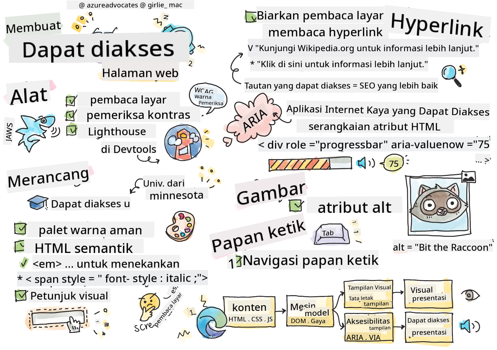

<!--
CO_OP_TRANSLATOR_METADATA:
{
  "original_hash": "e4cd5b1faed4adab5acf720f82798003",
  "translation_date": "2025-08-27T23:16:56+00:00",
  "source_file": "1-getting-started-lessons/3-accessibility/README.md",
  "language_code": "id"
}
-->
# Membuat Halaman Web yang Dapat Diakses


> Sketchnote oleh [Tomomi Imura](https://twitter.com/girlie_mac)

## Kuis Sebelum Pelajaran
[Kuis sebelum pelajaran](https://ashy-river-0debb7803.1.azurestaticapps.net/quiz/5)

> Kekuatan Web terletak pada universalitasnya. Akses oleh semua orang, terlepas dari disabilitas, adalah aspek yang penting.
>
> \- Sir Timothy Berners-Lee, Direktur W3C dan penemu World Wide Web

Kutipan ini dengan sempurna menyoroti pentingnya menciptakan situs web yang dapat diakses. Aplikasi yang tidak dapat diakses oleh semua orang secara definisi bersifat eksklusif. Sebagai pengembang web, kita harus selalu memikirkan aksesibilitas. Dengan fokus ini sejak awal, Anda akan berada di jalur yang tepat untuk memastikan semua orang dapat mengakses halaman yang Anda buat. Dalam pelajaran ini, Anda akan belajar tentang alat-alat yang dapat membantu memastikan aset web Anda dapat diakses dan bagaimana membangun dengan mempertimbangkan aksesibilitas.

> Anda dapat mengikuti pelajaran ini di [Microsoft Learn](https://docs.microsoft.com/learn/modules/web-development-101/accessibility/?WT.mc_id=academic-77807-sagibbon)!

## Alat yang Digunakan

### Pembaca Layar

Salah satu alat aksesibilitas yang paling dikenal adalah pembaca layar.

[Pembaca layar](https://en.wikipedia.org/wiki/Screen_reader) adalah klien yang umum digunakan oleh mereka yang memiliki gangguan penglihatan. Saat kita meluangkan waktu untuk memastikan browser menyampaikan informasi yang ingin kita bagikan, kita juga harus memastikan pembaca layar melakukan hal yang sama.

Secara dasar, pembaca layar akan membaca halaman dari atas ke bawah secara audio. Jika halaman Anda hanya berisi teks, pembaca akan menyampaikan informasi dengan cara yang mirip dengan browser. Tentu saja, halaman web jarang hanya berisi teks; mereka akan berisi tautan, grafik, warna, dan komponen visual lainnya. Perhatian harus diberikan untuk memastikan informasi ini dibaca dengan benar oleh pembaca layar.

Setiap pengembang web harus membiasakan diri dengan pembaca layar. Seperti yang disorot di atas, ini adalah klien yang akan digunakan oleh pengguna Anda. Sama seperti Anda terbiasa dengan cara kerja browser, Anda juga harus belajar cara kerja pembaca layar. Untungnya, pembaca layar sudah terintegrasi di sebagian besar sistem operasi.

Beberapa browser juga memiliki alat bawaan dan ekstensi yang dapat membaca teks dengan keras atau bahkan menyediakan beberapa fitur navigasi dasar, seperti [alat aksesibilitas di browser Edge](https://support.microsoft.com/help/4000734/microsoft-edge-accessibility-features). Ini juga merupakan alat aksesibilitas yang penting, tetapi berfungsi sangat berbeda dari pembaca layar dan tidak boleh dianggap sebagai alat pengujian pembaca layar.

✅ Cobalah pembaca layar dan pembaca teks di browser. Di Windows, [Narrator](https://support.microsoft.com/windows/complete-guide-to-narrator-e4397a0d-ef4f-b386-d8ae-c172f109bdb1/?WT.mc_id=academic-77807-sagibbon) sudah termasuk secara default, dan [JAWS](https://webaim.org/articles/jaws/) serta [NVDA](https://www.nvaccess.org/about-nvda/) juga dapat diinstal. Di macOS dan iOS, [VoiceOver](https://support.apple.com/guide/voiceover/welcome/10) sudah terinstal secara default.

### Zoom

Alat lain yang sering digunakan oleh orang dengan gangguan penglihatan adalah zoom. Jenis zoom yang paling dasar adalah zoom statis, yang dikontrol melalui `Control + tanda plus (+)` atau dengan menurunkan resolusi layar. Jenis zoom ini menyebabkan seluruh halaman berubah ukuran, sehingga menggunakan [desain responsif](https://developer.mozilla.org/docs/Learn/CSS/CSS_layout/Responsive_Design) penting untuk memberikan pengalaman pengguna yang baik pada tingkat zoom yang lebih tinggi.

Jenis zoom lainnya mengandalkan perangkat lunak khusus untuk memperbesar satu area layar dan menggeser, mirip dengan menggunakan kaca pembesar sungguhan. Di Windows, [Magnifier](https://support.microsoft.com/windows/use-magnifier-to-make-things-on-the-screen-easier-to-see-414948ba-8b1c-d3bd-8615-0e5e32204198) sudah terintegrasi, dan [ZoomText](https://www.freedomscientific.com/training/zoomtext/getting-started/) adalah perangkat lunak pembesar pihak ketiga dengan lebih banyak fitur dan basis pengguna yang lebih besar. Baik macOS maupun iOS memiliki perangkat lunak pembesar bawaan yang disebut [Zoom](https://www.apple.com/accessibility/mac/vision/).

### Pemeriksa Kontras

Warna pada situs web perlu dipilih dengan hati-hati untuk memenuhi kebutuhan pengguna yang buta warna atau orang yang kesulitan melihat warna dengan kontras rendah.

✅ Uji situs web yang Anda sukai untuk penggunaan warna dengan ekstensi browser seperti [pemeriksa warna WCAG](https://microsoftedge.microsoft.com/addons/detail/wcag-color-contrast-check/idahaggnlnekelhgplklhfpchbfdmkjp?hl=en-US&WT.mc_id=academic-77807-sagibbon). Apa yang Anda pelajari?

### Lighthouse

Di area alat pengembang browser Anda, Anda akan menemukan alat Lighthouse. Alat ini penting untuk mendapatkan pandangan awal tentang aksesibilitas (serta analisis lainnya) dari sebuah situs web. Meskipun penting untuk tidak hanya mengandalkan Lighthouse, skor 100% sangat membantu sebagai dasar.

✅ Temukan Lighthouse di panel alat pengembang browser Anda dan jalankan analisis pada situs apa pun. Apa yang Anda temukan?

## Merancang untuk Aksesibilitas

Aksesibilitas adalah topik yang cukup besar. Untuk membantu Anda, tersedia banyak sumber daya.

- [Accessible U - University of Minnesota](https://accessibility.umn.edu/your-role/web-developers)

Meskipun kita tidak akan dapat membahas setiap aspek dalam menciptakan situs yang dapat diakses, di bawah ini adalah beberapa prinsip inti yang ingin Anda terapkan. Merancang halaman yang dapat diakses sejak awal **selalu** lebih mudah daripada kembali ke halaman yang sudah ada untuk membuatnya dapat diakses.

## Prinsip Tampilan yang Baik

### Palet Warna yang Aman

Orang melihat dunia dengan cara yang berbeda, termasuk warna. Saat memilih skema warna untuk situs Anda, Anda harus memastikan bahwa skema tersebut dapat diakses oleh semua orang. Salah satu [alat yang bagus untuk menghasilkan palet warna adalah Color Safe](http://colorsafe.co/).

✅ Identifikasi situs web yang sangat bermasalah dalam penggunaan warnanya. Mengapa?

### Gunakan HTML yang Tepat

Dengan CSS dan JavaScript, dimungkinkan untuk membuat elemen apa pun terlihat seperti jenis kontrol apa pun. `<span>` dapat digunakan untuk membuat `<button>`, dan `<b>` dapat menjadi hyperlink. Meskipun ini mungkin dianggap lebih mudah untuk diatur gaya, ini tidak menyampaikan apa pun kepada pembaca layar. Gunakan HTML yang sesuai saat membuat kontrol pada halaman. Jika Anda ingin membuat hyperlink, gunakan `<a>`. Menggunakan HTML yang tepat untuk kontrol yang tepat disebut menggunakan Semantic HTML.

✅ Kunjungi situs web mana pun dan lihat apakah desainer dan pengembang menggunakan HTML dengan benar. Bisakah Anda menemukan tombol yang seharusnya menjadi tautan? Petunjuk: klik kanan dan pilih 'View Page Source' di browser Anda untuk melihat kode yang mendasarinya.

### Buat Hierarki Judul yang Deskriptif

Pengguna pembaca layar [sangat bergantung pada judul](https://webaim.org/projects/screenreadersurvey8/#finding) untuk menemukan informasi dan menavigasi melalui halaman. Menulis konten judul yang deskriptif dan menggunakan tag judul semantik penting untuk menciptakan situs yang mudah dinavigasi bagi pengguna pembaca layar.

### Gunakan Petunjuk Visual yang Baik

CSS menawarkan kontrol penuh atas tampilan elemen apa pun pada halaman. Anda dapat membuat kotak teks tanpa garis luar atau hyperlink tanpa garis bawah. Sayangnya, menghapus petunjuk tersebut dapat membuat seseorang yang bergantung padanya lebih sulit mengenali jenis kontrol.

## Pentingnya Teks Tautan

Hyperlink adalah inti dari navigasi web. Oleh karena itu, memastikan pembaca layar dapat membaca tautan dengan benar memungkinkan semua pengguna untuk menavigasi situs Anda.

### Pembaca Layar dan Tautan

Seperti yang Anda harapkan, pembaca layar membaca teks tautan dengan cara yang sama seperti mereka membaca teks lain di halaman. Dengan pemikiran ini, teks yang ditunjukkan di bawah ini mungkin terasa sepenuhnya dapat diterima.

> Penguin kecil, kadang-kadang dikenal sebagai penguin peri, adalah penguin terkecil di dunia. [Klik di sini](https://en.wikipedia.org/wiki/Little_penguin) untuk informasi lebih lanjut.

> Penguin kecil, kadang-kadang dikenal sebagai penguin peri, adalah penguin terkecil di dunia. Kunjungi https://en.wikipedia.org/wiki/Little_penguin untuk informasi lebih lanjut.

> **NOTE** Seperti yang akan Anda baca, Anda seharusnya **tidak pernah** membuat tautan yang terlihat seperti di atas.

Ingat, pembaca layar adalah antarmuka yang berbeda dari browser dengan serangkaian fitur yang berbeda.

### Masalah dengan Menggunakan URL

Pembaca layar membaca teks. Jika URL muncul dalam teks, pembaca layar akan membaca URL tersebut. Secara umum, URL tidak menyampaikan informasi yang bermakna, dan dapat terdengar mengganggu. Anda mungkin pernah mengalami ini jika ponsel Anda pernah membaca pesan teks dengan URL secara audio.

### Masalah dengan "klik di sini"

Pembaca layar juga memiliki kemampuan untuk hanya membaca hyperlink pada halaman, seperti cara orang yang melihat akan memindai halaman untuk tautan. Jika teks tautan selalu "klik di sini", semua yang akan didengar pengguna adalah "klik di sini, klik di sini, klik di sini, klik di sini, klik di sini, ..." Semua tautan sekarang tidak dapat dibedakan satu sama lain.

### Teks Tautan yang Baik

Teks tautan yang baik secara singkat menjelaskan apa yang ada di sisi lain tautan. Dalam contoh di atas yang berbicara tentang penguin kecil, tautan tersebut menuju halaman Wikipedia tentang spesies tersebut. Frasa *penguin kecil* akan menjadi teks tautan yang sempurna karena membuatnya jelas apa yang akan dipelajari seseorang jika mereka mengklik tautan tersebut - penguin kecil.

> [Penguin kecil](https://en.wikipedia.org/wiki/Little_penguin), kadang-kadang dikenal sebagai penguin peri, adalah penguin terkecil di dunia.

✅ Jelajahi web selama beberapa menit untuk menemukan halaman yang menggunakan strategi tautan yang tidak jelas. Bandingkan dengan situs lain yang memiliki tautan lebih baik. Apa yang Anda pelajari?

#### Catatan Mesin Pencari

Sebagai bonus tambahan untuk memastikan situs Anda dapat diakses oleh semua orang, Anda akan membantu mesin pencari menavigasi situs Anda juga. Mesin pencari menggunakan teks tautan untuk mempelajari topik halaman. Jadi menggunakan teks tautan yang baik membantu semua orang!

### ARIA

Bayangkan halaman berikut:

| Produk       | Deskripsi          | Pesan        |
| ------------ | ------------------ | ------------ |
| Widget       | [Deskripsi](../../../../1-getting-started-lessons/3-accessibility/')   | [Pesan](../../../../1-getting-started-lessons/3-accessibility/') |
| Super widget | [Deskripsi](../../../../1-getting-started-lessons/3-accessibility/')   | [Pesan](../../../../1-getting-started-lessons/3-accessibility/') |

Dalam contoh ini, menggandakan teks deskripsi dan pesan masuk akal bagi seseorang yang menggunakan browser. Namun, seseorang yang menggunakan pembaca layar hanya akan mendengar kata *deskripsi* dan *pesan* berulang kali tanpa konteks.

Untuk mendukung jenis skenario ini, HTML mendukung serangkaian atribut yang dikenal sebagai [Accessible Rich Internet Applications (ARIA)](https://developer.mozilla.org/docs/Web/Accessibility/ARIA). Atribut ini memungkinkan Anda memberikan informasi tambahan kepada pembaca layar.

> **NOTE**: Seperti banyak aspek HTML, dukungan browser dan pembaca layar dapat bervariasi. Namun, sebagian besar klien utama mendukung atribut ARIA.

Anda dapat menggunakan `aria-label` untuk menjelaskan tautan ketika format halaman tidak memungkinkan Anda melakukannya. Deskripsi untuk widget dapat diatur sebagai

``` html
<a href="#" aria-label="Widget description">description</a>
```

✅ Secara umum, menggunakan markup Semantik seperti yang dijelaskan di atas lebih baik daripada menggunakan ARIA, tetapi terkadang tidak ada padanan semantik untuk berbagai widget HTML. Contoh yang baik adalah Tree. Tidak ada padanan HTML untuk tree, jadi Anda mengidentifikasi `<div>` generik untuk elemen ini dengan peran dan nilai ARIA yang sesuai. [Dokumentasi MDN tentang ARIA](https://developer.mozilla.org/docs/Web/Accessibility/ARIA) berisi informasi yang lebih berguna.

```html
<h2 id="tree-label">File Viewer</h2>
<div role="tree" aria-labelledby="tree-label">
  <div role="treeitem" aria-expanded="false" tabindex="0">Uploads</div>
</div>
```

## Gambar

Sudah jelas bahwa pembaca layar tidak dapat secara otomatis membaca apa yang ada dalam gambar. Memastikan gambar dapat diakses tidak membutuhkan banyak usaha - itulah tujuan atribut `alt`. Semua gambar yang bermakna harus memiliki `alt` untuk menjelaskan apa itu.
Gambar yang hanya bersifat dekoratif harus memiliki atribut `alt` yang diatur ke string kosong: `alt=""`. Ini mencegah pembaca layar mengumumkan gambar dekoratif secara tidak perlu.

✅ Seperti yang Anda harapkan, mesin pencari juga tidak dapat memahami apa yang ada dalam gambar. Mereka juga menggunakan teks alt. Jadi sekali lagi, memastikan halaman Anda dapat diakses memberikan bonus tambahan!

## Keyboard

Beberapa pengguna tidak dapat menggunakan mouse atau trackpad, melainkan mengandalkan interaksi keyboard untuk berpindah dari satu elemen ke elemen berikutnya. Penting bagi situs web Anda untuk menyajikan konten Anda dalam urutan yang logis sehingga pengguna keyboard dapat mengakses setiap elemen interaktif saat mereka bergerak ke bawah dokumen. Jika Anda membangun halaman web Anda dengan markup semantik dan menggunakan CSS untuk mengatur tata letak visualnya, situs Anda seharusnya dapat dinavigasi dengan keyboard, tetapi penting untuk menguji aspek ini secara manual. Pelajari lebih lanjut tentang [strategi navigasi keyboard](https://webaim.org/techniques/keyboard/).

✅ Kunjungi situs web mana pun dan coba navigasikan hanya menggunakan keyboard Anda. Apa yang berhasil, apa yang tidak berhasil? Mengapa?

## Ringkasan

Web yang hanya dapat diakses oleh sebagian orang bukanlah 'world-wide web' yang sesungguhnya. Cara terbaik untuk memastikan situs yang Anda buat dapat diakses adalah dengan mengintegrasikan praktik terbaik aksesibilitas sejak awal. Meskipun ada langkah tambahan yang terlibat, mengintegrasikan keterampilan ini ke dalam alur kerja Anda sekarang akan memastikan semua halaman yang Anda buat dapat diakses.

---

## 🚀 Tantangan

Ambil HTML ini dan tulis ulang agar dapat diakses semaksimal mungkin, berdasarkan strategi yang telah Anda pelajari.

```html
<!DOCTYPE html>
<html>
  <head>
    <title>
      Example
    </title>
    <link href='../assets/style.css' rel='stylesheet' type='text/css'>
  </head>
  <body>
    <div class="site-header">
      <p class="site-title">Turtle Ipsum</p>
      <p class="site-subtitle">The World's Premier Turtle Fan Club</p>
    </div>
    <div class="main-nav">
      <p class="nav-header">Resources</p>
      <div class="nav-list">
        <p class="nav-item nav-item-bull"><a href="https://www.youtube.com/watch?v=CMNry4PE93Y">"I like turtles"</a></p>
        <p class="nav-item nav-item-bull"><a href="https://en.wikipedia.org/wiki/Turtle">Basic Turtle Info</a></p>
        <p class="nav-item nav-item-bull"><a href="https://en.wikipedia.org/wiki/Turtles_(chocolate)">Chocolate Turtles</a></p>
      </div>
    </div>
    <div class="main-content">
      <div>
        <p class="page-title">Welcome to Turtle Ipsum. 
            <a href="">Click here</a> to learn more.
        </p>
        <p class="article-text">
          Turtle ipsum dolor sit amet, consectetur adipiscing elit, sed do eiusmod tempor incididunt ut labore et dolore magna aliqua. Ut enim ad minim veniam, quis nostrud exercitation ullamco laboris nisi ut aliquip ex ea commodo consequat. Duis aute irure dolor in reprehenderit in voluptate velit esse cillum dolore eu fugiat nulla pariatur. Excepteur sint occaecat cupidatat non proident, sunt in culpa qui officia deserunt mollit anim id est laborum
        </p>
      </div>
    </div>
    <div class="footer">
      <div class="footer-section">
        <span class="button">Sign up for turtle news</span>
      </div><div class="footer-section">
        <p class="nav-header footer-title">
          Internal Pages
        </p>
        <div class="nav-list">
          <p class="nav-item nav-item-bull"><a href="../">Index</a></p>
          <p class="nav-item nav-item-bull"><a href="../semantic">Semantic Example</a></p>
        </div>
      </div>
      <p class="footer-copyright">&copy; 2016 Instrument</span>
    </div>
  </body>
</html>
```

## Kuis Setelah Pelajaran
[Kuis setelah pelajaran](https://ashy-river-0debb7803.1.azurestaticapps.net/quiz/6)

## Tinjauan & Studi Mandiri
Banyak pemerintah memiliki undang-undang terkait persyaratan aksesibilitas. Pelajari undang-undang aksesibilitas di negara asal Anda. Apa saja yang tercakup, dan apa yang tidak? Contohnya adalah [situs web pemerintah ini](https://accessibility.blog.gov.uk/).

## Tugas
 
[Analisis situs web yang tidak aksesibel](assignment.md)

Kredit: [Turtle Ipsum](https://github.com/Instrument/semantic-html-sample) oleh Instrument

---

**Penafian**:  
Dokumen ini telah diterjemahkan menggunakan layanan penerjemahan AI [Co-op Translator](https://github.com/Azure/co-op-translator). Meskipun kami berusaha untuk memberikan hasil yang akurat, harap diingat bahwa terjemahan otomatis mungkin mengandung kesalahan atau ketidakakuratan. Dokumen asli dalam bahasa aslinya harus dianggap sebagai sumber yang otoritatif. Untuk informasi yang bersifat kritis, disarankan menggunakan jasa penerjemahan profesional oleh manusia. Kami tidak bertanggung jawab atas kesalahpahaman atau penafsiran yang keliru yang timbul dari penggunaan terjemahan ini.