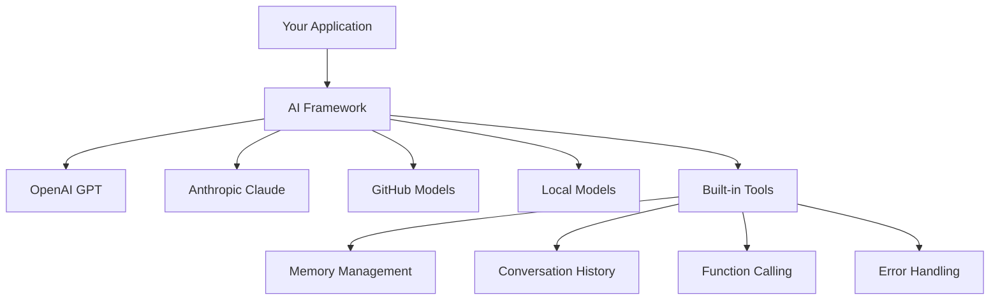
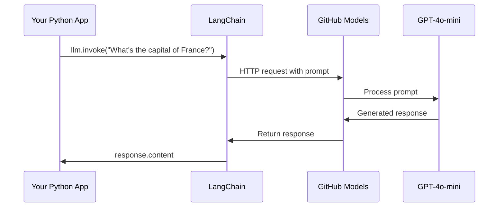
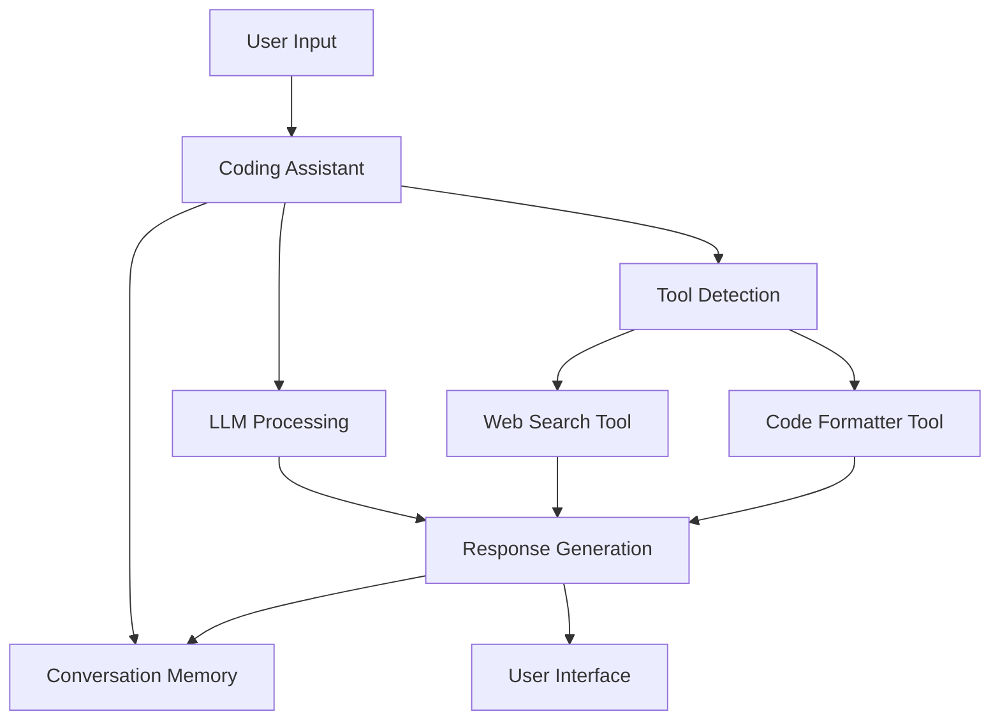
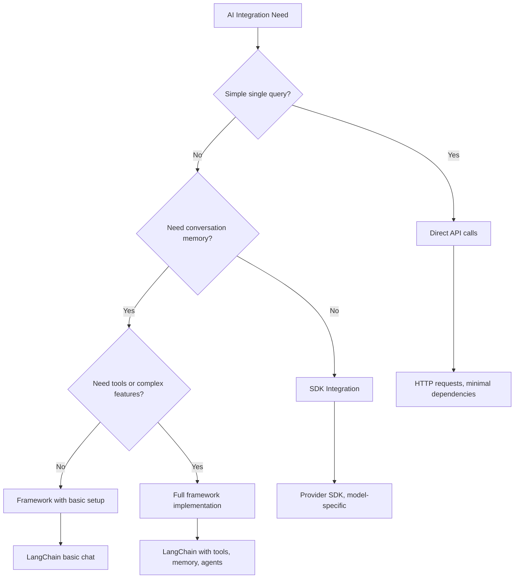

<!--
CO_OP_TRANSLATOR_METADATA:
{
  "original_hash": "e2c4ae5688e34b4b8b09d52aec56c79e",
  "translation_date": "2025-10-24T14:03:24+00:00",
  "source_file": "10-ai-framework-project/README.md",
  "language_code": "id"
}
-->
# Kerangka AI

Pernah merasa kewalahan saat mencoba membangun aplikasi AI dari awal? Kamu tidak sendirian! Kerangka AI seperti pisau Swiss Army untuk pengembangan AI - alat yang sangat berguna yang dapat menghemat waktu dan mengurangi kerumitan saat membangun aplikasi cerdas. Anggaplah kerangka AI sebagai perpustakaan yang terorganisir dengan baik: ia menyediakan komponen yang sudah dibuat sebelumnya, API yang standar, dan abstraksi yang cerdas sehingga kamu bisa fokus pada pemecahan masalah daripada bergulat dengan detail implementasi.

Dalam pelajaran ini, kita akan mengeksplorasi bagaimana kerangka seperti LangChain dapat mengubah tugas integrasi AI yang dulunya rumit menjadi kode yang bersih dan mudah dibaca. Kamu akan belajar cara menghadapi tantangan dunia nyata seperti melacak percakapan, menerapkan pemanggilan alat, dan mengelola berbagai model AI melalui satu antarmuka terpadu.

Pada akhir pelajaran ini, kamu akan tahu kapan harus menggunakan kerangka daripada panggilan API mentah, cara menggunakan abstraksi mereka secara efektif, dan cara membangun aplikasi AI yang siap digunakan di dunia nyata. Mari kita eksplorasi apa yang bisa dilakukan kerangka AI untuk proyekmu.

## Mengapa memilih kerangka?

Jadi, kamu siap membangun aplikasi AI - luar biasa! Tapi begini, ada beberapa jalur berbeda yang bisa kamu ambil, dan masing-masing memiliki kelebihan dan kekurangannya sendiri. Ini seperti memilih antara berjalan kaki, bersepeda, atau mengemudi untuk sampai ke suatu tempat - semuanya akan membawamu ke sana, tetapi pengalaman (dan usaha) akan sangat berbeda.

Mari kita uraikan tiga cara utama untuk mengintegrasikan AI ke dalam proyekmu:

| Pendekatan | Keuntungan | Terbaik Untuk | Pertimbangan |
|------------|------------|---------------|--------------|
| **Permintaan HTTP Langsung** | Kontrol penuh, tanpa ketergantungan | Kueri sederhana, belajar dasar-dasar | Kode lebih panjang, penanganan kesalahan manual |
| **Integrasi SDK** | Lebih sedikit kode boilerplate, optimasi model spesifik | Aplikasi model tunggal | Terbatas pada penyedia tertentu |
| **Kerangka AI** | API terpadu, abstraksi bawaan | Aplikasi multi-model, alur kerja kompleks | Kurva pembelajaran, potensi abstraksi berlebihan |

### Manfaat Kerangka dalam Praktik



**Mengapa kerangka penting:**
- **Menyatukan** beberapa penyedia AI di bawah satu antarmuka
- **Menangani** memori percakapan secara otomatis
- **Menyediakan** alat siap pakai untuk tugas umum seperti embeddings dan pemanggilan fungsi
- **Mengelola** penanganan kesalahan dan logika pengulangan
- **Mengubah** alur kerja kompleks menjadi panggilan metode yang mudah dibaca

> 💡 **Tips Pro**: Gunakan kerangka saat beralih antara model AI yang berbeda atau membangun fitur kompleks seperti agen, memori, atau pemanggilan alat. Tetap gunakan API langsung saat belajar dasar-dasar atau membangun aplikasi sederhana yang terfokus.

**Kesimpulan**: Seperti memilih antara alat khusus pengrajin dan bengkel lengkap, ini tentang mencocokkan alat dengan tugas. Kerangka unggul untuk aplikasi yang kompleks dan kaya fitur, sementara API langsung bekerja dengan baik untuk kasus penggunaan yang sederhana.

## Pendahuluan

Dalam pelajaran ini, kita akan belajar untuk:

- Menggunakan kerangka AI umum.
- Mengatasi masalah umum seperti percakapan chat, penggunaan alat, memori, dan konteks.
- Memanfaatkan ini untuk membangun aplikasi AI.

## Prompt AI pertamamu

Mari kita mulai dengan dasar-dasar dengan membuat aplikasi AI pertama yang mengirimkan pertanyaan dan mendapatkan jawaban. Seperti Archimedes yang menemukan prinsip perpindahan di bak mandinya, kadang-kadang pengamatan paling sederhana menghasilkan wawasan paling kuat - dan kerangka membuat wawasan ini mudah diakses.

### Menyiapkan LangChain dengan Model GitHub

Kita akan menggunakan LangChain untuk terhubung ke Model GitHub, yang sangat keren karena memberikan akses gratis ke berbagai model AI. Bagian terbaiknya? Kamu hanya membutuhkan beberapa parameter konfigurasi sederhana untuk memulai:

```python
from langchain_openai import ChatOpenAI
import os

llm = ChatOpenAI(
    api_key=os.environ["GITHUB_TOKEN"],
    base_url="https://models.github.ai/inference",
    model="openai/gpt-4o-mini",
)

# Send a simple prompt
response = llm.invoke("What's the capital of France?")
print(response.content)
```

**Mari kita uraikan apa yang terjadi di sini:**
- **Membuat** klien LangChain menggunakan kelas `ChatOpenAI` - ini adalah pintu masukmu ke AI!
- **Mengonfigurasi** koneksi ke Model GitHub dengan token autentikasi
- **Menentukan** model AI yang akan digunakan (`gpt-4o-mini`) - anggap ini seperti memilih asisten AI-mu
- **Mengirimkan** pertanyaanmu menggunakan metode `invoke()` - di sinilah keajaiban terjadi
- **Menarik** dan menampilkan respons - dan voilà, kamu sedang berbicara dengan AI!

> 🔧 **Catatan Pengaturan**: Jika kamu menggunakan GitHub Codespaces, kamu beruntung - `GITHUB_TOKEN` sudah diatur untukmu! Bekerja secara lokal? Jangan khawatir, kamu hanya perlu membuat token akses pribadi dengan izin yang tepat.

**Output yang diharapkan:**
```text
The capital of France is Paris.
```



## Membangun AI percakapan

Contoh pertama ini menunjukkan dasar-dasarnya, tetapi ini hanya satu pertukaran - kamu mengajukan pertanyaan, mendapatkan jawaban, dan selesai. Dalam aplikasi nyata, kamu ingin AI-mu mengingat apa yang telah kamu diskusikan, seperti bagaimana Watson dan Holmes membangun percakapan investigatif mereka dari waktu ke waktu.

Di sinilah LangChain menjadi sangat berguna. Ia menyediakan berbagai jenis pesan yang membantu menyusun percakapan dan memungkinkanmu memberikan kepribadian pada AI-mu. Kamu akan membangun pengalaman chat yang mempertahankan konteks dan karakter.

### Memahami jenis pesan

Anggaplah jenis pesan ini sebagai "topi" berbeda yang dikenakan peserta dalam percakapan. LangChain menggunakan berbagai kelas pesan untuk melacak siapa yang mengatakan apa:

| Jenis Pesan | Tujuan | Contoh Penggunaan |
|-------------|--------|-------------------|
| `SystemMessage` | Mendefinisikan kepribadian dan perilaku AI | "Kamu adalah asisten coding yang membantu" |
| `HumanMessage` | Mewakili input pengguna | "Jelaskan cara kerja fungsi" |
| `AIMessage` | Menyimpan respons AI | Respons AI sebelumnya dalam percakapan |

### Membuat percakapan pertamamu

Mari kita buat percakapan di mana AI kita mengambil peran tertentu. Kita akan membuatnya menjadi Kapten Picard - karakter yang dikenal karena kebijaksanaan diplomatik dan kepemimpinannya:

```python
messages = [
    SystemMessage(content="You are Captain Picard of the Starship Enterprise"),
    HumanMessage(content="Tell me about you"),
]
```

**Menguraikan pengaturan percakapan ini:**
- **Menetapkan** peran dan kepribadian AI melalui `SystemMessage`
- **Memberikan** kueri awal pengguna melalui `HumanMessage`
- **Membuat** dasar untuk percakapan multi-putaran

Kode lengkap untuk contoh ini terlihat seperti ini:

```python
from langchain_core.messages import HumanMessage, SystemMessage
from langchain_openai import ChatOpenAI
import os

llm = ChatOpenAI(
    api_key=os.environ["GITHUB_TOKEN"],
    base_url="https://models.github.ai/inference",
    model="openai/gpt-4o-mini",
)

messages = [
    SystemMessage(content="You are Captain Picard of the Starship Enterprise"),
    HumanMessage(content="Tell me about you"),
]


# works
response  = llm.invoke(messages)
print(response.content)
```

Kamu akan melihat hasil yang mirip dengan:

```text
I am Captain Jean-Luc Picard, the commanding officer of the USS Enterprise (NCC-1701-D), a starship in the United Federation of Planets. My primary mission is to explore new worlds, seek out new life and new civilizations, and boldly go where no one has gone before. 

I believe in the importance of diplomacy, reason, and the pursuit of knowledge. My crew is diverse and skilled, and we often face challenges that test our resolve, ethics, and ingenuity. Throughout my career, I have encountered numerous species, grappled with complex moral dilemmas, and have consistently sought peaceful solutions to conflicts.

I hold the ideals of the Federation close to my heart, believing in the importance of cooperation, understanding, and respect for all sentient beings. My experiences have shaped my leadership style, and I strive to be a thoughtful and just captain. How may I assist you further?
```

Untuk menjaga kesinambungan percakapan (daripada mengatur ulang konteks setiap kali), kamu perlu terus menambahkan respons ke daftar pesanmu. Seperti tradisi lisan yang melestarikan cerita dari generasi ke generasi, pendekatan ini membangun memori yang tahan lama:

```python
from langchain_core.messages import HumanMessage, SystemMessage
from langchain_openai import ChatOpenAI
import os

llm = ChatOpenAI(
    api_key=os.environ["GITHUB_TOKEN"],
    base_url="https://models.github.ai/inference",
    model="openai/gpt-4o-mini",
)

messages = [
    SystemMessage(content="You are Captain Picard of the Starship Enterprise"),
    HumanMessage(content="Tell me about you"),
]


# works
response  = llm.invoke(messages)

print(response.content)

print("---- Next ----")

messages.append(response)
messages.append(HumanMessage(content="Now that I know about you, I'm Chris, can I be in your crew?"))

response  = llm.invoke(messages)

print(response.content)

```

Cukup keren, bukan? Yang terjadi di sini adalah kita memanggil LLM dua kali - pertama dengan hanya dua pesan awal kita, tetapi kemudian lagi dengan seluruh riwayat percakapan. Ini seperti AI benar-benar mengikuti percakapan kita!

Saat kamu menjalankan kode ini, kamu akan mendapatkan respons kedua yang terdengar seperti:

```text
Welcome aboard, Chris! It's always a pleasure to meet those who share a passion for exploration and discovery. While I cannot formally offer you a position on the Enterprise right now, I encourage you to pursue your aspirations. We are always in need of talented individuals with diverse skills and backgrounds. 

If you are interested in space exploration, consider education and training in the sciences, engineering, or diplomacy. The values of curiosity, resilience, and teamwork are crucial in Starfleet. Should you ever find yourself on a starship, remember to uphold the principles of the Federation: peace, understanding, and respect for all beings. Your journey can lead you to remarkable adventures, whether in the stars or on the ground. Engage!
```

Saya anggap itu sebagai mungkin ;)

## Streaming respons

Pernah memperhatikan bagaimana ChatGPT tampaknya "mengetik" responsnya secara real-time? Itulah streaming dalam aksi. Seperti melihat seorang kaligrafer terampil bekerja - melihat karakter muncul goresan demi goresan daripada langsung muncul - streaming membuat interaksi terasa lebih alami dan memberikan umpan balik langsung.

### Menerapkan streaming dengan LangChain

```python
from langchain_openai import ChatOpenAI
import os

llm = ChatOpenAI(
    api_key=os.environ["GITHUB_TOKEN"],
    base_url="https://models.github.ai/inference",
    model="openai/gpt-4o-mini",
    streaming=True
)

# Stream the response
for chunk in llm.stream("Write a short story about a robot learning to code"):
    print(chunk.content, end="", flush=True)
```

**Mengapa streaming luar biasa:**
- **Menampilkan** konten saat sedang dibuat - tidak ada lagi menunggu canggung!
- **Membuat** pengguna merasa seperti ada sesuatu yang benar-benar terjadi
- **Terasa** lebih cepat, bahkan ketika secara teknis tidak
- **Memungkinkan** pengguna mulai membaca sementara AI masih "berpikir"

> 💡 **Tips Pengalaman Pengguna**: Streaming benar-benar bersinar saat kamu berurusan dengan respons yang lebih panjang seperti penjelasan kode, penulisan kreatif, atau tutorial yang mendetail. Pengguna akan menyukai melihat kemajuan daripada menatap layar kosong!

## Template prompt

Template prompt bekerja seperti struktur retorika yang digunakan dalam orasi klasik - pikirkan bagaimana Cicero akan menyesuaikan pola pidatonya untuk audiens yang berbeda sambil mempertahankan kerangka persuasif yang sama. Mereka memungkinkanmu membuat prompt yang dapat digunakan kembali di mana kamu dapat mengganti bagian informasi yang berbeda tanpa menulis ulang semuanya. Setelah kamu mengatur template, kamu hanya perlu mengisi variabel dengan nilai yang kamu butuhkan.

### Membuat prompt yang dapat digunakan kembali

```python
from langchain_core.prompts import ChatPromptTemplate

# Define a template for code explanations
template = ChatPromptTemplate.from_messages([
    ("system", "You are an expert programming instructor. Explain concepts clearly with examples."),
    ("human", "Explain {concept} in {language} with a practical example for {skill_level} developers")
])

# Use the template with different values
questions = [
    {"concept": "functions", "language": "JavaScript", "skill_level": "beginner"},
    {"concept": "classes", "language": "Python", "skill_level": "intermediate"},
    {"concept": "async/await", "language": "JavaScript", "skill_level": "advanced"}
]

for question in questions:
    prompt = template.format_messages(**question)
    response = llm.invoke(prompt)
    print(f"Topic: {question['concept']}\n{response.content}\n---\n")
```

**Mengapa kamu akan menyukai menggunakan template:**
- **Menjaga** promptmu konsisten di seluruh aplikasi
- **Tidak ada lagi** penggabungan string yang berantakan - hanya variabel yang bersih dan sederhana
- **AI-mu** berperilaku secara prediktif karena struktur tetap sama
- **Pembaruan** menjadi mudah - ubah template sekali, dan itu diperbaiki di mana-mana

## Output terstruktur

Pernah merasa frustrasi mencoba memparsing respons AI yang kembali sebagai teks tidak terstruktur? Output terstruktur seperti mengajarkan AI-mu untuk mengikuti pendekatan sistematis yang digunakan Linnaeus untuk klasifikasi biologis - terorganisir, dapat diprediksi, dan mudah digunakan. Kamu dapat meminta JSON, struktur data tertentu, atau format apa pun yang kamu butuhkan.

### Mendefinisikan skema output

```python
from langchain_core.prompts import ChatPromptTemplate
from langchain_core.output_parsers import JsonOutputParser
from pydantic import BaseModel, Field

class CodeReview(BaseModel):
    score: int = Field(description="Code quality score from 1-10")
    strengths: list[str] = Field(description="List of code strengths")
    improvements: list[str] = Field(description="List of suggested improvements")
    overall_feedback: str = Field(description="Summary feedback")

# Set up the parser
parser = JsonOutputParser(pydantic_object=CodeReview)

# Create prompt with format instructions
prompt = ChatPromptTemplate.from_messages([
    ("system", "You are a code reviewer. {format_instructions}"),
    ("human", "Review this code: {code}")
])

# Format the prompt with instructions
chain = prompt | llm | parser

# Get structured response
code_sample = """
def calculate_average(numbers):
    return sum(numbers) / len(numbers)
"""

result = chain.invoke({
    "code": code_sample,
    "format_instructions": parser.get_format_instructions()
})

print(f"Score: {result['score']}")
print(f"Strengths: {', '.join(result['strengths'])}")
```

**Mengapa output terstruktur adalah pengubah permainan:**
- **Tidak ada lagi** menebak format yang akan kamu dapatkan - ini konsisten setiap saat
- **Langsung terhubung** ke database dan API-mu tanpa pekerjaan tambahan
- **Menangkap** respons AI yang aneh sebelum mereka merusak aplikasi
- **Membuat** kode lebih bersih karena kamu tahu persis apa yang kamu kerjakan

## Pemanggilan alat

Sekarang kita sampai pada salah satu fitur paling kuat: alat. Inilah cara kamu memberikan kemampuan praktis pada AI-mu di luar percakapan. Seperti bagaimana serikat pekerja abad pertengahan mengembangkan alat khusus untuk kerajinan tertentu, kamu dapat melengkapi AI-mu dengan instrumen yang terfokus. Kamu menjelaskan alat apa yang tersedia, dan ketika seseorang meminta sesuatu yang cocok, AI-mu dapat mengambil tindakan.

### Menggunakan Python

Mari kita tambahkan beberapa alat seperti ini:

```python
from typing_extensions import Annotated, TypedDict

class add(TypedDict):
    """Add two integers."""

    # Annotations must have the type and can optionally include a default value and description (in that order).
    a: Annotated[int, ..., "First integer"]
    b: Annotated[int, ..., "Second integer"]

tools = [add]

functions = {
    "add": lambda a, b: a + b
}
```

Jadi apa yang terjadi di sini? Kita membuat cetak biru untuk alat bernama `add`. Dengan mewarisi dari `TypedDict` dan menggunakan tipe `Annotated` yang canggih untuk `a` dan `b`, kita memberikan LLM gambaran yang jelas tentang apa yang dilakukan alat ini dan apa yang dibutuhkan. Kamus `functions` seperti kotak alat kita - ini memberi tahu kode kita persis apa yang harus dilakukan ketika AI memutuskan untuk menggunakan alat tertentu.

Mari kita lihat bagaimana kita memanggil LLM dengan alat ini selanjutnya:

```python
llm = ChatOpenAI(
    api_key=os.environ["GITHUB_TOKEN"],
    base_url="https://models.github.ai/inference",
    model="openai/gpt-4o-mini",
)

llm_with_tools = llm.bind_tools(tools)
```

Di sini kita memanggil `bind_tools` dengan array `tools` kita dan dengan demikian LLM `llm_with_tools` sekarang memiliki pengetahuan tentang alat ini.

Untuk menggunakan LLM baru ini, kita dapat mengetik kode berikut:

```python
query = "What is 3 + 12?"

res = llm_with_tools.invoke(query)
if(res.tool_calls):
    for tool in res.tool_calls:
        print("TOOL CALL: ", functions[tool["name"]](../../../10-ai-framework-project/**tool["args"]))
print("CONTENT: ",res.content)
```

Sekarang setelah kita memanggil `invoke` pada llm baru ini, yang memiliki alat, kita mungkin melihat properti `tool_calls` terisi. Jika ya, alat yang diidentifikasi memiliki properti `name` dan `args` yang mengidentifikasi alat apa yang harus dipanggil dan dengan argumen. Kode lengkapnya terlihat seperti ini:

```python
from langchain_core.messages import HumanMessage, SystemMessage
from langchain_openai import ChatOpenAI
import os
from typing_extensions import Annotated, TypedDict

class add(TypedDict):
    """Add two integers."""

    # Annotations must have the type and can optionally include a default value and description (in that order).
    a: Annotated[int, ..., "First integer"]
    b: Annotated[int, ..., "Second integer"]

tools = [add]

functions = {
    "add": lambda a, b: a + b
}

llm = ChatOpenAI(
    api_key=os.environ["GITHUB_TOKEN"],
    base_url="https://models.github.ai/inference",
    model="openai/gpt-4o-mini",
)

llm_with_tools = llm.bind_tools(tools)

query = "What is 3 + 12?"

res = llm_with_tools.invoke(query)
if(res.tool_calls):
    for tool in res.tool_calls:
        print("TOOL CALL: ", functions[tool["name"]](../../../10-ai-framework-project/**tool["args"]))
print("CONTENT: ",res.content)
```

Menjalankan kode ini, kamu akan melihat output yang mirip dengan:

```text
TOOL CALL:  15
CONTENT: 
```

AI memeriksa "Berapa 3 + 12" dan mengenali ini sebagai tugas untuk alat `add`. Seperti bagaimana pustakawan yang terampil tahu referensi mana yang harus dikonsultasikan berdasarkan jenis pertanyaan yang diajukan, ia membuat penentuan ini dari nama alat, deskripsi, dan spesifikasi bidang. Hasil 15 berasal dari kamus `functions` kita yang menjalankan alat:

```python
print("TOOL CALL: ", functions[tool["name"]](../../../10-ai-framework-project/**tool["args"]))
```

### Alat yang lebih menarik yang memanggil API web

Menambahkan angka menunjukkan konsepnya, tetapi alat nyata biasanya melakukan operasi yang lebih kompleks, seperti memanggil API web. Mari kita perluas contoh kita untuk membuat AI mengambil konten dari internet - mirip dengan bagaimana operator telegraf dulu menghubungkan lokasi yang jauh:

```python
class joke(TypedDict):
    """Tell a joke."""

    # Annotations must have the type and can optionally include a default value and description (in that order).
    category: Annotated[str, ..., "The joke category"]

def get_joke(category: str) -> str:
    response = requests.get(f"https://api.chucknorris.io/jokes/random?category={category}", headers={"Accept": "application/json"})
    if response.status_code == 200:
        return response.json().get("value", f"Here's a {category} joke!")
    return f"Here's a {category} joke!"

functions = {
    "add": lambda a, b: a + b,
    "joke": lambda category: get_joke(category)
}

query = "Tell me a joke about animals"

# the rest of the code is the same
```

Sekarang jika kamu menjalankan kode ini, kamu akan mendapatkan respons yang mengatakan sesuatu seperti:

```text
TOOL CALL:  Chuck Norris once rode a nine foot grizzly bear through an automatic car wash, instead of taking a shower.
CONTENT:  
```

Berikut adalah kode lengkapnya:

```python
from langchain_openai import ChatOpenAI
import requests
import os
from typing_extensions import Annotated, TypedDict

class add(TypedDict):
    """Add two integers."""

    # Annotations must have the type and can optionally include a default value and description (in that order).
    a: Annotated[int, ..., "First integer"]
    b: Annotated[int, ..., "Second integer"]

class joke(TypedDict):
    """Tell a joke."""

    # Annotations must have the type and can optionally include a default value and description (in that order).
    category: Annotated[str, ..., "The joke category"]

tools = [add, joke]

def get_joke(category: str) -> str:
    response = requests.get(f"https://api.chucknorris.io/jokes/random?category={category}", headers={"Accept": "application/json"})
    if response.status_code == 200:
        return response.json().get("value", f"Here's a {category} joke!")
    return f"Here's a {category} joke!"

functions = {
    "add": lambda a, b: a + b,
    "joke": lambda category: get_joke(category)
}

llm = ChatOpenAI(
    api_key=os.environ["GITHUB_TOKEN"],
    base_url="https://models.github.ai/inference",
    model="openai/gpt-4o-mini",
)

llm_with_tools = llm.bind_tools(tools)

query = "Tell me a joke about animals"

res = llm_with_tools.invoke(query)
if(res.tool_calls):
    for tool in res.tool_calls:
        # print("TOOL CALL: ", tool)
        print("TOOL CALL: ", functions[tool["name"]](../../../10-ai-framework-project/**tool["args"]))
print("CONTENT: ",res.content)
```

## Embeddings dan pemrosesan dokumen

Embeddings mewakili salah satu solusi paling elegan dalam AI modern. Bayangkan jika kamu bisa mengambil potongan teks apa pun dan mengubahnya menjadi koordinat numerik yang menangkap maknanya. Itulah yang dilakukan embeddings - mereka mengubah teks menjadi titik-titik dalam ruang multi-dimensi di mana konsep serupa berkumpul bersama. Ini seperti memiliki sistem koordinat untuk ide, mirip dengan bagaimana Mendeleev mengorganisasi tabel periodik berdasarkan sifat atom.

### Membuat dan menggunakan embeddings

```python
from langchain_openai import OpenAIEmbeddings
from langchain_community.vectorstores import FAISS
from langchain_community.document_loaders import TextLoader
from langchain.text_splitter import CharacterTextSplitter

# Initialize embeddings
embeddings = OpenAIEmbeddings(
    api_key=os.environ["GITHUB_TOKEN"],
    base_url="https://models.github.ai/inference",
    model="text-embedding-3-small"
)

# Load and split documents
loader = TextLoader("documentation.txt")
documents = loader.load()

text_splitter = CharacterTextSplitter(chunk_size=1000, chunk_overlap=0)
texts = text_splitter.split_documents(documents)

# Create vector store
vectorstore = FAISS.from_documents(texts, embeddings)

# Perform similarity search
query = "How do I handle user authentication?"
similar_docs = vectorstore.similarity_search(query, k=3)

for doc in similar_docs:
    print(f"Relevant content: {doc.page_content[:200]}...")
```

### Pemuat dokumen untuk berbagai format

```python
from langchain_community.document_loaders import (
    PyPDFLoader,
    CSVLoader,
    JSONLoader,
    WebBaseLoader
)

# Load different document types
pdf_loader = PyPDFLoader("manual.pdf")
csv_loader = CSVLoader("data.csv")
json_loader = JSONLoader("config.json")
web_loader = WebBaseLoader("https://example.com/docs")

# Process all documents
all_documents = []
for loader in [pdf_loader, csv_loader, json_loader, web_loader]:
    docs = loader.load()
    all_documents.extend(docs)
```

**Apa yang bisa kamu lakukan dengan embeddings:**
- **Membangun** pencarian yang benar-benar memahami apa yang kamu maksud, bukan hanya mencocokkan kata kunci
- **Membuat** AI yang dapat menjawab pertanyaan tentang dokumenmu
- **Membangun** sistem rekomendasi yang benar-benar menyarankan konten yang relevan
- **Secara otomatis** mengorganisasi dan mengkategorikan kontenmu

## Membangun aplikasi AI lengkap

Sekarang kita akan mengintegrasikan semua yang telah kamu pelajari ke dalam aplikasi yang komprehensif - asisten coding yang dapat menjawab pertanyaan, menggunakan alat, dan mempertahankan memori percakapan. Seperti bagaimana mesin cetak menggabungkan teknologi yang ada (huruf cetak, tinta, kertas, dan tekanan) menjadi sesuatu yang transformatif, kita akan menggabungkan komponen AI kita menjadi sesuatu yang praktis dan berguna.

### Contoh aplikasi lengkap

```python
from langchain_openai import ChatOpenAI, OpenAIEmbeddings
from langchain_core.prompts import ChatPromptTemplate
from langchain_core.messages import HumanMessage, SystemMessage, AIMessage
from langchain_community.vectorstores import FAISS
from typing_extensions import Annotated, TypedDict
import os
import requests

class CodingAssistant:
    def __init__(self):
        self.llm = ChatOpenAI(
            api_key=os.environ["GITHUB_TOKEN"],
            base_url="https://models.github.ai/inference",
            model="openai/gpt-4o-mini"
        )
        
        self.conversation_history = [
            SystemMessage(content="""You are an expert coding assistant. 
            Help users learn programming concepts, debug code, and write better software.
            Use tools when needed and maintain a helpful, encouraging tone.""")
        ]
        
        # Define tools
        self.setup_tools()
    
    def setup_tools(self):
        class web_search(TypedDict):
            """Search for programming documentation or examples."""
            query: Annotated[str, "Search query for programming help"]
        
        class code_formatter(TypedDict):
            """Format and validate code snippets."""
            code: Annotated[str, "Code to format"]
            language: Annotated[str, "Programming language"]
        
        self.tools = [web_search, code_formatter]
        self.llm_with_tools = self.llm.bind_tools(self.tools)
    
    def chat(self, user_input: str):
        # Add user message to conversation
        self.conversation_history.append(HumanMessage(content=user_input))
        
        # Get AI response
        response = self.llm_with_tools.invoke(self.conversation_history)
        
        # Handle tool calls if any
        if response.tool_calls:
            for tool_call in response.tool_calls:
                tool_result = self.execute_tool(tool_call)
                print(f"🔧 Tool used: {tool_call['name']}")
                print(f"📊 Result: {tool_result}")
        
        # Add AI response to conversation
        self.conversation_history.append(response)
        
        return response.content
    
    def execute_tool(self, tool_call):
        tool_name = tool_call['name']
        args = tool_call['args']
        
        if tool_name == 'web_search':
            return f"Found documentation for: {args['query']}"
        elif tool_name == 'code_formatter':
            return f"Formatted {args['language']} code: {args['code'][:50]}..."
        
        return "Tool execution completed"

# Usage example
assistant = CodingAssistant()

print("🤖 Coding Assistant Ready! Type 'quit' to exit.\n")

while True:
    user_input = input("You: ")
    if user_input.lower() == 'quit':
        break
    
    response = assistant.chat(user_input)
    print(f"🤖 Assistant: {response}\n")
```

**Arsitektur aplikasi:**



**Fitur utama yang telah kita terapkan:**
- **Mengingat** seluruh percakapanmu untuk kesinambungan konteks
- **Melakukan tindakan** melalui pemanggilan alat, bukan hanya percakapan
- **Mengikuti** pola interaksi yang dapat diprediksi
- **Mengelola** penanganan kesalahan dan alur kerja kompleks secara otomatis

## Tugas: Bangun asisten belajar pemrograman berbasis AI

**Tujuan**: Buat aplikasi AI yang membantu siswa mempelajari konsep pemrograman dengan memberikan penjelasan, contoh kode, dan kuis interaktif.

### Persyaratan

**Fitur Inti (Wajib):**
1. **Antarmuka Percakapan**: Implementasikan sistem chat yang mempertahankan konteks di beberapa pertanyaan
2. **Alat Pendidikan**: Buat setidaknya dua alat yang membantu pembelajaran:
   - Alat penjelasan kode
   - Generator kuis konsep
3. **Pembelajaran yang Dipersonalisasi**: Gunakan pesan sistem untuk menyesuaikan respons dengan berbagai tingkat kemampuan
4. **Format Respons**: Terapkan output terstruktur untuk pertanyaan kuis

### Langkah Implementasi

**Langkah 1: Siapkan lingkungan Anda**
```bash
pip install langchain langchain-openai
```

**Langkah 2: Fungsi dasar chat**
- Buat kelas `StudyAssistant`
- Implementasikan memori percakapan
- Tambahkan konfigurasi kepribadian untuk dukungan edukasi

**Langkah 3: Tambahkan alat edukasi**
- **Penjelas Kode**: Memecah kode menjadi bagian-bagian yang mudah dipahami
- **Generator Kuis**: Membuat pertanyaan tentang konsep pemrograman
- **Pelacak Kemajuan**: Melacak topik yang telah dibahas

**Langkah 4: Fitur tambahan (Opsional)**
- Implementasikan respons streaming untuk pengalaman pengguna yang lebih baik
- Tambahkan pemuatan dokumen untuk mengintegrasikan materi kursus
- Buat embeddings untuk pengambilan konten berbasis kesamaan

### Kriteria Evaluasi

| Fitur | Sangat Baik (4) | Baik (3) | Memuaskan (2) | Perlu Perbaikan (1) |
|-------|-----------------|----------|---------------|---------------------|
| **Alur Percakapan** | Respons alami, sadar konteks | Retensi konteks yang baik | Percakapan dasar | Tidak ada memori antar percakapan |
| **Integrasi Alat** | Banyak alat berguna yang bekerja dengan lancar | 2+ alat diimplementasikan dengan benar | 1-2 alat dasar | Alat tidak berfungsi |
| **Kualitas Kode** | Bersih, terdokumentasi dengan baik, penanganan error | Struktur baik, beberapa dokumentasi | Fungsi dasar bekerja | Struktur buruk, tidak ada penanganan error |
| **Nilai Edukasi** | Sangat membantu untuk belajar, adaptif | Dukungan belajar yang baik | Penjelasan dasar | Manfaat edukasi terbatas |

### Struktur kode contoh

```python
class StudyAssistant:
    def __init__(self, skill_level="beginner"):
        # Initialize LLM, tools, and conversation memory
        pass
    
    def explain_code(self, code, language):
        # Tool: Explain how code works
        pass
    
    def generate_quiz(self, topic, difficulty):
        # Tool: Create practice questions
        pass
    
    def chat(self, user_input):
        # Main conversation interface
        pass

# Example usage
assistant = StudyAssistant(skill_level="intermediate")
response = assistant.chat("Explain how Python functions work")
```

**Tantangan Bonus:**
- Tambahkan kemampuan input/output suara
- Implementasikan antarmuka web menggunakan Streamlit atau Flask
- Buat basis pengetahuan dari materi kursus menggunakan embeddings
- Tambahkan pelacakan kemajuan dan jalur pembelajaran yang dipersonalisasi

## Ringkasan

🎉 Anda sekarang telah menguasai dasar-dasar pengembangan kerangka kerja AI dan belajar bagaimana membangun aplikasi AI canggih menggunakan LangChain. Seperti menyelesaikan magang yang komprehensif, Anda telah memperoleh banyak keterampilan. Mari kita tinjau apa yang telah Anda capai.

### Apa yang telah Anda pelajari

**Konsep Kerangka Kerja Inti:**
- **Manfaat Kerangka Kerja**: Memahami kapan harus memilih kerangka kerja dibandingkan dengan panggilan API langsung
- **Dasar-dasar LangChain**: Menyiapkan dan mengonfigurasi koneksi model AI
- **Jenis Pesan**: Menggunakan `SystemMessage`, `HumanMessage`, dan `AIMessage` untuk percakapan yang terstruktur

**Fitur Lanjutan:**
- **Pemanggilan Alat**: Membuat dan mengintegrasikan alat khusus untuk meningkatkan kemampuan AI
- **Memori Percakapan**: Mempertahankan konteks di beberapa giliran percakapan
- **Respons Streaming**: Mengimplementasikan pengiriman respons secara real-time
- **Template Prompt**: Membangun prompt yang dapat digunakan kembali dan dinamis
- **Output Terstruktur**: Memastikan respons AI yang konsisten dan dapat diurai
- **Embeddings**: Membuat pencarian semantik dan kemampuan pemrosesan dokumen

**Aplikasi Praktis:**
- **Membangun Aplikasi Lengkap**: Menggabungkan berbagai fitur menjadi aplikasi siap produksi
- **Penanganan Error**: Mengimplementasikan manajemen error yang kuat dan validasi
- **Integrasi Alat**: Membuat alat khusus yang memperluas kemampuan AI

### Poin Penting

> 🎯 **Ingat**: Kerangka kerja AI seperti LangChain pada dasarnya adalah teman terbaik Anda yang menyembunyikan kompleksitas dan penuh fitur. Mereka sempurna saat Anda membutuhkan memori percakapan, pemanggilan alat, atau ingin bekerja dengan beberapa model AI tanpa kehilangan akal.

**Kerangka kerja keputusan untuk integrasi AI:**



### Ke mana Anda pergi dari sini?

**Mulai membangun sekarang:**
- Ambil konsep ini dan bangun sesuatu yang membuat Anda bersemangat!
- Bereksperimenlah dengan berbagai model AI melalui LangChain - ini seperti taman bermain model AI
- Buat alat yang menyelesaikan masalah nyata yang Anda hadapi dalam pekerjaan atau proyek Anda

**Siap untuk tingkat berikutnya?**
- **AI Agents**: Bangun sistem AI yang benar-benar dapat merencanakan dan melaksanakan tugas-tugas kompleks secara mandiri
- **RAG (Retrieval-Augmented Generation)**: Gabungkan AI dengan basis pengetahuan Anda sendiri untuk aplikasi yang sangat kuat
- **AI Multi-Modal**: Bekerja dengan teks, gambar, dan audio secara bersamaan - kemungkinan tak terbatas!
- **Penerapan Produksi**: Pelajari cara meningkatkan aplikasi AI Anda dan memantau mereka di dunia nyata

**Bergabunglah dengan komunitas:**
- Komunitas LangChain sangat bagus untuk tetap mengikuti perkembangan dan belajar praktik terbaik
- GitHub Models memberi Anda akses ke kemampuan AI terkini - sempurna untuk bereksperimen
- Teruslah berlatih dengan berbagai kasus penggunaan - setiap proyek akan mengajarkan Anda sesuatu yang baru

Anda sekarang memiliki pengetahuan untuk membangun aplikasi percakapan cerdas yang dapat membantu orang menyelesaikan masalah nyata. Seperti pengrajin Renaisans yang menggabungkan visi artistik dengan keterampilan teknis, Anda sekarang dapat menggabungkan kemampuan AI dengan aplikasi praktis. Pertanyaannya adalah: apa yang akan Anda ciptakan? 🚀

## Tantangan Agen GitHub Copilot 🚀

Gunakan mode Agen untuk menyelesaikan tantangan berikut:

**Deskripsi:** Bangun asisten ulasan kode canggih yang didukung AI yang menggabungkan beberapa fitur LangChain termasuk pemanggilan alat, output terstruktur, dan memori percakapan untuk memberikan umpan balik komprehensif pada pengajuan kode.

**Prompt:** Buat kelas CodeReviewAssistant yang mengimplementasikan:
1. Alat untuk menganalisis kompleksitas kode dan menyarankan perbaikan
2. Alat untuk memeriksa kode terhadap praktik terbaik
3. Output terstruktur menggunakan model Pydantic untuk format ulasan yang konsisten
4. Memori percakapan untuk melacak sesi ulasan
5. Antarmuka chat utama yang dapat menangani pengajuan kode dan memberikan umpan balik yang rinci dan dapat ditindaklanjuti

Asisten harus dapat meninjau kode dalam berbagai bahasa pemrograman, mempertahankan konteks di beberapa pengajuan kode dalam satu sesi, dan memberikan skor ringkasan serta saran perbaikan yang rinci.

Pelajari lebih lanjut tentang [mode agen](https://code.visualstudio.com/blogs/2025/02/24/introducing-copilot-agent-mode) di sini.

---

**Penafian**:  
Dokumen ini telah diterjemahkan menggunakan layanan penerjemahan AI [Co-op Translator](https://github.com/Azure/co-op-translator). Meskipun kami berupaya untuk memberikan hasil yang akurat, harap diketahui bahwa terjemahan otomatis mungkin mengandung kesalahan atau ketidakakuratan. Dokumen asli dalam bahasa aslinya harus dianggap sebagai sumber yang otoritatif. Untuk informasi yang penting, disarankan menggunakan jasa penerjemahan manusia profesional. Kami tidak bertanggung jawab atas kesalahpahaman atau interpretasi yang salah yang timbul dari penggunaan terjemahan ini.