<!--
CO_OP_TRANSLATOR_METADATA:
{
  "original_hash": "672b0bb6e8b431075f3bdb7130590d2d",
  "translation_date": "2025-11-06T11:38:24+00:00",
  "source_file": "2-js-basics/1-data-types/README.md",
  "language_code": "id"
}
-->
# Dasar-Dasar JavaScript: Tipe Data


> Sketchnote oleh [Tomomi Imura](https://twitter.com/girlie_mac)


Tipe data adalah salah satu konsep mendasar dalam JavaScript yang akan Anda temui di setiap program yang Anda tulis. Pikirkan tipe data seperti sistem pengarsipan yang digunakan oleh pustakawan kuno di Alexandria – mereka memiliki tempat khusus untuk gulungan yang berisi puisi, matematika, dan catatan sejarah. JavaScript mengorganisasi informasi dengan cara yang serupa, dengan kategori yang berbeda untuk berbagai jenis data.

Dalam pelajaran ini, kita akan menjelajahi tipe data inti yang membuat JavaScript bekerja. Anda akan belajar cara menangani angka, teks, nilai benar/salah, dan memahami mengapa memilih tipe yang tepat sangat penting untuk program Anda. Konsep-konsep ini mungkin tampak abstrak pada awalnya, tetapi dengan latihan, mereka akan menjadi hal yang alami.

Memahami tipe data akan membuat segalanya dalam JavaScript menjadi lebih jelas. Seperti arsitek yang perlu memahami berbagai bahan bangunan sebelum membangun katedral, dasar-dasar ini akan mendukung segala sesuatu yang Anda bangun ke depannya.

## Kuis Sebelum Pelajaran
[Kuis sebelum pelajaran](https://ff-quizzes.netlify.app/web/)

Pelajaran ini mencakup dasar-dasar JavaScript, bahasa yang memberikan interaktivitas pada web.

> Anda dapat mengikuti pelajaran ini di [Microsoft Learn](https://docs.microsoft.com/learn/modules/web-development-101-variables/?WT.mc_id=academic-77807-sagibbon)!

[](https://youtube.com/watch?v=JNIXfGiDWM8 "Variabel dalam JavaScript")

[](https://youtube.com/watch?v=AWfA95eLdq8 "Tipe Data dalam JavaScript")

> 🎥 Klik gambar di atas untuk video tentang variabel dan tipe data

Mari kita mulai dengan variabel dan tipe data yang mengisinya!


## Variabel

Variabel adalah blok bangunan mendasar dalam pemrograman. Seperti toples berlabel yang digunakan oleh alkemis abad pertengahan untuk menyimpan berbagai zat, variabel memungkinkan Anda menyimpan informasi dan memberinya nama deskriptif sehingga Anda dapat merujuknya nanti. Perlu mengingat usia seseorang? Simpan di variabel bernama `age`. Ingin melacak nama pengguna? Simpan di variabel bernama `userName`.

Kita akan fokus pada pendekatan modern untuk membuat variabel dalam JavaScript. Teknik yang akan Anda pelajari di sini mewakili evolusi bahasa selama bertahun-tahun dan praktik terbaik yang dikembangkan oleh komunitas pemrograman.

Membuat dan **mendeklarasikan** variabel memiliki sintaks berikut **[keyword] [name]**. Ini terdiri dari dua bagian:

- **Keyword**. Gunakan `let` untuk variabel yang dapat berubah, atau `const` untuk nilai yang tetap.
- **Nama variabel**, ini adalah nama deskriptif yang Anda pilih sendiri.

✅ Keyword `let` diperkenalkan dalam ES6 dan memberikan variabel Anda yang disebut _block scope_. Disarankan untuk menggunakan `let` atau `const` daripada keyword lama `var`. Kita akan membahas lebih dalam tentang block scope di bagian selanjutnya.

### Tugas - bekerja dengan variabel

1. **Deklarasikan variabel**. Mari mulai dengan membuat variabel pertama kita:

    ```javascript
    let myVariable;
    ```

   **Apa yang dicapai:**
   - Ini memberi tahu JavaScript untuk membuat lokasi penyimpanan bernama `myVariable`
   - JavaScript mengalokasikan ruang di memori untuk variabel ini
   - Variabel saat ini tidak memiliki nilai (undefined)

2. **Berikan nilai**. Sekarang mari kita masukkan sesuatu ke dalam variabel kita:

    ```javascript
    myVariable = 123;
    ```

   **Bagaimana penugasan bekerja:**
   - Operator `=` menetapkan nilai 123 ke variabel kita
   - Variabel sekarang berisi nilai ini daripada undefined
   - Anda dapat merujuk nilai ini di seluruh kode Anda menggunakan `myVariable`

   > Catatan: penggunaan `=` dalam pelajaran ini berarti kita menggunakan "operator penugasan", digunakan untuk menetapkan nilai ke variabel. Ini tidak menunjukkan kesetaraan.

3. **Lakukan dengan cara yang cerdas**. Sebenarnya, mari kita gabungkan dua langkah tersebut:

    ```javascript
    let myVariable = 123;
    ```

    **Pendekatan ini lebih efisien:**
    - Anda mendeklarasikan variabel dan menetapkan nilai dalam satu pernyataan
    - Ini adalah praktik standar di kalangan pengembang
    - Mengurangi panjang kode sambil tetap jelas

4. **Ubah pikiran Anda**. Bagaimana jika kita ingin menyimpan angka yang berbeda?

   ```javascript
   myVariable = 321;
   ```

   **Memahami penugasan ulang:**
   - Variabel sekarang berisi 321 daripada 123
   - Nilai sebelumnya digantikan – variabel hanya menyimpan satu nilai pada satu waktu
   - Kemampuan untuk berubah ini adalah karakteristik utama dari variabel yang dideklarasikan dengan `let`

   ✅ Coba! Anda dapat menulis JavaScript langsung di browser Anda. Buka jendela browser dan navigasikan ke Developer Tools. Di konsol, Anda akan menemukan prompt; ketik `let myVariable = 123`, tekan enter, lalu ketik `myVariable`. Apa yang terjadi? Catatan, Anda akan mempelajari lebih lanjut tentang konsep-konsep ini di pelajaran berikutnya.

### 🧠 **Pemeriksaan Penguasaan Variabel: Menjadi Nyaman**

**Mari kita lihat seberapa nyaman Anda dengan variabel:**
- Bisakah Anda menjelaskan perbedaan antara mendeklarasikan dan menetapkan variabel?
- Apa yang terjadi jika Anda mencoba menggunakan variabel sebelum Anda mendeklarasikannya?
- Kapan Anda akan memilih `let` daripada `const` untuk variabel?


> **Tip cepat**: Pikirkan variabel sebagai kotak penyimpanan berlabel. Anda membuat kotak (`let`), memasukkan sesuatu ke dalamnya (`=`), dan kemudian dapat mengganti isinya jika diperlukan!

## Konstanta

Kadang-kadang Anda perlu menyimpan informasi yang tidak boleh berubah selama eksekusi program. Pikirkan konstanta seperti prinsip matematika yang ditetapkan oleh Euclid di Yunani kuno – setelah terbukti dan didokumentasikan, mereka tetap tetap untuk referensi di masa depan.

Konstanta bekerja mirip dengan variabel, tetapi dengan pembatasan penting: setelah Anda menetapkan nilainya, itu tidak dapat diubah. Ketidakmampuan untuk berubah ini membantu mencegah modifikasi yang tidak disengaja pada nilai-nilai penting dalam program Anda.

Deklarasi dan inisialisasi konstanta mengikuti konsep yang sama seperti variabel, dengan pengecualian keyword `const`. Konstanta biasanya dideklarasikan dengan huruf besar semua.

```javascript
const MY_VARIABLE = 123;
```

**Apa yang dilakukan kode ini:**
- **Membuat** konstanta bernama `MY_VARIABLE` dengan nilai 123
- **Menggunakan** konvensi penamaan huruf besar untuk konstanta
- **Mencegah** perubahan nilai di masa depan

Konstanta memiliki dua aturan utama:

- **Anda harus memberikan nilai segera** – tidak ada konstanta kosong yang diizinkan!
- **Anda tidak dapat mengubah nilai tersebut** – JavaScript akan memberikan error jika Anda mencoba. Mari kita lihat apa yang dimaksud:

   **Nilai sederhana** - Berikut ini TIDAK diizinkan:
   
      ```javascript
      const PI = 3;
      PI = 4; // tidak diizinkan
      ```

   **Apa yang perlu diingat:**
   - **Upaya** untuk menetapkan ulang konstanta akan menyebabkan error
   - **Melindungi** nilai penting dari perubahan yang tidak disengaja
   - **Memastikan** nilai tetap konsisten di seluruh program Anda
 
   **Referensi objek dilindungi** - Berikut ini TIDAK diizinkan:
   
      ```javascript
      const obj = { a: 3 };
      obj = { b: 5 } // tidak diizinkan
      ```

   **Memahami konsep ini:**
   - **Mencegah** penggantian seluruh objek dengan yang baru
   - **Melindungi** referensi ke objek asli
   - **Mempertahankan** identitas objek dalam memori

    **Nilai objek tidak dilindungi** - Berikut ini DIIZINKAN:
    
      ```javascript
      const obj = { a: 3 };
      obj.a = 5;  // diizinkan
      ```

      **Memecah apa yang terjadi di sini:**
      - **Memodifikasi** nilai properti di dalam objek
      - **Menjaga** referensi objek yang sama
      - **Menunjukkan** bahwa isi objek dapat berubah sementara referensi tetap konstan

   > Catatan, `const` berarti referensi dilindungi dari penugasan ulang. Nilainya tidak _immutable_ dan dapat berubah, terutama jika itu adalah konstruksi kompleks seperti objek.

## Tipe Data

JavaScript mengorganisasi informasi ke dalam berbagai kategori yang disebut tipe data. Konsep ini mencerminkan bagaimana para sarjana kuno mengkategorikan pengetahuan – Aristoteles membedakan antara berbagai jenis penalaran, mengetahui bahwa prinsip logis tidak dapat diterapkan secara seragam pada puisi, matematika, dan filsafat alam.

Tipe data penting karena operasi yang berbeda bekerja dengan jenis informasi yang berbeda. Sama seperti Anda tidak dapat melakukan aritmatika pada nama seseorang atau mengurutkan alfabet pada persamaan matematika, JavaScript membutuhkan tipe data yang sesuai untuk setiap operasi. Memahami ini mencegah kesalahan dan membuat kode Anda lebih andal.

Variabel dapat menyimpan berbagai jenis nilai, seperti angka dan teks. Berbagai jenis nilai ini dikenal sebagai **tipe data**. Tipe data adalah bagian penting dari pengembangan perangkat lunak karena membantu pengembang membuat keputusan tentang bagaimana kode harus ditulis dan bagaimana perangkat lunak harus berjalan. Selain itu, beberapa tipe data memiliki fitur unik yang membantu mengubah atau mengekstrak informasi tambahan dari suatu nilai.

✅ Tipe Data juga disebut sebagai primitif data JavaScript, karena mereka adalah tipe data tingkat terendah yang disediakan oleh bahasa. Ada 7 tipe data primitif: string, number, bigint, boolean, undefined, null, dan symbol. Luangkan waktu sejenak untuk memvisualisasikan apa yang masing-masing primitif ini mungkin wakili. Apa itu `zebra`? Bagaimana dengan `0`? `true`?

### Angka

Angka adalah tipe data paling sederhana dalam JavaScript. Apakah Anda bekerja dengan angka bulat seperti 42, desimal seperti 3.14, atau angka negatif seperti -5, JavaScript menangani semuanya secara seragam.

Ingat variabel kita sebelumnya? Nilai 123 yang kita simpan sebenarnya adalah tipe data angka:

```javascript
let myVariable = 123;
```

**Karakteristik utama:**
- JavaScript secara otomatis mengenali nilai numerik
- Anda dapat melakukan operasi matematika dengan variabel ini
- Tidak diperlukan deklarasi tipe eksplisit

Variabel dapat menyimpan semua jenis angka, termasuk desimal atau angka negatif. Angka juga dapat digunakan dengan operator aritmatika, yang dibahas di [bagian berikutnya](../../../../2-js-basics/1-data-types).

```mermaid
flowchart LR
    A["🔢 Numbers"] --> B["➕ Addition"]
    A --> C["➖ Subtraction"]
    A --> D["✖️ Multiplication"]
    A --> E["➗ Division"]
    A --> F["📊 Remainder %"]
    
    B --> B1["1 + 2 = 3"]
    C --> C1["5 - 3 = 2"]
    D --> D1["4 * 3 = 12"]
    E --> E1["10 / 2 = 5"]
    F --> F1["7 % 3 = 1"]
    
    style A fill:#e3f2fd
    style B fill:#e8f5e8
    style C fill:#fff3e0
    style D fill:#f3e5f5
    style E fill:#e0f2f1
    style F fill:#fce4ec
```



### Operator Aritmatika

Operator aritmatika memungkinkan Anda melakukan perhitungan matematika dalam JavaScript. Operator ini mengikuti prinsip yang sama yang telah digunakan oleh matematikawan selama berabad-abad – simbol yang sama yang muncul dalam karya para sarjana seperti Al-Khwarizmi, yang mengembangkan notasi aljabar.

Operator bekerja seperti yang Anda harapkan dari matematika tradisional: tanda tambah untuk penjumlahan, tanda minus untuk pengurangan, dan sebagainya.

Ada beberapa jenis operator yang dapat digunakan saat melakukan fungsi aritmatika, dan beberapa di antaranya tercantum di sini:

| Simbol | Deskripsi                                                               | Contoh                          |
| ------ | ----------------------------------------------------------------------- | -------------------------------- |
| `+`    | **Penjumlahan**: Menghitung jumlah dua angka                            | `1 + 2 //jawaban yang diharapkan adalah 3`   |
| `-`    | **Pengurangan**: Menghitung selisih dua angka                           | `1 - 2 //jawaban yang diharapkan adalah -1`  |
| `*`    | **Perkalian**: Menghitung hasil kali dua angka                          | `1 * 2 //jawaban yang diharapkan adalah 2`   |
| `/`    | **Pembagian**: Menghitung hasil bagi dua angka                          | `1 / 2 //jawaban yang diharapkan adalah 0.5` |
| `%`    | **Sisa**: Menghitung sisa dari pembagian dua angka                      | `1 % 2 //jawaban yang diharapkan adalah 1`   |

✅ Coba! Coba operasi aritmatika di konsol browser Anda. Apakah hasilnya mengejutkan Anda?

### 🧮 **Pemeriksaan Keterampilan Matematika: Menghitung dengan Percaya Diri**

**Uji pemahaman aritmatika Anda:**
- Apa perbedaan antara `/` (pembagian) dan `%` (sisa)?
- Bisakah Anda memprediksi apa hasil dari `10 % 3`? (Petunjuk: bukan 3.33...)
- Mengapa operator sisa mungkin berguna dalam pemrograman?


> **Wawasan dunia nyata**: Operator sisa (%) sangat berguna untuk memeriksa apakah angka genap/ganjil, membuat pola, atau berputar melalui array!

### String

Dalam JavaScript, data teks direpresentasikan sebagai string. Istilah "string" berasal dari konsep karakter yang dirangkai bersama dalam urutan, seperti cara para penulis di biara abad pertengahan menghubungkan huruf untuk membentuk kata dan kalimat dalam manuskrip mereka.

String adalah elemen dasar dalam pengembangan web. Setiap potongan teks yang ditampilkan di situs web – nama pengguna, label tombol, pesan kesalahan, konten – ditangani sebagai data string. Memahami string sangat penting untuk membuat antarmuka pengguna yang fungsional.

String adalah kumpulan karakter yang berada di antara tanda kutip tunggal atau ganda.

```javascript
'This is a string'
"This is also a string"
let myString = 'This is a string value stored in a variable';
```

**Memahami konsep ini:**
- **Menggunakan** tanda kutip tunggal `'` atau tanda kutip ganda `"` untuk mendefinisikan string
- **Menyimpan** data teks yang dapat mencakup huruf, angka, dan simbol
- **Menetapkan** nilai string ke variabel untuk digunakan nanti
- **Membutuhkan** tanda kutip untuk membedakan teks dari nama variabel

Ingatlah untuk menggunakan tanda kutip saat menulis string, jika tidak JavaScript akan menganggapnya sebagai nama variabel.

```mermaid
flowchart TD
    A["📝 Strings"] --> B["Single Quotes"]
    A --> C["Double Quotes"]
    A --> D["Template Literals"]
    
    B --> B1["'Hello World'"]
    C --> C1["\"Hello World\""]
    D --> D1["`Hello \${name}`"]
    
    E["String Operations"] --> F["Concatenation"]
    E --> G["Template Insertion"]
    E --> H["Length & Methods"]
    
    F --> F1["'Hello' + ' ' + 'World'"]
    G --> G1["`Hello \${firstName} \${lastName}`"]
    H --> H1["myString.length"]
    
    style A fill:#e3f2fd
    style E fill:#fff3e0
    style D fill:#e8f5e8
    style G fill:#e8f5e8
```



### Memformat String

Manipulasi string memungkinkan Anda menggabungkan elemen teks, memasukkan variabel, dan membuat konten dinamis yang merespons keadaan program. Teknik ini memungkinkan Anda membangun teks secara programatis.

Sering kali Anda perlu menggabungkan beberapa string – proses ini disebut konkatenasi.
Untuk **menggabungkan** dua atau lebih string, atau menyatukannya, gunakan operator `+`.

```javascript
let myString1 = "Hello";
let myString2 = "World";

myString1 + myString2 + "!"; //HelloWorld!
myString1 + " " + myString2 + "!"; //Hello World!
myString1 + ", " + myString2 + "!"; //Hello, World!
```

**Langkah demi langkah, berikut yang terjadi:**
- **Menggabungkan** beberapa string menggunakan operator `+`
- **Menyatukan** string langsung tanpa spasi pada contoh pertama
- **Menambahkan** karakter spasi `" "` di antara string untuk keterbacaan
- **Menyisipkan** tanda baca seperti koma untuk menciptakan format yang tepat

✅ Mengapa `1 + 1 = 2` dalam JavaScript, tetapi `'1' + '1' = 11`? Pikirkanlah. Bagaimana dengan `'1' + 1`?

**Template literals** adalah cara lain untuk memformat string, kecuali menggunakan tanda kutip, backtick digunakan. Apa pun yang bukan teks biasa harus ditempatkan di dalam placeholder `${ }`. Ini termasuk variabel apa pun yang mungkin berupa string.

```javascript
let myString1 = "Hello";
let myString2 = "World";

`${myString1} ${myString2}!` //Hello World!
`${myString1}, ${myString2}!` //Hello, World!
```

**Mari pahami setiap bagian:**
- **Menggunakan** backtick `` ` `` alih-alih tanda kutip biasa untuk membuat template literals
- **Menyisipkan** variabel langsung menggunakan sintaks placeholder `${}`
- **Mempertahankan** spasi dan format persis seperti yang ditulis
- **Memberikan** cara yang lebih bersih untuk membuat string kompleks dengan variabel

Anda dapat mencapai tujuan format Anda dengan salah satu metode, tetapi template literals akan menghormati spasi dan pemisahan baris.

✅ Kapan Anda akan menggunakan template literal dibandingkan string biasa?

### 🔤 **Cek Penguasaan String: Kepercayaan Manipulasi Teks**

**Evaluasi kemampuan string Anda:**
- Bisakah Anda menjelaskan mengapa `'1' + '1'` menghasilkan `'11'` alih-alih `2`?
- Metode string mana yang menurut Anda lebih mudah dibaca: penggabungan atau template literals?
- Apa yang terjadi jika Anda lupa menambahkan tanda kutip di sekitar string?


> **Tips profesional**: Template literals umumnya lebih disukai untuk membangun string kompleks karena lebih mudah dibaca dan menangani string multi-baris dengan indah!

### Boolean

Boolean mewakili bentuk data paling sederhana: hanya dapat memiliki salah satu dari dua nilai – `true` atau `false`. Sistem logika biner ini berasal dari karya George Boole, seorang matematikawan abad ke-19 yang mengembangkan aljabar Boolean.

Meskipun sederhana, boolean sangat penting untuk logika program. Mereka memungkinkan kode Anda membuat keputusan berdasarkan kondisi – apakah pengguna sudah masuk, apakah tombol diklik, atau apakah kriteria tertentu terpenuhi.

Boolean hanya dapat memiliki dua nilai: `true` atau `false`. Boolean dapat membantu membuat keputusan tentang baris kode mana yang harus dijalankan ketika kondisi tertentu terpenuhi. Dalam banyak kasus, [operator](../../../../2-js-basics/1-data-types) membantu menetapkan nilai Boolean dan Anda sering melihat dan menulis variabel yang diinisialisasi atau nilainya diperbarui dengan operator.

```javascript
let myTrueBool = true;
let myFalseBool = false;
```

**Dalam contoh di atas, kita telah:**
- **Membuat** variabel yang menyimpan nilai Boolean `true`
- **Menunjukkan** cara menyimpan nilai Boolean `false`
- **Menggunakan** kata kunci `true` dan `false` secara langsung (tanpa tanda kutip)
- **Mempersiapkan** variabel ini untuk digunakan dalam pernyataan kondisional

✅ Sebuah variabel dapat dianggap 'truthy' jika dievaluasi menjadi boolean `true`. Menariknya, dalam JavaScript, [semua nilai adalah truthy kecuali yang didefinisikan sebagai falsy](https://developer.mozilla.org/docs/Glossary/Truthy).

```mermaid
flowchart LR
    A["🔘 Boolean Values"] --> B["true"]
    A --> C["false"]
    
    D["Truthy Values"] --> D1["'hello'"]
    D --> D2["42"]
    D --> D3["[]"]
    D --> D4["{}"]
    
    E["Falsy Values"] --> E1["false"]
    E --> E2["0"]
    E --> E3["''"]
    E --> E4["null"]
    E --> E5["undefined"]
    E --> E6["NaN"]
    
    style B fill:#e8f5e8
    style C fill:#ffebee
    style D fill:#e3f2fd
    style E fill:#fff3e0
```



### 🎯 **Cek Logika Boolean: Kemampuan Pengambilan Keputusan**

**Uji pemahaman boolean Anda:**
- Mengapa menurut Anda JavaScript memiliki nilai "truthy" dan "falsy" selain hanya `true` dan `false`?
- Bisakah Anda memprediksi mana yang falsy: `0`, `"0"`, `[]`, `"false"`?
- Bagaimana boolean dapat berguna dalam mengontrol alur program?


> **Ingat**: Dalam JavaScript, hanya ada 6 nilai yang falsy: `false`, `0`, `""`, `null`, `undefined`, dan `NaN`. Segala sesuatu lainnya adalah truthy!

---

## 📊 **Ringkasan Toolkit Tipe Data Anda**


## Tantangan GitHub Copilot Agent 🚀

Gunakan mode Agent untuk menyelesaikan tantangan berikut:

**Deskripsi:** Buat pengelola informasi pribadi yang menunjukkan semua tipe data JavaScript yang telah Anda pelajari dalam pelajaran ini sambil menangani skenario data dunia nyata.

**Prompt:** Bangun program JavaScript yang membuat objek profil pengguna yang berisi: nama seseorang (string), usia (number), status sebagai pelajar (boolean), warna favorit sebagai array, dan objek alamat dengan properti jalan, kota, dan kode pos. Sertakan fungsi untuk menampilkan informasi profil dan memperbarui bidang individual. Pastikan untuk menunjukkan penggabungan string, template literals, operasi aritmatika dengan usia, dan logika boolean untuk status pelajar.

Pelajari lebih lanjut tentang [mode agent](https://code.visualstudio.com/blogs/2025/02/24/introducing-copilot-agent-mode) di sini.

## 🚀 Tantangan

JavaScript memiliki beberapa perilaku yang dapat mengejutkan pengembang. Berikut adalah contoh klasik untuk dieksplorasi: coba ketik ini di konsol browser Anda: `let age = 1; let Age = 2; age == Age` dan perhatikan hasilnya. Ini mengembalikan `false` – bisakah Anda menentukan alasannya?

Ini mewakili salah satu dari banyak perilaku JavaScript yang layak dipahami. Familiaritas dengan keanehan ini akan membantu Anda menulis kode yang lebih andal dan memecahkan masalah dengan lebih efektif.

## Kuis Pasca-Pelajaran
[Kuis pasca-pelajaran](https://ff-quizzes.netlify.app)

## Tinjauan & Studi Mandiri

Lihat [daftar latihan JavaScript ini](https://css-tricks.com/snippets/javascript/) dan coba satu. Apa yang Anda pelajari?

## Tugas

[Latihan Tipe Data](assignment.md)

## 🚀 Garis Waktu Penguasaan Tipe Data JavaScript Anda

### ⚡ **Apa yang Bisa Anda Lakukan dalam 5 Menit Berikutnya**
- [ ] Buka konsol browser Anda dan buat 3 variabel dengan tipe data yang berbeda
- [ ] Coba tantangan: `let age = 1; let Age = 2; age == Age` dan cari tahu mengapa hasilnya false
- [ ] Latih penggabungan string dengan nama Anda dan angka favorit Anda
- [ ] Uji apa yang terjadi ketika Anda menambahkan angka ke string

### 🎯 **Apa yang Bisa Anda Capai dalam Satu Jam**
- [ ] Selesaikan kuis pasca-pelajaran dan tinjau konsep yang membingungkan
- [ ] Buat kalkulator mini yang menambahkan, mengurangi, mengalikan, dan membagi dua angka
- [ ] Bangun formatter nama sederhana menggunakan template literals
- [ ] Jelajahi perbedaan antara operator perbandingan `==` dan `===`
- [ ] Latih konversi antara tipe data yang berbeda

### 📅 **Fondasi JavaScript Anda Selama Seminggu**
- [ ] Selesaikan tugas dengan percaya diri dan kreativitas
- [ ] Buat objek profil pribadi menggunakan semua tipe data yang telah dipelajari
- [ ] Latih dengan [latihan JavaScript dari CSS-Tricks](https://css-tricks.com/snippets/javascript/)
- [ ] Bangun validator formulir sederhana menggunakan logika boolean
- [ ] Bereksperimen dengan tipe data array dan objek (pratinjau pelajaran mendatang)
- [ ] Bergabunglah dengan komunitas JavaScript dan ajukan pertanyaan tentang tipe data

### 🌟 **Transformasi Anda Selama Sebulan**
- [ ] Integrasikan pengetahuan tipe data ke dalam proyek pemrograman yang lebih besar
- [ ] Pahami kapan dan mengapa menggunakan setiap tipe data dalam aplikasi nyata
- [ ] Bantu pemula lainnya memahami dasar-dasar JavaScript
- [ ] Bangun aplikasi kecil yang mengelola berbagai jenis data pengguna
- [ ] Jelajahi konsep tipe data lanjutan seperti type coercion dan strict equality
- [ ] Berkontribusi pada proyek open source JavaScript dengan perbaikan dokumentasi

### 🧠 **Cek Penguasaan Tipe Data Akhir Anda**

**Rayakan fondasi JavaScript Anda:**
- Tipe data mana yang paling mengejutkan Anda dalam hal perilakunya?
- Seberapa nyaman Anda menjelaskan variabel vs. konstanta kepada teman?
- Apa hal paling menarik yang Anda temukan tentang sistem tipe JavaScript?
- Aplikasi dunia nyata apa yang dapat Anda bayangkan untuk dibangun dengan dasar-dasar ini?


> 💡 **Anda telah membangun fondasi!** Memahami tipe data seperti belajar alfabet sebelum menulis cerita. Setiap program JavaScript yang pernah Anda tulis akan menggunakan konsep dasar ini. Anda sekarang memiliki blok bangunan untuk membuat situs web interaktif, aplikasi dinamis, dan memecahkan masalah dunia nyata dengan kode. Selamat datang di dunia JavaScript yang luar biasa! 🎉

---

**Penafian**:  
Dokumen ini telah diterjemahkan menggunakan layanan penerjemahan AI [Co-op Translator](https://github.com/Azure/co-op-translator). Meskipun kami berupaya untuk memberikan hasil yang akurat, harap diketahui bahwa terjemahan otomatis dapat mengandung kesalahan atau ketidakakuratan. Dokumen asli dalam bahasa aslinya harus dianggap sebagai sumber yang otoritatif. Untuk informasi yang penting, disarankan menggunakan jasa penerjemahan manusia profesional. Kami tidak bertanggung jawab atas kesalahpahaman atau penafsiran yang timbul dari penggunaan terjemahan ini.