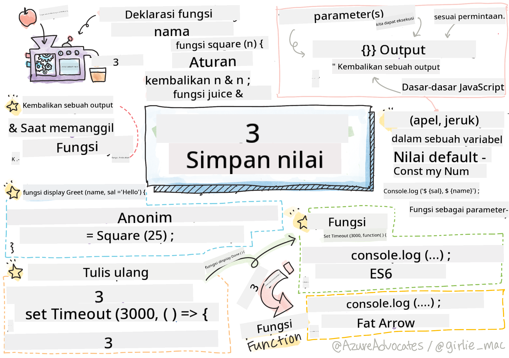

<!--
CO_OP_TRANSLATOR_METADATA:
{
  "original_hash": "b4612bbb9ace984f374fcc80e3e035ad",
  "translation_date": "2025-08-27T22:45:51+00:00",
  "source_file": "2-js-basics/2-functions-methods/README.md",
  "language_code": "id"
}
-->
# Dasar-Dasar JavaScript: Metode dan Fungsi


> Sketchnote oleh [Tomomi Imura](https://twitter.com/girlie_mac)

## Kuis Pra-Pelajaran
[Kuis pra-pelajaran](https://ashy-river-0debb7803.1.azurestaticapps.net/quiz/9)

Ketika kita berpikir tentang menulis kode, kita selalu ingin memastikan kode kita mudah dibaca. Meskipun terdengar berlawanan, kode lebih sering dibaca daripada ditulis. Salah satu alat utama dalam kotak alat pengembang untuk memastikan kode yang dapat dipelihara adalah **fungsi**.

[](https://youtube.com/watch?v=XgKsD6Zwvlc "Metode dan Fungsi")

> 🎥 Klik gambar di atas untuk video tentang metode dan fungsi.

> Anda dapat mengikuti pelajaran ini di [Microsoft Learn](https://docs.microsoft.com/learn/modules/web-development-101-functions/?WT.mc_id=academic-77807-sagibbon)!

## Fungsi

Pada intinya, fungsi adalah blok kode yang dapat kita eksekusi sesuai permintaan. Ini sangat cocok untuk skenario di mana kita perlu melakukan tugas yang sama berulang kali; daripada menduplikasi logika di beberapa lokasi (yang akan sulit diperbarui saat waktunya tiba), kita dapat memusatkannya di satu lokasi, dan memanggilnya kapan pun kita membutuhkan operasi tersebut - bahkan Anda dapat memanggil fungsi dari fungsi lainnya!

Yang tidak kalah penting adalah kemampuan untuk memberi nama pada fungsi. Meskipun ini mungkin terlihat sepele, nama memberikan cara cepat untuk mendokumentasikan bagian kode. Anda bisa menganggapnya seperti label pada tombol. Jika saya mengklik tombol yang bertuliskan "Batalkan timer", saya tahu itu akan menghentikan jam yang berjalan.

## Membuat dan Memanggil Fungsi

Sintaks untuk fungsi terlihat seperti berikut:

```javascript
function nameOfFunction() { // function definition
 // function definition/body
}
```

Jika saya ingin membuat fungsi untuk menampilkan salam, itu mungkin terlihat seperti ini:

```javascript
function displayGreeting() {
  console.log('Hello, world!');
}
```

Kapan pun kita ingin memanggil (atau menjalankan) fungsi kita, kita menggunakan nama fungsi diikuti dengan `()`. Perlu dicatat bahwa fungsi kita dapat didefinisikan sebelum atau setelah kita memutuskan untuk memanggilnya; compiler JavaScript akan menemukannya untuk Anda.

```javascript
// calling our function
displayGreeting();
```

> **NOTE:** Ada jenis fungsi khusus yang dikenal sebagai **metode**, yang sebenarnya sudah Anda gunakan! Faktanya, kita melihat ini dalam demo di atas ketika kita menggunakan `console.log`. Yang membedakan metode dari fungsi adalah metode terhubung ke sebuah objek (`console` dalam contoh kita), sedangkan fungsi bebas berdiri sendiri. Anda akan sering mendengar banyak pengembang menggunakan istilah ini secara bergantian.

### Praktik Terbaik untuk Fungsi

Ada beberapa praktik terbaik yang perlu diingat saat membuat fungsi:

- Seperti biasa, gunakan nama yang deskriptif sehingga Anda tahu apa yang akan dilakukan fungsi tersebut
- Gunakan **camelCasing** untuk menggabungkan kata-kata
- Fokuskan fungsi Anda pada tugas tertentu

## Memberikan Informasi ke Fungsi

Untuk membuat fungsi lebih dapat digunakan kembali, Anda sering kali ingin memberikan informasi ke dalamnya. Jika kita mempertimbangkan contoh `displayGreeting` di atas, itu hanya akan menampilkan **Hello, world!**. Bukan fungsi yang paling berguna yang bisa dibuat. Jika kita ingin membuatnya sedikit lebih fleksibel, seperti memungkinkan seseorang menentukan nama orang yang akan disapa, kita dapat menambahkan **parameter**. Parameter (kadang-kadang juga disebut **argumen**) adalah informasi tambahan yang dikirim ke fungsi.

Parameter dicantumkan dalam bagian definisi di dalam tanda kurung dan dipisahkan dengan koma seperti ini:

```javascript
function name(param, param2, param3) {

}
```

Kita dapat memperbarui `displayGreeting` untuk menerima nama dan menampilkannya.

```javascript
function displayGreeting(name) {
  const message = `Hello, ${name}!`;
  console.log(message);
}
```

Ketika kita ingin memanggil fungsi kita dan memberikan parameter, kita menentukan parameter tersebut di dalam tanda kurung.

```javascript
displayGreeting('Christopher');
// displays "Hello, Christopher!" when run
```

## Nilai Default

Kita dapat membuat fungsi kita lebih fleksibel dengan menambahkan lebih banyak parameter. Tetapi bagaimana jika kita tidak ingin setiap nilai harus ditentukan? Mengikuti contoh salam kita, kita bisa membiarkan nama sebagai wajib (kita perlu tahu siapa yang kita sapa), tetapi kita ingin memungkinkan salam itu sendiri disesuaikan sesuai keinginan. Jika seseorang tidak ingin menyesuaikannya, kita memberikan nilai default sebagai gantinya. Untuk memberikan nilai default pada parameter, kita menetapkannya seperti cara kita menetapkan nilai untuk variabel - `parameterName = 'defaultValue'`. Untuk melihat contoh lengkapnya:

```javascript
function displayGreeting(name, salutation='Hello') {
  console.log(`${salutation}, ${name}`);
}
```

Ketika kita memanggil fungsi, kita kemudian dapat memutuskan apakah kita ingin menetapkan nilai untuk `salutation`.

```javascript
displayGreeting('Christopher');
// displays "Hello, Christopher"

displayGreeting('Christopher', 'Hi');
// displays "Hi, Christopher"
```

## Nilai Kembali

Hingga saat ini, fungsi yang kita buat akan selalu menghasilkan output ke [console](https://developer.mozilla.org/docs/Web/API/console). Kadang-kadang ini bisa menjadi apa yang kita cari, terutama ketika kita membuat fungsi yang akan memanggil layanan lain. Tetapi bagaimana jika saya ingin membuat fungsi pembantu untuk melakukan perhitungan dan memberikan nilai kembali sehingga saya dapat menggunakannya di tempat lain?

Kita dapat melakukan ini dengan menggunakan **nilai kembali**. Nilai kembali dikembalikan oleh fungsi, dan dapat disimpan dalam variabel sama seperti kita dapat menyimpan nilai literal seperti string atau angka.

Jika sebuah fungsi mengembalikan sesuatu, maka kata kunci `return` digunakan. Kata kunci `return` mengharapkan nilai atau referensi dari apa yang dikembalikan seperti ini:

```javascript
return myVariable;
```  

Kita dapat membuat fungsi untuk membuat pesan salam dan mengembalikan nilainya kepada pemanggil.

```javascript
function createGreetingMessage(name) {
  const message = `Hello, ${name}`;
  return message;
}
```

Ketika memanggil fungsi ini, kita akan menyimpan nilainya dalam variabel. Ini sama seperti cara kita menetapkan variabel ke nilai statis (seperti `const name = 'Christopher'`).

```javascript
const greetingMessage = createGreetingMessage('Christopher');
```

## Fungsi sebagai Parameter untuk Fungsi

Saat Anda berkembang dalam karier pemrograman Anda, Anda akan menemukan fungsi yang menerima fungsi sebagai parameter. Trik yang rapi ini sering digunakan ketika kita tidak tahu kapan sesuatu akan terjadi atau selesai, tetapi kita tahu kita perlu melakukan operasi sebagai respons.

Sebagai contoh, pertimbangkan [setTimeout](https://developer.mozilla.org/docs/Web/API/WindowOrWorkerGlobalScope/setTimeout), yang memulai timer dan akan menjalankan kode saat selesai. Kita perlu memberi tahu apa kode yang ingin kita jalankan. Kedengarannya seperti pekerjaan yang sempurna untuk fungsi!

Jika Anda menjalankan kode di bawah ini, setelah 3 detik Anda akan melihat pesan **3 seconds has elapsed**.

```javascript
function displayDone() {
  console.log('3 seconds has elapsed');
}
// timer value is in milliseconds
setTimeout(displayDone, 3000);
```

### Fungsi Anonim

Mari kita lihat lagi apa yang telah kita buat. Kita membuat fungsi dengan nama yang akan digunakan satu kali. Saat aplikasi kita menjadi lebih kompleks, kita dapat melihat diri kita membuat banyak fungsi yang hanya akan dipanggil sekali. Ini tidak ideal. Ternyata, kita tidak selalu perlu memberikan nama!

Ketika kita memberikan fungsi sebagai parameter, kita dapat melewati pembuatan fungsi sebelumnya dan sebagai gantinya membuatnya sebagai bagian dari parameter. Kita menggunakan kata kunci `function` yang sama, tetapi kita membuatnya sebagai parameter.

Mari kita tulis ulang kode di atas untuk menggunakan fungsi anonim:

```javascript
setTimeout(function() {
  console.log('3 seconds has elapsed');
}, 3000);
```

Jika Anda menjalankan kode baru kita, Anda akan melihat hasil yang sama. Kita telah membuat fungsi, tetapi tidak perlu memberinya nama!

### Fungsi Fat Arrow

Salah satu jalan pintas yang umum dalam banyak bahasa pemrograman (termasuk JavaScript) adalah kemampuan untuk menggunakan apa yang disebut sebagai fungsi **arrow** atau **fat arrow**. Ini menggunakan indikator khusus `=>`, yang terlihat seperti panah - sehingga dinamakan demikian! Dengan menggunakan `=>`, kita dapat melewati kata kunci `function`.

Mari kita tulis ulang kode kita sekali lagi untuk menggunakan fungsi fat arrow:

```javascript
setTimeout(() => {
  console.log('3 seconds has elapsed');
}, 3000);
```

### Kapan Menggunakan Setiap Strategi

Anda sekarang telah melihat bahwa kita memiliki tiga cara untuk memberikan fungsi sebagai parameter dan mungkin bertanya-tanya kapan menggunakan masing-masing. Jika Anda tahu Anda akan menggunakan fungsi lebih dari sekali, buatlah seperti biasa. Jika Anda hanya akan menggunakannya untuk satu lokasi, umumnya lebih baik menggunakan fungsi anonim. Apakah Anda menggunakan fungsi fat arrow atau sintaks `function` yang lebih tradisional terserah Anda, tetapi Anda akan melihat sebagian besar pengembang modern lebih memilih `=>`.

---

## 🚀 Tantangan

Bisakah Anda menjelaskan dalam satu kalimat perbedaan antara fungsi dan metode? Cobalah!

## Kuis Pasca-Pelajaran
[Kuis pasca-pelajaran](https://ashy-river-0debb7803.1.azurestaticapps.net/quiz/10)

## Tinjauan & Studi Mandiri

Ada baiknya [membaca lebih lanjut tentang fungsi arrow](https://developer.mozilla.org/docs/Web/JavaScript/Reference/Functions/Arrow_functions), karena mereka semakin sering digunakan dalam basis kode. Latihlah menulis fungsi, lalu tulis ulang dengan sintaks ini.

## Tugas

[Fun with Functions](assignment.md)

---

**Penafian**:  
Dokumen ini telah diterjemahkan menggunakan layanan penerjemahan AI [Co-op Translator](https://github.com/Azure/co-op-translator). Meskipun kami berupaya untuk memberikan hasil yang akurat, harap diperhatikan bahwa terjemahan otomatis mungkin mengandung kesalahan atau ketidakakuratan. Dokumen asli dalam bahasa aslinya harus dianggap sebagai sumber yang otoritatif. Untuk informasi yang bersifat kritis, disarankan menggunakan jasa penerjemahan profesional oleh manusia. Kami tidak bertanggung jawab atas kesalahpahaman atau penafsiran yang keliru yang timbul dari penggunaan terjemahan ini.