# Dasar-Dasar JavaScript: Metode dan Fungsi


> Sketchnote oleh [Tomomi Imura](https://twitter.com/girlie_mac)


## Kuis Pra-Pelajaran
[Kuis pra-pelajaran](https://ff-quizzes.netlify.app)

Menulis kode yang sama berulang kali adalah salah satu frustrasi paling umum dalam pemrograman. Fungsi menyelesaikan masalah ini dengan memungkinkan Anda mengemas kode ke dalam blok yang dapat digunakan kembali. Pikirkan fungsi seperti bagian standar yang membuat jalur perakitan Henry Ford menjadi revolusioner – setelah Anda membuat komponen yang andal, Anda dapat menggunakannya di mana pun diperlukan tanpa harus membangun ulang dari awal.

Fungsi memungkinkan Anda menggabungkan potongan kode sehingga Anda dapat menggunakannya kembali di seluruh program Anda. Alih-alih menyalin dan menempelkan logika yang sama di mana-mana, Anda dapat membuat fungsi sekali dan memanggilnya kapan pun diperlukan. Pendekatan ini menjaga kode Anda tetap terorganisir dan membuat pembaruan jauh lebih mudah.

Dalam pelajaran ini, Anda akan belajar cara membuat fungsi Anda sendiri, mengirimkan informasi ke dalamnya, dan mendapatkan hasil yang berguna kembali. Anda akan menemukan perbedaan antara fungsi dan metode, mempelajari pendekatan sintaks modern, dan melihat bagaimana fungsi dapat bekerja dengan fungsi lainnya. Kami akan membangun konsep-konsep ini langkah demi langkah.

[](https://youtube.com/watch?v=XgKsD6Zwvlc "Metode dan Fungsi")

> 🎥 Klik gambar di atas untuk video tentang metode dan fungsi.

> Anda dapat mengikuti pelajaran ini di [Microsoft Learn](https://docs.microsoft.com/learn/modules/web-development-101-functions/?WT.mc_id=academic-77807-sagibbon)!


## Fungsi

Fungsi adalah blok kode mandiri yang melakukan tugas tertentu. Fungsi mengemas logika yang dapat Anda jalankan kapan pun diperlukan.

Alih-alih menulis kode yang sama beberapa kali di seluruh program Anda, Anda dapat mengemasnya dalam fungsi dan memanggil fungsi tersebut kapan pun Anda membutuhkannya. Pendekatan ini menjaga kode Anda tetap bersih dan membuat pembaruan jauh lebih mudah. Bayangkan tantangan pemeliharaan jika Anda perlu mengubah logika yang tersebar di 20 lokasi berbeda dalam kode Anda.

Memberi nama fungsi Anda secara deskriptif sangat penting. Fungsi yang diberi nama dengan baik mengkomunikasikan tujuannya dengan jelas – ketika Anda melihat `cancelTimer()`, Anda langsung memahami apa yang dilakukannya, seperti tombol yang diberi label dengan jelas memberi tahu Anda apa yang akan terjadi saat Anda mengkliknya.

## Membuat dan memanggil fungsi

Mari kita lihat bagaimana cara membuat fungsi. Sintaksnya mengikuti pola yang konsisten:

```javascript
function nameOfFunction() { // function definition
 // function definition/body
}
```

Mari kita uraikan:
- Kata kunci `function` memberi tahu JavaScript "Hei, saya sedang membuat fungsi!"
- `nameOfFunction` adalah tempat Anda memberikan nama deskriptif untuk fungsi Anda
- Tanda kurung `()` adalah tempat Anda dapat menambahkan parameter (kita akan membahasnya segera)
- Kurung kurawal `{}` berisi kode aktual yang dijalankan saat Anda memanggil fungsi

Mari kita buat fungsi salam sederhana untuk melihat ini dalam aksi:

```javascript
function displayGreeting() {
  console.log('Hello, world!');
}
```

Fungsi ini mencetak "Hello, world!" ke konsol. Setelah Anda mendefinisikannya, Anda dapat menggunakannya sebanyak yang Anda butuhkan.

Untuk menjalankan (atau "memanggil") fungsi Anda, tulis namanya diikuti oleh tanda kurung. JavaScript memungkinkan Anda mendefinisikan fungsi Anda sebelum atau setelah Anda memanggilnya – mesin JavaScript akan menangani urutan eksekusi.

```javascript
// calling our function
displayGreeting();
```

Saat Anda menjalankan baris ini, itu mengeksekusi semua kode di dalam fungsi `displayGreeting` Anda, menampilkan "Hello, world!" di konsol browser Anda. Anda dapat memanggil fungsi ini berulang kali.

### 🧠 **Pemeriksaan Dasar-Dasar Fungsi: Membangun Fungsi Pertama Anda**

**Mari kita lihat bagaimana perasaan Anda tentang fungsi dasar:**
- Bisakah Anda menjelaskan mengapa kita menggunakan kurung kurawal `{}` dalam definisi fungsi?
- Apa yang terjadi jika Anda menulis `displayGreeting` tanpa tanda kurung?
- Mengapa Anda mungkin ingin memanggil fungsi yang sama beberapa kali?

```mermaid
flowchart TD
    A["✏️ Define Function"] --> B["📦 Package Code"]
    B --> C["🏷️ Give it a Name"]
    C --> D["📞 Call When Needed"]
    D --> E["🔄 Reuse Anywhere"]
    
    F["💡 Benefits"] --> F1["No code repetition"]
    F --> F2["Easy to maintain"]
    F --> F3["Clear organization"]
    F --> F4["Easier testing"]
    
    style A fill:#e3f2fd
    style E fill:#e8f5e8
    style F fill:#fff3e0
```



> **Catatan:** Anda telah menggunakan **metode** sepanjang pelajaran ini. `console.log()` adalah metode – pada dasarnya fungsi yang dimiliki oleh objek `console`. Perbedaan utamanya adalah metode terlampir pada objek, sedangkan fungsi berdiri sendiri. Banyak pengembang menggunakan istilah ini secara bergantian dalam percakapan santai.

### Praktik terbaik fungsi

Berikut beberapa tips untuk membantu Anda menulis fungsi yang hebat:

- Berikan nama yang jelas dan deskriptif untuk fungsi Anda – diri Anda di masa depan akan berterima kasih!
- Gunakan **camelCasing** untuk nama yang terdiri dari beberapa kata (seperti `calculateTotal` daripada `calculate_total`)
- Fokuskan setiap fungsi untuk melakukan satu hal dengan baik

## Mengirimkan informasi ke fungsi

Fungsi `displayGreeting` kita terbatas – hanya dapat menampilkan "Hello, world!" untuk semua orang. Parameter memungkinkan kita membuat fungsi lebih fleksibel dan berguna.

**Parameter** bertindak seperti tempat penampung di mana Anda dapat memasukkan nilai yang berbeda setiap kali Anda menggunakan fungsi. Dengan cara ini, fungsi yang sama dapat bekerja dengan informasi yang berbeda pada setiap pemanggilan.

Anda mencantumkan parameter di dalam tanda kurung saat Anda mendefinisikan fungsi, memisahkan beberapa parameter dengan koma:

```javascript
function name(param, param2, param3) {

}
```

Setiap parameter bertindak seperti tempat penampung – saat seseorang memanggil fungsi Anda, mereka akan memberikan nilai aktual yang dimasukkan ke dalam tempat tersebut.

Mari kita perbarui fungsi salam kita untuk menerima nama seseorang:

```javascript
function displayGreeting(name) {
  const message = `Hello, ${name}!`;
  console.log(message);
}
```

Perhatikan bagaimana kita menggunakan tanda backtick (`` ` ``) dan `${}` untuk memasukkan nama langsung ke dalam pesan kita – ini disebut template literal, dan ini adalah cara yang sangat praktis untuk membangun string dengan variabel yang dicampur.

Sekarang saat kita memanggil fungsi kita, kita dapat memasukkan nama apa pun:

```javascript
displayGreeting('Christopher');
// displays "Hello, Christopher!" when run
```

JavaScript mengambil string `'Christopher'`, menetapkannya ke parameter `name`, dan membuat pesan yang dipersonalisasi "Hello, Christopher!"

```mermaid
flowchart LR
    A["🎯 Function Call"] --> B["📥 Parameters"]
    B --> C["⚙️ Function Body"]
    C --> D["📤 Result"]
    
    A1["displayGreeting('Alice')"] --> A
    B1["name = 'Alice'"] --> B
    C1["Template literal\n\`Hello, \${name}!\`"] --> C
    D1["'Hello, Alice!'"] --> D
    
    E["🔄 Parameter Types"] --> E1["Strings"]
    E --> E2["Numbers"]
    E --> E3["Booleans"]
    E --> E4["Objects"]
    E --> E5["Functions"]
    
    style A fill:#e3f2fd
    style C fill:#e8f5e8
    style D fill:#fff3e0
    style E fill:#f3e5f5
```



## Nilai default

Bagaimana jika kita ingin membuat beberapa parameter bersifat opsional? Di sinilah nilai default berguna!

Misalnya, kita ingin orang dapat menyesuaikan kata salam, tetapi jika mereka tidak menentukan satu, kita akan menggunakan "Hello" sebagai cadangan. Anda dapat mengatur nilai default dengan menggunakan tanda sama dengan, seperti mengatur variabel:

```javascript
function displayGreeting(name, salutation='Hello') {
  console.log(`${salutation}, ${name}`);
}
```

Di sini, `name` masih diperlukan, tetapi `salutation` memiliki nilai cadangan `'Hello'` jika tidak ada yang memberikan salam yang berbeda.

Sekarang kita dapat memanggil fungsi ini dengan dua cara berbeda:

```javascript
displayGreeting('Christopher');
// displays "Hello, Christopher"

displayGreeting('Christopher', 'Hi');
// displays "Hi, Christopher"
```

Pada pemanggilan pertama, JavaScript menggunakan "Hello" sebagai default karena kita tidak menentukan salam. Pada pemanggilan kedua, ia menggunakan "Hi" yang kita tentukan. Fleksibilitas ini membuat fungsi dapat beradaptasi dengan berbagai skenario.

### 🎛️ **Pemeriksaan Penguasaan Parameter: Membuat Fungsi Fleksibel**

**Uji pemahaman parameter Anda:**
- Apa perbedaan antara parameter dan argumen?
- Mengapa nilai default berguna dalam pemrograman dunia nyata?
- Bisakah Anda memprediksi apa yang terjadi jika Anda memberikan lebih banyak argumen daripada parameter?


> **Tip profesional**: Parameter default membuat fungsi Anda lebih ramah pengguna. Pengguna dapat memulai dengan cepat menggunakan default yang masuk akal, tetapi tetap dapat menyesuaikan jika diperlukan!

## Nilai kembali

Fungsi kita sejauh ini hanya mencetak pesan ke konsol, tetapi bagaimana jika Anda ingin fungsi menghitung sesuatu dan memberikan hasilnya kembali kepada Anda?

Di sinilah **nilai kembali** berperan. Alih-alih hanya menampilkan sesuatu, fungsi dapat memberikan nilai yang dapat Anda simpan dalam variabel atau gunakan di bagian lain kode Anda.

Untuk mengirimkan nilai kembali, Anda menggunakan kata kunci `return` diikuti oleh apa pun yang ingin Anda kembalikan:

```javascript
return myVariable;
```

Berikut sesuatu yang penting: saat fungsi mencapai pernyataan `return`, ia langsung berhenti berjalan dan mengirimkan nilai itu kembali kepada siapa pun yang memanggilnya.

Mari kita modifikasi fungsi salam kita untuk mengembalikan pesan alih-alih mencetaknya:

```javascript
function createGreetingMessage(name) {
  const message = `Hello, ${name}`;
  return message;
}
```

Sekarang alih-alih mencetak salam, fungsi ini membuat pesan dan memberikannya kembali kepada kita.

Untuk menggunakan nilai yang dikembalikan, kita dapat menyimpannya dalam variabel seperti nilai lainnya:

```javascript
const greetingMessage = createGreetingMessage('Christopher');
```

Sekarang `greetingMessage` berisi "Hello, Christopher" dan kita dapat menggunakannya di mana saja dalam kode kita – untuk menampilkannya di halaman web, menyertakannya dalam email, atau mengirimkannya ke fungsi lain.

```mermaid
flowchart TD
    A["🔧 Function Processing"] --> B{"return statement?"}
    B -->|Yes| C["📤 Return Value"]
    B -->|No| D["📭 Return undefined"]
    
    C --> E["💾 Store in Variable"]
    C --> F["🔗 Use in Expression"]
    C --> G["📞 Pass to Function"]
    
    D --> H["⚠️ Usually not useful"]
    
    I["📋 Return Value Uses"] --> I1["Calculate results"]
    I --> I2["Validate input"]
    I --> I3["Transform data"]
    I --> I4["Create objects"]
    
    style C fill:#e8f5e8
    style D fill:#ffebee
    style I fill:#e3f2fd
```



### 🔄 **Pemeriksaan Nilai Kembali: Mendapatkan Hasil Kembali**

**Evaluasi pemahaman nilai kembali Anda:**
- Apa yang terjadi pada kode setelah pernyataan `return` dalam fungsi?
- Mengapa mengembalikan nilai sering kali lebih baik daripada hanya mencetak ke konsol?
- Bisakah fungsi mengembalikan berbagai jenis nilai (string, angka, boolean)?


> **Wawasan utama**: Fungsi yang mengembalikan nilai lebih serbaguna karena pemanggil memutuskan apa yang harus dilakukan dengan hasilnya. Ini membuat kode Anda lebih modular dan dapat digunakan kembali!

## Fungsi sebagai parameter untuk fungsi

Fungsi dapat diteruskan sebagai parameter ke fungsi lain. Meskipun konsep ini mungkin tampak rumit pada awalnya, ini adalah fitur yang kuat yang memungkinkan pola pemrograman yang fleksibel.

Pola ini sangat umum ketika Anda ingin mengatakan "ketika sesuatu terjadi, lakukan hal lain ini." Misalnya, "ketika timer selesai, jalankan kode ini" atau "ketika pengguna mengklik tombol, panggil fungsi ini."

Mari kita lihat `setTimeout`, yang merupakan fungsi bawaan yang menunggu waktu tertentu dan kemudian menjalankan beberapa kode. Kita perlu memberi tahu apa kode yang akan dijalankan – kasus penggunaan yang sempurna untuk meneruskan fungsi!

Coba kode ini – setelah 3 detik, Anda akan melihat pesan:

```javascript
function displayDone() {
  console.log('3 seconds has elapsed');
}
// timer value is in milliseconds
setTimeout(displayDone, 3000);
```

Perhatikan bagaimana kita meneruskan `displayDone` (tanpa tanda kurung) ke `setTimeout`. Kita tidak memanggil fungsi itu sendiri – kita menyerahkannya ke `setTimeout` dan mengatakan "panggil ini dalam 3 detik."

### Fungsi anonim

Kadang-kadang Anda membutuhkan fungsi hanya untuk satu hal dan tidak ingin memberinya nama. Pikirkan – jika Anda hanya menggunakan fungsi sekali, mengapa memperumit kode Anda dengan nama tambahan?

JavaScript memungkinkan Anda membuat **fungsi anonim** – fungsi tanpa nama yang dapat Anda definisikan langsung di tempat Anda membutuhkannya.

Berikut cara kita dapat menulis ulang contoh timer kita menggunakan fungsi anonim:

```javascript
setTimeout(function() {
  console.log('3 seconds has elapsed');
}, 3000);
```

Ini mencapai hasil yang sama, tetapi fungsi didefinisikan langsung dalam pemanggilan `setTimeout`, menghilangkan kebutuhan untuk deklarasi fungsi terpisah.

### Fungsi panah

JavaScript modern memiliki cara yang lebih singkat untuk menulis fungsi yang disebut **fungsi panah**. Mereka menggunakan `=>` (yang terlihat seperti panah – mengerti?) dan sangat populer di kalangan pengembang.

Fungsi panah memungkinkan Anda melewati kata kunci `function` dan menulis kode yang lebih ringkas.

Berikut contoh timer kita menggunakan fungsi panah:

```javascript
setTimeout(() => {
  console.log('3 seconds has elapsed');
}, 3000);
```

Tanda `()` adalah tempat parameter akan masuk (kosong dalam kasus ini), kemudian datang panah `=>`, dan akhirnya tubuh fungsi dalam kurung kurawal. Ini memberikan fungsi yang sama dengan sintaks yang lebih ringkas.

```mermaid
flowchart LR
    A["📝 Function Styles"] --> B["Traditional"]
    A --> C["Arrow"]
    A --> D["Anonymous"]
    
    B --> B1["function name() {}"]
    B --> B2["Hoisted"]
    B --> B3["Named"]
    
    C --> C1["const name = () => {}"]
    C --> C2["Concise syntax"]
    C --> C3["Modern style"]
    
    D --> D1["function() {}"]
    D --> D2["No name"]
    D --> D3["One-time use"]
    
    E["⏰ When to Use"] --> E1["Traditional: Reusable functions"]
    E --> E2["Arrow: Short callbacks"]
    E --> E3["Anonymous: Event handlers"]
    
    style A fill:#e3f2fd
    style B fill:#e8f5e8
    style C fill:#fff3e0
    style D fill:#f3e5f5
    style E fill:#e0f2f1
```



### Kapan menggunakan setiap strategi

Kapan Anda harus menggunakan setiap pendekatan? Panduan praktis: jika Anda akan menggunakan fungsi beberapa kali, beri nama dan definisikan secara terpisah. Jika itu untuk satu penggunaan spesifik, pertimbangkan fungsi anonim. Baik fungsi panah maupun sintaks tradisional adalah pilihan yang valid, meskipun fungsi panah lebih umum dalam basis kode JavaScript modern.

### 🎨 **Pemeriksaan Penguasaan Gaya Fungsi: Memilih Sintaks yang Tepat**

**Uji pemahaman sintaks Anda:**
- Kapan Anda mungkin lebih memilih fungsi panah daripada sintaks fungsi tradisional?
- Apa keuntungan utama dari fungsi anonim?
- Bisakah Anda memikirkan situasi di mana fungsi bernama lebih baik daripada fungsi anonim?


> **Tren modern**: Fungsi panah menjadi pilihan default bagi banyak pengembang karena sintaksnya yang ringkas, tetapi fungsi tradisional masih memiliki tempatnya!

---


## 🚀 Tantangan

Bisakah Anda menjelaskan dalam satu kalimat perbedaan antara fungsi dan metode? Coba!

## Tantangan Agen GitHub Copilot 🚀

Gunakan mode Agen untuk menyelesaikan tantangan berikut:

**Deskripsi:** Buat pustaka utilitas fungsi matematika yang menunjukkan berbagai konsep fungsi yang dibahas dalam pelajaran ini, termasuk parameter, nilai default, nilai kembali, dan fungsi panah.

**Prompt:** Buat file JavaScript bernama `mathUtils.js` yang berisi fungsi-fungsi berikut:
1. Fungsi `add` yang menerima dua parameter dan mengembalikan jumlahnya
2. Fungsi `multiply` dengan nilai parameter default (parameter kedua default ke 1)
3. Fungsi panah `square` yang menerima angka dan mengembalikan kuadratnya
4. Fungsi `calculate` yang menerima fungsi lain sebagai parameter dan dua angka, lalu menerapkan fungsi tersebut pada angka-angka tersebut
5. Demonstrasikan pemanggilan setiap fungsi dengan kasus uji yang sesuai

Pelajari lebih lanjut tentang [mode agen](https://code.visualstudio.com/blogs/2025/02/24/introducing-copilot-agent-mode) di sini.

## Kuis Pasca-Pelajaran
[Kuis pasca-pelajaran](https://ff-quizzes.netlify.app)

## Tinjauan & Studi Mandiri

Ada baiknya [membaca lebih lanjut tentang fungsi panah](https://developer.mozilla.org/docs/Web/JavaScript/Reference/Functions/Arrow_functions), karena mereka semakin banyak digunakan dalam basis kode. Latih menulis fungsi, lalu tulis ulang dengan sintaks ini.

## Tugas

[Seru dengan Fungsi](assignment.md)

---

## 🧰 **Ringkasan Toolkit Fungsi JavaScript Anda**

```mermaid
graph TD
    A["🎯 JavaScript Functions"] --> B["📋 Function Declaration"]
    A --> C["📥 Parameters"]
    A --> D["📤 Return Values"]
    A --> E["🎨 Modern Syntax"]
    
    B --> B1["function name() {}"]
    B --> B2["Descriptive naming"]
    B --> B3["Reusable code blocks"]
    
    C --> C1["Input data"]
    C --> C2["Default values"]
    C --> C3["Multiple parameters"]
    
    D --> D1["return statement"]
    D --> D2["Exit function"]
    D --> D3["Pass data back"]
    
    E --> E1["Arrow functions: () =>"]
    E --> E2["Anonymous functions"]
    E --> E3["Higher-order functions"]
    
    F["⚡ Key Benefits"] --> F1["Code reusability"]
    F --> F2["Better organization"]
    F --> F3["Easier testing"]
    F --> F4["Modular design"]
    
    style A fill:#e3f2fd
    style B fill:#e8f5e8
    style C fill:#fff3e0
    style D fill:#f3e5f5
    style E fill:#e0f2f1
    style F fill:#fce4ec
```



---

## 🚀 Garis Waktu Penguasaan Fungsi JavaScript Anda

### ⚡ **Apa yang Dapat Anda Lakukan dalam 5 Menit Berikutnya**
- [ ] Tulis fungsi sederhana yang mengembalikan angka favorit Anda
- [ ] Buat fungsi dengan dua parameter yang menambahkan keduanya
- [ ] Cobalah mengubah fungsi tradisional menjadi sintaks fungsi panah
- [ ] Latihan tantangan: jelaskan perbedaan antara fungsi dan metode

### 🎯 **Apa yang Bisa Kamu Capai Dalam Satu Jam**
- [ ] Selesaikan kuis setelah pelajaran dan tinjau konsep yang membingungkan
- [ ] Bangun pustaka utilitas matematika dari tantangan GitHub Copilot
- [ ] Buat fungsi yang menggunakan fungsi lain sebagai parameter
- [ ] Latihan menulis fungsi dengan parameter default
- [ ] Bereksperimen dengan template literal dalam nilai pengembalian fungsi

### 📅 **Penguasaan Fungsi Selama Seminggu**
- [ ] Selesaikan tugas "Fun with Functions" dengan kreativitas
- [ ] Refaktor beberapa kode berulang yang telah kamu tulis menjadi fungsi yang dapat digunakan kembali
- [ ] Bangun kalkulator kecil hanya menggunakan fungsi (tanpa variabel global)
- [ ] Latihan fungsi panah dengan metode array seperti `map()` dan `filter()`
- [ ] Buat koleksi fungsi utilitas untuk tugas-tugas umum
- [ ] Pelajari fungsi tingkat tinggi dan konsep pemrograman fungsional

### 🌟 **Transformasi Selama Sebulan**
- [ ] Kuasai konsep fungsi tingkat lanjut seperti closures dan scope
- [ ] Bangun proyek yang banyak menggunakan komposisi fungsi
- [ ] Berkontribusi pada open source dengan meningkatkan dokumentasi fungsi
- [ ] Ajarkan orang lain tentang fungsi dan berbagai gaya sintaks
- [ ] Jelajahi paradigma pemrograman fungsional dalam JavaScript
- [ ] Buat pustaka pribadi berisi fungsi yang dapat digunakan kembali untuk proyek di masa depan

### 🏆 **Check-in Akhir Juara Fungsi**

**Rayakan penguasaan fungsi kamu:**
- Apa fungsi paling berguna yang telah kamu buat sejauh ini?
- Bagaimana belajar tentang fungsi mengubah cara kamu berpikir tentang pengorganisasian kode?
- Sintaks fungsi mana yang kamu sukai dan mengapa?
- Masalah dunia nyata apa yang akan kamu selesaikan dengan menulis fungsi?


> 🎉 **Kamu telah menguasai salah satu konsep paling kuat dalam pemrograman!** Fungsi adalah blok bangunan dari program yang lebih besar. Setiap aplikasi yang akan kamu bangun akan menggunakan fungsi untuk mengorganisasi, menggunakan kembali, dan menyusun kode. Kamu sekarang memahami cara mengemas logika ke dalam komponen yang dapat digunakan kembali, membuatmu menjadi programmer yang lebih efisien dan efektif. Selamat datang di dunia pemrograman modular! 🚀

---

**Penafian**:  
Dokumen ini telah diterjemahkan menggunakan layanan penerjemahan AI [Co-op Translator](https://github.com/Azure/co-op-translator). Meskipun kami berupaya untuk memberikan hasil yang akurat, harap diketahui bahwa terjemahan otomatis mungkin mengandung kesalahan atau ketidakakuratan. Dokumen asli dalam bahasa aslinya harus dianggap sebagai sumber yang otoritatif. Untuk informasi yang penting, disarankan menggunakan jasa penerjemahan manusia profesional. Kami tidak bertanggung jawab atas kesalahpahaman atau interpretasi yang salah yang timbul dari penggunaan terjemahan ini.