<!--
CO_OP_TRANSLATOR_METADATA:
{
  "original_hash": "c688385d15dd3645e924ea0ffee8967f",
  "translation_date": "2025-11-06T11:40:08+00:00",
  "source_file": "2-js-basics/3-making-decisions/README.md",
  "language_code": "id"
}
-->
# Dasar-Dasar JavaScript: Membuat Keputusan


> Sketchnote oleh [Tomomi Imura](https://twitter.com/girlie_mac)


Pernahkah Anda bertanya-tanya bagaimana aplikasi membuat keputusan yang cerdas? Seperti bagaimana sistem navigasi memilih rute tercepat, atau bagaimana termostat memutuskan kapan harus menyalakan pemanas? Inilah konsep dasar pengambilan keputusan dalam pemrograman.

Seperti Mesin Analitik Charles Babbage yang dirancang untuk mengikuti urutan operasi yang berbeda berdasarkan kondisi, program JavaScript modern perlu membuat pilihan berdasarkan berbagai keadaan. Kemampuan untuk bercabang dan membuat keputusan inilah yang mengubah kode statis menjadi aplikasi yang responsif dan cerdas.

Dalam pelajaran ini, Anda akan belajar cara menerapkan logika bersyarat dalam program Anda. Kita akan menjelajahi pernyataan bersyarat, operator perbandingan, dan ekspresi logis yang memungkinkan kode Anda mengevaluasi situasi dan merespons dengan tepat.

## Kuis Pra-Pelajaran

[Kuis pra-pelajaran](https://ff-quizzes.netlify.app/web/quiz/11)

Kemampuan untuk membuat keputusan dan mengontrol alur program adalah aspek mendasar dari pemrograman. Bagian ini mencakup cara mengontrol jalur eksekusi program JavaScript Anda menggunakan nilai Boolean dan logika bersyarat.

[](https://youtube.com/watch?v=SxTp8j-fMMY "Membuat Keputusan")

> 🎥 Klik gambar di atas untuk video tentang membuat keputusan.

> Anda dapat mengikuti pelajaran ini di [Microsoft Learn](https://docs.microsoft.com/learn/modules/web-development-101-if-else/?WT.mc_id=academic-77807-sagibbon)!


## Sekilas tentang Boolean

Sebelum menjelajahi pengambilan keputusan, mari kita tinjau kembali nilai Boolean dari pelajaran sebelumnya. Dinamai sesuai matematikawan George Boole, nilai-nilai ini mewakili dua keadaan – `true` atau `false`. Tidak ada ambiguitas, tidak ada area abu-abu.

Nilai-nilai biner ini membentuk dasar dari semua logika komputasi. Setiap keputusan yang dibuat program Anda pada akhirnya berujung pada evaluasi Boolean.

Membuat variabel Boolean sangatlah mudah:

```javascript
let myTrueBool = true;
let myFalseBool = false;
```

Ini membuat dua variabel dengan nilai Boolean eksplisit.

✅ Boolean dinamai sesuai matematikawan, filsuf, dan ahli logika Inggris George Boole (1815–1864).

## Operator Perbandingan dan Boolean

Dalam praktiknya, Anda jarang menetapkan nilai Boolean secara manual. Sebaliknya, Anda akan menghasilkan nilai tersebut dengan mengevaluasi kondisi: "Apakah angka ini lebih besar dari yang itu?" atau "Apakah nilai-nilai ini sama?"

Operator perbandingan memungkinkan evaluasi ini. Mereka membandingkan nilai dan mengembalikan hasil Boolean berdasarkan hubungan antara operand.

| Simbol | Deskripsi                                                                                                                                                   | Contoh             |
| ------ | ------------------------------------------------------------------------------------------------------------------------------------------------------------- | ------------------ |
| `<`    | **Kurang dari**: Membandingkan dua nilai dan mengembalikan tipe data Boolean `true` jika nilai di sisi kiri lebih kecil dari sisi kanan                      | `5 < 6 // true`    |
| `<=`   | **Kurang dari atau sama dengan**: Membandingkan dua nilai dan mengembalikan tipe data Boolean `true` jika nilai di sisi kiri lebih kecil atau sama dengan sisi kanan | `5 <= 6 // true`   |
| `>`    | **Lebih besar dari**: Membandingkan dua nilai dan mengembalikan tipe data Boolean `true` jika nilai di sisi kiri lebih besar dari sisi kanan                 | `5 > 6 // false`   |
| `>=`   | **Lebih besar dari atau sama dengan**: Membandingkan dua nilai dan mengembalikan tipe data Boolean `true` jika nilai di sisi kiri lebih besar atau sama dengan sisi kanan | `5 >= 6 // false`  |
| `===`  | **Kesetaraan ketat**: Membandingkan dua nilai dan mengembalikan tipe data Boolean `true` jika nilai di sisi kanan dan kiri sama DAN memiliki tipe data yang sama | `5 === 6 // false` |
| `!==`  | **Ketidaksamaan**: Membandingkan dua nilai dan mengembalikan nilai Boolean yang berlawanan dari apa yang akan dikembalikan oleh operator kesetaraan ketat    | `5 !== 6 // true`  |

✅ Uji pengetahuan Anda dengan menulis beberapa perbandingan di konsol browser Anda. Apakah ada data yang dikembalikan yang mengejutkan Anda?

```mermaid
flowchart LR
    A["🔢 Values"] --> B["⚖️ Comparison"]
    B --> C["✅ Boolean Result"]
    
    D["5"] --> E["< 6"]
    E --> F["true"]
    
    G["10"] --> H["=== '10'"]
    H --> I["false"]
    
    J["'hello'"] --> K["!== 'world'"]
    K --> L["true"]
    
    M["📋 Operator Types"] --> M1["Equality: === !=="]
    M --> M2["Relational: < > <= >="]
    M --> M3["Strict vs Loose"]
    
    style A fill:#e3f2fd
    style C fill:#e8f5e8
    style M fill:#fff3e0
```



### 🧠 **Pemeriksaan Penguasaan Perbandingan: Memahami Logika Boolean**

**Uji pemahaman perbandingan Anda:**
- Mengapa menurut Anda `===` (kesetaraan ketat) umumnya lebih disukai daripada `==` (kesetaraan longgar)?
- Bisakah Anda memprediksi apa yang dikembalikan oleh `5 === '5'`? Bagaimana dengan `5 == '5'`?
- Apa perbedaan antara `!==` dan `!=`?


> **Tip profesional**: Selalu gunakan `===` dan `!==` untuk pemeriksaan kesetaraan kecuali Anda secara khusus membutuhkan konversi tipe. Ini mencegah perilaku yang tidak terduga!

## Pernyataan If

Pernyataan `if` seperti mengajukan pertanyaan dalam kode Anda. "Jika kondisi ini benar, maka lakukan hal ini." Ini mungkin alat paling penting yang akan Anda gunakan untuk membuat keputusan dalam JavaScript.

Begini cara kerjanya:

```javascript
if (condition) {
  // Condition is true. Code in this block will run.
}
```

Kondisi ditulis di dalam tanda kurung, dan jika nilainya `true`, JavaScript menjalankan kode di dalam kurung kurawal. Jika nilainya `false`, JavaScript hanya melewati seluruh blok tersebut.

Anda sering menggunakan operator perbandingan untuk membuat kondisi ini. Mari kita lihat contoh praktis:

```javascript
let currentMoney = 1000;
let laptopPrice = 800;

if (currentMoney >= laptopPrice) {
  // Condition is true. Code in this block will run.
  console.log("Getting a new laptop!");
}
```

Karena `1000 >= 800` dievaluasi sebagai `true`, kode di dalam blok dijalankan, menampilkan "Mendapatkan laptop baru!" di konsol.

```mermaid
flowchart TD
    A["🚀 Program Start"] --> B{"💰 currentMoney >= laptopPrice?"}
    B -->|true| C["🎉 'Getting a new laptop!'"]
    B -->|false| D["⏭️ Skip code block"]
    C --> E["📋 Continue program"]
    D --> E
    
    F["📊 If Statement Structure"] --> F1["if (condition) {"]
    F1 --> F2["  // code to run if true"]
    F2 --> F3["}"]
    
    style B fill:#fff3e0
    style C fill:#e8f5e8
    style D fill:#ffebee
    style F fill:#e3f2fd
```



## Pernyataan If..Else

Tetapi bagaimana jika Anda ingin program Anda melakukan sesuatu yang berbeda ketika kondisinya salah? Di sinilah `else` masuk – ini seperti memiliki rencana cadangan.

Pernyataan `else` memberi Anda cara untuk mengatakan "jika kondisi ini tidak benar, lakukan hal lain sebagai gantinya."

```javascript
let currentMoney = 500;
let laptopPrice = 800;

if (currentMoney >= laptopPrice) {
  // Condition is true. Code in this block will run.
  console.log("Getting a new laptop!");
} else {
  // Condition is false. Code in this block will run.
  console.log("Can't afford a new laptop, yet!");
}
```

Sekarang karena `500 >= 800` adalah `false`, JavaScript melewati blok pertama dan menjalankan blok `else` sebagai gantinya. Anda akan melihat "Belum mampu membeli laptop baru!" di konsol.

✅ Uji pemahaman Anda tentang kode ini dan kode berikutnya dengan menjalankannya di konsol browser. Ubah nilai variabel currentMoney dan laptopPrice untuk mengubah hasil `console.log()`.

### 🎯 **Pemeriksaan Logika If-Else: Jalur Bercabang**

**Evaluasi pemahaman logika bersyarat Anda:**
- Apa yang terjadi jika `currentMoney` sama persis dengan `laptopPrice`?
- Bisakah Anda memikirkan skenario dunia nyata di mana logika if-else akan berguna?
- Bagaimana Anda dapat memperluas ini untuk menangani beberapa rentang harga?

```mermaid
flowchart TD
    A["🔍 Evaluate Condition"] --> B{"Condition True?"}
    B -->|Yes| C["📤 Execute IF block"]
    B -->|No| D["📥 Execute ELSE block"]
    
    C --> E["✅ One path taken"]
    D --> E
    
    F["🌐 Real-world Examples"] --> F1["User login status"]
    F --> F2["Age verification"]
    F --> F3["Form validation"]
    F --> F4["Game state changes"]
    
    style B fill:#fff3e0
    style C fill:#e8f5e8
    style D fill:#e3f2fd
    style F fill:#f3e5f5
```



> **Wawasan utama**: If-else memastikan hanya satu jalur yang diambil. Ini menjamin program Anda selalu memiliki respons terhadap kondisi apa pun!

## Pernyataan Switch

Terkadang Anda perlu membandingkan satu nilai dengan beberapa opsi. Meskipun Anda dapat menggabungkan beberapa pernyataan `if..else`, pendekatan ini menjadi tidak praktis. Pernyataan `switch` menyediakan struktur yang lebih bersih untuk menangani beberapa nilai diskrit.

Konsep ini mirip dengan sistem pengalihan mekanis yang digunakan dalam pertukaran telepon awal – satu nilai input menentukan jalur eksekusi spesifik mana yang diikuti.

```javascript
switch (expression) {
  case x:
    // code block
    break;
  case y:
    // code block
    break;
  default:
    // code block
}
```

Begini cara strukturnya:
- JavaScript mengevaluasi ekspresi sekali
- Ia melihat setiap `case` untuk menemukan kecocokan
- Ketika menemukan kecocokan, ia menjalankan blok kode tersebut
- `break` memberi tahu JavaScript untuk berhenti dan keluar dari switch
- Jika tidak ada case yang cocok, ia menjalankan blok `default` (jika Anda memilikinya)

```javascript
// Program using switch statement for day of week
let dayNumber = 2;
let dayName;

switch (dayNumber) {
  case 1:
    dayName = "Monday";
    break;
  case 2:
    dayName = "Tuesday";
    break;
  case 3:
    dayName = "Wednesday";
    break;
  default:
    dayName = "Unknown day";
    break;
}
console.log(`Today is ${dayName}`);
```

Dalam contoh ini, JavaScript melihat bahwa `dayNumber` adalah `2`, menemukan `case 2` yang cocok, menetapkan `dayName` menjadi "Selasa", dan kemudian keluar dari switch. Hasilnya? "Hari ini adalah Selasa" ditampilkan di konsol.

```mermaid
flowchart TD
    A["📥 switch(expression)"] --> B["🔍 Evaluate once"]
    B --> C{"Match case 1?"}
    C -->|Yes| D["📋 Execute case 1"]
    C -->|No| E{"Match case 2?"}
    E -->|Yes| F["📋 Execute case 2"]
    E -->|No| G{"Match case 3?"}
    G -->|Yes| H["📋 Execute case 3"]
    G -->|No| I["📋 Execute default"]
    
    D --> J["🛑 break"]
    F --> K["🛑 break"]
    H --> L["🛑 break"]
    
    J --> M["✅ Exit switch"]
    K --> M
    L --> M
    I --> M
    
    style A fill:#e3f2fd
    style B fill:#fff3e0
    style M fill:#e8f5e8
```



✅ Uji pemahaman Anda tentang kode ini dan kode berikutnya dengan menjalankannya di konsol browser. Ubah nilai variabel a untuk mengubah hasil `console.log()`.

### 🔄 **Pemeriksaan Penguasaan Switch: Banyak Opsi**

**Uji pemahaman switch Anda:**
- Apa yang terjadi jika Anda lupa pernyataan `break`?
- Kapan Anda akan menggunakan `switch` daripada beberapa pernyataan if-else?
- Mengapa case `default` berguna meskipun Anda berpikir telah mencakup semua kemungkinan?


> **Praktik terbaik**: Gunakan `switch` saat membandingkan satu variabel dengan beberapa nilai spesifik. Gunakan `if-else` untuk pemeriksaan rentang atau kondisi kompleks!

## Operator Logika dan Boolean

Keputusan yang kompleks sering kali membutuhkan evaluasi beberapa kondisi secara bersamaan. Seperti aljabar Boolean yang memungkinkan matematikawan menggabungkan ekspresi logis, pemrograman menyediakan operator logika untuk menghubungkan beberapa kondisi Boolean.

Operator ini memungkinkan logika bersyarat yang canggih dengan menggabungkan evaluasi true/false sederhana.

| Simbol | Deskripsi                                                                                     | Contoh                                                                 |
| ------ | ----------------------------------------------------------------------------------------------- | ----------------------------------------------------------------------- |
| `&&`   | **Logika AND**: Membandingkan dua ekspresi Boolean. Mengembalikan true **hanya** jika kedua sisi benar | `(5 > 3) && (5 < 10) // Kedua sisi benar. Mengembalikan true` |
| `\|\|` | **Logika OR**: Membandingkan dua ekspresi Boolean. Mengembalikan true jika setidaknya satu sisi benar | `(5 > 10) \|\| (5 < 10) // Satu sisi salah, sisi lain benar. Mengembalikan true` |
| `!`    | **Logika NOT**: Mengembalikan nilai yang berlawanan dari ekspresi Boolean                       | `!(5 > 10) // 5 tidak lebih besar dari 10, jadi "!" membuatnya benar` |

Operator ini memungkinkan Anda menggabungkan kondisi dengan cara yang berguna:
- AND (`&&`) berarti kedua kondisi harus benar
- OR (`||`) berarti setidaknya satu kondisi harus benar  
- NOT (`!`) membalikkan true menjadi false (dan sebaliknya)

```mermaid
flowchart LR
    A["🔗 Logical Operators"] --> B["&& AND"]
    A --> C["|| OR"]
    A --> D["! NOT"]
    
    B --> B1["Both must be true"]
    B --> B2["true && true = true"]
    B --> B3["true && false = false"]
    
    C --> C1["At least one true"]
    C --> C2["true || false = true"]
    C --> C3["false || false = false"]
    
    D --> D1["Flips the value"]
    D --> D2["!true = false"]
    D --> D3["!false = true"]
    
    E["🌍 Real Examples"] --> E1["Age >= 18 && hasLicense"]
    E --> E2["isWeekend || isHoliday"]
    E --> E3["!isLoggedIn"]
    
    style A fill:#e3f2fd
    style B fill:#e8f5e8
    style C fill:#fff3e0
    style D fill:#f3e5f5
    style E fill:#e0f2f1
```



## Kondisi dan Keputusan dengan Operator Logika

Mari kita lihat operator logika ini dalam aksi dengan contoh yang lebih realistis:

```javascript
let currentMoney = 600;
let laptopPrice = 800;
let laptopDiscountPrice = laptopPrice - (laptopPrice * 0.2); // Laptop price at 20 percent off

if (currentMoney >= laptopPrice || currentMoney >= laptopDiscountPrice) {
  // Condition is true. Code in this block will run.
  console.log("Getting a new laptop!");
} else {
  // Condition is false. Code in this block will run.
  console.log("Can't afford a new laptop, yet!");
}
```

Dalam contoh ini: kita menghitung harga diskon 20% (640), lalu mengevaluasi apakah dana yang tersedia mencakup harga penuh ATAU harga diskon. Karena 600 memenuhi ambang harga diskon 640, kondisi dievaluasi sebagai true.

### 🧮 **Pemeriksaan Operator Logika: Menggabungkan Kondisi**

**Uji pemahaman operator logika Anda:**
- Dalam ekspresi `A && B`, apa yang terjadi jika A salah? Apakah B bahkan dievaluasi?
- Bisakah Anda memikirkan situasi di mana Anda membutuhkan ketiga operator (&&, ||, !) secara bersamaan?
- Apa perbedaan antara `!user.isActive` dan `user.isActive !== true`?


> **Tip kinerja**: JavaScript menggunakan "evaluasi short-circuit" - dalam `A && B`, jika A salah, B bahkan tidak dievaluasi. Gunakan ini untuk keuntungan Anda!

### Operator Negasi

Terkadang lebih mudah memikirkan kapan sesuatu TIDAK benar. Seperti alih-alih bertanya "Apakah pengguna masuk?", Anda mungkin ingin bertanya "Apakah pengguna TIDAK masuk?" Tanda seru (`!`) membalikkan logika untuk Anda.

```javascript
if (!condition) {
  // runs if condition is false
} else {
  // runs if condition is true
}
```

Operator `!` seperti mengatakan "kebalikan dari..." – jika sesuatu adalah `true`, `!` membuatnya `false`, dan sebaliknya.

### Ekspresi Ternary

Untuk penugasan bersyarat yang sederhana, JavaScript menyediakan **operator ternary**. Sintaks yang ringkas ini memungkinkan Anda menulis ekspresi bersyarat dalam satu baris, berguna saat Anda perlu menetapkan salah satu dari dua nilai berdasarkan kondisi.

```javascript
let variable = condition ? returnThisIfTrue : returnThisIfFalse;
```

Ini dibaca seperti pertanyaan: "Apakah kondisi ini benar? Jika ya, gunakan nilai ini. Jika tidak, gunakan nilai itu."

Berikut adalah contoh yang lebih nyata:

```javascript
let firstNumber = 20;
let secondNumber = 10;
let biggestNumber = firstNumber > secondNumber ? firstNumber : secondNumber;
```

✅ Luangkan waktu sebentar untuk membaca kode ini beberapa kali. Apakah Anda memahami cara kerja operator-operator ini?

Berikut adalah apa yang dikatakan baris ini: "Apakah `firstNumber` lebih besar dari `secondNumber`? Jika ya, masukkan `firstNumber` ke dalam `biggestNumber`. Jika tidak, masukkan `secondNumber` ke dalam `biggestNumber`."

Operator ternary hanyalah cara yang lebih pendek untuk menulis pernyataan `if..else` tradisional ini:

```javascript
let biggestNumber;
if (firstNumber > secondNumber) {
  biggestNumber = firstNumber;
} else {
  biggestNumber = secondNumber;
}
```

Kedua pendekatan menghasilkan hasil yang identik. Operator ternary menawarkan kepraktisan, sementara struktur if-else tradisional mungkin lebih mudah dibaca untuk kondisi yang kompleks.


---


## 🚀 Tantangan

Buat program yang ditulis pertama dengan operator logika, lalu tulis ulang menggunakan ekspresi ternary. Apa sintaks yang Anda sukai?

---

## Tantangan Agen GitHub Copilot 🚀

Gunakan mode Agen untuk menyelesaikan tantangan berikut:

**Deskripsi:** Buat kalkulator nilai yang komprehensif yang menunjukkan beberapa konsep pengambilan keputusan dari pelajaran ini, termasuk pernyataan if-else, pernyataan switch, operator logika, dan ekspresi ternary.

**Prompt:** Tulis program JavaScript yang mengambil skor numerik siswa (0-100) dan menentukan nilai huruf mereka menggunakan kriteria berikut:
- A: 90-100
- B: 80-89  
- C: 70-79
- D: 60-69
- F: Di bawah 60

Persyaratan:
1. Gunakan pernyataan if-else untuk menentukan nilai huruf
2. Gunakan operator logika untuk memeriksa apakah siswa lulus (nilai >= 60) DAN mendapatkan penghargaan (nilai >= 90)
3. Gunakan pernyataan switch untuk memberikan umpan balik spesifik untuk setiap nilai huruf
4. Gunakan operator ternary untuk menentukan apakah siswa memenuhi syarat untuk kursus berikutnya (nilai >= 70)
5. Sertakan validasi input untuk memastikan skor berada di antara 0 dan 100

Uji program Anda dengan berbagai skor termasuk kasus batas seperti 59, 60, 89, 90, dan input yang tidak valid.

Pelajari lebih lanjut tentang [agent mode](https://code.visualstudio.com/blogs/2025/02/24/introducing-copilot-agent-mode) di sini.


## Kuis Pasca-Kuliah

[Kuis pasca-kuliah](https://ff-quizzes.netlify.app/web/quiz/12)

## Tinjauan & Belajar Mandiri

Baca lebih lanjut tentang banyak operator yang tersedia untuk pengguna [di MDN](https://developer.mozilla.org/docs/Web/JavaScript/Reference/Operators).

Jelajahi panduan operator yang luar biasa dari Josh Comeau [di sini](https://joshwcomeau.com/operator-lookup/)!

## Tugas

[Operators](assignment.md)

---

## 🧠 **Ringkasan Toolkit Pengambilan Keputusan Anda**

```mermaid
graph TD
    A["🎯 JavaScript Decisions"] --> B["🔍 Boolean Logic"]
    A --> C["📊 Conditional Statements"]
    A --> D["🔗 Logical Operators"]
    A --> E["⚡ Advanced Patterns"]
    
    B --> B1["true/false values"]
    B --> B2["Comparison operators"]
    B --> B3["Truthiness concepts"]
    
    C --> C1["if statements"]
    C --> C2["if-else chains"]
    C --> C3["switch statements"]
    
    D --> D1["&& (AND)"]
    D --> D2["|| (OR)"]
    D --> D3["! (NOT)"]
    
    E --> E1["Ternary operator"]
    E --> E2["Short-circuit evaluation"]
    E --> E3["Complex conditions"]
    
    F["💡 Key Principles"] --> F1["Clear readable conditions"]
    F --> F2["Consistent comparison style"]
    F --> F3["Proper operator precedence"]
    F --> F4["Efficient evaluation order"]
    
    style A fill:#e3f2fd
    style B fill:#e8f5e8
    style C fill:#fff3e0
    style D fill:#f3e5f5
    style E fill:#e0f2f1
    style F fill:#fce4ec
```



---

## 🚀 Garis Waktu Penguasaan Pengambilan Keputusan JavaScript Anda

### ⚡ **Apa yang Bisa Anda Lakukan dalam 5 Menit**
- [ ] Latih operator perbandingan di konsol browser Anda
- [ ] Tulis pernyataan if-else sederhana yang memeriksa usia Anda
- [ ] Coba tantangan: tulis ulang if-else menggunakan operator ternary
- [ ] Uji apa yang terjadi dengan nilai "truthy" dan "falsy" yang berbeda

### 🎯 **Apa yang Bisa Anda Capai dalam Satu Jam**
- [ ] Selesaikan kuis pasca-pelajaran dan tinjau konsep yang membingungkan
- [ ] Bangun kalkulator nilai komprehensif dari tantangan GitHub Copilot
- [ ] Buat pohon keputusan sederhana untuk skenario dunia nyata (seperti memilih pakaian)
- [ ] Latih penggabungan beberapa kondisi dengan operator logika
- [ ] Eksperimen dengan pernyataan switch untuk berbagai kasus penggunaan

### 📅 **Penguasaan Logika Anda Selama Seminggu**
- [ ] Selesaikan tugas operator dengan contoh kreatif
- [ ] Bangun aplikasi kuis mini menggunakan berbagai struktur kondisional
- [ ] Buat validator formulir yang memeriksa beberapa kondisi input
- [ ] Latih latihan panduan operator dari Josh Comeau [di sini](https://joshwcomeau.com/operator-lookup/)
- [ ] Refactor kode yang ada untuk menggunakan struktur kondisional yang lebih tepat
- [ ] Pelajari evaluasi short-circuit dan implikasi kinerjanya

### 🌟 **Transformasi Anda Selama Sebulan**
- [ ] Kuasai kondisi bersarang yang kompleks dan pertahankan keterbacaan kode
- [ ] Bangun aplikasi dengan logika pengambilan keputusan yang canggih
- [ ] Berkontribusi pada open source dengan meningkatkan logika kondisional dalam proyek yang ada
- [ ] Ajarkan orang lain tentang berbagai struktur kondisional dan kapan menggunakannya
- [ ] Jelajahi pendekatan pemrograman fungsional untuk logika kondisional
- [ ] Buat panduan referensi pribadi untuk praktik terbaik dalam pengambilan keputusan kondisional

### 🏆 **Pemeriksaan Akhir Juara Pengambilan Keputusan**

**Rayakan penguasaan pemikiran logis Anda:**
- Apa logika pengambilan keputusan paling kompleks yang berhasil Anda terapkan?
- Struktur kondisional mana yang paling alami bagi Anda dan mengapa?
- Bagaimana pembelajaran tentang operator logika mengubah pendekatan pemecahan masalah Anda?
- Aplikasi dunia nyata apa yang akan mendapat manfaat dari logika pengambilan keputusan yang canggih?


> 🧠 **Anda telah menguasai seni pengambilan keputusan digital!** Setiap aplikasi interaktif bergantung pada logika kondisional untuk merespons secara cerdas terhadap tindakan pengguna dan kondisi yang berubah. Anda sekarang memahami cara membuat program Anda berpikir, mengevaluasi, dan memilih respons yang sesuai. Fondasi logis ini akan mendukung setiap aplikasi dinamis yang Anda bangun! 🎉

---

**Penafian**:  
Dokumen ini telah diterjemahkan menggunakan layanan penerjemahan AI [Co-op Translator](https://github.com/Azure/co-op-translator). Meskipun kami berupaya untuk memberikan hasil yang akurat, harap diketahui bahwa terjemahan otomatis dapat mengandung kesalahan atau ketidakakuratan. Dokumen asli dalam bahasa aslinya harus dianggap sebagai sumber yang otoritatif. Untuk informasi yang penting, disarankan menggunakan jasa penerjemahan manusia profesional. Kami tidak bertanggung jawab atas kesalahpahaman atau penafsiran yang keliru yang timbul dari penggunaan terjemahan ini.