<!--
CO_OP_TRANSLATOR_METADATA:
{
  "original_hash": "1710a50a519a6e4a1b40a5638783018d",
  "translation_date": "2025-11-06T11:39:33+00:00",
  "source_file": "2-js-basics/4-arrays-loops/README.md",
  "language_code": "id"
}
-->
# Dasar-Dasar JavaScript: Array dan Loop


> Sketchnote oleh [Tomomi Imura](https://twitter.com/girlie_mac)


## Kuis Sebelum Pelajaran
[Kuis sebelum pelajaran](https://ff-quizzes.netlify.app/web/quiz/13)

Pernah bertanya-tanya bagaimana situs web melacak item di keranjang belanja atau menampilkan daftar teman Anda? Di sinilah array dan loop berperan. Array seperti wadah digital yang menyimpan banyak informasi, sementara loop memungkinkan Anda bekerja dengan data tersebut secara efisien tanpa kode yang berulang.

Bersama-sama, kedua konsep ini menjadi dasar untuk menangani informasi dalam program Anda. Anda akan belajar beralih dari menulis setiap langkah secara manual ke membuat kode yang cerdas dan efisien yang dapat memproses ratusan atau bahkan ribuan item dengan cepat.

Pada akhir pelajaran ini, Anda akan memahami cara menyelesaikan tugas data yang kompleks hanya dengan beberapa baris kode. Mari kita jelajahi konsep pemrograman penting ini.

[](https://youtube.com/watch?v=1U4qTyq02Xw "Arrays")

[](https://www.youtube.com/watch?v=Eeh7pxtTZ3k "Loops")

> 🎥 Klik gambar di atas untuk video tentang array dan loop.

> Anda dapat mengikuti pelajaran ini di [Microsoft Learn](https://docs.microsoft.com/learn/modules/web-development-101-arrays/?WT.mc_id=academic-77807-sagibbon)!


## Array

Bayangkan array sebagai lemari arsip digital - alih-alih menyimpan satu dokumen per laci, Anda dapat mengatur beberapa item terkait dalam satu wadah yang terstruktur. Dalam istilah pemrograman, array memungkinkan Anda menyimpan banyak informasi dalam satu paket yang terorganisir.

Apakah Anda sedang membangun galeri foto, mengelola daftar tugas, atau melacak skor tertinggi dalam permainan, array menyediakan dasar untuk pengorganisasian data. Mari kita lihat cara kerjanya.

✅ Array ada di mana-mana! Bisakah Anda memikirkan contoh nyata dari array, seperti array panel surya?

### Membuat Array

Membuat array sangat mudah - cukup gunakan tanda kurung siku!

```javascript
// Empty array - like an empty shopping cart waiting for items
const myArray = [];
```

**Apa yang terjadi di sini?**
Anda baru saja membuat wadah kosong menggunakan tanda kurung siku `[]`. Anggap saja seperti rak perpustakaan kosong - siap untuk menyimpan buku apa pun yang ingin Anda atur di sana.

Anda juga dapat mengisi array Anda dengan nilai awal sejak awal:

```javascript
// Your ice cream shop's flavor menu
const iceCreamFlavors = ["Chocolate", "Strawberry", "Vanilla", "Pistachio", "Rocky Road"];

// A user's profile info (mixing different types of data)
const userData = ["John", 25, true, "developer"];

// Test scores for your favorite class
const scores = [95, 87, 92, 78, 85];
```

**Hal-hal keren yang perlu diperhatikan:**
- Anda dapat menyimpan teks, angka, atau bahkan nilai true/false dalam array yang sama
- Cukup pisahkan setiap item dengan koma - mudah!
- Array sangat cocok untuk menyimpan informasi terkait bersama-sama

```mermaid
flowchart LR
    A["📦 Arrays"] --> B["Create [ ]"]
    A --> C["Store Multiple Items"]
    A --> D["Access by Index"]
    
    B --> B1["const arr = []"]
    B --> B2["const arr = [1,2,3]"]
    
    C --> C1["Numbers"]
    C --> C2["Strings"]
    C --> C3["Booleans"]
    C --> C4["Mixed Types"]
    
    D --> D1["arr[0] = first"]
    D --> D2["arr[1] = second"]
    D --> D3["arr[2] = third"]
    
    E["📊 Array Index"] --> E1["Index 0: First"]
    E --> E2["Index 1: Second"]
    E --> E3["Index 2: Third"]
    E --> E4["Index n-1: Last"]
    
    style A fill:#e3f2fd
    style B fill:#e8f5e8
    style C fill:#fff3e0
    style D fill:#f3e5f5
    style E fill:#e0f2f1
```



### Indeks Array

Ada sesuatu yang mungkin tampak tidak biasa pada awalnya: array memberi nomor pada item mereka mulai dari 0, bukan 1. Penomoran berbasis nol ini berakar pada cara kerja memori komputer - ini telah menjadi konvensi pemrograman sejak awal bahasa pemrograman seperti C. Setiap tempat dalam array mendapatkan nomor alamatnya sendiri yang disebut **indeks**.

| Indeks | Nilai | Deskripsi |
|-------|-------|-------------|
| 0 | "Cokelat" | Elemen pertama |
| 1 | "Stroberi" | Elemen kedua |
| 2 | "Vanila" | Elemen ketiga |
| 3 | "Pistachio" | Elemen keempat |
| 4 | "Rocky Road" | Elemen kelima |

✅ Apakah Anda terkejut bahwa array dimulai dari indeks nol? Dalam beberapa bahasa pemrograman, indeks dimulai dari 1. Ada sejarah menarik tentang ini, yang dapat Anda [baca di Wikipedia](https://en.wikipedia.org/wiki/Zero-based_numbering).

**Mengakses Elemen Array:**

```javascript
const iceCreamFlavors = ["Chocolate", "Strawberry", "Vanilla", "Pistachio", "Rocky Road"];

// Access individual elements using bracket notation
console.log(iceCreamFlavors[0]); // "Chocolate" - first element
console.log(iceCreamFlavors[2]); // "Vanilla" - third element
console.log(iceCreamFlavors[4]); // "Rocky Road" - last element
```

**Penjelasan tentang apa yang terjadi di sini:**
- **Menggunakan** notasi tanda kurung siku dengan nomor indeks untuk mengakses elemen
- **Mengembalikan** nilai yang disimpan di posisi tertentu dalam array
- **Dimulai** dari 0, membuat elemen pertama memiliki indeks 0

**Memodifikasi Elemen Array:**

```javascript
// Change an existing value
iceCreamFlavors[4] = "Butter Pecan";
console.log(iceCreamFlavors[4]); // "Butter Pecan"

// Add a new element at the end
iceCreamFlavors[5] = "Cookie Dough";
console.log(iceCreamFlavors[5]); // "Cookie Dough"
```

**Dalam contoh di atas, kita telah:**
- **Memodifikasi** elemen pada indeks 4 dari "Rocky Road" menjadi "Butter Pecan"
- **Menambahkan** elemen baru "Cookie Dough" pada indeks 5
- **Memperluas** panjang array secara otomatis saat menambahkan di luar batas saat ini

### Panjang Array dan Metode Umum

Array dilengkapi dengan properti dan metode bawaan yang membuat bekerja dengan data menjadi lebih mudah.

**Menemukan Panjang Array:**

```javascript
const iceCreamFlavors = ["Chocolate", "Strawberry", "Vanilla", "Pistachio", "Rocky Road"];
console.log(iceCreamFlavors.length); // 5

// Length updates automatically as array changes
iceCreamFlavors.push("Mint Chip");
console.log(iceCreamFlavors.length); // 6
```

**Poin penting yang perlu diingat:**
- **Mengembalikan** jumlah total elemen dalam array
- **Memperbarui** secara otomatis saat elemen ditambahkan atau dihapus
- **Memberikan** hitungan dinamis yang berguna untuk loop dan validasi

**Metode Array Penting:**

```javascript
const fruits = ["apple", "banana", "orange"];

// Add elements
fruits.push("grape");           // Adds to end: ["apple", "banana", "orange", "grape"]
fruits.unshift("strawberry");   // Adds to beginning: ["strawberry", "apple", "banana", "orange", "grape"]

// Remove elements
const lastFruit = fruits.pop();        // Removes and returns "grape"
const firstFruit = fruits.shift();     // Removes and returns "strawberry"

// Find elements
const index = fruits.indexOf("banana"); // Returns 1 (position of "banana")
const hasApple = fruits.includes("apple"); // Returns true
```

**Memahami metode ini:**
- **Menambahkan** elemen dengan `push()` (akhir) dan `unshift()` (awal)
- **Menghapus** elemen dengan `pop()` (akhir) dan `shift()` (awal)
- **Menemukan** elemen dengan `indexOf()` dan memeriksa keberadaan dengan `includes()`
- **Mengembalikan** nilai berguna seperti elemen yang dihapus atau indeks posisi

✅ Coba sendiri! Gunakan konsol browser Anda untuk membuat dan memanipulasi array buatan Anda sendiri.

### 🧠 **Pemeriksaan Dasar Array: Mengorganisasi Data Anda**

**Uji pemahaman Anda tentang array:**
- Mengapa menurut Anda array mulai menghitung dari 0, bukan 1?
- Apa yang terjadi jika Anda mencoba mengakses indeks yang tidak ada (seperti `arr[100]` dalam array dengan 5 elemen)?
- Bisakah Anda memikirkan tiga skenario dunia nyata di mana array akan berguna?


> **Wawasan dunia nyata**: Array ada di mana-mana dalam pemrograman! Feed media sosial, keranjang belanja, galeri foto, lagu dalam playlist - semuanya adalah array di balik layar!

## Loop

Bayangkan hukuman terkenal dari novel Charles Dickens di mana siswa harus menulis kalimat berulang kali di papan tulis. Bayangkan jika Anda bisa cukup memberi instruksi kepada seseorang untuk "tulis kalimat ini 100 kali" dan itu dilakukan secara otomatis. Itulah yang dilakukan loop untuk kode Anda.

Loop seperti memiliki asisten yang tak kenal lelah yang dapat mengulangi tugas tanpa kesalahan. Apakah Anda perlu memeriksa setiap item di keranjang belanja atau menampilkan semua foto dalam album, loop menangani pengulangan dengan efisien.

JavaScript menyediakan beberapa jenis loop untuk dipilih. Mari kita periksa masing-masing dan pahami kapan menggunakannya.

```mermaid
flowchart TD
    A["🔄 Loop Types"] --> B["For Loop"]
    A --> C["While Loop"]
    A --> D["For...of Loop"]
    A --> E["forEach Method"]
    
    B --> B1["Known iterations"]
    B --> B2["Counter-based"]
    B --> B3["for(init; condition; increment)"]
    
    C --> C1["Unknown iterations"]
    C --> C2["Condition-based"]
    C --> C3["while(condition)"]
    
    D --> D1["Modern ES6+"]
    D --> D2["Array iteration"]
    D --> D3["for(item of array)"]
    
    E --> E1["Functional style"]
    E --> E2["Array method"]
    E --> E3["array.forEach(callback)"]
    
    F["⏰ When to Use"] --> F1["For: Counting, indexes"]
    F --> F2["While: User input, searching"]
    F --> F3["For...of: Simple iteration"]
    F --> F4["forEach: Functional programming"]
    
    style A fill:#e3f2fd
    style B fill:#e8f5e8
    style C fill:#fff3e0
    style D fill:#f3e5f5
    style E fill:#e0f2f1
    style F fill:#fce4ec
```



### For Loop

Loop `for` seperti mengatur timer - Anda tahu persis berapa kali Anda ingin sesuatu terjadi. Ini sangat terorganisir dan dapat diprediksi, yang membuatnya sempurna saat Anda bekerja dengan array atau perlu menghitung sesuatu.

**Struktur For Loop:**

| Komponen | Tujuan | Contoh |
|-----------|---------|----------|
| **Inisialisasi** | Menetapkan titik awal | `let i = 0` |
| **Kondisi** | Kapan melanjutkan | `i < 10` |
| **Inkrementasi** | Cara memperbarui | `i++` |

```javascript
// Counting from 0 to 9
for (let i = 0; i < 10; i++) {
  console.log(`Count: ${i}`);
}

// More practical example: processing scores
const testScores = [85, 92, 78, 96, 88];
for (let i = 0; i < testScores.length; i++) {
  console.log(`Student ${i + 1}: ${testScores[i]}%`);
}
```

**Langkah demi langkah, inilah yang terjadi:**
- **Menginisialisasi** variabel penghitung `i` ke 0 di awal
- **Memeriksa** kondisi `i < 10` sebelum setiap iterasi
- **Menjalankan** blok kode saat kondisi benar
- **Meningkatkan** `i` sebesar 1 setelah setiap iterasi dengan `i++`
- **Berhenti** saat kondisi menjadi salah (saat `i` mencapai 10)

✅ Jalankan kode ini di konsol browser. Apa yang terjadi saat Anda membuat perubahan kecil pada penghitung, kondisi, atau ekspresi iterasi? Bisakah Anda membuatnya berjalan mundur, menciptakan hitungan mundur?

### 🗓️ **Pemeriksaan Penguasaan For Loop: Pengulangan Terkontrol**

**Evaluasi pemahaman Anda tentang for loop:**
- Apa tiga bagian dari for loop, dan apa fungsi masing-masing?
- Bagaimana Anda akan melakukan loop melalui array secara mundur?
- Apa yang terjadi jika Anda lupa bagian inkrementasi (`i++`)?

```mermaid
flowchart TD
    A["🚀 Start For Loop"] --> B["Initialize: let i = 0"]
    B --> C{"Condition: i < array.length?"}
    C -->|true| D["Execute code block"]
    D --> E["Increment: i++"]
    E --> C
    C -->|false| F["✅ Exit loop"]
    
    G["📋 Common Patterns"] --> G1["for(let i=0; i<n; i++)"]
    G --> G2["for(let i=n-1; i>=0; i--)"]
    G --> G3["for(let i=0; i<arr.length; i+=2)"]
    
    style A fill:#e3f2fd
    style F fill:#e8f5e8
    style G fill:#fff3e0
```



> **Kebijaksanaan Loop**: For loop sangat cocok saat Anda tahu persis berapa kali Anda perlu mengulangi sesuatu. Mereka adalah pilihan paling umum untuk pemrosesan array!

### While Loop

Loop `while` seperti mengatakan "terus lakukan ini sampai..." - Anda mungkin tidak tahu persis berapa kali akan berjalan, tetapi Anda tahu kapan harus berhenti. Ini sempurna untuk hal-hal seperti meminta input pengguna sampai mereka memberikan apa yang Anda butuhkan, atau mencari data sampai Anda menemukan apa yang Anda cari.

**Karakteristik While Loop:**
- **Melanjutkan** eksekusi selama kondisi benar
- **Membutuhkan** pengelolaan manual variabel penghitung
- **Memeriksa** kondisi sebelum setiap iterasi
- **Berisiko** loop tak terbatas jika kondisi tidak pernah menjadi salah

```javascript
// Basic counting example
let i = 0;
while (i < 10) {
  console.log(`While count: ${i}`);
  i++; // Don't forget to increment!
}

// More practical example: processing user input
let userInput = "";
let attempts = 0;
const maxAttempts = 3;

while (userInput !== "quit" && attempts < maxAttempts) {
  userInput = prompt(`Enter 'quit' to exit (attempt ${attempts + 1}):`);
  attempts++;
}

if (attempts >= maxAttempts) {
  console.log("Maximum attempts reached!");
}
```

**Memahami contoh-contoh ini:**
- **Mengelola** variabel penghitung `i` secara manual di dalam tubuh loop
- **Meningkatkan** penghitung untuk mencegah loop tak terbatas
- **Menunjukkan** kasus penggunaan praktis dengan input pengguna dan pembatasan percobaan
- **Menyertakan** mekanisme keamanan untuk mencegah eksekusi tanpa akhir

### ♾️ **Pemeriksaan Kebijaksanaan While Loop: Pengulangan Berbasis Kondisi**

**Uji pemahaman Anda tentang while loop:**
- Apa bahaya utama saat menggunakan while loop?
- Kapan Anda akan memilih while loop daripada for loop?
- Bagaimana Anda dapat mencegah loop tak terbatas?

```mermaid
flowchart LR
    A["🔄 While vs For"] --> B["While Loop"]
    A --> C["For Loop"]
    
    B --> B1["Unknown iterations"]
    B --> B2["Condition-driven"]
    B --> B3["User input, searching"]
    B --> B4["⚠️ Risk: infinite loops"]
    
    C --> C1["Known iterations"]
    C --> C2["Counter-driven"]
    C --> C3["Array processing"]
    C --> C4["✅ Safe: predictable end"]
    
    D["🛡️ Safety Tips"] --> D1["Always modify condition variable"]
    D --> D2["Include escape conditions"]
    D --> D3["Set maximum iteration limits"]
    
    style A fill:#e3f2fd
    style B fill:#fff3e0
    style C fill:#e8f5e8
    style D fill:#ffebee
```



> **Keamanan pertama**: While loop sangat kuat tetapi membutuhkan pengelolaan kondisi yang hati-hati. Pastikan kondisi loop Anda pada akhirnya akan menjadi salah!

### Alternatif Loop Modern

JavaScript menawarkan sintaks loop modern yang dapat membuat kode Anda lebih mudah dibaca dan lebih sedikit rentan terhadap kesalahan.

**For...of Loop (ES6+):**

```javascript
const colors = ["red", "green", "blue", "yellow"];

// Modern approach - cleaner and safer
for (const color of colors) {
  console.log(`Color: ${color}`);
}

// Compare with traditional for loop
for (let i = 0; i < colors.length; i++) {
  console.log(`Color: ${colors[i]}`);
}
```

**Keuntungan utama for...of:**
- **Menghilangkan** pengelolaan indeks dan potensi kesalahan off-by-one
- **Memberikan** akses langsung ke elemen array
- **Meningkatkan** keterbacaan kode dan mengurangi kompleksitas sintaks

**Metode forEach:**

```javascript
const prices = [9.99, 15.50, 22.75, 8.25];

// Using forEach for functional programming style
prices.forEach((price, index) => {
  console.log(`Item ${index + 1}: $${price.toFixed(2)}`);
});

// forEach with arrow functions for simple operations
prices.forEach(price => console.log(`Price: $${price}`));
```

**Yang perlu Anda ketahui tentang forEach:**
- **Menjalankan** fungsi untuk setiap elemen array
- **Memberikan** nilai elemen dan indeks sebagai parameter
- **Tidak dapat** dihentikan lebih awal (berbeda dengan loop tradisional)
- **Mengembalikan** undefined (tidak membuat array baru)

✅ Mengapa Anda memilih for loop dibandingkan dengan while loop? 17K penonton memiliki pertanyaan yang sama di StackOverflow, dan beberapa pendapat [mungkin menarik bagi Anda](https://stackoverflow.com/questions/39969145/while-loops-vs-for-loops-in-javascript).

### 🎨 **Pemeriksaan Sintaks Loop Modern: Mengadopsi ES6+**

**Nilai pemahaman JavaScript modern Anda:**
- Apa keuntungan `for...of` dibandingkan for loop tradisional?
- Kapan Anda mungkin masih lebih memilih for loop tradisional?
- Apa perbedaan antara `forEach` dan `map`?


> **Tren modern**: Sintaks ES6+ seperti `for...of` dan `forEach` menjadi pendekatan yang lebih disukai untuk iterasi array karena lebih bersih dan lebih sedikit rentan terhadap kesalahan!

## Loop dan Array

Menggabungkan array dengan loop menciptakan kemampuan pemrosesan data yang kuat. Pasangan ini mendasar untuk banyak tugas pemrograman, mulai dari menampilkan daftar hingga menghitung statistik.

**Pemrosesan Array Tradisional:**

```javascript
const iceCreamFlavors = ["Chocolate", "Strawberry", "Vanilla", "Pistachio", "Rocky Road"];

// Classic for loop approach
for (let i = 0; i < iceCreamFlavors.length; i++) {
  console.log(`Flavor ${i + 1}: ${iceCreamFlavors[i]}`);
}

// Modern for...of approach
for (const flavor of iceCreamFlavors) {
  console.log(`Available flavor: ${flavor}`);
}
```

**Mari kita pahami setiap pendekatan:**
- **Menggunakan** properti panjang array untuk menentukan batas loop
- **Mengakses** elemen berdasarkan indeks dalam for loop tradisional
- **Memberikan** akses langsung ke elemen dalam for...of loop
- **Memproses** setiap elemen array tepat satu kali

**Contoh Pemrosesan Data Praktis:**

```javascript
const studentGrades = [85, 92, 78, 96, 88, 73, 89];
let total = 0;
let highestGrade = studentGrades[0];
let lowestGrade = studentGrades[0];

// Process all grades with a single loop
for (let i = 0; i < studentGrades.length; i++) {
  const grade = studentGrades[i];
  total += grade;
  
  if (grade > highestGrade) {
    highestGrade = grade;
  }
  
  if (grade < lowestGrade) {
    lowestGrade = grade;
  }
}

const average = total / studentGrades.length;
console.log(`Average: ${average.toFixed(1)}`);
console.log(`Highest: ${highestGrade}`);
console.log(`Lowest: ${lowestGrade}`);
```

**Inilah cara kode ini bekerja:**
- **Menginisialisasi** variabel pelacakan untuk jumlah dan nilai ekstrem
- **Memproses** setiap nilai dengan satu loop yang efisien
- **Mengakumulasi** total untuk perhitungan rata-rata
- **Melacak** nilai tertinggi dan terendah selama iterasi
- **Menghitung** statistik akhir setelah loop selesai

✅ Bereksperimenlah dengan melakukan loop melalui array buatan Anda sendiri di konsol browser Anda.

```mermaid
flowchart TD
    A["📦 Array Data"] --> B["🔄 Loop Processing"]
    B --> C["📈 Results"]
    
    A1["[85, 92, 78, 96, 88]"] --> A
    
    B --> B1["Calculate total"]
    B --> B2["Find min/max"]
    B --> B3["Count conditions"]
    B --> B4["Transform data"]
    
    C --> C1["Average: 87.8"]
    C --> C2["Highest: 96"]
    C --> C3["Passing: 5/5"]
    C --> C4["Letter grades"]
    
    D["⚡ Processing Patterns"] --> D1["Accumulation (sum)"]
    D --> D2["Comparison (min/max)"]
    D --> D3["Filtering (conditions)"]
    D --> D4["Mapping (transformation)"]
    
    style A fill:#e3f2fd
    style B fill:#fff3e0
    style C fill:#e8f5e8
    style D fill:#f3e5f5
```



---

## Tantangan Agen GitHub Copilot 🚀

Gunakan mode Agen untuk menyelesaikan tantangan berikut:

**Deskripsi:** Bangun fungsi pemrosesan data yang komprehensif yang menggabungkan array dan loop untuk menganalisis dataset dan menghasilkan wawasan yang bermakna.

**Prompt:** Buat fungsi bernama `analyzeGrades` yang menerima array objek nilai siswa (masing-masing berisi properti nama dan skor) dan mengembalikan objek dengan statistik termasuk skor tertinggi, skor terendah, skor rata-rata, jumlah siswa yang lulus (skor >= 70), dan array nama siswa yang mencetak nilai di atas rata-rata. Gunakan setidaknya dua jenis loop berbeda dalam solusi Anda.

Pelajari lebih lanjut tentang [mode agen](https://code.visualstudio.com/blogs/2025/02/24/introducing-copilot-agent-mode) di sini.

## 🚀 Tantangan
JavaScript menawarkan beberapa metode array modern yang dapat menggantikan loop tradisional untuk tugas tertentu. Jelajahi [forEach](https://developer.mozilla.org/docs/Web/JavaScript/Reference/Global_Objects/Array/forEach), [for-of](https://developer.mozilla.org/docs/Web/JavaScript/Reference/Statements/for...of), [map](https://developer.mozilla.org/docs/Web/JavaScript/Reference/Global_Objects/Array/map), [filter](https://developer.mozilla.org/docs/Web/JavaScript/Reference/Global_Objects/Array/filter), dan [reduce](https://developer.mozilla.org/docs/Web/JavaScript/Reference/Global_Objects/Array/reduce).

**Tantangan Anda:** Refactor contoh nilai siswa menggunakan setidaknya tiga metode array yang berbeda. Perhatikan betapa lebih bersih dan mudah dibaca kode tersebut dengan sintaks JavaScript modern.

## Kuis Setelah Pelajaran
[Kuis setelah pelajaran](https://ff-quizzes.netlify.app/web/quiz/14)

## Tinjauan & Belajar Mandiri

Array dalam JavaScript memiliki banyak metode yang sangat berguna untuk manipulasi data. [Pelajari lebih lanjut tentang metode ini](https://developer.mozilla.org/docs/Web/JavaScript/Reference/Global_Objects/Array) dan coba beberapa di antaranya (seperti push, pop, slice, dan splice) pada array buatan Anda sendiri.

## Tugas

[Loop sebuah Array](assignment.md)

---

## 📊 **Ringkasan Toolkit Array & Loop Anda**

```mermaid
graph TD
    A["🎯 Arrays & Loops Mastery"] --> B["📦 Array Fundamentals"]
    A --> C["🔄 Loop Types"]
    A --> D["🔗 Data Processing"]
    A --> E["🎨 Modern Techniques"]
    
    B --> B1["Creation: [ ]"]
    B --> B2["Indexing: arr[0]"]
    B --> B3["Methods: push, pop"]
    B --> B4["Properties: length"]
    
    C --> C1["For: Known iterations"]
    C --> C2["While: Condition-based"]
    C --> C3["For...of: Direct access"]
    C --> C4["forEach: Functional"]
    
    D --> D1["Statistics calculation"]
    D --> D2["Data transformation"]
    D --> D3["Filtering & searching"]
    D --> D4["Real-time processing"]
    
    E --> E1["Arrow functions"]
    E --> E2["Method chaining"]
    E --> E3["Destructuring"]
    E --> E4["Template literals"]
    
    F["💡 Key Benefits"] --> F1["Efficient data handling"]
    F --> F2["Reduced code repetition"]
    F --> F3["Scalable solutions"]
    F --> F4["Cleaner syntax"]
    
    style A fill:#e3f2fd
    style B fill:#e8f5e8
    style C fill:#fff3e0
    style D fill:#f3e5f5
    style E fill:#e0f2f1
    style F fill:#fce4ec
```



---

## 🚀 Garis Waktu Penguasaan Array & Loop Anda

### ⚡ **Yang Bisa Anda Lakukan dalam 5 Menit Berikutnya**
- [ ] Buat array berisi film favorit Anda dan akses elemen tertentu
- [ ] Tulis sebuah loop for yang menghitung dari 1 hingga 10
- [ ] Coba tantangan metode array modern dari pelajaran
- [ ] Latih pengindeksan array di konsol browser Anda

### 🎯 **Yang Bisa Anda Capai dalam Satu Jam**
- [ ] Selesaikan kuis setelah pelajaran dan tinjau konsep yang sulit
- [ ] Bangun analisis nilai komprehensif dari tantangan GitHub Copilot
- [ ] Buat keranjang belanja sederhana yang menambah dan menghapus item
- [ ] Latih konversi antara berbagai jenis loop
- [ ] Bereksperimen dengan metode array seperti `push`, `pop`, `slice`, dan `splice`

### 📅 **Perjalanan Pemrosesan Data Selama Seminggu**
- [ ] Selesaikan tugas "Loop sebuah Array" dengan peningkatan kreatif
- [ ] Bangun aplikasi daftar tugas menggunakan array dan loop
- [ ] Buat kalkulator statistik sederhana untuk data numerik
- [ ] Latih dengan [metode array MDN](https://developer.mozilla.org/docs/Web/JavaScript/Reference/Global_Objects/Array)
- [ ] Bangun antarmuka galeri foto atau daftar putar musik
- [ ] Jelajahi pemrograman fungsional dengan `map`, `filter`, dan `reduce`

### 🌟 **Transformasi Anda Selama Sebulan**
- [ ] Kuasai operasi array tingkat lanjut dan optimasi performa
- [ ] Bangun dashboard visualisasi data lengkap
- [ ] Berkontribusi pada proyek open source yang melibatkan pemrosesan data
- [ ] Ajarkan orang lain tentang array dan loop dengan contoh praktis
- [ ] Buat pustaka pribadi fungsi pemrosesan data yang dapat digunakan kembali
- [ ] Jelajahi algoritma dan struktur data yang dibangun di atas array

### 🏆 **Pengecekan Akhir Juara Pemrosesan Data**

**Rayakan penguasaan array dan loop Anda:**
- Apa operasi array yang paling berguna yang telah Anda pelajari untuk aplikasi dunia nyata?
- Jenis loop mana yang paling nyaman bagi Anda dan mengapa?
- Bagaimana pemahaman tentang array dan loop mengubah pendekatan Anda dalam mengorganisasi data?
- Tugas pemrosesan data kompleks apa yang ingin Anda selesaikan selanjutnya?


> 📦 **Anda telah membuka kekuatan pengorganisasian dan pemrosesan data!** Array dan loop adalah dasar dari hampir setiap aplikasi yang akan Anda bangun. Dari daftar sederhana hingga analisis data yang kompleks, Anda sekarang memiliki alat untuk menangani informasi secara efisien dan elegan. Setiap situs web dinamis, aplikasi seluler, dan aplikasi berbasis data bergantung pada konsep fundamental ini. Selamat datang di dunia pemrosesan data yang skalabel! 🎉

---

**Penafian**:  
Dokumen ini telah diterjemahkan menggunakan layanan penerjemahan AI [Co-op Translator](https://github.com/Azure/co-op-translator). Meskipun kami berupaya untuk memberikan hasil yang akurat, harap diketahui bahwa terjemahan otomatis mungkin mengandung kesalahan atau ketidakakuratan. Dokumen asli dalam bahasa aslinya harus dianggap sebagai sumber yang otoritatif. Untuk informasi yang penting, disarankan menggunakan jasa penerjemahan manusia profesional. Kami tidak bertanggung jawab atas kesalahpahaman atau interpretasi yang salah yang timbul dari penggunaan terjemahan ini.