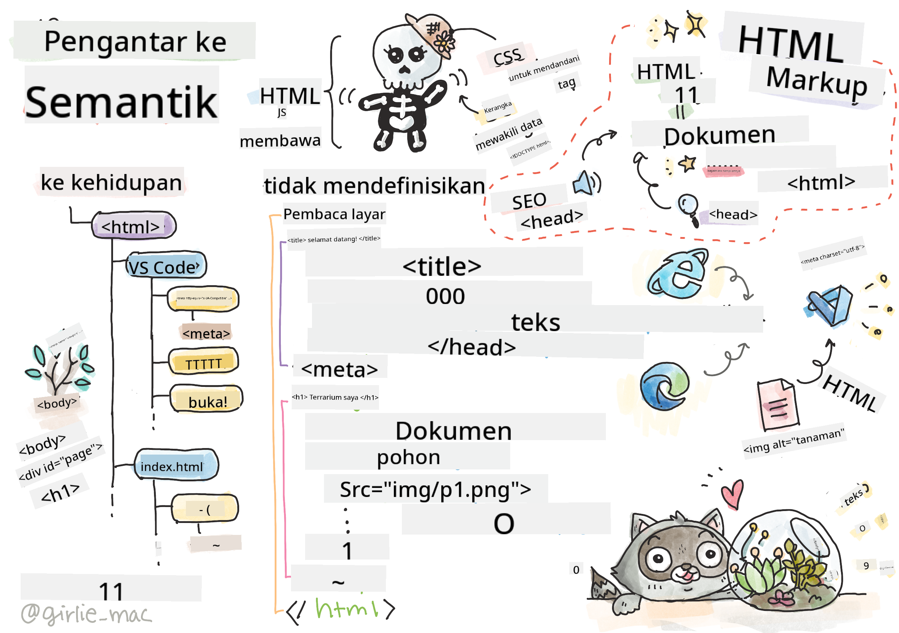
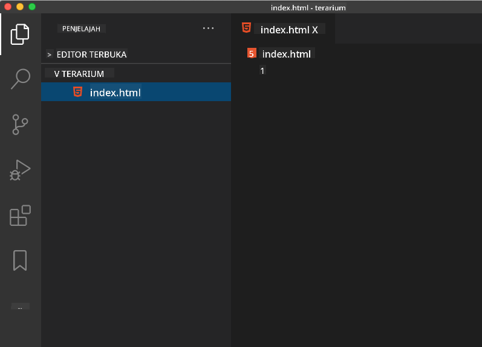

<!--
CO_OP_TRANSLATOR_METADATA:
{
  "original_hash": "46a0639e719b9cf1dfd062aa24cad639",
  "translation_date": "2025-08-27T22:56:41+00:00",
  "source_file": "3-terrarium/1-intro-to-html/README.md",
  "language_code": "id"
}
-->
# Proyek Terrarium Bagian 1: Pengantar HTML


> Sketchnote oleh [Tomomi Imura](https://twitter.com/girlie_mac)

## Kuis Pra-Pelajaran

[Kuis pra-pelajaran](https://ashy-river-0debb7803.1.azurestaticapps.net/quiz/15)

> Tonton video

> 
> [](https://www.youtube.com/watch?v=1TvxJKBzhyQ)

### Pengantar

HTML, atau HyperText Markup Language, adalah 'kerangka' dari web. Jika CSS 'mendandani' HTML Anda dan JavaScript memberikan kehidupan, maka HTML adalah tubuh dari aplikasi web Anda. Sintaks HTML bahkan mencerminkan ide ini, karena mencakup tag "head", "body", dan "footer".

Dalam pelajaran ini, kita akan menggunakan HTML untuk membuat kerangka antarmuka terrarium virtual kita. Antarmuka ini akan memiliki judul dan tiga kolom: kolom kanan dan kiri tempat tanaman yang dapat diseret berada, serta area tengah yang akan menjadi terrarium yang terlihat seperti kaca. Pada akhir pelajaran ini, Anda akan dapat melihat tanaman di kolom-kolom tersebut, tetapi antarmuka akan terlihat sedikit aneh; jangan khawatir, di bagian berikutnya Anda akan menambahkan gaya CSS ke antarmuka untuk membuatnya terlihat lebih baik.

### Tugas

Di komputer Anda, buat folder bernama 'terrarium' dan di dalamnya, buat file bernama 'index.html'. Anda dapat melakukannya di Visual Studio Code setelah Anda membuat folder terrarium dengan membuka jendela VS Code baru, mengklik 'open folder', dan menavigasi ke folder baru Anda. Klik tombol kecil 'file' di panel Explorer dan buat file baru:



Atau

Gunakan perintah ini di git bash Anda:
* `mkdir terrarium`
* `cd terrarium`
* `touch index.html`
* `code index.html` atau `nano index.html`

> File index.html menunjukkan kepada browser bahwa itu adalah file default dalam folder; URL seperti `https://anysite.com/test` mungkin dibangun menggunakan struktur folder yang mencakup folder bernama `test` dengan `index.html` di dalamnya; `index.html` tidak harus muncul di URL.

---

## DocType dan tag html

Baris pertama dari file HTML adalah doctype-nya. Agak mengejutkan bahwa Anda perlu memiliki baris ini di bagian paling atas file, tetapi ini memberi tahu browser lama bahwa browser perlu merender halaman dalam mode standar, mengikuti spesifikasi html saat ini.

> Tip: di VS Code, Anda dapat mengarahkan kursor ke tag dan mendapatkan informasi tentang penggunaannya dari panduan Referensi MDN.

Baris kedua harus berupa tag pembuka `<html>`, diikuti oleh tag penutupnya `</html>`. Tag ini adalah elemen root dari antarmuka Anda.

### Tugas

Tambahkan baris-baris ini di bagian atas file `index.html` Anda:

```HTML
<!DOCTYPE html>
<html></html>
```

✅ Ada beberapa mode berbeda yang dapat ditentukan dengan mengatur DocType menggunakan query string: [Quirks Mode dan Standards Mode](https://developer.mozilla.org/docs/Web/HTML/Quirks_Mode_and_Standards_Mode). Mode ini dulu mendukung browser yang sangat lama yang biasanya tidak digunakan lagi saat ini (Netscape Navigator 4 dan Internet Explorer 5). Anda dapat tetap menggunakan deklarasi doctype standar.

---

## 'Head' dokumen

Area 'head' dari dokumen HTML mencakup informasi penting tentang halaman web Anda, yang juga dikenal sebagai [metadata](https://developer.mozilla.org/docs/Web/HTML/Element/meta). Dalam kasus kita, kita memberi tahu server web tempat halaman ini akan dikirim untuk dirender, empat hal ini:

-   judul halaman
-   metadata halaman termasuk:
    -   'character set', yang memberi tahu tentang pengkodean karakter yang digunakan di halaman
    -   informasi browser, termasuk `x-ua-compatible` yang menunjukkan bahwa browser IE=edge didukung
    -   informasi tentang bagaimana viewport harus berperilaku saat dimuat. Mengatur viewport untuk memiliki skala awal 1 mengontrol tingkat zoom saat halaman pertama kali dimuat.

### Tugas

Tambahkan blok 'head' ke dokumen Anda di antara tag pembuka dan penutup `<html>`.

```html
<head>
	<title>Welcome to my Virtual Terrarium</title>
	<meta charset="utf-8" />
	<meta http-equiv="X-UA-Compatible" content="IE=edge" />
	<meta name="viewport" content="width=device-width, initial-scale=1" />
</head>
```

✅ Apa yang akan terjadi jika Anda mengatur tag meta viewport seperti ini: `<meta name="viewport" content="width=600">`? Baca lebih lanjut tentang [viewport](https://developer.mozilla.org/docs/Web/HTML/Viewport_meta_tag).

---

## `Body` dokumen

### Tag HTML

Dalam HTML, Anda menambahkan tag ke file .html Anda untuk membuat elemen halaman web. Setiap tag biasanya memiliki tag pembuka dan penutup, seperti ini: `<p>hello</p>` untuk menunjukkan paragraf. Buat tubuh antarmuka Anda dengan menambahkan satu set tag `<body>` di dalam pasangan tag `<html>`; markup Anda sekarang terlihat seperti ini:

### Tugas

```html
<!DOCTYPE html>
<html>
	<head>
		<title>Welcome to my Virtual Terrarium</title>
		<meta charset="utf-8" />
		<meta http-equiv="X-UA-Compatible" content="IE=edge" />
		<meta name="viewport" content="width=device-width, initial-scale=1" />
	</head>
	<body></body>
</html>
```

Sekarang, Anda dapat mulai membangun halaman Anda. Biasanya, Anda menggunakan tag `<div>` untuk membuat elemen-elemen terpisah di halaman. Kita akan membuat serangkaian elemen `<div>` yang akan berisi gambar.

### Gambar

Satu tag html yang tidak memerlukan tag penutup adalah tag ``, karena memiliki elemen `src` yang berisi semua informasi yang dibutuhkan halaman untuk merender item.

Buat folder di aplikasi Anda bernama `images` dan di dalamnya, tambahkan semua gambar di [folder kode sumber](../../../../3-terrarium/solution/images); (ada 14 gambar tanaman).

### Tugas

Tambahkan gambar-gambar tanaman tersebut ke dalam dua kolom di antara tag `<body></body>`:

```html
<div id="page">
	<div id="left-container" class="container">
		<div class="plant-holder">
			
		</div>
		<div class="plant-holder">
			
		</div>
		<div class="plant-holder">
			
		</div>
		<div class="plant-holder">
			
		</div>
		<div class="plant-holder">
			
		</div>
		<div class="plant-holder">
			
		</div>
		<div class="plant-holder">
			
		</div>
	</div>
	<div id="right-container" class="container">
		<div class="plant-holder">
			
		</div>
		<div class="plant-holder">
			
		</div>
		<div class="plant-holder">
			
		</div>
		<div class="plant-holder">
			
		</div>
		<div class="plant-holder">
			
		</div>
		<div class="plant-holder">
			
		</div>
		<div class="plant-holder">
			
		</div>
	</div>
</div>
```

> Catatan: Spans vs. Divs. Divs dianggap sebagai elemen 'block', dan Spans adalah 'inline'. Apa yang akan terjadi jika Anda mengubah divs ini menjadi spans?

Dengan markup ini, tanaman sekarang muncul di layar. Tampaknya cukup buruk, karena mereka belum diberi gaya menggunakan CSS, dan kita akan melakukannya di pelajaran berikutnya.

Setiap gambar memiliki teks alternatif yang akan muncul bahkan jika Anda tidak dapat melihat atau merender gambar. Ini adalah atribut penting untuk disertakan demi aksesibilitas. Pelajari lebih lanjut tentang aksesibilitas di pelajaran mendatang; untuk saat ini, ingatlah bahwa atribut alt memberikan informasi alternatif untuk gambar jika pengguna karena alasan tertentu tidak dapat melihatnya (karena koneksi lambat, kesalahan dalam atribut src, atau jika pengguna menggunakan pembaca layar).

✅ Apakah Anda memperhatikan bahwa setiap gambar memiliki tag alt yang sama? Apakah ini praktik yang baik? Mengapa atau mengapa tidak? Bisakah Anda memperbaiki kode ini?

---

## Markup semantik

Secara umum, lebih baik menggunakan 'semantik' yang bermakna saat menulis HTML. Apa artinya? Artinya Anda menggunakan tag HTML untuk mewakili jenis data atau interaksi yang dirancang untuk mereka. Misalnya, teks judul utama di halaman harus menggunakan tag `<h1>`.

Tambahkan baris berikut tepat di bawah tag pembuka `<body>` Anda:

```html
<h1>My Terrarium</h1>
```

Menggunakan markup semantik seperti memiliki header sebagai `<h1>` dan daftar tidak berurutan sebagai `<ul>` membantu pembaca layar menavigasi melalui halaman. Secara umum, tombol harus ditulis sebagai `<button>` dan daftar harus `<li>`. Meskipun _mungkin_ menggunakan elemen `<span>` yang dirancang khusus dengan pengendali klik untuk meniru tombol, lebih baik bagi pengguna yang memiliki keterbatasan untuk menggunakan teknologi untuk menentukan di mana tombol berada di halaman, dan berinteraksi dengannya, jika elemen tersebut muncul sebagai tombol. Untuk alasan ini, cobalah menggunakan markup semantik sebanyak mungkin.

✅ Lihatlah pembaca layar dan [bagaimana ia berinteraksi dengan halaman web](https://www.youtube.com/watch?v=OUDV1gqs9GA). Bisakah Anda melihat mengapa memiliki markup non-semantik dapat membuat pengguna frustrasi?

## Terrarium

Bagian terakhir dari antarmuka ini melibatkan pembuatan markup yang akan diberi gaya untuk membuat terrarium.

### Tugas:

Tambahkan markup ini di atas tag `</div>` terakhir:

```html
<div id="terrarium">
	<div class="jar-top"></div>
	<div class="jar-walls">
		<div class="jar-glossy-long"></div>
		<div class="jar-glossy-short"></div>
	</div>
	<div class="dirt"></div>
	<div class="jar-bottom"></div>
</div>
```

✅ Meskipun Anda menambahkan markup ini ke layar, Anda sama sekali tidak melihat apa pun yang dirender. Mengapa?

---

## 🚀Tantangan

Ada beberapa tag 'lama' yang menarik di HTML yang masih menyenangkan untuk dimainkan, meskipun Anda sebaiknya tidak menggunakan tag yang sudah usang seperti [tag-tag ini](https://developer.mozilla.org/docs/Web/HTML/Element#Obsolete_and_deprecated_elements) dalam markup Anda. Namun, bisakah Anda menggunakan tag lama `<marquee>` untuk membuat judul h1 bergulir secara horizontal? (jika Anda melakukannya, jangan lupa untuk menghapusnya setelahnya)

## Kuis Pasca-Pelajaran

[Kuis pasca-pelajaran](https://ashy-river-0debb7803.1.azurestaticapps.net/quiz/16)

## Tinjauan & Studi Mandiri

HTML adalah sistem blok bangunan 'teruji dan benar' yang telah membantu membangun web menjadi seperti sekarang ini. Pelajari sedikit tentang sejarahnya dengan mempelajari beberapa tag lama dan baru. Bisakah Anda memahami mengapa beberapa tag dihapus dan beberapa ditambahkan? Tag apa yang mungkin diperkenalkan di masa depan?

Pelajari lebih lanjut tentang membangun situs untuk web dan perangkat seluler di [Microsoft Learn](https://docs.microsoft.com/learn/modules/build-simple-website/?WT.mc_id=academic-77807-sagibbon).

## Tugas

[Latih HTML Anda: Bangun mockup blog](assignment.md)

---

**Penafian**:  
Dokumen ini telah diterjemahkan menggunakan layanan penerjemahan AI [Co-op Translator](https://github.com/Azure/co-op-translator). Meskipun kami berusaha untuk memberikan hasil yang akurat, harap diingat bahwa terjemahan otomatis mungkin mengandung kesalahan atau ketidakakuratan. Dokumen asli dalam bahasa aslinya harus dianggap sebagai sumber yang otoritatif. Untuk informasi yang bersifat kritis, disarankan menggunakan jasa penerjemahan profesional oleh manusia. Kami tidak bertanggung jawab atas kesalahpahaman atau penafsiran yang keliru yang timbul dari penggunaan terjemahan ini.