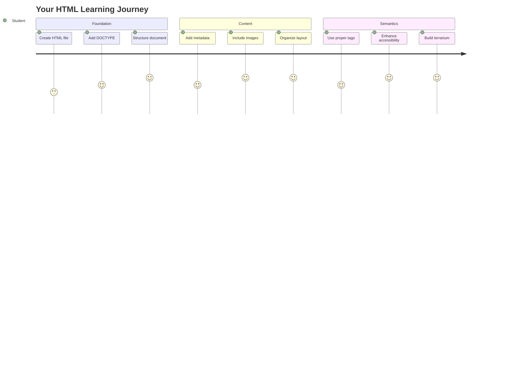
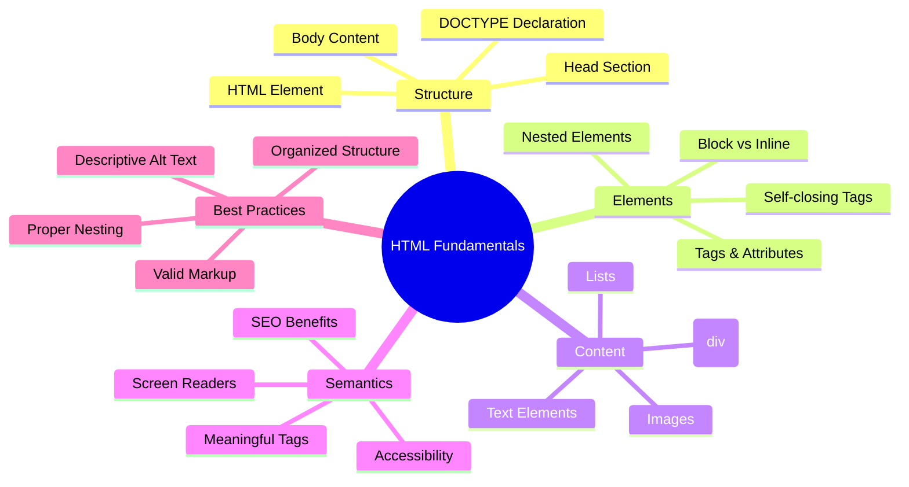
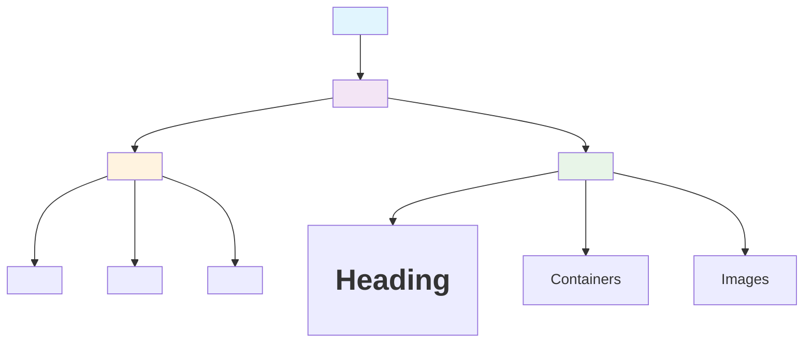
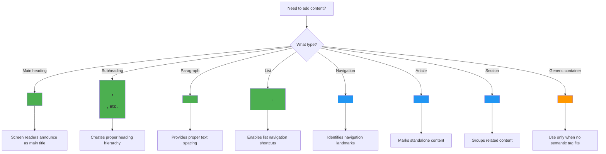
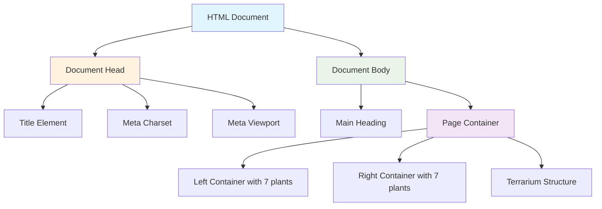
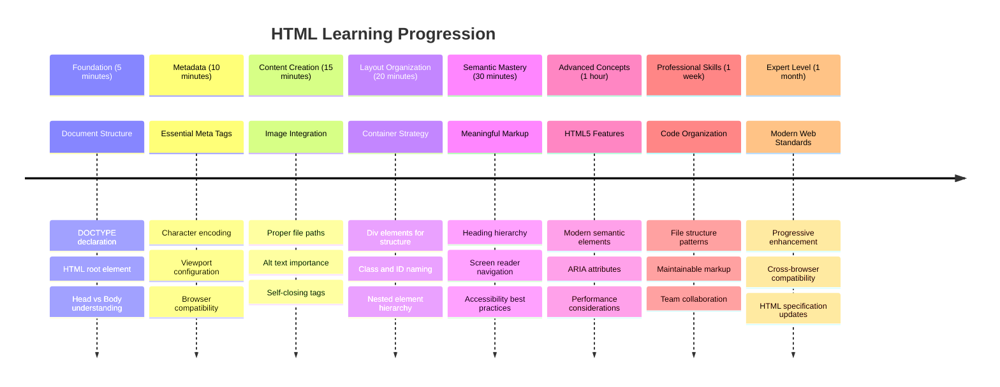

<!--
CO_OP_TRANSLATOR_METADATA:
{
  "original_hash": "3fcfa99c4897e051b558b5eaf1e8cc74",
  "translation_date": "2025-11-06T11:49:22+00:00",
  "source_file": "3-terrarium/1-intro-to-html/README.md",
  "language_code": "id"
}
-->
# Proyek Terrarium Bagian 1: Pengantar HTML




> Sketchnote oleh [Tomomi Imura](https://twitter.com/girlie_mac)

HTML, atau HyperText Markup Language, adalah dasar dari setiap situs web yang pernah Anda kunjungi. Pikirkan HTML sebagai kerangka yang memberikan struktur pada halaman web – HTML menentukan di mana konten berada, bagaimana konten diatur, dan apa yang diwakili oleh setiap bagian. Sementara CSS nantinya akan "mendandani" HTML Anda dengan warna dan tata letak, dan JavaScript akan menghidupkannya dengan interaktivitas, HTML menyediakan struktur penting yang membuat semuanya menjadi mungkin.

Dalam pelajaran ini, Anda akan membuat struktur HTML untuk antarmuka terrarium virtual. Proyek praktis ini akan mengajarkan Anda konsep dasar HTML sambil membangun sesuatu yang menarik secara visual. Anda akan belajar cara mengatur konten menggunakan elemen semantik, bekerja dengan gambar, dan membuat dasar untuk aplikasi web interaktif.

Pada akhir pelajaran ini, Anda akan memiliki halaman HTML yang berfungsi, menampilkan gambar tanaman dalam kolom yang terorganisir, siap untuk ditata pada pelajaran berikutnya. Jangan khawatir jika tampilannya sederhana pada awalnya – itulah yang seharusnya dilakukan HTML sebelum CSS menambahkan sentuhan visual.



## Kuis Pra-Pelajaran

[Kuis pra-pelajaran](https://ff-quizzes.netlify.app/web/quiz/15)

> 📺 **Tonton dan Pelajari**: Lihat video ulasan yang bermanfaat ini
> 
> [](https://www.youtube.com/watch?v=1TvxJKBzhyQ)

## Menyiapkan Proyek Anda

Sebelum kita mulai dengan kode HTML, mari kita siapkan ruang kerja yang tepat untuk proyek terrarium Anda. Membuat struktur file yang terorganisir sejak awal adalah kebiasaan penting yang akan sangat membantu Anda sepanjang perjalanan pengembangan web.

### Tugas: Buat Struktur Proyek Anda

Anda akan membuat folder khusus untuk proyek terrarium Anda dan menambahkan file HTML pertama Anda. Berikut dua pendekatan yang dapat Anda gunakan:

**Opsi 1: Menggunakan Visual Studio Code**
1. Buka Visual Studio Code
2. Klik "File" → "Open Folder" atau gunakan `Ctrl+K, Ctrl+O` (Windows/Linux) atau `Cmd+K, Cmd+O` (Mac)
3. Buat folder baru bernama `terrarium` dan pilih folder tersebut
4. Di panel Explorer, klik ikon "New File"
5. Beri nama file Anda `index.html`


**Opsi 2: Menggunakan Perintah Terminal**
```bash
mkdir terrarium
cd terrarium
touch index.html
code index.html
```

**Berikut yang dilakukan oleh perintah ini:**
- **Membuat** direktori baru bernama `terrarium` untuk proyek Anda
- **Masuk** ke direktori terrarium 
- **Membuat** file kosong `index.html`
- **Membuka** file di Visual Studio Code untuk diedit

> 💡 **Tips Pro**: Nama file `index.html` memiliki arti khusus dalam pengembangan web. Ketika seseorang mengunjungi sebuah situs web, browser secara otomatis mencari `index.html` sebagai halaman default untuk ditampilkan. Ini berarti URL seperti `https://mysite.com/projects/` akan secara otomatis menampilkan file `index.html` dari folder `projects` tanpa perlu menyebutkan nama file dalam URL.

## Memahami Struktur Dokumen HTML

Setiap dokumen HTML mengikuti struktur tertentu yang diperlukan agar browser dapat memahami dan menampilkan dengan benar. Pikirkan struktur ini seperti surat resmi – memiliki elemen yang diperlukan dalam urutan tertentu yang membantu penerima (dalam hal ini, browser) memproses konten dengan benar.



Mari kita mulai dengan menambahkan dasar penting yang dibutuhkan setiap dokumen HTML.

### Deklarasi DOCTYPE dan Elemen Root

Dua baris pertama dari file HTML mana pun berfungsi sebagai "pengantar" dokumen ke browser:

```html
<!DOCTYPE html>
<html></html>
```

**Memahami apa yang dilakukan kode ini:**
- **Mendeklarasikan** jenis dokumen sebagai HTML5 menggunakan `<!DOCTYPE html>`
- **Membuat** elemen root `<html>` yang akan berisi semua konten halaman
- **Menetapkan** standar web modern untuk rendering browser yang tepat
- **Memastikan** tampilan konsisten di berbagai browser dan perangkat

> 💡 **Tips VS Code**: Arahkan kursor ke tag HTML mana pun di VS Code untuk melihat informasi bermanfaat dari MDN Web Docs, termasuk contoh penggunaan dan detail kompatibilitas browser.

> 📚 **Pelajari Lebih Lanjut**: Deklarasi DOCTYPE mencegah browser memasuki "quirks mode," yang digunakan untuk mendukung situs web yang sangat lama. Pengembangan web modern menggunakan deklarasi sederhana `<!DOCTYPE html>` untuk memastikan [rendering yang sesuai standar](https://developer.mozilla.org/docs/Web/HTML/Quirks_Mode_and_Standards_Mode).

### 🔄 **Pengecekan Pedagogis**
**Berhenti dan Renungkan**: Sebelum melanjutkan, pastikan Anda memahami:
- ✅ Mengapa setiap dokumen HTML membutuhkan deklarasi DOCTYPE
- ✅ Apa yang terkandung dalam elemen root `<html>`
- ✅ Bagaimana struktur ini membantu browser merender halaman dengan benar

**Tes Diri Cepat**: Bisakah Anda menjelaskan dengan kata-kata Anda sendiri apa arti "rendering yang sesuai standar"?

## Menambahkan Metadata Dokumen Penting

Bagian `<head>` dari dokumen HTML berisi informasi penting yang dibutuhkan browser dan mesin pencari, tetapi tidak langsung terlihat oleh pengunjung di halaman. Pikirkan ini sebagai informasi "di balik layar" yang membantu halaman web Anda berfungsi dengan baik dan tampil dengan benar di berbagai perangkat dan platform.

Metadata ini memberi tahu browser cara menampilkan halaman Anda, karakter encoding apa yang digunakan, dan cara menangani berbagai ukuran layar – semua hal penting untuk membuat halaman web yang profesional dan dapat diakses.

### Tugas: Tambahkan Bagian Head Dokumen

Masukkan bagian `<head>` ini di antara tag pembuka dan penutup `<html>` Anda:

```html
<head>
	<title>Welcome to my Virtual Terrarium</title>
	<meta charset="utf-8" />
	<meta http-equiv="X-UA-Compatible" content="IE=edge" />
	<meta name="viewport" content="width=device-width, initial-scale=1" />
</head>
```

**Memecah apa yang dilakukan setiap elemen:**
- **Menetapkan** judul halaman yang muncul di tab browser dan hasil pencarian
- **Menentukan** encoding karakter UTF-8 untuk tampilan teks yang benar di seluruh dunia
- **Memastikan** kompatibilitas dengan versi modern Internet Explorer
- **Mengonfigurasi** desain responsif dengan mengatur viewport agar sesuai dengan lebar perangkat
- **Mengontrol** tingkat zoom awal untuk menampilkan konten dalam ukuran alami

> 🤔 **Pikirkan Ini**: Apa yang akan terjadi jika Anda menetapkan tag meta viewport seperti ini: `<meta name="viewport" content="width=600">`? Ini akan memaksa halaman selalu memiliki lebar 600 piksel, merusak desain responsif! Pelajari lebih lanjut tentang [konfigurasi viewport yang tepat](https://developer.mozilla.org/docs/Web/HTML/Viewport_meta_tag).

## Membangun Body Dokumen

Elemen `<body>` berisi semua konten yang terlihat dari halaman web Anda – segala sesuatu yang akan dilihat dan berinteraksi dengan pengguna. Sementara bagian `<head>` memberikan instruksi kepada browser, bagian `<body>` berisi konten aktual: teks, gambar, tombol, dan elemen lain yang membentuk antarmuka pengguna Anda.

Mari tambahkan struktur body dan pahami bagaimana tag HTML bekerja bersama untuk menciptakan konten yang bermakna.

### Memahami Struktur Tag HTML

HTML menggunakan tag berpasangan untuk mendefinisikan elemen. Sebagian besar tag memiliki tag pembuka seperti `<p>` dan tag penutup seperti `</p>`, dengan konten di antaranya: `<p>Halo, dunia!</p>`. Ini menciptakan elemen paragraf yang berisi teks "Halo, dunia!".

### Tugas: Tambahkan Elemen Body

Perbarui file HTML Anda untuk menyertakan elemen `<body>`:

```html
<!DOCTYPE html>
<html>
	<head>
		<title>Welcome to my Virtual Terrarium</title>
		<meta charset="utf-8" />
		<meta http-equiv="X-UA-Compatible" content="IE=edge" />
		<meta name="viewport" content="width=device-width, initial-scale=1" />
	</head>
	<body></body>
</html>
```

**Berikut yang disediakan oleh struktur lengkap ini:**
- **Menetapkan** kerangka dokumen HTML5 dasar
- **Menyertakan** metadata penting untuk rendering browser yang tepat
- **Membuat** body kosong yang siap untuk konten yang terlihat
- **Mengikuti** praktik terbaik pengembangan web modern

Sekarang Anda siap menambahkan elemen yang terlihat dari terrarium Anda. Kita akan menggunakan elemen `<div>` sebagai wadah untuk mengatur berbagai bagian konten, dan elemen `` untuk menampilkan gambar tanaman.

### Bekerja dengan Gambar dan Wadah Tata Letak

Gambar memiliki keistimewaan dalam HTML karena menggunakan tag "self-closing". Tidak seperti elemen seperti `<p></p>` yang membungkus konten, tag `` berisi semua informasi yang dibutuhkan dalam tag itu sendiri menggunakan atribut seperti `src` untuk jalur file gambar dan `alt` untuk aksesibilitas.

Sebelum menambahkan gambar ke HTML Anda, Anda perlu mengatur file proyek Anda dengan benar dengan membuat folder gambar dan menambahkan grafik tanaman.

**Pertama, siapkan gambar Anda:**
1. Buat folder bernama `images` di dalam folder proyek terrarium Anda
2. Unduh gambar tanaman dari [folder solusi](../../../../3-terrarium/solution/images) (total 14 gambar tanaman)
3. Salin semua gambar tanaman ke folder `images` baru Anda

### Tugas: Buat Tata Letak Tampilan Tanaman

Sekarang tambahkan gambar tanaman yang diatur dalam dua kolom di antara tag `<body></body>` Anda:

```html
<div id="page">
	<div id="left-container" class="container">
		<div class="plant-holder">
			
		</div>
		<div class="plant-holder">
			
		</div>
		<div class="plant-holder">
			
		</div>
		<div class="plant-holder">
			
		</div>
		<div class="plant-holder">
			
		</div>
		<div class="plant-holder">
			
		</div>
		<div class="plant-holder">
			
		</div>
	</div>
	<div id="right-container" class="container">
		<div class="plant-holder">
			
		</div>
		<div class="plant-holder">
			
		</div>
		<div class="plant-holder">
			
		</div>
		<div class="plant-holder">
			
		</div>
		<div class="plant-holder">
			
		</div>
		<div class="plant-holder">
			
		</div>
		<div class="plant-holder">
			
		</div>
	</div>
</div>
```

**Langkah demi langkah, berikut yang terjadi dalam kode ini:**
- **Membuat** wadah halaman utama dengan `id="page"` untuk menampung semua konten
- **Menetapkan** dua wadah kolom: `left-container` dan `right-container`
- **Mengatur** 7 tanaman di kolom kiri dan 7 tanaman di kolom kanan
- **Membungkus** setiap gambar tanaman dalam div `plant-holder` untuk posisi individu
- **Menerapkan** nama kelas yang konsisten untuk penataan CSS pada pelajaran berikutnya
- **Menetapkan** ID unik untuk setiap gambar tanaman untuk interaksi JavaScript nanti
- **Menyertakan** jalur file yang benar yang menunjuk ke folder gambar

> 🤔 **Pertimbangkan Ini**: Perhatikan bahwa semua gambar saat ini memiliki teks alt yang sama "plant". Ini tidak ideal untuk aksesibilitas. Pengguna pembaca layar akan mendengar "plant" diulang 14 kali tanpa mengetahui tanaman spesifik apa yang ditampilkan oleh setiap gambar. Bisakah Anda memikirkan teks alt yang lebih baik dan deskriptif untuk setiap gambar?

> 📝 **Jenis Elemen HTML**: Elemen `<div>` adalah "block-level" dan mengambil lebar penuh, sedangkan elemen `<span>` adalah "inline" dan hanya mengambil lebar yang diperlukan. Apa yang menurut Anda akan terjadi jika Anda mengganti semua tag `<div>` ini dengan tag `<span>`?

### 🔄 **Pengecekan Pedagogis**
**Memahami Struktur**: Luangkan waktu untuk meninjau struktur HTML Anda:
- ✅ Bisakah Anda mengidentifikasi wadah utama dalam tata letak Anda?
- ✅ Apakah Anda memahami mengapa setiap gambar memiliki ID unik?
- ✅ Bagaimana Anda akan menjelaskan tujuan dari div `plant-holder`?

**Inspeksi Visual**: Buka file HTML Anda di browser. Anda seharusnya melihat:
- Daftar sederhana gambar tanaman
- Gambar yang diatur dalam dua kolom
- Tata letak sederhana tanpa gaya

**Ingat**: Tampilan sederhana ini adalah apa yang seharusnya dilakukan HTML sebelum penataan CSS!

Dengan markup ini ditambahkan, tanaman akan muncul di layar, meskipun belum terlihat menarik – itulah fungsi CSS pada pelajaran berikutnya! Untuk saat ini, Anda memiliki dasar HTML yang solid yang mengatur konten Anda dengan benar dan mengikuti praktik terbaik aksesibilitas.

## Menggunakan HTML Semantik untuk Aksesibilitas

HTML semantik berarti memilih elemen HTML berdasarkan makna dan tujuannya, bukan hanya penampilannya. Ketika Anda menggunakan markup semantik, Anda mengkomunikasikan struktur dan makna konten Anda kepada browser, mesin pencari, dan teknologi bantu seperti pembaca layar.



Pendekatan ini membuat situs web Anda lebih mudah diakses oleh pengguna dengan disabilitas dan membantu mesin pencari memahami konten Anda dengan lebih baik. Ini adalah prinsip dasar pengembangan web modern yang menciptakan pengalaman yang lebih baik untuk semua orang.

### Menambahkan Judul Halaman Semantik

Mari tambahkan judul yang sesuai untuk halaman terrarium Anda. Masukkan baris ini tepat setelah tag pembuka `<body>`:

```html
<h1>My Terrarium</h1>
```

**Mengapa markup semantik penting:**
- **Membantu** pembaca layar menavigasi dan memahami struktur halaman
- **Meningkatkan** optimasi mesin pencari (SEO) dengan memperjelas hierarki konten
- **Meningkatkan** aksesibilitas bagi pengguna dengan gangguan penglihatan atau perbedaan kognitif
- **Menciptakan** pengalaman pengguna yang lebih baik di semua perangkat dan platform
- **Mengikuti** standar web dan praktik terbaik untuk pengembangan profesional

**Contoh pilihan semantik vs. non-semantik:**

| Tujuan | ✅ Pilihan Semantik | ❌ Pilihan Non-Semantik |
|--------|---------------------|-------------------------|
| Judul utama | `<h1>Judul</h1>` | `<div class="big-text">Judul</div>` |
| Navigasi | `<nav><ul><li></li></ul></nav>` | `<div class="menu"><div></div></div>` |
| Tombol | `<button>Klik saya</button>` | `<span onclick="...">Klik saya</span>` |
| Konten artikel | `<article><p></p></article>` | `<div class="content"><div></div></div>` |

> 🎥 **Lihat dalam Aksi**: Tonton [bagaimana pembaca layar berinteraksi dengan halaman web](https://www.youtube.com/watch?v=OUDV1gqs9GA) untuk memahami mengapa markup semantik sangat penting untuk aksesibilitas. Perhatikan bagaimana struktur HTML yang tepat membantu pengguna menavigasi dengan efisien.

## Membuat Wadah Terrarium

Sekarang mari tambahkan struktur HTML untuk terrarium itu sendiri – wadah kaca tempat tanaman nantinya akan ditempatkan. Bagian ini menunjukkan konsep penting: HTML menyediakan struktur, tetapi tanpa penataan CSS, elemen-elemen ini belum akan terlihat.

Markup terrarium menggunakan nama kelas deskriptif yang akan membuat penataan CSS intuitif dan mudah dikelola pada pelajaran berikutnya.

### Tugas: Tambahkan Struktur Terrarium

Masukkan markup ini di atas tag `</div>` terakhir (sebelum tag penutup dari wadah halaman):

```html
<div id="terrarium">
	<div class="jar-top"></div>
	<div class="jar-walls">
		<div class="jar-glossy-long"></div>
		<div class="jar-glossy-short"></div>
	</div>
	<div class="dirt"></div>
	<div class="jar-bottom"></div>
</div>
```

**Memahami struktur terrarium ini:**
- **Membuat** wadah terrarium utama dengan ID unik untuk penataan
- **Mendefinisikan** elemen terpisah untuk setiap komponen visual (atas, dinding, tanah, bawah)
- **Menyertakan** elemen bersarang untuk efek refleksi kaca (elemen mengkilap)
- **Menggunakan** nama kelas deskriptif yang jelas menunjukkan tujuan setiap elemen
- **Mempersiapkan** struktur untuk styling CSS yang akan menciptakan tampilan terrarium kaca

> 🤔 **Perhatikan Sesuatu?**: Meskipun Anda telah menambahkan markup ini, Anda tidak melihat apa pun yang baru di halaman! Ini dengan sempurna menggambarkan bagaimana HTML menyediakan struktur sementara CSS memberikan tampilan. Elemen `<div>` ini ada tetapi belum memiliki gaya visual – itu akan dibahas di pelajaran berikutnya!



### 🔄 **Pengecekan Pedagogis**
**Penguasaan Struktur HTML**: Sebelum melanjutkan, pastikan Anda dapat:
- ✅ Menjelaskan perbedaan antara struktur HTML dan tampilan visual
- ✅ Mengidentifikasi elemen HTML semantik vs. non-semantik
- ✅ Menguraikan bagaimana markup yang tepat meningkatkan aksesibilitas
- ✅ Mengenali struktur pohon dokumen secara lengkap

**Menguji Pemahaman Anda**: Cobalah membuka file HTML Anda di browser dengan JavaScript dinonaktifkan dan CSS dihapus. Ini menunjukkan struktur semantik murni yang telah Anda buat!

---

## Tantangan Agen GitHub Copilot

Gunakan mode Agen untuk menyelesaikan tantangan berikut:

**Deskripsi:** Buat struktur HTML semantik untuk bagian panduan perawatan tanaman yang dapat ditambahkan ke proyek terrarium.

**Prompt:** Buat bagian HTML semantik yang mencakup judul utama "Panduan Perawatan Tanaman", tiga subbagian dengan judul "Penyiraman", "Kebutuhan Cahaya", dan "Perawatan Tanah", masing-masing berisi paragraf informasi perawatan tanaman. Gunakan tag HTML semantik yang sesuai seperti `<section>`, `<h2>`, `<h3>`, dan `<p>` untuk menyusun konten dengan tepat.

Pelajari lebih lanjut tentang [mode agen](https://code.visualstudio.com/blogs/2025/02/24/introducing-copilot-agent-mode) di sini.

## Tantangan Eksplorasi Sejarah HTML

**Belajar Tentang Evolusi Web**

HTML telah berkembang pesat sejak Tim Berners-Lee menciptakan browser web pertama di CERN pada tahun 1990. Beberapa tag lama seperti `<marquee>` sekarang sudah tidak digunakan karena tidak sesuai dengan standar aksesibilitas modern dan prinsip desain responsif.

**Coba Eksperimen Ini:**
1. Sementara, bungkus judul `<h1>` Anda dalam tag `<marquee>`: `<marquee><h1>Terrarium Saya</h1></marquee>`
2. Buka halaman Anda di browser dan amati efek gulir
3. Pertimbangkan mengapa tag ini tidak digunakan lagi (petunjuk: pikirkan tentang pengalaman pengguna dan aksesibilitas)
4. Hapus tag `<marquee>` dan kembali ke markup semantik

**Pertanyaan Refleksi:**
- Bagaimana judul yang bergulir dapat memengaruhi pengguna dengan gangguan penglihatan atau sensitivitas gerakan?
- Teknik CSS modern apa yang dapat mencapai efek visual serupa dengan lebih aksesibel?
- Mengapa penting menggunakan standar web terkini daripada elemen yang sudah tidak digunakan?

Jelajahi lebih lanjut tentang [elemen HTML yang usang dan tidak digunakan](https://developer.mozilla.org/docs/Web/HTML/Element#Obsolete_and_deprecated_elements) untuk memahami bagaimana standar web berkembang demi meningkatkan pengalaman pengguna.

## Kuis Pasca-Pelajaran

[Kuis pasca-pelajaran](https://ff-quizzes.netlify.app/web/quiz/16)

## Tinjauan & Belajar Mandiri

**Perdalam Pengetahuan HTML Anda**

HTML telah menjadi dasar web selama lebih dari 30 tahun, berkembang dari bahasa markup dokumen sederhana menjadi platform canggih untuk membangun aplikasi interaktif. Memahami evolusi ini membantu Anda menghargai standar web modern dan membuat keputusan pengembangan yang lebih baik.

**Jalur Pembelajaran yang Direkomendasikan:**

1. **Sejarah dan Evolusi HTML**
   - Teliti garis waktu dari HTML 1.0 hingga HTML5
   - Jelajahi mengapa beberapa tag tidak digunakan lagi (aksesibilitas, ramah seluler, pemeliharaan)
   - Selidiki fitur HTML yang sedang berkembang dan proposal baru

2. **Pendalaman HTML Semantik**
   - Pelajari daftar lengkap [elemen semantik HTML5](https://developer.mozilla.org/docs/Web/HTML/Element)
   - Latih mengidentifikasi kapan menggunakan `<article>`, `<section>`, `<aside>`, dan `<main>`
   - Pelajari atribut ARIA untuk meningkatkan aksesibilitas

3. **Pengembangan Web Modern**
   - Jelajahi [membangun situs web responsif](https://docs.microsoft.com/learn/modules/build-simple-website/?WT.mc_id=academic-77807-sagibbon) di Microsoft Learn
   - Pahami bagaimana HTML terintegrasi dengan CSS dan JavaScript
   - Pelajari praktik terbaik kinerja web dan SEO

**Pertanyaan Refleksi:**
- Tag HTML mana yang sudah tidak digunakan lagi yang Anda temukan, dan mengapa tag tersebut dihapus?
- Fitur HTML baru apa yang sedang diusulkan untuk versi mendatang?
- Bagaimana HTML semantik berkontribusi pada aksesibilitas web dan SEO?

### ⚡ **Apa yang Bisa Anda Lakukan dalam 5 Menit Berikutnya**
- [ ] Buka DevTools (F12) dan inspeksi struktur HTML dari situs web favorit Anda
- [ ] Buat file HTML sederhana dengan tag dasar: `<h1>`, `<p>`, dan ``
- [ ] Validasi HTML Anda menggunakan Validator HTML W3C online
- [ ] Coba tambahkan komentar ke HTML Anda menggunakan `<!-- komentar -->`

### 🎯 **Apa yang Bisa Anda Capai dalam Satu Jam**
- [ ] Selesaikan kuis pasca-pelajaran dan tinjau konsep HTML semantik
- [ ] Bangun halaman web sederhana tentang diri Anda menggunakan struktur HTML yang tepat
- [ ] Bereksperimen dengan berbagai level heading dan tag format teks
- [ ] Tambahkan gambar dan tautan untuk berlatih integrasi multimedia
- [ ] Teliti fitur HTML5 yang belum Anda coba

### 📅 **Perjalanan HTML Anda Selama Seminggu**
- [ ] Selesaikan tugas proyek terrarium dengan markup semantik
- [ ] Buat halaman web yang aksesibel menggunakan label dan peran ARIA
- [ ] Latih pembuatan formulir dengan berbagai jenis input
- [ ] Jelajahi API HTML5 seperti localStorage atau geolocation
- [ ] Pelajari pola HTML responsif dan desain mobile-first
- [ ] Tinjau kode HTML pengembang lain untuk praktik terbaik

### 🌟 **Fondasi Web Anda Selama Sebulan**
- [ ] Bangun situs web portofolio yang menunjukkan penguasaan HTML Anda
- [ ] Pelajari templating HTML dengan framework seperti Handlebars
- [ ] Berkontribusi pada proyek open source dengan meningkatkan dokumentasi HTML
- [ ] Kuasai konsep HTML tingkat lanjut seperti elemen kustom
- [ ] Integrasikan HTML dengan framework CSS dan pustaka JavaScript
- [ ] Bimbing orang lain yang sedang belajar dasar-dasar HTML

## 🎯 Garis Waktu Penguasaan HTML Anda



### 🛠️ Ringkasan Toolkit HTML Anda

Setelah menyelesaikan pelajaran ini, Anda sekarang memiliki:
- **Struktur Dokumen**: Fondasi HTML5 lengkap dengan DOCTYPE yang tepat
- **Markup Semantik**: Tag bermakna yang meningkatkan aksesibilitas dan SEO
- **Integrasi Gambar**: Praktik organisasi file dan teks alt yang tepat
- **Kontainer Tata Letak**: Penggunaan div strategis dengan nama kelas deskriptif
- **Kesadaran Aksesibilitas**: Pemahaman navigasi pembaca layar
- **Standar Modern**: Praktik HTML5 terkini dan pengetahuan tentang tag yang sudah tidak digunakan
- **Fondasi Proyek**: Basis yang solid untuk styling CSS dan interaktivitas JavaScript

**Langkah Berikutnya**: Struktur HTML Anda siap untuk styling CSS! Fondasi semantik yang telah Anda bangun akan membuat pelajaran berikutnya jauh lebih mudah dipahami.

## Tugas

[Latih HTML Anda: Bangun mockup blog](assignment.md)

---

**Penafian**:  
Dokumen ini telah diterjemahkan menggunakan layanan penerjemahan AI [Co-op Translator](https://github.com/Azure/co-op-translator). Meskipun kami berupaya untuk memberikan hasil yang akurat, harap diketahui bahwa terjemahan otomatis mungkin mengandung kesalahan atau ketidakakuratan. Dokumen asli dalam bahasa aslinya harus dianggap sebagai sumber yang otoritatif. Untuk informasi yang penting, disarankan menggunakan jasa penerjemahan manusia profesional. Kami tidak bertanggung jawab atas kesalahpahaman atau penafsiran yang timbul dari penggunaan terjemahan ini.