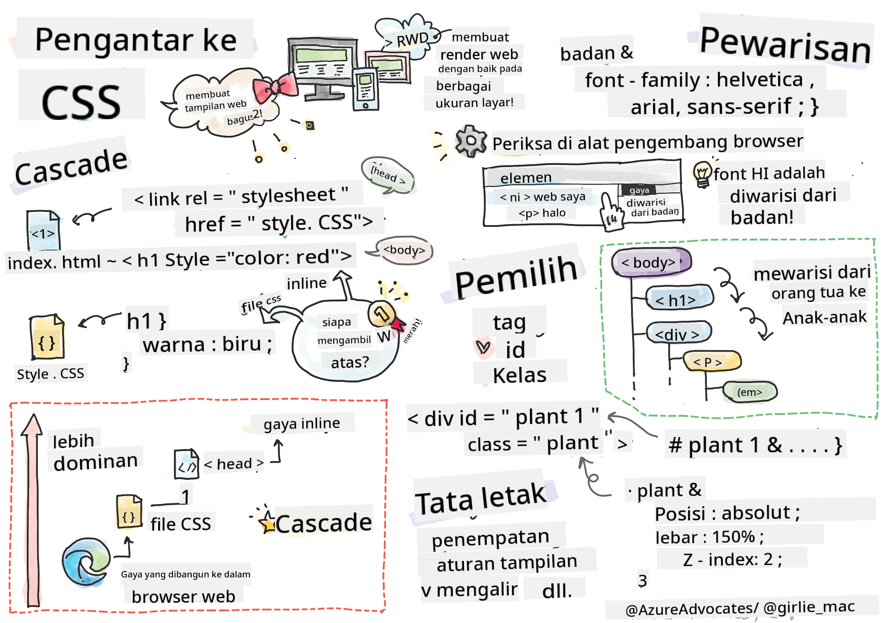
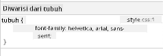

<!--
CO_OP_TRANSLATOR_METADATA:
{
  "original_hash": "acb5ae00cde004304296bb97da8ff4c3",
  "translation_date": "2025-08-29T09:14:54+00:00",
  "source_file": "3-terrarium/2-intro-to-css/README.md",
  "language_code": "id"
}
-->
# Proyek Terrarium Bagian 2: Pengantar CSS


> Sketchnote oleh [Tomomi Imura](https://twitter.com/girlie_mac)

## Kuis Pra-Kuliah

[Kuis pra-kuliah](https://ff-quizzes.netlify.app/web/quiz/17)

### Pengantar

CSS, atau Cascading Style Sheets, menyelesaikan masalah penting dalam pengembangan web: bagaimana membuat situs web Anda terlihat menarik. Memberikan gaya pada aplikasi Anda membuatnya lebih mudah digunakan dan lebih menarik; Anda juga dapat menggunakan CSS untuk menciptakan Desain Web Responsif (RWD) - memungkinkan aplikasi Anda terlihat bagus tidak peduli ukuran layar tempat mereka ditampilkan. CSS tidak hanya tentang membuat aplikasi Anda terlihat menarik; spesifikasinya mencakup animasi dan transformasi yang dapat memungkinkan interaksi canggih untuk aplikasi Anda. Kelompok Kerja CSS membantu menjaga spesifikasi CSS terkini; Anda dapat mengikuti pekerjaan mereka di [situs World Wide Web Consortium](https://www.w3.org/Style/CSS/members).

> Perlu diingat, CSS adalah bahasa yang terus berkembang, seperti halnya semua hal di web, dan tidak semua browser mendukung bagian spesifikasi yang lebih baru. Selalu periksa implementasi Anda dengan berkonsultasi di [CanIUse.com](https://caniuse.com).

Dalam pelajaran ini, kita akan menambahkan gaya pada terrarium online kita dan mempelajari lebih lanjut tentang beberapa konsep CSS: cascade, inheritance, serta penggunaan selector, positioning, dan menggunakan CSS untuk membangun tata letak. Dalam proses ini, kita akan membuat tata letak terrarium dan membangun terrarium itu sendiri.

### Prasyarat

Anda harus memiliki HTML untuk terrarium Anda yang sudah dibuat dan siap untuk diberi gaya.

> Tonton video

> 
> [](https://www.youtube.com/watch?v=6yIdOIV9p1I)

### Tugas

Di folder terrarium Anda, buat file baru bernama `style.css`. Impor file tersebut di bagian `<head>`:

```html
<link rel="stylesheet" href="./style.css" />
```

---

## Cascade

Cascading Style Sheets menggabungkan ide bahwa gaya 'mengalir' sedemikian rupa sehingga penerapan gaya dipandu oleh prioritasnya. Gaya yang ditetapkan oleh pembuat situs web memiliki prioritas lebih tinggi daripada yang ditetapkan oleh browser. Gaya yang ditetapkan 'inline' memiliki prioritas lebih tinggi daripada yang ditetapkan dalam file gaya eksternal.

### Tugas

Tambahkan gaya inline "color: red" ke tag `<h1>` Anda:

```HTML
<h1 style="color: red">My Terrarium</h1>
```

Kemudian, tambahkan kode berikut ke file `style.css` Anda:

```CSS
h1 {
 color: blue;
}
```

✅ Warna apa yang ditampilkan di aplikasi web Anda? Mengapa? Bisakah Anda menemukan cara untuk menimpa gaya? Kapan Anda ingin melakukan ini, atau mengapa tidak?

---

## Inheritance

Gaya diwarisi dari gaya leluhur ke keturunan, sehingga elemen yang bersarang mewarisi gaya dari induknya.

### Tugas

Tetapkan font pada body ke font tertentu, dan periksa font elemen yang bersarang:

```CSS
body {
	font-family: helvetica, arial, sans-serif;
}
```

Buka konsol browser Anda ke tab 'Elements' dan amati font H1. Font tersebut mewarisi font dari body, seperti yang dinyatakan dalam browser:



✅ Bisakah Anda membuat gaya yang bersarang mewarisi properti yang berbeda?

---

## CSS Selectors

### Tags

Sejauh ini, file `style.css` Anda hanya memiliki beberapa tag yang diberi gaya, dan aplikasi terlihat cukup aneh:

```CSS
body {
	font-family: helvetica, arial, sans-serif;
}

h1 {
	color: #3a241d;
	text-align: center;
}
```

Cara memberi gaya pada tag ini memberi Anda kontrol atas elemen unik, tetapi Anda perlu mengontrol gaya banyak tanaman di terrarium Anda. Untuk melakukan itu, Anda perlu memanfaatkan selector CSS.

### Ids

Tambahkan beberapa gaya untuk menata kontainer kiri dan kanan. Karena hanya ada satu kontainer kiri dan satu kontainer kanan, mereka diberi id dalam markup. Untuk memberi gaya pada mereka, gunakan `#`:

```CSS
#left-container {
	background-color: #eee;
	width: 15%;
	left: 0px;
	top: 0px;
	position: absolute;
	height: 100%;
	padding: 10px;
}

#right-container {
	background-color: #eee;
	width: 15%;
	right: 0px;
	top: 0px;
	position: absolute;
	height: 100%;
	padding: 10px;
}
```

Di sini, Anda telah menempatkan kontainer ini dengan posisi absolut di sisi kiri dan kanan layar, dan menggunakan persentase untuk lebar mereka sehingga mereka dapat menyesuaikan untuk layar ponsel kecil.

✅ Kode ini cukup berulang, sehingga tidak "DRY" (Don't Repeat Yourself); bisakah Anda menemukan cara yang lebih baik untuk memberi gaya pada id ini, mungkin dengan id dan class? Anda perlu mengubah markup dan merombak CSS:

```html
<div id="left-container" class="container"></div>
```

### Classes

Dalam contoh di atas, Anda memberi gaya pada dua elemen unik di layar. Jika Anda ingin gaya diterapkan pada banyak elemen di layar, Anda dapat menggunakan class CSS. Lakukan ini untuk menata tanaman di kontainer kiri dan kanan.

Perhatikan bahwa setiap tanaman dalam markup HTML memiliki kombinasi id dan class. Id di sini digunakan oleh JavaScript yang akan Anda tambahkan nanti untuk memanipulasi penempatan tanaman terrarium. Class, bagaimanapun, memberikan semua tanaman gaya tertentu.

```html
<div class="plant-holder">
	
</div>
```

Tambahkan kode berikut ke file `style.css` Anda:

```CSS
.plant-holder {
	position: relative;
	height: 13%;
	left: -10px;
}

.plant {
	position: absolute;
	max-width: 150%;
	max-height: 150%;
	z-index: 2;
}
```

Yang perlu diperhatikan dalam cuplikan ini adalah campuran posisi relatif dan absolut, yang akan kita bahas di bagian berikutnya. Perhatikan cara tinggi ditangani dengan persentase:

Anda menetapkan tinggi pemegang tanaman ke 13%, angka yang baik untuk memastikan semua tanaman ditampilkan di setiap kontainer vertikal tanpa perlu menggulir.

Anda mengatur pemegang tanaman untuk bergerak ke kiri agar tanaman lebih terpusat di dalam kontainer mereka. Gambar memiliki latar belakang transparan yang besar sehingga membuatnya lebih mudah untuk diseret, sehingga perlu didorong ke kiri agar lebih pas di layar.

Kemudian, tanaman itu sendiri diberi lebar maksimum 150%. Ini memungkinkan tanaman untuk menyesuaikan ukurannya saat browser menyesuaikan ukurannya. Cobalah mengubah ukuran browser Anda; tanaman tetap berada di kontainer mereka tetapi menyesuaikan ukurannya agar pas.

Yang juga perlu diperhatikan adalah penggunaan z-index, yang mengontrol ketinggian relatif suatu elemen (sehingga tanaman duduk di atas kontainer dan tampak berada di dalam terrarium).

✅ Mengapa Anda membutuhkan selector CSS untuk pemegang tanaman dan tanaman?

## CSS Positioning

Mencampur properti posisi (ada posisi statis, relatif, tetap, absolut, dan lengket) bisa sedikit rumit, tetapi jika dilakukan dengan benar, ini memberi Anda kontrol yang baik atas elemen di halaman Anda.

Elemen yang diposisikan secara absolut diposisikan relatif terhadap leluhur yang diposisikan terdekat, dan jika tidak ada, elemen tersebut diposisikan sesuai dengan body dokumen.

Elemen yang diposisikan secara relatif diposisikan berdasarkan arahan CSS untuk menyesuaikan penempatannya dari posisi awalnya.

Dalam contoh kita, `plant-holder` adalah elemen yang diposisikan secara relatif yang diposisikan di dalam kontainer yang diposisikan secara absolut. Perilaku yang dihasilkan adalah bahwa kontainer bilah sisi dipasang di kiri dan kanan, dan `plant-holder` bersarang, menyesuaikan dirinya di dalam bilah sisi, memberikan ruang untuk tanaman ditempatkan dalam baris vertikal.

> Tanaman itu sendiri juga memiliki posisi absolut, yang diperlukan untuk membuatnya dapat diseret, seperti yang akan Anda temukan dalam pelajaran berikutnya.

✅ Bereksperimenlah dengan mengganti jenis posisi kontainer samping dan `plant-holder`. Apa yang terjadi?

## CSS Layouts

Sekarang Anda akan menggunakan apa yang telah Anda pelajari untuk membangun terrarium itu sendiri, semuanya menggunakan CSS!

Pertama, beri gaya pada anak-anak div `.terrarium` sebagai persegi panjang melengkung menggunakan CSS:

```CSS
.jar-walls {
	height: 80%;
	width: 60%;
	background: #d1e1df;
	border-radius: 1rem;
	position: absolute;
	bottom: 0.5%;
	left: 20%;
	opacity: 0.5;
	z-index: 1;
}

.jar-top {
	width: 50%;
	height: 5%;
	background: #d1e1df;
	position: absolute;
	bottom: 80.5%;
	left: 25%;
	opacity: 0.7;
	z-index: 1;
}

.jar-bottom {
	width: 50%;
	height: 1%;
	background: #d1e1df;
	position: absolute;
	bottom: 0%;
	left: 25%;
	opacity: 0.7;
}

.dirt {
	width: 60%;
	height: 5%;
	background: #3a241d;
	position: absolute;
	border-radius: 0 0 1rem 1rem;
	bottom: 1%;
	left: 20%;
	opacity: 0.7;
	z-index: -1;
}
```

Perhatikan penggunaan persentase di sini. Jika Anda mengubah ukuran browser Anda, Anda dapat melihat bagaimana toples juga menyesuaikan ukurannya. Perhatikan juga persentase lebar dan tinggi untuk elemen toples dan bagaimana setiap elemen diposisikan secara absolut di tengah, dipasang di bagian bawah viewport.

Kami juga menggunakan `rem` untuk border-radius, panjang yang relatif terhadap font. Baca lebih lanjut tentang jenis pengukuran relatif ini di [spesifikasi CSS](https://www.w3.org/TR/css-values-3/#font-relative-lengths).

✅ Cobalah mengubah warna dan opasitas toples dibandingkan dengan tanah. Apa yang terjadi? Mengapa?

---

## 🚀Tantangan

Tambahkan kilau 'bubble' di area kiri bawah toples untuk membuatnya terlihat lebih seperti kaca. Anda akan memberi gaya pada `.jar-glossy-long` dan `.jar-glossy-short` agar terlihat seperti kilau yang terpantul. Berikut tampilannya:


Untuk menyelesaikan kuis pasca-kuliah, ikuti modul Learn ini: [Berikan gaya pada aplikasi HTML Anda dengan CSS](https://docs.microsoft.com/learn/modules/build-simple-website/4-css-basics/?WT.mc_id=academic-77807-sagibbon)

## Kuis Pasca-Kuliah

[Kuis pasca-kuliah](https://ff-quizzes.netlify.app/web/quiz/18)

## Tinjauan & Studi Mandiri

CSS tampaknya sederhana, tetapi ada banyak tantangan saat mencoba memberikan gaya pada aplikasi agar sempurna untuk semua browser dan semua ukuran layar. CSS-Grid dan Flexbox adalah alat yang telah dikembangkan untuk membuat pekerjaan ini lebih terstruktur dan lebih dapat diandalkan. Pelajari tentang alat-alat ini dengan bermain [Flexbox Froggy](https://flexboxfroggy.com/) dan [Grid Garden](https://codepip.com/games/grid-garden/).

## Tugas

[Refactoring CSS](assignment.md)

---

**Penafian**:  
Dokumen ini telah diterjemahkan menggunakan layanan penerjemahan AI [Co-op Translator](https://github.com/Azure/co-op-translator). Meskipun kami berupaya untuk memberikan hasil yang akurat, harap diperhatikan bahwa terjemahan otomatis mungkin mengandung kesalahan atau ketidakakuratan. Dokumen asli dalam bahasa aslinya harus dianggap sebagai sumber yang berwenang. Untuk informasi yang bersifat kritis, disarankan menggunakan jasa penerjemahan manusia profesional. Kami tidak bertanggung jawab atas kesalahpahaman atau penafsiran yang keliru yang timbul dari penggunaan terjemahan ini.