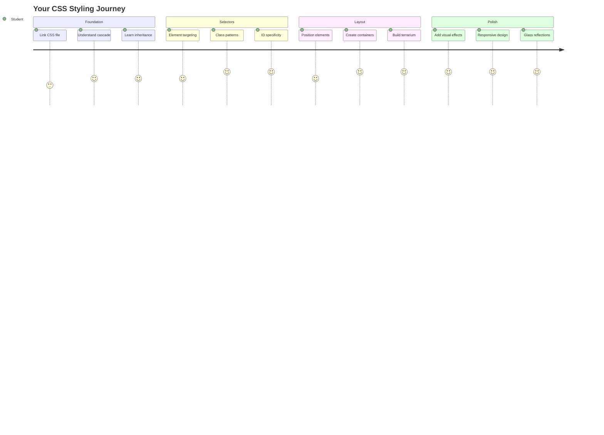
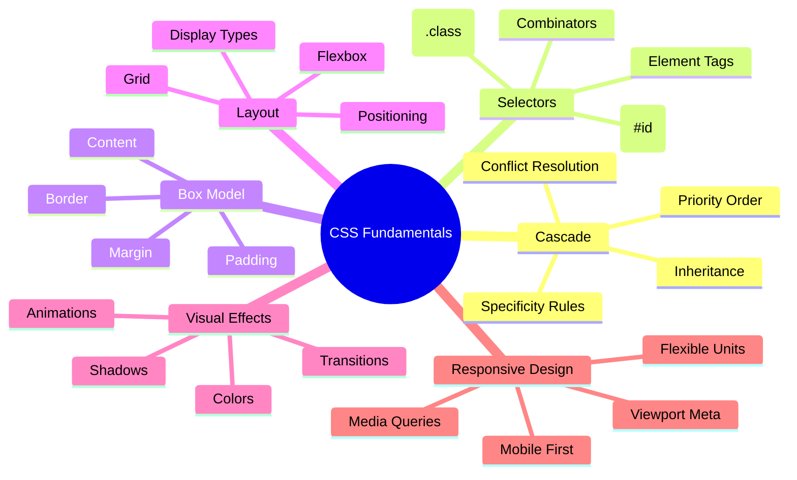
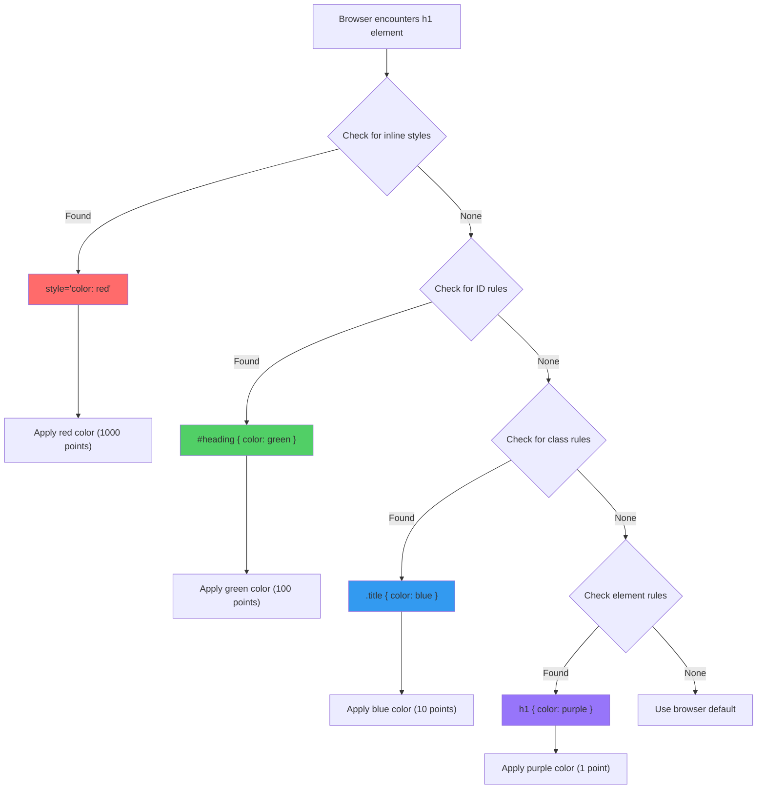
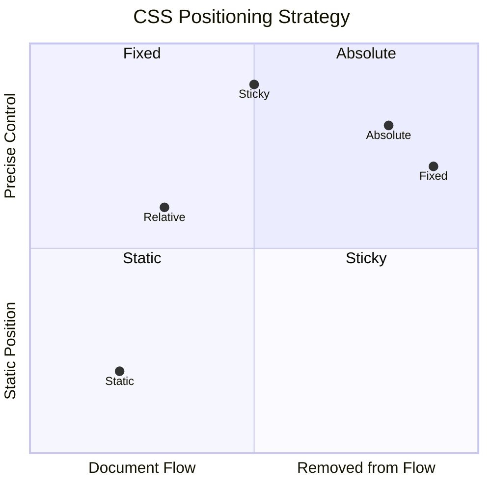
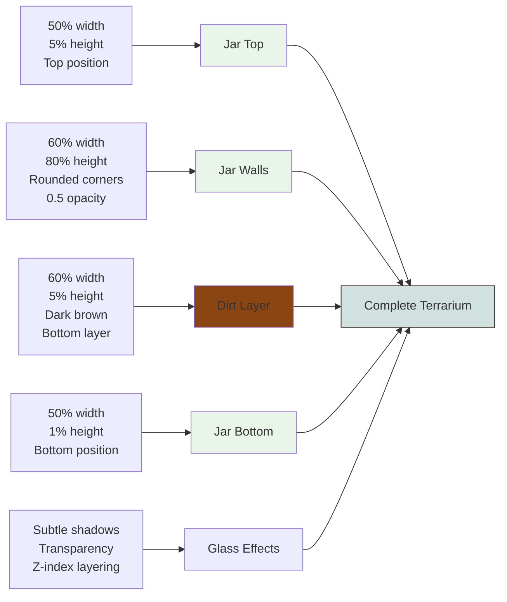
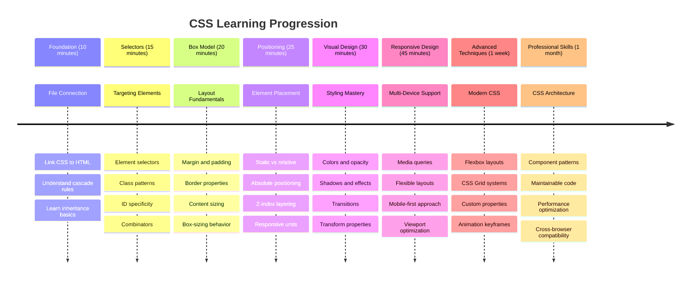

<!--
CO_OP_TRANSLATOR_METADATA:
{
  "original_hash": "e39f3a4e3bcccf94639e3af1248f8a4d",
  "translation_date": "2025-11-06T11:48:40+00:00",
  "source_file": "3-terrarium/2-intro-to-css/README.md",
  "language_code": "id"
}
-->
# Proyek Terrarium Bagian 2: Pengantar CSS




> Sketchnote oleh [Tomomi Imura](https://twitter.com/girlie_mac)

Ingat bagaimana terrarium HTML Anda terlihat cukup sederhana? CSS adalah tempat kita mengubah struktur polos itu menjadi sesuatu yang menarik secara visual.

Jika HTML seperti membangun kerangka rumah, maka CSS adalah segala sesuatu yang membuatnya terasa seperti rumah - warna cat, pengaturan furnitur, pencahayaan, dan bagaimana ruangan saling terhubung. Pikirkan bagaimana Istana Versailles awalnya hanya sebuah pondok berburu sederhana, tetapi perhatian yang cermat terhadap dekorasi dan tata letak mengubahnya menjadi salah satu bangunan paling megah di dunia.

Hari ini, kita akan mengubah terrarium Anda dari fungsional menjadi lebih rapi. Anda akan belajar bagaimana memposisikan elemen dengan tepat, membuat tata letak yang responsif terhadap berbagai ukuran layar, dan menciptakan daya tarik visual yang membuat situs web menarik.

Pada akhir pelajaran ini, Anda akan melihat bagaimana penataan CSS yang strategis dapat meningkatkan proyek Anda secara dramatis. Mari tambahkan gaya pada terrarium Anda.



## Kuis Pra-Pelajaran

[Kuis pra-pelajaran](https://ff-quizzes.netlify.app/web/quiz/17)

## Memulai dengan CSS

CSS sering dianggap hanya sebagai "membuat sesuatu terlihat cantik," tetapi sebenarnya memiliki tujuan yang jauh lebih luas. CSS seperti menjadi sutradara film - Anda mengontrol tidak hanya bagaimana semuanya terlihat, tetapi juga bagaimana semuanya bergerak, merespons interaksi, dan beradaptasi dengan berbagai situasi.

CSS modern sangatlah canggih. Anda dapat menulis kode yang secara otomatis menyesuaikan tata letak untuk ponsel, tablet, dan komputer desktop. Anda dapat membuat animasi halus yang mengarahkan perhatian pengguna ke tempat yang diperlukan. Hasilnya bisa sangat mengesankan ketika semuanya bekerja bersama-sama.

> 💡 **Tips Profesional**: CSS terus berkembang dengan fitur dan kemampuan baru. Selalu periksa [CanIUse.com](https://caniuse.com) untuk memverifikasi dukungan browser terhadap fitur CSS terbaru sebelum menggunakannya dalam proyek produksi.

**Inilah yang akan kita capai dalam pelajaran ini:**
- **Membuat** desain visual lengkap untuk terrarium Anda menggunakan teknik CSS modern
- **Mengeksplorasi** konsep dasar seperti cascade, inheritance, dan selektor CSS
- **Mengimplementasikan** strategi tata letak dan posisi yang responsif
- **Membangun** wadah terrarium menggunakan bentuk dan gaya CSS

### Prasyarat

Anda harus sudah menyelesaikan struktur HTML untuk terrarium Anda dari pelajaran sebelumnya dan siap untuk diberi gaya.

> 📺 **Sumber Video**: Lihat video panduan yang bermanfaat ini
>
> [](https://www.youtube.com/watch?v=6yIdOIV9p1I)

### Menyiapkan File CSS Anda

Sebelum kita mulai memberi gaya, kita perlu menghubungkan CSS ke HTML kita. Koneksi ini memberi tahu browser di mana menemukan instruksi gaya untuk terrarium kita.

Di folder terrarium Anda, buat file baru bernama `style.css`, lalu tautkan di bagian `<head>` dokumen HTML Anda:

```html
<link rel="stylesheet" href="./style.css" />
```

**Inilah yang dilakukan kode ini:**
- **Membuat** koneksi antara file HTML dan CSS Anda
- **Memberitahu** browser untuk memuat dan menerapkan gaya dari `style.css`
- **Menggunakan** atribut `rel="stylesheet"` untuk menentukan bahwa ini adalah file CSS
- **Merujuk** jalur file dengan `href="./style.css"`

## Memahami CSS Cascade

Pernah bertanya-tanya mengapa CSS disebut "Cascading" Style Sheets? Gaya mengalir turun seperti air terjun, dan terkadang mereka saling bertentangan.

Pertimbangkan bagaimana struktur perintah militer bekerja - perintah umum mungkin mengatakan "semua pasukan memakai hijau," tetapi perintah khusus untuk unit Anda mungkin mengatakan "pakai seragam biru untuk upacara." Instruksi yang lebih spesifik memiliki prioritas. CSS mengikuti logika serupa, dan memahami hierarki ini membuat debugging jauh lebih mudah.

### Bereksperimen dengan Prioritas Cascade

Mari kita lihat cascade dalam aksi dengan membuat konflik gaya. Pertama, tambahkan gaya inline ke tag `<h1>` Anda:

```html
<h1 style="color: red">My Terrarium</h1>
```

**Apa yang dilakukan kode ini:**
- **Menerapkan** warna merah langsung ke elemen `<h1>` menggunakan gaya inline
- **Menggunakan** atribut `style` untuk menyematkan CSS langsung di HTML
- **Membuat** aturan gaya prioritas tertinggi untuk elemen spesifik ini

Selanjutnya, tambahkan aturan ini ke file `style.css` Anda:

```css
h1 {
  color: blue;
}
```

**Dalam kode di atas, kita telah:**
- **Mendefinisikan** aturan CSS yang menargetkan semua elemen `<h1>`
- **Mengatur** warna teks menjadi biru menggunakan stylesheet eksternal
- **Membuat** aturan prioritas lebih rendah dibandingkan gaya inline

✅ **Cek Pengetahuan**: Warna apa yang ditampilkan di aplikasi web Anda? Mengapa warna itu menang? Bisakah Anda memikirkan skenario di mana Anda ingin mengganti gaya?



> 💡 **Urutan Prioritas CSS (tertinggi ke terendah):**
> 1. **Gaya inline** (atribut style)
> 2. **ID** (#myId)
> 3. **Kelas** (.myClass) dan atribut
> 4. **Selektor elemen** (h1, div, p)
> 5. **Default browser**

## CSS Inheritance dalam Praktik

Pewarisan CSS bekerja seperti genetika - elemen mewarisi properti tertentu dari elemen induknya. Jika Anda mengatur keluarga font pada elemen body, semua teks di dalamnya secara otomatis menggunakan font yang sama. Ini mirip dengan bagaimana ciri khas rahang keluarga Habsburg muncul di generasi berikutnya tanpa ditentukan untuk setiap individu.

Namun, tidak semuanya diwarisi. Gaya teks seperti font dan warna memang diwarisi, tetapi properti tata letak seperti margin dan border tidak. Sama seperti anak-anak mungkin mewarisi ciri fisik tetapi tidak pilihan mode orang tua mereka.

### Mengamati Pewarisan Font

Mari kita lihat pewarisan dalam aksi dengan mengatur keluarga font pada elemen `<body>`:

```css
body {
  font-family: 'Segoe UI', Tahoma, Geneva, Verdana, sans-serif;
}
```

**Memecah apa yang terjadi di sini:**
- **Mengatur** keluarga font untuk seluruh halaman dengan menargetkan elemen `<body>`
- **Menggunakan** tumpukan font dengan opsi cadangan untuk kompatibilitas browser yang lebih baik
- **Menerapkan** font sistem modern yang terlihat bagus di berbagai sistem operasi
- **Memastikan** semua elemen anak mewarisi font ini kecuali secara khusus diganti

Buka alat pengembang browser Anda (F12), navigasikan ke tab Elemen, dan inspeksi elemen `<h1>` Anda. Anda akan melihat bahwa elemen tersebut mewarisi keluarga font dari body:


✅ **Waktu Eksperimen**: Cobalah mengatur properti lain yang dapat diwarisi pada `<body>` seperti `color`, `line-height`, atau `text-align`. Apa yang terjadi pada heading dan elemen lainnya?

> 📝 **Properti yang Dapat Diwarisi Termasuk**: `color`, `font-family`, `font-size`, `line-height`, `text-align`, `visibility`
>
> **Properti yang Tidak Dapat Diwarisi Termasuk**: `margin`, `padding`, `border`, `width`, `height`, `position`

### 🔄 **Pengecekan Pedagogis**
**Pemahaman Dasar CSS**: Sebelum melanjutkan ke selektor, pastikan Anda dapat:
- ✅ Menjelaskan perbedaan antara cascade dan inheritance
- ✅ Memprediksi gaya mana yang akan menang dalam konflik spesifisitas
- ✅ Mengidentifikasi properti mana yang diwarisi dari elemen induk
- ✅ Menghubungkan file CSS ke HTML dengan benar

**Tes Cepat**: Jika Anda memiliki gaya ini, warna apa yang akan dimiliki `<h1>` di dalam `<div class="special">`?
```css
div { color: blue; }
.special { color: green; }
h1 { color: red; }
```
*Jawaban: Merah (selektor elemen langsung menargetkan h1)*

## Menguasai Selektor CSS

Selektor CSS adalah cara Anda menargetkan elemen tertentu untuk diberi gaya. Mereka bekerja seperti memberikan petunjuk yang tepat - alih-alih mengatakan "rumah," Anda mungkin mengatakan "rumah biru dengan pintu merah di Jalan Maple."

CSS menyediakan berbagai cara untuk menjadi spesifik, dan memilih selektor yang tepat seperti memilih alat yang sesuai untuk tugas. Kadang-kadang Anda perlu memberi gaya pada setiap pintu di lingkungan, dan kadang-kadang hanya satu pintu tertentu.

### Selektor Elemen (Tag)

Selektor elemen menargetkan elemen HTML berdasarkan nama tag mereka. Mereka sempurna untuk mengatur gaya dasar yang berlaku secara luas di seluruh halaman Anda:

```css
body {
  font-family: 'Segoe UI', Tahoma, Geneva, Verdana, sans-serif;
  margin: 0;
  padding: 0;
}

h1 {
  color: #3a241d;
  text-align: center;
  font-size: 2.5rem;
  margin-bottom: 1rem;
}
```

**Memahami gaya ini:**
- **Mengatur** tipografi konsisten di seluruh halaman dengan selektor `body`
- **Menghapus** margin dan padding default browser untuk kontrol yang lebih baik
- **Memberi gaya** semua elemen heading dengan warna, perataan, dan spasi
- **Menggunakan** unit `rem` untuk ukuran font yang dapat diskalakan dan aksesibel

Meskipun selektor elemen bekerja dengan baik untuk gaya umum, Anda akan membutuhkan selektor yang lebih spesifik untuk memberi gaya pada komponen individual seperti tanaman di terrarium Anda.

### Selektor ID untuk Elemen Unik

Selektor ID menggunakan simbol `#` dan menargetkan elemen dengan atribut `id` tertentu. Karena ID harus unik di halaman, mereka sempurna untuk memberi gaya pada elemen individual yang spesial seperti wadah tanaman kiri dan kanan kita.

Mari kita buat gaya untuk wadah sisi terrarium kita tempat tanaman akan ditempatkan:

```css
#left-container {
  background-color: #f5f5f5;
  width: 15%;
  left: 0;
  top: 0;
  position: absolute;
  height: 100vh;
  padding: 1rem;
  box-sizing: border-box;
}

#right-container {
  background-color: #f5f5f5;
  width: 15%;
  right: 0;
  top: 0;
  position: absolute;
  height: 100vh;
  padding: 1rem;
  box-sizing: border-box;
}
```

**Inilah yang dicapai kode ini:**
- **Memposisikan** wadah di tepi kiri dan kanan menggunakan posisi `absolute`
- **Menggunakan** unit `vh` (viewport height) untuk tinggi responsif yang beradaptasi dengan ukuran layar
- **Menerapkan** `box-sizing: border-box` sehingga padding termasuk dalam total lebar
- **Menghapus** unit `px` yang tidak perlu dari nilai nol untuk kode yang lebih bersih
- **Mengatur** warna latar belakang yang lembut yang lebih nyaman di mata daripada abu-abu mencolok

✅ **Tantangan Kualitas Kode**: Perhatikan bagaimana CSS ini melanggar prinsip DRY (Don't Repeat Yourself). Bisakah Anda merombaknya menggunakan ID dan kelas?

**Pendekatan yang Ditingkatkan:**
```html
<div id="left-container" class="container"></div>
<div id="right-container" class="container"></div>
```

```css
.container {
  background-color: #f5f5f5;
  width: 15%;
  top: 0;
  position: absolute;
  height: 100vh;
  padding: 1rem;
  box-sizing: border-box;
}

#left-container {
  left: 0;
}

#right-container {
  right: 0;
}
```

### Selektor Kelas untuk Gaya yang Dapat Digunakan Kembali

Selektor kelas menggunakan simbol `.` dan sangat cocok ketika Anda ingin menerapkan gaya yang sama ke beberapa elemen. Tidak seperti ID, kelas dapat digunakan kembali di seluruh HTML Anda, menjadikannya ideal untuk pola gaya yang konsisten.

Di terrarium kita, setiap tanaman membutuhkan gaya yang serupa tetapi juga membutuhkan posisi individual. Kita akan menggunakan kombinasi kelas untuk gaya bersama dan ID untuk posisi unik.

**Inilah struktur HTML untuk setiap tanaman:**
```html
<div class="plant-holder">
  
</div>
```

**Elemen kunci dijelaskan:**
- **Menggunakan** `class="plant-holder"` untuk gaya wadah yang konsisten di semua tanaman
- **Menerapkan** `class="plant"` untuk gaya dan perilaku gambar bersama
- **Menyertakan** `id="plant1"` yang unik untuk posisi individual dan interaksi JavaScript
- **Memberikan** teks alt deskriptif untuk aksesibilitas pembaca layar

Sekarang tambahkan gaya ini ke file `style.css` Anda:

```css
.plant-holder {
  position: relative;
  height: 13%;
  left: -0.6rem;
}

.plant {
  position: absolute;
  max-width: 150%;
  max-height: 150%;
  z-index: 2;
  transition: transform 0.3s ease;
}

.plant:hover {
  transform: scale(1.05);
}
```

**Memecah gaya ini:**
- **Membuat** posisi relatif untuk wadah tanaman untuk membangun konteks posisi
- **Mengatur** setiap wadah tanaman ke tinggi 13%, memastikan semua tanaman pas secara vertikal tanpa menggulir
- **Menggeser** wadah sedikit ke kiri untuk lebih memusatkan tanaman di dalam wadah mereka
- **Memungkinkan** tanaman untuk berskala responsif dengan properti `max-width` dan `max-height`
- **Menggunakan** `z-index` untuk melapisi tanaman di atas elemen lain di terrarium
- **Menambahkan** efek hover halus dengan transisi CSS untuk interaksi pengguna yang lebih baik

✅ **Berpikir Kritis**: Mengapa kita membutuhkan selektor `.plant-holder` dan `.plant`? Apa yang akan terjadi jika kita mencoba menggunakan hanya satu?

> 💡 **Pola Desain**: Wadah (`.plant-holder`) mengontrol tata letak dan posisi, sementara konten (`.plant`) mengontrol tampilan dan penskalaan. Pemisahan ini membuat kode lebih mudah dikelola dan fleksibel.

## Memahami Posisi CSS

Posisi CSS seperti menjadi sutradara panggung untuk sebuah pertunjukan - Anda mengarahkan di mana setiap aktor berdiri dan bagaimana mereka bergerak di sekitar panggung. Beberapa aktor mengikuti formasi standar, sementara yang lain membutuhkan posisi spesifik untuk efek dramatis.

Setelah Anda memahami posisi, banyak tantangan tata letak menjadi dapat dikelola. Membutuhkan bilah navigasi yang tetap di atas saat pengguna menggulir? Posisi menangani itu. Ingin tooltip yang muncul di lokasi tertentu? Itu juga posisi.

### Lima Nilai Posisi



| Nilai Posisi | Perilaku | Kasus Penggunaan |
|--------------|----------|------------------|
| `static` | Aliran default, mengabaikan top/left/right/bottom | Tata letak dokumen normal |
| `relative` | Diposisikan relatif terhadap posisinya yang normal | Penyesuaian kecil, membuat konteks posisi |
| `absolute` | Diposisikan relatif terhadap leluhur yang diposisikan | Penempatan presisi, overlay |
| `fixed` | Diposisikan relatif terhadap viewport | Bilah navigasi, elemen mengambang |
| `sticky` | Beralih antara relatif dan tetap berdasarkan gulir | Header yang tetap saat menggulir |

### Posisi di Terrarium Kita

Terrarium kita menggunakan kombinasi strategi posisi yang strategis untuk menciptakan tata letak yang diinginkan:

```css
/* Container positioning */
.container {
  position: absolute; /* Removes from normal flow */
  /* ... other styles ... */
}

/* Plant holder positioning */
.plant-holder {
  position: relative; /* Creates positioning context */
  /* ... other styles ... */
}

/* Plant positioning */
.plant {
  position: absolute; /* Allows precise placement within holder */
  /* ... other styles ... */
}
```

**Memahami strategi posisi:**
- **Wadah absolut** dihapus dari aliran dokumen normal dan dipasang di tepi layar
- **Wadah tanaman relatif** menciptakan konteks posisi sambil tetap dalam aliran dokumen
- **Tanaman absolut** dapat diposisikan dengan presisi di dalam wadah relatif mereka
- **Kombinasi ini** memungkinkan tanaman untuk ditumpuk secara vertikal sambil dapat diposisikan secara individual

> 🎯 **Mengapa Ini Penting**: Elemen `plant` membutuhkan posisi absolut agar dapat digerakkan di pelajaran berikutnya. Posisi absolut menghapus mereka dari aliran tata letak normal, membuat interaksi drag-and-drop menjadi mungkin.

✅ **Waktu Eksperimen**: Cobalah mengubah nilai posisi dan amati hasilnya:
- Apa yang terjadi jika Anda mengubah `.container` dari `absolute` menjadi `relative`?
- Bagaimana tata letak berubah jika `.plant-holder` menggunakan `absolute` daripada `relative`?
- Apa yang terjadi ketika Anda mengubah `.plant` ke posisi `relative`?

### 🔄 **Pengecekan Pedagogis**
**Penguasaan Posisi CSS**: Berhenti sejenak untuk memverifikasi pemahaman Anda:
- ✅ Bisakah Anda menjelaskan mengapa tanaman membutuhkan posisi absolut untuk drag-and-drop?
- ✅ Apakah Anda memahami bagaimana kontainer relatif menciptakan konteks posisi?
- ✅ Mengapa kontainer samping menggunakan posisi absolut?
- ✅ Apa yang akan terjadi jika Anda menghapus deklarasi posisi sepenuhnya?

**Koneksi Dunia Nyata**: Pikirkan bagaimana posisi CSS mencerminkan tata letak dunia nyata:
- **Static**: Buku di rak (urutan alami)
- **Relative**: Memindahkan buku sedikit tetapi tetap di tempatnya
- **Absolute**: Meletakkan penanda di halaman tertentu
- **Fixed**: Catatan tempel yang tetap terlihat saat Anda membalik halaman

## Membangun Terrarium dengan CSS

Sekarang kita akan membuat toples kaca hanya menggunakan CSS - tanpa gambar atau perangkat lunak grafis.

Menciptakan efek kaca, bayangan, dan kedalaman yang realistis menggunakan posisi dan transparansi menunjukkan kemampuan visual CSS. Teknik ini mencerminkan bagaimana arsitek dalam gerakan Bauhaus menggunakan bentuk geometris sederhana untuk menciptakan struktur yang kompleks dan indah. Setelah Anda memahami prinsip-prinsip ini, Anda akan mengenali teknik CSS di balik banyak desain web.



### Membuat Komponen Toples Kaca

Mari kita bangun toples terrarium bagian demi bagian. Setiap bagian menggunakan posisi absolut dan ukuran berbasis persentase untuk desain responsif:

```css
.jar-walls {
  height: 80%;
  width: 60%;
  background: #d1e1df;
  border-radius: 1rem;
  position: absolute;
  bottom: 0.5%;
  left: 20%;
  opacity: 0.5;
  z-index: 1;
  box-shadow: inset 0 0 2rem rgba(0, 0, 0, 0.1);
}

.jar-top {
  width: 50%;
  height: 5%;
  background: #d1e1df;
  position: absolute;
  bottom: 80.5%;
  left: 25%;
  opacity: 0.7;
  z-index: 1;
  border-radius: 0.5rem 0.5rem 0 0;
}

.jar-bottom {
  width: 50%;
  height: 1%;
  background: #d1e1df;
  position: absolute;
  bottom: 0;
  left: 25%;
  opacity: 0.7;
  border-radius: 0 0 0.5rem 0.5rem;
}

.dirt {
  width: 60%;
  height: 5%;
  background: #3a241d;
  position: absolute;
  border-radius: 0 0 1rem 1rem;
  bottom: 1%;
  left: 20%;
  opacity: 0.7;
  z-index: -1;
}
```

**Memahami konstruksi terrarium:**
- **Menggunakan** dimensi berbasis persentase untuk penskalaan responsif di semua ukuran layar
- **Memposisikan** elemen secara absolut untuk menumpuk dan menyelaraskan dengan tepat
- **Menerapkan** nilai opasitas yang berbeda untuk menciptakan efek transparansi kaca
- **Menggunakan** `z-index` untuk lapisan sehingga tanaman muncul di dalam toples
- **Menambahkan** bayangan kotak halus dan border-radius yang disempurnakan untuk tampilan yang lebih realistis

### Desain Responsif dengan Persentase

Perhatikan bagaimana semua dimensi menggunakan persentase daripada nilai piksel tetap:

**Mengapa ini penting:**
- **Memastikan** terrarium dapat menyesuaikan secara proporsional pada ukuran layar apa pun
- **Mempertahankan** hubungan visual antara komponen toples
- **Memberikan** pengalaman yang konsisten dari ponsel hingga monitor desktop besar
- **Memungkinkan** desain beradaptasi tanpa merusak tata letak visual

### Unit CSS dalam Aksi

Kami menggunakan unit `rem` untuk border-radius, yang skalanya relatif terhadap ukuran font root. Ini menciptakan desain yang lebih mudah diakses yang menghormati preferensi font pengguna. Pelajari lebih lanjut tentang [unit relatif CSS](https://www.w3.org/TR/css-values-3/#font-relative-lengths) dalam spesifikasi resmi.

✅ **Eksperimen Visual**: Coba modifikasi nilai-nilai ini dan amati efeknya:
- Ubah opasitas toples dari 0.5 menjadi 0.8 – bagaimana ini memengaruhi tampilan kaca?
- Sesuaikan warna tanah dari `#3a241d` menjadi `#8B4513` – apa dampak visualnya?
- Modifikasi `z-index` tanah menjadi 2 – apa yang terjadi pada lapisan?

### 🔄 **Pengecekan Pedagogis**
**Pemahaman Desain Visual CSS**: Konfirmasi pemahaman Anda tentang visual CSS:
- ✅ Bagaimana dimensi berbasis persentase menciptakan desain responsif?
- ✅ Mengapa opasitas menciptakan efek transparansi kaca?
- ✅ Apa peran z-index dalam melapisi elemen?
- ✅ Bagaimana nilai border-radius menciptakan bentuk toples?

**Prinsip Desain**: Perhatikan bagaimana kita membangun visual yang kompleks dari bentuk sederhana:
1. **Persegi panjang** → **Persegi panjang melengkung** → **Komponen toples**
2. **Warna datar** → **Opasitas** → **Efek kaca**
3. **Elemen individu** → **Komposisi berlapis** → **Tampilan 3D**

---

## Tantangan Agen GitHub Copilot 🚀

Gunakan mode Agen untuk menyelesaikan tantangan berikut:

**Deskripsi:** Buat animasi CSS yang membuat tanaman terrarium bergoyang perlahan, mensimulasikan efek angin alami. Ini akan membantu Anda berlatih animasi CSS, transformasi, dan keyframes sambil meningkatkan daya tarik visual terrarium Anda.

**Prompt:** Tambahkan animasi keyframe CSS untuk membuat tanaman di terrarium bergoyang perlahan dari sisi ke sisi. Buat animasi bergoyang yang memutar setiap tanaman sedikit (2-3 derajat) ke kiri dan kanan dengan durasi 3-4 detik, dan terapkan pada kelas `.plant`. Pastikan animasi berulang tanpa henti dan memiliki fungsi easing untuk gerakan alami.

Pelajari lebih lanjut tentang [mode agen](https://code.visualstudio.com/blogs/2025/02/24/introducing-copilot-agent-mode) di sini.

## 🚀 Tantangan: Menambahkan Refleksi Kaca

Siap meningkatkan terrarium Anda dengan refleksi kaca yang realistis? Teknik ini akan menambahkan kedalaman dan realisme pada desain.

Anda akan membuat sorotan halus yang mensimulasikan bagaimana cahaya memantul dari permukaan kaca. Pendekatan ini mirip dengan bagaimana pelukis Renaisans seperti Jan van Eyck menggunakan cahaya dan refleksi untuk membuat kaca yang dilukis tampak tiga dimensi. Berikut adalah tujuan Anda:


**Tantangan Anda:**
- **Buat** bentuk oval putih atau berwarna terang untuk refleksi kaca
- **Posisikan** mereka secara strategis di sisi kiri toples
- **Terapkan** efek opasitas dan blur yang sesuai untuk refleksi cahaya yang realistis
- **Gunakan** `border-radius` untuk menciptakan bentuk organik seperti gelembung
- **Eksperimen** dengan gradien atau bayangan kotak untuk realisme yang lebih baik

## Kuis Pasca-Pelajaran

[Kuis pasca-pelajaran](https://ff-quizzes.netlify.app/web/quiz/18)

## Perluas Pengetahuan CSS Anda

CSS mungkin terasa rumit pada awalnya, tetapi memahami konsep inti ini memberikan dasar yang kuat untuk teknik yang lebih maju.

**Area pembelajaran CSS Anda berikutnya:**
- **Flexbox** - menyederhanakan penyelarasan dan distribusi elemen
- **CSS Grid** - menyediakan alat yang kuat untuk membuat tata letak yang kompleks
- **CSS Variables** - mengurangi pengulangan dan meningkatkan pemeliharaan
- **Desain responsif** - memastikan situs bekerja dengan baik di berbagai ukuran layar

### Sumber Belajar Interaktif

Latih konsep-konsep ini dengan permainan interaktif yang menarik:
- 🐸 [Flexbox Froggy](https://flexboxfroggy.com/) - Kuasai Flexbox melalui tantangan yang menyenangkan
- 🌱 [Grid Garden](https://codepip.com/games/grid-garden/) - Pelajari CSS Grid dengan menanam wortel virtual
- 🎯 [CSS Battle](https://cssbattle.dev/) - Uji keterampilan CSS Anda dengan tantangan coding

### Pembelajaran Tambahan

Untuk dasar-dasar CSS yang komprehensif, selesaikan modul Microsoft Learn ini: [Style your HTML app with CSS](https://docs.microsoft.com/learn/modules/build-simple-website/4-css-basics/?WT.mc_id=academic-77807-sagibbon)

### ⚡ **Apa yang Bisa Anda Lakukan dalam 5 Menit Berikutnya**
- [ ] Buka DevTools dan inspeksi gaya CSS di situs web mana pun menggunakan panel Elemen
- [ ] Buat file CSS sederhana dan tautkan ke halaman HTML
- [ ] Coba ubah warna menggunakan metode yang berbeda: hex, RGB, dan nama warna
- [ ] Latih model kotak dengan menambahkan padding dan margin ke div

### 🎯 **Apa yang Bisa Anda Capai dalam Satu Jam**
- [ ] Selesaikan kuis pasca-pelajaran dan tinjau dasar-dasar CSS
- [ ] Gaya halaman HTML Anda dengan font, warna, dan spasi
- [ ] Buat tata letak sederhana menggunakan flexbox atau grid
- [ ] Eksperimen dengan transisi CSS untuk efek yang halus
- [ ] Latih desain responsif dengan media queries

### 📅 **Petualangan CSS Anda Selama Seminggu**
- [ ] Selesaikan tugas styling terrarium dengan kreativitas
- [ ] Kuasai CSS Grid dengan membuat tata letak galeri foto
- [ ] Pelajari animasi CSS untuk menghidupkan desain Anda
- [ ] Jelajahi preprocessor CSS seperti Sass atau Less
- [ ] Pelajari prinsip desain dan terapkan pada CSS Anda
- [ ] Analisis dan buat ulang desain menarik yang Anda temukan online

### 🌟 **Penguasaan Desain Anda Selama Sebulan**
- [ ] Bangun sistem desain situs web responsif yang lengkap
- [ ] Pelajari CSS-in-JS atau framework berbasis utilitas seperti Tailwind
- [ ] Berkontribusi pada proyek open source dengan perbaikan CSS
- [ ] Kuasai konsep CSS tingkat lanjut seperti properti kustom CSS dan containment
- [ ] Buat pustaka komponen yang dapat digunakan kembali dengan CSS modular
- [ ] Mentor orang lain yang belajar CSS dan bagikan pengetahuan desain

## 🎯 Garis Waktu Penguasaan CSS Anda



### 🛠️ Ringkasan Toolkit CSS Anda

Setelah menyelesaikan pelajaran ini, Anda sekarang memiliki:
- **Pemahaman Cascade**: Bagaimana gaya mewarisi dan menimpa satu sama lain
- **Penguasaan Selector**: Penargetan presisi dengan elemen, kelas, dan ID
- **Keterampilan Posisi**: Penempatan dan pelapisan elemen yang strategis
- **Desain Visual**: Menciptakan efek kaca, bayangan, dan transparansi
- **Teknik Responsif**: Tata letak berbasis persentase yang beradaptasi dengan layar apa pun
- **Organisasi Kode**: Struktur CSS yang bersih dan mudah dipelihara
- **Praktik Modern**: Menggunakan unit relatif dan pola desain yang dapat diakses

**Langkah Berikutnya**: Terrarium Anda sekarang memiliki struktur (HTML) dan gaya (CSS). Pelajaran terakhir akan menambahkan interaktivitas dengan JavaScript!

## Tugas

[Refactoring CSS](assignment.md)

---

**Penafian**:  
Dokumen ini telah diterjemahkan menggunakan layanan penerjemahan AI [Co-op Translator](https://github.com/Azure/co-op-translator). Meskipun kami berusaha untuk memberikan hasil yang akurat, harap diketahui bahwa terjemahan otomatis mungkin mengandung kesalahan atau ketidakakuratan. Dokumen asli dalam bahasa aslinya harus dianggap sebagai sumber yang otoritatif. Untuk informasi yang penting, disarankan menggunakan jasa penerjemahan manusia profesional. Kami tidak bertanggung jawab atas kesalahpahaman atau interpretasi yang keliru yang timbul dari penggunaan terjemahan ini.