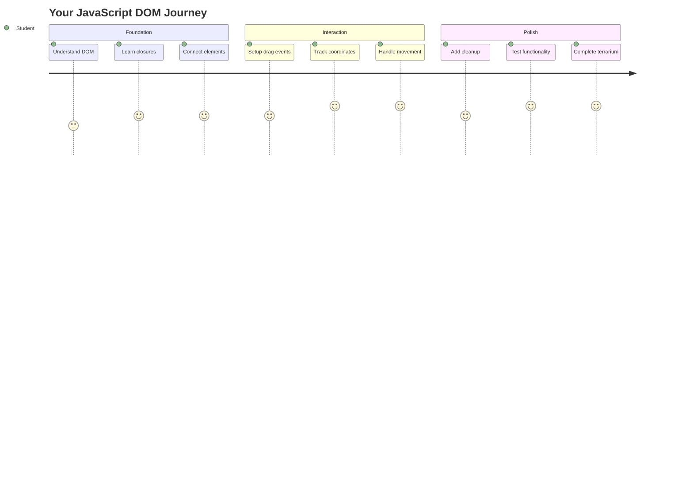
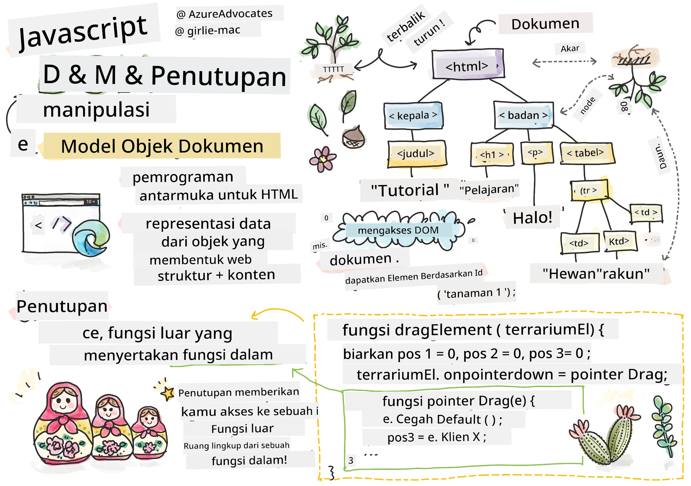
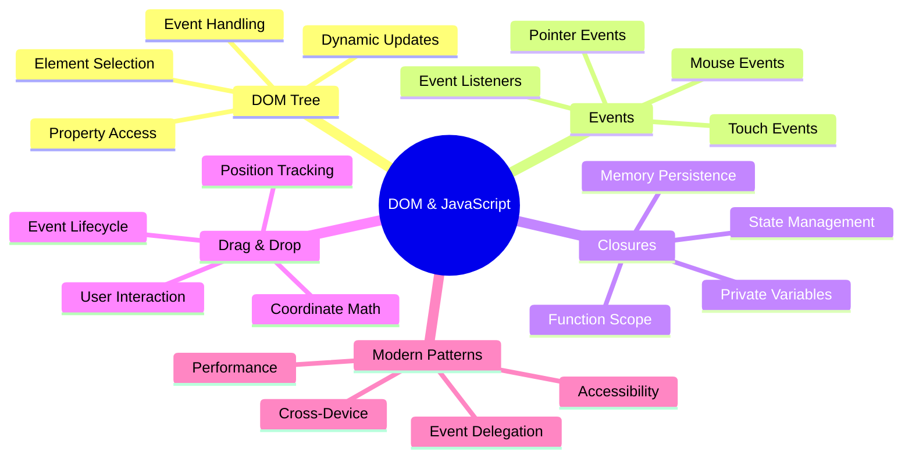
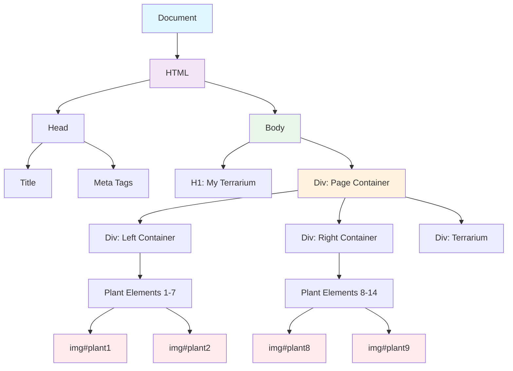
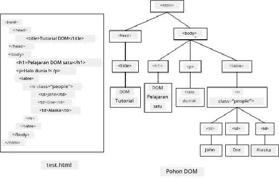
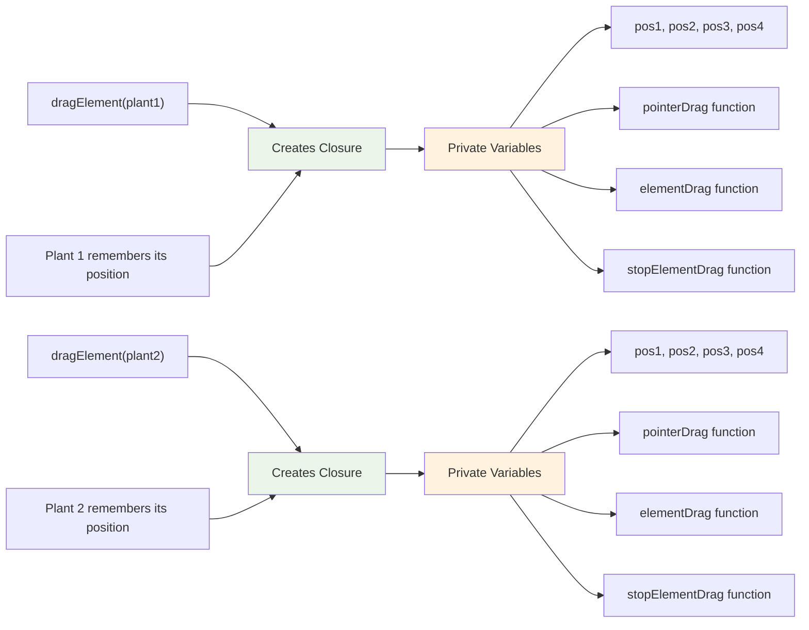
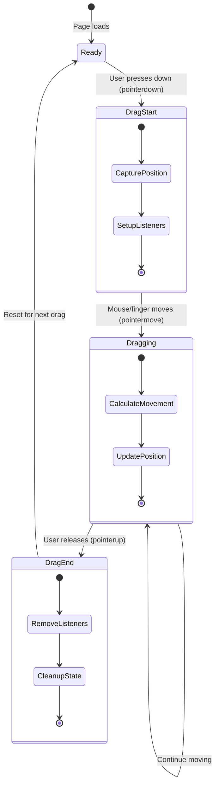
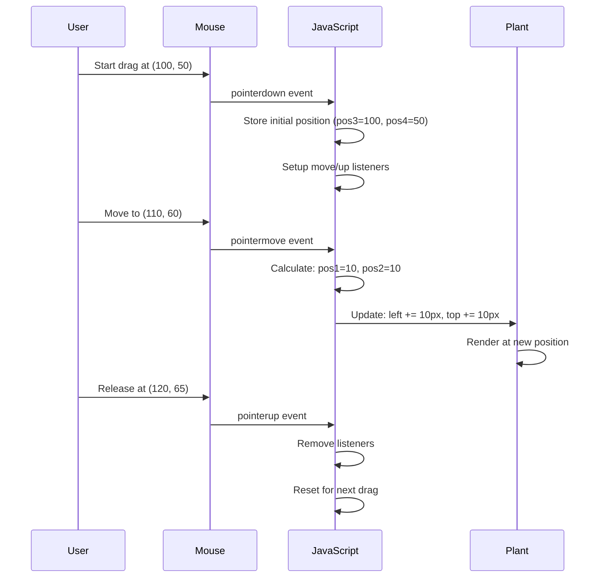
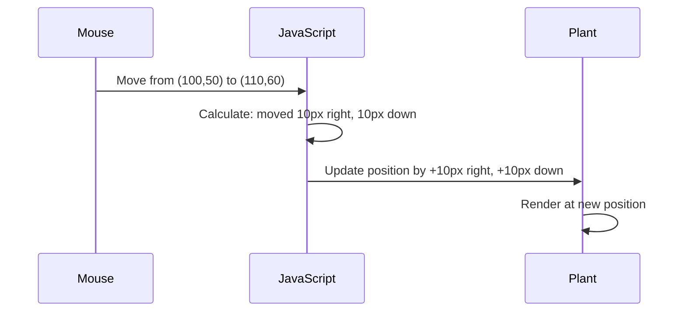
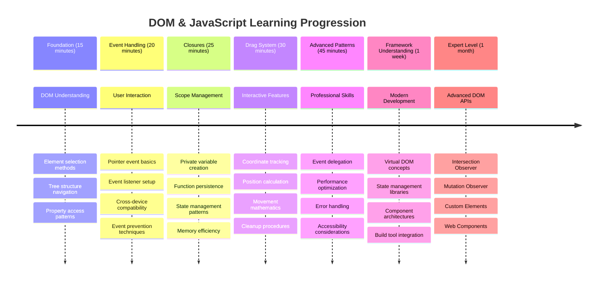

<!--
CO_OP_TRANSLATOR_METADATA:
{
  "original_hash": "973e48ad87d67bf5bb819746c9f8e302",
  "translation_date": "2025-11-06T11:47:51+00:00",
  "source_file": "3-terrarium/3-intro-to-DOM-and-closures/README.md",
  "language_code": "id"
}
-->
# Proyek Terrarium Bagian 3: Manipulasi DOM dan Penutupan JavaScript




> Sketchnote oleh [Tomomi Imura](https://twitter.com/girlie_mac)

Selamat datang di salah satu aspek paling menarik dari pengembangan web - membuat sesuatu menjadi interaktif! Document Object Model (DOM) adalah seperti jembatan antara HTML dan JavaScript Anda, dan hari ini kita akan menggunakannya untuk menghidupkan terrarium Anda. Ketika Tim Berners-Lee menciptakan browser web pertama, dia membayangkan web di mana dokumen bisa menjadi dinamis dan interaktif - DOM membuat visi itu menjadi mungkin.

Kita juga akan menjelajahi penutupan (closures) JavaScript, yang mungkin terdengar menakutkan pada awalnya. Anggaplah closures sebagai "kantong memori" di mana fungsi Anda dapat mengingat informasi penting. Ini seperti setiap tanaman di terrarium Anda memiliki catatan data sendiri untuk melacak posisinya. Pada akhir pelajaran ini, Anda akan memahami betapa alami dan bergunanya mereka.

Inilah yang akan kita bangun: sebuah terrarium di mana pengguna dapat menyeret dan meletakkan tanaman di mana saja yang mereka inginkan. Anda akan mempelajari teknik manipulasi DOM yang mendukung segalanya mulai dari unggahan file drag-and-drop hingga permainan interaktif. Mari kita hidupkan terrarium Anda.



## Kuis Pra-Pelajaran

[Kuis pra-pelajaran](https://ff-quizzes.netlify.app/web/quiz/19)

## Memahami DOM: Gerbang Anda Menuju Halaman Web Interaktif

Document Object Model (DOM) adalah cara JavaScript berkomunikasi dengan elemen-elemen HTML Anda. Ketika browser Anda memuat halaman HTML, ia menciptakan representasi terstruktur dari halaman tersebut dalam memori - itulah DOM. Anggaplah ini sebagai pohon keluarga di mana setiap elemen HTML adalah anggota keluarga yang dapat diakses, dimodifikasi, atau diatur ulang oleh JavaScript.

Manipulasi DOM mengubah halaman statis menjadi situs web interaktif. Setiap kali Anda melihat tombol berubah warna saat di-hover, konten diperbarui tanpa penyegaran halaman, atau elemen yang dapat Anda seret, itu adalah manipulasi DOM yang bekerja.





> Representasi DOM dan markup HTML yang merujuk padanya. Dari [Olfa Nasraoui](https://www.researchgate.net/publication/221417012_Profile-Based_Focused_Crawler_for_Social_Media-Sharing_Websites)

**Inilah yang membuat DOM begitu kuat:**
- **Memberikan** cara terstruktur untuk mengakses elemen apa pun di halaman Anda
- **Memungkinkan** pembaruan konten dinamis tanpa penyegaran halaman
- **Merespons** interaksi pengguna secara real-time seperti klik dan seret
- **Menciptakan** dasar untuk aplikasi web interaktif modern

## Penutupan JavaScript: Membuat Kode yang Terorganisir dan Kuat

[Penutupan JavaScript](https://developer.mozilla.org/docs/Web/JavaScript/Closures) adalah seperti memberikan fungsi ruang kerja pribadinya sendiri dengan memori yang persisten. Pertimbangkan bagaimana burung finch Darwin di Kepulauan Galápagos masing-masing mengembangkan paruh khusus berdasarkan lingkungan mereka - closures bekerja dengan cara yang sama, menciptakan fungsi khusus yang "mengingat" konteks spesifik mereka bahkan setelah fungsi induknya selesai.

Dalam terrarium kita, closures membantu setiap tanaman mengingat posisinya sendiri secara independen. Pola ini muncul di seluruh pengembangan JavaScript profesional, menjadikannya konsep yang berharga untuk dipahami.



> 💡 **Memahami Penutupan**: Penutupan adalah topik penting dalam JavaScript, dan banyak pengembang menggunakannya selama bertahun-tahun sebelum sepenuhnya memahami semua aspek teoritisnya. Hari ini, kita fokus pada aplikasi praktis - Anda akan melihat penutupan muncul secara alami saat kita membangun fitur interaktif kita. Pemahaman akan berkembang saat Anda melihat bagaimana mereka menyelesaikan masalah nyata.


> Representasi DOM dan markup HTML yang merujuk padanya. Dari [Olfa Nasraoui](https://www.researchgate.net/publication/221417012_Profile-Based_Focused_Crawler_for_Social_Media-Sharing_Websites)

Dalam pelajaran ini, kita akan menyelesaikan proyek terrarium interaktif kita dengan membuat JavaScript yang memungkinkan pengguna memanipulasi tanaman di halaman.

## Sebelum Kita Mulai: Persiapan untuk Sukses

Anda akan membutuhkan file HTML dan CSS dari pelajaran terrarium sebelumnya - kita akan membuat desain statis itu menjadi interaktif. Jika Anda baru bergabung, menyelesaikan pelajaran tersebut terlebih dahulu akan memberikan konteks penting.

Inilah yang akan kita bangun:
- **Drag-and-drop yang mulus** untuk semua tanaman terrarium
- **Pelacakan koordinat** sehingga tanaman mengingat posisinya
- **Antarmuka interaktif lengkap** menggunakan JavaScript murni
- **Kode yang bersih dan terorganisir** menggunakan pola penutupan

## Menyiapkan File JavaScript Anda

Mari kita buat file JavaScript yang akan membuat terrarium Anda interaktif.

**Langkah 1: Buat file skrip Anda**

Di folder terrarium Anda, buat file baru bernama `script.js`.

**Langkah 2: Hubungkan JavaScript ke HTML Anda**

Tambahkan tag skrip ini ke bagian `<head>` dari file `index.html` Anda:

```html
<script src="./script.js" defer></script>
```

**Mengapa atribut `defer` itu penting:**
- **Memastikan** JavaScript Anda menunggu hingga semua HTML dimuat
- **Mencegah** kesalahan di mana JavaScript mencari elemen yang belum siap
- **Menjamin** semua elemen tanaman Anda tersedia untuk interaksi
- **Memberikan** kinerja yang lebih baik daripada meletakkan skrip di bagian bawah halaman

> ⚠️ **Catatan Penting**: Atribut `defer` mencegah masalah waktu yang umum. Tanpa itu, JavaScript mungkin mencoba mengakses elemen HTML sebelum mereka dimuat, menyebabkan kesalahan.

---

## Menghubungkan JavaScript ke Elemen HTML Anda

Sebelum kita dapat membuat elemen dapat diseret, JavaScript perlu menemukan mereka di DOM. Anggaplah ini seperti sistem katalog perpustakaan - setelah Anda memiliki nomor katalog, Anda dapat menemukan buku yang Anda butuhkan dan mengakses semua isinya.

Kita akan menggunakan metode `document.getElementById()` untuk membuat koneksi ini. Ini seperti memiliki sistem pengarsipan yang tepat - Anda memberikan ID, dan itu menemukan elemen yang Anda butuhkan di HTML Anda.

### Mengaktifkan Fungsi Seret untuk Semua Tanaman

Tambahkan kode ini ke file `script.js` Anda:

```javascript
// Enable drag functionality for all 14 plants
dragElement(document.getElementById('plant1'));
dragElement(document.getElementById('plant2'));
dragElement(document.getElementById('plant3'));
dragElement(document.getElementById('plant4'));
dragElement(document.getElementById('plant5'));
dragElement(document.getElementById('plant6'));
dragElement(document.getElementById('plant7'));
dragElement(document.getElementById('plant8'));
dragElement(document.getElementById('plant9'));
dragElement(document.getElementById('plant10'));
dragElement(document.getElementById('plant11'));
dragElement(document.getElementById('plant12'));
dragElement(document.getElementById('plant13'));
dragElement(document.getElementById('plant14'));
```

**Inilah yang dicapai oleh kode ini:**
- **Menemukan** setiap elemen tanaman di DOM menggunakan ID uniknya
- **Mengambil** referensi JavaScript ke setiap elemen HTML
- **Meneruskan** setiap elemen ke fungsi `dragElement` (yang akan kita buat berikutnya)
- **Mempersiapkan** setiap tanaman untuk interaksi drag-and-drop
- **Menghubungkan** struktur HTML Anda ke fungsionalitas JavaScript

> 🎯 **Mengapa Menggunakan ID Daripada Kelas?** ID memberikan pengidentifikasi unik untuk elemen tertentu, sementara kelas CSS dirancang untuk menata kelompok elemen. Ketika JavaScript perlu memanipulasi elemen individu, ID menawarkan presisi dan kinerja yang kita butuhkan.

> 💡 **Tip Profesional**: Perhatikan bagaimana kita memanggil `dragElement()` untuk setiap tanaman secara individual. Pendekatan ini memastikan bahwa setiap tanaman mendapatkan perilaku seret independen, yang penting untuk interaksi pengguna yang mulus.

### 🔄 **Pemeriksaan Pedagogis**
**Pemahaman Koneksi DOM**: Sebelum melanjutkan ke fungsi seret, pastikan Anda dapat:
- ✅ Menjelaskan bagaimana `document.getElementById()` menemukan elemen HTML
- ✅ Memahami mengapa kita menggunakan ID unik untuk setiap tanaman
- ✅ Menggambarkan tujuan atribut `defer` dalam tag skrip
- ✅ Mengenali bagaimana JavaScript dan HTML terhubung melalui DOM

**Tes Diri Cepat**: Apa yang akan terjadi jika dua elemen memiliki ID yang sama? Mengapa `getElementById()` hanya mengembalikan satu elemen?
*Jawaban: ID harus unik; jika duplikat, hanya elemen pertama yang dikembalikan*

---

## Membangun Penutupan Fungsi Drag Element

Sekarang kita akan membuat inti dari fungsionalitas seret kita: sebuah penutupan yang mengelola perilaku seret untuk setiap tanaman. Penutupan ini akan berisi beberapa fungsi dalam yang bekerja bersama untuk melacak gerakan mouse dan memperbarui posisi elemen.

Penutupan sangat cocok untuk tugas ini karena memungkinkan kita membuat variabel "pribadi" yang bertahan antara panggilan fungsi, memberikan setiap tanaman sistem pelacakan koordinat independen.

### Memahami Penutupan dengan Contoh Sederhana

Izinkan saya menunjukkan penutupan dengan contoh sederhana yang menggambarkan konsepnya:

```javascript
function createCounter() {
    let count = 0; // This is like a private variable
    
    function increment() {
        count++; // The inner function remembers the outer variable
        return count;
    }
    
    return increment; // We're giving back the inner function
}

const myCounter = createCounter();
console.log(myCounter()); // 1
console.log(myCounter()); // 2
```

**Inilah yang terjadi dalam pola penutupan ini:**
- **Membuat** variabel `count` pribadi yang hanya ada dalam penutupan ini
- **Fungsi dalam** dapat mengakses dan memodifikasi variabel luar itu (mekanisme penutupan)
- **Ketika kita mengembalikan** fungsi dalam, ia mempertahankan koneksi ke data pribadi itu
- **Bahkan setelah** `createCounter()` selesai dieksekusi, `count` tetap ada dan mengingat nilainya

### Mengapa Penutupan Sempurna untuk Fungsionalitas Seret

Untuk terrarium kita, setiap tanaman perlu mengingat koordinat posisi saat ini. Penutupan memberikan solusi yang sempurna:

**Manfaat utama untuk proyek kita:**
- **Mempertahankan** variabel posisi pribadi untuk setiap tanaman secara independen
- **Melestarikan** data koordinat antara peristiwa seret
- **Mencegah** konflik variabel antara elemen yang dapat diseret
- **Menciptakan** struktur kode yang bersih dan terorganisir

> 🎯 **Tujuan Pembelajaran**: Anda tidak perlu menguasai setiap aspek penutupan sekarang. Fokuslah pada melihat bagaimana mereka membantu kita mengatur kode dan mempertahankan status untuk fungsionalitas seret kita.



### Membuat Fungsi dragElement

Sekarang mari kita bangun fungsi utama yang akan menangani semua logika seret. Tambahkan fungsi ini di bawah deklarasi elemen tanaman Anda:

```javascript
function dragElement(terrariumElement) {
    // Initialize position tracking variables
    let pos1 = 0,  // Previous mouse X position
        pos2 = 0,  // Previous mouse Y position  
        pos3 = 0,  // Current mouse X position
        pos4 = 0;  // Current mouse Y position
    
    // Set up the initial drag event listener
    terrariumElement.onpointerdown = pointerDrag;
}
```

**Memahami sistem pelacakan posisi:**
- **`pos1` dan `pos2`**: Menyimpan perbedaan antara posisi mouse lama dan baru
- **`pos3` dan `pos4`**: Melacak koordinat mouse saat ini
- **`terrariumElement`**: Elemen tanaman spesifik yang kita buat dapat diseret
- **`onpointerdown`**: Peristiwa yang dipicu saat pengguna mulai menyeret

**Inilah cara kerja pola penutupan:**
- **Membuat** variabel posisi pribadi untuk setiap elemen tanaman
- **Mempertahankan** variabel ini sepanjang siklus hidup seret
- **Memastikan** setiap tanaman melacak koordinatnya sendiri secara independen
- **Memberikan** antarmuka yang bersih melalui fungsi `dragElement`

### Mengapa Menggunakan Pointer Events?

Anda mungkin bertanya-tanya mengapa kita menggunakan `onpointerdown` daripada `onclick` yang lebih familiar. Inilah alasannya:

| Jenis Peristiwa | Terbaik Untuk | Kekurangannya |
|-----------------|---------------|---------------|
| `onclick` | Klik tombol sederhana | Tidak dapat menangani seret (hanya klik dan lepas) |
| `onpointerdown` | Mouse dan sentuhan | Lebih baru, tetapi sudah didukung dengan baik saat ini |
| `onmousedown` | Hanya mouse desktop | Tidak mendukung pengguna mobile |

**Mengapa pointer events sempurna untuk apa yang kita bangun:**
- **Bekerja dengan baik** apakah seseorang menggunakan mouse, jari, atau bahkan stylus
- **Terasa sama** di laptop, tablet, atau ponsel
- **Menangani** gerakan seret yang sebenarnya (bukan hanya klik-dan-selesai)
- **Menciptakan** pengalaman mulus yang diharapkan pengguna dari aplikasi web modern

> 💡 **Masa Depan**: Pointer events adalah cara modern untuk menangani interaksi pengguna. Alih-alih menulis kode terpisah untuk mouse dan sentuhan, Anda mendapatkan keduanya secara gratis. Cukup keren, bukan?

### 🔄 **Pemeriksaan Pedagogis**
**Pemahaman Penanganan Peristiwa**: Berhenti sejenak untuk memastikan pemahaman Anda tentang peristiwa:
- ✅ Mengapa kita menggunakan pointer events daripada mouse events?
- ✅ Bagaimana variabel penutupan bertahan antara panggilan fungsi?
- ✅ Apa peran `preventDefault()` dalam seret yang mulus?
- ✅ Mengapa kita menambahkan pendengar ke dokumen daripada elemen individu?

**Koneksi Dunia Nyata**: Pikirkan tentang antarmuka drag-and-drop yang Anda gunakan setiap hari:
- **Unggahan file**: Menyeret file ke jendela browser
- **Papan Kanban**: Memindahkan tugas antar kolom
- **Galeri gambar**: Mengatur ulang urutan foto
- **Antarmuka mobile**: Menggeser dan menyeret di layar sentuh

---

## Fungsi pointerDrag: Menangkap Awal Seret

Ketika pengguna menekan tanaman (baik dengan klik mouse atau sentuhan jari), fungsi `pointerDrag` mulai beraksi. Fungsi ini menangkap koordinat awal dan menyiapkan sistem seret.

Tambahkan fungsi ini di dalam penutupan `dragElement`, tepat setelah baris `terrariumElement.onpointerdown = pointerDrag;`:

```javascript
function pointerDrag(e) {
    // Prevent default browser behavior (like text selection)
    e.preventDefault();
    
    // Capture the initial mouse/touch position
    pos3 = e.clientX;  // X coordinate where drag started
    pos4 = e.clientY;  // Y coordinate where drag started
    
    // Set up event listeners for the dragging process
    document.onpointermove = elementDrag;
    document.onpointerup = stopElementDrag;
}
```

**Langkah demi langkah, inilah yang terjadi:**
- **Mencegah** perilaku default browser yang dapat mengganggu seret
- **Merekam** koordinat tepat di mana pengguna memulai gerakan seret
- **Menetapkan** pendengar peristiwa untuk gerakan seret yang sedang berlangsung
- **Mempersiapkan** sistem untuk melacak gerakan mouse/jari di seluruh dokumen

### Memahami Pencegahan Peristiwa

Baris `e.preventDefault()` sangat penting untuk seret yang mulus:

**Tanpa pencegahan, browser mungkin:**
- **Memilih** teks saat menyeret di halaman
- **Memicu** menu konteks saat klik kanan seret
- **Mengganggu** perilaku seret kustom kita
- **Menciptakan** artefak visual selama operasi seret

> 🔍 **Eksperimen**: Setelah menyelesaikan pelajaran ini, coba hapus `e.preventDefault()` dan lihat bagaimana pengaruhnya terhadap pengalaman seret. Anda akan segera memahami mengapa baris ini sangat penting!

### Sistem Pelacakan Koordinat

Properti `e.clientX` dan `e.clientY` memberi kita koordinat mouse/sentuhan yang tepat:

| Properti | Apa yang Diukur | Kasus Penggunaan |
|----------|-----------------|------------------|
| `clientX` | Posisi horizontal relatif terhadap viewport | Melacak gerakan kiri-kanan |
| `clientY` | Posisi vertikal relatif terhadap viewport | Melacak gerakan atas-bawah |
**Memahami koordinat ini:**
- **Memberikan** informasi posisi yang sangat presisi
- **Memperbarui** secara real-time saat pengguna menggerakkan pointer mereka
- **Tetap** konsisten di berbagai ukuran layar dan tingkat zoom
- **Memungkinkan** interaksi drag yang halus dan responsif

### Menyiapkan Event Listener di Tingkat Dokumen

Perhatikan bagaimana kita menambahkan event gerakan dan penghentian ke seluruh `document`, bukan hanya elemen tanaman:

```javascript
document.onpointermove = elementDrag;
document.onpointerup = stopElementDrag;
```

**Mengapa menambahkan ke dokumen:**
- **Melanjutkan** pelacakan bahkan saat mouse meninggalkan elemen tanaman
- **Mencegah** gangguan drag jika pengguna bergerak cepat
- **Memberikan** drag yang halus di seluruh layar
- **Menangani** kasus tepi di mana kursor bergerak keluar dari jendela browser

> ⚡ **Catatan Kinerja**: Kita akan membersihkan listener di tingkat dokumen ini saat drag berhenti untuk menghindari kebocoran memori dan masalah kinerja.

## Menyelesaikan Sistem Drag: Gerakan dan Pembersihan

Sekarang kita akan menambahkan dua fungsi yang tersisa yang menangani gerakan drag sebenarnya dan pembersihan saat drag berhenti. Fungsi-fungsi ini bekerja bersama untuk menciptakan gerakan tanaman yang halus dan responsif di seluruh terrarium Anda.

### Fungsi elementDrag: Melacak Gerakan

Tambahkan fungsi `elementDrag` tepat setelah kurung kurawal penutup dari `pointerDrag`:

```javascript
function elementDrag(e) {
    // Calculate the distance moved since the last event
    pos1 = pos3 - e.clientX;  // Horizontal distance moved
    pos2 = pos4 - e.clientY;  // Vertical distance moved
    
    // Update the current position tracking
    pos3 = e.clientX;  // New current X position
    pos4 = e.clientY;  // New current Y position
    
    // Apply the movement to the element's position
    terrariumElement.style.top = (terrariumElement.offsetTop - pos2) + 'px';
    terrariumElement.style.left = (terrariumElement.offsetLeft - pos1) + 'px';
}
```

**Memahami matematika koordinat:**
- **`pos1` dan `pos2`**: Menghitung seberapa jauh mouse telah bergerak sejak pembaruan terakhir
- **`pos3` dan `pos4`**: Menyimpan posisi mouse saat ini untuk perhitungan berikutnya
- **`offsetTop` dan `offsetLeft`**: Mendapatkan posisi elemen saat ini di halaman
- **Logika pengurangan**: Memindahkan elemen dengan jumlah yang sama seperti pergerakan mouse



**Berikut adalah rincian perhitungan gerakan:**
1. **Mengukur** perbedaan antara posisi mouse lama dan baru
2. **Menghitung** seberapa jauh elemen harus bergerak berdasarkan pergerakan mouse
3. **Memperbarui** properti posisi CSS elemen secara real-time
4. **Menyimpan** posisi baru sebagai dasar untuk perhitungan gerakan berikutnya

### Representasi Visual Matematika



### Fungsi stopElementDrag: Membersihkan

Tambahkan fungsi pembersihan setelah kurung kurawal penutup dari `elementDrag`:

```javascript
function stopElementDrag() {
    // Remove the document-level event listeners
    document.onpointerup = null;
    document.onpointermove = null;
}
```

**Mengapa pembersihan itu penting:**
- **Mencegah** kebocoran memori dari listener event yang tertinggal
- **Menghentikan** perilaku drag saat pengguna melepaskan tanaman
- **Memungkinkan** elemen lain untuk di-drag secara independen
- **Mereset** sistem untuk operasi drag berikutnya

**Apa yang terjadi tanpa pembersihan:**
- Listener event terus berjalan bahkan setelah drag berhenti
- Kinerja menurun karena listener yang tidak digunakan menumpuk
- Perilaku tak terduga saat berinteraksi dengan elemen lain
- Sumber daya browser terbuang untuk penanganan event yang tidak perlu

### Memahami Properti Posisi CSS

Sistem drag kita memanipulasi dua properti CSS utama:

| Properti | Apa yang Dikontrol | Bagaimana Kita Menggunakannya |
|----------|--------------------|-------------------------------|
| `top` | Jarak dari tepi atas | Posisi vertikal selama drag |
| `left` | Jarak dari tepi kiri | Posisi horizontal selama drag |

**Wawasan penting tentang properti offset:**
- **`offsetTop`**: Jarak saat ini dari tepi atas elemen induk yang diposisikan
- **`offsetLeft`**: Jarak saat ini dari tepi kiri elemen induk yang diposisikan
- **Konteks posisi**: Nilai-nilai ini relatif terhadap leluhur yang diposisikan terdekat
- **Pembaruan real-time**: Berubah segera saat kita memodifikasi properti CSS

> 🎯 **Filosofi Desain**: Sistem drag ini sengaja fleksibel – tidak ada "zona drop" atau batasan. Pengguna dapat meletakkan tanaman di mana saja, memberikan mereka kontrol kreatif penuh atas desain terrarium mereka.

## Menggabungkan Semua: Sistem Drag Lengkap Anda

Selamat! Anda baru saja membangun sistem drag-and-drop yang canggih menggunakan JavaScript murni. Fungsi `dragElement` lengkap Anda sekarang berisi closure yang kuat yang mengelola:

**Apa yang dicapai oleh closure Anda:**
- **Mempertahankan** variabel posisi pribadi untuk setiap tanaman secara independen
- **Menangani** siklus drag lengkap dari awal hingga akhir
- **Memberikan** gerakan yang halus dan responsif di seluruh layar
- **Membersihkan** sumber daya dengan benar untuk mencegah kebocoran memori
- **Menciptakan** antarmuka intuitif dan kreatif untuk desain terrarium

### Menguji Terrarium Interaktif Anda

Sekarang uji terrarium interaktif Anda! Buka file `index.html` Anda di browser web dan coba fungsionalitasnya:

1. **Klik dan tahan** tanaman apa pun untuk mulai drag
2. **Gerakkan mouse atau jari Anda** dan lihat tanaman mengikuti dengan halus
3. **Lepaskan** untuk meletakkan tanaman di posisi barunya
4. **Bereksperimen** dengan berbagai pengaturan untuk menjelajahi antarmuka

🥇 **Pencapaian**: Anda telah menciptakan aplikasi web interaktif sepenuhnya menggunakan konsep inti yang digunakan pengembang profesional setiap hari. Fungsionalitas drag-and-drop ini menggunakan prinsip yang sama di balik unggahan file, papan kanban, dan banyak antarmuka interaktif lainnya.

### 🔄 **Pengecekan Pedagogis**
**Pemahaman Sistem Lengkap**: Verifikasi penguasaan Anda atas sistem drag lengkap:
- ✅ Bagaimana closure mempertahankan status independen untuk setiap tanaman?
- ✅ Mengapa matematika perhitungan koordinat diperlukan untuk gerakan yang halus?
- ✅ Apa yang akan terjadi jika kita lupa membersihkan listener event?
- ✅ Bagaimana pola ini dapat diskalakan ke interaksi yang lebih kompleks?

**Refleksi Kualitas Kode**: Tinjau solusi lengkap Anda:
- **Desain modular**: Setiap tanaman mendapatkan instance closure sendiri
- **Efisiensi event**: Penyiapan dan pembersihan listener yang tepat
- **Dukungan lintas perangkat**: Berfungsi di desktop dan mobile
- **Sadar kinerja**: Tidak ada kebocoran memori atau perhitungan redundan


---

## Tantangan Agen GitHub Copilot 🚀

Gunakan mode Agen untuk menyelesaikan tantangan berikut:

**Deskripsi:** Tingkatkan proyek terrarium dengan menambahkan fungsi reset yang mengembalikan semua tanaman ke posisi awal mereka dengan animasi yang halus.

**Prompt:** Buat tombol reset yang, saat diklik, menganimasikan semua tanaman kembali ke posisi sidebar awal mereka menggunakan transisi CSS. Fungsi harus menyimpan posisi awal saat halaman dimuat dan secara halus mentransisikan tanaman kembali ke posisi tersebut selama 1 detik saat tombol reset ditekan.

Pelajari lebih lanjut tentang [mode agen](https://code.visualstudio.com/blogs/2025/02/24/introducing-copilot-agent-mode) di sini.

## 🚀 Tantangan Tambahan: Tingkatkan Keterampilan Anda

Siap membawa terrarium Anda ke tingkat berikutnya? Coba terapkan peningkatan ini:

**Ekstensi Kreatif:**
- **Klik dua kali** tanaman untuk membawanya ke depan (manipulasi z-index)
- **Tambahkan umpan balik visual** seperti cahaya halus saat melayang di atas tanaman
- **Terapkan batasan** untuk mencegah tanaman di-drag keluar dari terrarium
- **Buat fungsi simpan** yang mengingat posisi tanaman menggunakan localStorage
- **Tambahkan efek suara** untuk mengambil dan meletakkan tanaman

> 💡 **Peluang Belajar**: Setiap tantangan ini akan mengajarkan Anda aspek baru dari manipulasi DOM, penanganan event, dan desain pengalaman pengguna.

## Kuis Pasca-Pelajaran

[Kuis pasca-pelajaran](https://ff-quizzes.netlify.app/web/quiz/20)

## Tinjauan & Studi Mandiri: Memperdalam Pemahaman Anda

Anda telah menguasai dasar-dasar manipulasi DOM dan closure, tetapi selalu ada lebih banyak yang bisa dieksplorasi! Berikut adalah beberapa jalur untuk memperluas pengetahuan dan keterampilan Anda.

### Pendekatan Drag and Drop Alternatif

Kami menggunakan pointer events untuk fleksibilitas maksimum, tetapi pengembangan web menawarkan beberapa pendekatan:

| Pendekatan | Terbaik Untuk | Nilai Pembelajaran |
|------------|---------------|--------------------|
| [HTML Drag and Drop API](https://developer.mozilla.org/docs/Web/API/HTML_Drag_and_Drop_API) | Unggahan file, zona drag formal | Memahami kemampuan bawaan browser |
| [Touch Events](https://developer.mozilla.org/docs/Web/API/Touch_events) | Interaksi khusus mobile | Pola pengembangan mobile-first |
| Properti `transform` CSS | Animasi halus | Teknik optimasi kinerja |

### Topik Manipulasi DOM Lanjutan

**Langkah berikutnya dalam perjalanan belajar Anda:**
- **Delegasi event**: Menangani event secara efisien untuk banyak elemen
- **Intersection Observer**: Mendeteksi saat elemen masuk/keluar dari viewport
- **Mutation Observer**: Mengawasi perubahan dalam struktur DOM
- **Web Components**: Membuat elemen UI yang dapat digunakan kembali dan terenkapsulasi
- **Konsep Virtual DOM**: Memahami bagaimana framework mengoptimalkan pembaruan DOM

### Sumber Daya Penting untuk Pembelajaran Lanjutan

**Dokumentasi Teknis:**
- [Panduan MDN Pointer Events](https://developer.mozilla.org/docs/Web/API/Pointer_events) - Referensi pointer event yang komprehensif
- [Spesifikasi Pointer Events W3C](https://www.w3.org/TR/pointerevents1/) - Dokumentasi standar resmi
- [Pendalaman JavaScript Closures](https://developer.mozilla.org/docs/Web/JavaScript/Closures) - Pola closure tingkat lanjut

**Kompatibilitas Browser:**
- [CanIUse.com](https://caniuse.com/) - Periksa dukungan fitur di berbagai browser
- [Data Kompatibilitas Browser MDN](https://github.com/mdn/browser-compat-data) - Informasi kompatibilitas yang terperinci

**Peluang Praktik:**
- **Bangun** permainan puzzle menggunakan mekanik drag serupa
- **Buat** papan kanban dengan manajemen tugas drag-and-drop
- **Desain** galeri gambar dengan pengaturan foto yang dapat di-drag
- **Eksperimen** dengan gerakan sentuh untuk antarmuka mobile

> 🎯 **Strategi Belajar**: Cara terbaik untuk memperkuat konsep ini adalah melalui praktik. Cobalah membangun variasi antarmuka yang dapat di-drag – setiap proyek akan mengajarkan Anda sesuatu yang baru tentang interaksi pengguna dan manipulasi DOM.

### ⚡ **Apa yang Bisa Anda Lakukan dalam 5 Menit Berikutnya**
- [ ] Buka DevTools browser dan ketik `document.querySelector('body')` di konsol
- [ ] Coba ubah teks halaman web menggunakan `innerHTML` atau `textContent`
- [ ] Tambahkan listener event klik ke tombol atau tautan apa pun di halaman web
- [ ] Inspeksi struktur pohon DOM menggunakan panel Elemen

### 🎯 **Apa yang Bisa Anda Capai dalam Satu Jam**
- [ ] Selesaikan kuis pasca-pelajaran dan tinjau konsep manipulasi DOM
- [ ] Buat halaman web interaktif yang merespons klik pengguna
- [ ] Latih penanganan event dengan berbagai jenis event (klik, mouseover, keypress)
- [ ] Bangun daftar tugas sederhana atau penghitung menggunakan manipulasi DOM
- [ ] Jelajahi hubungan antara elemen HTML dan objek JavaScript

### 📅 **Perjalanan JavaScript Anda Selama Seminggu**
- [ ] Selesaikan proyek terrarium interaktif dengan fungsionalitas drag-and-drop
- [ ] Kuasai delegasi event untuk penanganan event yang efisien
- [ ] Pelajari tentang event loop dan JavaScript asinkron
- [ ] Latih closure dengan membangun modul dengan status pribadi
- [ ] Jelajahi API DOM modern seperti Intersection Observer
- [ ] Bangun komponen interaktif tanpa menggunakan framework

### 🌟 **Penguasaan JavaScript Anda Selama Sebulan**
- [ ] Buat aplikasi halaman tunggal yang kompleks menggunakan JavaScript murni
- [ ] Pelajari framework modern (React, Vue, atau Angular) dan bandingkan dengan DOM murni
- [ ] Berkontribusi pada proyek JavaScript open source
- [ ] Kuasai konsep tingkat lanjut seperti web components dan elemen kustom
- [ ] Bangun aplikasi web yang performa tinggi dengan pola DOM yang optimal
- [ ] Ajarkan orang lain tentang manipulasi DOM dan dasar-dasar JavaScript

## 🎯 Garis Waktu Penguasaan DOM JavaScript Anda



### 🛠️ Ringkasan Toolkit JavaScript Anda

Setelah menyelesaikan pelajaran ini, Anda sekarang memiliki:
- **Penguasaan DOM**: Pemilihan elemen, manipulasi properti, dan navigasi pohon
- **Keahlian Event**: Penanganan interaksi lintas perangkat dengan pointer events
- **Pemahaman Closure**: Manajemen status pribadi dan persistensi fungsi
- **Sistem Interaktif**: Implementasi drag-and-drop lengkap dari awal
- **Kesadaran Kinerja**: Pembersihan event yang tepat dan manajemen memori
- **Pola Modern**: Teknik organisasi kode yang digunakan dalam pengembangan profesional
- **Pengalaman Pengguna**: Menciptakan antarmuka yang intuitif dan responsif

**Keterampilan Profesional yang Diperoleh**: Anda telah membangun fitur menggunakan teknik yang sama seperti:
- **Papan Kanban/Trello**: Drag kartu antar kolom
- **Sistem unggahan file**: Penanganan file drag-and-drop
- **Galeri gambar**: Antarmuka pengaturan foto
- **Aplikasi mobile**: Pola interaksi berbasis sentuhan

**Tingkat Berikutnya**: Anda siap menjelajahi framework modern seperti React, Vue, atau Angular yang dibangun di atas konsep manipulasi DOM ini!

## Tugas

[Bekerja lebih banyak dengan DOM](assignment.md)

---

**Penafian**:  
Dokumen ini telah diterjemahkan menggunakan layanan penerjemahan AI [Co-op Translator](https://github.com/Azure/co-op-translator). Meskipun kami berupaya untuk memberikan hasil yang akurat, harap diketahui bahwa terjemahan otomatis mungkin mengandung kesalahan atau ketidakakuratan. Dokumen asli dalam bahasa aslinya harus dianggap sebagai sumber yang otoritatif. Untuk informasi yang penting, disarankan menggunakan jasa penerjemahan manusia profesional. Kami tidak bertanggung jawab atas kesalahpahaman atau penafsiran yang timbul dari penggunaan terjemahan ini.