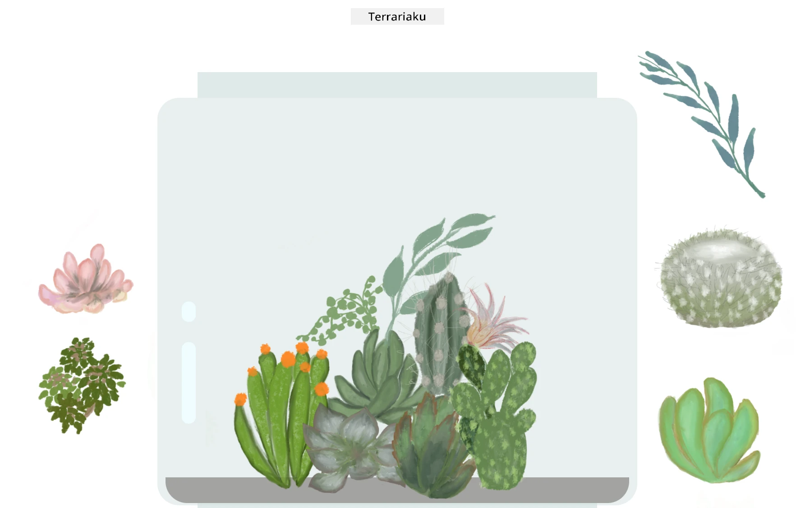

<!--
CO_OP_TRANSLATOR_METADATA:
{
  "original_hash": "6329fbe8bd936068debd78cca6f09c0a",
  "translation_date": "2025-08-27T22:58:29+00:00",
  "source_file": "3-terrarium/solution/README.md",
  "language_code": "id"
}
-->
# Terrarium Saya: Proyek untuk belajar tentang HTML, CSS, dan manipulasi DOM menggunakan JavaScript 🌵🌱

Sebuah meditasi kode kecil dengan fitur seret dan lepas. Dengan sedikit HTML, JS, dan CSS, Anda dapat membangun antarmuka web, menatanya, dan menambahkan interaksi.

## Kredit

Ditulis dengan ♥️ oleh [Jen Looper](https://www.twitter.com/jenlooper)

Terrarium yang dibuat menggunakan CSS terinspirasi dari kaca jar buatan Jakub Mandra di [codepen](https://codepen.io/Rotarepmi/pen/rjpNZY).

Karya seni digambar tangan oleh [Jen Looper](http://jenlooper.com) menggunakan Procreate.

## Publikasikan Terrarium Anda

Anda dapat mempublikasikan terrarium Anda ke web menggunakan Azure Static Web Apps.

1. Fork repositori ini

2. Tekan tombol ini

3. Ikuti wizard untuk membuat aplikasi Anda. Pastikan Anda mengatur root aplikasi ke `/solution` atau root dari basis kode Anda. Tidak ada API dalam aplikasi ini, jadi tidak perlu menambahkannya. Folder .github akan dibuat di repositori yang telah Anda fork, yang akan membantu layanan build Azure Static Web Apps untuk membangun dan mempublikasikan aplikasi Anda ke URL baru.

---

**Penafian**:  
Dokumen ini telah diterjemahkan menggunakan layanan penerjemahan AI [Co-op Translator](https://github.com/Azure/co-op-translator). Meskipun kami berusaha untuk memberikan hasil yang akurat, harap diingat bahwa terjemahan otomatis mungkin mengandung kesalahan atau ketidakakuratan. Dokumen asli dalam bahasa aslinya harus dianggap sebagai sumber yang otoritatif. Untuk informasi yang bersifat kritis, disarankan menggunakan jasa penerjemahan profesional oleh manusia. Kami tidak bertanggung jawab atas kesalahpahaman atau penafsiran yang keliru yang timbul dari penggunaan terjemahan ini.