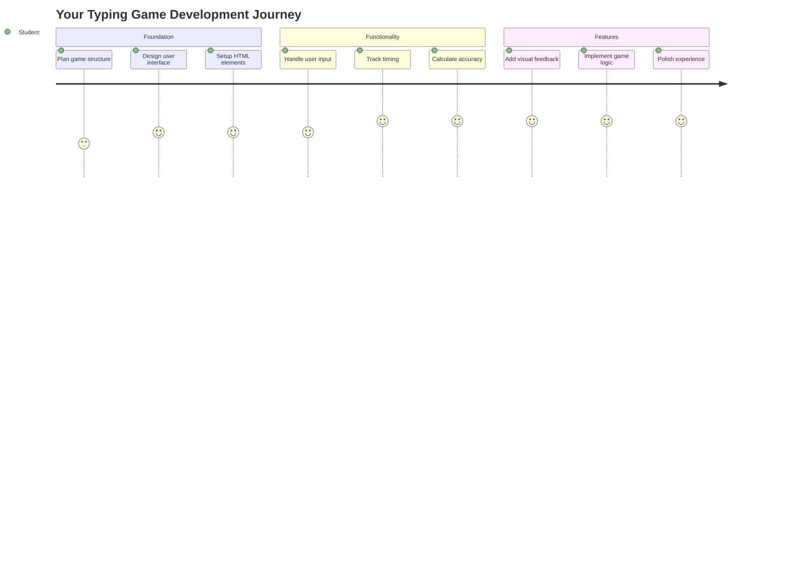
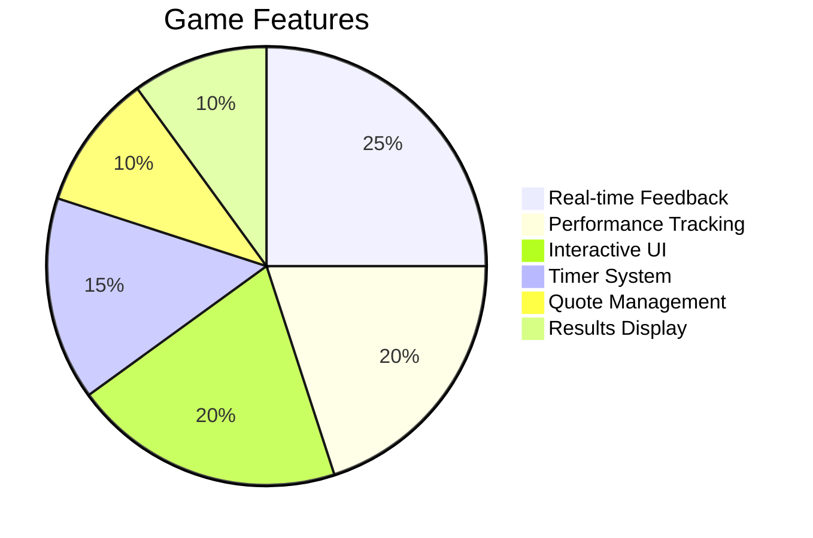
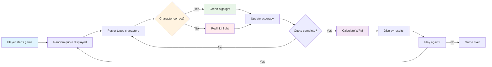
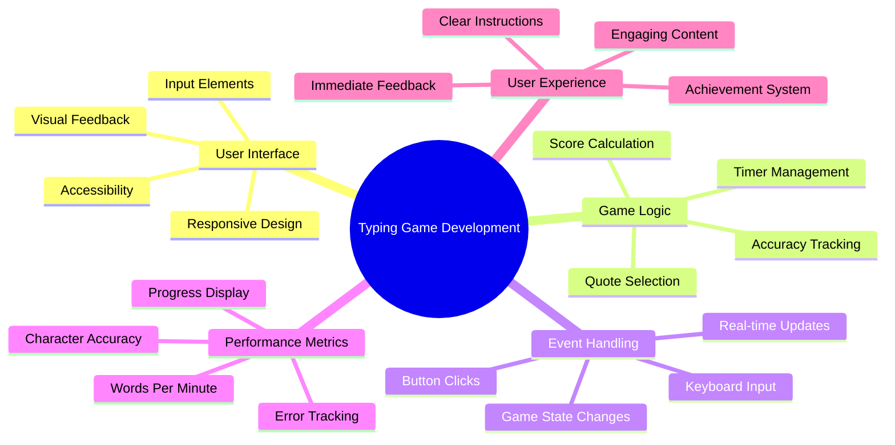
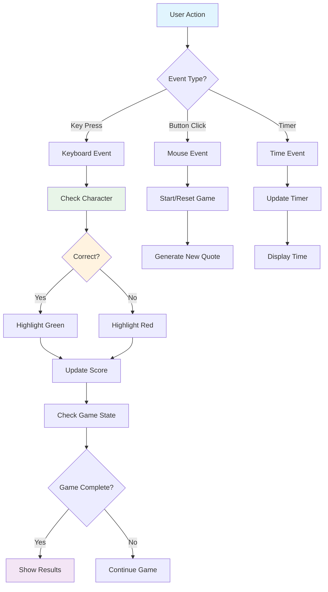
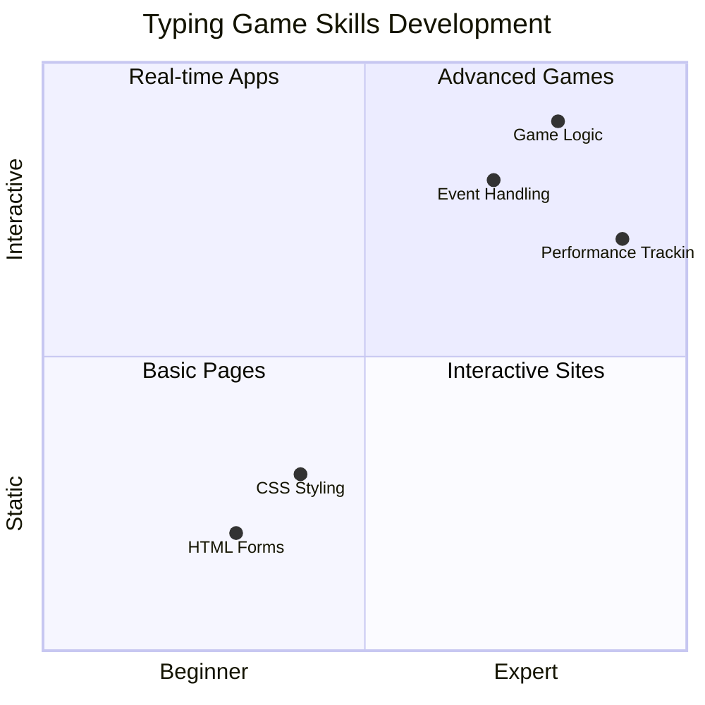
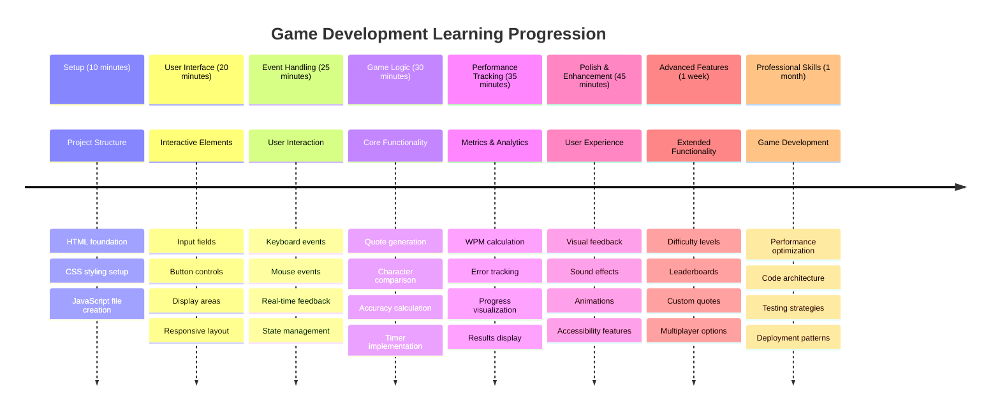

<!--
CO_OP_TRANSLATOR_METADATA:
{
  "original_hash": "efa2ab875b8bb5a7883816506da6b6d2",
  "translation_date": "2025-11-06T11:53:44+00:00",
  "source_file": "4-typing-game/README.md",
  "language_code": "id"
}
-->
# Pemrograman Berbasis Event - Membangun Game Mengetik

## Pendahuluan

Ada sesuatu yang diketahui oleh setiap pengembang tetapi jarang dibicarakan: mengetik cepat adalah sebuah kekuatan super! 🚀 Pikirkan ini - semakin cepat Anda bisa mentransfer ide dari otak ke editor kode, semakin lancar kreativitas Anda mengalir. Ini seperti memiliki jalur langsung antara pikiran Anda dan layar.

Ingin tahu salah satu cara terbaik untuk meningkatkan kemampuan ini? Benar sekali - kita akan membuat sebuah game!

> Mari kita buat game mengetik yang keren bersama-sama!

Siap menggunakan semua keterampilan JavaScript, HTML, dan CSS yang telah Anda pelajari? Kita akan membuat game mengetik yang akan menantang Anda dengan kutipan acak dari detektif legendaris [Sherlock Holmes](https://en.wikipedia.org/wiki/Sherlock_Holmes). Game ini akan melacak seberapa cepat dan akurat Anda mengetik - dan percayalah, ini lebih adiktif daripada yang Anda bayangkan!

## Apa yang Perlu Anda Ketahui

Sebelum kita mulai, pastikan Anda sudah memahami konsep-konsep berikut (jangan khawatir jika Anda perlu penyegaran cepat - kita semua pernah mengalaminya!):

- Membuat input teks dan kontrol tombol
- CSS dan pengaturan gaya menggunakan kelas  
- Dasar-dasar JavaScript
  - Membuat array
  - Membuat angka acak
  - Mendapatkan waktu saat ini

Jika ada yang terasa sedikit berkarat, itu tidak masalah! Kadang-kadang cara terbaik untuk memperkuat pengetahuan Anda adalah dengan langsung terjun ke proyek dan mempelajari sambil jalan.

### 🔄 **Pengecekan Pedagogis**
**Penilaian Dasar**: Sebelum memulai pengembangan, pastikan Anda memahami:
- ✅ Cara kerja elemen formulir HTML dan input
- ✅ Kelas CSS dan gaya dinamis
- ✅ Event listener dan handler di JavaScript
- ✅ Manipulasi array dan pemilihan acak
- ✅ Pengukuran waktu dan perhitungan

**Tes Diri Cepat**: Bisakah Anda menjelaskan bagaimana konsep-konsep ini bekerja bersama dalam sebuah game interaktif?
- **Event** dipicu saat pengguna berinteraksi dengan elemen
- **Handler** memproses event tersebut dan memperbarui status game
- **CSS** memberikan umpan balik visual untuk aksi pengguna
- **Pengukuran waktu** memungkinkan penilaian performa dan perkembangan game

## Mari Kita Bangun Game Ini!

[Membuat game mengetik menggunakan pemrograman berbasis event](./typing-game/README.md)

### ⚡ **Apa yang Bisa Anda Lakukan dalam 5 Menit Berikutnya**
- [ ] Buka konsol browser Anda dan coba mendengarkan event keyboard dengan `addEventListener`
- [ ] Buat halaman HTML sederhana dengan bidang input dan uji deteksi pengetikan
- [ ] Latih manipulasi string dengan membandingkan teks yang diketik dengan teks target
- [ ] Bereksperimen dengan `setTimeout` untuk memahami fungsi pengaturan waktu

### 🎯 **Apa yang Bisa Anda Capai dalam Satu Jam**
- [ ] Selesaikan kuis pasca-pelajaran dan pahami pemrograman berbasis event
- [ ] Bangun versi dasar game mengetik dengan validasi kata
- [ ] Tambahkan umpan balik visual untuk pengetikan yang benar dan salah
- [ ] Implementasikan sistem skor sederhana berdasarkan kecepatan dan akurasi
- [ ] Gaya game Anda dengan CSS agar terlihat menarik

### 📅 **Pengembangan Game Anda Selama Seminggu**
- [ ] Selesaikan game mengetik lengkap dengan semua fitur dan penyempurnaan
- [ ] Tambahkan tingkat kesulitan dengan kompleksitas kata yang bervariasi
- [ ] Implementasikan pelacakan statistik pengguna (WPM, akurasi dari waktu ke waktu)
- [ ] Buat efek suara dan animasi untuk pengalaman pengguna yang lebih baik
- [ ] Jadikan game Anda responsif untuk perangkat sentuh
- [ ] Bagikan game Anda secara online dan kumpulkan umpan balik dari pengguna

### 🌟 **Pengembangan Interaktif Anda Selama Sebulan**
- [ ] Bangun beberapa game yang mengeksplorasi pola interaksi yang berbeda
- [ ] Pelajari tentang loop game, manajemen status, dan optimasi performa
- [ ] Berkontribusi pada proyek pengembangan game open source
- [ ] Kuasai konsep pengaturan waktu lanjutan dan animasi yang halus
- [ ] Buat portofolio yang menampilkan berbagai aplikasi interaktif
- [ ] Bimbing orang lain yang tertarik pada pengembangan game dan interaksi pengguna

## 🎯 Garis Waktu Penguasaan Game Mengetik Anda

### 🛠️ Ringkasan Toolkit Pengembangan Game Anda

Setelah menyelesaikan proyek ini, Anda akan menguasai:
- **Pemrograman Berbasis Event**: Antarmuka pengguna responsif yang bereaksi terhadap input
- **Umpan Balik Real-Time**: Pembaruan visual dan performa instan
- **Pengukuran Performa**: Sistem pengaturan waktu dan skor yang akurat
- **Manajemen Status Game**: Mengontrol alur aplikasi dan pengalaman pengguna
- **Desain Interaktif**: Menciptakan pengalaman pengguna yang menarik dan adiktif
- **Web API Modern**: Memanfaatkan kemampuan browser untuk interaksi yang kaya
- **Pola Aksesibilitas**: Desain inklusif untuk semua pengguna

**Aplikasi Dunia Nyata**: Keterampilan ini langsung berlaku untuk:
- **Aplikasi Web**: Antarmuka interaktif atau dashboard
- **Perangkat Lunak Pendidikan**: Platform pembelajaran dan alat penilaian keterampilan
- **Alat Produktivitas**: Editor teks, IDE, dan perangkat kolaborasi
- **Industri Game**: Game browser dan hiburan interaktif
- **Pengembangan Mobile**: Antarmuka berbasis sentuhan dan penanganan gestur

**Tingkat Berikutnya**: Anda siap menjelajahi kerangka kerja game tingkat lanjut, sistem multipemain real-time, atau aplikasi interaktif yang kompleks!

## Kredit

Ditulis dengan ♥️ oleh [Christopher Harrison](http://www.twitter.com/geektrainer)

---

**Penafian**:  
Dokumen ini telah diterjemahkan menggunakan layanan penerjemahan AI [Co-op Translator](https://github.com/Azure/co-op-translator). Meskipun kami berupaya untuk memberikan hasil yang akurat, harap diketahui bahwa terjemahan otomatis mungkin mengandung kesalahan atau ketidakakuratan. Dokumen asli dalam bahasa aslinya harus dianggap sebagai sumber yang otoritatif. Untuk informasi yang penting, disarankan menggunakan jasa penerjemahan manusia profesional. Kami tidak bertanggung jawab atas kesalahpahaman atau penafsiran yang keliru yang timbul dari penggunaan terjemahan ini.