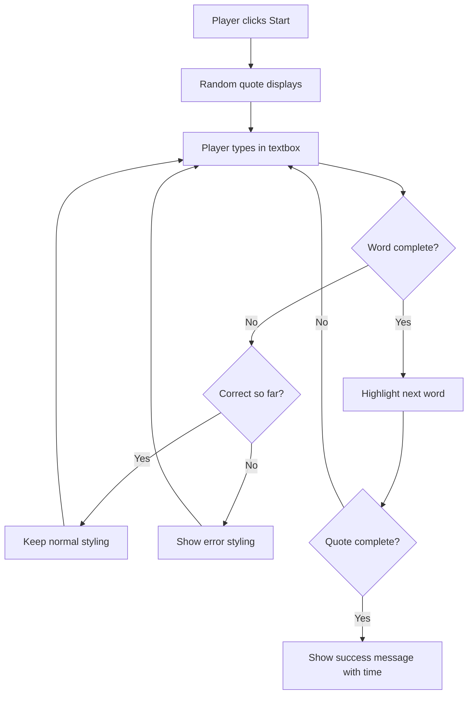
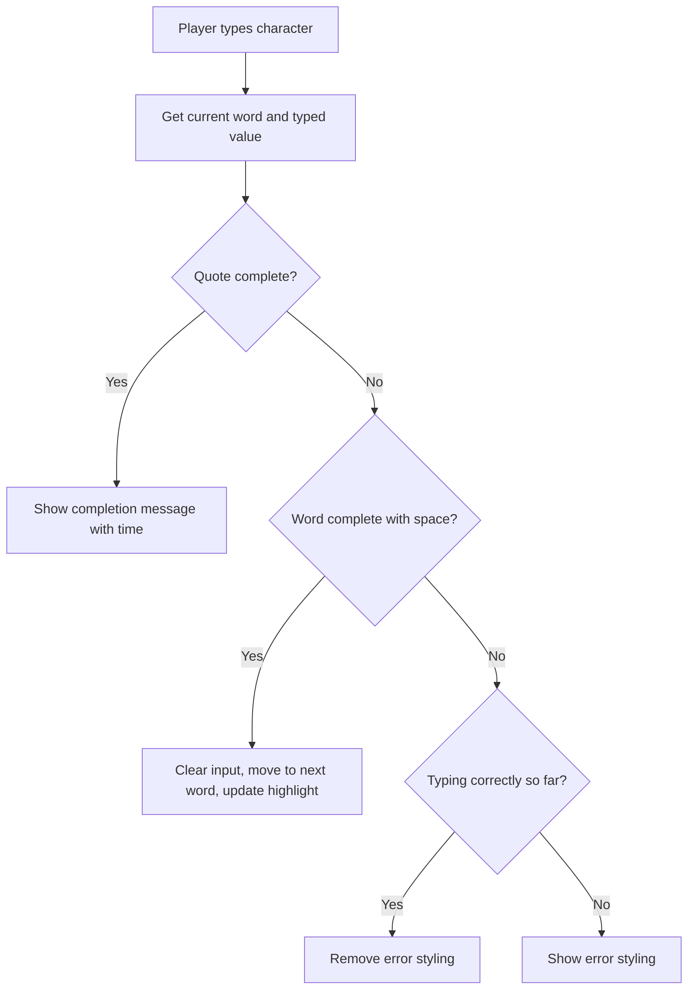
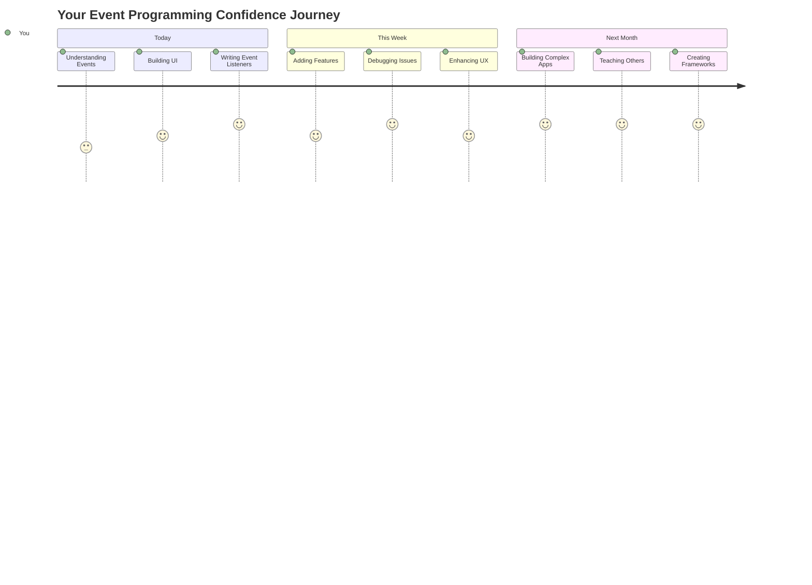

<!--
CO_OP_TRANSLATOR_METADATA:
{
  "original_hash": "da8bc72041a2bb3826a54654ee1a8844",
  "translation_date": "2025-11-06T11:53:56+00:00",
  "source_file": "4-typing-game/typing-game/README.md",
  "language_code": "id"
}
-->
# Membuat game menggunakan event

Pernahkah Anda bertanya-tanya bagaimana situs web tahu saat Anda mengklik tombol atau mengetik di kotak teks? Itulah keajaiban dari pemrograman berbasis event! Cara terbaik untuk mempelajari keterampilan penting ini adalah dengan membangun sesuatu yang berguna - sebuah game kecepatan mengetik yang merespons setiap ketikan Anda.

Anda akan melihat secara langsung bagaimana browser web "berbicara" dengan kode JavaScript Anda. Setiap kali Anda mengklik, mengetik, atau menggerakkan mouse, browser mengirimkan pesan kecil (kami menyebutnya event) ke kode Anda, dan Anda yang memutuskan bagaimana meresponsnya!

Saat kita selesai, Anda akan memiliki game mengetik nyata yang melacak kecepatan dan akurasi Anda. Lebih penting lagi, Anda akan memahami konsep dasar yang mendukung setiap situs web interaktif yang pernah Anda gunakan. Mari kita mulai!

## Kuis Pra-Pelajaran

[Kuis pra-pelajaran](https://ff-quizzes.netlify.app/web/quiz/21)

## Pemrograman berbasis event

Pikirkan tentang aplikasi atau situs web favorit Anda - apa yang membuatnya terasa hidup dan responsif? Semuanya tentang bagaimana ia merespons apa yang Anda lakukan! Setiap ketukan, klik, gesekan, atau ketikan menciptakan apa yang kami sebut "event," dan di situlah keajaiban pengembangan web terjadi.

Inilah yang membuat pemrograman untuk web begitu menarik: kita tidak pernah tahu kapan seseorang akan mengklik tombol itu atau mulai mengetik di kotak teks. Mereka mungkin mengklik segera, menunggu lima menit, atau mungkin tidak pernah mengklik sama sekali! Ketidakpastian ini berarti kita perlu berpikir berbeda tentang bagaimana kita menulis kode kita.

Alih-alih menulis kode yang berjalan dari atas ke bawah seperti resep, kita menulis kode yang duduk dengan sabar menunggu sesuatu terjadi. Ini mirip dengan bagaimana operator telegraf di tahun 1800-an akan duduk di dekat mesin mereka, siap merespons saat pesan datang melalui kabel.

Jadi, apa sebenarnya "event" itu? Sederhananya, itu adalah sesuatu yang terjadi! Ketika Anda mengklik tombol - itu adalah event. Ketika Anda mengetik huruf - itu adalah event. Ketika Anda menggerakkan mouse - itu adalah event lainnya.

Pemrograman berbasis event memungkinkan kita mengatur kode kita untuk mendengarkan dan merespons. Kita membuat fungsi khusus yang disebut **event listener** yang menunggu dengan sabar untuk hal-hal tertentu terjadi, lalu bertindak saat itu terjadi.

Pikirkan event listener seperti memiliki bel pintu untuk kode Anda. Anda mengatur bel pintu (`addEventListener()`), memberitahunya suara apa yang harus didengarkan (seperti 'klik' atau 'keypress'), dan kemudian menentukan apa yang harus terjadi saat seseorang membunyikannya (fungsi kustom Anda).

**Begini cara kerja event listener:**
- **Mendengarkan** tindakan pengguna tertentu seperti klik, ketikan, atau gerakan mouse
- **Menjalankan** kode kustom Anda saat event yang ditentukan terjadi
- **Merespons** interaksi pengguna secara langsung, menciptakan pengalaman yang mulus
- **Menangani** beberapa event pada elemen yang sama menggunakan listener yang berbeda

> **NOTE:** Perlu dicatat bahwa ada banyak cara untuk membuat event listener. Anda dapat menggunakan fungsi anonim, atau membuat fungsi bernama. Anda dapat menggunakan berbagai pintasan, seperti mengatur properti `click`, atau menggunakan `addEventListener()`. Dalam latihan kita, kita akan fokus pada `addEventListener()` dan fungsi anonim, karena ini adalah teknik yang paling umum digunakan oleh pengembang web. Ini juga yang paling fleksibel, karena `addEventListener()` bekerja untuk semua event, dan nama event dapat diberikan sebagai parameter.

### Event umum

Meskipun browser web menawarkan puluhan event berbeda yang dapat Anda dengarkan, sebagian besar aplikasi interaktif hanya mengandalkan beberapa event penting. Memahami event inti ini akan memberi Anda dasar untuk membangun interaksi pengguna yang canggih.

Ada [puluhan event](https://developer.mozilla.org/docs/Web/Events) yang tersedia untuk Anda dengarkan saat membuat aplikasi. Pada dasarnya, apa pun yang dilakukan pengguna di halaman akan memicu event, yang memberi Anda banyak kekuatan untuk memastikan mereka mendapatkan pengalaman yang Anda inginkan. Untungnya, Anda biasanya hanya membutuhkan sedikit event. Berikut beberapa yang umum (termasuk dua yang akan kita gunakan saat membuat game kita):

| Event | Deskripsi | Kasus Penggunaan Umum |
|-------|-----------|-----------------------|
| `click` | Pengguna mengklik sesuatu | Tombol, tautan, elemen interaktif |
| `contextmenu` | Pengguna mengklik tombol mouse kanan | Menu klik kanan kustom |
| `select` | Pengguna menyorot teks | Pengeditan teks, operasi salin |
| `input` | Pengguna memasukkan teks | Validasi formulir, pencarian real-time |

**Memahami jenis event ini:**
- **Memicu** saat pengguna berinteraksi dengan elemen tertentu di halaman Anda
- **Memberikan** informasi rinci tentang tindakan pengguna melalui objek event
- **Memungkinkan** Anda membuat aplikasi web yang responsif dan interaktif
- **Bekerja** secara konsisten di berbagai browser dan perangkat

## Membuat game

Sekarang setelah Anda memahami cara kerja event, mari kita praktikkan pengetahuan itu dengan membangun sesuatu yang berguna. Kita akan membuat game kecepatan mengetik yang menunjukkan penanganan event sambil membantu Anda mengembangkan keterampilan penting sebagai pengembang.

Kita akan membuat game untuk mengeksplorasi cara kerja event di JavaScript. Game kita akan menguji keterampilan mengetik pemain, yang merupakan salah satu keterampilan yang paling diremehkan yang harus dimiliki semua pengembang. Fakta menarik: tata letak keyboard QWERTY yang kita gunakan hari ini sebenarnya dirancang pada tahun 1870-an untuk mesin tik - dan keterampilan mengetik yang baik masih sama berharganya bagi programmer saat ini! Alur umum game akan terlihat seperti ini:



**Begini cara kerja game kita:**
- **Dimulai** saat pemain mengklik tombol mulai dan menampilkan kutipan acak
- **Melacak** kemajuan mengetik pemain kata demi kata secara real-time
- **Menyoroti** kata saat ini untuk memandu fokus pemain
- **Memberikan** umpan balik visual langsung untuk kesalahan mengetik
- **Menghitung** dan menampilkan total waktu saat kutipan selesai

Mari kita bangun game kita, dan pelajari tentang event!

### Struktur file

Sebelum kita mulai coding, mari kita atur! Memiliki struktur file yang rapi sejak awal akan menghemat waktu Anda di kemudian hari dan membuat proyek Anda lebih profesional. 😊

Kita akan membuatnya sederhana dengan hanya tiga file: `index.html` untuk struktur halaman kita, `script.js` untuk semua logika game kita, dan `style.css` untuk membuat semuanya terlihat bagus. Ini adalah trio klasik yang mendukung sebagian besar web!

**Buat folder baru untuk pekerjaan Anda dengan membuka konsol atau jendela terminal dan menjalankan perintah berikut:**

```bash
# Linux or macOS
mkdir typing-game && cd typing-game

# Windows
md typing-game && cd typing-game
```

**Begini cara kerja perintah ini:**
- **Membuat** direktori baru bernama `typing-game` untuk file proyek Anda
- **Masuk** ke direktori yang baru dibuat secara otomatis
- **Menyiapkan** ruang kerja yang bersih untuk pengembangan game Anda

**Buka Visual Studio Code:**

```bash
code .
```

**Perintah ini:**
- **Meluncurkan** Visual Studio Code di direktori saat ini
- **Membuka** folder proyek Anda di editor
- **Memberikan** akses ke semua alat pengembangan yang Anda butuhkan

**Tambahkan tiga file ke folder di Visual Studio Code dengan nama berikut:**
- `index.html` - Berisi struktur dan konten game Anda
- `script.js` - Menangani semua logika game dan event listener
- `style.css` - Mendefinisikan tampilan visual dan gaya

## Membuat antarmuka pengguna

Sekarang mari kita bangun panggung tempat semua aksi game kita akan terjadi! Anggap ini seperti merancang panel kontrol untuk pesawat luar angkasa - kita perlu memastikan semua yang dibutuhkan pemain ada di tempat yang mereka harapkan.

Mari kita tentukan apa yang sebenarnya dibutuhkan game kita. Jika Anda memainkan game mengetik, apa yang ingin Anda lihat di layar? Berikut yang kita butuhkan:

| Elemen UI | Tujuan | Elemen HTML |
|-----------|--------|-------------|
| Tampilan Kutipan | Menampilkan teks untuk diketik | `<p>` dengan `id="quote"` |
| Area Pesan | Menampilkan status dan pesan keberhasilan | `<p>` dengan `id="message"` |
| Input Teks | Tempat pemain mengetik kutipan | `<input>` dengan `id="typed-value"` |
| Tombol Mulai | Memulai game | `<button>` dengan `id="start"` |

**Memahami struktur UI:**
- **Mengorganisasi** konten secara logis dari atas ke bawah
- **Memberikan** ID unik pada elemen untuk penargetan JavaScript
- **Menyediakan** hierarki visual yang jelas untuk pengalaman pengguna yang lebih baik
- **Menyertakan** elemen HTML semantik untuk aksesibilitas

Setiap elemen tersebut akan membutuhkan ID agar kita dapat bekerja dengannya di JavaScript kita. Kita juga akan menambahkan referensi ke file CSS dan JavaScript yang akan kita buat.

Buat file baru bernama `index.html`. Tambahkan HTML berikut:

```html
<!-- inside index.html -->
<html>
<head>
  <title>Typing game</title>
  <link rel="stylesheet" href="style.css">
</head>
<body>
  <h1>Typing game!</h1>
  <p>Practice your typing skills with a quote from Sherlock Holmes. Click **start** to begin!</p>
  <p id="quote"></p> <!-- This will display our quote -->
  <p id="message"></p> <!-- This will display any status messages -->
  <div>
    <input type="text" aria-label="current word" id="typed-value" /> <!-- The textbox for typing -->
    <button type="button" id="start">Start</button> <!-- To start the game -->
  </div>
  <script src="script.js"></script>
</body>
</html>
```

**Memecah apa yang dicapai oleh struktur HTML ini:**
- **Menautkan** stylesheet CSS di `<head>` untuk styling
- **Membuat** heading yang jelas dan instruksi untuk pengguna
- **Membangun** paragraf placeholder dengan ID spesifik untuk konten dinamis
- **Menyertakan** bidang input dengan atribut aksesibilitas
- **Menyediakan** tombol mulai untuk memicu game
- **Memuat** file JavaScript di akhir untuk kinerja optimal

### Meluncurkan aplikasi

Menguji aplikasi Anda secara sering selama pengembangan membantu Anda menemukan masalah lebih awal dan melihat kemajuan Anda secara real-time. Live Server adalah alat yang sangat berharga yang secara otomatis menyegarkan browser Anda setiap kali Anda menyimpan perubahan, membuat pengembangan jauh lebih efisien.

Selalu terbaik untuk mengembangkan secara bertahap untuk melihat bagaimana semuanya terlihat. Mari kita luncurkan aplikasi kita. Ada ekstensi luar biasa untuk Visual Studio Code yang disebut [Live Server](https://marketplace.visualstudio.com/items?itemName=ritwickdey.LiveServer&WT.mc_id=academic-77807-sagibbon) yang akan meng-host aplikasi Anda secara lokal dan menyegarkan browser setiap kali Anda menyimpan.

**Instal [Live Server](https://marketplace.visualstudio.com/items?itemName=ritwickdey.LiveServer&WT.mc_id=academic-77807-sagibbon) dengan mengikuti tautan dan mengklik Install:**

**Begini yang terjadi selama instalasi:**
- **Meminta** browser Anda untuk membuka Visual Studio Code
- **Memandu** Anda melalui proses instalasi ekstensi
- **Mungkin memerlukan** restart Visual Studio Code untuk menyelesaikan pengaturan

**Setelah terinstal, di Visual Studio Code, klik Ctrl-Shift-P (atau Cmd-Shift-P) untuk membuka command palette:**

**Memahami command palette:**
- **Memberikan** akses cepat ke semua perintah VS Code
- **Mencari** perintah saat Anda mengetik
- **Menawarkan** pintasan keyboard untuk pengembangan lebih cepat

**Ketik "Live Server: Open with Live Server":**

**Apa yang dilakukan Live Server:**
- **Memulai** server pengembangan lokal untuk proyek Anda
- **Secara otomatis** menyegarkan browser saat Anda menyimpan file
- **Melayani** file Anda dari URL lokal (biasanya `localhost:5500`)

**Buka browser dan navigasikan ke `https://localhost:5500`:**

Anda sekarang seharusnya melihat halaman yang Anda buat! Mari tambahkan beberapa fungsionalitas.

## Menambahkan CSS

Sekarang mari kita buat tampilannya bagus! Umpan balik visual sangat penting untuk antarmuka pengguna sejak awal era komputasi. Pada tahun 1980-an, para peneliti menemukan bahwa umpan balik visual langsung secara dramatis meningkatkan kinerja pengguna dan mengurangi kesalahan. Itulah yang akan kita buat.

Game kita perlu sangat jelas tentang apa yang sedang terjadi. Pemain harus segera tahu kata mana yang harus mereka ketik, dan jika mereka membuat kesalahan, mereka harus melihatnya langsung. Mari kita buat beberapa gaya yang sederhana namun efektif:

Buat file baru bernama `style.css` dan tambahkan sintaks berikut.

```css
/* inside style.css */
.highlight {
  background-color: yellow;
}

.error {
  background-color: lightcoral;
  border: red;
}
```

**Memahami kelas CSS ini:**
- **Menyoroti** kata saat ini dengan latar belakang kuning untuk panduan visual yang jelas
- **Menandakan** kesalahan mengetik dengan warna latar belakang coral muda
- **Memberikan** umpan balik langsung tanpa mengganggu alur mengetik pengguna
- **Menggunakan** warna kontras untuk aksesibilitas dan komunikasi visual yang jelas

✅ Dalam hal CSS, Anda dapat mengatur tata letak halaman Anda sesuai keinginan. Luangkan sedikit waktu dan buat halaman terlihat lebih menarik:

- Pilih font yang berbeda
- Warnai header
- Ubah ukuran elemen

## JavaScript

Di sinilah semuanya menjadi menarik! 🎉 Kita sudah memiliki struktur HTML dan styling CSS, tetapi saat ini game kita seperti mobil indah tanpa mesin. JavaScript akan menjadi mesin itu - inilah yang membuat semuanya benar-benar bekerja dan merespons apa yang dilakukan pemain.

Di sinilah Anda akan melihat kreasi Anda hidup. Kita akan menangani ini langkah demi langkah agar tidak terasa terlalu membingungkan:

| Langkah | Tujuan | Apa yang Akan Anda Pelajari |
|---------|--------|-----------------------------|
| [Membuat konstanta](../../../../4-typing-game/typing-game) | Menyiapkan kutipan dan referensi DOM | Manajemen variabel dan seleksi DOM |
| [Event listener untuk memulai game](../../../../4-typing-game/typing-game) | Menangani inisialisasi game | Penanganan event dan pembaruan UI |
| [Event listener untuk mengetik](../../../../4-typing-game/typing-game) | Memproses input pengguna secara real-time | Validasi input dan umpan balik dinamis |

**Pendekatan terstruktur ini membantu Anda:**
- **Mengorganisasi** kode Anda ke dalam bagian yang logis dan mudah dikelola
- **Membangun** fungsionalitas secara bertahap untuk debugging yang lebih mudah
- **Memahami** bagaimana bagian-bagian berbeda dari aplikasi Anda bekerja bersama
- **Membuat** pola yang dapat digunakan kembali untuk proyek di masa depan

Namun pertama-tama, buat file baru bernama `script.js`.

### Menambahkan konstanta

Sebelum kita masuk ke aksi, mari kita kumpulkan semua sumber daya kita! Seperti bagaimana pusat kendali NASA menyiapkan semua sistem pemantauan mereka sebelum peluncuran, jauh lebih mudah saat Anda memiliki semuanya siap dan tersedia. Ini menghemat waktu dari mencari-cari sesuatu nanti dan membantu mencegah kesalahan ketik.

Berikut yang perlu kita siapkan terlebih dahulu:

| Jenis Data | Tujuan | Contoh |
|------------|--------|--------|
| Array of quotes | Simpan semua kutipan yang mungkin untuk permainan | `['Quote 1', 'Quote 2', ...]` |
| Word array | Pecah kutipan saat ini menjadi kata-kata individu | `['When', 'you', 'have', ...]` |
| Word index | Lacak kata mana yang sedang diketik oleh pemain | `0, 1, 2, 3...` |
| Start time | Hitung waktu yang berlalu untuk penilaian | `Date.now()` |

**Kita juga membutuhkan referensi ke elemen UI kita:**
| Elemen | ID | Tujuan |
|--------|----|--------|
| Input teks | `typed-value` | Tempat pemain mengetik |
| Tampilan kutipan | `quote` | Menampilkan kutipan untuk diketik |
| Area pesan | `message` | Menampilkan pembaruan status |

```javascript
// inside script.js
// all of our quotes
const quotes = [
    'When you have eliminated the impossible, whatever remains, however improbable, must be the truth.',
    'There is nothing more deceptive than an obvious fact.',
    'I ought to know by this time that when a fact appears to be opposed to a long train of deductions it invariably proves to be capable of bearing some other interpretation.',
    'I never make exceptions. An exception disproves the rule.',
    'What one man can invent another can discover.',
    'Nothing clears up a case so much as stating it to another person.',
    'Education never ends, Watson. It is a series of lessons, with the greatest for the last.',
];
// store the list of words and the index of the word the player is currently typing
let words = [];
let wordIndex = 0;
// the starting time
let startTime = Date.now();
// page elements
const quoteElement = document.getElementById('quote');
const messageElement = document.getElementById('message');
const typedValueElement = document.getElementById('typed-value');
```

**Memecah apa yang dilakukan oleh kode pengaturan ini:**
- **Menyimpan** array kutipan Sherlock Holmes menggunakan `const` karena kutipan tidak akan berubah
- **Menginisialisasi** variabel pelacakan dengan `let` karena nilai-nilai ini akan diperbarui selama permainan
- **Menangkap** referensi ke elemen DOM menggunakan `document.getElementById()` untuk akses yang efisien
- **Menyiapkan** dasar untuk semua fungsi permainan dengan nama variabel yang jelas dan deskriptif
- **Mengorganisasi** data dan elemen terkait secara logis untuk mempermudah pemeliharaan kode

✅ Silakan tambahkan lebih banyak kutipan ke permainan Anda

> 💡 **Tips Pro**: Kita dapat mengambil elemen kapan saja dalam kode dengan menggunakan `document.getElementById()`. Karena kita akan sering merujuk elemen-elemen ini, kita akan menghindari kesalahan ketik dengan literal string dengan menggunakan konstanta. Framework seperti [Vue.js](https://vuejs.org/) atau [React](https://reactjs.org/) dapat membantu Anda mengelola kode secara lebih terpusat.
>
**Mengapa pendekatan ini sangat efektif:**
- **Mencegah** kesalahan penulisan saat merujuk elemen berkali-kali
- **Meningkatkan** keterbacaan kode dengan nama konstanta yang deskriptif
- **Memungkinkan** dukungan IDE yang lebih baik dengan pelengkapan otomatis dan pemeriksaan kesalahan
- **Mempermudah** refactoring jika ID elemen berubah di kemudian hari

Luangkan waktu untuk menonton video tentang penggunaan `const`, `let`, dan `var`

[](https://youtube.com/watch?v=JNIXfGiDWM8 "Jenis variabel")

> 🎥 Klik gambar di atas untuk video tentang variabel.

### Tambahkan logika mulai

Di sinilah semuanya mulai berjalan! 🚀 Anda akan menulis pendengar acara pertama Anda, dan ada sesuatu yang sangat memuaskan tentang melihat kode Anda merespons klik tombol.

Pikirkan ini: di suatu tempat di luar sana, seorang pemain akan mengklik tombol "Start", dan kode Anda harus siap untuk mereka. Kita tidak tahu kapan mereka akan mengkliknya - bisa langsung, bisa setelah mereka mengambil kopi - tetapi ketika mereka melakukannya, permainan Anda akan hidup.

Ketika pengguna mengklik `start`, kita perlu memilih kutipan, menyiapkan antarmuka pengguna, dan menyiapkan pelacakan untuk kata saat ini dan waktu. Di bawah ini adalah JavaScript yang perlu Anda tambahkan; kita akan membahasnya setelah blok skrip.

```javascript
// at the end of script.js
document.getElementById('start').addEventListener('click', () => {
  // get a quote
  const quoteIndex = Math.floor(Math.random() * quotes.length);
  const quote = quotes[quoteIndex];
  // Put the quote into an array of words
  words = quote.split(' ');
  // reset the word index for tracking
  wordIndex = 0;

  // UI updates
  // Create an array of span elements so we can set a class
  const spanWords = words.map(function(word) { return `<span>${word} </span>`});
  // Convert into string and set as innerHTML on quote display
  quoteElement.innerHTML = spanWords.join('');
  // Highlight the first word
  quoteElement.childNodes[0].className = 'highlight';
  // Clear any prior messages
  messageElement.innerText = '';

  // Setup the textbox
  // Clear the textbox
  typedValueElement.value = '';
  // set focus
  typedValueElement.focus();
  // set the event handler

  // Start the timer
  startTime = new Date().getTime();
});
```

**Mari kita pecah kode menjadi bagian logis:**

**📊 Pengaturan Pelacakan Kata:**
- **Memilih** kutipan acak menggunakan `Math.floor()` dan `Math.random()` untuk variasi
- **Mengonversi** kutipan menjadi array kata-kata individu menggunakan `split(' ')`
- **Mengatur ulang** `wordIndex` ke 0 karena pemain mulai dengan kata pertama
- **Mempersiapkan** status permainan untuk putaran baru

**🎨 Pengaturan dan Tampilan UI:**
- **Membuat** array elemen `<span>`, membungkus setiap kata untuk penataan individu
- **Menggabungkan** elemen span menjadi string tunggal untuk pembaruan DOM yang efisien
- **Menyoroti** kata pertama dengan menambahkan kelas CSS `highlight`
- **Menghapus** pesan permainan sebelumnya untuk memberikan awal yang bersih

**⌨️ Persiapan Kotak Teks:**
- **Menghapus** teks yang ada di bidang input
- **Mengatur fokus** ke kotak teks sehingga pemain dapat mulai mengetik segera
- **Mempersiapkan** area input untuk sesi permainan baru

**⏱️ Inisialisasi Timer:**
- **Menangkap** stempel waktu saat ini menggunakan `new Date().getTime()`
- **Memungkinkan** perhitungan kecepatan mengetik dan waktu penyelesaian yang akurat
- **Memulai** pelacakan kinerja untuk sesi permainan

### Tambahkan logika mengetik

Di sinilah kita menangani inti dari permainan kita! Jangan khawatir jika ini terlihat banyak pada awalnya - kita akan membahas setiap bagian, dan pada akhirnya, Anda akan melihat betapa logisnya semuanya.

Apa yang kita bangun di sini cukup canggih: setiap kali seseorang mengetik huruf, kode kita akan memeriksa apa yang mereka ketik, memberikan umpan balik, dan memutuskan apa yang harus dilakukan selanjutnya. Ini mirip dengan bagaimana pengolah kata awal seperti WordStar di tahun 1970-an memberikan umpan balik waktu nyata kepada pengetik.

```javascript
// at the end of script.js
typedValueElement.addEventListener('input', () => {
  // Get the current word
  const currentWord = words[wordIndex];
  // get the current value
  const typedValue = typedValueElement.value;

  if (typedValue === currentWord && wordIndex === words.length - 1) {
    // end of sentence
    // Display success
    const elapsedTime = new Date().getTime() - startTime;
    const message = `CONGRATULATIONS! You finished in ${elapsedTime / 1000} seconds.`;
    messageElement.innerText = message;
  } else if (typedValue.endsWith(' ') && typedValue.trim() === currentWord) {
    // end of word
    // clear the typedValueElement for the new word
    typedValueElement.value = '';
    // move to the next word
    wordIndex++;
    // reset the class name for all elements in quote
    for (const wordElement of quoteElement.childNodes) {
      wordElement.className = '';
    }
    // highlight the new word
    quoteElement.childNodes[wordIndex].className = 'highlight';
  } else if (currentWord.startsWith(typedValue)) {
    // currently correct
    // highlight the next word
    typedValueElement.className = '';
  } else {
    // error state
    typedValueElement.className = 'error';
  }
});
```

**Memahami alur logika mengetik:**

Fungsi ini menggunakan pendekatan waterfall, memeriksa kondisi dari yang paling spesifik hingga yang paling umum. Mari kita pecah setiap skenario:



**🏁 Kutipan Selesai (Skenario 1):**
- **Memeriksa** apakah nilai yang diketik cocok dengan kata saat ini DAN kita berada di kata terakhir
- **Menghitung** waktu yang berlalu dengan mengurangi waktu mulai dari waktu saat ini
- **Mengonversi** milidetik ke detik dengan membagi dengan 1.000
- **Menampilkan** pesan selamat dengan waktu penyelesaian

**✅ Kata Selesai (Skenario 2):**
- **Mendeteksi** penyelesaian kata saat input diakhiri dengan spasi
- **Memvalidasi** bahwa input yang dipangkas cocok dengan kata saat ini secara tepat
- **Menghapus** bidang input untuk kata berikutnya
- **Melanjutkan** ke kata berikutnya dengan menambahkan `wordIndex`
- **Memperbarui** penyorotan visual dengan menghapus semua kelas dan menyoroti kata baru

**📝 Mengetik Berlangsung (Skenario 3):**
- **Memverifikasi** bahwa kata saat ini dimulai dengan apa yang telah diketik sejauh ini
- **Menghapus** penataan kesalahan untuk menunjukkan input benar
- **Mengizinkan** pengetikan berlanjut tanpa gangguan

**❌ Status Kesalahan (Skenario 4):**
- **Memicu** ketika teks yang diketik tidak cocok dengan awal kata yang diharapkan
- **Menerapkan** kelas CSS kesalahan untuk memberikan umpan balik visual langsung
- **Membantu** pemain dengan cepat mengidentifikasi dan memperbaiki kesalahan

## Uji aplikasi Anda

Lihat apa yang telah Anda capai! 🎉 Anda baru saja membangun permainan mengetik yang nyata dan berfungsi dari awal menggunakan pemrograman berbasis acara. Luangkan waktu untuk menghargai itu - ini bukan prestasi kecil!

Sekarang masuk ke fase pengujian! Apakah ini bekerja seperti yang diharapkan? Apakah kita melewatkan sesuatu? Inilah halnya: jika sesuatu tidak bekerja dengan sempurna langsung, itu sepenuhnya normal. Bahkan pengembang berpengalaman secara teratur menemukan bug dalam kode mereka. Itu semua bagian dari proses pengembangan!

Klik `start`, dan mulailah mengetik! Seharusnya terlihat seperti animasi yang kita lihat sebelumnya.


**Apa yang harus diuji dalam aplikasi Anda:**
- **Memverifikasi** bahwa mengklik Start menampilkan kutipan acak
- **Mengonfirmasi** bahwa mengetik menyoroti kata saat ini dengan benar
- **Memeriksa** bahwa penataan kesalahan muncul untuk pengetikan yang salah
- **Memastikan** bahwa menyelesaikan kata memajukan penyorotan dengan benar
- **Menguji** bahwa menyelesaikan kutipan menunjukkan pesan penyelesaian dengan waktu

**Tips debugging umum:**
- **Periksa** konsol browser (F12) untuk kesalahan JavaScript
- **Verifikasi** bahwa semua nama file cocok persis (case-sensitive)
- **Pastikan** Live Server berjalan dan menyegarkan dengan benar
- **Uji** kutipan yang berbeda untuk memverifikasi pemilihan acak berfungsi

---

## Tantangan GitHub Copilot Agent 🎮

Gunakan mode Agent untuk menyelesaikan tantangan berikut:

**Deskripsi:** Perluas permainan mengetik dengan menerapkan sistem kesulitan yang menyesuaikan permainan berdasarkan kinerja pemain. Tantangan ini akan membantu Anda berlatih penanganan acara tingkat lanjut, analisis data, dan pembaruan UI dinamis.

**Prompt:** Buat sistem penyesuaian kesulitan untuk permainan mengetik yang:
1. Melacak kecepatan mengetik pemain (kata per menit) dan persentase akurasi
2. Secara otomatis menyesuaikan ke tiga tingkat kesulitan: Mudah (kutipan sederhana), Sedang (kutipan saat ini), Sulit (kutipan kompleks dengan tanda baca)
3. Menampilkan tingkat kesulitan saat ini dan statistik pemain di UI
4. Menerapkan penghitung streak yang meningkatkan kesulitan setelah 3 kinerja baik berturut-turut
5. Menambahkan umpan balik visual (warna, animasi) untuk menunjukkan perubahan kesulitan

Tambahkan elemen HTML, gaya CSS, dan fungsi JavaScript yang diperlukan untuk menerapkan fitur ini. Sertakan penanganan kesalahan yang tepat dan pastikan permainan tetap dapat diakses dengan label ARIA yang sesuai.

Pelajari lebih lanjut tentang [mode agent](https://code.visualstudio.com/blogs/2025/02/24/introducing-copilot-agent-mode) di sini.

## 🚀 Tantangan

Siap membawa permainan mengetik Anda ke tingkat berikutnya? Cobalah menerapkan fitur-fitur canggih ini untuk memperdalam pemahaman Anda tentang penanganan acara dan manipulasi DOM:

**Tambahkan lebih banyak fungsi:**

| Fitur | Deskripsi | Keterampilan yang Akan Anda Latih |
|-------|-----------|----------------------------------|
| **Kontrol Input** | Nonaktifkan pendengar acara `input` saat selesai, dan aktifkan kembali saat tombol diklik | Manajemen acara dan kontrol status |
| **Manajemen Status UI** | Nonaktifkan kotak teks saat pemain menyelesaikan kutipan | Manipulasi properti DOM |
| **Dialog Modal** | Tampilkan kotak dialog modal dengan pesan sukses | Pola UI tingkat lanjut dan aksesibilitas |
| **Sistem Skor Tertinggi** | Simpan skor tertinggi menggunakan `localStorage` | API penyimpanan browser dan persistensi data |

**Tips implementasi:**
- **Teliti** `localStorage.setItem()` dan `localStorage.getItem()` untuk penyimpanan yang persisten
- **Latih** menambahkan dan menghapus pendengar acara secara dinamis
- **Jelajahi** elemen dialog HTML atau pola modal CSS
- **Pertimbangkan** aksesibilitas saat menonaktifkan dan mengaktifkan kontrol formulir

## Kuis Pasca-Kuliah

[Kuis pasca-kuliah](https://ff-quizzes.netlify.app/web/quiz/22)

---

## 🚀 Garis Waktu Penguasaan Permainan Mengetik Anda

### ⚡ **Apa yang Bisa Anda Lakukan dalam 5 Menit Berikutnya**
- [ ] Uji permainan mengetik Anda dengan kutipan yang berbeda untuk memastikan semuanya berjalan lancar
- [ ] Bereksperimen dengan gaya CSS - coba ubah warna sorotan dan kesalahan
- [ ] Buka DevTools browser Anda (F12) dan lihat Konsol saat bermain
- [ ] Tantang diri Anda untuk menyelesaikan kutipan secepat mungkin

### ⏰ **Apa yang Bisa Anda Capai dalam Satu Jam**
- [ ] Tambahkan lebih banyak kutipan ke array (mungkin dari buku atau film favorit Anda)
- [ ] Terapkan sistem skor tertinggi `localStorage` dari bagian tantangan
- [ ] Buat kalkulator kata per menit yang ditampilkan setelah setiap permainan
- [ ] Tambahkan efek suara untuk mengetik yang benar, kesalahan, dan penyelesaian

### 📅 **Petualangan Anda Selama Seminggu**
- [ ] Bangun versi multiplayer di mana teman-teman dapat bersaing berdampingan
- [ ] Buat tingkat kesulitan yang berbeda dengan kompleksitas kutipan yang bervariasi
- [ ] Tambahkan bilah kemajuan yang menunjukkan seberapa banyak kutipan yang telah selesai
- [ ] Terapkan akun pengguna dengan pelacakan statistik pribadi
- [ ] Desain tema khusus dan biarkan pengguna memilih gaya yang mereka sukai

### 🗓️ **Transformasi Anda Selama Sebulan**
- [ ] Buat kursus mengetik dengan pelajaran yang secara bertahap mengajarkan penempatan jari yang benar
- [ ] Bangun analitik yang menunjukkan huruf atau kata mana yang menyebabkan kesalahan paling banyak
- [ ] Tambahkan dukungan untuk berbagai bahasa dan tata letak keyboard
- [ ] Integrasikan dengan API pendidikan untuk menarik kutipan dari database literatur
- [ ] Publikasikan permainan mengetik Anda yang ditingkatkan untuk digunakan dan dinikmati orang lain

### 🎯 **Refleksi Akhir**

**Sebelum Anda melanjutkan, luangkan waktu untuk merayakan:**
- Apa momen paling memuaskan saat membangun permainan ini?
- Bagaimana perasaan Anda tentang pemrograman berbasis acara sekarang dibandingkan saat Anda mulai?
- Apa satu fitur yang Anda antusias tambahkan untuk membuat permainan ini unik bagi Anda?
- Bagaimana Anda dapat menerapkan konsep penanganan acara ke proyek lain?



> 🌟 **Ingat**: Anda baru saja menguasai salah satu konsep inti yang mendukung setiap situs web dan aplikasi interaktif. Pemrograman berbasis acara adalah apa yang membuat web terasa hidup dan responsif. Setiap kali Anda melihat menu dropdown, formulir yang memvalidasi saat Anda mengetik, atau permainan yang merespons klik Anda, Anda sekarang memahami keajaiban di baliknya. Anda tidak hanya belajar kode - Anda belajar menciptakan pengalaman yang terasa intuitif dan menarik! 🎉

---

## Tinjauan & Studi Mandiri

Baca tentang [semua acara yang tersedia](https://developer.mozilla.org/docs/Web/Events) untuk pengembang melalui browser web, dan pertimbangkan skenario di mana Anda akan menggunakan masing-masing acara.

## Tugas

[Buat permainan keyboard baru](assignment.md)

---

**Penafian**:  
Dokumen ini telah diterjemahkan menggunakan layanan penerjemahan AI [Co-op Translator](https://github.com/Azure/co-op-translator). Meskipun kami berupaya untuk memberikan hasil yang akurat, harap diketahui bahwa terjemahan otomatis dapat mengandung kesalahan atau ketidakakuratan. Dokumen asli dalam bahasa aslinya harus dianggap sebagai sumber yang otoritatif. Untuk informasi yang bersifat kritis, disarankan menggunakan jasa penerjemahan manusia profesional. Kami tidak bertanggung jawab atas kesalahpahaman atau penafsiran yang timbul dari penggunaan terjemahan ini.