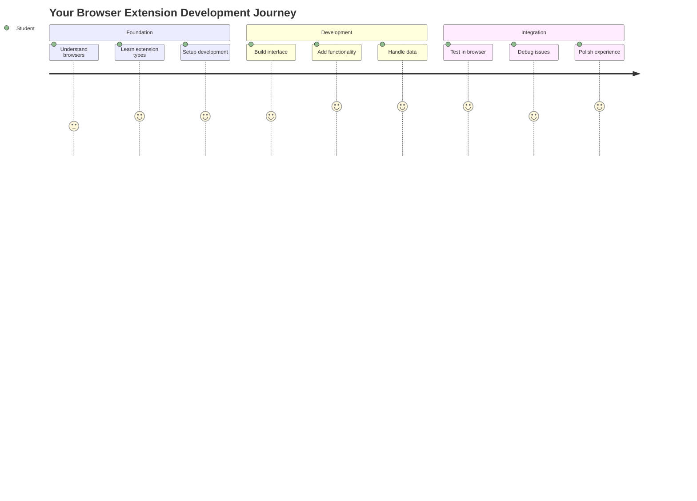
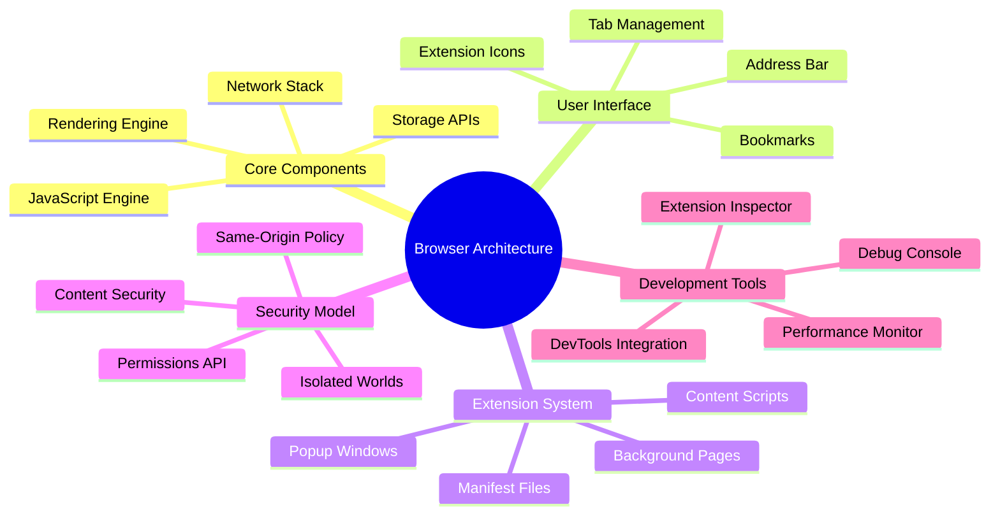
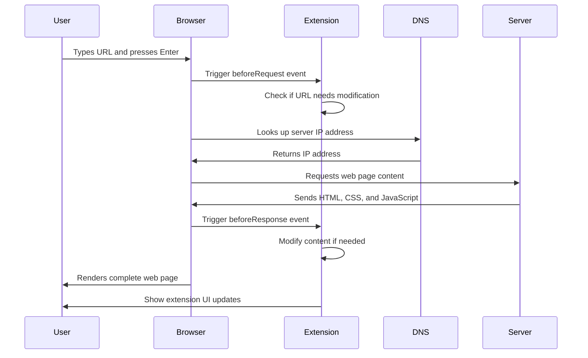
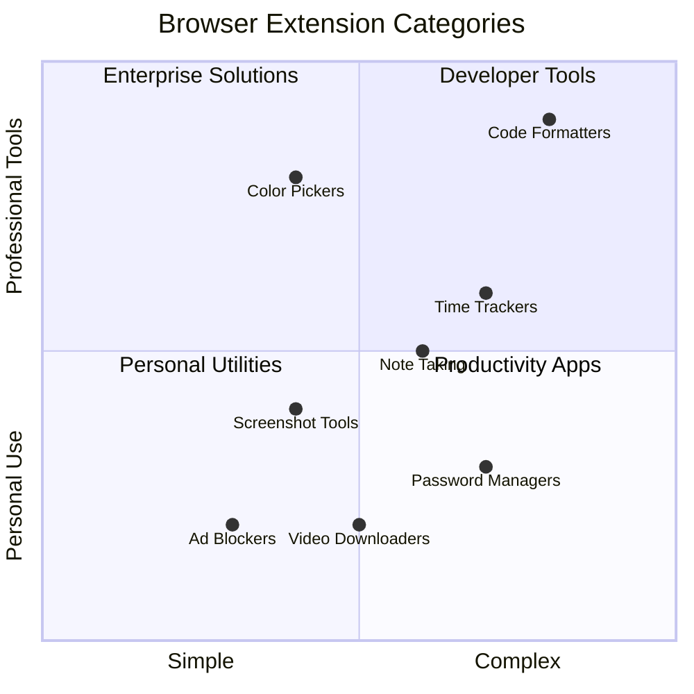
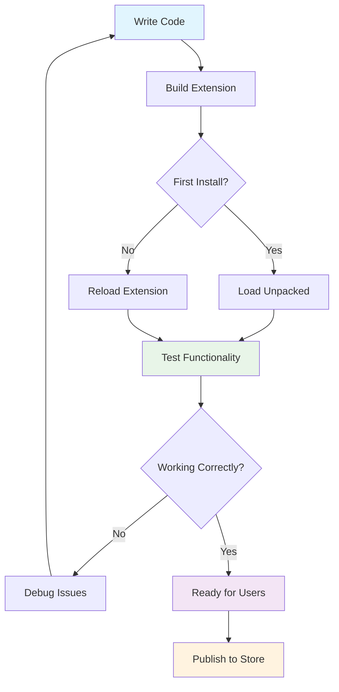
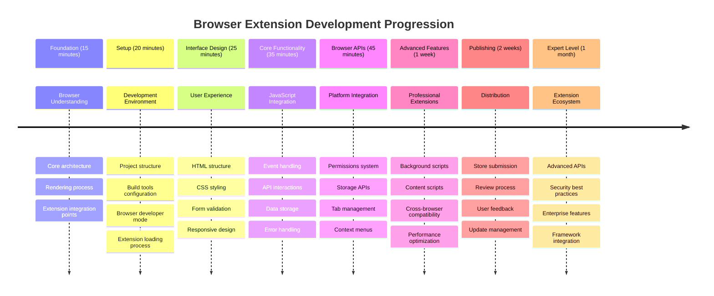

<!--
CO_OP_TRANSLATOR_METADATA:
{
  "original_hash": "00aa85715e1efd4930c17a23e3012e69",
  "translation_date": "2025-11-06T11:59:39+00:00",
  "source_file": "5-browser-extension/1-about-browsers/README.md",
  "language_code": "id"
}
-->
# Proyek Ekstensi Browser Bagian 1: Semua Tentang Browser




> Sketchnote oleh [Wassim Chegham](https://dev.to/wassimchegham/ever-wondered-what-happens-when-you-type-in-a-url-in-an-address-bar-in-a-browser-3dob)

## Kuis Pra-Pelajaran

[Kuis pra-pelajaran](https://ff-quizzes.netlify.app/web/quiz/23)

### Pengantar

Ekstensi browser adalah aplikasi mini yang meningkatkan pengalaman menjelajah web Anda. Seperti visi asli Tim Berners-Lee tentang web interaktif, ekstensi memperluas kemampuan browser melampaui sekadar melihat dokumen. Dari pengelola kata sandi yang menjaga keamanan akun Anda hingga pemilih warna yang membantu desainer mendapatkan warna yang sempurna, ekstensi menyelesaikan tantangan sehari-hari dalam menjelajah web.

Sebelum kita membangun ekstensi pertama Anda, mari kita pahami cara kerja browser. Sama seperti Alexander Graham Bell yang perlu memahami transmisi suara sebelum menciptakan telepon, mengetahui dasar-dasar browser akan membantu Anda membuat ekstensi yang terintegrasi dengan sistem browser yang ada.

Pada akhir pelajaran ini, Anda akan memahami arsitektur browser dan mulai membangun ekstensi pertama Anda.



## Memahami Browser Web

Browser web pada dasarnya adalah penerjemah dokumen yang canggih. Ketika Anda mengetik "google.com" di bilah alamat, browser melakukan serangkaian operasi kompleks - meminta konten dari server di seluruh dunia, lalu memparsing dan merender kode tersebut menjadi halaman web interaktif yang Anda lihat.

Proses ini mencerminkan bagaimana browser web pertama, WorldWideWeb, dirancang oleh Tim Berners-Lee pada tahun 1990 untuk membuat dokumen berhiperlink dapat diakses oleh semua orang.

✅ **Sedikit sejarah**: Browser pertama disebut 'WorldWideWeb' dan dibuat oleh Sir Timothy Berners-Lee pada tahun 1990.


> Beberapa browser awal, via [Karen McGrane](https://www.slideshare.net/KMcGrane/week-4-ixd-history-personal-computing)

### Bagaimana Browser Memproses Konten Web

Proses antara memasukkan URL dan melihat halaman web melibatkan beberapa langkah terkoordinasi yang terjadi dalam hitungan detik:



**Inilah yang dicapai oleh proses ini:**
- **Menerjemahkan** URL yang dapat dibaca manusia menjadi alamat IP server melalui pencarian DNS
- **Membangun** koneksi aman dengan server web menggunakan protokol HTTP atau HTTPS
- **Meminta** konten halaman web tertentu dari server
- **Menerima** markup HTML, gaya CSS, dan kode JavaScript dari server
- **Merender** semua konten menjadi halaman web interaktif yang Anda lihat

### Fitur Inti Browser

Browser modern menyediakan banyak fitur yang dapat dimanfaatkan oleh pengembang ekstensi:

| Fitur | Tujuan | Peluang Ekstensi |
|-------|--------|------------------|
| **Rendering Engine** | Menampilkan HTML, CSS, dan JavaScript | Modifikasi konten, injeksi gaya |
| **JavaScript Engine** | Menjalankan kode JavaScript | Skrip khusus, interaksi API |
| **Local Storage** | Menyimpan data secara lokal | Preferensi pengguna, data cache |
| **Network Stack** | Menangani permintaan web | Pemantauan permintaan, analisis data |
| **Security Model** | Melindungi pengguna dari konten berbahaya | Penyaringan konten, peningkatan keamanan |

**Memahami fitur-fitur ini membantu Anda:**
- **Mengidentifikasi** di mana ekstensi Anda dapat memberikan nilai tambah terbesar
- **Memilih** API browser yang tepat untuk fungsi ekstensi Anda
- **Merancang** ekstensi yang bekerja secara efisien dengan sistem browser
- **Memastikan** ekstensi Anda mengikuti praktik terbaik keamanan browser

### Pertimbangan Pengembangan Lintas-Browser

Browser yang berbeda menerapkan standar dengan variasi kecil, mirip dengan bagaimana bahasa pemrograman yang berbeda mungkin menangani algoritma yang sama secara berbeda. Chrome, Firefox, dan Safari masing-masing memiliki karakteristik unik yang harus dipertimbangkan pengembang selama pengembangan ekstensi.

> 💡 **Tip Pro**: Gunakan [caniuse.com](https://www.caniuse.com) untuk memeriksa teknologi web mana yang didukung di berbagai browser. Ini sangat berharga saat merencanakan fitur ekstensi Anda!

**Pertimbangan utama untuk pengembangan ekstensi:**
- **Uji** ekstensi Anda di browser Chrome, Firefox, dan Edge
- **Sesuaikan** dengan API ekstensi browser dan format manifest yang berbeda
- **Tangani** karakteristik kinerja dan batasan yang bervariasi
- **Sediakan** alternatif untuk fitur spesifik browser yang mungkin tidak tersedia

✅ **Wawasan Analitik**: Anda dapat menentukan browser mana yang lebih disukai pengguna Anda dengan memasang paket analitik dalam proyek pengembangan web Anda. Data ini membantu Anda memprioritaskan browser mana yang harus didukung terlebih dahulu.

## Memahami Ekstensi Browser

Ekstensi browser menyelesaikan tantangan umum dalam menjelajah web dengan menambahkan fungsionalitas langsung ke antarmuka browser. Alih-alih memerlukan aplikasi terpisah atau alur kerja yang rumit, ekstensi memberikan akses langsung ke alat dan fitur.

Konsep ini mencerminkan bagaimana para pionir komputer awal seperti Douglas Engelbart membayangkan meningkatkan kemampuan manusia dengan teknologi - ekstensi meningkatkan fungsionalitas dasar browser Anda.



**Kategori ekstensi populer dan manfaatnya:**
- **Alat Produktivitas**: Pengelola tugas, aplikasi pencatat, dan pelacak waktu yang membantu Anda tetap terorganisir
- **Peningkatan Keamanan**: Pengelola kata sandi, pemblokir iklan, dan alat privasi yang melindungi data Anda
- **Alat Pengembang**: Pemformat kode, pemilih warna, dan utilitas debugging yang menyederhanakan pengembangan
- **Peningkatan Konten**: Mode membaca, pengunduh video, dan alat tangkapan layar yang meningkatkan pengalaman web Anda

✅ **Pertanyaan Refleksi**: Apa ekstensi browser favorit Anda? Tugas spesifik apa yang mereka lakukan, dan bagaimana mereka meningkatkan pengalaman menjelajah Anda?

### 🔄 **Pemeriksaan Pedagogis**
**Pemahaman Arsitektur Browser**: Sebelum beralih ke pengembangan ekstensi, pastikan Anda dapat:
- ✅ Menjelaskan bagaimana browser memproses permintaan web dan merender konten
- ✅ Mengidentifikasi komponen utama arsitektur browser
- ✅ Memahami bagaimana ekstensi terintegrasi dengan fungsionalitas browser
- ✅ Mengenali model keamanan yang melindungi pengguna

**Tes Diri Cepat**: Bisakah Anda melacak jalur dari mengetik URL hingga melihat halaman web?
1. **Pencarian DNS** mengonversi URL ke alamat IP
2. **Permintaan HTTP** mengambil konten dari server
3. **Parsing** memproses HTML, CSS, dan JavaScript
4. **Rendering** menampilkan halaman web akhir
5. **Ekstensi** dapat memodifikasi konten di beberapa langkah

## Memasang dan Mengelola Ekstensi

Memahami proses pemasangan ekstensi membantu Anda mengantisipasi pengalaman pengguna saat mereka memasang ekstensi Anda. Proses pemasangan distandarisasi di browser modern, dengan variasi kecil dalam desain antarmuka.


> **Penting**: Pastikan untuk mengaktifkan mode pengembang dan izinkan ekstensi dari toko lain saat menguji ekstensi Anda sendiri.

### Proses Pemasangan Ekstensi Pengembangan

Saat Anda mengembangkan dan menguji ekstensi Anda sendiri, ikuti alur kerja ini:



```bash
# Step 1: Build your extension
npm run build
```

**Apa yang dicapai oleh perintah ini:**
- **Mengompilasi** kode sumber Anda menjadi file siap browser
- **Menggabungkan** modul JavaScript menjadi paket yang dioptimalkan
- **Menghasilkan** file ekstensi akhir di folder `/dist`
- **Mempersiapkan** ekstensi Anda untuk pemasangan dan pengujian

**Langkah 2: Navigasi ke Ekstensi Browser**
1. **Buka** halaman manajemen ekstensi browser Anda
2. **Klik** tombol "Pengaturan dan lainnya" (ikon `...`) di kanan atas
3. **Pilih** "Ekstensi" dari menu dropdown

**Langkah 3: Muat Ekstensi Anda**
- **Untuk pemasangan baru**: Pilih `load unpacked` dan pilih folder `/dist` Anda
- **Untuk pembaruan**: Klik `reload` di sebelah ekstensi yang sudah terpasang
- **Untuk pengujian**: Aktifkan "Mode Pengembang" untuk mengakses fitur debugging tambahan

### Pemasangan Ekstensi Produksi

> ✅ **Catatan**: Instruksi pengembangan ini khusus untuk ekstensi yang Anda buat sendiri. Untuk memasang ekstensi yang sudah diterbitkan, kunjungi toko ekstensi browser resmi seperti [Microsoft Edge Add-ons store](https://microsoftedge.microsoft.com/addons/Microsoft-Edge-Extensions-Home).

**Memahami perbedaannya:**
- **Pemasangan pengembangan** memungkinkan Anda menguji ekstensi yang belum diterbitkan selama pengembangan
- **Pemasangan dari toko** menyediakan ekstensi yang telah diverifikasi dan diterbitkan dengan pembaruan otomatis
- **Sideloading** memungkinkan pemasangan ekstensi dari luar toko resmi (memerlukan mode pengembang)

## Membangun Ekstensi Jejak Karbon Anda

Kita akan membuat ekstensi browser yang menampilkan jejak karbon dari penggunaan energi di wilayah Anda. Proyek ini menunjukkan konsep pengembangan ekstensi penting sambil menciptakan alat praktis untuk kesadaran lingkungan.

Pendekatan ini mengikuti prinsip "belajar dengan melakukan" yang telah terbukti efektif sejak teori pendidikan John Dewey - menggabungkan keterampilan teknis dengan aplikasi dunia nyata yang bermakna.

### Persyaratan Proyek

Sebelum memulai pengembangan, mari kita kumpulkan sumber daya dan dependensi yang diperlukan:

**Akses API yang Diperlukan:**
- **[Kunci API CO2 Signal](https://www.co2signal.com/)**: Masukkan alamat email Anda untuk menerima kunci API gratis Anda
- **[Kode wilayah](http://api.electricitymap.org/v3/zones)**: Temukan kode wilayah Anda menggunakan [Electricity Map](https://www.electricitymap.org/map) (misalnya, Boston menggunakan 'US-NEISO')

**Alat Pengembangan:**
- **[Node.js dan NPM](https://www.npmjs.com)**: Alat manajemen paket untuk memasang dependensi proyek
- **[Kode awal](../../../../5-browser-extension/start)**: Unduh folder `start` untuk memulai pengembangan

✅ **Pelajari Lebih Lanjut**: Tingkatkan keterampilan manajemen paket Anda dengan [modul pembelajaran komprehensif ini](https://docs.microsoft.com/learn/modules/create-nodejs-project-dependencies/?WT.mc_id=academic-77807-sagibbon)

### Memahami Struktur Proyek

Memahami struktur proyek membantu mengatur pekerjaan pengembangan secara efisien. Seperti bagaimana Perpustakaan Alexandria diorganisasi untuk pengambilan pengetahuan yang mudah, basis kode yang terstruktur dengan baik membuat pengembangan lebih efisien:

```
project-root/
├── dist/                    # Built extension files
│   ├── manifest.json        # Extension configuration
│   ├── index.html           # User interface markup
│   ├── background.js        # Background script functionality
│   └── main.js              # Compiled JavaScript bundle
├── src/                     # Source development files
│   └── index.js             # Your main JavaScript code
├── package.json             # Project dependencies and scripts
└── webpack.config.js        # Build configuration
```

**Memecah apa yang dicapai oleh setiap file:**
- **`manifest.json`**: **Mendefinisikan** metadata ekstensi, izin, dan titik masuk
- **`index.html`**: **Membuat** antarmuka pengguna yang muncul saat pengguna mengklik ekstensi Anda
- **`background.js`**: **Menangani** tugas latar belakang dan pendengar acara browser
- **`main.js`**: **Berisi** JavaScript yang telah digabungkan setelah proses build
- **`src/index.js`**: **Menampung** kode pengembangan utama Anda yang dikompilasi menjadi `main.js`

> 💡 **Tip Organisasi**: Simpan kunci API dan kode wilayah Anda dalam catatan aman untuk referensi mudah selama pengembangan. Anda akan membutuhkan nilai-nilai ini untuk menguji fungsionalitas ekstensi Anda.

✅ **Catatan Keamanan**: Jangan pernah menyimpan kunci API atau kredensial sensitif ke dalam repositori kode Anda. Kami akan menunjukkan cara menangani ini dengan aman di langkah berikutnya.

## Membuat Antarmuka Ekstensi

Sekarang kita akan membangun komponen antarmuka pengguna. Ekstensi menggunakan pendekatan dua layar: layar konfigurasi untuk pengaturan awal dan layar hasil untuk menampilkan data.

Ini mengikuti prinsip pengungkapan progresif yang digunakan dalam desain antarmuka sejak awal komputasi - mengungkapkan informasi dan opsi dalam urutan logis untuk menghindari membebani pengguna.

### Ikhtisar Tampilan Ekstensi

**Tampilan Pengaturan** - Konfigurasi pengguna pertama kali:


**Tampilan Hasil** - Tampilan data jejak karbon:


### Membuat Formulir Konfigurasi

Formulir pengaturan mengumpulkan data konfigurasi pengguna selama penggunaan awal. Setelah dikonfigurasi, informasi ini akan disimpan di penyimpanan browser untuk sesi mendatang.

Di file `/dist/index.html`, tambahkan struktur formulir ini:

```html
<form class="form-data" autocomplete="on">
    <div>
        <h2>New? Add your Information</h2>
    </div>
    <div>
        <label for="region">Region Name</label>
        <input type="text" id="region" required class="region-name" />
    </div>
    <div>
        <label for="api">Your API Key from tmrow</label>
        <input type="text" id="api" required class="api-key" />
    </div>
    <button class="search-btn">Submit</button>
</form>
```

**Inilah yang dicapai oleh formulir ini:**
- **Membuat** struktur formulir semantik dengan label yang tepat dan asosiasi input
- **Mengaktifkan** fungsi pengisian otomatis browser untuk pengalaman pengguna yang lebih baik
- **Memerlukan** kedua bidang diisi sebelum pengiriman menggunakan atribut `required`
- **Mengorganisasi** input dengan nama kelas deskriptif untuk penargetan styling dan JavaScript yang mudah
- **Memberikan** instruksi yang jelas untuk pengguna yang mengatur ekstensi untuk pertama kalinya

### Membuat Tampilan Hasil

Selanjutnya, buat area hasil yang akan menampilkan data jejak karbon. Tambahkan HTML ini di bawah formulir:

```html
<div class="result">
    <div class="loading">loading...</div>
    <div class="errors"></div>
    <div class="data"></div>
    <div class="result-container">
        <p><strong>Region: </strong><span class="my-region"></span></p>
        <p><strong>Carbon Usage: </strong><span class="carbon-usage"></span></p>
        <p><strong>Fossil Fuel Percentage: </strong><span class="fossil-fuel"></span></p>
    </div>
    <button class="clear-btn">Change region</button>
</div>
```

**Memecah apa yang disediakan oleh struktur ini:**
- **`loading`**: **Menampilkan** pesan pemuatan saat data API sedang diambil
- **`errors`**: **Menunjukkan** pesan kesalahan jika panggilan API gagal atau data tidak valid
- **`data`**: **Menampung** data mentah untuk debugging selama pengembangan
- **`result-container`**: **Menyajikan** informasi jejak karbon yang diformat kepada pengguna
- **`clear-btn`**: **Memungkinkan** pengguna untuk mengubah wilayah mereka dan mengonfigurasi ulang ekstensi

### Menyiapkan Proses Build

Sekarang mari kita pasang dependensi proyek dan uji proses build:

```bash
npm install
```

**Apa yang dicapai oleh proses pemasangan ini:**
- **Mengunduh** Webpack dan dependensi pengembangan lainnya yang ditentukan dalam `package.json`
- **Mengonfigurasi** toolchain build untuk mengompilasi JavaScript modern
- **Mempersiapkan** lingkungan pengembangan untuk membangun dan menguji ekstensi
- **Mengaktifkan** penggabungan kode, optimasi, dan fitur kompatibilitas lintas-browser

> 💡 **Wawasan Proses Build**: Webpack menggabungkan kode sumber Anda dari `/src/index.js` menjadi `/dist/main.js`. Proses ini mengoptimalkan kode Anda untuk produksi dan memastikan kompatibilitas browser.

### Menguji Kemajuan Anda

Pada titik ini, Anda dapat menguji ekstensi Anda:
1. **Jalankan** perintah build untuk mengompilasi kode Anda  
2. **Muat** ekstensi ke dalam browser Anda menggunakan mode pengembang  
3. **Verifikasi** bahwa formulir ditampilkan dengan benar dan terlihat profesional  
4. **Periksa** bahwa semua elemen formulir sejajar dengan baik dan berfungsi dengan semestinya  

**Apa yang telah Anda capai:**  
- **Membangun** struktur HTML dasar untuk ekstensi Anda  
- **Membuat** antarmuka konfigurasi dan hasil dengan markup semantik yang tepat  
- **Menyiapkan** alur kerja pengembangan modern menggunakan alat standar industri  
- **Mempersiapkan** dasar untuk menambahkan fungsionalitas JavaScript interaktif  

### 🔄 **Pengecekan Pedagogis**  
**Kemajuan Pengembangan Ekstensi**: Verifikasi pemahaman Anda sebelum melanjutkan:  
- ✅ Bisakah Anda menjelaskan tujuan setiap file dalam struktur proyek?  
- ✅ Apakah Anda memahami bagaimana proses build mengubah kode sumber Anda?  
- ✅ Mengapa kita memisahkan konfigurasi dan hasil ke dalam bagian UI yang berbeda?  
- ✅ Bagaimana struktur formulir mendukung kegunaan dan aksesibilitas?  

**Pemahaman Alur Kerja Pengembangan**: Anda sekarang seharusnya dapat:  
1. **Memodifikasi** HTML dan CSS untuk antarmuka ekstensi Anda  
2. **Jalankan** perintah build untuk mengompilasi perubahan Anda  
3. **Muat ulang** ekstensi di browser Anda untuk menguji pembaruan  
4. **Debug** masalah menggunakan alat pengembang browser  

Anda telah menyelesaikan fase pertama pengembangan ekstensi browser. Seperti halnya Wright bersaudara yang pertama kali harus memahami aerodinamika sebelum mencapai penerbangan, memahami konsep dasar ini mempersiapkan Anda untuk membangun fitur interaktif yang lebih kompleks di pelajaran berikutnya.  

## Tantangan Agen GitHub Copilot 🚀  

Gunakan mode Agen untuk menyelesaikan tantangan berikut:  

**Deskripsi:** Tingkatkan ekstensi browser dengan menambahkan validasi formulir dan fitur umpan balik pengguna untuk meningkatkan pengalaman pengguna saat memasukkan kunci API dan kode wilayah.  

**Prompt:** Buat fungsi validasi JavaScript yang memeriksa apakah bidang kunci API berisi setidaknya 20 karakter dan apakah kode wilayah mengikuti format yang benar (seperti 'US-NEISO'). Tambahkan umpan balik visual dengan mengubah warna batas input menjadi hijau untuk input yang valid dan merah untuk input yang tidak valid. Juga tambahkan fitur toggle untuk menampilkan/menyembunyikan kunci API demi keamanan.  

Pelajari lebih lanjut tentang [mode agen](https://code.visualstudio.com/blogs/2025/02/24/introducing-copilot-agent-mode) di sini.  

## 🚀 Tantangan  

Lihat toko ekstensi browser dan instal salah satu ke browser Anda. Anda dapat memeriksa file-file ekstensi tersebut dengan cara yang menarik. Apa yang Anda temukan?  

## Kuis Pasca-Pelajaran  

[Kuis pasca-pelajaran](https://ff-quizzes.netlify.app/web/quiz/24)  

## Tinjauan & Studi Mandiri  

Dalam pelajaran ini Anda belajar sedikit tentang sejarah browser web; manfaatkan kesempatan ini untuk mempelajari bagaimana para penemu World Wide Web membayangkan penggunaannya dengan membaca lebih lanjut tentang sejarahnya. Beberapa situs yang berguna meliputi:  

[Sejarah Browser Web](https://www.mozilla.org/firefox/browsers/browser-history/)  

[Sejarah Web](https://webfoundation.org/about/vision/history-of-the-web/)  

[Wawancara dengan Tim Berners-Lee](https://www.theguardian.com/technology/2019/mar/12/tim-berners-lee-on-30-years-of-the-web-if-we-dream-a-little-we-can-get-the-web-we-want)  

### ⚡ **Apa yang Bisa Anda Lakukan dalam 5 Menit Berikutnya**  
- [ ] Buka halaman ekstensi Chrome/Edge (chrome://extensions) dan eksplorasi apa yang telah Anda instal  
- [ ] Lihat tab Jaringan di DevTools browser Anda saat memuat sebuah halaman web  
- [ ] Coba lihat sumber halaman (Ctrl+U) untuk melihat struktur HTML  
- [ ] Inspeksi elemen halaman web dan modifikasi CSS-nya di DevTools  

### 🎯 **Apa yang Bisa Anda Capai dalam Satu Jam**  
- [ ] Selesaikan kuis pasca-pelajaran dan pahami dasar-dasar browser  
- [ ] Buat file manifest.json dasar untuk ekstensi browser  
- [ ] Bangun ekstensi "Hello World" sederhana yang menampilkan popup  
- [ ] Uji memuat ekstensi Anda dalam mode pengembang  
- [ ] Jelajahi dokumentasi ekstensi browser untuk browser target Anda  

### 📅 **Perjalanan Ekstensi Anda Selama Seminggu**  
- [ ] Selesaikan ekstensi browser yang fungsional dengan utilitas nyata  
- [ ] Pelajari tentang skrip konten, skrip latar belakang, dan interaksi popup  
- [ ] Kuasai API browser seperti penyimpanan, tab, dan pesan  
- [ ] Rancang antarmuka yang ramah pengguna untuk ekstensi Anda  
- [ ] Uji ekstensi Anda di berbagai situs web dan skenario  
- [ ] Publikasikan ekstensi Anda ke toko ekstensi browser  

### 🌟 **Pengembangan Browser Anda Selama Sebulan**  
- [ ] Bangun beberapa ekstensi yang menyelesaikan berbagai masalah pengguna  
- [ ] Pelajari API browser tingkat lanjut dan praktik keamanan terbaik  
- [ ] Berkontribusi pada proyek ekstensi browser open source  
- [ ] Kuasai kompatibilitas lintas-browser dan peningkatan progresif  
- [ ] Buat alat dan template pengembangan ekstensi untuk orang lain  
- [ ] Jadilah ahli ekstensi browser yang membantu pengembang lain  

## 🎯 Garis Waktu Penguasaan Ekstensi Browser Anda  


  
### 🛠️ Ringkasan Toolkit Pengembangan Ekstensi Anda  

Setelah menyelesaikan pelajaran ini, Anda sekarang memiliki:  
- **Pengetahuan Arsitektur Browser**: Pemahaman tentang mesin rendering, model keamanan, dan integrasi ekstensi  
- **Lingkungan Pengembangan**: Toolchain modern dengan Webpack, NPM, dan kemampuan debugging  
- **Dasar UI/UX**: Struktur HTML semantik dengan pola pengungkapan progresif  
- **Kesadaran Keamanan**: Pemahaman tentang izin browser dan praktik pengembangan yang aman  
- **Konsep Lintas-Browser**: Pengetahuan tentang pertimbangan kompatibilitas dan pendekatan pengujian  
- **Integrasi API**: Dasar untuk bekerja dengan sumber data eksternal  
- **Alur Kerja Profesional**: Prosedur pengembangan dan pengujian standar industri  

**Aplikasi Dunia Nyata**: Keterampilan ini langsung berlaku untuk:  
- **Pengembangan Web**: Aplikasi halaman tunggal dan aplikasi web progresif  
- **Aplikasi Desktop**: Perangkat lunak desktop berbasis web dan Electron  
- **Pengembangan Mobile**: Aplikasi hybrid dan solusi mobile berbasis web  
- **Alat Perusahaan**: Aplikasi produktivitas internal dan otomatisasi alur kerja  
- **Open Source**: Berkontribusi pada proyek ekstensi browser dan standar web  

**Tingkat Berikutnya**: Anda siap untuk menambahkan fungsionalitas interaktif, bekerja dengan API browser, dan membuat ekstensi yang menyelesaikan masalah nyata pengguna!  

## Tugas  

[Ubah gaya ekstensi Anda](assignment.md)  

---

**Penafian**:  
Dokumen ini telah diterjemahkan menggunakan layanan penerjemahan AI [Co-op Translator](https://github.com/Azure/co-op-translator). Meskipun kami berupaya untuk memberikan hasil yang akurat, harap diketahui bahwa terjemahan otomatis dapat mengandung kesalahan atau ketidakakuratan. Dokumen asli dalam bahasa aslinya harus dianggap sebagai sumber yang otoritatif. Untuk informasi yang bersifat kritis, disarankan menggunakan jasa penerjemahan manusia profesional. Kami tidak bertanggung jawab atas kesalahpahaman atau penafsiran yang timbul dari penggunaan terjemahan ini.